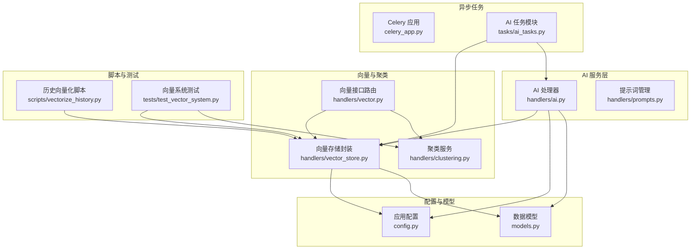
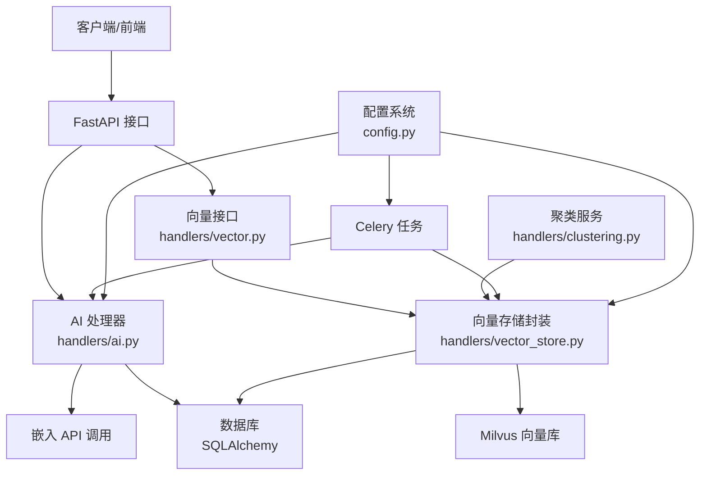
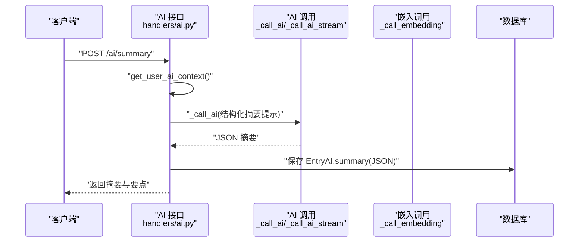
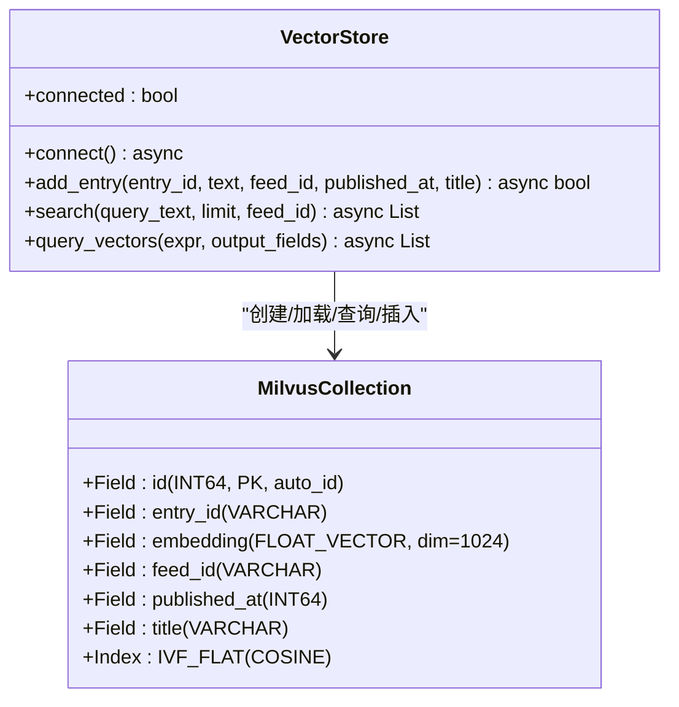
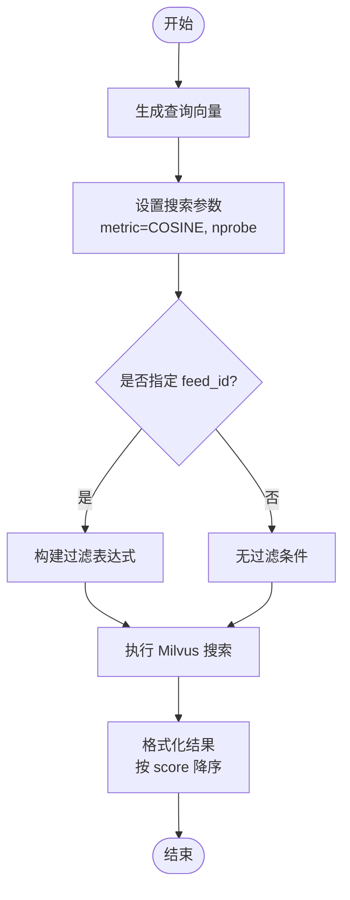
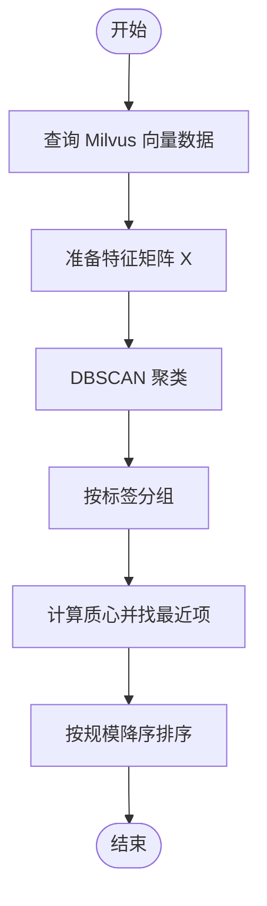
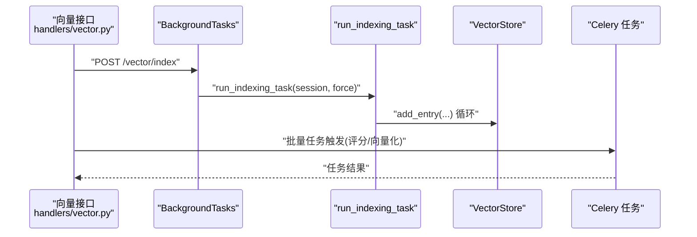
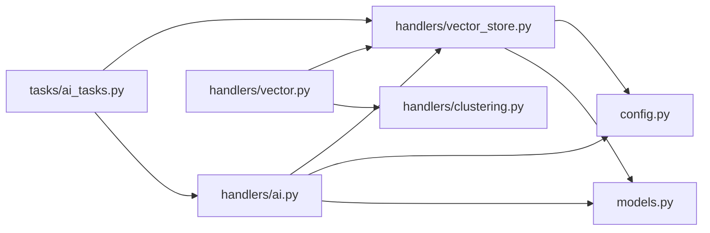

# AI与向量系统

<cite>
**本文引用的文件**
- [python-backend/app/handlers/ai.py](file://python-backend/app/handlers/ai.py)
- [python-backend/app/handlers/vector.py](file://python-backend/app/handlers/vector.py)
- [python-backend/app/handlers/vector_store.py](file://python-backend/app/handlers/vector_store.py)
- [python-backend/app/handlers/clustering.py](file://python-backend/app/handlers/clustering.py)
- [python-backend/app/tasks/ai_tasks.py](file://python-backend/app/tasks/ai_tasks.py)
- [python-backend/app/celery_app.py](file://python-backend/app/celery_app.py)
- [python-backend/app/config.py](file://python-backend/app/config.py)
- [python-backend/app/models.py](file://python-backend/app/models.py)
- [python-backend/scripts/vectorize_history.py](file://python-backend/scripts/vectorize_history.py)
- [python-backend/tests/test_vector_system.py](file://python-backend/tests/test_vector_system.py)
</cite>

## 目录
1. [简介](#简介)
2. [项目结构](#项目结构)
3. [核心组件](#核心组件)
4. [架构总览](#架构总览)
5. [详细组件分析](#详细组件分析)
6. [依赖分析](#依赖分析)
7. [性能考虑](#性能考虑)
8. [故障排查指南](#故障排查指南)
9. [结论](#结论)
10. [附录](#附录)

## 简介
本文件面向 Tan RSS Reader 的 AI 与向量系统，系统目标包括：
- AI 服务集成：OpenAI 兼容 API 调用、摘要生成、多语言翻译、内容质量评分与趋势分析。
- 向量数据库 Milvus 集成：向量嵌入生成、语义搜索、内容聚类与主题提取。
- 异步处理：Celery 任务队列与后台任务，支持批量质量评分与向量化。
- 配置与优化：AI 服务配置、性能优化与成本控制策略。
- 查询优化：相似度计算、结果排序与检索策略。
- 监控与日志：错误处理、日志记录与故障恢复。

## 项目结构
后端采用 FastAPI + SQLAlchemy 异步 ORM，AI 与向量相关逻辑集中在 handlers、tasks 与 scripts 目录中；配置通过 pydantic-settings 统一管理。

图表来源
- [python-backend/app/handlers/ai.py:1-1157](file://python-backend/app/handlers/ai.py#L1-L1157)
- [python-backend/app/handlers/vector_store.py:1-197](file://python-backend/app/handlers/vector_store.py#L1-L197)
- [python-backend/app/handlers/vector.py:1-158](file://python-backend/app/handlers/vector.py#L1-L158)
- [python-backend/app/handlers/clustering.py:1-142](file://python-backend/app/handlers/clustering.py#L1-L142)
- [python-backend/app/tasks/ai_tasks.py:1-87](file://python-backend/app/tasks/ai_tasks.py#L1-L87)
- [python-backend/app/celery_app.py:1-23](file://python-backend/app/celery_app.py#L1-L23)
- [python-backend/app/config.py:1-75](file://python-backend/app/config.py#L1-L75)
- [python-backend/app/models.py:1-228](file://python-backend/app/models.py#L1-L228)
- [python-backend/scripts/vectorize_history.py:1-137](file://python-backend/scripts/vectorize_history.py#L1-L137)
- [python-backend/tests/test_vector_system.py:1-85](file://python-backend/tests/test_vector_system.py#L1-L85)

章节来源
- [python-backend/app/handlers/ai.py:1-1157](file://python-backend/app/handlers/ai.py#L1-L1157)
- [python-backend/app/handlers/vector.py:1-158](file://python-backend/app/handlers/vector.py#L1-L158)
- [python-backend/app/handlers/vector_store.py:1-197](file://python-backend/app/handlers/vector_store.py#L1-L197)
- [python-backend/app/handlers/clustering.py:1-142](file://python-backend/app/handlers/clustering.py#L1-L142)
- [python-backend/app/tasks/ai_tasks.py:1-87](file://python-backend/app/tasks/ai_tasks.py#L1-L87)
- [python-backend/app/celery_app.py:1-23](file://python-backend/app/celery_app.py#L1-L23)
- [python-backend/app/config.py:1-75](file://python-backend/app/config.py#L1-L75)
- [python-backend/app/models.py:1-228](file://python-backend/app/models.py#L1-L228)
- [python-backend/scripts/vectorize_history.py:1-137](file://python-backend/scripts/vectorize_history.py#L1-L137)
- [python-backend/tests/test_vector_system.py:1-85](file://python-backend/tests/test_vector_system.py#L1-L85)

## 核心组件
- AI 处理器：负责用户上下文合并、AI API 调用（含流式）、摘要/翻译/趋势分析、质量评分与配置管理。
- 向量存储封装：封装 Milvus 连接、集合初始化、向量插入、查询与搜索。
- 聚类服务：基于 DBSCAN 的语义聚类，输出主题与统计信息。
- 异步任务：Celery 批量质量评分与向量化任务。
- 配置系统：统一管理 AI 服务、Milvus 与 Redis 等外部依赖。
- 数据模型：定义 AI 配置、条目与 AI 结果等持久化结构。

章节来源
- [python-backend/app/handlers/ai.py:34-171](file://python-backend/app/handlers/ai.py#L34-L171)
- [python-backend/app/handlers/vector_store.py:18-94](file://python-backend/app/handlers/vector_store.py#L18-L94)
- [python-backend/app/handlers/clustering.py:10-142](file://python-backend/app/handlers/clustering.py#L10-L142)
- [python-backend/app/tasks/ai_tasks.py:16-87](file://python-backend/app/tasks/ai_tasks.py#L16-L87)
- [python-backend/app/config.py:41-75](file://python-backend/app/config.py#L41-L75)
- [python-backend/app/models.py:52-124](file://python-backend/app/models.py#L52-L124)

## 架构总览
系统围绕“AI 服务 + 向量数据库 + 异步任务”展开，FastAPI 提供对外接口，AI 与向量操作通过封装模块完成，Celery 负责后台批处理。

图表来源
- [python-backend/app/handlers/ai.py:173-346](file://python-backend/app/handlers/ai.py#L173-L346)
- [python-backend/app/handlers/vector.py:108-158](file://python-backend/app/handlers/vector.py#L108-L158)
- [python-backend/app/handlers/vector_store.py:23-194](file://python-backend/app/handlers/vector_store.py#L23-L194)
- [python-backend/app/tasks/ai_tasks.py:16-87](file://python-backend/app/tasks/ai_tasks.py#L16-L87)
- [python-backend/app/config.py:41-75](file://python-backend/app/config.py#L41-L75)

## 详细组件分析

### AI 服务集成与摘要/翻译/质量评分
- 用户上下文合并：根据会员等级与用户自定义配置，动态选择 AI 服务与向量配置，并在使用平台额度时记录调用量。
- AI API 调用：支持非流式与流式两种模式，内置指数回退重试与错误处理。
- 摘要生成：对条目内容进行结构化 JSON 输出，缓存至 EntryAI 表。
- 翻译：支持标题与正文翻译，按字段与语言维度缓存。
- 趋势分析：对一组摘要生成趋势预测、情感分数、关键词与摘要。
- 内容质量评分：可选的自动评分任务，写回 Entry.quality_score。

图表来源
- [python-backend/app/handlers/ai.py:616-707](file://python-backend/app/handlers/ai.py#L616-L707)
- [python-backend/app/handlers/ai.py:173-228](file://python-backend/app/handlers/ai.py#L173-L228)
- [python-backend/app/handlers/ai.py:313-345](file://python-backend/app/handlers/ai.py#L313-L345)

章节来源
- [python-backend/app/handlers/ai.py:98-171](file://python-backend/app/handlers/ai.py#L98-L171)
- [python-backend/app/handlers/ai.py:616-707](file://python-backend/app/handlers/ai.py#L616-L707)
- [python-backend/app/handlers/ai.py:717-792](file://python-backend/app/handlers/ai.py#L717-L792)
- [python-backend/app/handlers/ai.py:279-311](file://python-backend/app/handlers/ai.py#L279-L311)
- [python-backend/app/handlers/ai.py:933-950](file://python-backend/app/handlers/ai.py#L933-L950)

### 向量数据库 Milvus 集成
- 连接与集合：支持本地 Milvus Lite 与远程 Milvus，自动建表与加载索引。
- 向量插入：生成嵌入、去重旧版本、批量插入。
- 语义搜索：对查询文本生成嵌入，执行 COSINE 相似度检索，支持按 feed_id 过滤。
- 查询与分析：支持按表达式查询向量数据，用于聚类与统计。

图表来源
- [python-backend/app/handlers/vector_store.py:18-197](file://python-backend/app/handlers/vector_store.py#L18-L197)

章节来源
- [python-backend/app/handlers/vector_store.py:23-94](file://python-backend/app/handlers/vector_store.py#L23-L94)
- [python-backend/app/handlers/vector_store.py:92-128](file://python-backend/app/handlers/vector_store.py#L92-L128)
- [python-backend/app/handlers/vector_store.py:130-178](file://python-backend/app/handlers/vector_store.py#L130-L178)

### 向量检索与查询优化
- 相似度计算：COSINE 距离（1 - 余弦相似度），阈值由 DBSCAN 的 eps 控制。
- 查询优化：nprobe 参数控制扫描倒排表数量；按 feed_id 过滤缩小搜索空间；限制返回条数。
- 结果排序：按相似度分数降序排列。

图表来源
- [python-backend/app/handlers/vector_store.py:130-178](file://python-backend/app/handlers/vector_store.py#L130-L178)

章节来源
- [python-backend/app/handlers/vector_store.py:130-178](file://python-backend/app/handlers/vector_store.py#L130-L178)

### 内容聚类与主题提取
- 聚类算法：DBSCAN，度量为 cosine，eps 控制相似度阈值，min_samples 控制簇规模。
- 主题提取：计算簇质心向量，选择与质心最相似的标题作为代表主题。
- 时间分布统计：按日期聚合条目数量，辅助趋势分析。

图表来源
- [python-backend/app/handlers/clustering.py:14-139](file://python-backend/app/handlers/clustering.py#L14-L139)

章节来源
- [python-backend/app/handlers/clustering.py:14-139](file://python-backend/app/handlers/clustering.py#L14-L139)

### 异步处理机制（Celery 与后台任务）
- Celery 配置：Redis 作为 Broker/Backend，启用 JSON 序列化与 UTC。
- 批量质量评分：遍历条目，调用 AI 质量评分，更新数据库。
- 自动向量化：连接 Milvus，批量插入新条目向量。
- 后台触发：向量索引接口通过 BackgroundTasks 触发后台任务。

图表来源
- [python-backend/app/handlers/vector.py:146-158](file://python-backend/app/handlers/vector.py#L146-L158)
- [python-backend/app/tasks/ai_tasks.py:16-87](file://python-backend/app/tasks/ai_tasks.py#L16-L87)
- [python-backend/app/celery_app.py:7-22](file://python-backend/app/celery_app.py#L7-L22)

章节来源
- [python-backend/app/celery_app.py:1-23](file://python-backend/app/celery_app.py#L1-L23)
- [python-backend/app/tasks/ai_tasks.py:16-87](file://python-backend/app/tasks/ai_tasks.py#L16-L87)
- [python-backend/app/handlers/vector.py:146-158](file://python-backend/app/handlers/vector.py#L146-L158)

### 历史数据向量化与脚本
- 初始化 AI 配置：从数据库加载默认配置。
- 并发控制：使用信号量限制并发，避免触发限流。
- 跳过已存在：可选择跳过已向量化的条目，或强制重新向量化。
- 进度统计：记录成功/跳过/失败数量。

章节来源
- [python-backend/scripts/vectorize_history.py:25-129](file://python-backend/scripts/vectorize_history.py#L25-L129)

### 测试与验证
- 向量系统测试：添加示例条目、执行搜索与聚类，验证基本流程。

章节来源
- [python-backend/tests/test_vector_system.py:17-81](file://python-backend/tests/test_vector_system.py#L17-L81)

## 依赖分析
- 外部依赖：FastAPI、SQLAlchemy、PyMilvus、Celery、Redis、sklearn、httpx。
- 内部耦合：AI 处理器依赖向量存储与配置；向量接口依赖向量存储与聚类；任务模块依赖向量存储与 AI 工具函数。

图表来源
- [python-backend/app/handlers/ai.py:1-1157](file://python-backend/app/handlers/ai.py#L1-L1157)
- [python-backend/app/handlers/vector_store.py:1-197](file://python-backend/app/handlers/vector_store.py#L1-L197)
- [python-backend/app/handlers/vector.py:1-158](file://python-backend/app/handlers/vector.py#L1-L158)
- [python-backend/app/handlers/clustering.py:1-142](file://python-backend/app/handlers/clustering.py#L1-L142)
- [python-backend/app/tasks/ai_tasks.py:1-87](file://python-backend/app/tasks/ai_tasks.py#L1-L87)
- [python-backend/app/config.py:1-75](file://python-backend/app/config.py#L1-L75)
- [python-backend/app/models.py:1-228](file://python-backend/app/models.py#L1-L228)

章节来源
- [python-backend/app/handlers/ai.py:1-1157](file://python-backend/app/handlers/ai.py#L1-L1157)
- [python-backend/app/handlers/vector_store.py:1-197](file://python-backend/app/handlers/vector_store.py#L1-L197)
- [python-backend/app/handlers/vector.py:1-158](file://python-backend/app/handlers/vector.py#L1-L158)
- [python-backend/app/handlers/clustering.py:1-142](file://python-backend/app/handlers/clustering.py#L1-L142)
- [python-backend/app/tasks/ai_tasks.py:1-87](file://python-backend/app/tasks/ai_tasks.py#L1-L87)
- [python-backend/app/config.py:1-75](file://python-backend/app/config.py#L1-L75)
- [python-backend/app/models.py:1-228](file://python-backend/app/models.py#L1-L228)

## 性能考虑
- 并发与限流
  - 向量历史脚本使用信号量限制并发，避免触发上游限流或 Milvus 压力过大。
  - 向量插入前先删除旧版本，避免重复与索引膨胀。
- 搜索参数调优
  - nprobe 控制召回与延迟的平衡；feed_id 过滤缩小搜索空间。
  - COSINE 索引类型与参数需与数据分布匹配。
- 文本预处理
  - 历史向量化脚本清理 HTML 标签与空白，减少噪声。
- 批处理与缓存
  - Celery 批量任务提升吞吐；AI 结果缓存于 EntryAI，避免重复计算。
- 成本控制
  - 使用平台额度时记录调用量；用户可自备 API Key；可配置本地或私有部署以降低成本。

章节来源
- [python-backend/scripts/vectorize_history.py:62-122](file://python-backend/scripts/vectorize_history.py#L62-L122)
- [python-backend/app/handlers/vector_store.py:113-128](file://python-backend/app/handlers/vector_store.py#L113-L128)
- [python-backend/app/handlers/vector_store.py:140-143](file://python-backend/app/handlers/vector_store.py#L140-L143)
- [python-backend/app/handlers/ai.py:154-169](file://python-backend/app/handlers/ai.py#L154-L169)

## 故障排查指南
- Milvus 连接失败
  - 检查主机与端口配置；本地 Lite 使用 .db 文件路径；确认集合已创建并加载。
- 向量插入失败
  - 嵌入维度不匹配（应为 1024）；检查嵌入 API 可用性；查看日志异常堆栈。
- 搜索无结果
  - 检查 nprobe 是否过低；确认 feed_id 过滤是否正确；核对集合是否已加载。
- 聚类异常
  - 输入向量为空或维度不一致；调整 DBSCAN eps 与 min_samples；确保 Milvus 查询成功。
- Celery 任务失败
  - 检查 Redis 连通性；查看任务日志；确认任务序列化为 JSON。
- AI 调用错误
  - 检查 API Key 与 Base URL；关注 429 速率限制与指数回退；查看流式响应解析。

章节来源
- [python-backend/app/handlers/vector_store.py:23-54](file://python-backend/app/handlers/vector_store.py#L23-L54)
- [python-backend/app/handlers/vector_store.py:92-128](file://python-backend/app/handlers/vector_store.py#L92-L128)
- [python-backend/app/handlers/vector_store.py:130-178](file://python-backend/app/handlers/vector_store.py#L130-L178)
- [python-backend/app/handlers/clustering.py:25-32](file://python-backend/app/handlers/clustering.py#L25-L32)
- [python-backend/app/tasks/ai_tasks.py:58-84](file://python-backend/app/tasks/ai_tasks.py#L58-L84)
- [python-backend/app/handlers/ai.py:195-228](file://python-backend/app/handlers/ai.py#L195-L228)

## 结论
该系统通过统一的 AI 与向量模块，实现了从内容理解、语义检索到主题聚类的完整链路，并借助 Celery 实现了高效的异步批处理。通过合理的配置、查询参数与并发控制，可在保证性能的同时降低运营成本。建议持续完善监控与告警，增强异常恢复能力，并根据业务增长迭代索引与聚类策略。

## 附录
- 关键配置项
  - AI 服务：API Key、Base URL、模型名、是否带 Key。
  - 向量库：Milvus 主机、端口、集合名。
  - 功能开关：自动摘要、自动翻译、自动标题翻译、自动质量评分、默认翻译语言。
- 数据模型要点
  - AI 配置与使用记录：ai_configs、user_usages。
  - 条目与 AI 结果：entries、entry_ai。
- 常用接口
  - /ai/config、/ai/user/config：配置读取与更新。
  - /ai/summary、/ai/translate、/ai/translate-title：摘要与翻译。
  - /vector/connect、/vector/search、/vector/index、/vector/cluster、/vector/cluster/analyze：向量与聚类。
  - /ai/test：连通性测试。

章节来源
- [python-backend/app/config.py:41-75](file://python-backend/app/config.py#L41-L75)
- [python-backend/app/models.py:98-124](file://python-backend/app/models.py#L98-L124)
- [python-backend/app/handlers/ai.py:373-504](file://python-backend/app/handlers/ai.py#L373-L504)
- [python-backend/app/handlers/vector.py:38-106](file://python-backend/app/handlers/vector.py#L38-L106)