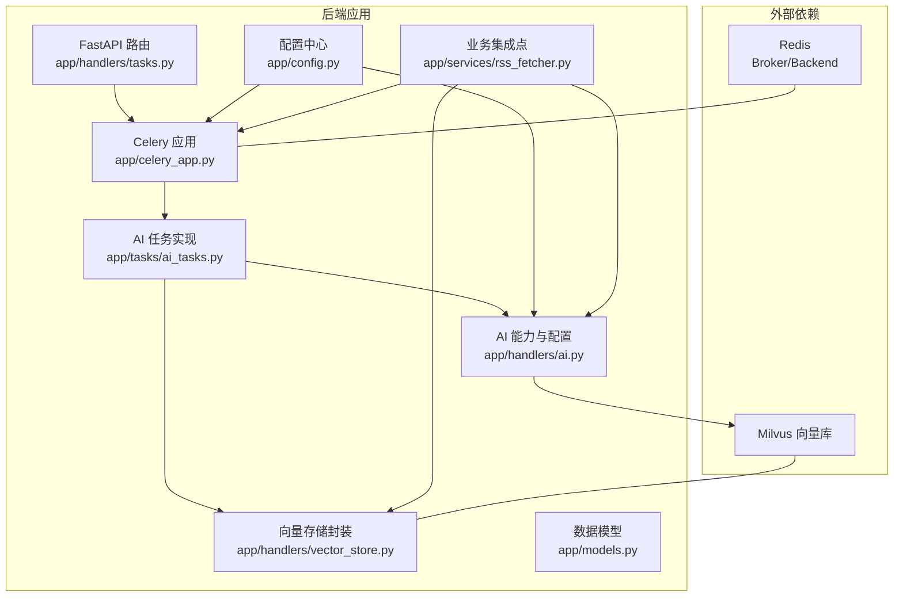
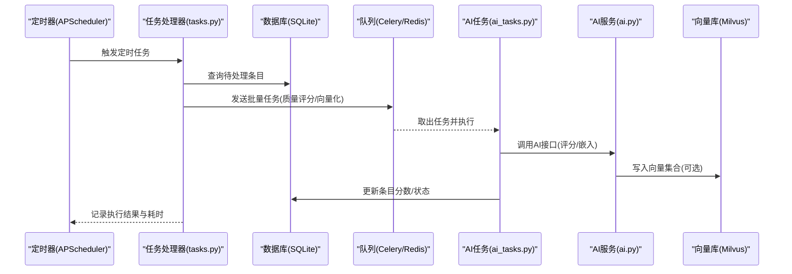
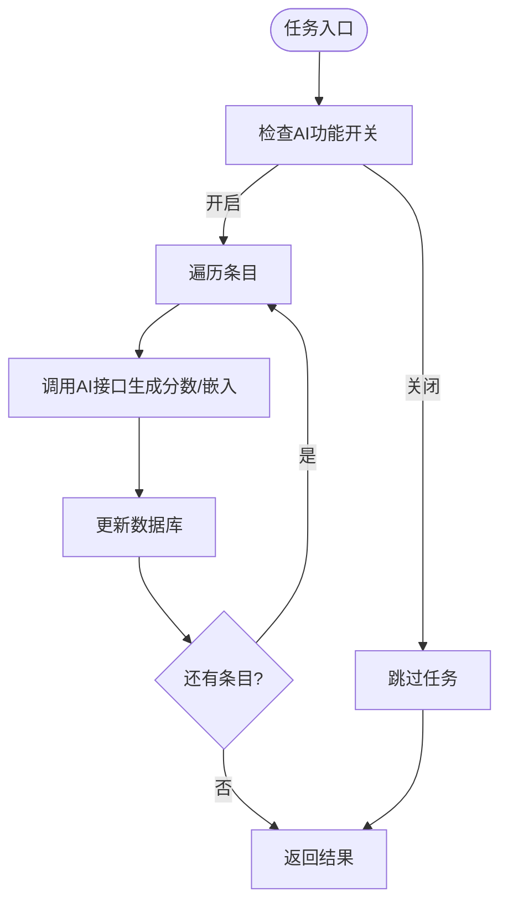
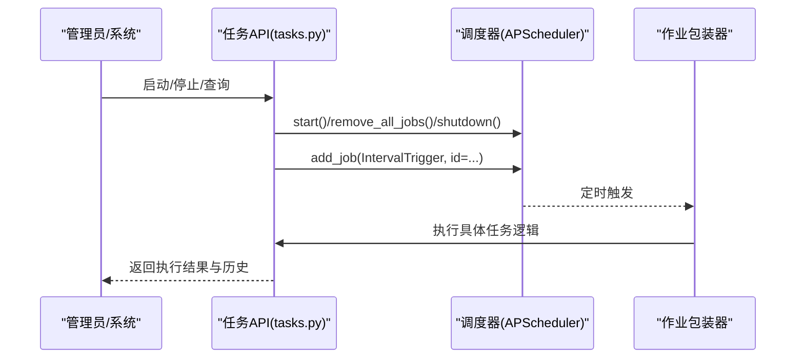
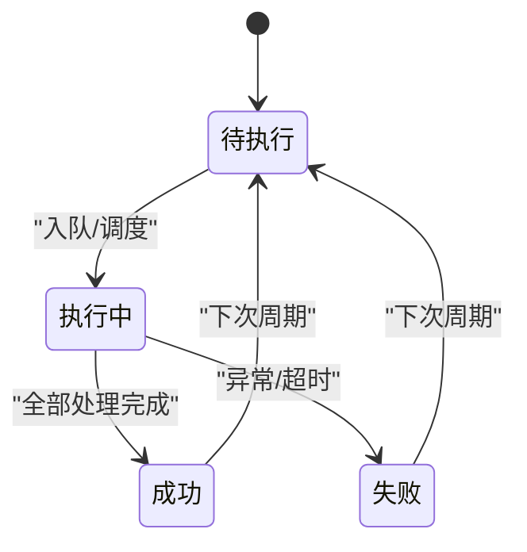
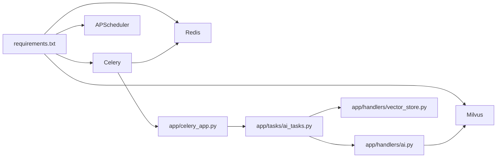

# AI任务调度

<cite>
**本文引用的文件**
- [celery_app.py](file://python-backend/app/celery_app.py)
- [ai_tasks.py](file://python-backend/app/tasks/ai_tasks.py)
- [tasks.py](file://python-backend/app/handlers/tasks.py)
- [ai.py](file://python-backend/app/handlers/ai.py)
- [vector_store.py](file://python-backend/app/handlers/vector_store.py)
- [config.py](file://python-backend/app/config.py)
- [requirements.txt](file://python-backend/requirements.txt)
- [start_celery.sh](file://python-backend/scripts/start_celery.sh)
- [rss_fetcher.py](file://python-backend/app/services/rss_fetcher.py)
- [models.py](file://python-backend/app/models.py)
</cite>

## 目录
1. [简介](#简介)
2. [项目结构](#项目结构)
3. [核心组件](#核心组件)
4. [架构总览](#架构总览)
5. [详细组件分析](#详细组件分析)
6. [依赖分析](#依赖分析)
7. [性能考量](#性能考量)
8. [故障排查指南](#故障排查指南)
9. [结论](#结论)
10. [附录](#附录)

## 简介
本文件面向 Tan RSS Reader 的 AI 任务调度系统，系统同时采用 Celery 异步任务队列与 APScheduler 定时任务两种机制，实现 AI 能力的批量质量评分、向量化入库等后台任务的可靠执行与监控。本文将从系统架构、组件职责、数据流、错误处理、性能与扩展性等方面进行深入解析，并提供最佳实践与运维建议。

## 项目结构
后端 Python 后端位于 python-backend 目录，AI 任务调度相关的关键模块包括：
- Celery 应用与任务定义：app/celery_app.py、app/tasks/ai_tasks.py
- 定时任务与任务编排：app/handlers/tasks.py
- AI 服务能力与配置：app/handlers/ai.py、app/config.py
- 向量数据库接入：app/handlers/vector_store.py
- 依赖与启动脚本：requirements.txt、scripts/start_celery.sh
- 业务集成点：app/services/rss_fetcher.py
- 数据模型：app/models.py

图表来源
- [celery_app.py:1-23](file://python-backend/app/celery_app.py#L1-L23)
- [ai_tasks.py:1-87](file://python-backend/app/tasks/ai_tasks.py#L1-L87)
- [tasks.py:1-276](file://python-backend/app/handlers/tasks.py#L1-L276)
- [ai.py:1-800](file://python-backend/app/handlers/ai.py#L1-L800)
- [vector_store.py:1-197](file://python-backend/app/handlers/vector_store.py#L1-L197)
- [config.py:1-75](file://python-backend/app/config.py#L1-L75)
- [rss_fetcher.py:1-320](file://python-backend/app/services/rss_fetcher.py#L1-L320)

章节来源
- [requirements.txt:1-18](file://python-backend/requirements.txt#L1-L18)
- [start_celery.sh:1-5](file://python-backend/scripts/start_celery.sh#L1-L5)

## 核心组件
- Celery 应用与配置：负责任务序列化、时区、任务跟踪、超时控制与结果存储。
- AI 任务实现：批量质量评分与向量化入库两个 Celery 任务。
- 定时任务编排：基于 APScheduler 的周期性任务，支持启停、手动执行与历史记录。
- AI 能力与配置：统一的 AI 配置读取、用户上下文、重试与限流策略。
- 向量存储封装：Milvus 连接、集合初始化、插入与检索。
- 业务集成点：在 RSS 抓取流程中触发 AI 批处理任务。

章节来源
- [celery_app.py:1-23](file://python-backend/app/celery_app.py#L1-L23)
- [ai_tasks.py:1-87](file://python-backend/app/tasks/ai_tasks.py#L1-L87)
- [tasks.py:57-228](file://python-backend/app/handlers/tasks.py#L57-L228)
- [ai.py:34-64](file://python-backend/app/handlers/ai.py#L34-L64)
- [vector_store.py:18-197](file://python-backend/app/handlers/vector_store.py#L18-L197)
- [rss_fetcher.py:288-304](file://python-backend/app/services/rss_fetcher.py#L288-L304)

## 架构总览
系统采用“定时任务 + 异步队列”的混合架构：
- 定时任务：通过 APScheduler 周期性触发 RSS 刷新与 AI 质量评分任务。
- 异步队列：Celery 作为 Broker/Backend 使用 Redis，承载批量 AI 处理任务。
- AI 能力：统一的 AI 配置与调用封装，支持重试、限流与流式输出。
- 向量数据库：Milvus 提供向量检索能力，配合嵌入模型完成向量化入库。

图表来源
- [tasks.py:143-170](file://python-backend/app/handlers/tasks.py#L143-L170)
- [ai_tasks.py:16-51](file://python-backend/app/tasks/ai_tasks.py#L16-L51)
- [ai_tasks.py:53-86](file://python-backend/app/tasks/ai_tasks.py#L53-L86)
- [ai.py:173-228](file://python-backend/app/handlers/ai.py#L173-L228)
- [vector_store.py:92-128](file://python-backend/app/handlers/vector_store.py#L92-L128)

## 详细组件分析

### Celery 异步任务队列
- 应用初始化：指定 broker/backend 为 Redis，启用 JSON 序列化、UTC 时间、任务开始跟踪与超时控制。
- 任务定义：
  - 批量质量评分：遍历条目，调用 AI 评分接口，更新数据库分数。
  - 向量化入库：连接向量库，生成嵌入并写入集合。
- 并发与超时：全局设置任务超时；实际并发由 worker 进程数与队列消费者决定。

图表来源
- [ai_tasks.py:16-51](file://python-backend/app/tasks/ai_tasks.py#L16-L51)
- [ai_tasks.py:53-86](file://python-backend/app/tasks/ai_tasks.py#L53-L86)

章节来源
- [celery_app.py:7-22](file://python-backend/app/celery_app.py#L7-L22)
- [ai_tasks.py:16-86](file://python-backend/app/tasks/ai_tasks.py#L16-L86)

### APScheduler 定时任务
- 任务类型：RSS 刷新、图标清理、健康检查、AI 质量评分。
- 调度策略：使用 IntervalTrigger，刷新间隔可配置；质量评分更频繁。
- 生命周期：支持启停、手动执行、历史记录与运行状态查询。
- 异常处理：定时任务内部 try/catch，避免中断调度器。

图表来源
- [tasks.py:143-170](file://python-backend/app/handlers/tasks.py#L143-L170)
- [tasks.py:178-228](file://python-backend/app/handlers/tasks.py#L178-L228)
- [tasks.py:260-271](file://python-backend/app/handlers/tasks.py#L260-L271)

章节来源
- [tasks.py:57-228](file://python-backend/app/handlers/tasks.py#L57-L228)

### AI 任务生命周期管理
- 创建：定时任务或手动执行触发；也可由业务流程在抓取完成后发送 Celery 任务。
- 状态跟踪：定时任务维护每个任务的运行计数、成功/失败计数、最近错误与历史记录。
- 重试机制：AI 接口层具备指数退避重试；任务内部对单条目失败进行容错。
- 超时处理：Celery 全局设置任务超时；AI 接口层设置请求超时与流式读取超时。

图表来源
- [tasks.py:57-66](file://python-backend/app/handlers/tasks.py#L57-L66)
- [tasks.py:178-228](file://python-backend/app/handlers/tasks.py#L178-L228)
- [ai.py:195-228](file://python-backend/app/handlers/ai.py#L195-L228)

章节来源
- [tasks.py:57-228](file://python-backend/app/handlers/tasks.py#L57-L228)
- [ai.py:173-228](file://python-backend/app/handlers/ai.py#L173-L228)

### 并发控制与资源管理
- 最大并发：由 Celery worker 数量与队列消费者数量共同决定；可通过进程/容器副本扩展。
- 内存与 CPU：AI 任务涉及网络请求与向量计算，建议按资源情况拆分批次、限制单次处理条目数。
- 资源隔离：将高 IO 的向量化任务与 CPU 密集型评分任务分离至不同队列或 worker 组。

章节来源
- [ai_tasks.py:16-86](file://python-backend/app/tasks/ai_tasks.py#L16-L86)
- [vector_store.py:92-128](file://python-backend/app/handlers/vector_store.py#L92-L128)

### 任务监控与日志
- 执行统计：定时任务记录每次执行的开始时间、结束时间、耗时、成功/失败与消息。
- 性能指标：可基于历史记录统计成功率、平均耗时、错误率；结合数据库写入耗时分析瓶颈。
- 故障诊断：AI 接口层对 429/400 等错误进行分类处理与重试；任务日志记录失败条目 ID 便于定位。

章节来源
- [tasks.py:35-56](file://python-backend/app/handlers/tasks.py#L35-L56)
- [tasks.py:178-228](file://python-backend/app/handlers/tasks.py#L178-L228)
- [ai.py:195-228](file://python-backend/app/handlers/ai.py#L195-L228)

### 任务调度最佳实践
- 任务分解：将大批量处理拆分为小批次，降低单次任务耗时与内存峰值。
- 依赖管理：确保 Redis 与 Milvus 可用；AI 服务可用性与配额限制纳入任务失败策略。
- 优先级设置：通过队列与 worker 分组实现不同任务的优先级隔离。
- 资源优化：根据硬件能力调整 worker 数量、批大小与并发度；对网络请求设置合理超时与重试。

章节来源
- [ai_tasks.py:16-86](file://python-backend/app/tasks/ai_tasks.py#L16-L86)
- [ai.py:173-228](file://python-backend/app/handlers/ai.py#L173-L228)

### 扩展性设计
- 动态任务添加：在 Celery 中注册新任务并在业务流程中按需发送。
- 集群部署：多实例 Celery worker 与多个 APScheduler 实例，注意去重与幂等。
- 故障转移：Redis 主备、Milvus 高可用；任务失败时重试与死信队列策略。

章节来源
- [celery_app.py:11](file://python-backend/app/celery_app.py#L11)
- [requirements.txt:10-16](file://python-backend/requirements.txt#L10-L16)

## 依赖分析
- Celery 与 Redis：Celery 作为任务队列，Redis 作为 Broker/Backend。
- APScheduler：提供异步调度能力，支持 IntervalTrigger。
- Milvus：向量数据库，提供向量检索与索引。
- AI 服务：统一配置与调用封装，支持重试与流式输出。

图表来源
- [requirements.txt:1-18](file://python-backend/requirements.txt#L1-L18)
- [celery_app.py:1-23](file://python-backend/app/celery_app.py#L1-L23)
- [ai_tasks.py:1-87](file://python-backend/app/tasks/ai_tasks.py#L1-L87)
- [ai.py:1-800](file://python-backend/app/handlers/ai.py#L1-L800)
- [vector_store.py:1-197](file://python-backend/app/handlers/vector_store.py#L1-L197)

章节来源
- [requirements.txt:1-18](file://python-backend/requirements.txt#L1-L18)

## 性能考量
- 任务超时：Celery 全局设置任务超时，避免长时间占用 worker。
- 批处理大小：根据内存与网络带宽调整批大小，减少往返开销。
- 并发度：worker 数量与队列消费者数量应与 CPU/IO 能力匹配。
- 网络与限流：AI 服务限流与重试策略需与任务频率协调，防止触发限流。

章节来源
- [celery_app.py:21](file://python-backend/app/celery_app.py#L21)
- [ai.py:195-228](file://python-backend/app/handlers/ai.py#L195-L228)

## 故障排查指南
- 定时任务不可用：确认 APScheduler 是否安装，查看调度器状态与启停接口返回。
- 任务未执行：检查 Celery worker 是否启动、Redis 连接是否正常、任务名称是否正确。
- AI 调用失败：关注 429 重试与 400 错误，核对配置中的 API Key、Base URL 与模型名。
- 向量库异常：检查 Milvus 连接参数、集合是否存在与索引状态。

章节来源
- [tasks.py:143-170](file://python-backend/app/handlers/tasks.py#L143-L170)
- [tasks.py:260-271](file://python-backend/app/handlers/tasks.py#L260-L271)
- [ai.py:173-228](file://python-backend/app/handlers/ai.py#L173-L228)
- [vector_store.py:23-54](file://python-backend/app/handlers/vector_store.py#L23-L54)

## 结论
该系统通过 Celery 与 APScheduler 的协同，实现了稳定高效的 AI 任务调度。Celery 负责异步批量处理，APScheduler 负责周期性与手动触发，二者结合满足了 RSS 内容处理与 AI 能力集成的需求。通过合理的并发控制、资源隔离与监控告警，系统可在生产环境中持续稳定运行，并具备良好的扩展性与可维护性。

## 附录
- 启动 Celery Worker：使用脚本设置 PYTHONPATH 并启动 worker。
- 任务发送位置：在业务流程中调用 Celery 发送批量任务，或在定时任务中触发。

章节来源
- [start_celery.sh:1-5](file://python-backend/scripts/start_celery.sh#L1-L5)
- [rss_fetcher.py:288-304](file://python-backend/app/services/rss_fetcher.py#L288-L304)