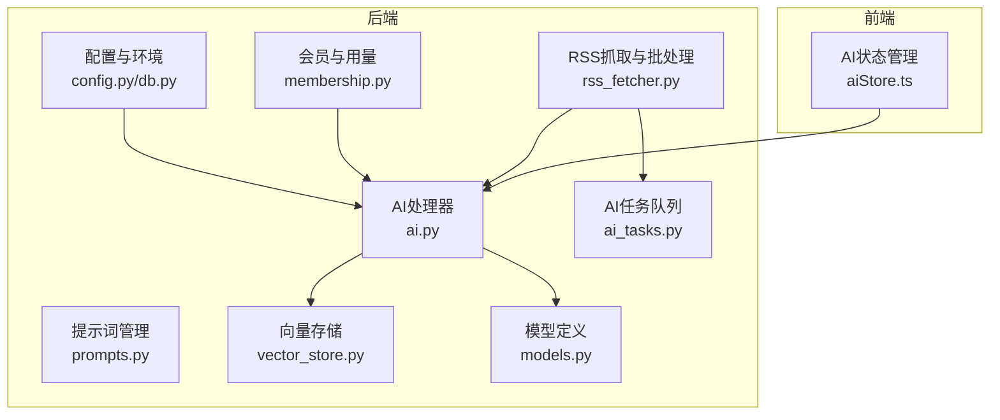
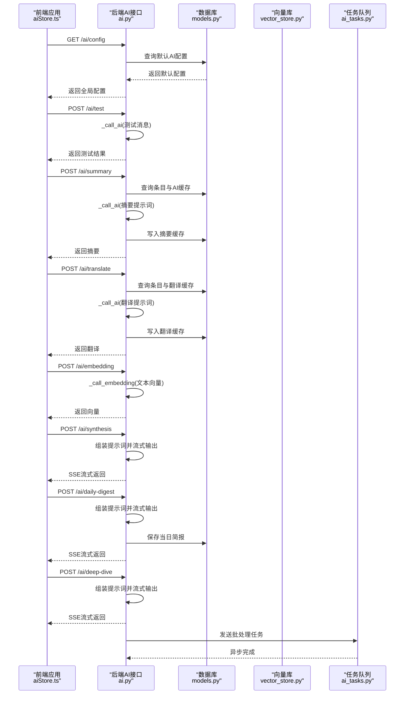
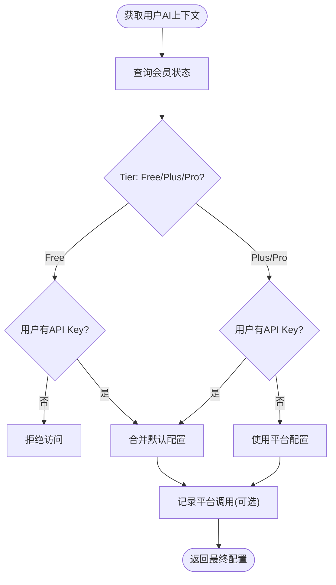
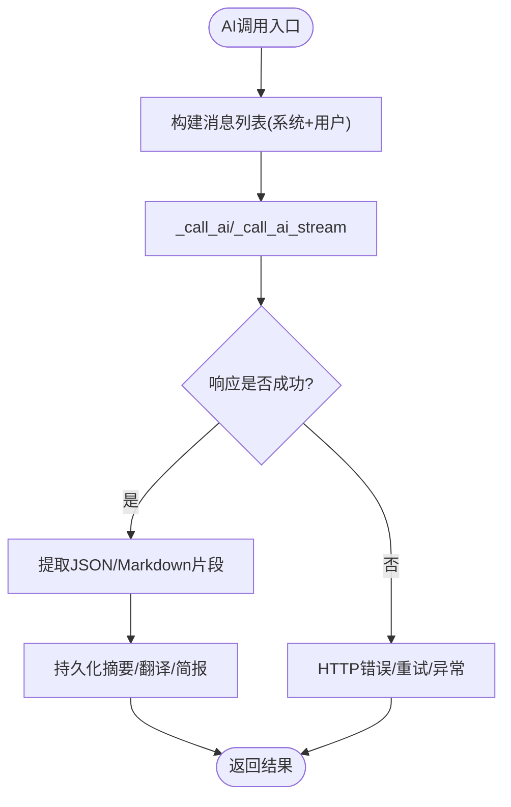
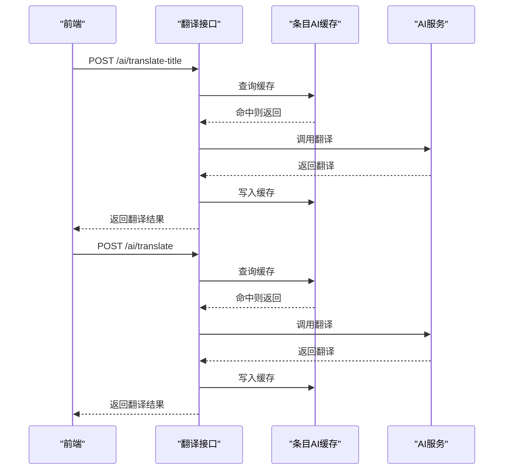
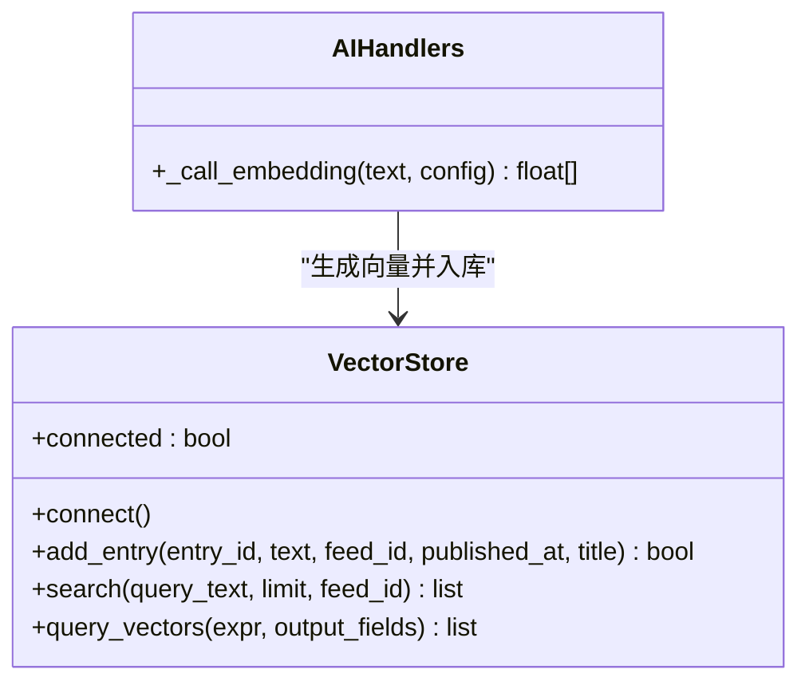
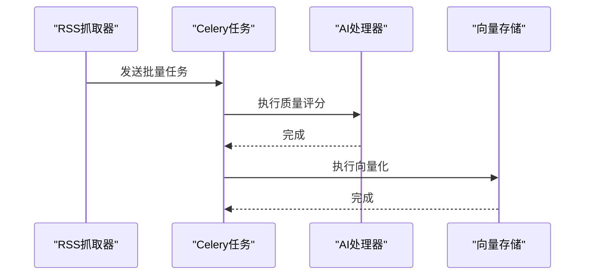
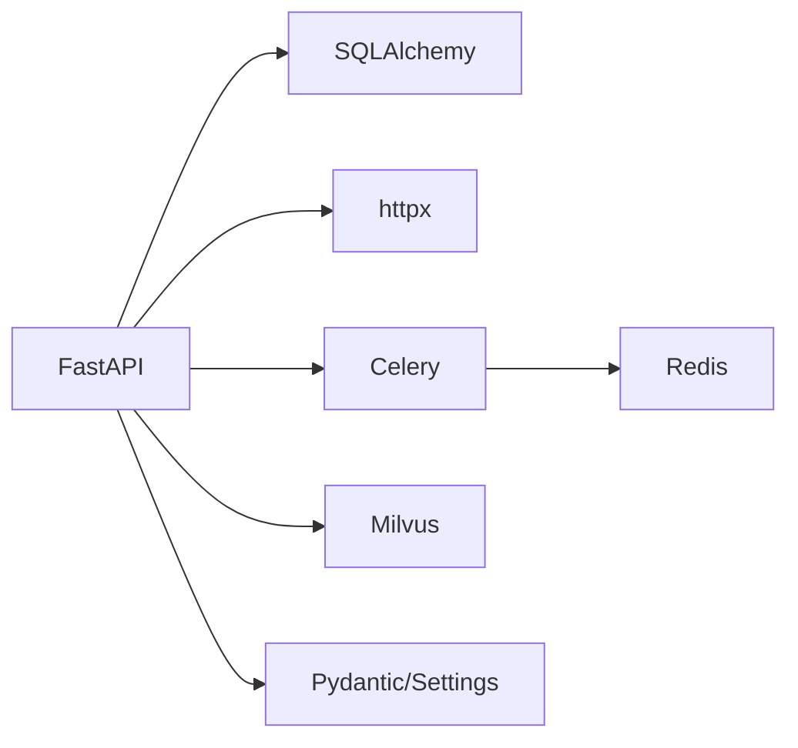

# AI服务集成

<cite>
**本文档引用的文件**
- [ai.py](file://python-backend/app/handlers/ai.py)
- [prompts.py](file://python-backend/app/handlers/prompts.py)
- [membership.py](file://python-backend/app/handlers/membership.py)
- [rss_fetcher.py](file://python-backend/app/services/rss_fetcher.py)
- [ai_tasks.py](file://python-backend/app/tasks/ai_tasks.py)
- [vector_store.py](file://python-backend/app/handlers/vector_store.py)
- [models.py](file://python-backend/app/models.py)
- [config.py](file://python-backend/app/config.py)
- [db.py](file://python-backend/app/db.py)
- [aiStore.ts](file://rss-desktop/src/stores/aiStore.ts)
- [requirements.txt](file://python-backend/requirements.txt)
</cite>

## 目录
1. [简介](#简介)
2. [项目结构](#项目结构)
3. [核心组件](#核心组件)
4. [架构总览](#架构总览)
5. [详细组件分析](#详细组件分析)
6. [依赖关系分析](#依赖关系分析)
7. [性能考量](#性能考量)
8. [故障排除指南](#故障排除指南)
9. [结论](#结论)
10. [附录](#附录)

## 简介
本文件面向Tan RSS Reader的AI服务集成模块，系统性阐述AI配置管理、Aurora AI与OpenAI兼容接口的集成方案、API密钥与基础URL配置、摘要生成与提示词工程、JSON格式解析与错误处理、多语言翻译服务（标题与内容）、用户级配置覆盖与会员权限限制、向量检索与嵌入、监控与性能优化、成本控制与API调用示例。

## 项目结构
AI服务主要由后端FastAPI处理器、数据库模型、向量存储、任务队列与前端Pinia状态管理构成：
- 后端处理器：AI摘要、翻译、嵌入、每日简报、深度分析、趋势分析、质量评分等
- 数据库模型：AI配置、条目AI记录、会员与用量、用户提示词等
- 向量存储：Milvus集成，支持本地Lite模式
- 任务队列：Celery批处理质量评分与向量化
- 前端状态：Pinia store管理AI配置与测试

图表来源
- [ai.py:1-1157](file://python-backend/app/handlers/ai.py#L1-L1157)
- [prompts.py:1-131](file://python-backend/app/handlers/prompts.py#L1-L131)
- [membership.py:1-113](file://python-backend/app/handlers/membership.py#L1-L113)
- [rss_fetcher.py:1-312](file://python-backend/app/services/rss_fetcher.py#L1-L312)
- [ai_tasks.py:1-87](file://python-backend/app/tasks/ai_tasks.py#L1-L87)
- [vector_store.py:1-197](file://python-backend/app/handlers/vector_store.py#L1-L197)
- [models.py:1-228](file://python-backend/app/models.py#L1-L228)
- [config.py:1-75](file://python-backend/app/config.py#L1-L75)
- [db.py:1-27](file://python-backend/app/db.py#L1-L27)
- [aiStore.ts:1-156](file://rss-desktop/src/stores/aiStore.ts#L1-L156)

章节来源
- [ai.py:1-1157](file://python-backend/app/handlers/ai.py#L1-L1157)
- [models.py:1-228](file://python-backend/app/models.py#L1-L228)
- [config.py:1-75](file://python-backend/app/config.py#L1-L75)
- [db.py:1-27](file://python-backend/app/db.py#L1-L27)
- [aiStore.ts:1-156](file://rss-desktop/src/stores/aiStore.ts#L1-L156)

## 核心组件
- AI配置管理：统一管理summary/translation/embedding三类服务配置，支持默认配置、平台配置与用户级覆盖
- 提示词工程：结构化提示词模板，支持摘要、翻译、质量评分、每日简报、深度分析等
- JSON解析与容错：从AI响应中提取JSON，包含代码块与边界截取容错
- 错误处理与重试：HTTP 429指数退避重试、网络异常重试、流式传输错误回传
- 多语言翻译：标题翻译与内容翻译差异化处理，缓存翻译结果
- 会员与用量：Free/Plus/Pro三级权限，平台额度统计与调用计数
- 向量检索：Milvus集成，支持本地Lite与远程集群，向量维度与索引配置
- 批处理任务：Celery异步执行质量评分与向量化，降低主线程阻塞

章节来源
- [ai.py:34-171](file://python-backend/app/handlers/ai.py#L34-L171)
- [prompts.py:1-131](file://python-backend/app/handlers/prompts.py#L1-L131)
- [membership.py:1-113](file://python-backend/app/handlers/membership.py#L1-L113)
- [vector_store.py:1-197](file://python-backend/app/handlers/vector_store.py#L1-L197)
- [rss_fetcher.py:46-102](file://python-backend/app/services/rss_fetcher.py#L46-L102)
- [ai_tasks.py:1-87](file://python-backend/app/tasks/ai_tasks.py#L1-L87)

## 架构总览
AI服务采用“配置驱动 + 用户覆盖 + 会员配额”的架构，后端通过统一的AI调用封装对接Aurora AI或兼容OpenAI的接口，前端通过Pinia store进行配置管理与连通性测试。

图表来源
- [ai.py:598-1157](file://python-backend/app/handlers/ai.py#L598-L1157)
- [models.py:52-80](file://python-backend/app/models.py#L52-L80)
- [vector_store.py:92-178](file://python-backend/app/handlers/vector_store.py#L92-L178)
- [ai_tasks.py:16-51](file://python-backend/app/tasks/ai_tasks.py#L16-L51)

## 详细组件分析

### AI配置管理与用户级覆盖
- 默认配置：从环境变量与配置文件加载Aurora AI的基础URL、模型名与API密钥
- 平台配置：管理员可设置默认AI配置，写入数据库表
- 用户级覆盖：用户可在个人配置中覆盖API密钥、基础URL、模型名与功能开关
- 会员权限：Plus/Pro用户可使用平台额度；Free用户需自备API密钥
- 平台额度：记录每日调用次数，暂未强制上限（注释处）

图表来源
- [ai.py:98-171](file://python-backend/app/handlers/ai.py#L98-L171)
- [membership.py:28-57](file://python-backend/app/handlers/membership.py#L28-L57)

章节来源
- [ai.py:34-171](file://python-backend/app/handlers/ai.py#L34-L171)
- [config.py:41-75](file://python-backend/app/config.py#L41-L75)
- [models.py:98-124](file://python-backend/app/models.py#L98-L124)
- [membership.py:18-57](file://python-backend/app/handlers/membership.py#L18-L57)

### 提示词工程与JSON解析
- 结构化提示词：摘要、翻译、质量评分、每日简报、深度分析均采用明确的JSON/Markdown格式约束
- JSON解析容错：支持从代码块中提取JSON，或通过首尾大括号截取
- 流式输出：合成与简报支持SSE流式返回，前端逐步渲染

图表来源
- [ai.py:173-228](file://python-backend/app/handlers/ai.py#L173-L228)
- [ai.py:230-278](file://python-backend/app/handlers/ai.py#L230-L278)
- [ai.py:616-707](file://python-backend/app/handlers/ai.py#L616-L707)
- [ai.py:717-792](file://python-backend/app/handlers/ai.py#L717-L792)
- [ai.py:869-932](file://python-backend/app/handlers/ai.py#L869-L932)
- [ai.py:986-1084](file://python-backend/app/handlers/ai.py#L986-L1084)

章节来源
- [ai.py:279-311](file://python-backend/app/handlers/ai.py#L279-L311)
- [ai.py:934-981](file://python-backend/app/handlers/ai.py#L934-L981)

### 多语言翻译服务
- 标题翻译：独立路由，缓存不同语言的翻译结果
- 内容翻译：根据字段类型选择提示词，保留格式
- 缓存策略：按条目+字段类型+目标语言组织JSON缓存

图表来源
- [ai.py:794-849](file://python-backend/app/handlers/ai.py#L794-L849)
- [ai.py:717-792](file://python-backend/app/handlers/ai.py#L717-L792)

章节来源
- [ai.py:717-849](file://python-backend/app/handlers/ai.py#L717-L849)

### 嵌入与向量检索
- 嵌入生成：调用/embeddings端点，返回固定维度向量
- 向量存储：Milvus集合，支持本地Lite与远程集群
- 搜索：基于余弦相似度检索，支持按feed过滤

图表来源
- [vector_store.py:18-197](file://python-backend/app/handlers/vector_store.py#L18-L197)
- [ai.py:313-345](file://python-backend/app/handlers/ai.py#L313-L345)

章节来源
- [vector_store.py:1-197](file://python-backend/app/handlers/vector_store.py#L1-L197)
- [ai.py:313-345](file://python-backend/app/handlers/ai.py#L313-L345)

### 批处理与后台任务
- 批量质量评分：新条目入库后异步评分并写回quality_score
- 自动向量化：新条目文本向量化并写入Milvus
- Celery任务：支持禁用时回退至异步执行

图表来源
- [rss_fetcher.py:282-311](file://python-backend/app/services/rss_fetcher.py#L282-L311)
- [ai_tasks.py:16-86](file://python-backend/app/tasks/ai_tasks.py#L16-L86)

章节来源
- [rss_fetcher.py:46-102](file://python-backend/app/services/rss_fetcher.py#L46-L102)
- [ai_tasks.py:1-87](file://python-backend/app/tasks/ai_tasks.py#L1-L87)

### 前端AI配置管理
- Pinia store：维护全局AI配置，支持拉取、更新与连通性测试
- 连接测试：调用后端测试接口验证配置有效性
- 错误处理：集中错误状态管理

章节来源
- [aiStore.ts:1-156](file://rss-desktop/src/stores/aiStore.ts#L1-L156)
- [ai.py:598-615](file://python-backend/app/handlers/ai.py#L598-L615)

## 依赖关系分析
- 外部依赖：FastAPI、SQLAlchemy、httpx、feedparser、pymilvus、celery、redis
- 数据库：SQLite（默认），支持外部数据库URL
- 向量库：Milvus（含Lite模式）
- 任务队列：Redis作为Broker

图表来源
- [requirements.txt:1-18](file://python-backend/requirements.txt#L1-L18)
- [config.py:41-75](file://python-backend/app/config.py#L41-L75)

章节来源
- [requirements.txt:1-18](file://python-backend/requirements.txt#L1-L18)
- [db.py:1-27](file://python-backend/app/db.py#L1-L27)

## 性能考量
- 超时与重试：AI调用设置合理超时，429指数退避；网络异常1秒重试
- 流式输出：SSE减少前端等待时间，提升交互体验
- 批处理：Celery异步执行质量评分与向量化，避免阻塞主流程
- 向量维度：固定维度便于检索与存储，建议与模型一致
- Token限制：摘要与简报内容截断，避免超出模型上下文
- 缓存策略：摘要与翻译结果持久化，减少重复调用

章节来源
- [ai.py:194-228](file://python-backend/app/handlers/ai.py#L194-L228)
- [ai.py:230-278](file://python-backend/app/handlers/ai.py#L230-L278)
- [rss_fetcher.py:282-311](file://python-backend/app/services/rss_fetcher.py#L282-L311)
- [vector_store.py:92-128](file://python-backend/app/handlers/vector_store.py#L92-L128)

## 故障排除指南
- 403 Forbidden：Free用户未配置API Key且非Plus/Pro会员
- 429 Rate Limit：触发指数退避重试，检查上游配额与速率限制
- 502 Bad Gateway：AI服务不可达，检查基础URL与网络连通
- JSON解析失败：确认提示词要求严格返回JSON，启用代码块或边界截取
- 向量库连接失败：检查Milvus地址、端口与集合存在性
- 任务队列异常：确认Redis可用，Celery worker运行状态

章节来源
- [ai.py:116-117](file://python-backend/app/handlers/ai.py#L116-L117)
- [ai.py:203-213](file://python-backend/app/handlers/ai.py#L203-L213)
- [vector_store.py:30-53](file://python-backend/app/handlers/vector_store.py#L30-L53)

## 结论
Tan RSS Reader的AI服务集成以配置为中心，结合用户级覆盖与会员权限，实现了灵活可控的摘要、翻译、嵌入与检索能力。通过流式输出与批处理任务，兼顾了用户体验与系统性能。建议后续完善平台额度硬性限制、埋点与监控指标，以及更细粒度的成本控制策略。

## 附录

### API调用示例（路径与要点）
- 获取全局AI配置：GET /ai/config
- 更新全局AI配置：PATCH /ai/config
- 获取用户AI配置：GET /ai/user/config
- 更新用户AI配置：PUT /ai/user/config
- 连接测试：POST /ai/test
- 生成摘要：POST /ai/summary（请求体包含entry_id与可选language）
- 翻译标题：POST /ai/translate-title（请求体包含entry_id与language）
- 翻译内容：POST /ai/translate（请求体包含entry_id、field_type与target_language）
- 生成嵌入：POST /ai/embedding（请求体包含text）
- 合成分析：POST /ai/synthesis（请求体包含entry_ids）
- 每日简报：POST /ai/daily-digest（请求体包含entry_ids）
- 深度分析：POST /ai/deep-dive（请求体包含entry_id）
- 会员状态：GET /membership/status
- 订阅升级：POST /membership/subscribe

章节来源
- [ai.py:373-504](file://python-backend/app/handlers/ai.py#L373-L504)
- [ai.py:506-596](file://python-backend/app/handlers/ai.py#L506-L596)
- [ai.py:598-615](file://python-backend/app/handlers/ai.py#L598-L615)
- [ai.py:616-715](file://python-backend/app/handlers/ai.py#L616-L715)
- [ai.py:717-792](file://python-backend/app/handlers/ai.py#L717-L792)
- [ai.py:851-864](file://python-backend/app/handlers/ai.py#L851-L864)
- [ai.py:869-932](file://python-backend/app/handlers/ai.py#L869-L932)
- [ai.py:986-1084](file://python-backend/app/handlers/ai.py#L986-L1084)
- [ai.py:1117-1155](file://python-backend/app/handlers/ai.py#L1117-L1155)
- [membership.py:28-112](file://python-backend/app/handlers/membership.py#L28-L112)

### 错误码说明
- 400：参数无效（如空entry_ids、非法field_type）
- 403：Free用户未配置API Key且非Plus/Pro
- 404：条目不存在
- 429：AI服务限流，内置指数退避重试
- 500：AI服务内部错误
- 502：AI服务不可达

章节来源
- [ai.py:754-754](file://python-backend/app/handlers/ai.py#L754-L754)
- [ai.py:116-117](file://python-backend/app/handlers/ai.py#L116-L117)
- [ai.py:203-213](file://python-backend/app/handlers/ai.py#L203-L213)
- [ai.py:760-762](file://python-backend/app/handlers/ai.py#L760-L762)

### 成本控制与监控建议
- 成本控制
  - 限制每日调用次数（建议启用平台额度硬性限制）
  - 优化提示词长度与上下文截断
  - 使用缓存减少重复调用
  - 选择合适模型与温度参数
- 监控指标
  - AI调用成功率与延迟
  - 每日调用次数与费用估算
  - 向量库写入/查询命中率
  - Celery任务队列积压与失败率

章节来源
- [ai.py:164-169](file://python-backend/app/handlers/ai.py#L164-L169)
- [vector_store.py:130-178](file://python-backend/app/handlers/vector_store.py#L130-L178)
- [ai_tasks.py:16-51](file://python-backend/app/tasks/ai_tasks.py#L16-L51)