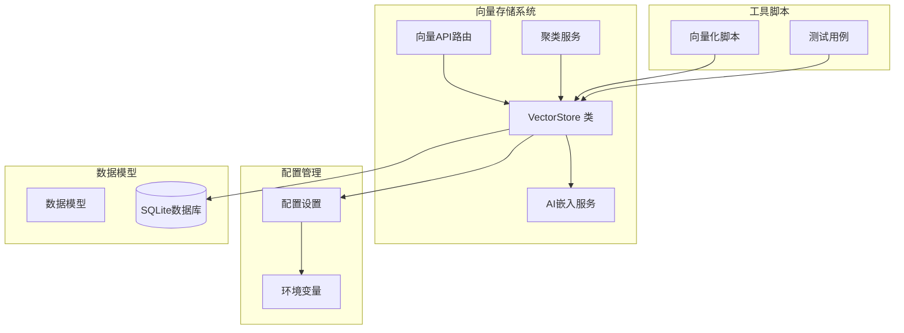
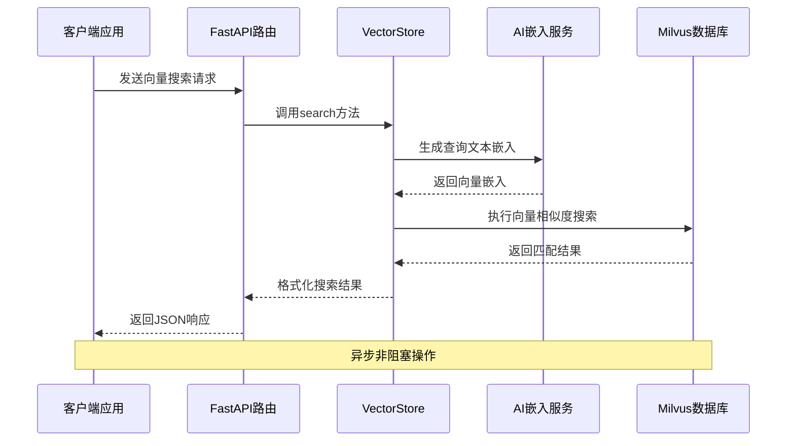
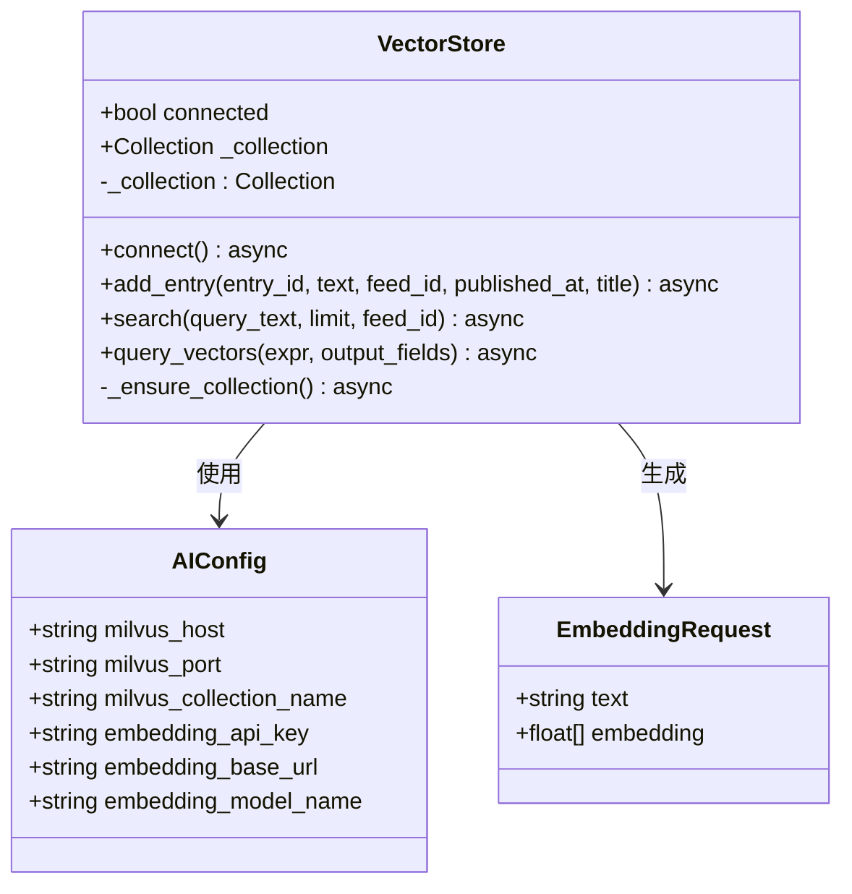
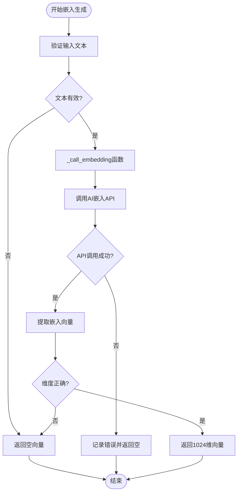
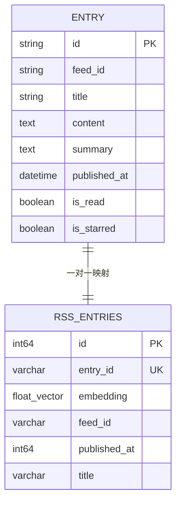
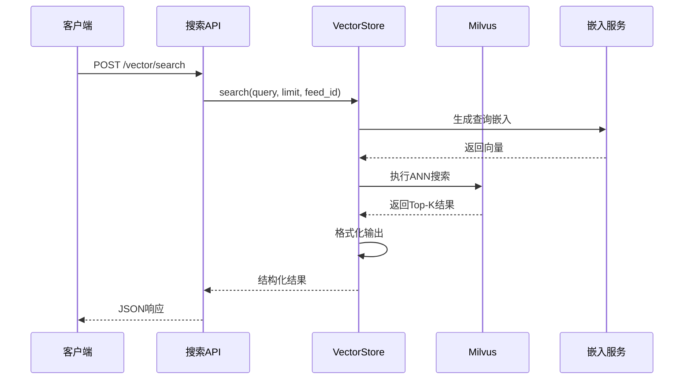
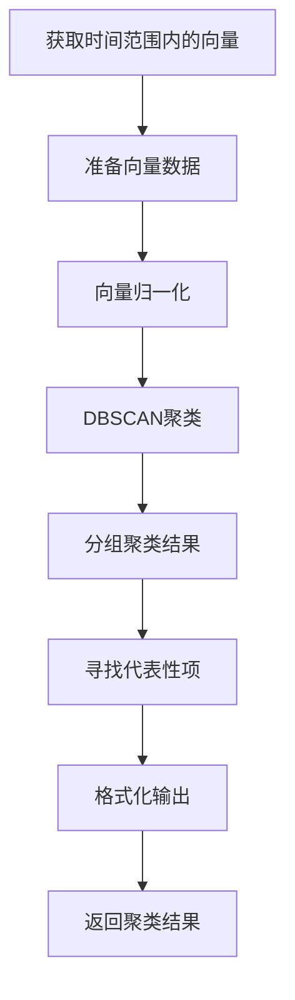
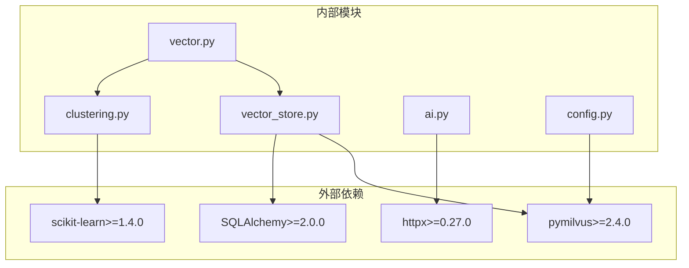

# 向量存储管理

<cite>
**本文档引用的文件**
- [vector.py](file://python-backend/app/handlers/vector.py)
- [vector_store.py](file://python-backend/app/handlers/vector_store.py)
- [clustering.py](file://python-backend/app/handlers/clustering.py)
- [ai.py](file://python-backend/app/handlers/ai.py)
- [config.py](file://python-backend/app/config.py)
- [models.py](file://python-backend/app/models.py)
- [vectorize_history.py](file://python-backend/scripts/vectorize_history.py)
- [test_vector_system.py](file://python-backend/tests/test_vector_system.py)
- [requirements.txt](file://python-backend/requirements.txt)
</cite>

## 目录
1. [简介](#简介)
2. [项目结构](#项目结构)
3. [核心组件](#核心组件)
4. [架构概览](#架构概览)
5. [详细组件分析](#详细组件分析)
6. [依赖关系分析](#依赖关系分析)
7. [性能考虑](#性能考虑)
8. [故障排除指南](#故障排除指南)
9. [结论](#结论)

## 简介

Tan RSS Reader的向量存储管理系统是一个基于Milvus向量数据库的智能内容检索解决方案。该系统通过将RSS文章内容转换为高维向量表示，实现了高效的语义搜索和内容聚类功能。系统集成了AI嵌入模型，支持实时向量生成、批量数据处理、智能检索和内容聚类等核心功能。

该系统采用异步架构设计，使用FastAPI作为Web框架，Pymilvus作为Milvus客户端，scikit-learn进行向量聚类分析。整个系统支持本地开发环境（Milvus Lite）和生产环境（分布式Milvus），提供了完整的向量数据生命周期管理能力。

## 项目结构

向量存储管理系统主要分布在Python后端应用中，采用模块化设计：

**图表来源**
- [vector_store.py:18-197](file://python-backend/app/handlers/vector_store.py#L18-L197)
- [vector.py:15-158](file://python-backend/app/handlers/vector.py#L15-L158)
- [clustering.py:10-142](file://python-backend/app/handlers/clustering.py#L10-L142)

**章节来源**
- [vector_store.py:1-197](file://python-backend/app/handlers/vector_store.py#L1-L197)
- [vector.py:1-158](file://python-backend/app/handlers/vector.py#L1-L158)
- [clustering.py:1-142](file://python-backend/app/handlers/clustering.py#L1-L142)

## 核心组件

### VectorStore类
VectorStore是系统的核心组件，负责与Milvus向量数据库的所有交互。它实现了连接管理、集合创建、向量插入、查询搜索等功能。

### 向量API路由
提供RESTful API接口，包括连接测试、向量搜索、批量索引、聚类分析等操作。

### 聚类服务
基于DBSCAN算法的向量聚类服务，能够自动发现相似内容的集群并生成主题标签。

### AI嵌入服务
集成外部AI服务生成文本嵌入向量，支持多种AI提供商和模型配置。

**章节来源**
- [vector_store.py:18-197](file://python-backend/app/handlers/vector_store.py#L18-L197)
- [vector.py:38-158](file://python-backend/app/handlers/vector.py#L38-L158)
- [clustering.py:10-142](file://python-backend/app/handlers/clustering.py#L10-L142)

## 架构概览

系统采用分层架构设计，各组件职责明确：

**图表来源**
- [vector.py:108-111](file://python-backend/app/handlers/vector.py#L108-L111)
- [vector_store.py:130-179](file://python-backend/app/handlers/vector_store.py#L130-L179)

系统架构特点：
- **异步非阻塞**：所有数据库操作都在线程池中执行，避免阻塞事件循环
- **连接池管理**：支持本地Milvus Lite和远程分布式Milvus
- **自动索引**：首次访问时自动创建集合和索引
- **错误处理**：完善的异常捕获和降级策略

**章节来源**
- [vector_store.py:23-54](file://python-backend/app/handlers/vector_store.py#L23-L54)
- [vector_store.py:55-91](file://python-backend/app/handlers/vector_store.py#L55-L91)

## 详细组件分析

### VectorStore类设计

VectorStore类实现了完整的向量存储管理功能：

**图表来源**
- [vector_store.py:18-197](file://python-backend/app/handlers/vector_store.py#L18-L197)
- [ai.py:34-64](file://python-backend/app/handlers/ai.py#L34-L64)

#### 连接配置策略

系统支持多种连接模式：

1. **本地Milvus Lite**：使用文件路径作为URI，适合开发和小规模部署
2. **远程Milvus**：通过主机和端口连接，支持分布式部署
3. **自动检测**：根据配置自动选择连接方式

#### 集合管理策略

集合创建时定义了完整的schema：

| 字段名 | 数据类型 | 描述 | 约束 |
|--------|----------|------|------|
| id | INT64 (主键) | 自增主键 | auto_id=True |
| entry_id | VARCHAR | 文章唯一标识 | max_length=255 |
| embedding | FLOAT_VECTOR | 嵌入向量 | dim=1024 |
| feed_id | VARCHAR | 来源频道标识 | max_length=255 |
| published_at | INT64 | 发布时间戳 |  |
| title | VARCHAR | 文章标题 | max_length=512 |

**章节来源**
- [vector_store.py:55-91](file://python-backend/app/handlers/vector_store.py#L55-L91)
- [vector_store.py:92-129](file://python-backend/app/handlers/vector_store.py#L92-L129)

### 向量嵌入生成流程

系统采用异步嵌入生成策略：

**图表来源**
- [ai.py:313-346](file://python-backend/app/handlers/ai.py#L313-L346)
- [vector_store.py:99-102](file://python-backend/app/handlers/vector_store.py#L99-L102)

嵌入生成的关键特性：
- **异步调用**：避免阻塞主线程
- **维度验证**：确保向量维度为1024
- **错误处理**：API失败时优雅降级

**章节来源**
- [ai.py:313-346](file://python-backend/app/handlers/ai.py#L313-L346)
- [vector_store.py:92-102](file://python-backend/app/handlers/vector_store.py#L92-L102)

### 向量存储数据结构

系统采用混合数据存储策略：

**图表来源**
- [models.py:21-38](file://python-backend/app/models.py#L21-L38)
- [vector_store.py:65-72](file://python-backend/app/handlers/vector_store.py#L65-L72)

数据存储策略：
- **关系型数据**：在SQLite中存储文章元数据
- **向量数据**：在Milvus中存储嵌入向量
- **关联查询**：通过entry_id建立关联

**章节来源**
- [models.py:21-38](file://python-backend/app/models.py#L21-L38)
- [vector_store.py:65-72](file://python-backend/app/handlers/vector_store.py#L65-L72)

### 向量检索实现

检索系统支持多种查询模式：

**图表来源**
- [vector.py:108-111](file://python-backend/app/handlers/vector.py#L108-L111)
- [vector_store.py:130-179](file://python-backend/app/handlers/vector_store.py#L130-L179)

检索参数配置：
- **相似度度量**：COSINE距离
- **索引类型**：IVF_FLAT (倒排文件)
- **查询参数**：nprobe=10
- **过滤条件**：支持按feed_id过滤

**章节来源**
- [vector_store.py:130-179](file://python-backend/app/handlers/vector_store.py#L130-L179)

### 向量聚类分析

聚类服务基于DBSCAN算法实现：

**图表来源**
- [clustering.py:14-139](file://python-backend/app/handlers/clustering.py#L14-L139)

聚类参数调优：
- **eps阈值**：控制相似度阈值 (默认0.3)
- **min_samples**：最小样本数 (默认2)
- **距离度量**：cosine距离
- **噪声处理**：标签-1表示噪声点

**章节来源**
- [clustering.py:14-139](file://python-backend/app/handlers/clustering.py#L14-L139)

## 依赖关系分析

系统依赖关系清晰，模块间耦合度适中：

**图表来源**
- [requirements.txt:1-18](file://python-backend/requirements.txt#L1-L18)
- [vector_store.py:4-14](file://python-backend/app/handlers/vector_store.py#L4-L14)

**章节来源**
- [requirements.txt:1-18](file://python-backend/requirements.txt#L1-L18)

## 性能考虑

### 索引优化策略

系统当前使用IVF_FLAT索引类型，适用于中小规模数据集：

| 参数 | 默认值 | 说明 |
|------|--------|------|
| metric_type | COSINE | 相似度度量 |
| index_type | IVF_FLAT | 倒排文件索引 |
| nlist | 128 | 聚类中心数量 |
| nprobe | 10 | 查询时检查的聚类数 |

### 查询优化建议

1. **批量查询**：使用nprobe参数平衡精度和性能
2. **过滤优化**：优先使用feed_id过滤减少搜索空间
3. **缓存策略**：对热门查询结果进行缓存
4. **并发控制**：使用信号量限制同时查询数量

### 内存管理

系统采用异步非阻塞设计：
- **线程池隔离**：数据库操作在独立线程执行
- **连接复用**：单例模式管理Milvus连接
- **资源清理**：自动关闭数据库会话

**章节来源**
- [vector_store.py:77-82](file://python-backend/app/handlers/vector_store.py#L77-L82)
- [vector_store.py:140-143](file://python-backend/app/handlers/vector_store.py#L140-L143)

## 故障排除指南

### 常见问题及解决方案

#### Milvus连接问题
- **症状**：连接超时或拒绝
- **原因**：网络配置错误或服务未启动
- **解决**：检查milvus_host和milvus_port配置

#### 嵌入生成失败
- **症状**：返回空向量或API错误
- **原因**：AI服务不可用或认证失败
- **解决**：验证AI配置和网络连接

#### 向量维度不匹配
- **症状**：插入失败或查询异常
- **原因**：嵌入模型输出维度不符
- **解决**：确认嵌入模型配置为1024维

### 监控指标

系统应监控以下关键指标：
- **连接状态**：Milvus连接可用性
- **查询延迟**：平均查询响应时间
- **索引大小**：向量数量和存储使用
- **错误率**：API调用失败比例

**章节来源**
- [vector_store.py:51-53](file://python-backend/app/handlers/vector_store.py#L51-L53)
- [ai.py:203-213](file://python-backend/app/handlers/ai.py#L203-L213)

## 结论

Tan RSS Reader的向量存储管理系统展现了现代AI应用的最佳实践。系统通过合理的架构设计、完善的错误处理和灵活的配置管理，为RSS内容检索提供了强大的向量搜索能力。

系统的主要优势：
- **模块化设计**：清晰的职责分离和依赖管理
- **异步架构**：高性能的非阻塞操作
- **灵活配置**：支持多种部署环境
- **完整功能**：从数据导入到查询分析的全链路支持

未来改进方向：
- 实现更高级的索引类型（如HNSW）
- 添加向量数据备份和恢复机制
- 优化大规模数据的批量处理性能
- 增强监控和告警功能