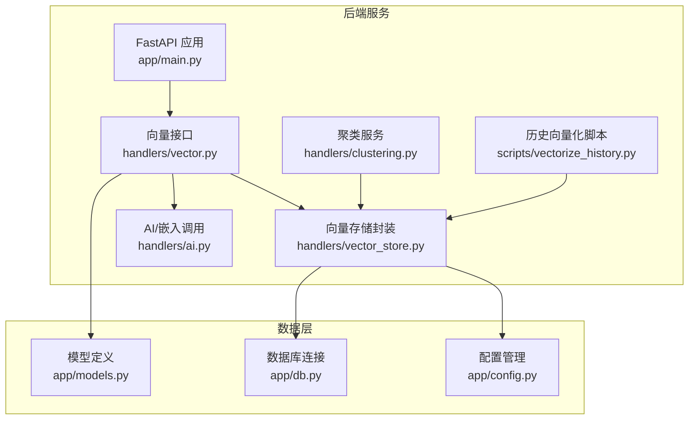
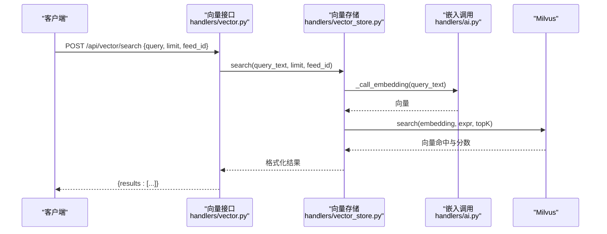
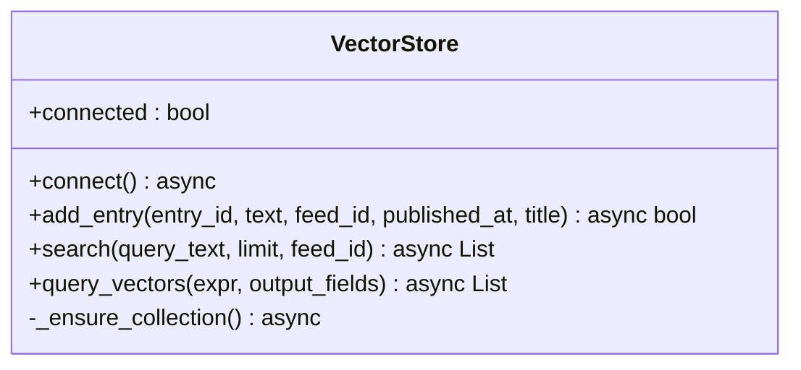
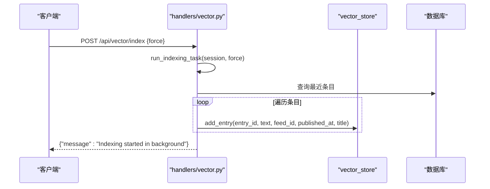
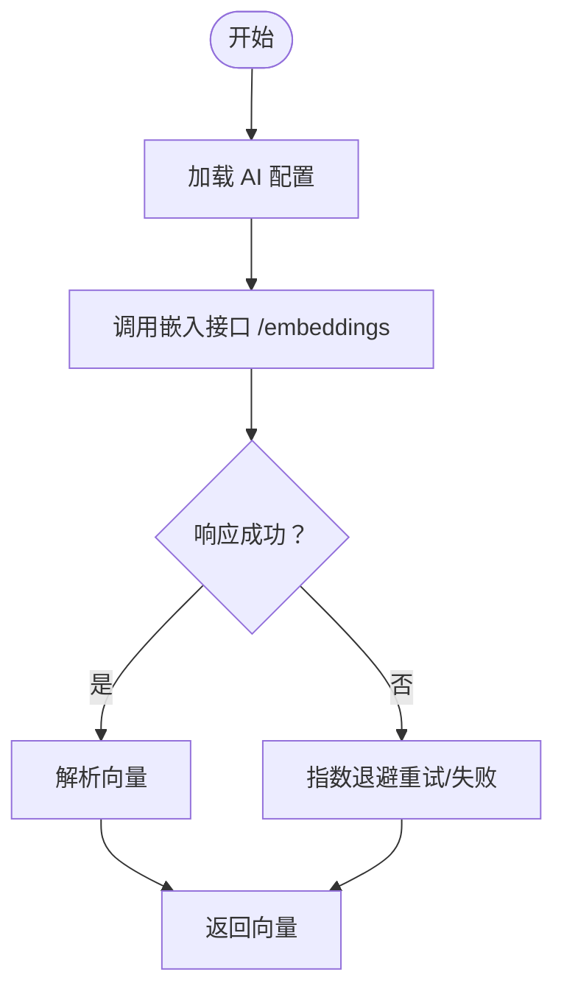
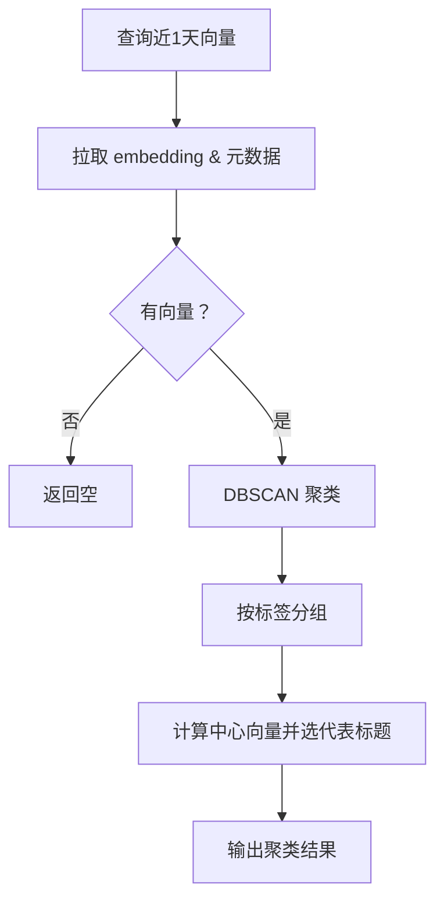
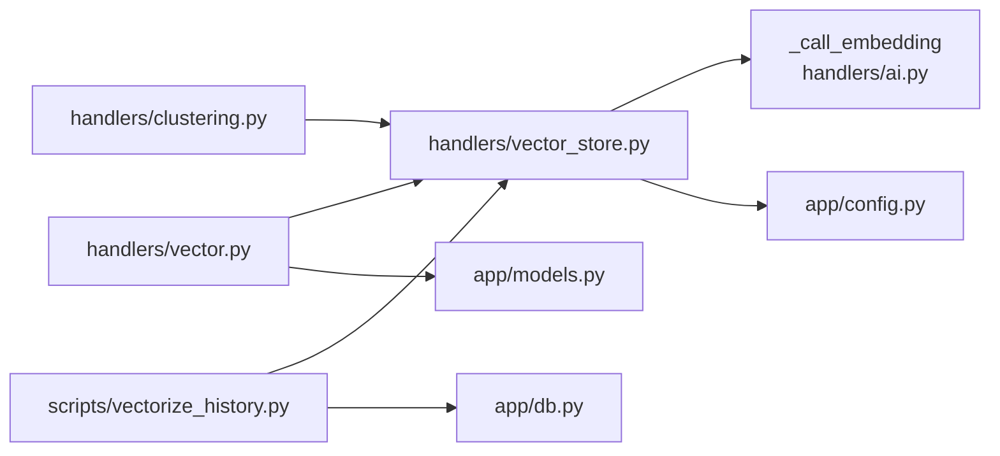

# 语义搜索系统

<cite>
**本文引用的文件**   
- [python-backend/app/handlers/vector.py](file://python-backend/app/handlers/vector.py)
- [python-backend/app/handlers/vector_store.py](file://python-backend/app/handlers/vector_store.py)
- [python-backend/app/handlers/ai.py](file://python-backend/app/handlers/ai.py)
- [python-backend/app/handlers/clustering.py](file://python-backend/app/handlers/clustering.py)
- [python-backend/app/handlers/entries.py](file://python-backend/app/handlers/entries.py)
- [python-backend/app/models.py](file://python-backend/app/models.py)
- [python-backend/app/config.py](file://python-backend/app/config.py)
- [python-backend/app/db.py](file://python-backend/app/db.py)
- [python-backend/app/main.py](file://python-backend/app/main.py)
- [python-backend/app/utils/filters.py](file://python-backend/app/utils/filters.py)
- [python-backend/scripts/vectorize_history.py](file://python-backend/scripts/vectorize_history.py)
- [python-backend/tests/test_vector_system.py](file://python-backend/tests/test_vector_system.py)
- [python-backend/requirements.txt](file://python-backend/requirements.txt)
</cite>

## 目录
1. [简介](#简介)
2. [项目结构](#项目结构)
3. [核心组件](#核心组件)
4. [架构总览](#架构总览)
5. [详细组件分析](#详细组件分析)
6. [依赖分析](#依赖分析)
7. [性能考虑](#性能考虑)
8. [故障排查指南](#故障排查指南)
9. [结论](#结论)
10. [附录](#附录)

## 简介
本文件面向 Tan RSS Reader 的语义搜索系统，系统基于向量嵌入与 Milvus 向量数据库实现，支持：
- 查询向量生成与相似度检索
- 基于 Cosine 相似度的排序
- 关键词混合搜索与过滤
- 结果后处理（去重、过滤、排序）
- 性能监控与调优（延迟、缓存、并发）
- 搜索 API 使用指南与评估指标
- 扩展性设计（分布式、增量更新、实时同步）

## 项目结构
后端采用 FastAPI + SQLAlchemy 异步 ORM + Milvus 向量数据库 + scikit-learn 聚类的组合。语义搜索相关代码集中在 handlers/vector.py、handlers/vector_store.py、handlers/ai.py 与 scripts/vectorize_history.py。

**图表来源**
- [python-backend/app/main.py:1-103](file://python-backend/app/main.py#L1-L103)
- [python-backend/app/handlers/vector.py:1-158](file://python-backend/app/handlers/vector.py#L1-L158)
- [python-backend/app/handlers/vector_store.py:1-197](file://python-backend/app/handlers/vector_store.py#L1-L197)
- [python-backend/app/handlers/ai.py:1-800](file://python-backend/app/handlers/ai.py#L1-L800)
- [python-backend/app/handlers/clustering.py:1-142](file://python-backend/app/handlers/clustering.py#L1-L142)
- [python-backend/scripts/vectorize_history.py:1-137](file://python-backend/scripts/vectorize_history.py#L1-L137)
- [python-backend/app/models.py:1-228](file://python-backend/app/models.py#L1-L228)
- [python-backend/app/db.py:1-27](file://python-backend/app/db.py#L1-L27)
- [python-backend/app/config.py:1-75](file://python-backend/app/config.py#L1-L75)

**章节来源**
- [python-backend/app/main.py:1-103](file://python-backend/app/main.py#L1-L103)
- [python-backend/app/handlers/vector.py:1-158](file://python-backend/app/handlers/vector.py#L1-L158)
- [python-backend/app/handlers/vector_store.py:1-197](file://python-backend/app/handlers/vector_store.py#L1-L197)
- [python-backend/app/handlers/ai.py:1-800](file://python-backend/app/handlers/ai.py#L1-L800)
- [python-backend/app/handlers/clustering.py:1-142](file://python-backend/app/handlers/clustering.py#L1-L142)
- [python-backend/scripts/vectorize_history.py:1-137](file://python-backend/scripts/vectorize_history.py#L1-L137)
- [python-backend/app/models.py:1-228](file://python-backend/app/models.py#L1-L228)
- [python-backend/app/db.py:1-27](file://python-backend/app/db.py#L1-L27)
- [python-backend/app/config.py:1-75](file://python-backend/app/config.py#L1-L75)

## 核心组件
- 向量存储封装：负责 Milvus 连接、集合初始化、向量插入、查询与搜索。
- 向量接口：提供 /vector/search、/vector/index、/vector/cluster 等 API。
- AI/嵌入调用：封装嵌入模型调用，统一配置与错误处理。
- 聚类服务：对近期向量进行 DBSCAN 聚类，提取主题。
- 历史向量化脚本：批量处理历史 RSS 条目并写入 Milvus。
- 数据模型与数据库：Entry、Feed、EntryAI 等模型支撑全文与向量索引。

**章节来源**
- [python-backend/app/handlers/vector_store.py:18-197](file://python-backend/app/handlers/vector_store.py#L18-L197)
- [python-backend/app/handlers/vector.py:108-158](file://python-backend/app/handlers/vector.py#L108-L158)
- [python-backend/app/handlers/ai.py:313-346](file://python-backend/app/handlers/ai.py#L313-L346)
- [python-backend/app/handlers/clustering.py:10-142](file://python-backend/app/handlers/clustering.py#L10-L142)
- [python-backend/scripts/vectorize_history.py:25-137](file://python-backend/scripts/vectorize_history.py#L25-L137)
- [python-backend/app/models.py:21-59](file://python-backend/app/models.py#L21-L59)

## 架构总览
语义搜索由“查询向量生成 → 向量检索 → 结果排序 → 后处理”构成闭环；同时提供聚类分析与历史批量向量化能力。

**图表来源**
- [python-backend/app/handlers/vector.py:108-111](file://python-backend/app/handlers/vector.py#L108-L111)
- [python-backend/app/handlers/vector_store.py:130-179](file://python-backend/app/handlers/vector_store.py#L130-L179)
- [python-backend/app/handlers/ai.py:313-346](file://python-backend/app/handlers/ai.py#L313-L346)

## 详细组件分析

### 向量存储封装（VectorStore）
- 连接与集合管理：支持本地 Milvus Lite 与远程 Milvus，自动建表与加载，设置 IVF_FLAT + COSINE 索引。
- 插入逻辑：根据 entry_id 去重（先查再删旧再插），写入 embedding、feed_id、published_at、title。
- 搜索逻辑：生成查询向量，按 feed_id 过滤，nprobe 参数控制召回与性能平衡，返回带分数的结果。
- 查询接口：支持按表达式查询指定字段，便于聚类等离线任务。

**图表来源**
- [python-backend/app/handlers/vector_store.py:18-197](file://python-backend/app/handlers/vector_store.py#L18-L197)

**章节来源**
- [python-backend/app/handlers/vector_store.py:23-91](file://python-backend/app/handlers/vector_store.py#L23-L91)
- [python-backend/app/handlers/vector_store.py:92-129](file://python-backend/app/handlers/vector_store.py#L92-L129)
- [python-backend/app/handlers/vector_store.py:130-179](file://python-backend/app/handlers/vector_store.py#L130-L179)
- [python-backend/app/handlers/vector_store.py:180-193](file://python-backend/app/handlers/vector_store.py#L180-L193)

### 向量接口（API）
- /vector/search：接收 query、limit、feed_id，调用 vector_store.search 返回结果。
- /vector/index：触发后台任务，批量向量化最近条目。
- /vector/cluster：对近期条目执行 DBSCAN 聚类。
- /vector/cluster/analyze：按条目 ID 组织时间线并生成趋势分析。

**图表来源**
- [python-backend/app/handlers/vector.py:146-158](file://python-backend/app/handlers/vector.py#L146-L158)
- [python-backend/app/handlers/vector.py:113-145](file://python-backend/app/handlers/vector.py#L113-L145)

**章节来源**
- [python-backend/app/handlers/vector.py:108-111](file://python-backend/app/handlers/vector.py#L108-L111)
- [python-backend/app/handlers/vector.py:146-158](file://python-backend/app/handlers/vector.py#L146-L158)
- [python-backend/app/handlers/vector.py:43-50](file://python-backend/app/handlers/vector.py#L43-L50)
- [python-backend/app/handlers/vector.py:52-106](file://python-backend/app/handlers/vector.py#L52-L106)

### AI/嵌入调用
- 统一配置：从环境变量与数据库行读取 AI 服务与嵌入模型配置。
- 嵌入调用：封装 /embeddings 接口，返回固定维度向量（1024）。
- 错误与限流：对 429 与网络异常进行重试与降级处理。

**图表来源**
- [python-backend/app/handlers/ai.py:34-64](file://python-backend/app/handlers/ai.py#L34-L64)
- [python-backend/app/handlers/ai.py:313-346](file://python-backend/app/handlers/ai.py#L313-L346)

**章节来源**
- [python-backend/app/handlers/ai.py:34-64](file://python-backend/app/handlers/ai.py#L34-L64)
- [python-backend/app/handlers/ai.py:313-346](file://python-backend/app/handlers/ai.py#L313-L346)

### 聚类服务（ClusteringService）
- 时间窗口过滤：默认最近 1 天内条目。
- 向量拉取：从 Milvus 查询 embedding 及元数据。
- DBSCAN 聚类：cosine 距离，eps 控制相似度阈值，min_samples 控制规模。
- 主题提取：以簇中心最相似条目作为代表标题。

**图表来源**
- [python-backend/app/handlers/clustering.py:14-139](file://python-backend/app/handlers/clustering.py#L14-L139)

**章节来源**
- [python-backend/app/handlers/clustering.py:14-139](file://python-backend/app/handlers/clustering.py#L14-L139)

### 历史向量化脚本
- 初始化 AI 配置与 Milvus 连接。
- 分页/并发控制：通过信号量限制并发，避免触发限流。
- 去重策略：可选择跳过已存在条目，或强制重新向量化。
- 清洗与截断：去除 HTML 标签，限制文本长度。

**章节来源**
- [python-backend/scripts/vectorize_history.py:25-137](file://python-backend/scripts/vectorize_history.py#L25-L137)

### 数据模型与过滤
- Entry/Feed/EntryAI 模型支撑条目、来源与 AI 结果存储。
- 日期过滤工具：支持按 created_at/published_at 与多种时间范围过滤。

**章节来源**
- [python-backend/app/models.py:21-59](file://python-backend/app/models.py#L21-L59)
- [python-backend/app/utils/filters.py:5-25](file://python-backend/app/utils/filters.py#L5-L25)

## 依赖分析
- 外部依赖：FastAPI、SQLAlchemy、PyMilvus、scikit-learn、httpx、celery、redis。
- 内部耦合：vector.py 依赖 vector_store 与 clustering；vector_store 依赖 ai.py 的嵌入调用；clustering 依赖 vector_store 查询；scripts/vectorize_history.py 依赖 vector_store 与数据库。

**图表来源**
- [python-backend/app/handlers/vector.py:1-158](file://python-backend/app/handlers/vector.py#L1-L158)
- [python-backend/app/handlers/vector_store.py:1-197](file://python-backend/app/handlers/vector_store.py#L1-L197)
- [python-backend/app/handlers/ai.py:1-800](file://python-backend/app/handlers/ai.py#L1-L800)
- [python-backend/app/handlers/clustering.py:1-142](file://python-backend/app/handlers/clustering.py#L1-L142)
- [python-backend/scripts/vectorize_history.py:1-137](file://python-backend/scripts/vectorize_history.py#L1-L137)
- [python-backend/app/db.py:1-27](file://python-backend/app/db.py#L1-L27)
- [python-backend/app/config.py:1-75](file://python-backend/app/config.py#L1-L75)
- [python-backend/app/models.py:1-228](file://python-backend/app/models.py#L1-L228)

**章节来源**
- [python-backend/requirements.txt:1-18](file://python-backend/requirements.txt#L1-L18)

## 性能考虑
- 查询延迟与索引参数
  - nprobe：越大召回越高但延迟上升，建议在生产中按 QPS 与延迟目标调参。
  - metric_type=COSINE：与嵌入模型一致，保证相似度语义。
- 并发与限流
  - 嵌入调用与 Milvus 操作均在独立线程/进程执行，避免阻塞事件循环。
  - 历史向量化脚本使用信号量限制并发，避免触发上游限流。
- 缓存策略
  - 嵌入结果未在后端缓存，建议在网关或边缘层增加短期缓存（需考虑隐私与一致性）。
- 数据库与索引
  - Milvus 集合按 COSINE + IVF_FLAT 索引，适合大规模向量检索；建议定期重建索引与统计健康度。

**章节来源**
- [python-backend/app/handlers/vector_store.py:140-143](file://python-backend/app/handlers/vector_store.py#L140-L143)
- [python-backend/app/handlers/vector_store.py:180-193](file://python-backend/app/handlers/vector_store.py#L180-L193)
- [python-backend/scripts/vectorize_history.py:62-62](file://python-backend/scripts/vectorize_history.py#L62-L62)

## 故障排查指南
- Milvus 连接失败
  - 检查 milvus_host/port/collection 名称配置；确认服务可达与权限。
  - 参考连接流程与异常日志。
- 嵌入调用失败
  - 核对 embedding base_url/model_name/api_key；关注 429 与超时。
- 搜索无结果
  - 确认集合已加载；检查 nprobe 与 expr 过滤条件；验证向量维度是否匹配。
- 聚类异常
  - 检查向量数量与维度；适当降低 eps 提高召回；确保时间窗口合理。

**章节来源**
- [python-backend/app/handlers/vector_store.py:23-54](file://python-backend/app/handlers/vector_store.py#L23-L54)
- [python-backend/app/handlers/ai.py:313-346](file://python-backend/app/handlers/ai.py#L313-L346)
- [python-backend/app/handlers/clustering.py:25-32](file://python-backend/app/handlers/clustering.py#L25-L32)

## 结论
该语义搜索系统以 Milvus 为核心，结合嵌入模型与 FastAPI 接口，实现了从向量化到检索的完整链路。通过聚类与历史批量向量化，系统具备持续学习与主题发现的能力。建议后续在缓存、限流与索引调优方面进一步完善，以满足更大规模与更高并发场景。

## 附录

### 搜索 API 使用指南
- 搜索接口
  - 方法：POST
  - 路径：/api/vector/search
  - 请求体字段：
    - query：字符串，查询文本
    - limit：整数，返回条数上限
    - feed_id：可选，按源过滤
  - 响应体字段：
    - results：数组，每项包含 id、score、title、published_at、feed_id、entry_id
- 索引接口
  - 方法：POST
  - 路径：/api/vector/index
  - 请求体字段：
    - force：布尔，是否强制重新向量化
  - 响应体字段：
    - message：字符串，提示信息
- 聚类接口
  - 方法：POST
  - 路径：/api/vector/cluster
  - 请求体字段：
    - days：整数，默认 1
    - min_samples：整数，默认 2
    - eps：浮点数，默认 0.3
  - 响应体字段：
    - clusters：数组，每项包含 cluster_id、size、topic、items
- 聚类分析接口
  - 方法：POST
  - 路径：/api/vector/cluster/analyze
  - 请求体字段：
    - entry_ids：字符串数组
  - 响应体字段：
    - timeline：按时间排序的条目列表
    - analysis：趋势分析（JSON 字段）
    - stats：时间分布统计

**章节来源**
- [python-backend/app/handlers/vector.py:22-36](file://python-backend/app/handlers/vector.py#L22-L36)
- [python-backend/app/handlers/vector.py:108-111](file://python-backend/app/handlers/vector.py#L108-L111)
- [python-backend/app/handlers/vector.py:146-158](file://python-backend/app/handlers/vector.py#L146-L158)
- [python-backend/app/handlers/vector.py:30-50](file://python-backend/app/handlers/vector.py#L30-L50)
- [python-backend/app/handlers/vector.py:52-106](file://python-backend/app/handlers/vector.py#L52-L106)

### 搜索优化策略
- 关键词混合搜索
  - 在查询前对 query 做清洗与增强，提升召回。
- 权重调整与相关性评分
  - 当前返回 Cosine 分数，可在外层对分数做归一化与加权融合（例如结合发布时间、来源权重）。
- 结果后处理
  - 去重：按 entry_id 去重；过滤：按 feed_id 与时间范围过滤；排序：按分数与时间综合排序。

**章节来源**
- [python-backend/app/handlers/vector_store.py:130-179](file://python-backend/app/handlers/vector_store.py#L130-L179)
- [python-backend/app/utils/filters.py:5-25](file://python-backend/app/utils/filters.py#L5-L25)

### 搜索效果评估与 A/B 测试
- 评估指标
  - 召回率、精确率、NDCG@k、平均倒数排名（MRR）、查询延迟 P50/P95。
- A/B 测试
  - 对比不同 nprobe、eps、过滤策略与后处理规则，随机分流用户并记录指标。
- 用户反馈
  - 收集点击/收藏/阅读时长等行为信号，结合日志与埋点进行离线评估。

[本节为通用实践建议，无需特定文件引用]

### 扩展性设计
- 分布式搜索
  - Milvus 支持分布式部署；建议引入负载均衡与副本策略。
- 增量更新
  - 通过条目变更事件驱动增量向量化；维护 entry_id 到 Milvus id 的映射以便快速更新。
- 实时同步
  - 结合 Celery/Redis 实现异步任务编排；前端轮询或 WebSocket 推送增量结果。

**章节来源**
- [python-backend/app/handlers/vector.py:113-145](file://python-backend/app/handlers/vector.py#L113-L145)
- [python-backend/requirements.txt:14-18](file://python-backend/requirements.txt#L14-L18)