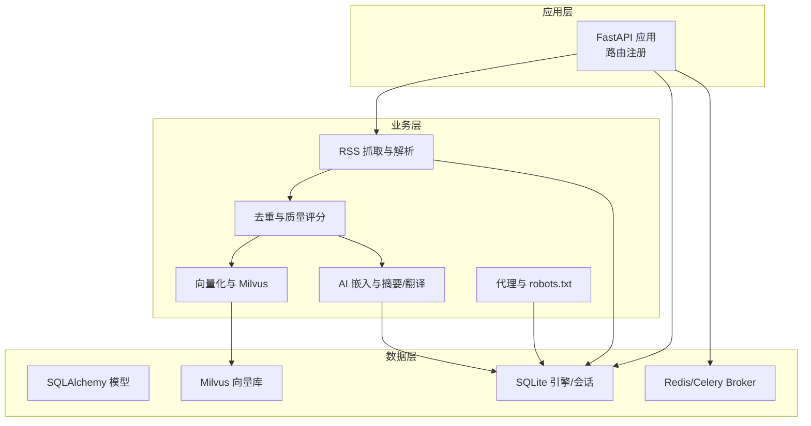
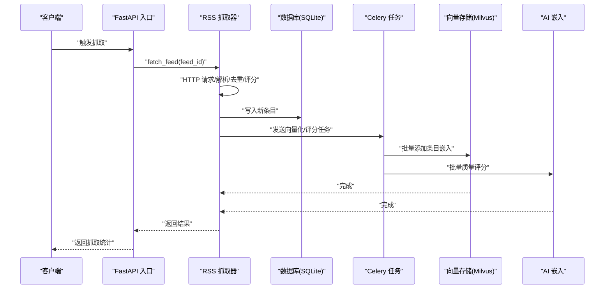
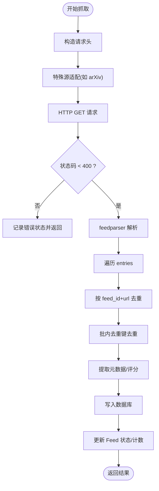
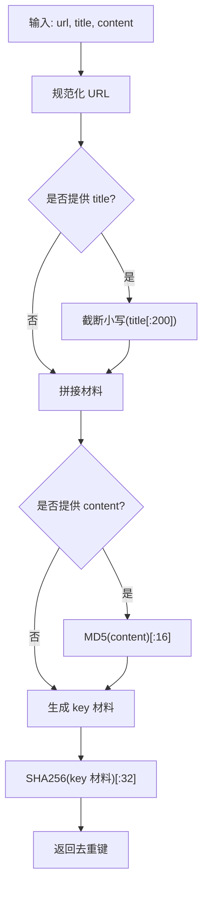
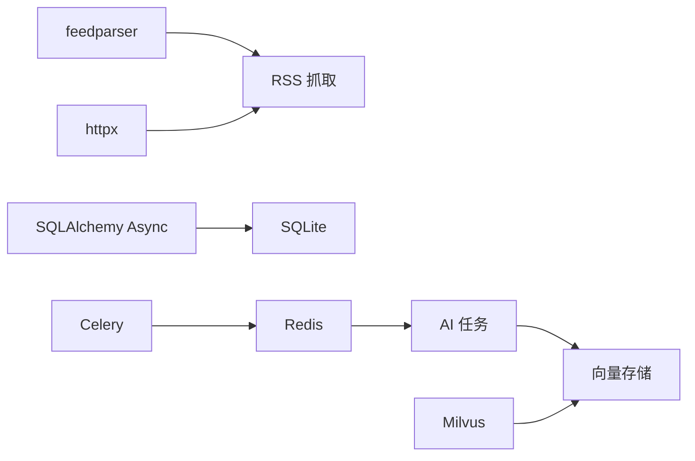

# RSS内容处理

<cite>
**本文引用的文件**
- [rss.py](file://python-backend/app/rss.py)
- [rss_fetcher.py](file://python-backend/app/services/rss_fetcher.py)
- [entries.py](file://python-backend/app/handlers/entries.py)
- [filters.py](file://python-backend/app/utils/filters.py)
- [models.py](file://python-backend/app/models.py)
- [ai_tasks.py](file://python-backend/app/tasks/ai_tasks.py)
- [vector_store.py](file://python-backend/app/handlers/vector_store.py)
- [ai.py](file://python-backend/app/handlers/ai.py)
- [db.py](file://python-backend/app/db.py)
- [celery_app.py](file://python-backend/app/celery_app.py)
- [config.py](file://python-backend/app/config.py)
- [requirements.txt](file://python-backend/requirements.txt)
- [main.py](file://python-backend/app/main.py)
- [proxy.py](file://python-backend/app/handlers/proxy.py)
</cite>

## 目录
1. [简介](#简介)
2. [项目结构](#项目结构)
3. [核心组件](#核心组件)
4. [架构总览](#架构总览)
5. [详细组件分析](#详细组件分析)
6. [依赖分析](#依赖分析)
7. [性能考虑](#性能考虑)
8. [故障排查指南](#故障排查指南)
9. [结论](#结论)
10. [附录](#附录)

## 简介
本文件面向 Tan RSS Reader 的 RSS 内容处理系统，围绕以下目标展开：RSS/Atom 解析与元数据提取、内容抓取服务（HTTP 请求、重试与超时、代理支持）、去重算法（指纹与相似度）、内容清洗与格式标准化、缓存策略与增量更新、批量处理与异步任务、性能优化与并发控制、以及错误处理与监控告警。文档在技术深度与可读性之间取得平衡，既适合开发者深入理解实现细节，也便于非技术读者把握整体流程。

## 项目结构
后端采用 Python + FastAPI + SQLAlchemy Async + Celery 的组合，核心模块分布如下：
- 应用入口与路由注册：[main.py](file://python-backend/app/main.py)
- 数据模型与数据库：[models.py](file://python-backend/app/models.py)、[db.py](file://python-backend/app/db.py)
- RSS 抓取与解析：[rss.py](file://python-backend/app/rss.py)、[rss_fetcher.py](file://python-backend/app/services/rss_fetcher.py)
- 内容去重与质量评分：[rss_fetcher.py](file://python-backend/app/services/rss_fetcher.py)
- 向量化与 Milvus 集成：[vector_store.py](file://python-backend/app/handlers/vector_store.py)、[ai_tasks.py](file://python-backend/app/tasks/ai_tasks.py)
- AI 服务与嵌入：[ai.py](file://python-backend/app/handlers/ai.py)
- 查询与过滤：[entries.py](file://python-backend/app/handlers/entries.py)、[filters.py](file://python-backend/app/utils/filters.py)
- 代理与 robots.txt 支持：[proxy.py](file://python-backend/app/handlers/proxy.py)
- 配置与 Celery：[config.py](file://python-backend/app/config.py)、[celery_app.py](file://python-backend/app/celery_app.py)
- 依赖声明：[requirements.txt](file://python-backend/requirements.txt)

**图表来源**
- [main.py:64-103](file://python-backend/app/main.py#L64-L103)
- [rss_fetcher.py:104-312](file://python-backend/app/services/rss_fetcher.py#L104-L312)
- [vector_store.py:18-197](file://python-backend/app/handlers/vector_store.py#L18-L197)
- [ai.py:34-64](file://python-backend/app/handlers/ai.py#L34-L64)
- [db.py:9-27](file://python-backend/app/db.py#L9-L27)
- [celery_app.py:7-23](file://python-backend/app/celery_app.py#L7-L23)

**章节来源**
- [main.py:1-103](file://python-backend/app/main.py#L1-L103)
- [requirements.txt:1-18](file://python-backend/requirements.txt#L1-L18)

## 核心组件
- RSS 抓取与解析：负责拉取 RSS/Atom 源、解析条目、提取标题、作者、摘要/正文、发布时间等元数据，并进行基础去重与质量评分。
- 内容去重：通过 URL 规范化、标题截断、内容 MD5 截断与 SHA256 组合生成去重键，避免重复入库。
- 质量评分：基于字数阈值与标题长度进行静态评分；同时支持异步/批量 AI 质量评分。
- 向量化与 Milvus：对新条目生成嵌入并写入 Milvus，支持按 feed_id 搜索与查询。
- 代理与 robots.txt：提供受控代理抓取与 robots.txt 校验，带 HTML 缓存。
- 查询与过滤：支持按时间范围、未读、收藏、高质量等条件筛选条目。
- 配置与调度：统一环境配置、Celery 任务队列、定时任务调度。

**章节来源**
- [rss_fetcher.py:13-27](file://python-backend/app/services/rss_fetcher.py#L13-L27)
- [rss_fetcher.py:104-312](file://python-backend/app/services/rss_fetcher.py#L104-L312)
- [vector_store.py:92-129](file://python-backend/app/handlers/vector_store.py#L92-L129)
- [proxy.py:93-138](file://python-backend/app/handlers/proxy.py#L93-L138)
- [entries.py:41-107](file://python-backend/app/handlers/entries.py#L41-L107)
- [config.py:41-75](file://python-backend/app/config.py#L41-L75)
- [celery_app.py:7-23](file://python-backend/app/celery_app.py#L7-L23)

## 架构总览
系统采用“同步抓取 + 异步处理”的模式。RSS 抓取在主服务中完成，随后通过 Celery 将向量化与批量质量评分作为后台任务投递，避免阻塞主请求路径。数据库使用 SQLite（异步），Milvus 作为向量存储，Redis 提供 Celery 的消息中间件。

**图表来源**
- [rss_fetcher.py:104-312](file://python-backend/app/services/rss_fetcher.py#L104-L312)
- [ai_tasks.py:16-51](file://python-backend/app/tasks/ai_tasks.py#L16-L51)
- [ai_tasks.py:53-87](file://python-backend/app/tasks/ai_tasks.py#L53-L87)
- [vector_store.py:92-129](file://python-backend/app/handlers/vector_store.py#L92-L129)

## 详细组件分析

### RSS 解析与抓取服务
- 支持 RSS/Atom 格式：使用 feedparser 解析文本/二进制响应，兼容多种变体。
- 编码与内容类型：优先使用响应二进制内容，再回退到文本；对 arXiv 特例转换为 API 查询。
- 元数据提取：标题、作者、摘要、正文（content 第一项优先）、发布/更新时间（UTC）。
- 基础去重：按 feed_id + url 去重；新增批内去重键集合，避免同批重复。
- 质量评分：根据字数与标题长度进行静态评分，超过阈值加分，上限 100。
- 结果封装：返回成功标志、消息、总数、新增数、耗时。

**图表来源**
- [rss_fetcher.py:104-312](file://python-backend/app/services/rss_fetcher.py#L104-L312)

**章节来源**
- [rss_fetcher.py:104-312](file://python-backend/app/services/rss_fetcher.py#L104-L312)
- [rss.py:28-94](file://python-backend/app/rss.py#L28-L94)

### 去重算法
- 去重键生成：
  - URL 规范化（强制 https，去除多余前缀）
  - 标题截断小写（前 200 字符）
  - 内容 MD5 截断（前 16 位）
  - 组合后进行 SHA256 截断（前 32 位）
- 批内去重：在单次抓取批次内维护集合，避免重复。
- 全局去重：检查数据库中已存在的 dedup_key，避免重复入库。

**图表来源**
- [rss_fetcher.py:13-27](file://python-backend/app/services/rss_fetcher.py#L13-L27)

**章节来源**
- [rss_fetcher.py:13-27](file://python-backend/app/services/rss_fetcher.py#L13-L27)
- [rss_fetcher.py:175-186](file://python-backend/app/services/rss_fetcher.py#L175-L186)

### 内容清洗与格式标准化
- 文本截断：对文本内容与标题进行长度限制，避免过大负载。
- 阅读时长估算：按词数估算（每 200 词约 1 分钟，最小 1 分钟）。
- 质量评分：字数阈值分级加分，标题长度加分，上限 100。
- 头像提取：从解析结果中尝试提取 favicon/logo/icon/link 并补全 Feed 信息。

**章节来源**
- [rss_fetcher.py:196-212](file://python-backend/app/services/rss_fetcher.py#L196-L212)
- [rss_fetcher.py:255-272](file://python-backend/app/services/rss_fetcher.py#L255-L272)

### 缓存策略、增量更新与批量处理
- 增量更新：仅对不存在的 url 进行入库；对已有条目跳过。
- 批量处理：抓取完成后，将新条目数据打包，异步投递 Celery 任务进行向量化与质量评分。
- 本地缓存：代理模块对 robots.txt 与 HTML 响应进行内存缓存，减少重复请求。
- 定时任务：应用启动时初始化设置与 AI 配置，并启动调度器。

**章节来源**
- [rss_fetcher.py:161-163](file://python-backend/app/services/rss_fetcher.py#L161-L163)
- [rss_fetcher.py:282-306](file://python-backend/app/services/rss_fetcher.py#L282-L306)
- [proxy.py:11-138](file://python-backend/app/handlers/proxy.py#L11-L138)
- [main.py:64-98](file://python-backend/app/main.py#L64-L98)

### HTTP 请求、重试机制、超时与代理支持
- 请求头：User-Agent、Accept、Accept-Language、Referer、Cache-Control 等。
- 超时：HTTP 客户端超时 30 秒，AI 请求超时 60 秒，流式请求 120 秒。
- 重试：AI 请求具备指数退避重试；网络错误与 429 场景自动等待后重试。
- 代理：提供受控代理抓取接口，支持 robots.txt 校验、HTML 缓存、Referer/语言/Cookie 注入。

**章节来源**
- [rss_fetcher.py:112-144](file://python-backend/app/services/rss_fetcher.py#L112-L144)
- [ai.py:195-228](file://python-backend/app/handlers/ai.py#L195-L228)
- [proxy.py:93-138](file://python-backend/app/handlers/proxy.py#L93-L138)

### 向量化与 Milvus 集成
- 连接与集合：支持本地 Milvus Lite 与远程 Milvus，自动建集合与索引。
- 插入逻辑：先删除同 entry_id 的旧记录，再插入新记录；嵌入维度固定。
- 搜索与查询：支持 COSINE 距离检索，按 feed_id 过滤，输出标题、时间、feed_id、entry_id。

**章节来源**
- [vector_store.py:23-91](file://python-backend/app/handlers/vector_store.py#L23-L91)
- [vector_store.py:92-129](file://python-backend/app/handlers/vector_store.py#L92-L129)
- [vector_store.py:130-179](file://python-backend/app/handlers/vector_store.py#L130-L179)

### AI 质量评分与批量任务
- 批量评分：将新条目标题与正文提交 AI 评分，异步写回数据库。
- Celery 任务：提供向量化与批量评分两个 Celery 任务，支持失败回退至 asyncio。
- 配置：支持用户级与平台级 AI 配置合并，含 API Key、Base URL、模型名、向量配置与功能开关。

**章节来源**
- [ai_tasks.py:16-51](file://python-backend/app/tasks/ai_tasks.py#L16-L51)
- [ai_tasks.py:53-87](file://python-backend/app/tasks/ai_tasks.py#L53-L87)
- [ai.py:34-64](file://python-backend/app/handlers/ai.py#L34-L64)
- [ai.py:428-504](file://python-backend/app/handlers/ai.py#L428-L504)

### 查询与过滤
- 条件过滤：支持按 feed_id、分组、未读、收藏、高质量、日期范围、排序字段等。
- 日期过滤：支持 1/2/3/7/30/90/180/365 天等快捷范围，可选择 created_at 或 published_at。
- 输出映射：将数据库记录映射为 API 返回模型，包含翻译标题等扩展字段。

**章节来源**
- [entries.py:41-107](file://python-backend/app/handlers/entries.py#L41-L107)
- [filters.py:5-25](file://python-backend/app/utils/filters.py#L5-L25)

## 依赖分析
- 核心依赖：feedparser、httpx、SQLAlchemy Async、Celery、Redis、Milvus。
- 数据库：SQLite（异步），通过 SQLAlchemy Async Engine 管理连接池。
- 向量库：Milvus，支持本地 lite 与远程部署。
- 任务队列：Redis 作为 Celery 的 Broker/Backend。

**图表来源**
- [requirements.txt:1-18](file://python-backend/requirements.txt#L1-L18)
- [db.py:24-25](file://python-backend/app/db.py#L24-L25)
- [celery_app.py:7-23](file://python-backend/app/celery_app.py#L7-L23)

**章节来源**
- [requirements.txt:1-18](file://python-backend/requirements.txt#L1-L18)
- [db.py:24-25](file://python-backend/app/db.py#L24-L25)
- [celery_app.py:7-23](file://python-backend/app/celery_app.py#L7-L23)

## 性能考虑
- 并发与异步：HTTP 请求与数据库操作均采用异步，降低阻塞；向量化与 AI 评分通过 Celery 异步执行。
- 批量处理：抓取完成后批量投递任务，减少任务调度开销。
- 缓存：代理模块对 robots.txt 与 HTML 响应进行短期缓存，降低重复请求。
- 数据库索引：Entry 表对 feed_id 与 dedup_key 建有索引，提升去重与查询效率。
- 资源限制：Celery 任务超时配置，避免长时间占用资源。

**章节来源**
- [rss_fetcher.py:282-306](file://python-backend/app/services/rss_fetcher.py#L282-L306)
- [proxy.py:11-138](file://python-backend/app/handlers/proxy.py#L11-L138)
- [models.py:24-38](file://python-backend/app/models.py#L24-L38)
- [celery_app.py:14-22](file://python-backend/app/celery_app.py#L14-L22)

## 故障排查指南
- HTTP 错误：抓取返回 4xx/5xx 时记录 last_status 与 error_count，便于定位。
- 网络错误：RequestError 统一捕获并记录，返回空结果。
- 解析错误：若 bozo 标记为真且无条目，标记为解析错误。
- AI 限流：429 时按指数退避重试，超过最大重试则报错。
- 代理受限：robots.txt 不允许访问时返回 403。
- 向量库不可用：连接失败或集合未就绪时记录错误并跳过。

**章节来源**
- [rss_fetcher.py:126-144](file://python-backend/app/services/rss_fetcher.py#L126-L144)
- [rss_fetcher.py:274-280](file://python-backend/app/services/rss_fetcher.py#L274-L280)
- [ai.py:195-228](file://python-backend/app/handlers/ai.py#L195-L228)
- [proxy.py:55-67](file://python-backend/app/handlers/proxy.py#L55-L67)
- [vector_store.py:23-54](file://python-backend/app/handlers/vector_store.py#L23-L54)

## 结论
该系统以异步与任务队列为核心，实现了高吞吐的 RSS 内容抓取、去重与增强（质量评分、向量化）。通过 Milvus 实现语义检索，配合 FastAPI 提供稳定的 API 接口。建议在生产环境中启用 Celery 与 Redis，合理配置超时与重试策略，并对 robots.txt 与代理进行安全管控。

## 附录
- 关键配置项：数据库 URL、Redis URL、Milvus 主机/端口/集合名、AI 服务基地址与模型、默认抓取间隔等。
- 数据模型概览：Feed、Entry、SiteIcon、EntryAI、RSSHubConfig、AppSettingsRow、AIConfigRow、Channel/Category/Tag 等。

**章节来源**
- [config.py:41-75](file://python-backend/app/config.py#L41-L75)
- [models.py:7-228](file://python-backend/app/models.py#L7-L228)