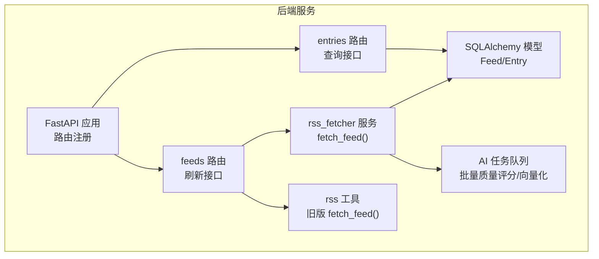
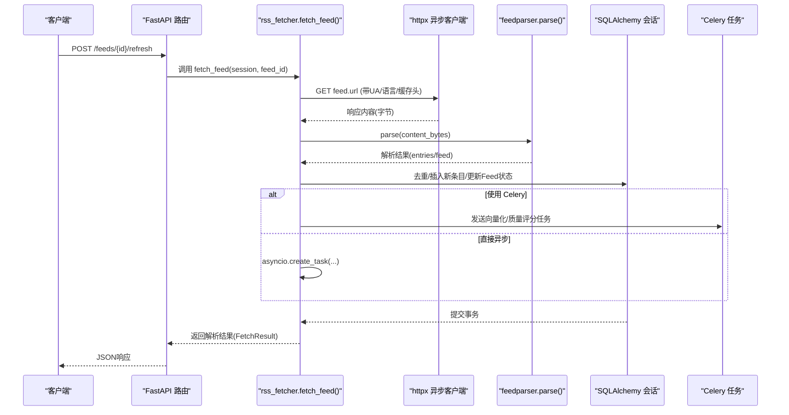
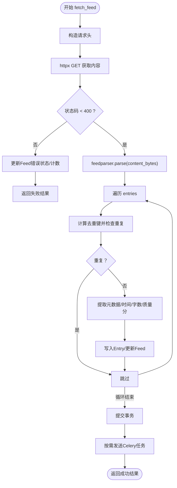
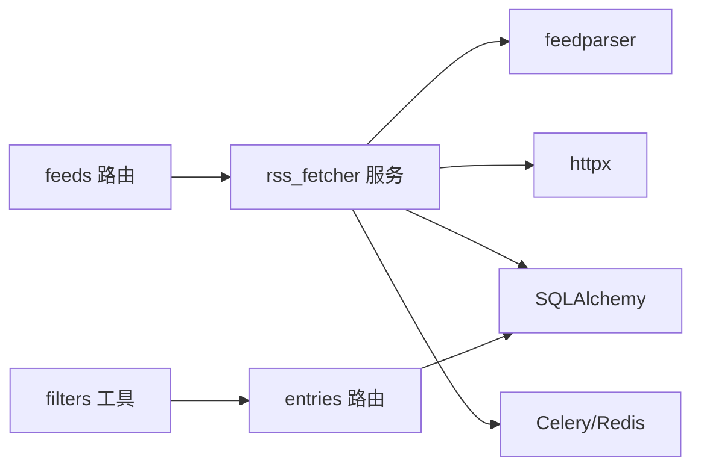

# RSS解析器

<cite>
**本文引用的文件**
- [rss_fetcher.py](file://python-backend/app/services/rss_fetcher.py)
- [rss.py](file://python-backend/app/rss.py)
- [models.py](file://python-backend/app/models.py)
- [ai_tasks.py](file://python-backend/app/tasks/ai_tasks.py)
- [requirements.txt](file://python-backend/requirements.txt)
- [feeds.py](file://python-backend/app/handlers/feeds.py)
- [entries.py](file://python-backend/app/handlers/entries.py)
- [filters.py](file://python-backend/app/utils/filters.py)
- [main.py](file://python-backend/app/main.py)
- [config.py](file://python-backend/app/config.py)
</cite>

## 目录
1. [简介](#简介)
2. [项目结构](#项目结构)
3. [核心组件](#核心组件)
4. [架构总览](#架构总览)
5. [详细组件分析](#详细组件分析)
6. [依赖分析](#依赖分析)
7. [性能考虑](#性能考虑)
8. [故障排查指南](#故障排查指南)
9. [结论](#结论)
10. [附录](#附录)

## 简介
本文件面向Tan RSS Reader的后端RSS解析能力，系统化梳理基于feedparser的解析流程与实现细节，覆盖以下主题：
- feedparser在RSS 2.0、Atom 1.0等标准格式上的支持与行为
- 元数据提取：标题、作者、摘要、发布时间等字段的解析策略
- 编码处理机制：自动检测与转换（含UTF-8、GBK等常见编码）
- 内容解析策略：content字段优先级、摘要回退机制、多媒体内容处理
- 解析错误处理、异常恢复与兼容性保障
- 性能优化技巧与内存管理策略

## 项目结构
后端采用FastAPI + SQLAlchemy + feedparser的组合，RSS解析集中在服务层，通过HTTP客户端抓取并解析，随后持久化到数据库，并异步触发向量化与质量评分任务。

图表来源
- [main.py:64-103](file://python-backend/app/main.py#L64-L103)
- [feeds.py:472-477](file://python-backend/app/handlers/feeds.py#L472-L477)
- [rss_fetcher.py:104-312](file://python-backend/app/services/rss_fetcher.py#L104-L312)
- [rss.py:28-94](file://python-backend/app/rss.py#L28-L94)
- [ai_tasks.py:16-87](file://python-backend/app/tasks/ai_tasks.py#L16-L87)
- [models.py:7-39](file://python-backend/app/models.py#L7-L39)

章节来源
- [main.py:1-103](file://python-backend/app/main.py#L1-L103)
- [feeds.py:1-477](file://python-backend/app/handlers/feeds.py#L1-L477)
- [rss_fetcher.py:1-312](file://python-backend/app/services/rss_fetcher.py#L1-L312)
- [rss.py:1-94](file://python-backend/app/rss.py#L1-L94)
- [models.py:1-228](file://python-backend/app/models.py#L1-L228)

## 核心组件
- RSS解析服务：负责抓取远程源、调用feedparser解析、去重、入库、异步任务调度
- 数据模型：定义Feed与Entry的字段与索引，支撑解析结果存储
- 路由接口：提供刷新、查询等REST接口，驱动解析流程
- AI任务：Celery任务封装，执行批量质量评分与向量化
- 配置与设置：应用参数、AI开关、向量库配置

章节来源
- [rss_fetcher.py:104-312](file://python-backend/app/services/rss_fetcher.py#L104-L312)
- [models.py:7-39](file://python-backend/app/models.py#L7-L39)
- [feeds.py:472-477](file://python-backend/app/handlers/feeds.py#L472-L477)
- [ai_tasks.py:16-87](file://python-backend/app/tasks/ai_tasks.py#L16-L87)
- [config.py:1-75](file://python-backend/app/config.py#L1-L75)

## 架构总览
下图展示一次“刷新订阅”请求的端到端流程，包括网络请求、解析、入库、异步任务与返回结果。

图表来源
- [feeds.py:472-477](file://python-backend/app/handlers/feeds.py#L472-L477)
- [rss_fetcher.py:104-312](file://python-backend/app/services/rss_fetcher.py#L104-L312)
- [ai_tasks.py:16-87](file://python-backend/app/tasks/ai_tasks.py#L16-L87)

## 详细组件分析

### 组件A：RSS解析服务（rss_fetcher.fetch_feed）
- 功能职责
  - 抓取订阅源内容（支持HTTP/HTTPS，自动跟随重定向）
  - 使用feedparser解析字节流，兼容RSS 2.0、Atom 1.0等
  - 基于URL、标题、内容MD5的复合去重键避免重复入库
  - 提取并清洗元数据：标题、作者、摘要、正文、发布时间
  - 计算阅读时长、质量分（基于字数与标题长度）
  - 更新Feed状态与错误计数
  - 触发向量化与质量评分的异步任务（可选Celery）

- 关键实现要点
  - 请求头与重试策略：User-Agent、Accept、Accept-Language、Referer、Cache-Control；对404/403场景尝试追加斜杠
  - 编码处理：直接以resp.content传入feedparser.parse()，由feedparser内部处理编码与解码
  - 内容解析策略：优先content列表首项的value，否则回退到summary；同时生成文本片段用于向量化
  - 时间解析：优先published_parsed，其次updated_parsed，异常则置空
  - 去重策略：compute_dedup_key综合URL标准化、标题前缀与内容MD5前缀，批次内二次校验
  - 异步任务：根据USE_CELERY环境变量选择Celery或直接异步执行

- 错误处理与兼容性
  - 网络错误：记录“network error”，增加错误计数
  - HTTP错误：记录HTTP状态字符串，增加错误计数
  - 解析错误：若entries为空且bozo标志为真，标记“parse error”
  - 成功：清零错误计数，记录成功状态

- 性能与内存
  - 批量构建entries_data与new_entries_for_scoring，减少多次I/O
  - 文本截断：向量化文本限制长度，降低向量库压力
  - 读写分离：解析与入库在同事务中完成，确保一致性

图表来源
- [rss_fetcher.py:104-312](file://python-backend/app/services/rss_fetcher.py#L104-L312)

章节来源
- [rss_fetcher.py:104-312](file://python-backend/app/services/rss_fetcher.py#L104-L312)

### 组件B：数据模型（Feed/Entry）
- 字段设计
  - Feed：标识、标题、URL、图标、更新间隔、最后更新时间、状态、错误计数
  - Entry：标题、URL、作者、摘要、正文、发布时间、阅读状态、字数、阅读时长、质量分、去重键
- 索引策略
  - Entry.feed_id、Entry.dedup_key建立索引，加速查询与去重
- 与解析流程的关系
  - 解析结果映射到模型字段，Feed状态随解析结果更新

章节来源
- [models.py:7-39](file://python-backend/app/models.py#L7-L39)

### 组件C：路由与接口（feeds/entries）
- 刷新接口：/feeds/{id}/refresh，调用解析服务并返回解析统计
- 查询接口：/entries 支持多种过滤条件（未读、收藏、日期范围、排序），结合AI翻译字段进行展示增强
- 日期过滤工具：apply_date_filter_to_entries_query统一处理时间字段与范围

章节来源
- [feeds.py:472-477](file://python-backend/app/handlers/feeds.py#L472-L477)
- [entries.py:41-107](file://python-backend/app/handlers/entries.py#L41-L107)
- [filters.py:5-25](file://python-backend/app/utils/filters.py#L5-L25)

### 组件D：AI任务（批量质量评分/向量化）
- 批量质量评分：根据标题与正文调用AI接口，批量更新quality_score
- 向量化：将文本、标题、发布时间等信息写入向量库
- 任务执行：支持Celery队列或直接异步执行

章节来源
- [ai_tasks.py:16-87](file://python-backend/app/tasks/ai_tasks.py#L16-L87)

### 组件E：旧版解析器（rss.py）
- 与新版rss_fetcher对比
  - 旧版直接以resp.text传入feedparser.parse()，新版使用resp.content，更贴近feedparser期望的字节输入
  - 新版引入去重键、质量分、向量化与Celery任务
  - 新版对arXiv等特殊源做了目标URL改写
- 迁移建议
  - 推荐使用rss_fetcher作为主解析入口，保持与新功能一致

章节来源
- [rss.py:28-94](file://python-backend/app/rss.py#L28-L94)

## 依赖分析
- 外部库
  - feedparser：核心解析器，自动处理多种RSS/Atom变体与编码
  - httpx：异步HTTP客户端，支持超时、重定向与自定义请求头
  - celery/redis：异步任务队列，用于向量化与质量评分
  - SQLAlchemy：ORM与数据库访问
- 内部模块耦合
  - 路由层仅依赖服务层接口，服务层依赖feedparser与数据库
  - AI任务通过Celery桥接到服务层逻辑，避免阻塞主流程

图表来源
- [requirements.txt:1-18](file://python-backend/requirements.txt#L1-L18)
- [rss_fetcher.py:104-312](file://python-backend/app/services/rss_fetcher.py#L104-L312)
- [feeds.py:472-477](file://python-backend/app/handlers/feeds.py#L472-L477)
- [entries.py:41-107](file://python-backend/app/handlers/entries.py#L41-L107)
- [filters.py:5-25](file://python-backend/app/utils/filters.py#L5-L25)

章节来源
- [requirements.txt:1-18](file://python-backend/requirements.txt#L1-L18)

## 性能考虑
- 并发与异步
  - 使用httpx异步客户端提升并发抓取效率
  - 解析完成后通过Celery或异步任务处理非关键路径（向量化、质量评分）
- 内存与I/O
  - 批量构建entries_data与new_entries_for_scoring，减少数据库往返
  - 对向量化文本进行长度截断，控制单条向量大小
- 去重与索引
  - 使用dedup_key索引与数据库唯一约束，降低重复写入成本
- 缓存与头部
  - 设置合理的Accept、Accept-Language与Cache-Control，减少服务器负载
- 任务调度
  - 通过USE_CELERY切换任务执行方式，避免主线程阻塞

## 故障排查指南
- 常见错误类型
  - 网络错误：检查代理、DNS、防火墙；确认User-Agent与Referer是否被站点拦截
  - HTTP错误：关注状态码，必要时尝试追加斜杠或调整请求头
  - 解析错误：当entries为空且bozo为真，检查源站XML合法性与编码声明
- 定位步骤
  - 查看Feed.last_status与error_count
  - 检查日志输出（服务端与Celery worker）
  - 验证arXiv等特殊源的目标URL改写逻辑
- 兼容性建议
  - 对于GBK等非UTF-8编码源，feedparser通常能自动处理；如仍出现乱码，可在上游增加charset检测与转换
  - 对于缺少pubDate的源，解析器可能无法生成published_at，属预期行为

章节来源
- [rss_fetcher.py:126-144](file://python-backend/app/services/rss_fetcher.py#L126-L144)
- [rss_fetcher.py:273-280](file://python-backend/app/services/rss_fetcher.py#L273-L280)

## 结论
Tan RSS Reader的RSS解析体系以feedparser为核心，结合异步抓取、去重与质量评分，形成高可用、可扩展的解析链路。通过明确的元数据提取策略、健壮的错误处理与任务解耦，系统在保证兼容性的前提下兼顾性能与可维护性。建议在生产环境中启用Celery以进一步提升吞吐，并持续监控Feed状态与错误率，及时修复异常源。

## 附录

### 字段解析与回退策略
- 标题：缺失时回退为“Untitled”
- 作者：直接取author字段
- 摘要：summary字段
- 正文：优先content列表首项的value，否则回退到summary
- 发布时间：优先published_parsed，其次updated_parsed，异常则置空
- 阅读时长：基于字数估算，最小1分钟
- 质量分：基于字数与标题长度的启发式规则

章节来源
- [rss_fetcher.py:165-212](file://python-backend/app/services/rss_fetcher.py#L165-L212)

### 编码处理机制
- 输入：resp.content（字节）传入feedparser.parse()
- 自动检测：feedparser内部处理XML/HTML声明的编码
- 常见编码：UTF-8、GBK等均被feedparser兼容处理
- 建议：如遇到特定站点的非标准编码，可在上游增加charset修正逻辑

章节来源
- [rss_fetcher.py:146-147](file://python-backend/app/services/rss_fetcher.py#L146-L147)

### 去重策略说明
- URL标准化：统一为https，去除多余协议前缀
- 标题参与：取前200字符小写
- 内容参与：对内容进行UTF-8编码后取MD5前16位，再拼接
- 最终键：对上述材料做SHA256取前32位
- 批次内与全局双重校验，避免重复入库

章节来源
- [rss_fetcher.py:13-27](file://python-backend/app/services/rss_fetcher.py#L13-L27)
- [rss_fetcher.py:175-184](file://python-backend/app/services/rss_fetcher.py#L175-L184)