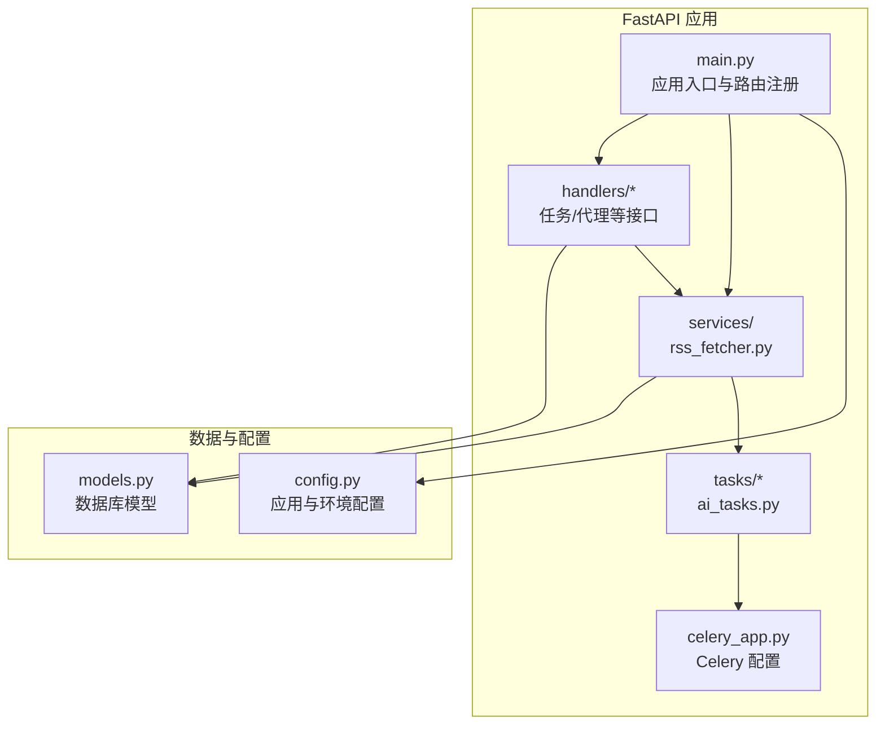
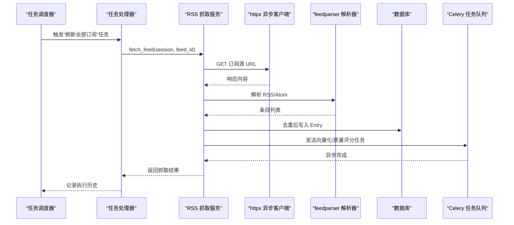
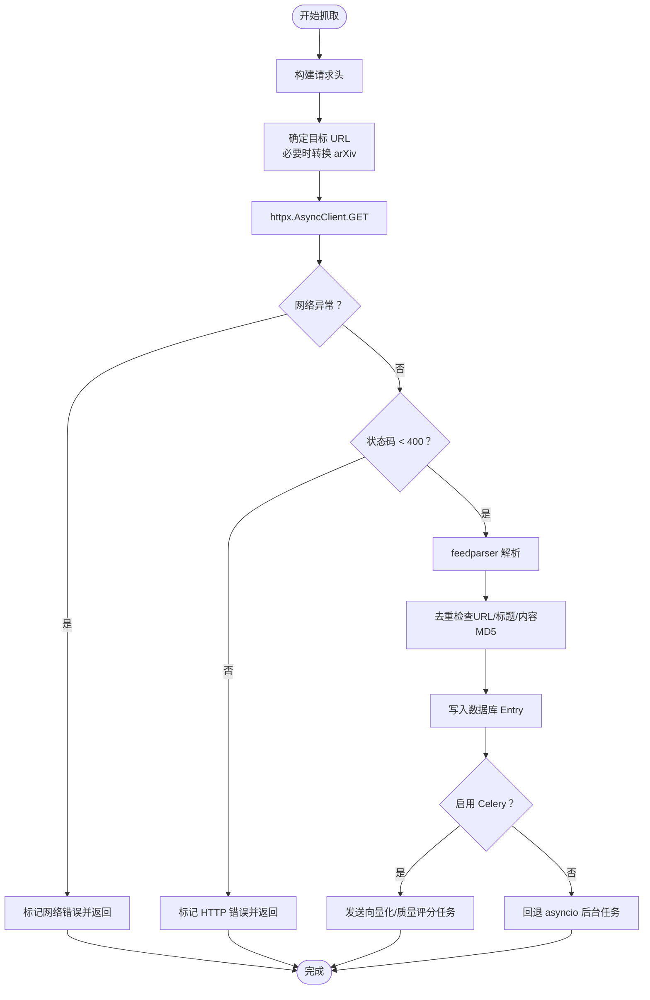
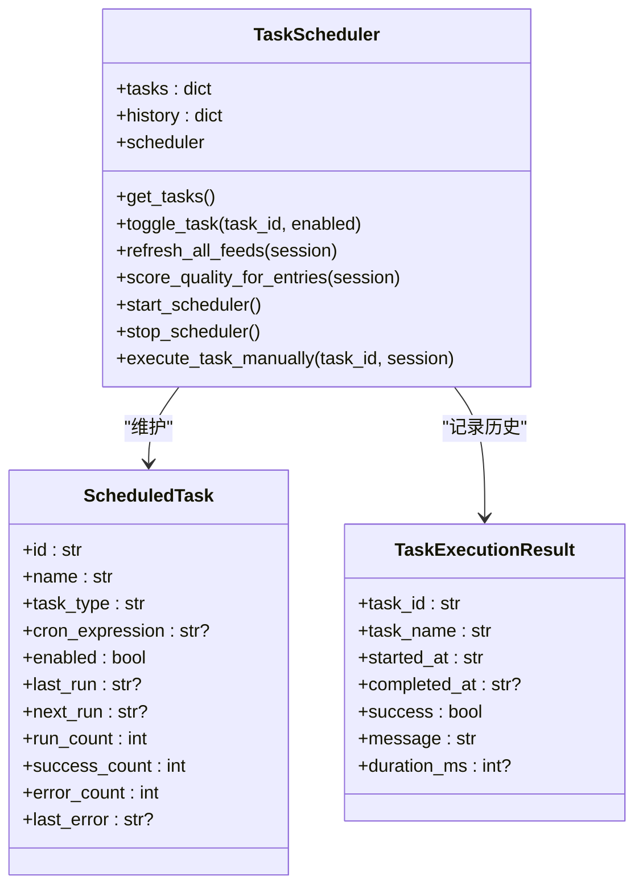
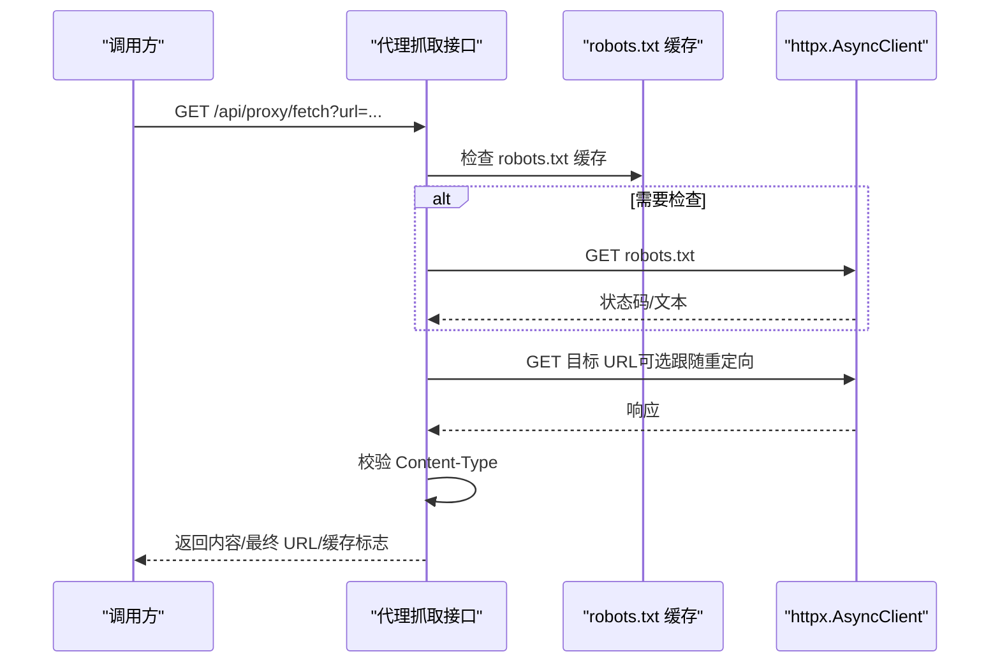
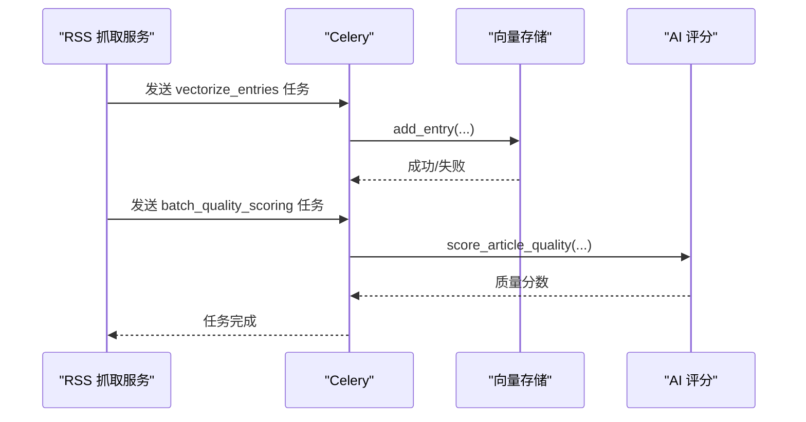
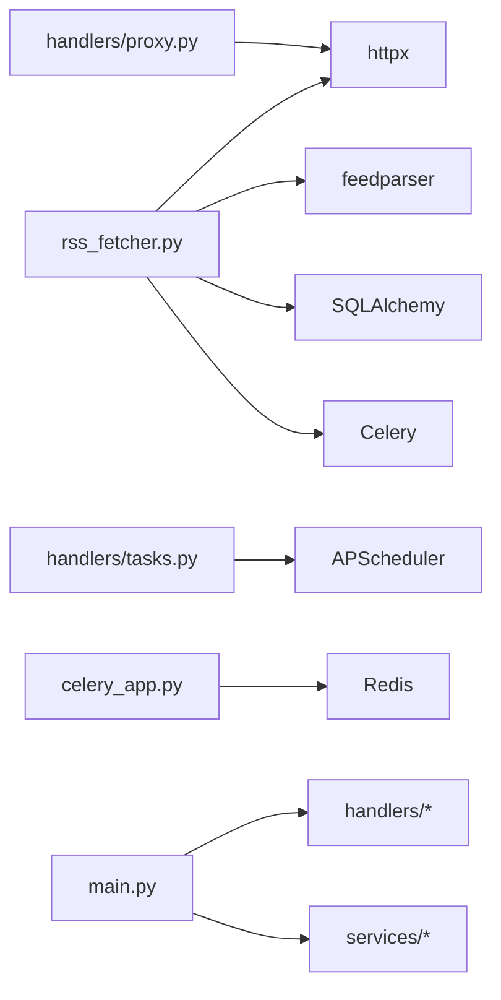
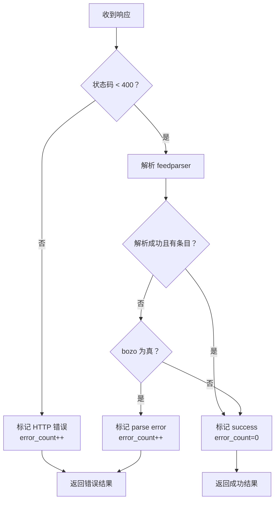

# 内容抓取服务

<cite>
**本文引用的文件**
- [rss_fetcher.py](file://python-backend/app/services/rss_fetcher.py)
- [tasks.py](file://python-backend/app/handlers/tasks.py)
- [proxy.py](file://python-backend/app/handlers/proxy.py)
- [rss.py](file://python-backend/app/rss.py)
- [config.py](file://python-backend/app/config.py)
- [celery_app.py](file://python-backend/app/celery_app.py)
- [main.py](file://python-backend/app/main.py)
- [ai_tasks.py](file://python-backend/app/tasks/ai_tasks.py)
- [models.py](file://python-backend/app/models.py)
- [requirements.txt](file://python-backend/requirements.txt)
</cite>

## 目录
1. [简介](#简介)
2. [项目结构](#项目结构)
3. [核心组件](#核心组件)
4. [架构总览](#架构总览)
5. [详细组件分析](#详细组件分析)
6. [依赖关系分析](#依赖关系分析)
7. [性能与并发特性](#性能与并发特性)
8. [网络配置与代理支持](#网络配置与代理支持)
9. [响应处理与状态码管理](#响应处理与状态码管理)
10. [异常处理与重试策略](#异常处理与重试策略)
11. [性能监控与故障诊断](#性能监控与故障诊断)
12. [结论](#结论)

## 简介
本文件面向 Tan RSS Reader 的内容抓取服务，系统性梳理其 HTTP 客户端配置（超时、重试、连接池）、并发抓取策略（异步请求、队列与资源限制）、代理支持（HTTP/SOCKS 自定义头部）、响应处理（成功/重定向/错误）以及网络异常处理、性能监控与故障诊断方法。文档基于实际源码进行分析，并通过图示帮助读者快速理解系统行为。

## 项目结构
后端采用 FastAPI + SQLAlchemy + httpx 异步客户端，结合 APScheduler 调度器与 Celery 异步任务队列实现定时抓取与后续处理（向量化、质量评分）。RSS 抓取主流程位于服务层，调度与手动执行由任务处理器提供，代理抓取能力由独立路由提供。

图表来源
- [main.py:1-103](file://python-backend/app/main.py#L1-L103)
- [rss_fetcher.py:1-312](file://python-backend/app/services/rss_fetcher.py#L1-L312)
- [tasks.py:1-276](file://python-backend/app/handlers/tasks.py#L1-L276)
- [proxy.py:1-138](file://python-backend/app/handlers/proxy.py#L1-L138)
- [ai_tasks.py:1-87](file://python-backend/app/tasks/ai_tasks.py#L1-L87)
- [celery_app.py:1-23](file://python-backend/app/celery_app.py#L1-L23)
- [config.py:1-75](file://python-backend/app/config.py#L1-L75)
- [models.py:1-228](file://python-backend/app/models.py#L1-L228)

章节来源
- [main.py:1-103](file://python-backend/app/main.py#L1-L103)
- [requirements.txt:1-18](file://python-backend/requirements.txt#L1-L18)

## 核心组件
- RSS 抓取服务：负责单个订阅源的抓取、解析、去重、入库与后续异步处理。
- 任务调度器：周期性刷新所有订阅源，支持手动触发与启停。
- 代理抓取接口：对任意网页进行代理抓取，支持 robots.txt 检查与缓存。
- Celery 异步任务：向量化新文章与批量质量评分，可回退到 asyncio 任务。
- 数据模型：Feed/Entry/SiteIcon 等，承载抓取结果与状态信息。

章节来源
- [rss_fetcher.py:104-312](file://python-backend/app/services/rss_fetcher.py#L104-L312)
- [tasks.py:57-228](file://python-backend/app/handlers/tasks.py#L57-L228)
- [proxy.py:93-138](file://python-backend/app/handlers/proxy.py#L93-L138)
- [ai_tasks.py:16-87](file://python-backend/app/tasks/ai_tasks.py#L16-L87)
- [models.py:7-39](file://python-backend/app/models.py#L7-L39)

## 架构总览
下图展示从调度到抓取、解析、入库与异步处理的整体流程。

图表来源
- [tasks.py:77-97](file://python-backend/app/handlers/tasks.py#L77-L97)
- [rss_fetcher.py:104-312](file://python-backend/app/services/rss_fetcher.py#L104-L312)
- [ai_tasks.py:16-87](file://python-backend/app/tasks/ai_tasks.py#L16-L87)

## 详细组件分析

### 组件一：RSS 抓取服务（异步抓取与解析）
- HTTP 客户端配置
  - 使用 httpx.AsyncClient，设置超时时间、跟随重定向、自定义请求头。
  - 对特定站点（如 arXiv）进行目标 URL 转换以获取标准 Atom 接口。
- 响应处理
  - 捕获网络异常并记录错误状态；对 4xx/5xx 返回错误状态。
  - 使用 feedparser 解析内容，提取条目并进行入库前的字段处理。
- 去重策略
  - 基于 URL、标题与内容 MD5 前缀生成去重键，避免重复入库。
- 入库与后续处理
  - 将新条目写入数据库；根据开关决定是否使用 Celery 执行向量化与质量评分。
  - 若未启用 Celery，则回退到 asyncio 创建后台任务。

图表来源
- [rss_fetcher.py:104-312](file://python-backend/app/services/rss_fetcher.py#L104-L312)

章节来源
- [rss_fetcher.py:104-312](file://python-backend/app/services/rss_fetcher.py#L104-L312)

### 组件二：任务调度器（周期性与手动执行）
- 周期性任务
  - 使用 APScheduler 在固定间隔触发“刷新全部订阅”任务。
  - 另一个任务定期对未打分的文章进行批量质量评分。
- 手动执行
  - 提供接口手动触发任务，记录每次执行的开始/结束时间、耗时与结果。
- 任务历史
  - 维护每个任务的运行次数、成功/失败计数与最近一次错误信息。

图表来源
- [tasks.py:57-228](file://python-backend/app/handlers/tasks.py#L57-L228)

章节来源
- [tasks.py:57-228](file://python-backend/app/handlers/tasks.py#L57-L228)

### 组件三：代理抓取接口（网页代理）
- 功能
  - 对任意 HTTP/HTTPS URL 进行代理抓取，支持自定义 UA、语言、Referer、Cookie。
  - 可选择尊重 robots.txt 并进行缓存控制。
- 缓存与 robots.txt
  - robots.txt 与 HTML 内容分别缓存，带 TTL 控制。
- 错误处理
  - 网络异常返回 502；非 2xx 返回对应状态码；不支持的 Content-Type 返回 415。

图表来源
- [proxy.py:93-138](file://python-backend/app/handlers/proxy.py#L93-L138)

章节来源
- [proxy.py:93-138](file://python-backend/app/handlers/proxy.py#L93-L138)

### 组件四：Celery 异步任务（向量化与质量评分）
- 任务类型
  - 向量化新文章：将文本写入向量库。
  - 批量质量评分：对未打分的文章计算质量分数并更新数据库。
- 回退机制
  - 当 Celery 不可用或发送失败时，回退到 asyncio 创建后台任务。

图表来源
- [rss_fetcher.py:285-305](file://python-backend/app/services/rss_fetcher.py#L285-L305)
- [ai_tasks.py:16-87](file://python-backend/app/tasks/ai_tasks.py#L16-L87)

章节来源
- [rss_fetcher.py:285-305](file://python-backend/app/services/rss_fetcher.py#L285-L305)
- [ai_tasks.py:16-87](file://python-backend/app/tasks/ai_tasks.py#L16-L87)

## 依赖关系分析
- 外部依赖
  - httpx：异步 HTTP 客户端，支持超时、重定向与连接复用。
  - feedparser：RSS/Atom 解析。
  - APScheduler：任务调度。
  - Celery/Redis：异步任务队列。
  - SQLAlchemy：数据库 ORM。
- 内部模块耦合
  - 服务层与处理器层通过会话与模型交互。
  - 抓取服务与 Celery 通过任务名通信，具备回退逻辑。

图表来源
- [requirements.txt:1-18](file://python-backend/requirements.txt#L1-L18)
- [rss_fetcher.py:1-10](file://python-backend/app/services/rss_fetcher.py#L1-L10)
- [tasks.py:12-19](file://python-backend/app/handlers/tasks.py#L12-L19)
- [proxy.py:4](file://python-backend/app/handlers/proxy.py#L4)
- [celery_app.py:1-23](file://python-backend/app/celery_app.py#L1-L23)
- [main.py:1-103](file://python-backend/app/main.py#L1-L103)

章节来源
- [requirements.txt:1-18](file://python-backend/requirements.txt#L1-L18)

## 性能与并发特性
- 异步抓取
  - 使用 httpx.AsyncClient 与 asyncio，单次抓取为异步 I/O 密集型操作。
- 并发策略
  - 任务调度器按间隔触发“刷新全部订阅”，但未在单次任务内部显式并发抓取多个订阅源。
  - 新文章的向量化与质量评分通过 Celery 或 asyncio 后台任务异步执行，避免阻塞主线程。
- 资源限制
  - 未见显式的并发连接池大小限制；默认由 httpx/底层 HTTP 实现管理。
  - 未见显式的速率限制或队列长度限制。
- 性能指标
  - 抓取服务返回响应耗时（毫秒），可用于粗略评估性能。

章节来源
- [rss_fetcher.py:127](file://python-backend/app/services/rss_fetcher.py#L127)
- [tasks.py:148-166](file://python-backend/app/handlers/tasks.py#L148-L166)
- [rss_fetcher.py:307-311](file://python-backend/app/services/rss_fetcher.py#L307-L311)

## 网络配置与代理支持
- HTTP 客户端配置
  - 超时：默认 30 秒（抓取服务与代理接口均使用）。
  - 重定向：抓取服务开启跟随重定向；代理接口同样允许跟随重定向。
  - 请求头：UA、Accept、Accept-Language、Referer、Cache-Control 等。
- 代理支持
  - 代码中未发现显式的 HTTP/SOCKS 代理参数配置。
  - 如需代理，可在部署环境通过系统级代理或容器网络代理方式实现。
- 自定义头部
  - 抓取服务与代理接口均支持自定义 UA、语言、Referer、Cookie。

章节来源
- [rss_fetcher.py:112-118](file://python-backend/app/services/rss_fetcher.py#L112-L118)
- [rss_fetcher.py:127](file://python-backend/app/services/rss_fetcher.py#L127)
- [proxy.py:96-101](file://python-backend/app/handlers/proxy.py#L96-L101)
- [proxy.py:120](file://python-backend/app/handlers/proxy.py#L120)
- [proxy.py:69-90](file://python-backend/app/handlers/proxy.py#L69-L90)

## 响应处理与状态码管理
- 成功响应
  - 解析成功且无错误时，更新订阅源状态为“success”，清零错误计数。
- 重定向处理
  - 抓取服务在特定条件下尝试追加斜杠重试一次。
- 错误响应
  - 网络异常：标记“network error”，错误计数递增。
  - HTTP 错误（4xx/5xx）：标记“HTTP {code}”，错误计数递增。
  - 解析错误：当 bozo 为真且无条目时，标记“parse error”。

图表来源
- [rss_fetcher.py:126-144](file://python-backend/app/services/rss_fetcher.py#L126-L144)
- [rss_fetcher.py:273-280](file://python-backend/app/services/rss_fetcher.py#L273-L280)

章节来源
- [rss_fetcher.py:126-144](file://python-backend/app/services/rss_fetcher.py#L126-L144)
- [rss_fetcher.py:273-280](file://python-backend/app/services/rss_fetcher.py#L273-L280)

## 异常处理与重试策略
- 网络异常
  - 捕获 httpx.RequestError，记录“network error”，错误计数递增。
- 重试机制
  - 抓取服务对特定 URL（未以斜杠结尾且原 URL 仍为 404/403）尝试追加斜杠重试一次。
- 机器人协议
  - 代理接口可选择尊重 robots.txt，若被禁止则返回 403。
- 错误传播
  - 任务调度器在遍历订阅源时捕获异常并继续下一个订阅源，保证整体任务不中断。

章节来源
- [rss_fetcher.py:126-137](file://python-backend/app/services/rss_fetcher.py#L126-L137)
- [rss_fetcher.py:129-130](file://python-backend/app/services/rss_fetcher.py#L129-L130)
- [proxy.py:121-126](file://python-backend/app/handlers/proxy.py#L121-L126)
- [tasks.py:89-92](file://python-backend/app/handlers/tasks.py#L89-L92)

## 性能监控与故障诊断
- 监控指标
  - 抓取耗时：FetchResult 中包含响应耗时（毫秒）。
  - 任务执行历史：记录每次任务的开始/结束时间、耗时与结果。
- 故障诊断
  - 订阅源状态与错误计数：last_status 与 error_count 可辅助定位问题。
  - 日志：抓取服务与 Celery 任务均有日志输出，便于排查异常。
- 建议优化
  - 引入连接池大小与并发上限控制（当前未显式配置）。
  - 增加指数退避重试与最大重试次数。
  - 添加请求统计与错误分类汇总。

章节来源
- [rss_fetcher.py:307-311](file://python-backend/app/services/rss_fetcher.py#L307-L311)
- [tasks.py:217-228](file://python-backend/app/handlers/tasks.py#L217-L228)
- [models.py:7-19](file://python-backend/app/models.py#L7-L19)

## 结论
Tan RSS Reader 的内容抓取服务以 httpx 异步客户端为核心，结合 feedparser 解析与 SQLAlchemy 入库，实现了稳定高效的 RSS/Atom 抓取流程。通过 APScheduler 与 Celery 实现了周期性调度与异步后续处理。当前实现未显式配置连接池大小与代理参数，建议在生产环境中补充代理支持、连接池与重试策略，并完善性能监控与告警体系，以进一步提升稳定性与可观测性。