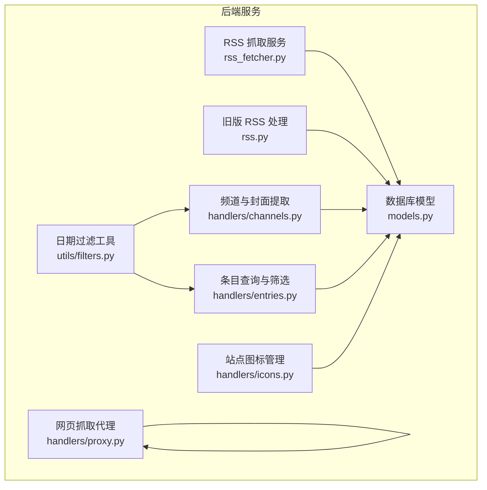
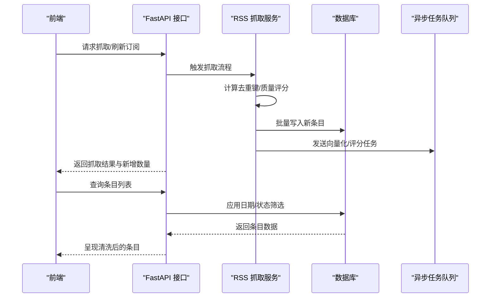
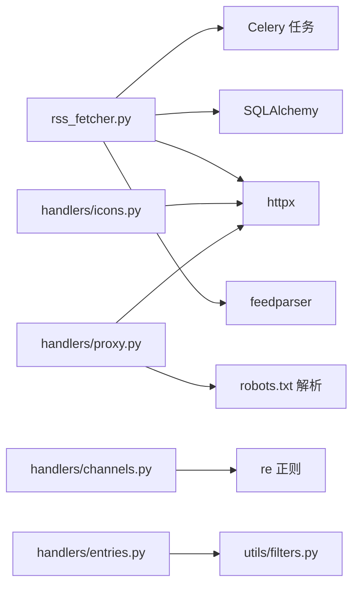
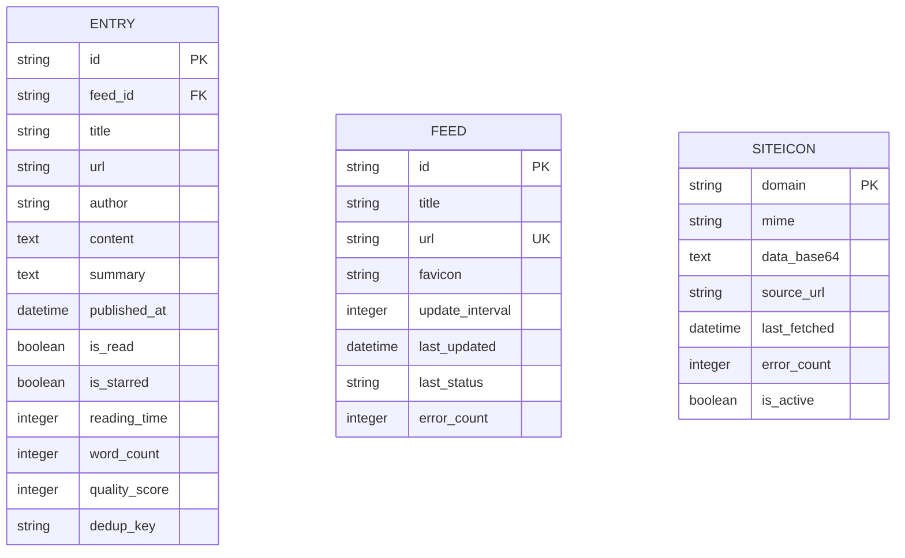

# 内容清洗与标准化

<cite>
**本文引用的文件**
- [python-backend/app/services/rss_fetcher.py](file://python-backend/app/services/rss_fetcher.py)
- [python-backend/app/rss.py](file://python-backend/app/rss.py)
- [python-backend/app/handlers/channels.py](file://python-backend/app/handlers/channels.py)
- [python-backend/app/handlers/entries.py](file://python-backend/app/handlers/entries.py)
- [python-backend/app/handlers/icons.py](file://python-backend/app/handlers/icons.py)
- [python-backend/app/handlers/proxy.py](file://python-backend/app/handlers/proxy.py)
- [python-backend/app/utils/filters.py](file://python-backend/app/utils/filters.py)
- [python-backend/app/models.py](file://python-backend/app/models.py)
</cite>

## 目录
1. [引言](#引言)
2. [项目结构](#项目结构)
3. [核心组件](#核心组件)
4. [架构总览](#架构总览)
5. [组件详解](#组件详解)
6. [依赖关系分析](#依赖关系分析)
7. [性能考量](#性能考量)
8. [故障排查指南](#故障排查指南)
9. [结论](#结论)
10. [附录](#附录)

## 引言
本文件面向 Tan RSS Reader 的内容清洗与标准化体系，聚焦以下能力：
- HTML 解析与清理：标签过滤、样式剥离、脚本移除
- 文本标准化：编码转换、换行符规范化、特殊字符处理
- 图片处理：相对路径转换、懒加载支持、CDN 优化
- 链接重写：外链标记、安全过滤、重定向处理
- 内容压缩、大小限制与格式统一
- 安全性检查、XSS 防护与内容审核机制

当前仓库中与“内容清洗与标准化”直接相关的核心实现主要集中在后端服务层与处理器层，本文将结合实际源码进行逐项说明，并给出可操作的改进建议与最佳实践。

## 项目结构
后端采用 FastAPI + SQLAlchemy 架构，RSS 抓取与内容落库在服务层完成，前端通过 API 调用获取清洗后的条目数据；同时提供图标代理与网页抓取代理以辅助内容处理与缓存。

**图表来源**
- [python-backend/app/services/rss_fetcher.py:104-311](file://python-backend/app/services/rss_fetcher.py#L104-L311)
- [python-backend/app/rss.py:28-93](file://python-backend/app/rss.py#L28-L93)
- [python-backend/app/handlers/channels.py:16-179](file://python-backend/app/handlers/channels.py#L16-L179)
- [python-backend/app/handlers/entries.py:41-107](file://python-backend/app/handlers/entries.py#L41-L107)
- [python-backend/app/handlers/icons.py:30-98](file://python-backend/app/handlers/icons.py#L30-L98)
- [python-backend/app/handlers/proxy.py:93-138](file://python-backend/app/handlers/proxy.py#L93-L138)
- [python-backend/app/utils/filters.py:5-24](file://python-backend/app/utils/filters.py#L5-L24)
- [python-backend/app/models.py:21-50](file://python-backend/app/models.py#L21-L50)

**章节来源**
- [python-backend/app/services/rss_fetcher.py:104-311](file://python-backend/app/services/rss_fetcher.py#L104-L311)
- [python-backend/app/rss.py:28-93](file://python-backend/app/rss.py#L28-L93)
- [python-backend/app/handlers/channels.py:16-179](file://python-backend/app/handlers/channels.py#L16-L179)
- [python-backend/app/handlers/entries.py:41-107](file://python-backend/app/handlers/entries.py#L41-L107)
- [python-backend/app/handlers/icons.py:30-98](file://python-backend/app/handlers/icons.py#L30-L98)
- [python-backend/app/handlers/proxy.py:93-138](file://python-backend/app/handlers/proxy.py#L93-L138)
- [python-backend/app/utils/filters.py:5-24](file://python-backend/app/utils/filters.py#L5-L24)
- [python-backend/app/models.py:21-50](file://python-backend/app/models.py#L21-L50)

## 核心组件
- RSS 抓取与去重：负责从 RSS/Atom 源抓取内容、计算去重键、生成质量评分、向量化与异步任务调度。
- 条目查询与筛选：提供按时间范围、是否加星、是否未读等条件的查询接口，并支持高亮高质量条目。
- 频道封面提取：从条目内容或摘要中抽取首张图片作为频道封面。
- 站点图标代理：支持从域名抓取 favicon 并缓存，提供代理接口以规避跨域与安全限制。
- 网页抓取代理：尊重 robots.txt，支持缓存与重定向，返回 HTML 内容供前端进一步处理。
- 日期过滤工具：统一入口，支持按插入时间或发布时间筛选。

**章节来源**
- [python-backend/app/services/rss_fetcher.py:13-27](file://python-backend/app/services/rss_fetcher.py#L13-L27)
- [python-backend/app/handlers/entries.py:41-107](file://python-backend/app/handlers/entries.py#L41-L107)
- [python-backend/app/handlers/channels.py:16-179](file://python-backend/app/handlers/channels.py#L16-L179)
- [python-backend/app/handlers/icons.py:30-98](file://python-backend/app/handlers/icons.py#L30-L98)
- [python-backend/app/handlers/proxy.py:93-138](file://python-backend/app/handlers/proxy.py#L93-L138)
- [python-backend/app/utils/filters.py:5-24](file://python-backend/app/utils/filters.py#L5-L24)

## 架构总览
下图展示从 RSS 源到前端呈现的关键流程：抓取、去重、质量评分、向量化、入库与查询。

**图表来源**
- [python-backend/app/services/rss_fetcher.py:104-311](file://python-backend/app/services/rss_fetcher.py#L104-L311)
- [python-backend/app/handlers/entries.py:41-107](file://python-backend/app/handlers/entries.py#L41-L107)
- [python-backend/app/models.py:21-50](file://python-backend/app/models.py#L21-L50)

## 组件详解

### HTML 解析与清理（标签过滤、样式剥离、脚本移除）
- 当前实现现状
  - RSS 条目内容直接入库，未见显式的 HTML 清洗逻辑（如标签过滤、样式剥离、脚本移除）。
  - 频道封面提取仅基于正则匹配首张图片的 src 属性，不涉及对 HTML 的结构化解析与清洗。
- 建议方案
  - 在入库前增加 HTML 清洗步骤：使用安全的 HTML 解析器（如 lxml 或 BeautifulSoup），保留必要标签（如段落、标题、列表、图片），移除脚本、样式、内联事件与不受信任的属性。
  - 对图片 src 进行白名单校验与协议校验，确保只保留 https 或绝对路径。
  - 对链接进行外链标记与安全过滤，避免 XSS 与钓鱼风险。
- 影响范围
  - 该改动应覆盖 RSS 抓取服务与条目查询返回的数据，确保前端渲染安全可控。

**章节来源**
- [python-backend/app/services/rss_fetcher.py:156-253](file://python-backend/app/services/rss_fetcher.py#L156-L253)
- [python-backend/app/handlers/channels.py:16-22](file://python-backend/app/handlers/channels.py#L16-L22)

### 文本标准化处理（编码转换、换行符规范化、特殊字符处理）
- 当前实现现状
  - 抓取时使用 feedparser 解析，内容以原始字符串形式入库。
  - 存储字段为 Text 类型，未见显式的编码转换与换行符规范化逻辑。
- 建议方案
  - 编码转换：统一转为 UTF-8，忽略无法解码的字符，保证跨源一致性。
  - 换行符规范化：统一替换为 \n，去除多余空白与不可见字符。
  - 特殊字符处理：对控制字符与潜在注入字符进行清理或转义。
- 影响范围
  - 建议在入库前统一执行文本标准化，减少前端渲染差异。

**章节来源**
- [python-backend/app/services/rss_fetcher.py:146-174](file://python-backend/app/services/rss_fetcher.py#L146-L174)

### 图片处理机制（相对路径转换、懒加载支持、CDN 优化）
- 当前实现现状
  - 频道封面提取通过正则提取首张图片 src，未做相对路径转换与懒加载标记。
  - 站点图标代理支持从域名抓取 favicon 并缓存，但未对图片进行 CDN 优化。
- 建议方案
  - 相对路径转换：将相对路径补全为绝对 URL，确保跨站访问可用。
  - 懒加载支持：为图片添加 loading="lazy" 与合适的占位符。
  - CDN 优化：对图片 URL 进行 CDN 化处理（如添加尺寸参数、格式优化），并在代理层设置缓存头。
- 影响范围
  - 建议在前端渲染阶段或后端返回前统一处理图片 URL 与属性。

**章节来源**
- [python-backend/app/handlers/channels.py:16-22](file://python-backend/app/handlers/channels.py#L16-L22)
- [python-backend/app/handlers/icons.py:40-75](file://python-backend/app/handlers/icons.py#L40-L75)

### 链接重写策略（外链标记、安全过滤、重定向处理）
- 当前实现现状
  - RSS 条目链接直接入库，未见外链标记与安全过滤逻辑。
  - 网页抓取代理尊重 robots.txt 并跟随重定向，但未对链接进行安全校验。
- 建议方案
  - 外链标记：对外部链接添加 rel="noopener noreferrer" 与 target="_blank"。
  - 安全过滤：白名单允许 https/http，拒绝 data: 等危险协议；对锚点与查询参数进行白名单校验。
  - 重定向处理：记录最终 URL，避免跳转陷阱；对短链进行展开与二次校验。
- 影响范围
  - 建议在前端渲染与代理层共同实施，确保用户体验与安全。

**章节来源**
- [python-backend/app/handlers/proxy.py:93-138](file://python-backend/app/handlers/proxy.py#L93-L138)

### 内容压缩、大小限制与格式统一
- 当前实现现状
  - 文本内容在入库前截断至 8000 字符，摘要与标题长度有限制。
  - 未见显式的压缩算法（如 gzip）或统一格式（如 Markdown）转换。
- 建议方案
  - 大小限制：对正文与摘要设定上限，超出部分截断并提示。
  - 格式统一：将富文本转换为纯文本或 Markdown，便于跨端一致展示。
  - 压缩传输：在 API 层启用 gzip 压缩，降低带宽占用。
- 影响范围
  - 建议在入库与返回响应两阶段分别执行，兼顾存储与传输效率。

**章节来源**
- [python-backend/app/services/rss_fetcher.py:237-247](file://python-backend/app/services/rss_fetcher.py#L237-L247)

### 安全性检查、XSS 防护与内容审核机制
- 当前实现现状
  - 未发现专门的 XSS 防护模块或内容审核流程。
  - 网页抓取代理对内容类型进行校验，但未对 HTML 内容进行安全扫描。
- 建议方案
  - XSS 防护：在入库前对 HTML 进行白名单清洗，禁止脚本、样式与事件属性。
  - 内容审核：对敏感词、广告、低质内容进行标记或屏蔽；支持人工复核与自动阈值。
  - 审计日志：记录清洗规则命中与人工干预事件，便于追溯。
- 影响范围
  - 建议在 RSS 抓取服务与代理层同步实施，形成闭环。

**章节来源**
- [python-backend/app/services/rss_fetcher.py:156-253](file://python-backend/app/services/rss_fetcher.py#L156-L253)
- [python-backend/app/handlers/proxy.py:128-131](file://python-backend/app/handlers/proxy.py#L128-L131)

## 依赖关系分析
- 组件耦合
  - RSS 抓取服务依赖 feedparser、httpx、SQLAlchemy；与向量化与质量评分任务解耦，通过 Celery 异步执行。
  - 频道与条目处理器依赖日期过滤工具，统一筛选逻辑。
  - 图标与代理处理器独立运行，服务于前端静态资源与外部页面抓取。
- 外部依赖
  - feedparser：解析 RSS/Atom 内容。
  - httpx：网络请求与重定向处理。
  - robots.txt：网页抓取合规性检查。
- 循环依赖
  - 未发现循环导入或循环调用。

**图表来源**
- [python-backend/app/services/rss_fetcher.py:1-11](file://python-backend/app/services/rss_fetcher.py#L1-L11)
- [python-backend/app/handlers/channels.py:1-11](file://python-backend/app/handlers/channels.py#L1-L11)
- [python-backend/app/handlers/entries.py:1-11](file://python-backend/app/handlers/entries.py#L1-L11)
- [python-backend/app/handlers/icons.py:1-9](file://python-backend/app/handlers/icons.py#L1-L9)
- [python-backend/app/handlers/proxy.py:1-9](file://python-backend/app/handlers/proxy.py#L1-L9)
- [python-backend/app/utils/filters.py:1-4](file://python-backend/app/utils/filters.py#L1-L4)

**章节来源**
- [python-backend/app/services/rss_fetcher.py:1-11](file://python-backend/app/services/rss_fetcher.py#L1-L11)
- [python-backend/app/handlers/channels.py:1-11](file://python-backend/app/handlers/channels.py#L1-L11)
- [python-backend/app/handlers/entries.py:1-11](file://python-backend/app/handlers/entries.py#L1-L11)
- [python-backend/app/handlers/icons.py:1-9](file://python-backend/app/handlers/icons.py#L1-L9)
- [python-backend/app/handlers/proxy.py:1-9](file://python-backend/app/handlers/proxy.py#L1-L9)
- [python-backend/app/utils/filters.py:1-4](file://python-backend/app/utils/filters.py#L1-L4)

## 性能考量
- 抓取并发与限速
  - 使用 httpx 异步客户端，合理设置超时与重定向策略，避免阻塞。
  - 对外部站点遵循 robots.txt，减少被封禁风险。
- 数据库写入
  - 批量写入新条目，减少事务开销；对重复内容进行去重，避免无效写入。
- 向量化与评分
  - 通过 Celery 异步执行，避免阻塞主流程；失败回退到 asyncio 任务。
- 缓存策略
  - 网页抓取代理与 robots.txt 解析引入内存缓存，降低重复请求成本。

**章节来源**
- [python-backend/app/services/rss_fetcher.py:126-144](file://python-backend/app/services/rss_fetcher.py#L126-L144)
- [python-backend/app/handlers/proxy.py:11-52](file://python-backend/app/handlers/proxy.py#L11-L52)

## 故障排查指南
- 抓取失败
  - 检查 HTTP 状态码与异常日志，确认网络问题或源站错误。
  - 对 404/403 场景尝试追加斜杠或调整 UA。
- 解析错误
  - 若 bozo 标记为真，检查 RSS/Atom 格式兼容性。
- 去重与重复
  - 核对去重键生成逻辑与数据库索引，避免重复入库。
- 图标与代理
  - 站点图标代理需确保 content-type 为 image/*，否则返回默认图标类型。
  - 网页抓取代理仅支持 text/html 或 application/xhtml+xml，其他类型返回错误。

**章节来源**
- [python-backend/app/services/rss_fetcher.py:126-144](file://python-backend/app/services/rss_fetcher.py#L126-L144)
- [python-backend/app/handlers/icons.py:83-98](file://python-backend/app/handlers/icons.py#L83-L98)
- [python-backend/app/handlers/proxy.py:128-131](file://python-backend/app/handlers/proxy.py#L128-L131)

## 结论
当前实现已具备完整的 RSS 抓取、去重、质量评分与向量化基础能力，但在内容清洗与标准化方面尚属空白。建议优先补齐 HTML 清洗、XSS 防护与链接安全策略，再逐步引入图片处理与 CDN 优化，最终形成一套完整、安全、高效的“内容清洗与标准化”体系。

## 附录
- 数据模型概览（与内容清洗相关的关键字段）

**图表来源**
- [python-backend/app/models.py:21-50](file://python-backend/app/models.py#L21-L50)
- [python-backend/app/models.py:40-50](file://python-backend/app/models.py#L40-L50)