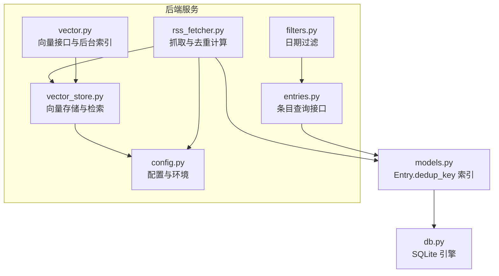
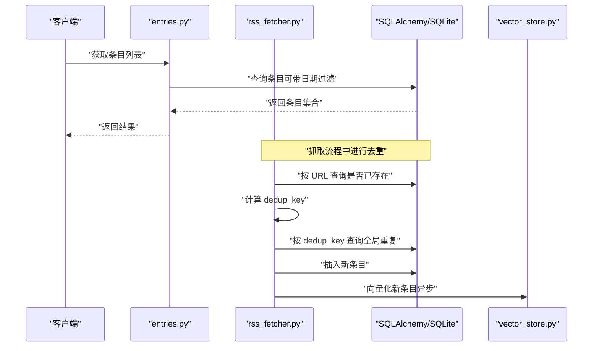
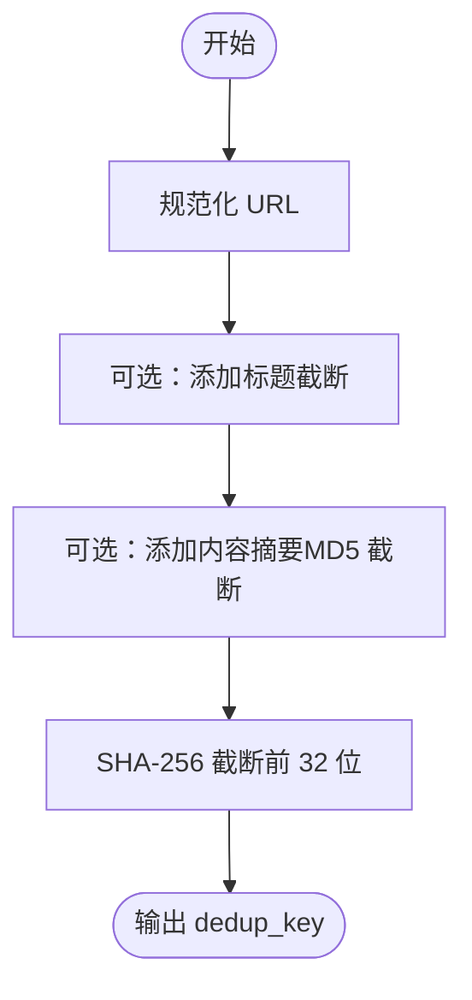
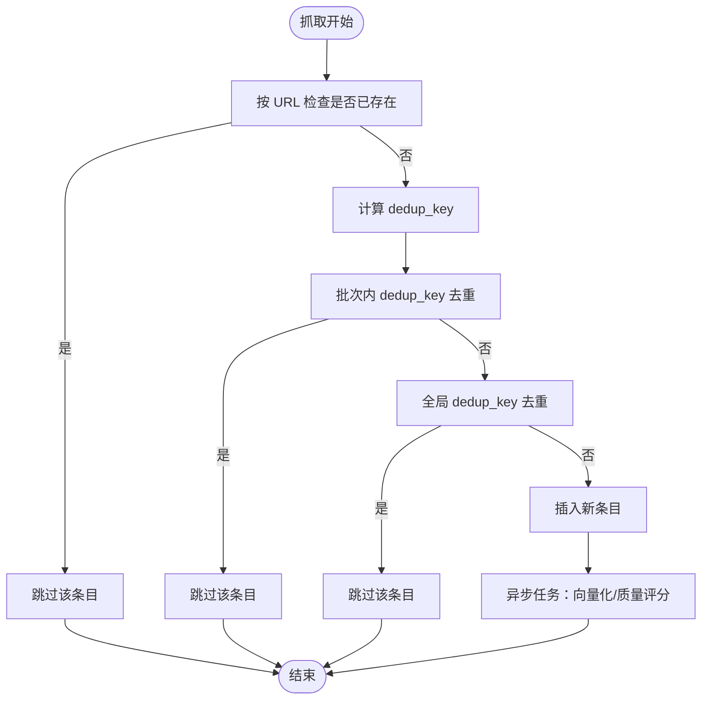
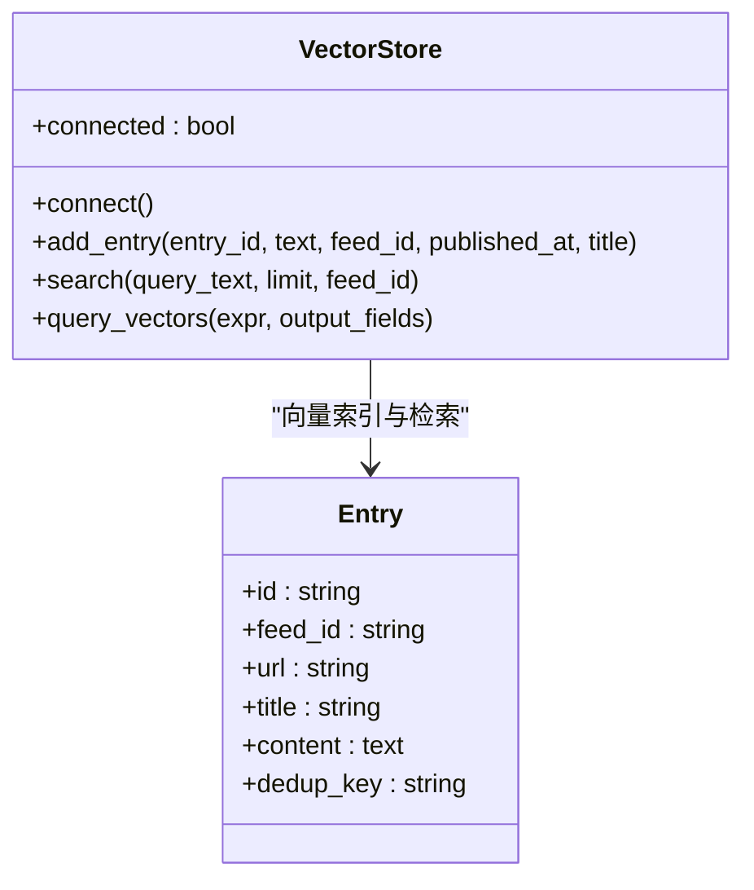
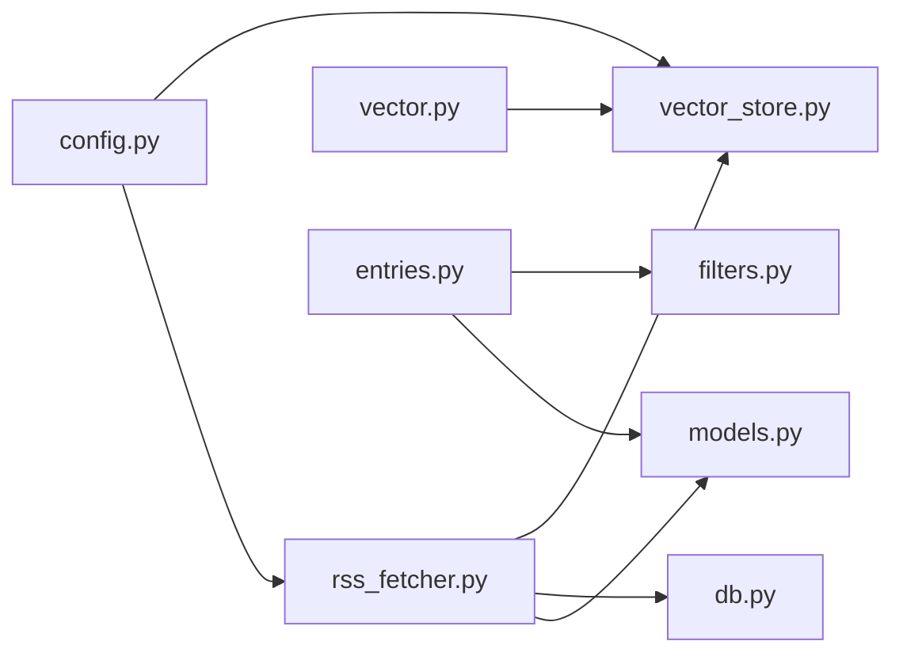

# 去重机制

<cite>
**本文引用的文件**
- [python-backend/app/services/rss_fetcher.py](file://python-backend/app/services/rss_fetcher.py)
- [python-backend/app/models.py](file://python-backend/app/models.py)
- [python-backend/app/db.py](file://python-backend/app/db.py)
- [python-backend/app/handlers/entries.py](file://python-backend/app/handlers/entries.py)
- [python-backend/app/utils/filters.py](file://python-backend/app/utils/filters.py)
- [python-backend/app/handlers/vector_store.py](file://python-backend/app/handlers/vector_store.py)
- [python-backend/app/handlers/vector.py](file://python-backend/app/handlers/vector.py)
- [python-backend/app/tasks/ai_tasks.py](file://python-backend/app/tasks/ai_tasks.py)
- [python-backend/app/config.py](file://python-backend/app/config.py)
</cite>

## 目录
1. [简介](#简介)
2. [项目结构](#项目结构)
3. [核心组件](#核心组件)
4. [架构总览](#架构总览)
5. [详细组件分析](#详细组件分析)
6. [依赖关系分析](#依赖关系分析)
7. [性能考量](#性能考量)
8. [故障排查指南](#故障排查指南)
9. [结论](#结论)
10. [附录](#附录)

## 简介
本章节系统性阐述 Tan RSS Reader 的去重机制，覆盖内容指纹计算（URL 规范化、标题与内容摘要参与）、相似度检测策略（余弦相似度、Jaccard 系数与编辑距离的适用场景）、重复内容过滤流程（数据库查询优化、索引使用、批处理）、去重配置参数（阈值、时间窗口、权重）以及准确性评估、误判处理与性能优化方案，并补充历史数据迁移、规则更新与监控指标建议。

## 项目结构
与去重相关的关键模块分布如下：
- 数据模型：Entry 表含去重键字段 dedup_key 及索引
- 服务层：rss_fetcher 负责 RSS 抓取与去重计算、插入与异步任务调度
- 向量检索：vector_store 提供基于余弦相似度的向量检索能力
- API 层：entries 提供条目列表等接口；vector 接口支持向量检索与聚类
- 工具层：filters 提供时间范围过滤
- 配置层：config 提供 AI/向量配置与环境变量

图表来源
- [python-backend/app/services/rss_fetcher.py:104-312](file://python-backend/app/services/rss_fetcher.py#L104-L312)
- [python-backend/app/handlers/vector_store.py:18-197](file://python-backend/app/handlers/vector_store.py#L18-L197)
- [python-backend/app/handlers/vector.py:1-158](file://python-backend/app/handlers/vector.py#L1-L158)
- [python-backend/app/handlers/entries.py:41-107](file://python-backend/app/handlers/entries.py#L41-L107)
- [python-backend/app/utils/filters.py:5-24](file://python-backend/app/utils/filters.py#L5-L24)
- [python-backend/app/models.py:21-39](file://python-backend/app/models.py#L21-L39)
- [python-backend/app/db.py:1-27](file://python-backend/app/db.py#L1-L27)
- [python-backend/app/config.py:41-75](file://python-backend/app/config.py#L41-L75)

章节来源
- [python-backend/app/models.py:21-39](file://python-backend/app/models.py#L21-L39)
- [python-backend/app/db.py:1-27](file://python-backend/app/db.py#L1-L27)
- [python-backend/app/services/rss_fetcher.py:104-312](file://python-backend/app/services/rss_fetcher.py#L104-L312)
- [python-backend/app/handlers/vector_store.py:18-197](file://python-backend/app/handlers/vector_store.py#L18-L197)
- [python-backend/app/handlers/vector.py:1-158](file://python-backend/app/handlers/vector.py#L1-L158)
- [python-backend/app/handlers/entries.py:41-107](file://python-backend/app/handlers/entries.py#L41-L107)
- [python-backend/app/utils/filters.py:5-24](file://python-backend/app/utils/filters.py#L5-L24)
- [python-backend/app/config.py:41-75](file://python-backend/app/config.py#L41-L75)

## 核心组件
- 内容指纹计算
  - URL 规范化：协议标准化、去除多余前缀、强制 https
  - 标题参与：截断到合理长度，避免过长影响指纹稳定性
  - 内容摘要：MD5 截断（前 16 位），作为内容指纹片段
  - 最终指纹：对组合材料做 SHA-256 截断（前 32 位）
- 相似度检测策略
  - 余弦相似度：向量检索（Milvus COSINE 指数类型），适合大规模近似最近邻检索
  - Jaccard 系数：适用于词集相似度，可作为辅助策略
  - 编辑距离：适用于短文本或标题差异，可作为兜底策略
- 重复内容过滤流程
  - 抓取阶段：先按 URL 去重，再按批次 dedup_key 去重，最后按全局 dedup_key 去重
  - 批处理：新条目写入后，触发向量化与质量评分的异步任务
  - 索引与查询：Milvus 使用 IVF_FLAT + COSINE，支持按 feed_id 过滤
- 去重配置参数
  - 时间窗口：通过日期过滤器控制检索范围
  - 权重分配：标题、内容、URL 在指纹中的权重可通过调整拼接顺序与截断长度实现
  - 阈值：向量检索返回分数阈值（如 COSINE 分数阈值）可调
- 准确性评估与误判处理
  - 评估：人工抽样对比、召回率/精确率、误判率
  - 误判处理：提供“取消去重”“加入白名单”“手动合并”等操作入口
- 性能优化
  - 数据库：为 dedup_key 建立索引；URL 查询走索引
  - 向量：选择合适的 nlist/nprobe；按 feed_id 过滤减少搜索空间
  - 批处理：Celery 或 asyncio 并行处理，避免阻塞主流程

章节来源
- [python-backend/app/services/rss_fetcher.py:13-28](file://python-backend/app/services/rss_fetcher.py#L13-L28)
- [python-backend/app/services/rss_fetcher.py:156-186](file://python-backend/app/services/rss_fetcher.py#L156-L186)
- [python-backend/app/services/rss_fetcher.py:285-311](file://python-backend/app/services/rss_fetcher.py#L285-L311)
- [python-backend/app/handlers/vector_store.py:76-82](file://python-backend/app/handlers/vector_store.py#L76-L82)
- [python-backend/app/handlers/vector_store.py:140-143](file://python-backend/app/handlers/vector_store.py#L140-L143)
- [python-backend/app/utils/filters.py:5-24](file://python-backend/app/utils/filters.py#L5-L24)
- [python-backend/app/models.py:38-38](file://python-backend/app/models.py#L38-L38)

## 架构总览
下图展示去重在抓取与检索中的整体交互：

图表来源
- [python-backend/app/handlers/entries.py:41-107](file://python-backend/app/handlers/entries.py#L41-L107)
- [python-backend/app/services/rss_fetcher.py:104-312](file://python-backend/app/services/rss_fetcher.py#L104-L312)
- [python-backend/app/db.py:1-27](file://python-backend/app/db.py#L1-L27)
- [python-backend/app/handlers/vector_store.py:92-128](file://python-backend/app/handlers/vector_store.py#L92-L128)

## 详细组件分析

### 组件一：内容指纹计算与去重键生成
- URL 规范化策略
  - 统一协议为 https
  - 去除多余前缀，保证同一站点不同形式的链接指向相同指纹
- 标题与内容参与
  - 标题截断到合理长度，避免噪声
  - 内容摘要采用 MD5 截断，降低指纹长度并提升稳定性
- 最终指纹
  - 对组合材料进行 SHA-256 截断，形成固定长度指纹，便于数据库索引与比较

图表来源
- [python-backend/app/services/rss_fetcher.py:13-28](file://python-backend/app/services/rss_fetcher.py#L13-L28)

章节来源
- [python-backend/app/services/rss_fetcher.py:13-28](file://python-backend/app/services/rss_fetcher.py#L13-L28)

### 组件二：重复内容过滤流程
- 抓取阶段三重去重
  - URL 去重：优先检查同 feed 下是否已有相同 URL
  - 批次去重：同一抓取批次内 dedup_key 去重
  - 全局去重：跨 feed 检查 dedup_key 是否已存在
- 插入与异步处理
  - 成功去重后写入数据库
  - 触发向量化与质量评分的异步任务（Celery 或 asyncio）

图表来源
- [python-backend/app/services/rss_fetcher.py:156-186](file://python-backend/app/services/rss_fetcher.py#L156-L186)
- [python-backend/app/services/rss_fetcher.py:285-311](file://python-backend/app/services/rss_fetcher.py#L285-L311)

章节来源
- [python-backend/app/services/rss_fetcher.py:156-186](file://python-backend/app/services/rss_fetcher.py#L156-L186)
- [python-backend/app/services/rss_fetcher.py:285-311](file://python-backend/app/services/rss_fetcher.py#L285-L311)

### 组件三：相似度检测与向量检索
- 向量检索
  - Milvus 使用 COSINE 指数类型与 IVF_FLAT 索引
  - 支持按 feed_id 过滤，缩小搜索空间
  - 返回分数可用于阈值判断
- 相似度策略建议
  - 余弦相似度：向量检索首选
  - Jaccard 系数：词集相似度，适合短文本
  - 编辑距离：标题差异检测，可作为兜底

图表来源
- [python-backend/app/handlers/vector_store.py:18-197](file://python-backend/app/handlers/vector_store.py#L18-L197)
- [python-backend/app/models.py:21-39](file://python-backend/app/models.py#L21-L39)

章节来源
- [python-backend/app/handlers/vector_store.py:76-82](file://python-backend/app/handlers/vector_store.py#L76-L82)
- [python-backend/app/handlers/vector_store.py:140-143](file://python-backend/app/handlers/vector_store.py#L140-L143)
- [python-backend/app/handlers/vector.py:108-111](file://python-backend/app/handlers/vector.py#L108-L111)

### 组件四：数据库查询优化与索引使用
- 索引设计
  - Entry.dedup_key 建有索引，加速全局去重查询
  - Entry.feed_id 建有索引，加速按源分组查询
- 查询优化建议
  - 抓取时优先使用 URL 精确匹配
  - 搜索时结合时间字段与 feed_id 过滤
  - 批量写入使用事务，减少 IO 开销

章节来源
- [python-backend/app/models.py:21-39](file://python-backend/app/models.py#L21-L39)
- [python-backend/app/utils/filters.py:5-24](file://python-backend/app/utils/filters.py#L5-L24)
- [python-backend/app/handlers/entries.py:57-76](file://python-backend/app/handlers/entries.py#L57-L76)

### 组件五：去重配置参数与阈值设置
- 时间窗口
  - 通过日期过滤器控制检索范围（如 7d、30d）
- 权重分配
  - 通过调整指纹拼接顺序与截断长度，控制 URL/标题/内容的权重
- 阈值
  - 向量检索返回分数（COSINE）可设阈值，低于阈值视为不相似
- 配置来源
  - 环境变量与配置对象统一管理 Milvus 地址、集合名、索引参数等

章节来源
- [python-backend/app/utils/filters.py:5-24](file://python-backend/app/utils/filters.py#L5-L24)
- [python-backend/app/config.py:41-75](file://python-backend/app/config.py#L41-L75)
- [python-backend/app/handlers/vector_store.py:76-82](file://python-backend/app/handlers/vector_store.py#L76-L82)

### 组件六：历史数据迁移与规则更新
- 历史数据迁移
  - 为既有条目生成 dedup_key（按现有 URL/标题/内容摘要规则）
  - 批量更新数据库，建立索引
- 规则更新
  - 修改指纹规则后，重新生成历史条目的 dedup_key
  - 提供“重算指纹”任务，支持增量重算

章节来源
- [python-backend/app/services/rss_fetcher.py:13-28](file://python-backend/app/services/rss_fetcher.py#L13-L28)
- [python-backend/app/models.py:21-39](file://python-backend/app/models.py#L21-L39)

### 组件七：监控指标与评估
- 监控指标建议
  - 去重命中率、重复条目数量、向量检索耗时、索引命中率
  - 错误率（网络错误、解析错误、向量失败）
- 评估方法
  - 人工抽样对比：随机抽取样本，对比去重前后条目数量与相似度
  - A/B 实验：对比不同阈值/策略下的效果

章节来源
- [python-backend/app/services/rss_fetcher.py:307-311](file://python-backend/app/services/rss_fetcher.py#L307-L311)
- [python-backend/app/handlers/vector_store.py:130-178](file://python-backend/app/handlers/vector_store.py#L130-L178)

## 依赖关系分析
- 模块耦合
  - rss_fetcher 依赖 models.Entry 与 db.Session，负责抓取与去重
  - vector_store 依赖 Milvus 客户端，提供向量检索
  - entries 与 filters 依赖 SQLAlchemy 查询
- 外部依赖
  - SQLite（本地开发）、Milvus（向量检索）、Celery（异步任务）

图表来源
- [python-backend/app/services/rss_fetcher.py:104-312](file://python-backend/app/services/rss_fetcher.py#L104-L312)
- [python-backend/app/handlers/vector_store.py:18-197](file://python-backend/app/handlers/vector_store.py#L18-L197)
- [python-backend/app/handlers/vector.py:1-158](file://python-backend/app/handlers/vector.py#L1-L158)
- [python-backend/app/handlers/entries.py:41-107](file://python-backend/app/handlers/entries.py#L41-L107)
- [python-backend/app/utils/filters.py:5-24](file://python-backend/app/utils/filters.py#L5-L24)
- [python-backend/app/models.py:21-39](file://python-backend/app/models.py#L21-L39)
- [python-backend/app/db.py:1-27](file://python-backend/app/db.py#L1-L27)
- [python-backend/app/config.py:41-75](file://python-backend/app/config.py#L41-L75)

章节来源
- [python-backend/app/services/rss_fetcher.py:104-312](file://python-backend/app/services/rss_fetcher.py#L104-L312)
- [python-backend/app/handlers/vector_store.py:18-197](file://python-backend/app/handlers/vector_store.py#L18-L197)
- [python-backend/app/handlers/vector.py:1-158](file://python-backend/app/handlers/vector.py#L1-L158)
- [python-backend/app/handlers/entries.py:41-107](file://python-backend/app/handlers/entries.py#L41-L107)
- [python-backend/app/utils/filters.py:5-24](file://python-backend/app/utils/filters.py#L5-L24)
- [python-backend/app/models.py:21-39](file://python-backend/app/models.py#L21-L39)
- [python-backend/app/db.py:1-27](file://python-backend/app/db.py#L1-L27)
- [python-backend/app/config.py:41-75](file://python-backend/app/config.py#L41-L75)

## 性能考量
- 数据库层面
  - 为 dedup_key 与 feed_id 建立索引，避免全表扫描
  - 批量插入使用事务，减少磁盘 IO
- 向量检索层面
  - 合理设置 nlist/nprobe，平衡精度与速度
  - 按 feed_id 过滤减少搜索空间
- 异步与并发
  - Celery 或 asyncio 并行执行向量化与质量评分
  - 避免阻塞主抓取流程

章节来源
- [python-backend/app/models.py:21-39](file://python-backend/app/models.py#L21-L39)
- [python-backend/app/handlers/vector_store.py:76-82](file://python-backend/app/handlers/vector_store.py#L76-L82)
- [python-backend/app/services/rss_fetcher.py:285-311](file://python-backend/app/services/rss_fetcher.py#L285-L311)

## 故障排查指南
- 常见问题
  - 去重未生效：检查 dedup_key 是否正确生成与索引
  - 向量检索异常：确认 Milvus 连接、集合存在且已加载
  - 抓取失败：查看网络错误与解析错误统计
- 处理建议
  - 重连 Milvus、重建索引
  - 调整阈值与时间窗口
  - 查看日志与异步任务状态

章节来源
- [python-backend/app/handlers/vector_store.py:23-54](file://python-backend/app/handlers/vector_store.py#L23-L54)
- [python-backend/app/services/rss_fetcher.py:131-144](file://python-backend/app/services/rss_fetcher.py#L131-L144)
- [python-backend/app/tasks/ai_tasks.py:16-51](file://python-backend/app/tasks/ai_tasks.py#L16-L51)

## 结论
Tan RSS Reader 的去重机制以“URL 去重 → 批次 dedup_key 去重 → 全局 dedup_key 去重”为核心流程，并结合向量检索（余弦相似度）与辅助策略（Jaccard、编辑距离）实现多维去重。通过索引优化、批处理与异步任务，系统在保证准确性的同时兼顾性能。建议持续完善阈值与权重配置、引入评估体系与监控指标，以应对复杂 RSS 内容生态。

## 附录
- 关键实现路径
  - 去重键生成：[compute_dedup_key:13-28](file://python-backend/app/services/rss_fetcher.py#L13-L28)
  - 抓取与去重流程：[fetch_feed:104-312](file://python-backend/app/services/rss_fetcher.py#L104-L312)
  - 数据模型与索引：[Entry.dedup_key:21-39](file://python-backend/app/models.py#L21-L39)
  - 向量检索与索引：[VectorStore:18-197](file://python-backend/app/handlers/vector_store.py#L18-L197)
  - 日期过滤：[apply_date_filter_to_entries_query:5-24](file://python-backend/app/utils/filters.py#L5-L24)
  - 异步任务：[batch_quality_scoring_task:16-51](file://python-backend/app/tasks/ai_tasks.py#L16-L51)、[vectorize_entries_task:53-87](file://python-backend/app/tasks/ai_tasks.py#L53-L87)