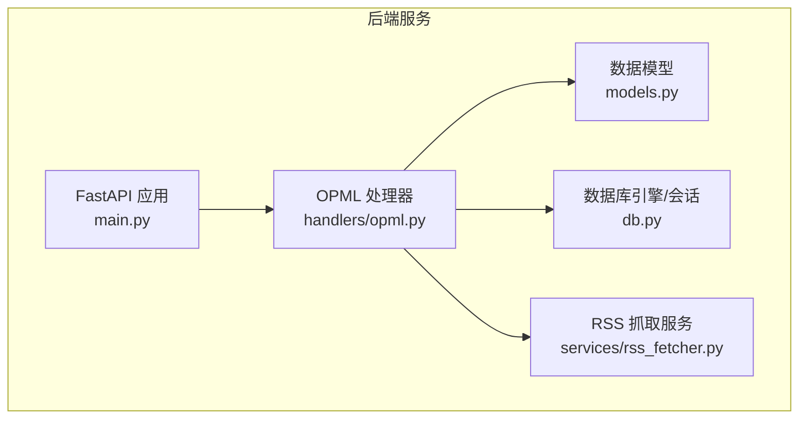
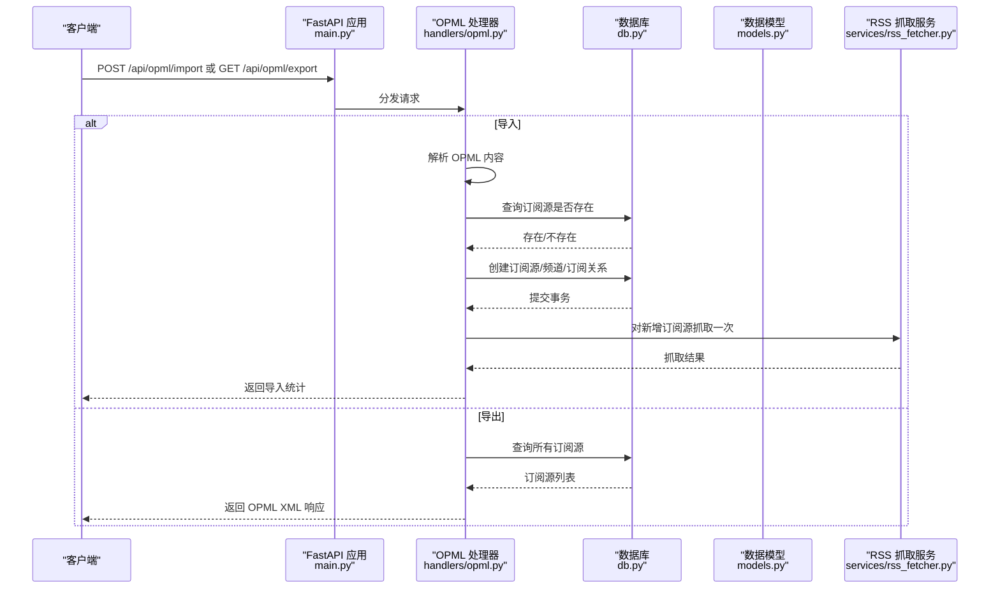
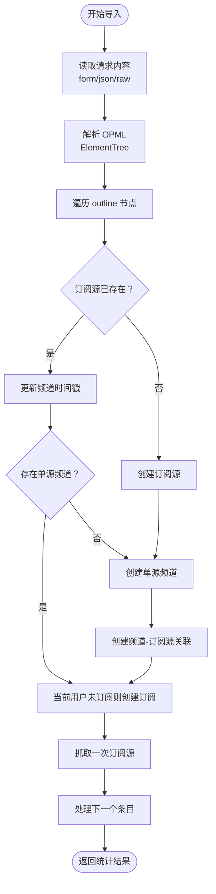
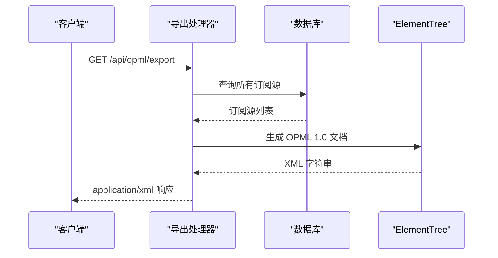
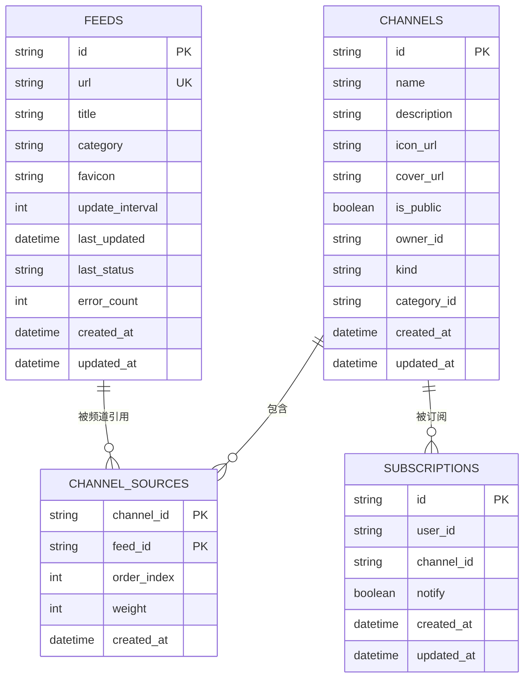
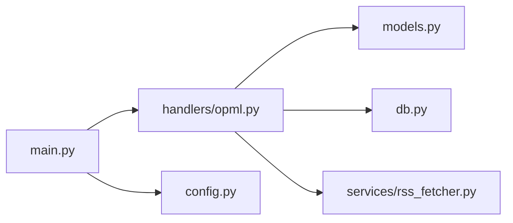

# OPML导入导出

<cite>
**本文引用的文件**
- [opml.py](file://python-backend/app/handlers/opml.py)
- [models.py](file://python-backend/app/models.py)
- [db.py](file://python-backend/app/db.py)
- [main.py](file://python-backend/app/main.py)
- [rss_fetcher.py](file://python-backend/app/services/rss_fetcher.py)
- [config.py](file://python-backend/app/config.py)
</cite>

## 目录
1. [简介](#简介)
2. [项目结构](#项目结构)
3. [核心组件](#核心组件)
4. [架构总览](#架构总览)
5. [详细组件分析](#详细组件分析)
6. [依赖关系分析](#依赖关系分析)
7. [性能考虑](#性能考虑)
8. [故障排除指南](#故障排除指南)
9. [结论](#结论)
10. [附录](#附录)

## 简介
本文件针对 Tan RSS Reader 的 OPML 导入导出功能进行系统化技术文档编写，覆盖以下关键点：
- OPML 标准规范与实现细节：XML 结构解析、节点遍历与数据提取
- 导入流程：文件上传、格式验证、错误处理与批量操作
- 导出功能：频道数据序列化、OPML 文件生成与下载机制
- 数据模型映射：频道、订阅源与元数据的对应转换
- 兼容性处理：不同 OPML 版本支持与第三方软件兼容
- 性能优化：大文件处理、内存管理与并发控制
- 错误处理与恢复机制

## 项目结构
OPML 功能位于 Python 后端（FastAPI）中，主要涉及处理器、数据模型与数据库层：
- 处理器：负责接收请求、解析 OPML、执行导入/导出逻辑
- 模型：定义数据库表结构，包括 Feed、Channel、ChannelSource、Subscription 等
- 数据库：异步 SQLAlchemy 引擎与会话管理
- 应用入口：注册 OPML 路由并启动服务

图表来源
- [main.py:46](file://python-backend/app/main.py#L46)
- [opml.py:13](file://python-backend/app/handlers/opml.py#L13)
- [models.py:7](file://python-backend/app/models.py#L7)
- [db.py:24](file://python-backend/app/db.py#L24)
- [rss_fetcher.py:104](file://python-backend/app/services/rss_fetcher.py#L104)

章节来源
- [main.py:1-103](file://python-backend/app/main.py#L1-L103)
- [opml.py:1-199](file://python-backend/app/handlers/opml.py#L1-L199)
- [models.py:1-228](file://python-backend/app/models.py#L1-L228)
- [db.py:1-27](file://python-backend/app/db.py#L1-L27)

## 核心组件
- OPML 导入处理器：支持多种输入方式（表单、JSON、原始字节），解析 OPML 并批量创建订阅源、频道与订阅关系
- OPML 导出处理器：按分类聚合订阅源，生成标准 OPML 1.0 文档
- 数据模型映射：Feed 对应订阅源，Channel 对应频道，ChannelSource 连接两者，Subscription 表示用户订阅
- 数据库层：异步 SQLite 引擎，使用 SessionLocal 提供会话生命周期管理
- RSS 抓取集成：导入完成后对新增订阅源执行一次抓取以填充初始内容

章节来源
- [opml.py:43-171](file://python-backend/app/handlers/opml.py#L43-L171)
- [opml.py:173-198](file://python-backend/app/handlers/opml.py#L173-L198)
- [models.py:7-214](file://python-backend/app/models.py#L7-L214)
- [db.py:24-25](file://python-backend/app/db.py#L24-L25)
- [rss_fetcher.py:104-311](file://python-backend/app/services/rss_fetcher.py#L104-L311)

## 架构总览
OPML 导入/导出通过 FastAPI 路由暴露，内部调用数据库与 RSS 抓取服务完成数据持久化与内容抓取。

图表来源
- [main.py:46](file://python-backend/app/main.py#L46)
- [opml.py:43-171](file://python-backend/app/handlers/opml.py#L43-L171)
- [opml.py:173-198](file://python-backend/app/handlers/opml.py#L173-L198)
- [db.py:24-25](file://python-backend/app/db.py#L24-L25)
- [rss_fetcher.py:104-311](file://python-backend/app/services/rss_fetcher.py#L104-L311)

## 详细组件分析

### OPML 导入处理器
- 支持的输入方式
  - multipart/form-data：从表单字段 content 或 file 字段读取
  - application/x-www-form-urlencoded：从表单字段 content 读取
  - application/json：从 JSON 对象的 content 字段读取
  - 原始请求体：若上述均不可用，直接读取原始字节并尝试 UTF-8 或 latin-1 解码
- OPML 解析逻辑
  - 使用 xml.etree.ElementTree 解析根节点
  - 遍历 body 下的 outline 节点，提取 xmlUrl、text/title、category 属性
  - 支持嵌套 outline 树，使用递归遍历
- 批量导入策略
  - 对每个条目检查订阅源是否已存在
  - 已存在：更新频道时间戳；如无单源频道则创建；如当前用户未订阅则创建订阅
  - 不存在：创建订阅源、单源频道、频道-订阅源关联、可选订阅
  - 成功创建后立即尝试抓取一次以填充内容
- 统计与错误处理
  - 返回 created、skipped、errors 列表
  - 单条目异常不影响整体流程，记录错误并继续处理

图表来源
- [opml.py:43-171](file://python-backend/app/handlers/opml.py#L43-L171)

章节来源
- [opml.py:43-171](file://python-backend/app/handlers/opml.py#L43-L171)

### OPML 导出处理器
- 数据聚合
  - 查询所有订阅源，按 category 分组（默认“未分组”）
- OPML 生成
  - 生成 OPML 1.0 文档，包含 head/title 与 body/outlines
  - 每个分组生成一个 outline 节点，其下为订阅源 outline 节点
  - outline 属性：text/title、type="rss"、xmlUrl
- 响应输出
  - 返回 application/xml 类型的响应

图表来源
- [opml.py:173-198](file://python-backend/app/handlers/opml.py#L173-L198)

章节来源
- [opml.py:173-198](file://python-backend/app/handlers/opml.py#L173-L198)

### 数据模型映射
- Feed：对应 OPML 中的订阅源（xmlUrl），包含标题、URL、分类等
- Channel：对应频道，单源频道的名称通常来自 Feed.title 或 URL
- ChannelSource：连接频道与订阅源，建立一对一的单源关系
- Subscription：表示用户对频道的订阅关系
- 映射规则
  - OPML 条目 -> Feed（若不存在）；若存在 -> 更新频道时间戳
  - 为每个 Feed 创建单源 Channel
  - 若当前用户存在且未订阅该 Channel，则创建 Subscription

图表来源
- [models.py:7-214](file://python-backend/app/models.py#L7-L214)

章节来源
- [models.py:7-214](file://python-backend/app/models.py#L7-L214)

### 输入格式与兼容性
- 输入格式支持
  - multipart/form-data：content 或 file 字段
  - application/x-www-form-urlencoded：content 字段
  - application/json：content 字段
  - 原始字节：UTF-8 或 latin-1 解码
- OPML 规范遵循
  - 使用 ElementTree 解析，支持 outline 节点树
  - 属性映射：xmlUrl/xmlurl、text/title、category
  - 导出采用 OPML 1.0 标准
- 第三方兼容性
  - 通过标准 OPML 1.0 输出，兼容大多数 RSS/订阅管理工具
  - 导入时忽略无效条目（空 URL），保证健壮性

章节来源
- [opml.py:43-73](file://python-backend/app/handlers/opml.py#L43-L73)
- [opml.py:180-196](file://python-backend/app/handlers/opml.py#L180-L196)

### 错误处理与恢复
- 解析阶段
  - XML 解析失败抛出 400 错误
- 导入阶段
  - 单条目异常记录到 errors 列表，不影响整体流程
  - 跳过空 URL 条目
- 数据一致性
  - 使用数据库事务提交，确保批量写入的一致性
- 抓取阶段
  - 导入后对新增订阅源执行一次抓取，失败不阻塞导入流程

章节来源
- [opml.py:26-27](file://python-backend/app/handlers/opml.py#L26-L27)
- [opml.py:169-170](file://python-backend/app/handlers/opml.py#L169-L170)
- [opml.py:158-161](file://python-backend/app/handlers/opml.py#L158-L161)

## 依赖关系分析
- 路由注册：main.py 将 opml_router 注册到 /api 前缀
- 处理器依赖：opml.py 依赖 models 定义的数据表、db 会话、rss_fetcher 抓取服务
- 数据库：异步 SQLite 引擎，SessionLocal 提供会话
- 配置：EnvSettings 提供数据库、Redis、向量库等外部服务配置

图表来源
- [main.py:10-46](file://python-backend/app/main.py#L10-L46)
- [opml.py:8-11](file://python-backend/app/handlers/opml.py#L8-L11)
- [db.py:24-25](file://python-backend/app/db.py#L24-L25)
- [config.py:41-74](file://python-backend/app/config.py#L41-L74)

章节来源
- [main.py:10-46](file://python-backend/app/main.py#L10-L46)
- [opml.py:8-11](file://python-backend/app/handlers/opml.py#L8-L11)
- [db.py:24-25](file://python-backend/app/db.py#L24-L25)
- [config.py:41-74](file://python-backend/app/config.py#L41-L74)

## 性能考虑
- 大文件处理
  - 使用异步会话与逐条处理，避免一次性加载全部内容
  - 导入时按条目循环，逐条查询、插入与提交，降低峰值内存占用
- 内存管理
  - ElementTree 解析仅在内存中保留当前节点树，适合流式处理
  - 导出时按分类聚合，避免一次性构建超大对象
- 并发控制
  - 导入后对新增订阅源的抓取采用异步任务调度，不阻塞主流程
  - 可通过环境变量启用 Celery 异步队列，进一步提升吞吐
- I/O 优化
  - 数据库存储为本地 SQLite，减少网络延迟
  - 抓取服务设置合理超时与重定向策略，提高成功率

章节来源
- [opml.py:77-171](file://python-backend/app/handlers/opml.py#L77-L171)
- [rss_fetcher.py:282-305](file://python-backend/app/services/rss_fetcher.py#L282-L305)
- [db.py:24-25](file://python-backend/app/db.py#L24-L25)

## 故障排除指南
- 导入失败（400）
  - 检查 OPML 内容是否为有效 XML
  - 确认请求头 Content-Type 是否正确
- 导入部分成功
  - 查看返回的 errors 列表定位具体条目
  - 确认订阅源 URL 是否有效
- 导出为空
  - 确认数据库中是否存在订阅源
  - 检查分类字段是否导致分组异常
- 抓取失败
  - 检查网络连通性与目标站点状态
  - 关注 RSS 抓取日志中的错误类型（网络、HTTP、解析）

章节来源
- [opml.py:26-27](file://python-backend/app/handlers/opml.py#L26-L27)
- [opml.py:169-170](file://python-backend/app/handlers/opml.py#L169-L170)
- [rss_fetcher.py:131-144](file://python-backend/app/services/rss_fetcher.py#L131-L144)

## 结论
Tan RSS Reader 的 OPML 导入导出功能以简洁稳健的方式实现了标准 OPML 1.0 的读写，结合系统内的订阅源、频道与订阅模型，提供了完整的订阅迁移与备份能力。通过异步处理与抓取集成，既保证了用户体验，又兼顾了性能与可靠性。建议在生产环境中配合 Celery 实现更高效的异步任务处理，并持续关注第三方工具的兼容性反馈以优化导入/导出策略。

## 附录
- API 端点
  - POST /api/opml/import：导入 OPML
  - GET /api/opml/export：导出 OPML
- 请求与响应要点
  - 导入支持多种输入方式，返回 created/skipped/errors
  - 导出返回 application/xml，包含标准 OPML 1.0 结构

章节来源
- [opml.py:43-171](file://python-backend/app/handlers/opml.py#L43-L171)
- [opml.py:173-198](file://python-backend/app/handlers/opml.py#L173-L198)
- [main.py:46](file://python-backend/app/main.py#L46)