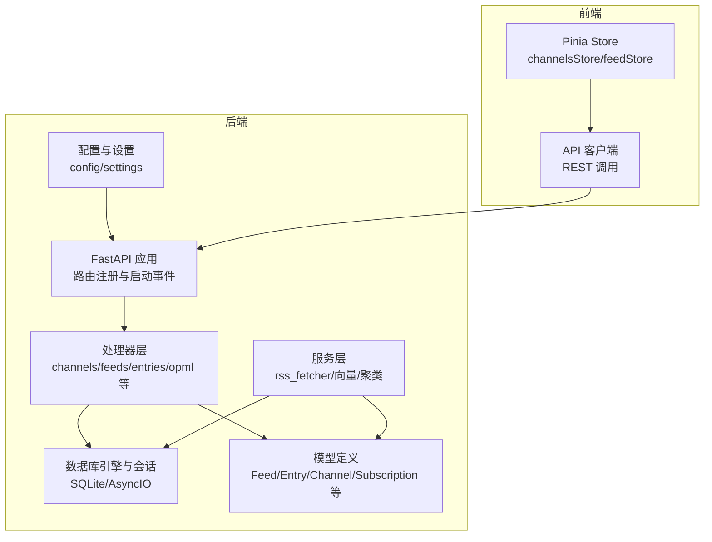
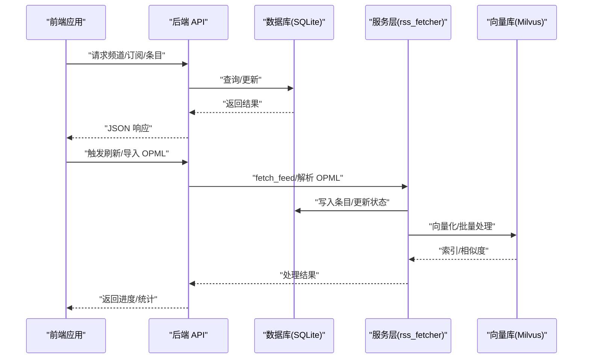
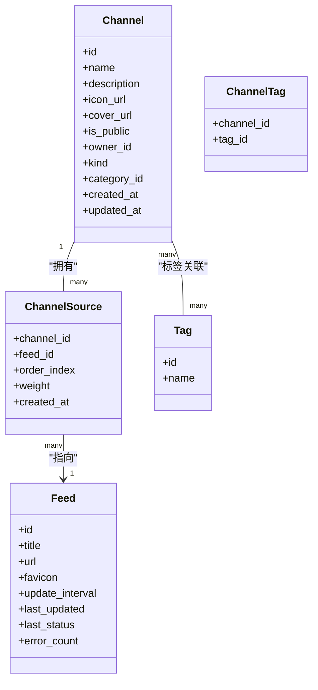
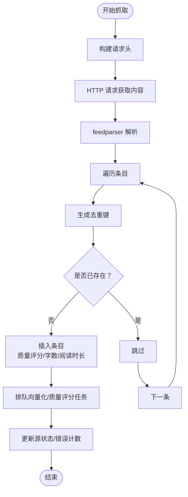
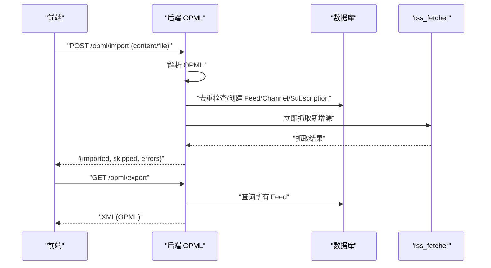
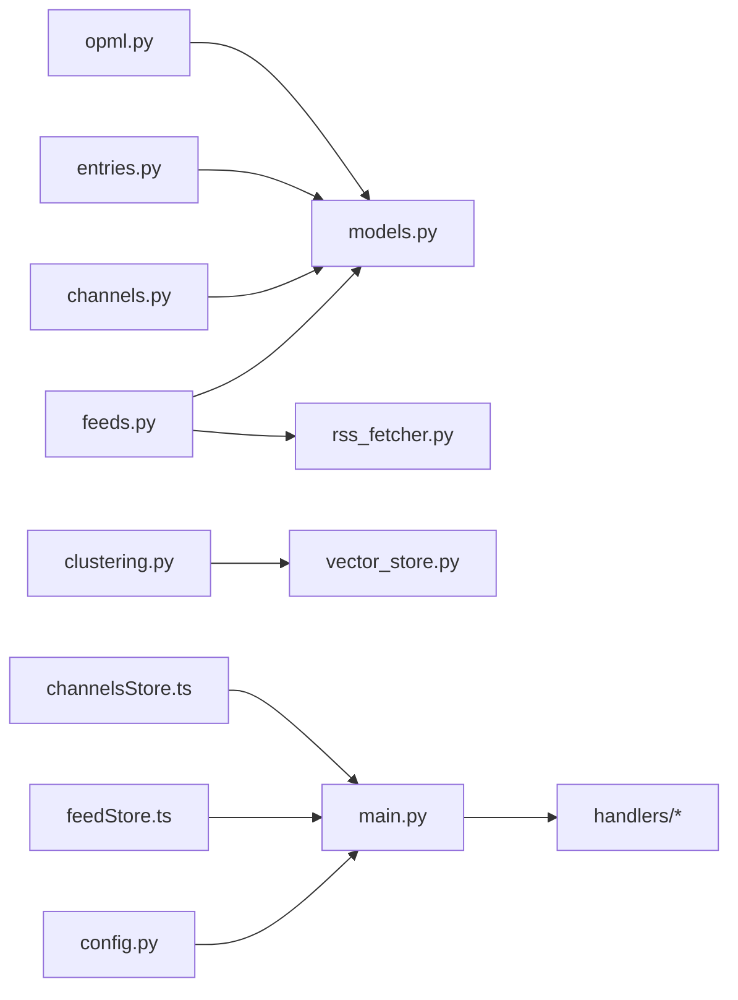

# 内容管理

<cite>
**本文引用的文件**
- [python-backend/app/models.py](file://python-backend/app/models.py)
- [python-backend/app/db.py](file://python-backend/app/db.py)
- [python-backend/app/main.py](file://python-backend/app/main.py)
- [python-backend/app/config.py](file://python-backend/app/config.py)
- [python-backend/app/handlers/channels.py](file://python-backend/app/handlers/channels.py)
- [python-backend/app/handlers/categories.py](file://python-backend/app/handlers/categories.py)
- [python-backend/app/handlers/entries.py](file://python-backend/app/handlers/entries.py)
- [python-backend/app/handlers/feeds.py](file://python-backend/app/handlers/feeds.py)
- [python-backend/app/handlers/opml.py](file://python-backend/app/handlers/opml.py)
- [python-backend/app/handlers/subscriptions.py](file://python-backend/app/handlers/subscriptions.py)
- [python-backend/app/handlers/tags.py](file://python-backend/app/handlers/tags.py)
- [python-backend/app/services/rss_fetcher.py](file://python-backend/app/services/rss_fetcher.py)
- [python-backend/app/utils/filters.py](file://python-backend/app/utils/filters.py)
- [python-backend/app/handlers/clustering.py](file://python-backend/app/handlers/clustering.py)
- [rss-desktop/src/stores/channelsStore.ts](file://rss-desktop/src/stores/channelsStore.ts)
- [rss-desktop/src/stores/feedStore.ts](file://rss-desktop/src/stores/feedStore.ts)
</cite>

## 目录
1. [简介](#简介)
2. [项目结构](#项目结构)
3. [核心组件](#核心组件)
4. [架构总览](#架构总览)
5. [详细组件分析](#详细组件分析)
6. [依赖分析](#依赖分析)
7. [性能考虑](#性能考虑)
8. [故障排查指南](#故障排查指南)
9. [结论](#结论)
10. [附录](#附录)

## 简介
本文件面向 Tan RSS Reader 内容管理系统，围绕“频道系统”“RSS 订阅管理”“内容分类与策展”“OPML 导入导出”“内容质量控制与人工审核”“内容聚合与个性化展示”“内容同步与离线缓存”等主题进行系统化技术文档梳理。文档以代码为依据，结合数据库模型、后端接口、前端状态管理与调度任务，帮助开发者与运营人员快速理解系统设计与实现细节。

## 项目结构
- 后端采用 FastAPI + SQLAlchemy 异步 ORM，SQLite 作为本地存储（可配置为外部数据库），通过异步会话管理数据访问。
- 前端使用 Vue + Pinia 状态管理，通过 API 客户端与后端交互，支持频道、订阅、条目、OPML 等功能。
- 核心模块包括：频道管理、分类与标签、订阅与聚合、条目管理、RSS 抓取与去重、向量检索与聚类、OPML 导入导出、设置与配置。

图表来源
- [python-backend/app/main.py:28-63](file://python-backend/app/main.py#L28-L63)
- [python-backend/app/db.py:1-27](file://python-backend/app/db.py#L1-L27)
- [python-backend/app/models.py:1-228](file://python-backend/app/models.py#L1-L228)
- [rss-desktop/src/stores/channelsStore.ts:36-363](file://rss-desktop/src/stores/channelsStore.ts#L36-L363)
- [rss-desktop/src/stores/feedStore.ts:7-642](file://rss-desktop/src/stores/feedStore.ts#L7-L642)

章节来源
- [python-backend/app/main.py:28-63](file://python-backend/app/main.py#L28-L63)
- [python-backend/app/db.py:1-27](file://python-backend/app/db.py#L1-L27)
- [python-backend/app/models.py:1-228](file://python-backend/app/models.py#L1-L228)
- [rss-desktop/src/stores/channelsStore.ts:36-363](file://rss-desktop/src/stores/channelsStore.ts#L36-L363)
- [rss-desktop/src/stores/feedStore.ts:7-642](file://rss-desktop/src/stores/feedStore.ts#L7-L642)

## 核心组件
- 数据模型与表结构：涵盖 Feed、Entry、Channel、Subscription、Category、Tag、SourcePack 等，支撑订阅、条目、频道、分类、标签、用户订阅关系等业务实体。
- 频道系统：支持频道创建、编辑、预览、来源绑定（多个 RSS 源）、公开/私有、策展与标签管理。
- RSS 抓取与去重：异步抓取、解析、去重（基于 URL、标题、内容哈希）、质量评分、向量化与批量 AI 处理。
- 内容聚合与排序：支持按插入时间或发布时间排序，日期范围过滤，未读/加星筛选，高质量过滤。
- OPML 导入导出：解析 OPML 结构，批量创建订阅与单源频道，导出现有订阅为 OPML。
- 聚类与推荐：基于向量相似度的聚类，生成主题概要，辅助智能推荐。
- 设置与配置：应用设置、AI 配置、向量库配置、品牌开关等。

章节来源
- [python-backend/app/models.py:7-228](file://python-backend/app/models.py#L7-L228)
- [python-backend/app/handlers/channels.py:101-502](file://python-backend/app/handlers/channels.py#L101-L502)
- [python-backend/app/services/rss_fetcher.py:104-312](file://python-backend/app/services/rss_fetcher.py#L104-L312)
- [python-backend/app/handlers/entries.py:41-310](file://python-backend/app/handlers/entries.py#L41-L310)
- [python-backend/app/handlers/opml.py:43-199](file://python-backend/app/handlers/opml.py#L43-L199)
- [python-backend/app/handlers/clustering.py:10-142](file://python-backend/app/handlers/clustering.py#L10-L142)
- [python-backend/app/config.py:5-75](file://python-backend/app/config.py#L5-L75)

## 架构总览
系统采用前后端分离架构，后端提供 REST API，前端通过 Pinia Store 管理状态并调用 API。数据库为 SQLite（异步），支持扩展为外部数据库；向量检索依赖 Milvus，AI 处理通过 Celery 或异步任务执行。

图表来源
- [python-backend/app/main.py:44-62](file://python-backend/app/main.py#L44-L62)
- [python-backend/app/services/rss_fetcher.py:104-312](file://python-backend/app/services/rss_fetcher.py#L104-L312)
- [python-backend/app/handlers/opml.py:43-199](file://python-backend/app/handlers/opml.py#L43-L199)
- [rss-desktop/src/stores/feedStore.ts:210-292](file://rss-desktop/src/stores/feedStore.ts#L210-L292)

## 详细组件分析

### 频道系统与策展
- 频道模型包含标识、名称、描述、图标、封面、公开性、所有者、类型（主题/单源）、分类关联、创建/更新时间等。
- 支持频道来源绑定（多源聚合），来源包含顺序与权重，影响聚合顺序与权重。
- 频道可关联标签，支持公开广场展示与管理员后台管理。
- 频道入口提供“广场”“我的订阅”“管理频道”等接口，支持搜索、分页、排序与预览条目提取首图。

图表来源
- [python-backend/app/models.py:126-166](file://python-backend/app/models.py#L126-L166)
- [python-backend/app/models.py:148-158](file://python-backend/app/models.py#L148-L158)

章节来源
- [python-backend/app/handlers/channels.py:101-502](file://python-backend/app/handlers/channels.py#L101-L502)
- [python-backend/app/models.py:126-166](file://python-backend/app/models.py#L126-L166)

### RSS 订阅管理与抓取
- 订阅源（Feed）模型包含标题、URL、favicon、更新间隔、最近更新时间、状态与错误计数。
- 提供“添加订阅”“刷新”“删除”“批量刷新”等接口；支持管理员与普通用户两种视角。
- 抓取流程：构造请求头、处理 arXiv 特例、网络请求、解析 feedparser、逐条去重（URL/标题/内容哈希）、写入条目、记录质量评分、异步向量化与质量打分、更新状态与错误计数。

图表来源
- [python-backend/app/services/rss_fetcher.py:104-312](file://python-backend/app/services/rss_fetcher.py#L104-L312)

章节来源
- [python-backend/app/handlers/feeds.py:301-477](file://python-backend/app/handlers/feeds.py#L301-L477)
- [python-backend/app/services/rss_fetcher.py:104-312](file://python-backend/app/services/rss_fetcher.py#L104-L312)

### 内容分类、标签与主题管理
- 分类（Category）：排序字段、唯一名称，支持增删改查。
- 标签（Tag）：唯一名称，频道与标签多对多关联（ChannelTag）。
- 主题管理：频道可归属分类与标签，支持公开分类列表与后台管理。

章节来源
- [python-backend/app/handlers/categories.py:33-123](file://python-backend/app/handlers/categories.py#L33-L123)
- [python-backend/app/handlers/tags.py:27-73](file://python-backend/app/handlers/tags.py#L27-L73)
- [python-backend/app/models.py:140-158](file://python-backend/app/models.py#L140-L158)

### OPML 导入导出
- 导入：解析 OPML，遍历 outline 节点，提取标题与 xmlUrl，去重判断，不存在则创建 Feed 与单源频道，可选创建用户订阅，随后立即抓取一次。
- 导出：按分类分组输出 OPML，节点包含标题、链接与类型。

图表来源
- [python-backend/app/handlers/opml.py:43-199](file://python-backend/app/handlers/opml.py#L43-L199)

章节来源
- [python-backend/app/handlers/opml.py:43-199](file://python-backend/app/handlers/opml.py#L43-L199)

### 内容聚合、排序与个性化展示
- 条目查询支持：未读过滤、高质量过滤（质量分或字数阈值）、日期范围过滤（按插入时间或发布时间）、排序（插入/发布时间）。
- 订阅聚合：用户订阅频道来源的所有源，合并展示条目，支持相同过滤与排序。
- 前端 Store：根据当前视图（Feed/Group/Channel/My Subscriptions）选择不同端点，维护筛选状态与缓存。

章节来源
- [python-backend/app/handlers/entries.py:41-107](file://python-backend/app/handlers/entries.py#L41-L107)
- [python-backend/app/handlers/subscriptions.py:109-175](file://python-backend/app/handlers/subscriptions.py#L109-L175)
- [python-backend/app/utils/filters.py:5-25](file://python-backend/app/utils/filters.py#L5-L25)
- [rss-desktop/src/stores/feedStore.ts:332-403](file://rss-desktop/src/stores/feedStore.ts#L332-L403)

### 内容质量控制、垃圾内容过滤与人工审核
- 质量评分：抓取时根据字数与标题长度进行基础评分，并可异步调用 AI 进行批量质量评分。
- 垃圾过滤：通过 dedup_key（URL/标题/内容 MD5 哈希）避免重复；高质量过滤可提升内容质量。
- 人工审核：条目支持加星收藏与标记已读/未读，便于人工筛选与二次处理。

章节来源
- [python-backend/app/services/rss_fetcher.py:46-75](file://python-backend/app/services/rss_fetcher.py#L46-L75)
- [python-backend/app/services/rss_fetcher.py:13-27](file://python-backend/app/services/rss_fetcher.py#L13-L27)
- [python-backend/app/handlers/entries.py:195-222](file://python-backend/app/handlers/entries.py#L195-L222)

### 内容同步机制、离线缓存与增量更新
- 同步机制：定时任务启动时初始化设置与调度器；支持手动刷新单源、频道内所有源或分组内所有源。
- 离线缓存：前端 Store 维护条目列表与翻译/摘要缓存，减少重复请求；分组折叠状态持久化至 localStorage。
- 增量更新：抓取时仅插入新条目，去重键避免重复；质量评分与向量化异步执行，不阻塞主流程。

章节来源
- [python-backend/app/main.py:64-103](file://python-backend/app/main.py#L64-L103)
- [rss-desktop/src/stores/feedStore.ts:210-292](file://rss-desktop/src/stores/feedStore.ts#L210-L292)
- [rss-desktop/src/stores/feedStore.ts:507-554](file://rss-desktop/src/stores/feedStore.ts#L507-L554)

### 智能推荐与聚类
- 向量检索：抓取时将条目文本向量化并写入 Milvus；支持查询指定时间窗口内的向量。
- 聚类算法：使用 DBSCAN（余弦距离）对近期内条目进行聚类，计算簇中心，选取最接近中心的代表性条目作为主题名，输出聚类结果。

章节来源
- [python-backend/app/services/rss_fetcher.py:76-103](file://python-backend/app/services/rss_fetcher.py#L76-L103)
- [python-backend/app/handlers/clustering.py:14-142](file://python-backend/app/handlers/clustering.py#L14-L142)

## 依赖分析
- 模块耦合：处理器层依赖模型与数据库会话；服务层依赖处理器层的配置与工具；前端 Store 依赖 API 客户端与后端路由。
- 外部依赖：feedparser 用于解析 RSS/Atom；httpx 用于异步 HTTP 请求；sklearn DBSCAN 用于聚类；Milvus 向量库用于相似度检索。
- 配置集中：应用设置与 AI/向量配置由配置模块统一管理，启动时注入运行时设置。

图表来源
- [python-backend/app/handlers/feeds.py:1-477](file://python-backend/app/handlers/feeds.py#L1-L477)
- [python-backend/app/handlers/channels.py:1-502](file://python-backend/app/handlers/channels.py#L1-L502)
- [python-backend/app/handlers/entries.py:1-310](file://python-backend/app/handlers/entries.py#L1-L310)
- [python-backend/app/handlers/opml.py:1-199](file://python-backend/app/handlers/opml.py#L1-L199)
- [python-backend/app/handlers/clustering.py:1-142](file://python-backend/app/handlers/clustering.py#L1-L142)
- [python-backend/app/main.py:1-103](file://python-backend/app/main.py#L1-L103)
- [python-backend/app/config.py:1-75](file://python-backend/app/config.py#L1-L75)
- [rss-desktop/src/stores/feedStore.ts:1-642](file://rss-desktop/src/stores/feedStore.ts#L1-L642)
- [rss-desktop/src/stores/channelsStore.ts:1-363](file://rss-desktop/src/stores/channelsStore.ts#L1-L363)

章节来源
- [python-backend/app/main.py:1-103](file://python-backend/app/main.py#L1-L103)
- [python-backend/app/config.py:1-75](file://python-backend/app/config.py#L1-L75)

## 性能考虑
- 异步 I/O：数据库与 HTTP 请求均采用异步，提升并发吞吐。
- 批量处理：向量化与质量评分通过 Celery 或异步任务队列执行，避免阻塞主线程。
- 去重优化：先按批次去重键去重，再全局去重，降低数据库压力。
- 查询优化：分页限制、索引列（如 dedup_key、created_at/published_at）与日期过滤配合，减少扫描范围。
- 缓存策略：前端条目列表与翻译/摘要缓存，减少重复请求；分组折叠状态本地持久化。

## 故障排查指南
- 抓取失败：检查网络状态、目标站点可用性、HTTP 状态码与错误计数；确认 RSS 地址有效性与权限。
- 去重异常：确认 dedup_key 生成规则与数据库索引；检查内容哈希是否一致。
- 向量/聚类异常：检查 Milvus 连接与集合是否存在；确认嵌入模型输出向量维度与归一化。
- OPML 导入失败：确认 OPML 格式正确、节点包含 xmlUrl；查看返回的错误列表定位问题。
- 前端加载失败：核对 CORS 配置、路由前缀与端口；检查 Store 的错误提示与加载状态。

章节来源
- [python-backend/app/services/rss_fetcher.py:126-144](file://python-backend/app/services/rss_fetcher.py#L126-L144)
- [python-backend/app/handlers/opml.py:22-41](file://python-backend/app/handlers/opml.py#L22-L41)
- [python-backend/app/main.py:30-36](file://python-backend/app/main.py#L30-L36)

## 结论
Tan RSS Reader 的内容管理以“频道+订阅源”的双层聚合为核心，结合异步抓取、去重与质量评分、向量检索与聚类，形成从“采集—清洗—组织—推荐”的完整闭环。前端通过 Store 实现灵活的筛选、排序与缓存，满足多场景阅读需求。建议在生产环境中完善监控与告警、增强日志追踪与错误恢复能力，并持续优化去重与聚类参数以提升推荐效果。

## 附录
- 数据库初始化与迁移：启动时自动创建表结构，尝试添加新列并注入应用设置与 AI 配置。
- 配置项：应用设置、AI 服务配置、向量库配置、Redis/Celery 连接、后端监听地址与端口等。

章节来源
- [python-backend/app/main.py:64-98](file://python-backend/app/main.py#L64-L98)
- [python-backend/app/config.py:41-75](file://python-backend/app/config.py#L41-L75)