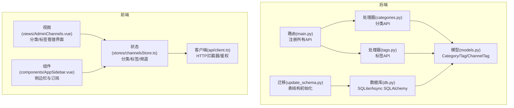
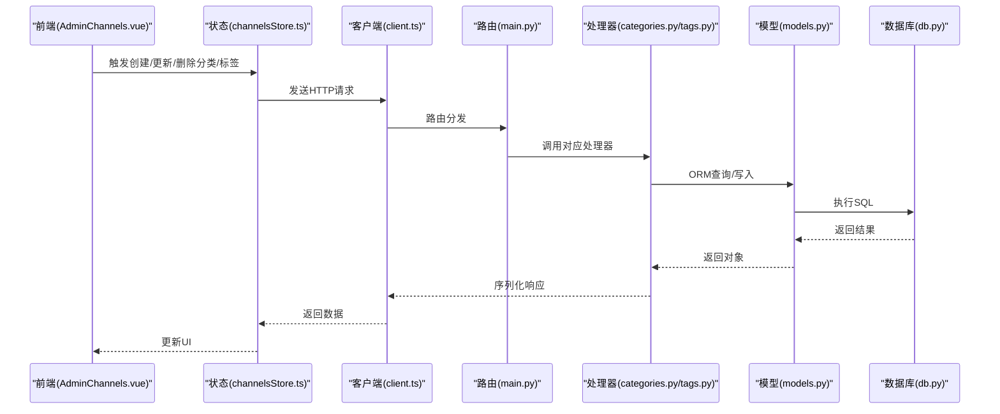
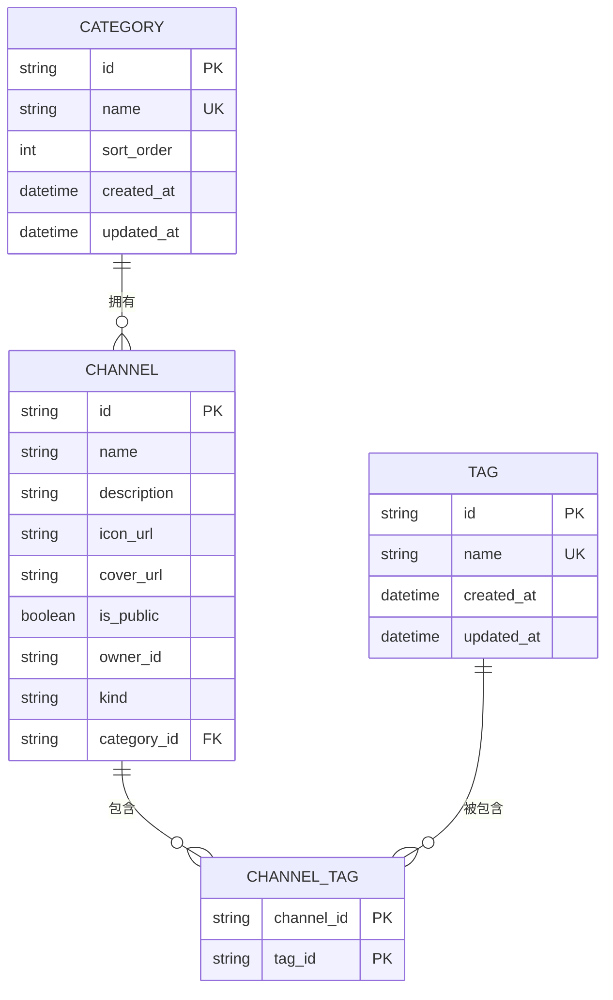
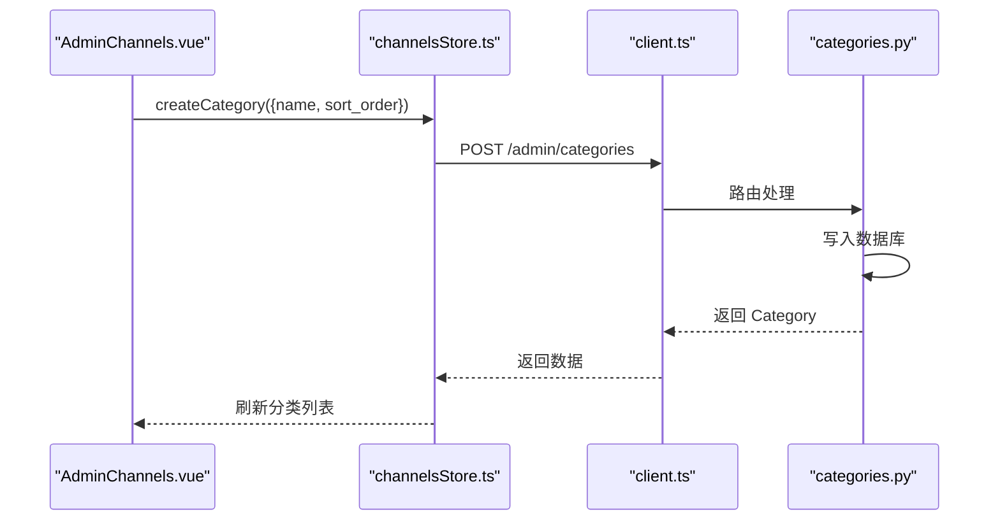
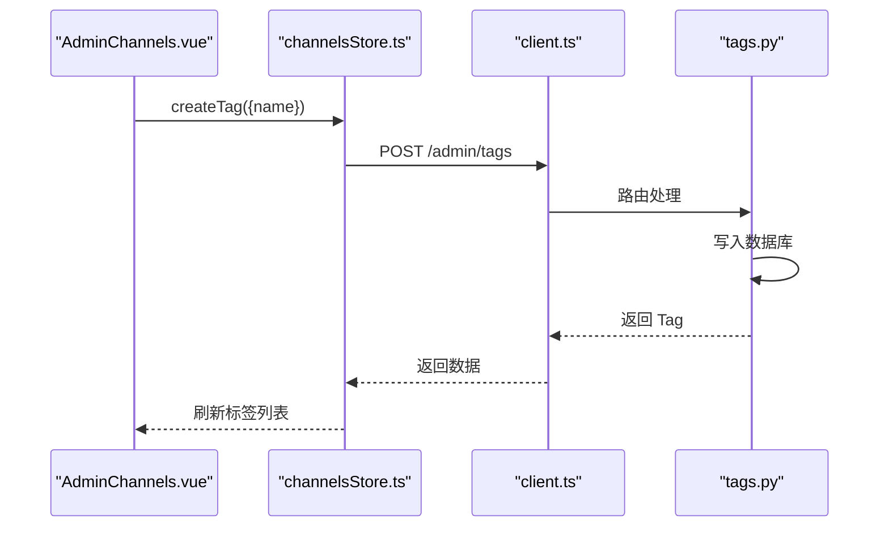
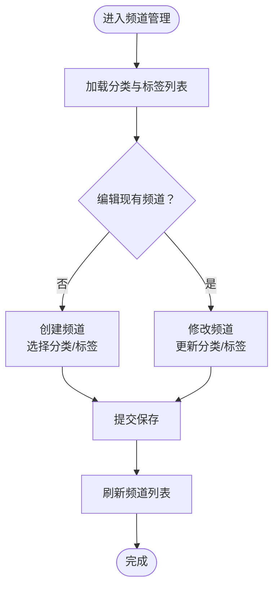
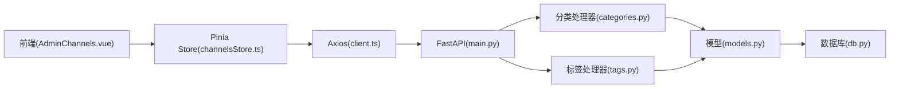

# 分类与标签系统

<cite>
**本文档引用的文件**
- [models.py](file://python-backend/app/models.py)
- [categories.py](file://python-backend/app/handlers/categories.py)
- [tags.py](file://python-backend/app/handlers/tags.py)
- [db.py](file://python-backend/app/db.py)
- [main.py](file://python-backend/app/main.py)
- [update_schema.py](file://python-backend/update_schema.py)
- [channelsStore.ts](file://rss-desktop/src/stores/channelsStore.ts)
- [client.ts](file://rss-desktop/src/api/client.ts)
- [AdminChannels.vue](file://rss-desktop/src/views/AdminChannels.vue)
- [AppSidebar.vue](file://rss-desktop/src/components/AppSidebar.vue)
</cite>

## 目录
1. [简介](#简介)
2. [项目结构](#项目结构)
3. [核心组件](#核心组件)
4. [架构总览](#架构总览)
5. [详细组件分析](#详细组件分析)
6. [依赖关系分析](#依赖关系分析)
7. [性能考虑](#性能考虑)
8. [故障排除指南](#故障排除指南)
9. [结论](#结论)
10. [附录](#附录)

## 简介
本文件面向 Tan RSS Reader 的分类与标签系统，系统性梳理后端模型与接口、前端状态与交互，并给出设计原则、扩展性方案与最佳实践。重点覆盖：
- 分类层级结构设计：创建、组织与管理
- 标签系统实现：创建、分配与管理
- 分类与标签的关系：一对一、一对多映射与组合使用策略
- 在内容组织中的作用：筛选、搜索优化与个性化推荐
- 设计原则：命名规范、层级规划与维护策略
- 扩展性：自定义分类与标签的创建
- API 使用方式与数据结构

## 项目结构
分类与标签系统由三层组成：
- 后端模型层：定义 Category、Tag 及其关联表 ChannelTag
- 后端接口层：提供分类与标签的增删改查 API
- 前端状态与视图层：通过 Pinia Store 与 Vue 组件进行展示与操作

**图表来源**
- [models.py:140-166](file://python-backend/app/models.py#L140-L166)
- [categories.py:18-123](file://python-backend/app/handlers/categories.py#L18-L123)
- [tags.py:18-73](file://python-backend/app/handlers/tags.py#L18-L73)
- [main.py:28-62](file://python-backend/app/main.py#L28-L62)
- [db.py:11-27](file://python-backend/app/db.py#L11-L27)
- [update_schema.py:13-22](file://python-backend/update_schema.py#L13-L22)
- [channelsStore.ts:36-362](file://rss-desktop/src/stores/channelsStore.ts#L36-L362)
- [AdminChannels.vue:1-198](file://rss-desktop/src/views/AdminChannels.vue#L1-L198)
- [AppSidebar.vue:176-388](file://rss-desktop/src/components/AppSidebar.vue#L176-L388)
- [client.ts:1-29](file://rss-desktop/src/api/client.ts#L1-L29)

**章节来源**
- [models.py:140-166](file://python-backend/app/models.py#L140-L166)
- [categories.py:18-123](file://python-backend/app/handlers/categories.py#L18-L123)
- [tags.py:18-73](file://python-backend/app/handlers/tags.py#L18-L73)
- [main.py:28-62](file://python-backend/app/main.py#L28-L62)
- [db.py:11-27](file://python-backend/app/db.py#L11-L27)
- [update_schema.py:13-22](file://python-backend/update_schema.py#L13-L22)
- [channelsStore.ts:36-362](file://rss-desktop/src/stores/channelsStore.ts#L36-L362)
- [AdminChannels.vue:1-198](file://rss-desktop/src/views/AdminChannels.vue#L1-L198)
- [AppSidebar.vue:176-388](file://rss-desktop/src/components/AppSidebar.vue#L176-L388)
- [client.ts:1-29](file://rss-desktop/src/api/client.ts#L1-L29)

## 核心组件
- 数据模型
  - Category：分类，具备唯一名称与排序权重
  - Tag：标签，具备唯一名称
  - ChannelTag：频道与标签的多对多关联表
- 后端接口
  - 分类：列出、创建、更新、删除
  - 标签：列出、创建、删除
- 前端状态
  - 分类/标签/频道数据的获取与持久化
  - 管理界面的表单与列表渲染

**章节来源**
- [models.py:140-166](file://python-backend/app/models.py#L140-L166)
- [categories.py:33-123](file://python-backend/app/handlers/categories.py#L33-L123)
- [tags.py:27-73](file://python-backend/app/handlers/tags.py#L27-L73)
- [channelsStore.ts:46-133](file://rss-desktop/src/stores/channelsStore.ts#L46-L133)

## 架构总览
后端采用 FastAPI + Async SQLAlchemy + SQLite，通过异步会话管理事务；前端使用 Axios 发起请求并携带鉴权头，Pinia Store 统一管理分类/标签/频道等状态。

**图表来源**
- [AdminChannels.vue:122-193](file://rss-desktop/src/views/AdminChannels.vue#L122-L193)
- [channelsStore.ts:52-133](file://rss-desktop/src/stores/channelsStore.ts#L52-L133)
- [client.ts:3-29](file://rss-desktop/src/api/client.ts#L3-L29)
- [main.py:57-58](file://python-backend/app/main.py#L57-L58)
- [categories.py:61-123](file://python-backend/app/handlers/categories.py#L61-L123)
- [tags.py:40-73](file://python-backend/app/handlers/tags.py#L40-L73)
- [models.py:140-166](file://python-backend/app/models.py#L140-L166)
- [db.py:24-25](file://python-backend/app/db.py#L24-L25)

## 详细组件分析

### 数据模型与关系
- Category：id、name（唯一）、sort_order、时间戳
- Tag：id、name（唯一）、时间戳
- ChannelTag：channel_id、tag_id（联合主键），实现频道与标签的多对多关系
- Channel：可选 category_id 关联到 Category；Channel 本身不直接存储标签，通过 ChannelTag 关联

**图表来源**
- [models.py:140-166](file://python-backend/app/models.py#L140-L166)

**章节来源**
- [models.py:140-166](file://python-backend/app/models.py#L140-L166)

### 分类管理（Category）
- 列表：按 sort_order 升序、创建时间降序排列
- 创建：生成唯一 id，设置创建/更新时间为当前时间
- 更新：可修改 name 与 sort_order
- 删除：级联删除（由后端逻辑保证）

**图表来源**
- [AdminChannels.vue:122-162](file://rss-desktop/src/views/AdminChannels.vue#L122-L162)
- [channelsStore.ts:71-80](file://rss-desktop/src/stores/channelsStore.ts#L71-L80)
- [categories.py:61-86](file://python-backend/app/handlers/categories.py#L61-L86)

**章节来源**
- [categories.py:33-123](file://python-backend/app/handlers/categories.py#L33-L123)
- [channelsStore.ts:52-102](file://rss-desktop/src/stores/channelsStore.ts#L52-L102)

### 标签管理（Tag）
- 列表：按创建时间倒序
- 创建：生成唯一 id，设置创建/更新时间为当前时间
- 删除：删除标签及其在 ChannelTag 中的关联

**图表来源**
- [AdminChannels.vue:170-193](file://rss-desktop/src/views/AdminChannels.vue#L170-L193)
- [channelsStore.ts:113-122](file://rss-desktop/src/stores/channelsStore.ts#L113-L122)
- [tags.py:40-62](file://python-backend/app/handlers/tags.py#L40-L62)

**章节来源**
- [tags.py:27-73](file://python-backend/app/handlers/tags.py#L27-L73)
- [channelsStore.ts:104-133](file://rss-desktop/src/stores/channelsStore.ts#L104-L133)

### 频道与标签的组合使用
- 频道可选择一个分类（category_id），也可关联多个标签（通过 ChannelTag）
- 管理界面支持在创建/编辑频道时选择分类与标签集合
- 前端在频道卡片中同时展示分类与标签

**图表来源**
- [AdminChannels.vue:64-121](file://rss-desktop/src/views/AdminChannels.vue#L64-L121)
- [channelsStore.ts:283-326](file://rss-desktop/src/stores/channelsStore.ts#L283-L326)

**章节来源**
- [AdminChannels.vue:64-121](file://rss-desktop/src/views/AdminChannels.vue#L64-L121)
- [channelsStore.ts:283-326](file://rss-desktop/src/stores/channelsStore.ts#L283-L326)

### 前端状态与交互
- channelsStore.ts 统一管理分类/标签/频道数据，封装 CRUD 操作
- AdminChannels.vue 提供分类/标签/频道的增删改查界面
- AppSidebar.vue 展示订阅频道列表，便于理解频道与分类/标签的关系

**章节来源**
- [channelsStore.ts:36-362](file://rss-desktop/src/stores/channelsStore.ts#L36-L362)
- [AdminChannels.vue:1-198](file://rss-desktop/src/views/AdminChannels.vue#L1-L198)
- [AppSidebar.vue:176-388](file://rss-desktop/src/components/AppSidebar.vue#L176-L388)

## 依赖关系分析
- 后端依赖
  - FastAPI 路由注册：在 main.py 中集中 include_router
  - 数据库：Async SQLAlchemy + SQLite，运行时创建表并执行迁移
- 前端依赖
  - Axios：统一请求与响应拦截，自动注入 Authorization 头
  - Pinia：集中管理分类/标签/频道状态
  - Vue 组件：AdminChannels.vue 与 AppSidebar.vue 作为主要交互入口

**图表来源**
- [main.py:57-58](file://python-backend/app/main.py#L57-L58)
- [categories.py:18-123](file://python-backend/app/handlers/categories.py#L18-L123)
- [tags.py:18-73](file://python-backend/app/handlers/tags.py#L18-L73)
- [models.py:140-166](file://python-backend/app/models.py#L140-L166)
- [db.py:24-25](file://python-backend/app/db.py#L24-L25)
- [client.ts:3-29](file://rss-desktop/src/api/client.ts#L3-L29)
- [channelsStore.ts:36-362](file://rss-desktop/src/stores/channelsStore.ts#L36-L362)
- [AdminChannels.vue:1-198](file://rss-desktop/src/views/AdminChannels.vue#L1-L198)

**章节来源**
- [main.py:28-62](file://python-backend/app/main.py#L28-L62)
- [db.py:11-27](file://python-backend/app/db.py#L11-L27)
- [update_schema.py:13-22](file://python-backend/update_schema.py#L13-L22)
- [client.ts:1-29](file://rss-desktop/src/api/client.ts#L1-L29)

## 性能考虑
- 数据库连接与会话
  - 使用异步引擎与会话，减少阻塞
  - 表创建与迁移在启动时执行，避免运行时开销
- 查询优化
  - 分类列表按 sort_order + created_at 排序，索引可考虑在 sort_order 上建立
  - 标签列表按 created_at 倒序，确保高并发下的稳定性
- 前端状态
  - Pinia Store 集中管理，避免重复请求
  - 成功后主动刷新列表，减少缓存不一致

[本节为通用建议，无需特定文件来源]

## 故障排除指南
- 400 错误（分类/标签名称已存在）
  - 后端在创建时捕获异常并回滚，返回错误信息
  - 建议前端提示用户更换名称
- 404 错误（更新/删除不存在的资源）
  - 后端返回 404，前端应提示“资源不存在”
- 401 未授权
  - 客户端拦截器检测 401，触发登出事件
  - 建议前端引导重新登录

**章节来源**
- [categories.py:77-104](file://python-backend/app/handlers/categories.py#L77-L104)
- [tags.py:55-70](file://python-backend/app/handlers/tags.py#L55-L70)
- [client.ts:17-26](file://rss-desktop/src/api/client.ts#L17-L26)

## 结论
Tan RSS Reader 的分类与标签系统以简洁的模型与清晰的 API 实现了内容的层级化与多维标注。后端通过 FastAPI 与 Async SQLAlchemy 提供稳定的 CRUD 能力，前端通过 Pinia Store 与 Vue 组件实现直观的管理界面。系统支持分类与标签的组合使用，满足内容筛选、搜索优化与个性化推荐的需求。建议在后续迭代中引入索引优化与更细粒度的权限控制，进一步提升性能与安全性。

[本节为总结，无需特定文件来源]

## 附录

### API 定义概览
- 分类
  - GET /api/admin/categories：列出分类（管理员）
  - GET /api/categories：列出公开分类
  - POST /api/admin/categories：创建分类（管理员）
  - PATCH /api/admin/categories/{id}：更新分类（管理员）
  - DELETE /api/admin/categories/{id}：删除分类（管理员）
- 标签
  - GET /api/admin/tags：列出标签（管理员）
  - POST /api/admin/tags：创建标签（管理员）
  - DELETE /api/admin/tags/{id}：删除标签（管理员）

**章节来源**
- [categories.py:33-123](file://python-backend/app/handlers/categories.py#L33-L123)
- [tags.py:27-73](file://python-backend/app/handlers/tags.py#L27-L73)
- [main.py:57-58](file://python-backend/app/main.py#L57-L58)

### 数据结构说明
- 分类（Category）
  - 字段：id、name、sort_order、created_at、updated_at
- 标签（Tag）
  - 字段：id、name、created_at、updated_at
- 频道-标签关联（ChannelTag）
  - 字段：channel_id、tag_id（联合主键）

**章节来源**
- [models.py:140-166](file://python-backend/app/models.py#L140-L166)

### 设计原则与最佳实践
- 命名规范
  - 分类与标签名称唯一，避免歧义
- 层级规划
  - 分类用于宏观组织，标签用于微观标注
  - sort_order 控制分类显示顺序
- 组合使用策略
  - 一个频道可选择一个分类并绑定多个标签
  - 前端在频道卡片中同时展示分类与标签，便于筛选
- 维护策略
  - 定期清理无用标签
  - 对分类进行归档与合并，保持层级简洁

[本节为通用指导，无需特定文件来源]