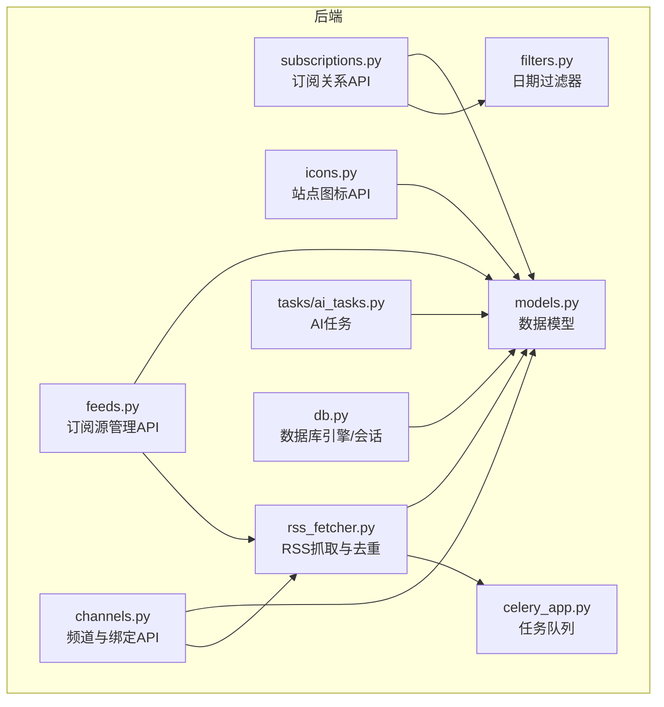
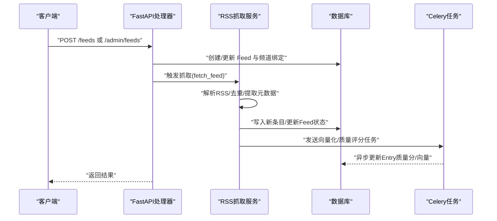
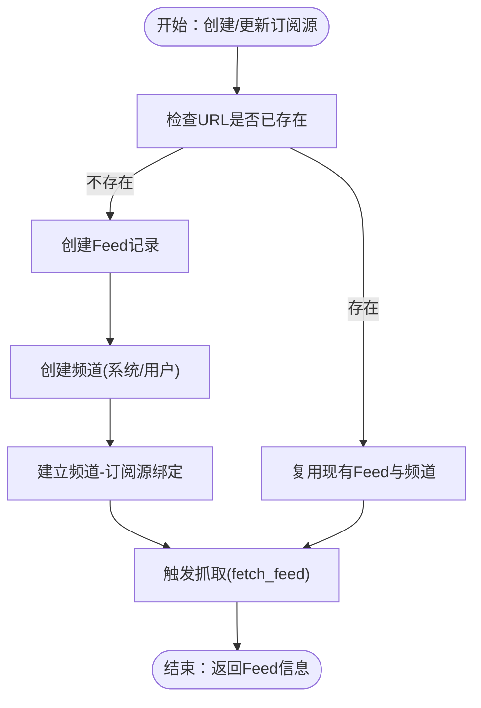
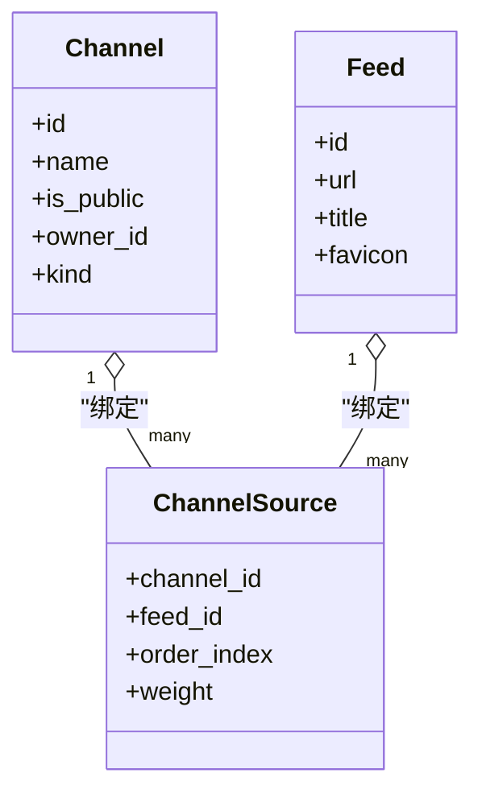
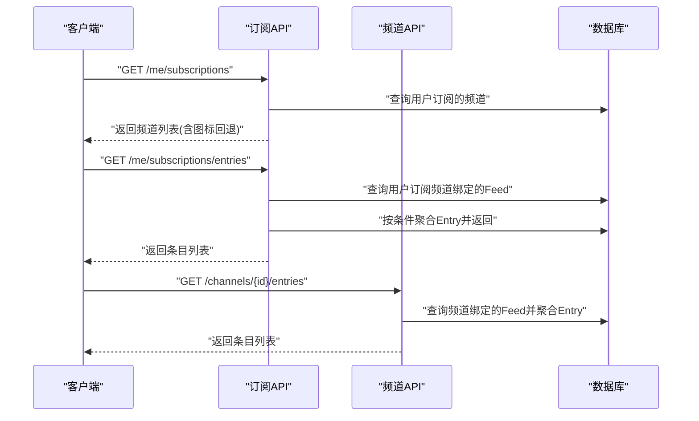
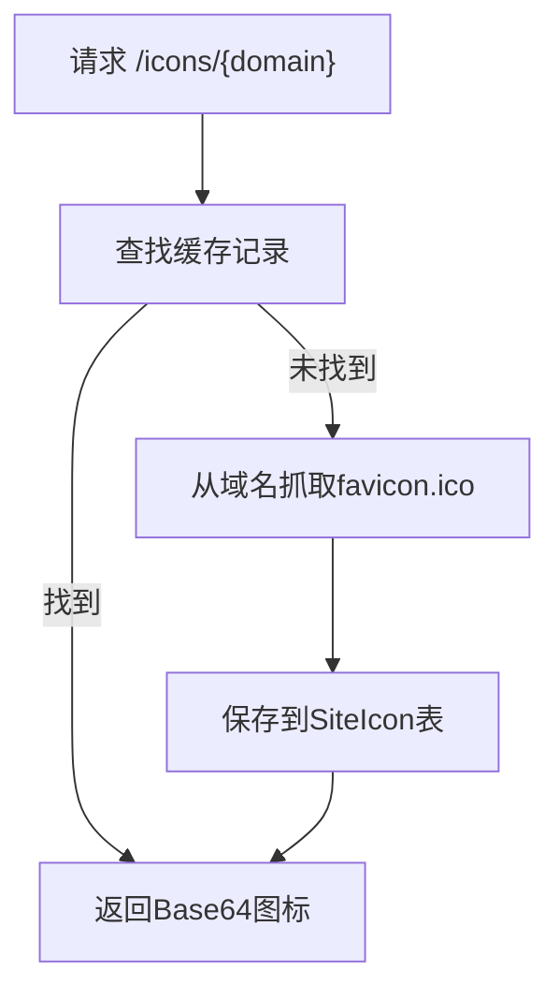
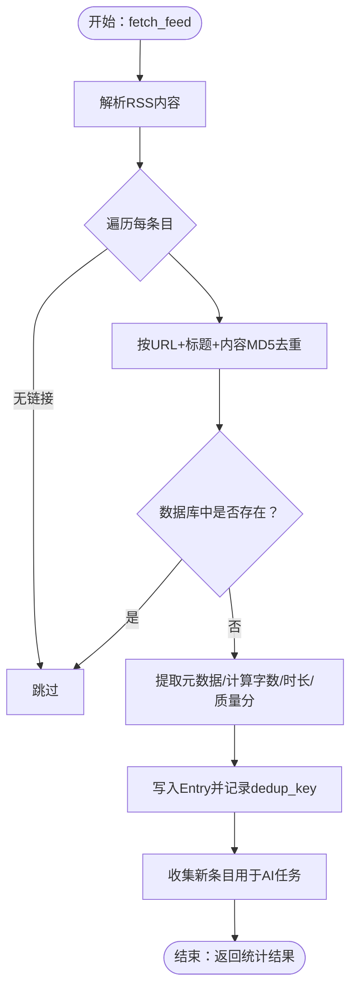
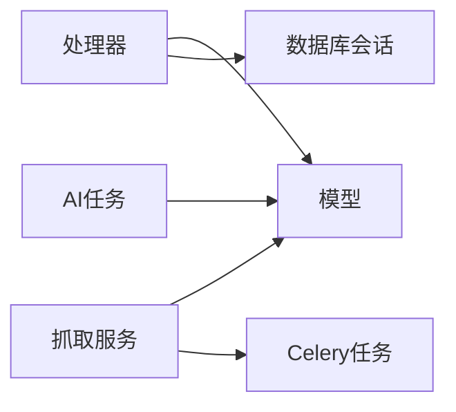

# 订阅管理

<cite>
**本文引用的文件**
- [python-backend/app/models.py](file://python-backend/app/models.py)
- [python-backend/app/handlers/feeds.py](file://python-backend/app/handlers/feeds.py)
- [python-backend/app/handlers/channels.py](file://python-backend/app/handlers/channels.py)
- [python-backend/app/handlers/subscriptions.py](file://python-backend/app/handlers/subscriptions.py)
- [python-backend/app/handlers/icons.py](file://python-backend/app/handlers/icons.py)
- [python-backend/app/services/rss_fetcher.py](file://python-backend/app/services/rss_fetcher.py)
- [python-backend/app/utils/filters.py](file://python-backend/app/utils/filters.py)
- [python-backend/app/db.py](file://python-backend/app/db.py)
- [python-backend/app/celery_app.py](file://python-backend/app/celery_app.py)
- [python-backend/app/tasks/ai_tasks.py](file://python-backend/app/tasks/ai_tasks.py)
- [todo.md](file://todo.md)
- [VIP_ARCHITECTURE.md](file://VIP_ARCHITECTURE.md)
</cite>

## 目录
1. [简介](#简介)
2. [项目结构](#项目结构)
3. [核心组件](#核心组件)
4. [架构总览](#架构总览)
5. [详细组件分析](#详细组件分析)
6. [依赖分析](#依赖分析)
7. [性能考虑](#性能考虑)
8. [故障排除指南](#故障排除指南)
9. [结论](#结论)
10. [附录](#附录)

## 简介
本文件面向 Tan RSS Reader 的订阅管理系统，围绕“订阅源（Feed）的添加、删除与管理”、“订阅源与频道的绑定机制（多频道订阅、权重与聚合策略）”、“订阅源状态管理（活跃检查、错误处理、重试与停用策略）”、“内容处理流程（去重、解析、元数据提取与存储优化）”以及“性能优化（批量、并发与资源限制）”展开，辅以故障排除与最佳实践建议，帮助开发者与运维人员高效理解与维护系统。

## 项目结构
后端采用 FastAPI + SQLAlchemy 异步 ORM + SQLite 存储，核心模块如下：
- 数据模型：定义 Feed、Entry、Channel、ChannelSource、SiteIcon 等实体及其字段
- 处理器（Handlers）：提供订阅源、频道、订阅、图标等 API
- 服务（Services）：RSS 抓取与去重、向量化与质量评分等
- 工具（Utils）：查询过滤器（日期范围）
- 任务（Tasks/Celery）：异步执行 AI 质量评分与向量化
- 数据库（DB）：异步引擎与会话工厂

图表来源
- [python-backend/app/handlers/feeds.py:1-477](file://python-backend/app/handlers/feeds.py#L1-L477)
- [python-backend/app/handlers/channels.py:1-502](file://python-backend/app/handlers/channels.py#L1-L502)
- [python-backend/app/handlers/subscriptions.py:1-175](file://python-backend/app/handlers/subscriptions.py#L1-L175)
- [python-backend/app/handlers/icons.py:1-98](file://python-backend/app/handlers/icons.py#L1-L98)
- [python-backend/app/services/rss_fetcher.py:1-312](file://python-backend/app/services/rss_fetcher.py#L1-L312)
- [python-backend/app/utils/filters.py:1-25](file://python-backend/app/utils/filters.py#L1-L25)
- [python-backend/app/models.py:1-228](file://python-backend/app/models.py#L1-L228)
- [python-backend/app/db.py:1-27](file://python-backend/app/db.py#L1-L27)
- [python-backend/app/celery_app.py:1-23](file://python-backend/app/celery_app.py#L1-L23)
- [python-backend/app/tasks/ai_tasks.py:1-87](file://python-backend/app/tasks/ai_tasks.py#L1-L87)

章节来源
- [python-backend/app/models.py:1-228](file://python-backend/app/models.py#L1-L228)
- [python-backend/app/handlers/feeds.py:1-477](file://python-backend/app/handlers/feeds.py#L1-L477)
- [python-backend/app/handlers/channels.py:1-502](file://python-backend/app/handlers/channels.py#L1-L502)
- [python-backend/app/handlers/subscriptions.py:1-175](file://python-backend/app/handlers/subscriptions.py#L1-L175)
- [python-backend/app/handlers/icons.py:1-98](file://python-backend/app/handlers/icons.py#L1-L98)
- [python-backend/app/services/rss_fetcher.py:1-312](file://python-backend/app/services/rss_fetcher.py#L1-L312)
- [python-backend/app/utils/filters.py:1-25](file://python-backend/app/utils/filters.py#L1-L25)
- [python-backend/app/db.py:1-27](file://python-backend/app/db.py#L1-L27)
- [python-backend/app/celery_app.py:1-23](file://python-backend/app/celery_app.py#L1-L23)
- [python-backend/app/tasks/ai_tasks.py:1-87](file://python-backend/app/tasks/ai_tasks.py#L1-L87)

## 核心组件
- 订阅源（Feed）：唯一 URL、标题、favicon、更新间隔、最后更新时间、最后状态、错误计数
- 频道（Channel）：名称、描述、图标/封面、公开性、拥有者、类型（topic/feed）、标签
- 绑定（ChannelSource）：频道与订阅源的多对多关系，支持顺序与权重
- 条目（Entry）：标题、链接、作者、内容、摘要、发布时间、去重键、阅读/收藏状态、字数、阅读时长、质量分
- 站点图标（SiteIcon）：域名、MIME、Base64 图标数据、来源 URL、最近抓取时间、错误计数、激活状态
- 订阅关系（Subscription）：用户与频道的订阅关系
- RSS 抓取服务：解析、去重、元数据提取、质量评分、向量化、错误处理与状态更新
- 任务队列（Celery）：异步执行质量评分与向量化

章节来源
- [python-backend/app/models.py:7-228](file://python-backend/app/models.py#L7-L228)
- [python-backend/app/services/rss_fetcher.py:104-312](file://python-backend/app/services/rss_fetcher.py#L104-L312)

## 架构总览
订阅管理由“API 层 → 业务逻辑 → 数据持久层 → 异步任务”构成，RSS 抓取与内容处理在单个 Feed 上串行执行，但通过 Celery 并发异步执行 AI 任务，避免阻塞主流程。

图表来源
- [python-backend/app/handlers/feeds.py:141-221](file://python-backend/app/handlers/feeds.py#L141-L221)
- [python-backend/app/services/rss_fetcher.py:104-312](file://python-backend/app/services/rss_fetcher.py#L104-L312)
- [python-backend/app/tasks/ai_tasks.py:16-51](file://python-backend/app/tasks/ai_tasks.py#L16-L51)
- [python-backend/app/tasks/ai_tasks.py:53-87](file://python-backend/app/tasks/ai_tasks.py#L53-L87)

## 详细组件分析

### 订阅源（Feed）管理
- 添加订阅源
  - 管理员路径：POST /admin/feeds，校验 URL 唯一，若不存在则创建 Feed 与系统频道（kind=feed），并尝试抓取一次
  - 普通用户路径：POST /feeds，若 URL 已存在则复用；否则创建 Feed 与频道（owner_id 可能为当前用户），并尝试抓取；若用户已订阅该频道则不再重复订阅
- 更新订阅源：PUT /feeds/{id}，支持更新标题与更新间隔
- 删除订阅源：DELETE /feeds/{id}（管理员）
- 刷新订阅源：POST /feeds/{id}/refresh，立即触发抓取
- 列表与搜索：GET /feeds 与 /admin/feeds，支持分页、搜索、排序与日期过滤

图表来源
- [python-backend/app/handlers/feeds.py:141-221](file://python-backend/app/handlers/feeds.py#L141-L221)
- [python-backend/app/handlers/feeds.py:301-418](file://python-backend/app/handlers/feeds.py#L301-L418)

章节来源
- [python-backend/app/handlers/feeds.py:39-477](file://python-backend/app/handlers/feeds.py#L39-L477)

### 频道与订阅源绑定机制
- 绑定关系：ChannelSource 记录频道与订阅源的绑定，支持 order_index 与 weight
- 多频道订阅：同一订阅源可被多个频道引用，形成“多频道订阅”
- 权重与聚合：权重影响内容在频道内的展示优先级或聚合策略（具体策略由上层逻辑决定）
- 绑定管理：列出、添加、移除频道-订阅源绑定

图表来源
- [python-backend/app/models.py:160-167](file://python-backend/app/models.py#L160-L167)
- [python-backend/app/handlers/channels.py:382-452](file://python-backend/app/handlers/channels.py#L382-L452)

章节来源
- [python-backend/app/models.py:160-167](file://python-backend/app/models.py#L160-L167)
- [python-backend/app/handlers/channels.py:382-452](file://python-backend/app/handlers/channels.py#L382-L452)

### 订阅关系与内容聚合
- 订阅关系：Subscription 记录用户与频道的订阅
- 聚合入口：/me/subscriptions/entries 与 /channels/{id}/entries
  - 前者按用户订阅的频道聚合，后者按指定频道聚合
  - 支持未读过滤、高质过滤、日期范围过滤、排序与分页
- 图标回退：若频道无图标，则回退到其绑定订阅源的 favicon

图表来源
- [python-backend/app/handlers/subscriptions.py:49-175](file://python-backend/app/handlers/subscriptions.py#L49-L175)
- [python-backend/app/handlers/channels.py:454-502](file://python-backend/app/handlers/channels.py#L454-L502)

章节来源
- [python-backend/app/handlers/subscriptions.py:49-175](file://python-backend/app/handlers/subscriptions.py#L49-L175)
- [python-backend/app/handlers/channels.py:454-502](file://python-backend/app/handlers/channels.py#L454-L502)

### 站点图标（Favicon）获取与缓存
- 获取：GET /icons/{domain} 返回缓存的 Base64 图标
- 刷新：POST /icons/{domain}/refresh 从域名抓取 favicon.ico 并缓存
- 代理：GET /icons/proxy?url=... 代理返回图标内容
- 清理：POST /icons/cleanup 删除非激活记录

图表来源
- [python-backend/app/handlers/icons.py:30-76](file://python-backend/app/handlers/icons.py#L30-L76)

章节来源
- [python-backend/app/handlers/icons.py:1-98](file://python-backend/app/handlers/icons.py#L1-L98)

### 内容处理流程：去重、解析、元数据与存储优化
- 去重算法
  - URL 规范化（http→https、补全协议）
  - dedup_key = SHA256(“规范化URL|标题截断|内容MD5前缀”)
  - 批内去重集合 + 数据库去重查询，避免重复入库
- 内容解析
  - 使用 feedparser 解析，提取标题、链接、作者、摘要/内容、发布时间
  - 对 arXiv 特殊路由进行转换
- 元数据提取与存储优化
  - 字数统计与阅读时长估算
  - 质量分（基于字数与标题长度的启发式评分）
  - dedup_key 字段建立索引，加速去重
- 错误处理与状态更新
  - 网络/HTTP 错误记录 last_status 与 error_count
  - 成功解析则清零错误计数
- 异步处理
  - 新条目文本与摘要截断（上限长度）
  - 发送 Celery 任务进行向量化与质量评分

图表来源
- [python-backend/app/services/rss_fetcher.py:104-312](file://python-backend/app/services/rss_fetcher.py#L104-L312)

章节来源
- [python-backend/app/services/rss_fetcher.py:13-312](file://python-backend/app/services/rss_fetcher.py#L13-L312)
- [python-backend/app/models.py:21-39](file://python-backend/app/models.py#L21-L39)

### 状态管理：活跃检查、错误处理、重试与停用策略
- 状态字段：Feed.last_status、error_count、last_updated
- 错误处理
  - 网络异常：记录“network error”，error_count+1
  - HTTP 错误：记录“HTTP {code}”，error_count+1
  - 解析失败（bozo）：记录“parse error”，error_count+1
  - 成功：last_status=“success”，error_count=0
- 重试与停用
  - 系统可通过定期刷新接口手动重试
  - 停用策略：可在管理端删除 Feed 或将其从频道解绑，从而停止内容流入
- 活跃检查
  - 最近更新时间与错误计数可用于判断活跃度与健康状况

章节来源
- [python-backend/app/services/rss_fetcher.py:126-144](file://python-backend/app/services/rss_fetcher.py#L126-L144)
- [python-backend/app/services/rss_fetcher.py:273-280](file://python-backend/app/services/rss_fetcher.py#L273-L280)
- [python-backend/app/handlers/feeds.py:462-471](file://python-backend/app/handlers/feeds.py#L462-L471)

## 依赖分析
- 处理器依赖模型与数据库会话
- 抓取服务依赖 feedparser、httpx、去重与 AI/向量化任务
- 任务依赖 Celery 与向量存储（外部组件）

图表来源
- [python-backend/app/handlers/feeds.py:1-14](file://python-backend/app/handlers/feeds.py#L1-L14)
- [python-backend/app/services/rss_fetcher.py:1-11](file://python-backend/app/services/rss_fetcher.py#L1-L11)
- [python-backend/app/tasks/ai_tasks.py:1-7](file://python-backend/app/tasks/ai_tasks.py#L1-L7)

章节来源
- [python-backend/app/handlers/feeds.py:1-14](file://python-backend/app/handlers/feeds.py#L1-L14)
- [python-backend/app/services/rss_fetcher.py:1-11](file://python-backend/app/services/rss_fetcher.py#L1-L11)
- [python-backend/app/tasks/ai_tasks.py:1-7](file://python-backend/app/tasks/ai_tasks.py#L1-L7)

## 性能考虑
- 批量与并发
  - 抓取完成后批量发送 Celery 任务进行向量化与质量评分，避免同步阻塞
  - 通过环境变量控制是否启用 Celery，未启用时回退到 asyncio
- 资源限制
  - 查询分页上限（如 limit ≤ 1000）
  - 文本截断（避免超长内容写入向量库）
  - 任务超时与跟踪（Celery 配置）
- 存储优化
  - dedup_key 建索引，加速去重
  - 字段冗余（如 quality_score、word_count、reading_time）减少查询时计算
- 网络与解析
  - 设置合理的超时与跟随重定向
  - 对特定站点（如 arXiv）做特殊路由优化

章节来源
- [python-backend/app/services/rss_fetcher.py:282-312](file://python-backend/app/services/rss_fetcher.py#L282-L312)
- [python-backend/app/utils/filters.py:24-25](file://python-backend/app/utils/filters.py#L24-L25)
- [python-backend/app/models.py:38-39](file://python-backend/app/models.py#L38-L39)
- [python-backend/app/celery_app.py:14-22](file://python-backend/app/celery_app.py#L14-L22)

## 故障排除指南
- 无法获取订阅源内容
  - 检查 last_status 与 error_count，确认网络/HTTP/解析错误
  - 尝试 POST /feeds/{id}/refresh 手动刷新
  - 若为 404/403，确认 URL 是否需要末尾斜杠
- 重复内容
  - 检查 dedup_key 去重逻辑与数据库索引
  - 确认标题/内容变化是否足够导致新 dedup_key
- 图标缺失
  - 使用 /icons/{domain}/refresh 刷新缓存
  - 通过 /icons/proxy?url=... 代理查看图标是否可达
- 聚合结果为空
  - 确认用户是否订阅了频道
  - 检查频道是否绑定有效订阅源
  - 使用日期过滤参数排查时间范围问题
- AI 任务未执行
  - 检查 Redis 地址与 Celery 配置
  - 查看任务队列与日志，确认任务是否入队与执行

章节来源
- [python-backend/app/services/rss_fetcher.py:126-144](file://python-backend/app/services/rss_fetcher.py#L126-L144)
- [python-backend/app/handlers/icons.py:54-76](file://python-backend/app/handlers/icons.py#L54-L76)
- [python-backend/app/handlers/subscriptions.py:109-175](file://python-backend/app/handlers/subscriptions.py#L109-L175)
- [python-backend/app/celery_app.py:5-12](file://python-backend/app/celery_app.py#L5-L12)

## 结论
本订阅管理系统通过清晰的模型与 API 分层，实现了订阅源的生命周期管理、频道绑定与聚合、内容去重与元数据提取，并借助 Celery 实现异步处理，兼顾性能与可维护性。结合错误处理与状态管理，系统具备良好的稳定性与可观测性。建议在生产环境中配合 Redis 任务队列与数据库索引优化，持续监控错误率与任务延迟，以保障大规模订阅场景的可靠性。

## 附录
- 与“AI 编辑部”理念相关的后续规划（结构化简报、噪音过滤、Source Packs、去耦采集架构）可参考项目文档，有助于指导订阅源内容的高质量筛选与聚合。

章节来源
- [todo.md:1-26](file://todo.md#L1-L26)
- [VIP_ARCHITECTURE.md:1-74](file://VIP_ARCHITECTURE.md#L1-L74)