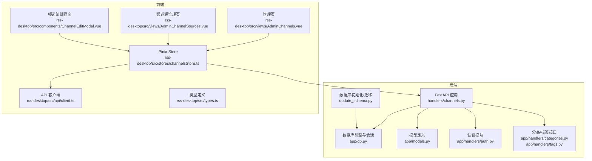
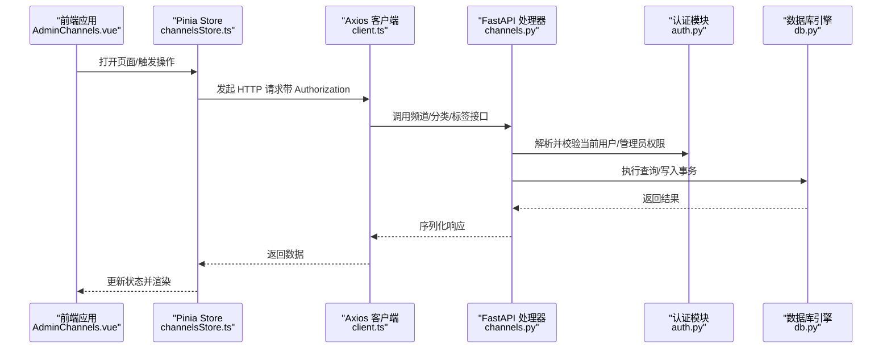
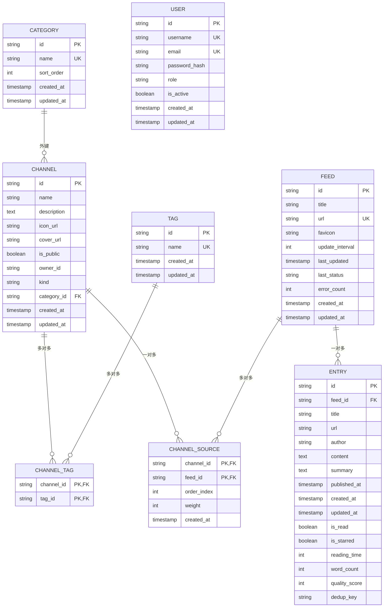
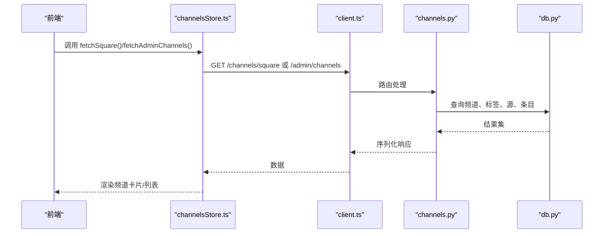
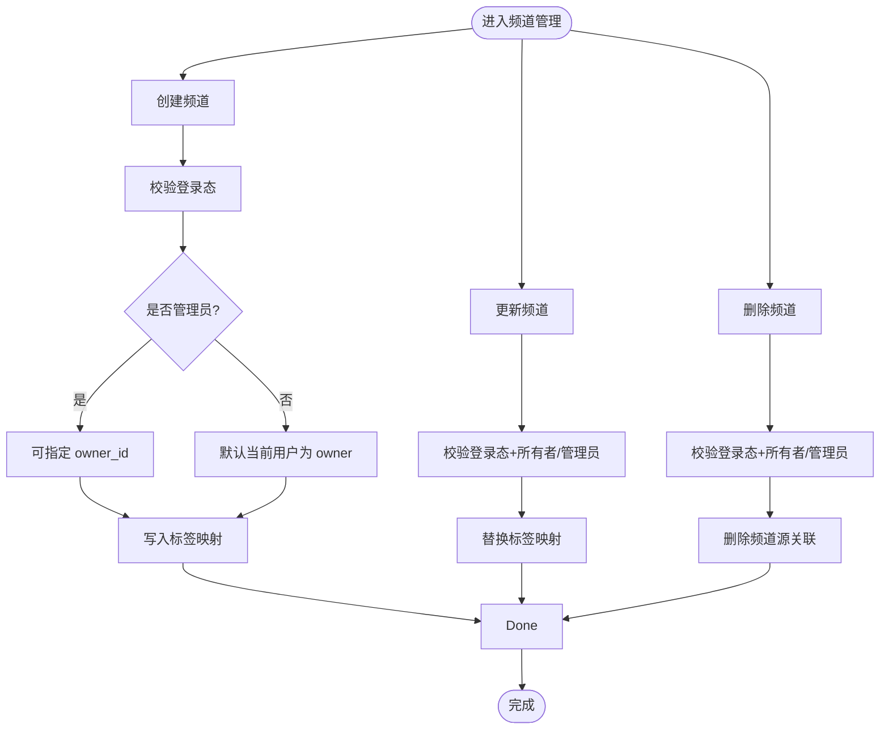
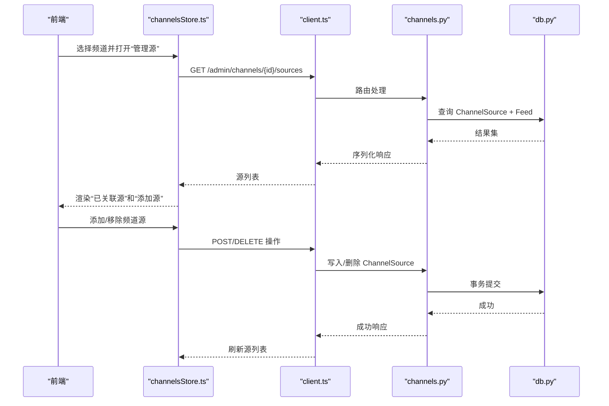
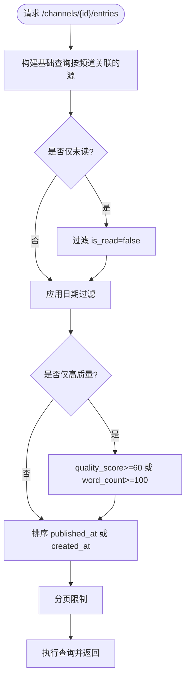
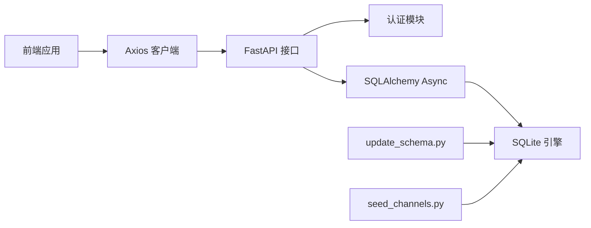

# 频道管理

<cite>
**本文引用的文件**   
- [python-backend/app/handlers/channels.py](file://python-backend/app/handlers/channels.py)
- [python-backend/app/models.py](file://python-backend/app/models.py)
- [python-backend/app/db.py](file://python-backend/app/db.py)
- [python-backend/app/handlers/auth.py](file://python-backend/app/handlers/auth.py)
- [python-backend/app/handlers/categories.py](file://python-backend/app/handlers/categories.py)
- [python-backend/app/handlers/tags.py](file://python-backend/app/handlers/tags.py)
- [python-backend/update_schema.py](file://python-backend/update_schema.py)
- [python-backend/seed_channels.py](file://python-backend/seed_channels.py)
- [rss-desktop/src/stores/channelsStore.ts](file://rss-desktop/src/stores/channelsStore.ts)
- [rss-desktop/src/views/AdminChannels.vue](file://rss-desktop/src/views/AdminChannels.vue)
- [rss-desktop/src/views/AdminChannelSources.vue](file://rss-desktop/src/views/AdminChannelSources.vue)
- [rss-desktop/src/components/ChannelEditModal.vue](file://rss-desktop/src/components/ChannelEditModal.vue)
- [rss-desktop/src/api/client.ts](file://rss-desktop/src/api/client.ts)
- [rss-desktop/src/types.ts](file://rss-desktop/src/types.ts)
</cite>

## 目录
1. [简介](#简介)
2. [项目结构](#项目结构)
3. [核心组件](#核心组件)
4. [架构总览](#架构总览)
5. [详细组件分析](#详细组件分析)
6. [依赖分析](#依赖分析)
7. [性能考虑](#性能考虑)
8. [故障排查指南](#故障排查指南)
9. [结论](#结论)
10. [附录](#附录)

## 简介
本文件面向 Tan RSS Reader 的“频道管理”能力，系统性梳理频道的创建、配置与管理流程，覆盖以下主题：
- 频道属性：名称、描述、图标、封面、公开/私有、所有者、分类、标签
- 权限控制：基于 JWT 的登录态校验、管理员与所有者权限
- 频道与订阅源关联：权重与排序规则、动态图标回退、动态内容预览
- 查询接口：公开频道广场、管理员频道列表、频道详情、频道条目流
- 增删改查：权限验证、数据校验、事务提交
- 最佳实践：频道分类策略、内容组织原则、用户体验优化

## 项目结构
后端采用 FastAPI + SQLAlchemy Async + SQLite，前端使用 Vue 3 + Pinia + Axios。频道管理涉及后端处理器、模型定义、数据库初始化与迁移脚本，以及前端 Store 和视图组件。

**图表来源**
- [python-backend/app/handlers/channels.py:1-502](file://python-backend/app/handlers/channels.py#L1-L502)
- [python-backend/app/db.py:1-27](file://python-backend/app/db.py#L1-L27)
- [python-backend/app/models.py:126-167](file://python-backend/app/models.py#L126-L167)
- [python-backend/app/handlers/auth.py:1-174](file://python-backend/app/handlers/auth.py#L1-L174)
- [python-backend/app/handlers/categories.py:1-123](file://python-backend/app/handlers/categories.py#L1-L123)
- [python-backend/app/handlers/tags.py:1-73](file://python-backend/app/handlers/tags.py#L1-L73)
- [python-backend/update_schema.py:1-136](file://python-backend/update_schema.py#L1-L136)
- [rss-desktop/src/stores/channelsStore.ts:1-363](file://rss-desktop/src/stores/channelsStore.ts#L1-L363)
- [rss-desktop/src/views/AdminChannels.vue:1-950](file://rss-desktop/src/views/AdminChannels.vue#L1-L950)
- [rss-desktop/src/views/AdminChannelSources.vue:1-182](file://rss-desktop/src/views/AdminChannelSources.vue#L1-L182)
- [rss-desktop/src/components/ChannelEditModal.vue:1-208](file://rss-desktop/src/components/ChannelEditModal.vue#L1-L208)
- [rss-desktop/src/api/client.ts:1-29](file://rss-desktop/src/api/client.ts#L1-L29)
- [rss-desktop/src/types.ts:1-54](file://rss-desktop/src/types.ts#L1-L54)

**章节来源**
- [python-backend/app/handlers/channels.py:1-502](file://python-backend/app/handlers/channels.py#L1-L502)
- [python-backend/app/models.py:126-167](file://python-backend/app/models.py#L126-L167)
- [python-backend/app/db.py:1-27](file://python-backend/app/db.py#L1-L27)
- [python-backend/app/handlers/auth.py:1-174](file://python-backend/app/handlers/auth.py#L1-L174)
- [python-backend/app/handlers/categories.py:1-123](file://python-backend/app/handlers/categories.py#L1-L123)
- [python-backend/app/handlers/tags.py:1-73](file://python-backend/app/handlers/tags.py#L1-L73)
- [python-backend/update_schema.py:1-136](file://python-backend/update_schema.py#L1-L136)
- [rss-desktop/src/stores/channelsStore.ts:1-363](file://rss-desktop/src/stores/channelsStore.ts#L1-L363)
- [rss-desktop/src/views/AdminChannels.vue:1-950](file://rss-desktop/src/views/AdminChannels.vue#L1-L950)
- [rss-desktop/src/views/AdminChannelSources.vue:1-182](file://rss-desktop/src/views/AdminChannelSources.vue#L1-L182)
- [rss-desktop/src/components/ChannelEditModal.vue:1-208](file://rss-desktop/src/components/ChannelEditModal.vue#L1-L208)
- [rss-desktop/src/api/client.ts:1-29](file://rss-desktop/src/api/client.ts#L1-L29)
- [rss-desktop/src/types.ts:1-54](file://rss-desktop/src/types.ts#L1-L54)

## 核心组件
- 后端处理器
  - 频道管理：公开频道广场、管理员频道列表、频道详情、增删改查、频道条目流、频道源管理
  - 认证：登录注册、当前用户解析、管理员校验、可选用户解析
  - 分类/标签：公开分类列表、管理员分类/标签 CRUD
- 数据模型
  - Channel、Category、Tag、ChannelTag、ChannelSource、Feed、Entry、User 等
- 前端 Store 与视图
  - Pinia Store 统一调用后端接口，AdminChannels.vue 管理频道与分类/标签，AdminChannelSources.vue 管理频道源，ChannelEditModal.vue 提供频道描述编辑，client.ts 注入鉴权头

**章节来源**
- [python-backend/app/handlers/channels.py:101-502](file://python-backend/app/handlers/channels.py#L101-L502)
- [python-backend/app/handlers/auth.py:91-124](file://python-backend/app/handlers/auth.py#L91-L124)
- [python-backend/app/handlers/categories.py:33-123](file://python-backend/app/handlers/categories.py#L33-L123)
- [python-backend/app/handlers/tags.py:27-73](file://python-backend/app/handlers/tags.py#L27-L73)
- [python-backend/app/models.py:126-167](file://python-backend/app/models.py#L126-L167)
- [rss-desktop/src/stores/channelsStore.ts:1-363](file://rss-desktop/src/stores/channelsStore.ts#L1-L363)
- [rss-desktop/src/views/AdminChannels.vue:1-950](file://rss-desktop/src/views/AdminChannels.vue#L1-L950)
- [rss-desktop/src/views/AdminChannelSources.vue:1-182](file://rss-desktop/src/views/AdminChannelSources.vue#L1-L182)
- [rss-desktop/src/components/ChannelEditModal.vue:1-208](file://rss-desktop/src/components/ChannelEditModal.vue#L1-L208)
- [rss-desktop/src/api/client.ts:1-29](file://rss-desktop/src/api/client.ts#L1-L29)

## 架构总览
频道管理的端到端交互链路如下：

**图表来源**
- [rss-desktop/src/views/AdminChannels.vue:1-950](file://rss-desktop/src/views/AdminChannels.vue#L1-L950)
- [rss-desktop/src/stores/channelsStore.ts:1-363](file://rss-desktop/src/stores/channelsStore.ts#L1-L363)
- [rss-desktop/src/api/client.ts:1-29](file://rss-desktop/src/api/client.ts#L1-L29)
- [python-backend/app/handlers/channels.py:101-502](file://python-backend/app/handlers/channels.py#L101-L502)
- [python-backend/app/handlers/auth.py:91-124](file://python-backend/app/handlers/auth.py#L91-L124)
- [python-backend/app/db.py:1-27](file://python-backend/app/db.py#L1-L27)

## 详细组件分析

### 数据模型与关系
频道管理涉及的核心实体与关系如下：

**图表来源**
- [python-backend/app/models.py:126-167](file://python-backend/app/models.py#L126-L167)
- [python-backend/app/models.py:140-147](file://python-backend/app/models.py#L140-L147)
- [python-backend/app/models.py:148-159](file://python-backend/app/models.py#L148-L159)
- [python-backend/app/models.py:160-167](file://python-backend/app/models.py#L160-L167)
- [python-backend/app/models.py:7-19](file://python-backend/app/models.py#L7-L19)
- [python-backend/app/models.py:21-38](file://python-backend/app/models.py#L21-L38)
- [python-backend/app/models.py:168-177](file://python-backend/app/models.py#L168-L177)

**章节来源**
- [python-backend/app/models.py:126-167](file://python-backend/app/models.py#L126-L167)
- [python-backend/app/models.py:140-159](file://python-backend/app/models.py#L140-L159)
- [python-backend/app/models.py:7-38](file://python-backend/app/models.py#L7-L38)
- [python-backend/app/models.py:168-177](file://python-backend/app/models.py#L168-L177)

### 频道查询与展示
- 公开频道广场
  - 接口：GET /channels/square
  - 行为：返回公开频道列表，支持关键词搜索、分页；为每个频道补充标签、动态图标回退、最近条目预览
- 管理员频道列表
  - 接口：GET /admin/channels
  - 行为：管理员可见全部，非管理员仅见自己拥有的频道；支持按公开/私有筛选、分页
- 频道详情
  - 接口：GET /admin/channels/{id}
  - 行为：校验所有权或管理员权限，返回频道及标签信息

**图表来源**
- [python-backend/app/handlers/channels.py:101-179](file://python-backend/app/handlers/channels.py#L101-L179)
- [python-backend/app/handlers/channels.py:181-242](file://python-backend/app/handlers/channels.py#L181-L242)
- [python-backend/app/handlers/channels.py:289-315](file://python-backend/app/handlers/channels.py#L289-L315)
- [rss-desktop/src/stores/channelsStore.ts:135-148](file://rss-desktop/src/stores/channelsStore.ts#L135-L148)
- [rss-desktop/src/stores/channelsStore.ts:221-234](file://rss-desktop/src/stores/channelsStore.ts#L221-L234)

**章节来源**
- [python-backend/app/handlers/channels.py:101-179](file://python-backend/app/handlers/channels.py#L101-L179)
- [python-backend/app/handlers/channels.py:181-242](file://python-backend/app/handlers/channels.py#L181-L242)
- [python-backend/app/handlers/channels.py:289-315](file://python-backend/app/handlers/channels.py#L289-L315)
- [rss-desktop/src/stores/channelsStore.ts:135-148](file://rss-desktop/src/stores/channelsStore.ts#L135-L148)
- [rss-desktop/src/stores/channelsStore.ts:221-234](file://rss-desktop/src/stores/channelsStore.ts#L221-L234)

### 频道增删改查与权限控制
- 创建频道
  - 接口：POST /admin/channels
  - 权限：需要登录用户；管理员可指定 owner_id，否则默认当前用户
  - 标签：创建时可一次性绑定多个标签
- 更新频道
  - 接口：PATCH /admin/channels/{id}
  - 权限：管理员或频道所有者
  - 标签：更新时先清空旧标签再写入新集合
- 删除频道
  - 接口：DELETE /admin/channels/{id}
  - 权限：管理员或频道所有者
  - 行为：级联删除频道源关联
- 权限校验
  - 当前用户：Authorization Bearer 解析，校验存在且激活
  - 管理员：角色必须为 admin

**图表来源**
- [python-backend/app/handlers/channels.py:244-287](file://python-backend/app/handlers/channels.py#L244-L287)
- [python-backend/app/handlers/channels.py:317-367](file://python-backend/app/handlers/channels.py#L317-L367)
- [python-backend/app/handlers/channels.py:369-380](file://python-backend/app/handlers/channels.py#L369-L380)
- [python-backend/app/handlers/auth.py:91-124](file://python-backend/app/handlers/auth.py#L91-L124)

**章节来源**
- [python-backend/app/handlers/channels.py:244-287](file://python-backend/app/handlers/channels.py#L244-L287)
- [python-backend/app/handlers/channels.py:317-367](file://python-backend/app/handlers/channels.py#L317-L367)
- [python-backend/app/handlers/channels.py:369-380](file://python-backend/app/handlers/channels.py#L369-L380)
- [python-backend/app/handlers/auth.py:91-124](file://python-backend/app/handlers/auth.py#L91-L124)

### 频道与订阅源的关联机制
- 关联表：ChannelSource（频道-订阅源），支持 order_index 与 weight 字段用于排序与权重
- 列表频道源：GET /admin/channels/{id}/sources，按 order_index 升序、created_at 降序排列
- 新增频道源：POST /admin/channels/{id}/sources，幂等判断重复
- 移除频道源：DELETE /admin/channels/{id}/sources/{feed_id}
- 动态图标回退：当频道未设置 icon_url 时，自动从频道内首个源（按 order_index/created_at 排序）取 favicon
- 动态内容预览：频道广场在缺少图标时，从频道关联的源中抓取最近条目的首张图片作为封面

**图表来源**
- [python-backend/app/handlers/channels.py:382-452](file://python-backend/app/handlers/channels.py#L382-L452)
- [rss-desktop/src/views/AdminChannelSources.vue:1-182](file://rss-desktop/src/views/AdminChannelSources.vue#L1-L182)
- [rss-desktop/src/stores/channelsStore.ts:236-281](file://rss-desktop/src/stores/channelsStore.ts#L236-L281)

**章节来源**
- [python-backend/app/handlers/channels.py:382-452](file://python-backend/app/handlers/channels.py#L382-L452)
- [rss-desktop/src/views/AdminChannelSources.vue:1-182](file://rss-desktop/src/views/AdminChannelSources.vue#L1-L182)
- [rss-desktop/src/stores/channelsStore.ts:236-281](file://rss-desktop/src/stores/channelsStore.ts#L236-L281)

### 频道条目流与过滤
- 接口：GET /channels/{id}/entries
- 支持参数：unread_only、high_quality_only、date_range、time_field、limit、offset、order_by、order
- 过滤逻辑：未读、高质量（质量评分或字数阈值）、日期范围（支持 published_at 或 created_at）
- 排序：按 published_at 或 created_at，升/降序
- 返回字段：包含 feed_title 以便区分来源

**图表来源**
- [python-backend/app/handlers/channels.py:454-501](file://python-backend/app/handlers/channels.py#L454-L501)
- [rss-desktop/src/stores/channelsStore.ts:199-219](file://rss-desktop/src/stores/channelsStore.ts#L199-L219)

**章节来源**
- [python-backend/app/handlers/channels.py:454-501](file://python-backend/app/handlers/channels.py#L454-L501)
- [rss-desktop/src/stores/channelsStore.ts:199-219](file://rss-desktop/src/stores/channelsStore.ts#L199-L219)

### 前端交互与最佳实践
- 管理页 AdminChannels.vue
  - 支持切换“全部/公开/私有”，批量刷新
  - 弹窗创建/编辑频道，支持选择分类与多选标签
  - “管理源”跳转至 AdminChannelSources.vue
- 频道源管理页 AdminChannelSources.vue
  - 选择目标频道，列出已关联源与可添加源
  - 支持搜索订阅源、选择后添加
- 频道编辑弹窗 ChannelEditModal.vue
  - 提供频道名称与描述的快速编辑
- Pinia Store channelsStore.ts
  - 封装所有频道相关 API 调用，统一错误提示与加载状态
  - 与路由联动，支持直接通过路由参数进入频道源管理页

**章节来源**
- [rss-desktop/src/views/AdminChannels.vue:1-950](file://rss-desktop/src/views/AdminChannels.vue#L1-L950)
- [rss-desktop/src/views/AdminChannelSources.vue:1-182](file://rss-desktop/src/views/AdminChannelSources.vue#L1-L182)
- [rss-desktop/src/components/ChannelEditModal.vue:1-208](file://rss-desktop/src/components/ChannelEditModal.vue#L1-L208)
- [rss-desktop/src/stores/channelsStore.ts:1-363](file://rss-desktop/src/stores/channelsStore.ts#L1-L363)

## 依赖分析
- 后端依赖
  - FastAPI 路由与 Pydantic 模型用于接口定义与校验
  - SQLAlchemy Async 用于 ORM 查询与事务
  - JWT 与 bcrypt 用于认证与密码存储
- 前端依赖
  - Axios 注入 Authorization 头，统一拦截 401 并触发登出事件
  - Pinia Store 统一管理频道、分类、标签、条目等状态
- 数据库初始化
  - update_schema.py 负责创建表与增量列（如 channels.category_id、icon_url 等）
  - seed_channels.py 提供示例数据（频道、订阅源、关联）

**图表来源**
- [rss-desktop/src/api/client.ts:1-29](file://rss-desktop/src/api/client.ts#L1-L29)
- [python-backend/app/handlers/auth.py:1-174](file://python-backend/app/handlers/auth.py#L1-L174)
- [python-backend/app/db.py:1-27](file://python-backend/app/db.py#L1-L27)
- [python-backend/update_schema.py:1-136](file://python-backend/update_schema.py#L1-L136)
- [python-backend/seed_channels.py:1-103](file://python-backend/seed_channels.py#L1-L103)

**章节来源**
- [rss-desktop/src/api/client.ts:1-29](file://rss-desktop/src/api/client.ts#L1-L29)
- [python-backend/app/handlers/auth.py:1-174](file://python-backend/app/handlers/auth.py#L1-L174)
- [python-backend/app/db.py:1-27](file://python-backend/app/db.py#L1-L27)
- [python-backend/update_schema.py:1-136](file://python-backend/update_schema.py#L1-L136)
- [python-backend/seed_channels.py:1-103](file://python-backend/seed_channels.py#L1-L103)

## 性能考虑
- 查询优化
  - 频道列表与频道源列表均使用分页与排序索引（order_index、created_at）
  - 频道广场预览条目限制为少量（例如 3 条），避免大字段传输
- 数据库
  - 使用 SQLite + aiosqlite 异步驱动，适合单机部署与中小规模数据
  - 建议在高并发场景下评估连接池与索引策略
- 前端
  - 使用 Pinia 状态缓存减少重复请求
  - 对搜索输入进行防抖（如频道源搜索）

[本节为通用建议，不直接分析具体文件]

## 故障排查指南
- 401 未授权
  - 现象：前端收到 401，自动触发登出
  - 排查：确认本地存储中的令牌是否存在、格式是否为 Bearer、服务端密钥是否正确
- 403 禁止访问
  - 现象：尝试访问非本人频道或非管理员操作
  - 排查：确认当前用户角色与 owner_id 是否匹配
- 404 资源不存在
  - 现象：频道/订阅源不存在
  - 排查：确认 id 是否正确、是否已被删除
- 标签/分类重复
  - 现象：创建标签/分类时报错
  - 排查：唯一约束冲突，检查名称是否重复
- 图标为空
  - 现象：频道卡片无图标
  - 排查：若未设置 icon_url，系统会回退到频道首个源的 favicon；确保频道至少有一个源

**章节来源**
- [rss-desktop/src/api/client.ts:17-26](file://rss-desktop/src/api/client.ts#L17-L26)
- [python-backend/app/handlers/auth.py:91-124](file://python-backend/app/handlers/auth.py#L91-L124)
- [python-backend/app/handlers/channels.py:293-296](file://python-backend/app/handlers/channels.py#L293-L296)
- [python-backend/app/handlers/tags.py:51-55](file://python-backend/app/handlers/tags.py#L51-L55)
- [python-backend/app/handlers/categories.py:75-77](file://python-backend/app/handlers/categories.py#L75-L77)

## 结论
本频道管理体系以清晰的模型设计与严格的权限控制为基础，结合前后端协作，实现了从频道创建、配置、关联到查询与管理的完整闭环。通过分类与标签体系、动态图标与内容预览，提升了用户的组织与发现体验。建议在生产环境中进一步完善索引、连接池与缓存策略，并持续优化前端交互细节。

[本节为总结性内容，不直接分析具体文件]

## 附录

### 数据库初始化与迁移
- 初始化表结构：update_schema.py
- 增量列添加：channels.icon_url、category_id、ai_configs 新列、entries.dedup_key、ai_daily_digests 表
- 示例数据：seed_channels.py（创建示例订阅源与频道并建立关联）

**章节来源**
- [python-backend/update_schema.py:24-136](file://python-backend/update_schema.py#L24-L136)
- [python-backend/seed_channels.py:13-99](file://python-backend/seed_channels.py#L13-L99)

### 前端类型与接口契约
- 类型定义：Feed、Entry、ChannelSourceItem 等
- Store 方法：fetchSquare、fetchAdminChannels、fetchChannelSources、create/update/delete 等

**章节来源**
- [rss-desktop/src/types.ts:1-54](file://rss-desktop/src/types.ts#L1-L54)
- [rss-desktop/src/stores/channelsStore.ts:1-363](file://rss-desktop/src/stores/channelsStore.ts#L1-L363)