# AI服务API

<cite>
**本文档引用的文件**
- [ai.py](file://python-backend/app/handlers/ai.py)
- [prompts.py](file://python-backend/app/handlers/prompts.py)
- [proxy.py](file://python-backend/app/handlers/proxy.py)
- [ai_tasks.py](file://python-backend/app/tasks/ai_tasks.py)
- [rss_fetcher.py](file://python-backend/app/services/rss_fetcher.py)
- [vector_store.py](file://python-backend/app/handlers/vector_store.py)
- [models.py](file://python-backend/app/models.py)
- [config.py](file://python-backend/app/config.py)
- [celery_app.py](file://python-backend/app/celery_app.py)
- [aiStore.ts](file://rss-desktop/src/stores/aiStore.ts)
- [requirements.txt](file://python-backend/requirements.txt)
</cite>

## 目录
1. [简介](#简介)
2. [项目结构](#项目结构)
3. [核心组件](#核心组件)
4. [架构概览](#架构概览)
5. [详细组件分析](#详细组件分析)
6. [AI服务配置](#ai服务配置)
7. [提示词管理](#提示词管理)
8. [代理设置](#代理设置)
9. [API调用流程](#api调用流程)
10. [不同AI提供商集成](#不同ai提供商集成)
11. [成本控制和性能优化](#成本控制和性能优化)
12. [调用示例和参数说明](#调用示例和参数说明)
13. [错误处理和重试机制](#错误处理和重试机制)
14. [监控策略](#监控策略)
15. [故障排除指南](#故障排除指南)
16. [结论](#结论)

## 简介

Tan RSS Reader的AI服务API是一个集成了多种人工智能功能的后端服务系统，主要提供以下核心功能：

- **AI摘要生成**：为RSS文章内容生成结构化摘要
- **内容翻译**：支持标题和正文的多语言翻译
- **质量评分**：自动评估文章质量和信号噪声比
- **智能推荐**：基于向量相似度的文章推荐
- **趋势分析**：对多个文章进行趋势分析和情感评分
- **深度分析**：提供单篇文章的深度解析报告
- **每日简报**：生成个性化的每日阅读简报

该系统采用模块化设计，支持多种AI提供商集成，具备完善的配置管理、缓存机制和错误处理能力。

## 项目结构

AI服务API位于Python后端的`python-backend/app/handlers/`目录下，主要文件包括：

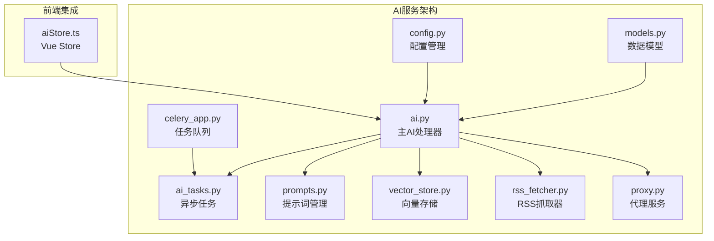

**图表来源**
- [ai.py:1-1157](file://python-backend/app/handlers/ai.py#L1-L1157)
- [ai_tasks.py:1-87](file://python-backend/app/tasks/ai_tasks.py#L1-L87)
- [models.py:1-228](file://python-backend/app/models.py#L1-L228)

**章节来源**
- [ai.py:1-1157](file://python-backend/app/handlers/ai.py#L1-L1157)
- [models.py:1-228](file://python-backend/app/models.py#L1-L228)

## 核心组件

### 主要AI处理器
- **AI配置管理**：统一管理AI服务配置，支持用户级和全局配置
- **摘要生成**：基于结构化提示词生成JSON格式摘要
- **内容翻译**：支持标题和正文的多语言翻译
- **嵌入向量生成**：为文本内容生成向量表示
- **流式响应**：支持SSE流式传输AI生成内容

### 异步任务系统
- **批量质量评分**：Celery任务批量处理新文章的质量评分
- **向量化处理**：自动为新文章生成向量并存储到Milvus
- **每日简报生成**：定时生成用户的个性化简报

### 向量存储系统
- **Milvus集成**：支持本地Lite模式和远程服务器模式
- **相似度搜索**：基于余弦距离的向量相似度检索
- **自动索引**：IVF_FLAT索引类型，支持高效向量搜索

**章节来源**
- [ai.py:34-64](file://python-backend/app/handlers/ai.py#L34-L64)
- [ai_tasks.py:16-51](file://python-backend/app/tasks/ai_tasks.py#L16-L51)
- [vector_store.py:18-197](file://python-backend/app/handlers/vector_store.py#L18-L197)

## 架构概览

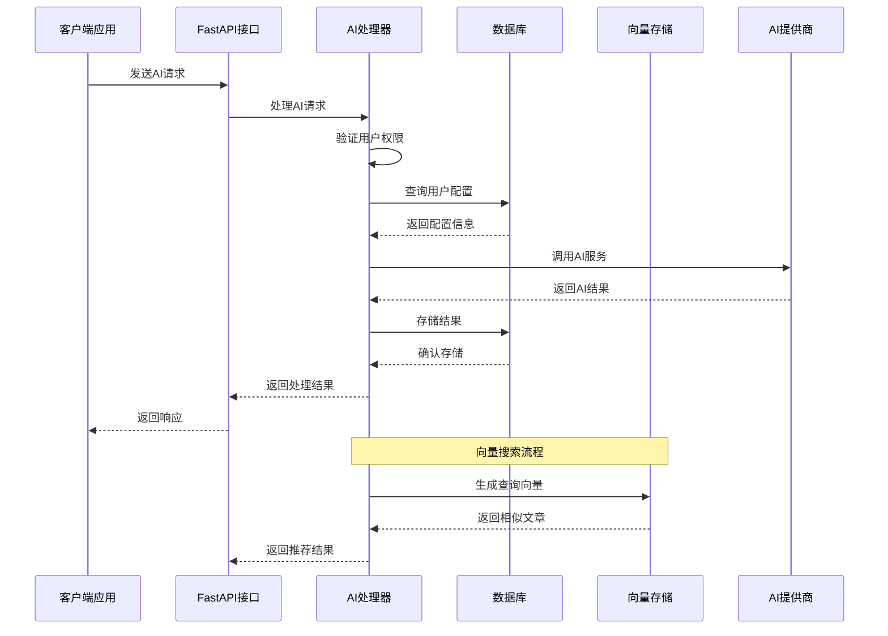

**图表来源**
- [ai.py:98-171](file://python-backend/app/handlers/ai.py#L98-L171)
- [vector_store.py:92-128](file://python-backend/app/handlers/vector_store.py#L92-L128)

## 详细组件分析

### AI配置管理系统

AI配置系统采用分层设计，支持全局配置和用户级配置的优先级覆盖：

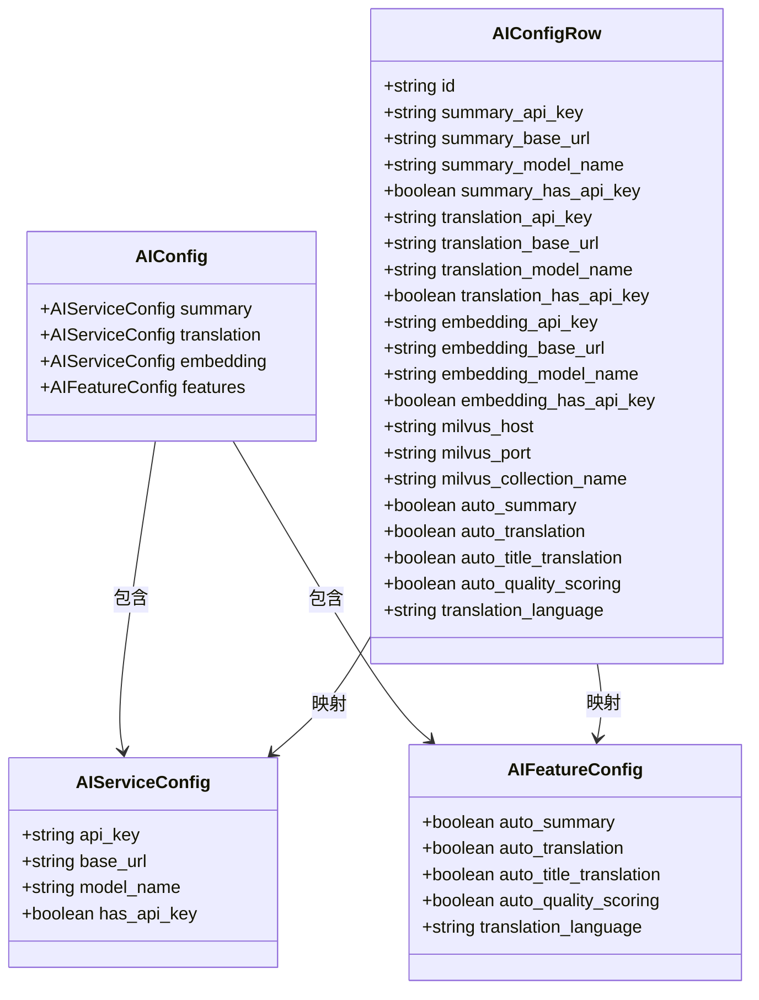

**图表来源**
- [ai.py:66-83](file://python-backend/app/handlers/ai.py#L66-L83)
- [models.py:98-124](file://python-backend/app/models.py#L98-L124)

### 摘要生成系统

摘要生成系统支持结构化输出，确保AI生成的内容符合预期格式：

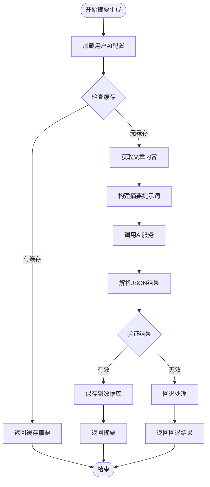

**图表来源**
- [ai.py:616-707](file://python-backend/app/handlers/ai.py#L616-L707)

### 翻译系统

翻译系统支持多种字段类型的翻译，包括标题和正文：

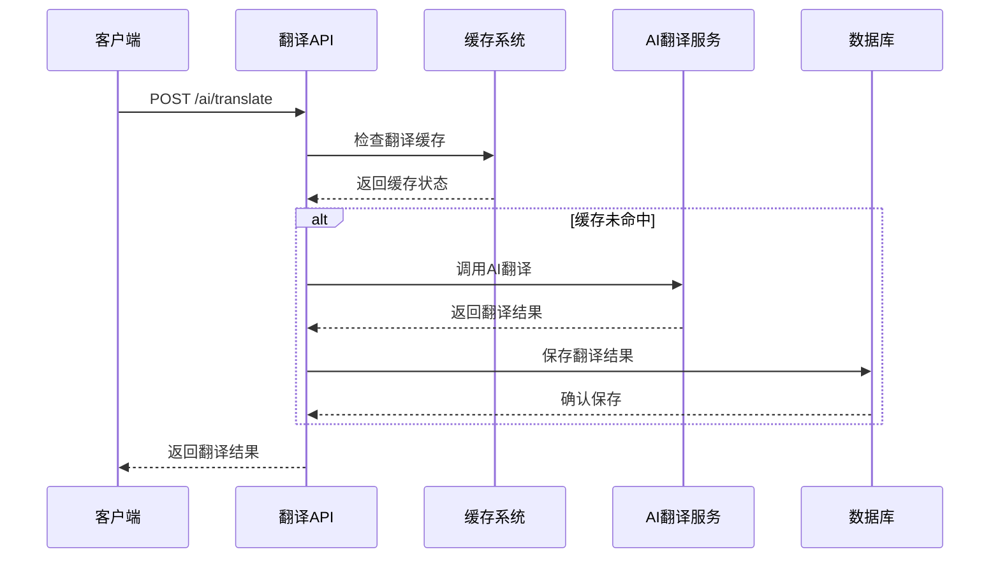

**图表来源**
- [ai.py:717-792](file://python-backend/app/handlers/ai.py#L717-L792)

**章节来源**
- [ai.py:616-792](file://python-backend/app/handlers/ai.py#L616-L792)

### 向量存储系统

向量存储系统基于Milvus实现，支持高效的相似度搜索：

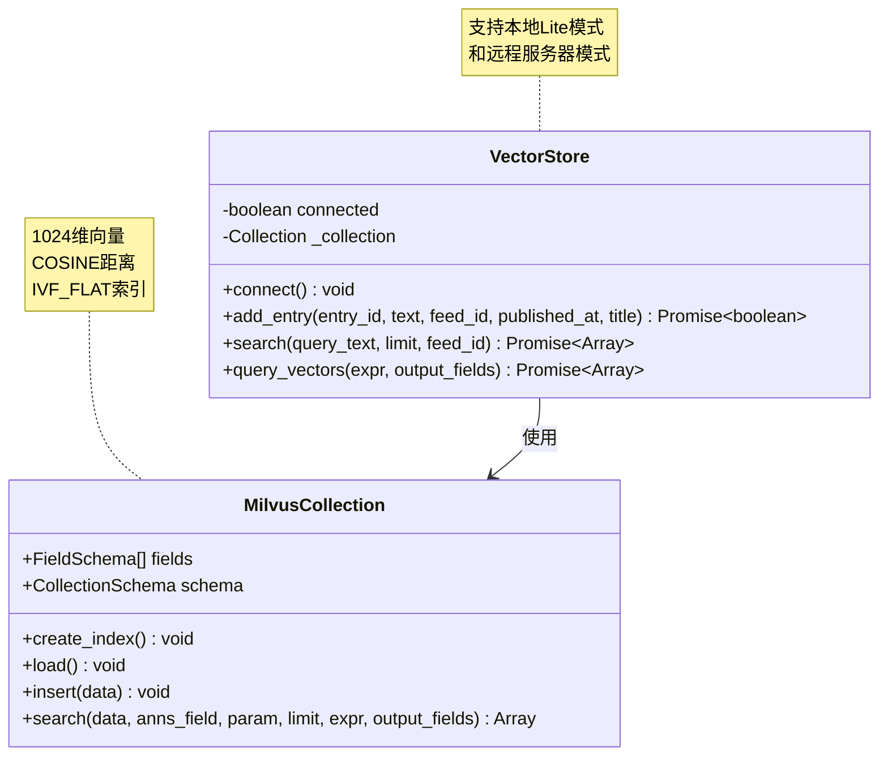

**图表来源**
- [vector_store.py:18-197](file://python-backend/app/handlers/vector_store.py#L18-L197)

**章节来源**
- [vector_store.py:18-197](file://python-backend/app/handlers/vector_store.py#L18-L197)

## AI服务配置

### 环境变量配置

系统支持通过环境变量和配置文件进行灵活配置：

| 配置项 | 类型 | 默认值 | 描述 |
|--------|------|--------|------|
| AURORA_AI_API_KEY | string | "" | Aurora AI API密钥 |
| AURORA_AI_BASE_URL | string | "http://10.110.3.61:9997/v1" | AI服务基础URL |
| AURORA_AI_MODEL | string | "qwen3" | 默认模型名称 |
| AURORA_AI_EMBEDDING_MODEL | string | "Qwen3-Embedding-0.6B" | 嵌入模型名称 |
| MILVUS_HOST | string | "10.110.3.25" | Milvus主机地址 |
| MILVUS_PORT | string | "19530" | Milvus端口号 |
| REDIS_URL | string | "redis://localhost:6379/0" | Redis连接URL |

### 配置优先级

配置系统遵循以下优先级顺序：
1. **用户级配置**：每个用户的独立配置
2. **管理员配置**：全局默认配置
3. **环境变量**：系统环境变量
4. **硬编码默认值**：代码中的默认值

**章节来源**
- [config.py:41-75](file://python-backend/app/config.py#L41-L75)
- [ai.py:24-33](file://python-backend/app/handlers/ai.py#L24-L33)

## 提示词管理

### 用户自定义提示词

系统允许用户创建和管理自定义提示词模板：

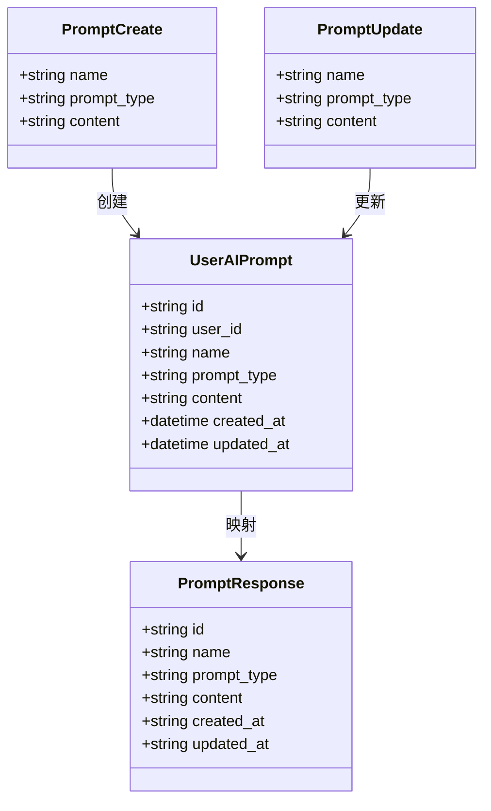

**图表来源**
- [prompts.py:19-35](file://python-backend/app/handlers/prompts.py#L19-L35)
- [models.py:197-205](file://python-backend/app/models.py#L197-L205)

### 提示词类型

系统支持多种提示词类型：
- **摘要生成**：`summary`
- **内容翻译**：`translate`
- **深度分析**：`deep_dive`
- **每日简报**：`daily_digest`

**章节来源**
- [prompts.py:19-131](file://python-backend/app/handlers/prompts.py#L19-L131)

## 代理设置

### HTTP代理服务

系统提供HTTP代理服务，支持robots.txt检查和缓存：

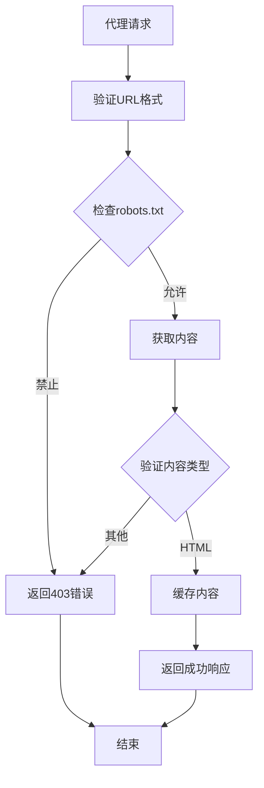

**图表来源**
- [proxy.py:93-138](file://python-backend/app/handlers/proxy.py#L93-L138)

### 代理配置选项

| 参数 | 类型 | 默认值 | 描述 |
|------|------|--------|------|
| url | string | 必需 | 目标URL |
| ua | string | Mozilla/5.0... | User-Agent |
| lang | string | "en-US,en;q=0.9" | Accept-Language |
| referer | string | null | Referer头 |
| cookie | string | null | Cookie头 |
| force | boolean | false | 强制刷新缓存 |
| respect_robots | boolean | true | 是否遵守robots.txt |

**章节来源**
- [proxy.py:93-138](file://python-backend/app/handlers/proxy.py#L93-L138)

## API调用流程

### 核心API端点

系统提供以下主要API端点：

#### AI配置管理
- `GET /ai/config` - 获取全局AI配置
- `PATCH /ai/config` - 更新全局AI配置
- `GET /ai/user/config` - 获取用户AI配置
- `PUT /ai/user/config` - 更新用户AI配置

#### 内容处理
- `POST /ai/summary` - 生成文章摘要
- `POST /ai/translate` - 翻译文章内容
- `POST /ai/translate-title` - 翻译文章标题
- `POST /ai/embedding` - 生成文本嵌入向量

#### 高级分析
- `POST /ai/synthesis` - 综合分析多个文章
- `POST /ai/daily-digest` - 生成每日简报
- `POST /ai/deep-dive` - 深度分析单篇文章
- `POST /ai/test` - 测试AI连接

#### 向量搜索
- `POST /ai/search` - 基于向量的相似度搜索
- `POST /ai/recommend` - 推荐相似文章

**章节来源**
- [ai.py:373-1157](file://python-backend/app/handlers/ai.py#L373-L1157)

## 不同AI提供商集成

### 当前支持的AI提供商

系统当前配置指向Aurora AI服务，但具有良好的扩展性：

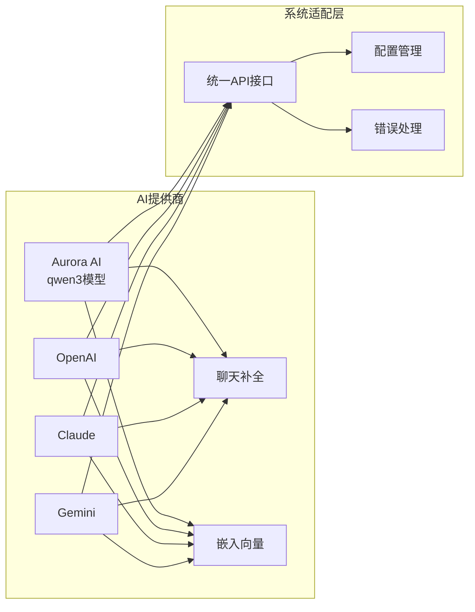

### 集成步骤

1. **配置AI提供商信息**
   - 设置API密钥
   - 配置基础URL
   - 指定模型名称

2. **适配API端点**
   - 聊天补全端点：`/chat/completions`
   - 嵌入向量端点：`/embeddings`

3. **处理响应格式**
   - 统一JSON响应格式
   - 错误码映射

4. **性能优化**
   - 连接池管理
   - 超时设置
   - 重试机制

**章节来源**
- [ai.py:34-64](file://python-backend/app/handlers/ai.py#L34-L64)

## 成本控制和性能优化

### 成本控制策略

#### 使用限制
- **免费用户限制**：必须配置自己的API密钥
- **Plus用户限制**：暂解除每日调用限制
- **Pro用户限制**：完全解锁所有功能

#### 令牌限制
- **内容截断**：自动截断过长内容
- **批量处理**：支持批量操作减少API调用次数
- **缓存机制**：重复内容使用缓存

### 性能优化

#### 缓存策略
- **摘要缓存**：已生成的摘要持久化存储
- **翻译缓存**：翻译结果按字段和语言缓存
- **向量缓存**：向量搜索结果缓存

#### 异步处理
- **Celery任务**：批量质量评分和向量化
- **流式响应**：SSE流式传输AI生成内容
- **并发请求**：异步HTTP客户端

#### 资源管理
- **连接池**：HTTP客户端连接复用
- **内存管理**：及时释放临时资源
- **超时控制**：合理的请求超时设置

**章节来源**
- [ai.py:154-171](file://python-backend/app/handlers/ai.py#L154-L171)
- [ai_tasks.py:16-51](file://python-backend/app/tasks/ai_tasks.py#L16-L51)

## 调用示例和参数说明

### AI配置管理

#### 获取AI配置
**请求**
```
GET /ai/config
Authorization: Bearer {user_token}
```

**响应**
```json
{
  "summary": {
    "api_key": "your_api_key",
    "base_url": "https://api.example.com/v1",
    "model_name": "gpt-4",
    "has_api_key": true
  },
  "translation": {
    "api_key": "your_api_key",
    "base_url": "https://api.example.com/v1",
    "model_name": "gpt-4",
    "has_api_key": true
  },
  "embedding": {
    "api_key": "your_api_key",
    "base_url": "https://api.example.com/v1",
    "model_name": "text-embedding-ada-002",
    "has_api_key": true
  },
  "features": {
    "auto_summary": false,
    "auto_translation": false,
    "auto_title_translation": false,
    "auto_quality_scoring": true,
    "translation_language": "zh"
  },
  "vector": {
    "milvus_host": "localhost",
    "milvus_port": "19530",
    "milvus_collection_name": "rss_entries"
  }
}
```

#### 更新AI配置
**请求**
```
PATCH /ai/config
Authorization: Bearer {admin_token}
Content-Type: application/json

{
  "summary": {
    "api_key": "new_api_key",
    "base_url": "https://new-api.example.com/v1",
    "model_name": "gpt-4-turbo"
  },
  "features": {
    "auto_summary": true,
    "auto_quality_scoring": true
  }
}
```

**响应**
```json
{
  "success": true,
  "config": {
    "summary": {
      "api_key": "new_api_key",
      "base_url": "https://new-api.example.com/v1",
      "model_name": "gpt-4-turbo",
      "has_api_key": true
    }
  }
}
```

### 摘要生成功能

#### 生成文章摘要
**请求**
```
POST /ai/summary
Authorization: Bearer {user_token}
Content-Type: application/json

{
  "entry_id": "article_id",
  "language": "zh"
}
```

**响应**
```json
{
  "entry_id": "article_id",
  "language": "zh",
  "summary": "文章摘要内容",
  "key_points": [
    "关键信息1",
    "关键信息2",
    "关键信息3"
  ]
}
```

### 翻译功能

#### 翻译文章内容
**请求**
```
POST /ai/translate
Authorization: Bearer {user_token}
Content-Type: application/json

{
  "entry_id": "article_id",
  "field_type": "content",
  "target_language": "en"
}
```

**响应**
```json
{
  "entry_id": "article_id",
  "field_type": "content",
  "target_language": "en",
  "translated_text": "Translated content"
}
```

### 嵌入向量生成

#### 生成文本嵌入
**请求**
```
POST /ai/embedding
Authorization: Bearer {user_token}
Content-Type: application/json

{
  "text": "输入文本内容"
}
```

**响应**
```json
{
  "text": "输入文本内容",
  "embedding": [0.1, 0.2, 0.3, ...],
  "model": "text-embedding-ada-002",
  "success": true
}
```

### 向量搜索

#### 基于向量的相似度搜索
**请求**
```
POST /ai/search
Authorization: Bearer {user_token}
Content-Type: application/json

{
  "query_text": "搜索关键词",
  "limit": 10,
  "feed_id": "feed_id"
}
```

**响应**
```json
[
  {
    "id": 1,
    "score": 0.95,
    "title": "相关文章标题",
    "published_at": "2024-01-01T00:00:00Z",
    "feed_id": "feed_id",
    "entry_id": "article_id"
  }
]
```

### 流式响应

#### 生成每日简报（流式）
**请求**
```
POST /ai/daily-digest
Authorization: Bearer {user_token}
Content-Type: application/json

{
  "entry_ids": ["id1", "id2", "id3"]
}
```

**响应**（SSE流）
```
data: {"type": "references", "data": [...]}
data: {"type": "chunk", "content": "生成的简报内容片段"}
data: {"type": "done"}
```

**章节来源**
- [ai.py:851-1157](file://python-backend/app/handlers/ai.py#L851-L1157)

## 错误处理和重试机制

### 错误处理策略

系统实现了多层次的错误处理机制：

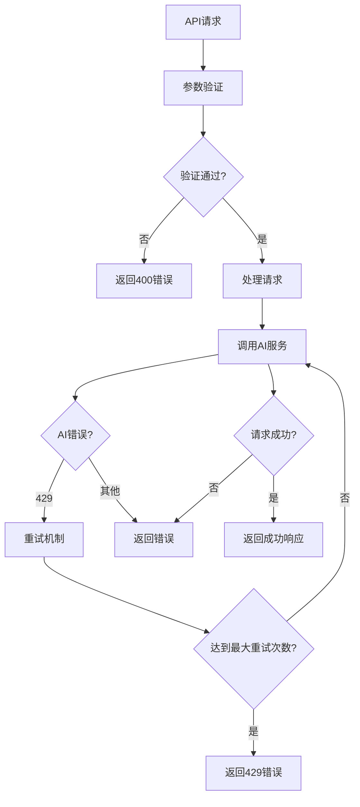

### 重试机制

系统实现了指数退避的重试策略：

| 错误类型 | 重试次数 | 延迟时间 | 说明 |
|----------|----------|----------|------|
| 429速率限制 | 3次 | 1s, 2s, 4s | 指数退避 |
| 网络请求错误 | 3次 | 1s间隔 | 固定延迟 |
| AI服务不可用 | 3次 | 1s间隔 | 固定延迟 |

### 错误码说明

| 状态码 | 错误类型 | 描述 |
|--------|----------|------|
| 400 | 请求错误 | 参数验证失败 |
| 401 | 未授权 | 未登录或Token无效 |
| 403 | 禁止访问 | 权限不足或免费用户限制 |
| 404 | 资源不存在 | 文章或用户不存在 |
| 429 | 速率限制 | 超过API调用限制 |
| 500 | 服务器错误 | AI服务内部错误 |
| 502 | 网关错误 | 网络请求失败 |

**章节来源**
- [ai.py:195-228](file://python-backend/app/handlers/ai.py#L195-L228)

## 监控策略

### 性能监控

系统提供了多种监控指标：

#### AI调用统计
- **每日调用次数**：记录用户每日AI调用次数
- **响应时间**：记录AI服务响应时间
- **成功率**：计算AI调用成功率

#### 资源使用监控
- **内存使用**：监控向量存储内存使用
- **CPU使用**：监控AI处理CPU占用
- **网络带宽**：监控API请求流量

### 日志记录

系统实现了分级的日志记录：

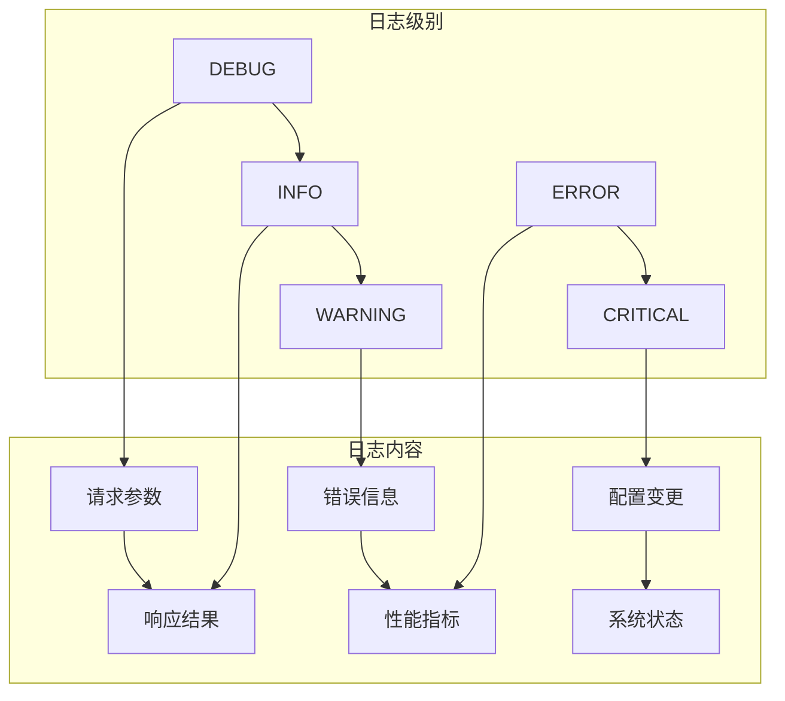

### 健康检查

系统提供了健康检查端点：
- `GET /health` - 检查服务健康状态
- `GET /metrics` - 获取性能指标
- `GET /ai/test` - 测试AI连接

**章节来源**
- [ai.py:598-615](file://python-backend/app/handlers/ai.py#L598-L615)

## 故障排除指南

### 常见问题诊断

#### AI服务连接问题
1. **检查API密钥**
   - 确认API密钥有效且未过期
   - 验证API密钥权限范围

2. **验证网络连接**
   - 检查基础URL可达性
   - 确认防火墙设置

3. **查看日志**
   - 检查AI服务错误日志
   - 分析请求响应详情

#### 向量存储问题
1. **Milvus连接**
   - 检查Milvus服务状态
   - 验证连接参数配置

2. **索引问题**
   - 重建向量索引
   - 清理损坏的数据

3. **内存问题**
   - 监控内存使用情况
   - 调整向量维度

#### 性能问题
1. **API调用限制**
   - 检查速率限制配置
   - 实现请求节流

2. **缓存失效**
   - 清理过期缓存
   - 调整缓存策略

3. **数据库性能**
   - 优化查询索引
   - 监控慢查询

### 调试工具

#### 前端调试
- **Vue DevTools**：检查AI状态管理
- **浏览器网络面板**：监控API请求
- **控制台日志**：查看错误信息

#### 后端调试
- **FastAPI文档**：测试API端点
- **数据库查询**：检查数据状态
- **Celery监控**：查看任务队列

**章节来源**
- [aiStore.ts:102-135](file://rss-desktop/src/stores/aiStore.ts#L102-L135)

## 结论

Tan RSS Reader的AI服务API提供了一个完整的人工智能解决方案，集成了摘要生成、内容翻译、质量评分、智能推荐等多种功能。系统采用模块化设计，支持灵活的配置管理和扩展，具备完善的错误处理和性能优化机制。

### 主要优势

1. **功能完整性**：覆盖AI服务的主要应用场景
2. **配置灵活性**：支持多层级配置管理
3. **性能优化**：异步处理和缓存机制
4. **可扩展性**：良好的架构设计支持新功能添加
5. **监控完善**：全面的性能监控和错误处理

### 未来发展建议

1. **多AI提供商支持**：增加更多AI服务提供商选择
2. **模型微调**：支持用户自定义模型微调
3. **增强搜索**：改进向量搜索算法和精度
4. **成本优化**：实现更精细的成本控制机制
5. **用户体验**：优化前端交互和反馈机制

该AI服务API为Tan RSS Reader提供了强大的智能化能力，能够显著提升用户的阅读体验和信息获取效率。