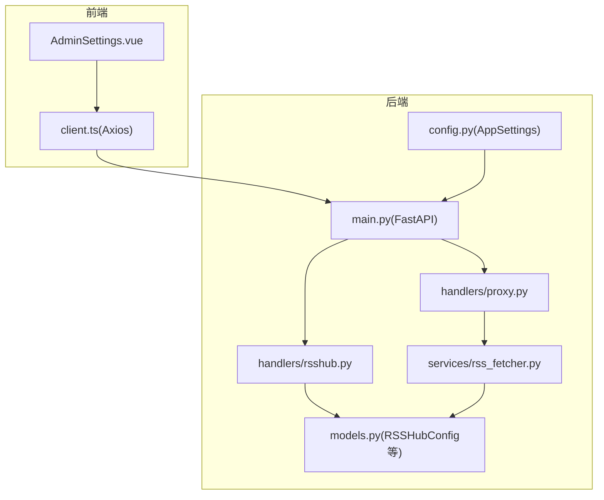
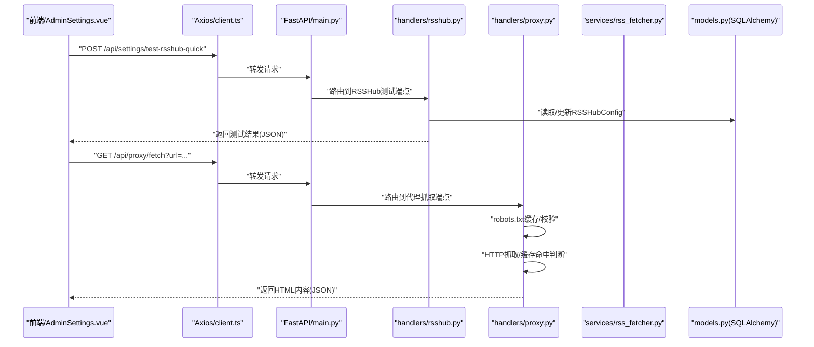
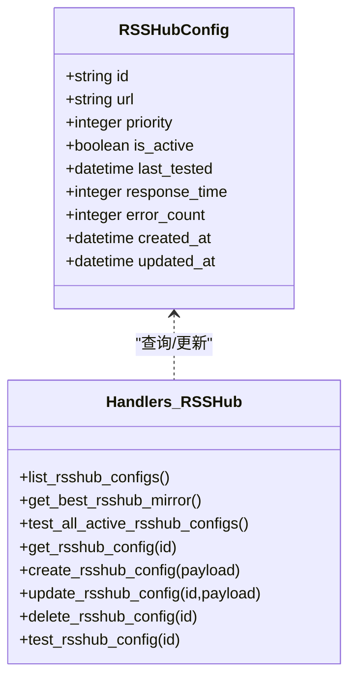
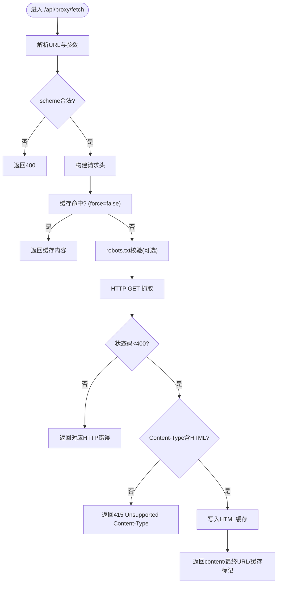
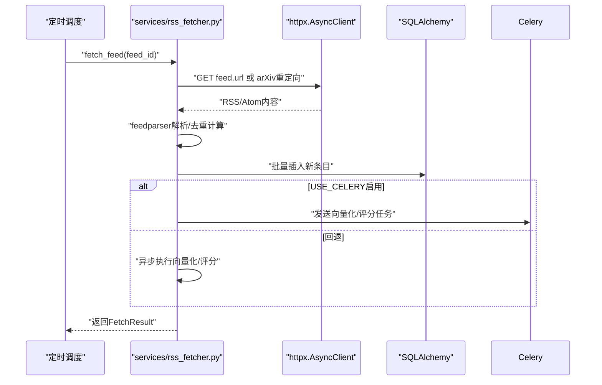
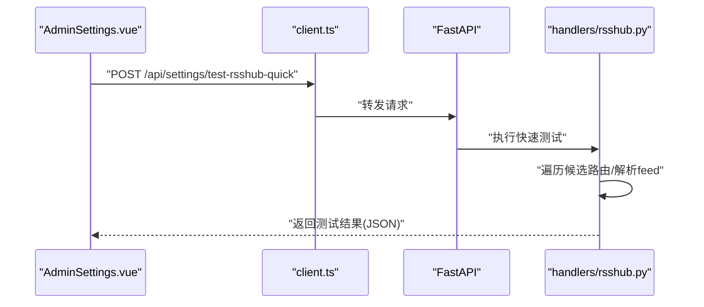
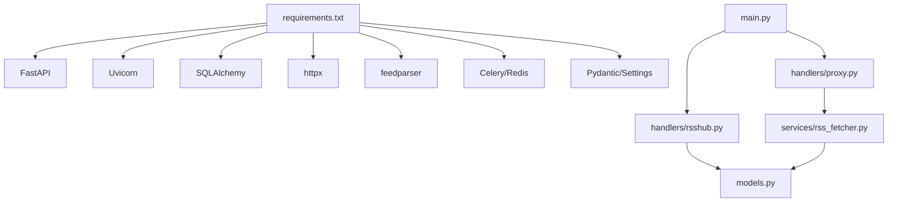

# RSSHub代理API

<cite>
**本文引用的文件**
- [python-backend/app/main.py](file://python-backend/app/main.py)
- [python-backend/app/config.py](file://python-backend/app/config.py)
- [python-backend/app/handlers/rsshub.py](file://python-backend/app/handlers/rsshub.py)
- [python-backend/app/handlers/proxy.py](file://python-backend/app/handlers/proxy.py)
- [python-backend/app/services/rss_fetcher.py](file://python-backend/app/services/rss_fetcher.py)
- [python-backend/app/models.py](file://python-backend/app/models.py)
- [python-backend/requirements.txt](file://python-backend/requirements.txt)
- [rss-desktop/src/api/client.ts](file://rss-desktop/src/api/client.ts)
- [rss-desktop/src/views/AdminSettings.vue](file://rss-desktop/src/views/AdminSettings.vue)
- [rss-desktop/src/stores/settingsStore.ts](file://rss-desktop/src/stores/settingsStore.ts)
</cite>

## 目录
1. [简介](#简介)
2. [项目结构](#项目结构)
3. [核心组件](#核心组件)
4. [架构总览](#架构总览)
5. [详细组件分析](#详细组件分析)
6. [依赖分析](#依赖分析)
7. [性能考虑](#性能考虑)
8. [故障排查指南](#故障排查指南)
9. [结论](#结论)
10. [附录](#附录)

## 简介
本文件面向Tan RSS Reader的RSSHub代理API，系统性梳理后端FastAPI服务如何集成RSSHub（镜像）节点、代理抓取、内容解析与去重、缓存与健康检测、以及前端配置与测试流程。文档覆盖以下主题：
- RSSHub节点管理：增删改查、优先级排序、健康检测与故障统计
- 代理路由：基于HTTP/HTTPS的网页抓取代理，支持robots.txt校验、缓存与内容类型限制
- 内容转换：RSS/Atom到内部条目的解析、去重键计算、质量评分与向量化
- 缓存管理：HTML内容缓存、robots.txt缓存
- 配置与测试：RSSHub URL配置、快速连通性测试
- 最佳实践与常见问题：代理服务器配置、负载均衡、故障转移与监控告警建议

## 项目结构
后端采用FastAPI + SQLAlchemy异步ORM，前端使用Electron+Vue，通过Axios发起REST请求。RSSHub相关能力集中在后端的rsshub与proxy处理器，RSS抓取与去重在rss_fetcher服务中实现。

图表来源
- [python-backend/app/main.py:1-103](file://python-backend/app/main.py#L1-L103)
- [python-backend/app/handlers/rsshub.py:1-264](file://python-backend/app/handlers/rsshub.py#L1-L264)
- [python-backend/app/handlers/proxy.py:1-138](file://python-backend/app/handlers/proxy.py#L1-L138)
- [python-backend/app/services/rss_fetcher.py:1-312](file://python-backend/app/services/rss_fetcher.py#L1-L312)
- [python-backend/app/config.py:1-75](file://python-backend/app/config.py#L1-L75)
- [python-backend/app/models.py:60-71](file://python-backend/app/models.py#L60-L71)

章节来源
- [python-backend/app/main.py:1-103](file://python-backend/app/main.py#L1-L103)
- [python-backend/app/config.py:1-75](file://python-backend/app/config.py#L1-L75)

## 核心组件
- RSSHub节点管理器：提供节点列表、最佳节点选择、批量健康检测、单节点测试、CRUD操作
- 代理抓取器：对任意HTTP/HTTPS页面进行抓取，支持robots.txt合规检查、缓存命中返回、内容类型校验
- RSS抓取与去重：解析RSS/Atom，计算去重键，入库并触发向量化与质量评分任务
- 配置中心：集中管理RSSHub默认URL、分页、刷新间隔等全局参数

章节来源
- [python-backend/app/handlers/rsshub.py:31-264](file://python-backend/app/handlers/rsshub.py#L31-L264)
- [python-backend/app/handlers/proxy.py:93-138](file://python-backend/app/handlers/proxy.py#L93-L138)
- [python-backend/app/services/rss_fetcher.py:104-312](file://python-backend/app/services/rss_fetcher.py#L104-L312)
- [python-backend/app/config.py:5-15](file://python-backend/app/config.py#L5-L15)

## 架构总览
下图展示RSSHub代理API的关键交互路径：前端通过Axios调用后端接口；后端路由到rsshub与proxy处理器；RSSHub节点状态由数据库模型维护；RSS抓取由rss_fetcher服务完成。

图表来源
- [python-backend/app/main.py:44-62](file://python-backend/app/main.py#L44-L62)
- [python-backend/app/handlers/rsshub.py:224-264](file://python-backend/app/handlers/rsshub.py#L224-L264)
- [python-backend/app/handlers/proxy.py:93-138](file://python-backend/app/handlers/proxy.py#L93-L138)
- [rss-desktop/src/views/AdminSettings.vue:158-235](file://rss-desktop/src/views/AdminSettings.vue#L158-L235)
- [rss-desktop/src/api/client.ts:1-29](file://rss-desktop/src/api/client.ts#L1-L29)

## 详细组件分析

### 组件A：RSSHub节点管理
- 节点模型：RSSHubConfig包含唯一URL、优先级、激活状态、最近测试时间、响应时间、错误计数等字段
- 端点概览
  - 列表与最佳节点：按激活状态与优先级排序，返回最佳节点
  - 批量健康检测：对所有激活节点访问/api/health，更新响应时间与错误计数
  - 单节点测试：对指定ID节点执行健康检查
  - CRUD：创建、更新（可选字段）、删除
- 关键逻辑
  - URL唯一性约束，避免重复
  - 健康检测失败时递增错误计数，成功时清零
  - 最佳节点选择综合考虑优先级与最近测试时间

图表来源
- [python-backend/app/models.py:60-71](file://python-backend/app/models.py#L60-L71)
- [python-backend/app/handlers/rsshub.py:31-223](file://python-backend/app/handlers/rsshub.py#L31-L223)

章节来源
- [python-backend/app/handlers/rsshub.py:31-223](file://python-backend/app/handlers/rsshub.py#L31-L223)
- [python-backend/app/models.py:60-71](file://python-backend/app/models.py#L60-L71)

### 组件B：代理抓取与内容过滤
- 端点：GET /api/proxy/fetch
- 参数：url、User-Agent、Accept-Language、Referer、Cookie、force（强制绕过缓存）、respect_robots（是否遵循robots.txt）
- 行为
  - scheme校验仅允许http/https
  - robots.txt缓存与校验，默认24小时TTL
  - HTML缓存，默认6小时TTL；force=true时强制刷新
  - 内容类型限制：仅接受text/html或application/xhtml+xml
  - 异常处理：网络错误返回502，HTTP错误返回对应状态码，不支持的Content-Type返回415
- 返回：content、final_url、from_cache、fetched_at

图表来源
- [python-backend/app/handlers/proxy.py:93-138](file://python-backend/app/handlers/proxy.py#L93-L138)

章节来源
- [python-backend/app/handlers/proxy.py:93-138](file://python-backend/app/handlers/proxy.py#L93-L138)

### 组件C：RSS抓取、去重与内容转换
- 端点：GET /api/feeds/{id}/fetch（由RSS抓取调度触发，非直接对外暴露）
- 关键流程
  - 解析RSS/Atom，统计总数与新条目数
  - 去重策略：URL标准化、去重键计算（URL+标题+MD5(content片段前缀)），批次内与全局重复均跳过
  - 字段提取：标题、作者、摘要/内容、发布时间（UTC）、阅读时长估算
  - 入库：新建条目并记录去重键
  - 后台任务：向量化与质量评分（可选），支持Celery或回退到asyncio
  - 错误处理：网络错误、HTTP错误、解析错误均记录并更新Feed状态
- 性能要点
  - 批次内去重集合减少重复查询
  - 文档截断与词数估算控制向量化文本长度
  - 可配置USE_CELERY开关决定任务执行方式

图表来源
- [python-backend/app/services/rss_fetcher.py:104-312](file://python-backend/app/services/rss_fetcher.py#L104-L312)

章节来源
- [python-backend/app/services/rss_fetcher.py:104-312](file://python-backend/app/services/rss_fetcher.py#L104-L312)

### 组件D：RSSHub集成与配置
- 默认RSSHub URL：来自AppSettings.rsshub_url，默认值为“https://rsshub.app”
- 快速连通性测试：/api/settings/test-rsshub-quick，尝试多个候选路由，解析feed获取条目数量与标题
- 前端集成
  - AdminSettings.vue提供RSSHub URL输入与测试按钮
  - 通过client.ts的Axios实例访问后端API
  - settingsStore同步rsshub_url到本地状态

图表来源
- [python-backend/app/handlers/rsshub.py:224-264](file://python-backend/app/handlers/rsshub.py#L224-L264)
- [rss-desktop/src/views/AdminSettings.vue:158-235](file://rss-desktop/src/views/AdminSettings.vue#L158-L235)
- [rss-desktop/src/api/client.ts:1-29](file://rss-desktop/src/api/client.ts#L1-L29)
- [python-backend/app/config.py](file://python-backend/app/config.py#L14)

章节来源
- [python-backend/app/config.py](file://python-backend/app/config.py#L14)
- [python-backend/app/handlers/rsshub.py:224-264](file://python-backend/app/handlers/rsshub.py#L224-L264)
- [rss-desktop/src/views/AdminSettings.vue:158-235](file://rss-desktop/src/views/AdminSettings.vue#L158-L235)
- [rss-desktop/src/api/client.ts:1-29](file://rss-desktop/src/api/client.ts#L1-L29)

## 依赖分析
- 运行时依赖：FastAPI、Uvicorn、SQLAlchemy、httpx、feedparser、Celery/Redis、Pydantic/Settings等
- 模块耦合
  - main.py集中注册路由，rsshub与proxy处理器分别承担节点管理与代理抓取职责
  - rss_fetcher服务被调度调用，与AI向量化/评分模块解耦
  - robots.txt与HTML缓存通过全局字典与锁实现简单并发安全

图表来源
- [python-backend/requirements.txt:1-18](file://python-backend/requirements.txt#L1-L18)
- [python-backend/app/main.py:1-103](file://python-backend/app/main.py#L1-L103)
- [python-backend/app/handlers/rsshub.py:1-264](file://python-backend/app/handlers/rsshub.py#L1-L264)
- [python-backend/app/handlers/proxy.py:1-138](file://python-backend/app/handlers/proxy.py#L1-L138)
- [python-backend/app/services/rss_fetcher.py:1-312](file://python-backend/app/services/rss_fetcher.py#L1-L312)
- [python-backend/app/models.py:60-71](file://python-backend/app/models.py#L60-L71)

章节来源
- [python-backend/requirements.txt:1-18](file://python-backend/requirements.txt#L1-L18)
- [python-backend/app/main.py:1-103](file://python-backend/app/main.py#L1-L103)

## 性能考虑
- 代理抓取
  - HTML缓存6小时，显著降低重复抓取开销
  - robots.txt缓存24小时，减少远程解析成本
  - 异步HTTP客户端与跟随重定向提升稳定性
- RSS抓取
  - 批次内去重集合降低数据库查询次数
  - 文本截断与词数估算控制向量化输入规模
  - 可选Celery异步化AI任务，避免阻塞主流程
- 数据库
  - RSSHubConfig索引字段（优先级、激活状态、最近测试时间）支持高效排序与筛选

## 故障排查指南
- 代理抓取
  - 400：URL scheme非法
  - 403：robots.txt禁止访问
  - 415：Content-Type非HTML
  - 502：上游网络异常
  - 排查：确认目标站点robots规则、内容类型、网络连通性
- RSSHub节点
  - 健康检测失败：检查节点URL可达性、/api/health可用性、错误计数递增
  - 最佳节点为空：确认至少存在一个激活节点
- RSS抓取
  - 网络错误/HTTP错误：检查Feed URL、重定向、超时设置
  - 解析错误：确认RSS/Atom格式、bozo标志
  - 去重过多：检查去重键生成逻辑与历史数据
- 前端测试
  - 快速测试失败：确认RSSHub URL、网络连通、候选路由可用性

章节来源
- [python-backend/app/handlers/proxy.py:103-138](file://python-backend/app/handlers/proxy.py#L103-L138)
- [python-backend/app/handlers/rsshub.py:68-103](file://python-backend/app/handlers/rsshub.py#L68-L103)
- [python-backend/app/services/rss_fetcher.py:126-144](file://python-backend/app/services/rss_fetcher.py#L126-L144)

## 结论
RSSHub代理API通过清晰的路由分层与模块化设计，实现了RSSHub节点的全生命周期管理、网页代理抓取与内容解析去重。结合缓存与异步任务，系统在保证可靠性的同时兼顾性能。建议在生产环境中配合负载均衡与故障转移策略，并建立监控告警体系以保障高可用。

## 附录

### API定义与使用示例
- 获取RSSHub节点列表
  - 方法：GET /api/rsshub/configs
  - 返回：success + configs数组（包含id、url、priority、is_active、last_tested、response_time、error_count、created_at、updated_at）
- 获取最佳RSSHub节点
  - 方法：GET /api/rsshub/configs/best
  - 返回：success + config对象或success:false
- 批量测试活跃节点
  - 方法：POST /api/rsshub/configs/test-active
  - 返回：results数组（包含每个节点的测试结果）
- 获取单个RSSHub节点
  - 方法：GET /api/rsshub/configs/{id}
  - 返回：节点详情
- 创建RSSHub节点
  - 方法：POST /api/rsshub/configs
  - 请求体：{ url, priority }
  - 返回：success + 新建config
- 更新RSSHub节点
  - 方法：PUT/PATCH /api/rsshub/configs/{id}
  - 请求体：{ url, priority, is_active }（可选字段）
  - 返回：success
- 删除RSSHub节点
  - 方法：DELETE /api/rsshub/configs/{id}
  - 返回：success
- 单节点健康测试
  - 方法：POST /api/rsshub/configs/{id}/test
  - 返回：success + config + test_url
- 快速连通性测试（前端常用）
  - 方法：POST /api/settings/test-rsshub-quick
  - 返回：success + message + rsshub_url + tested_at + test_url + response_time + entries_count + feed_title
- 代理抓取HTML
  - 方法：GET /api/proxy/fetch
  - 查询参数：url、ua、lang、referer、cookie、force、respect_robots
  - 返回：content、final_url、from_cache、fetched_at

章节来源
- [python-backend/app/handlers/rsshub.py:31-264](file://python-backend/app/handlers/rsshub.py#L31-L264)
- [python-backend/app/handlers/proxy.py:93-138](file://python-backend/app/handlers/proxy.py#L93-L138)

### 代理服务器配置与运维建议
- 负载均衡
  - 将多个RSSHub节点配置为镜像源，按优先级与最近测试时间轮询或加权选择
- 故障转移
  - 当前节点健康检测失败时自动切换至下一个激活节点
- 监控告警
  - 定期执行批量健康检测，关注错误计数与响应时间
  - 对代理抓取端点增加延迟与错误率监控
- 日志与追踪
  - 记录每次RSSHub测试与代理抓取的请求ID与最终URL，便于问题定位

### 最佳实践
- RSSHub节点管理
  - 为不同地域部署多节点，设置合理优先级
  - 定期清理不可用节点，保持error_count与last_tested准确
- 代理抓取
  - 默认开启respect_robots，尊重robots.txt
  - 对热点页面启用缓存，减少带宽与延迟
- 内容过滤
  - 使用去重键策略避免重复入库
  - 对长内容进行截断，平衡质量与性能
- 配置与测试
  - 前端提供一键测试，便于管理员验证RSSHub连通性
  - 将RSSHub URL纳入系统设置，支持动态更新