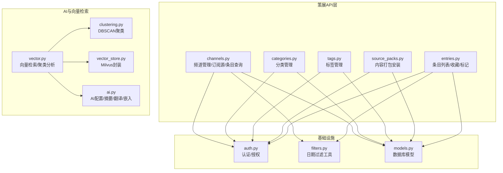
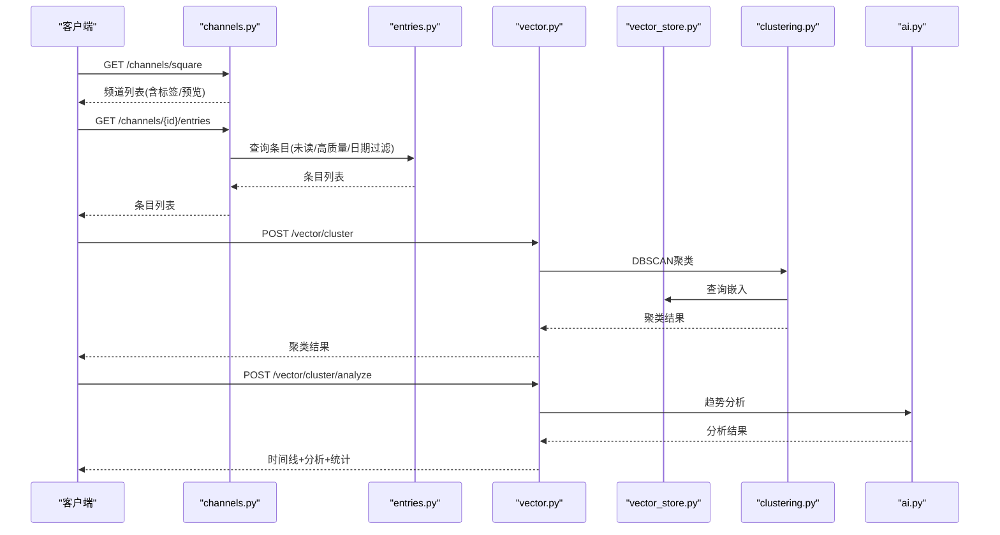
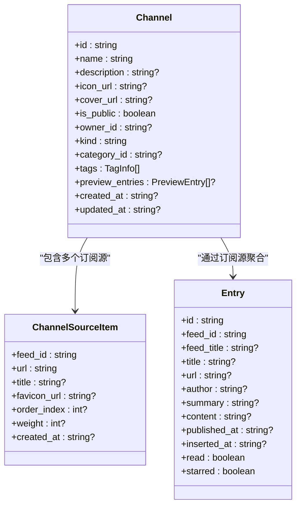
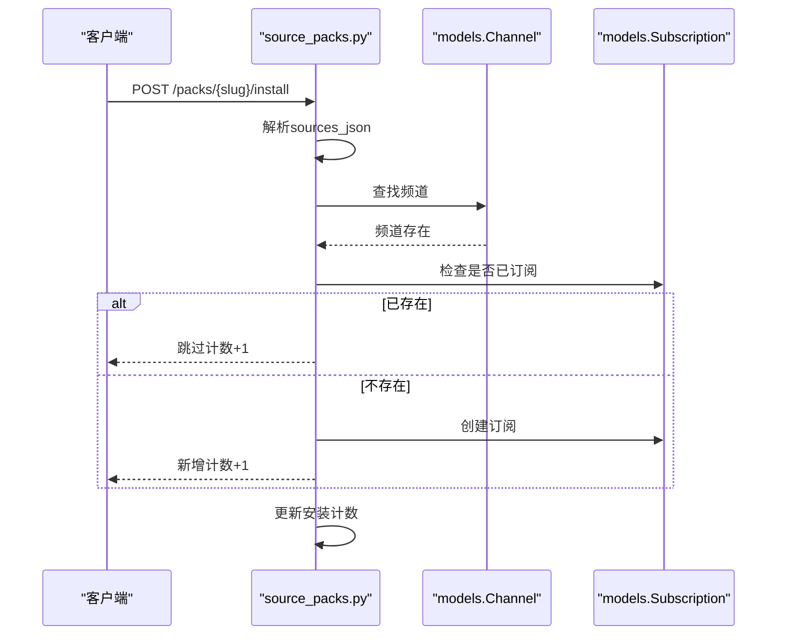
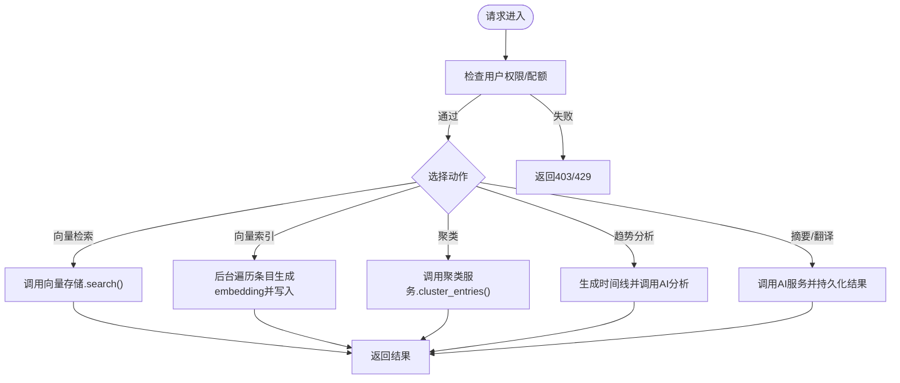
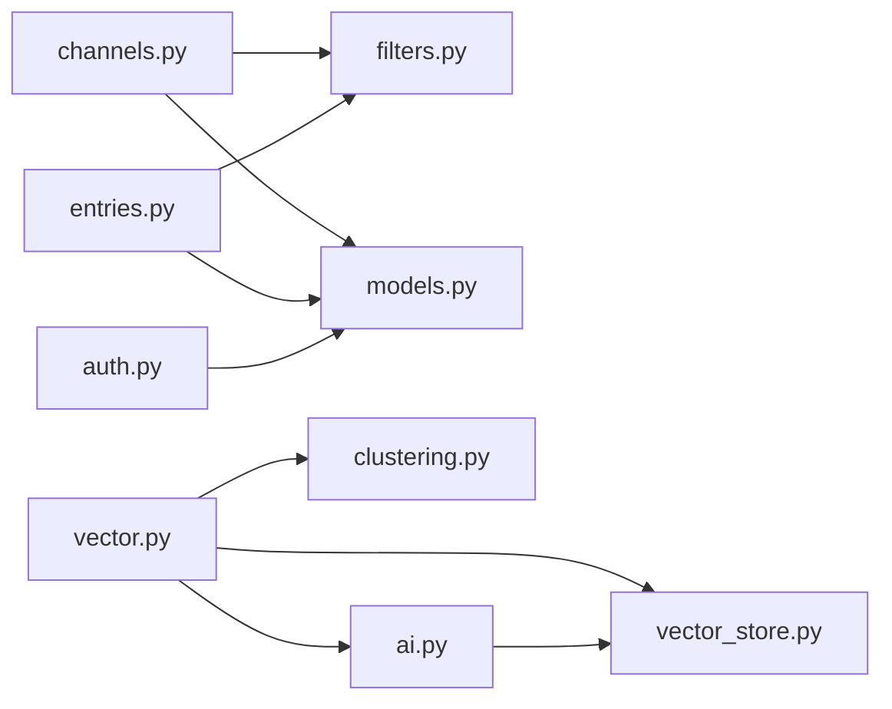

# 内容策展API

<cite>
**本文引用的文件**
- [channels.py](file://python-backend/app/handlers/channels.py)
- [categories.py](file://python-backend/app/handlers/categories.py)
- [tags.py](file://python-backend/app/handlers/tags.py)
- [source_packs.py](file://python-backend/app/handlers/source_packs.py)
- [entries.py](file://python-backend/app/handlers/entries.py)
- [models.py](file://python-backend/app/models.py)
- [filters.py](file://python-backend/app/utils/filters.py)
- [clustering.py](file://python-backend/app/handlers/clustering.py)
- [vector.py](file://python-backend/app/handlers/vector.py)
- [vector_store.py](file://python-backend/app/handlers/vector_store.py)
- [ai.py](file://python-backend/app/handlers/ai.py)
- [auth.py](file://python-backend/app/handlers/auth.py)
</cite>

## 目录
1. [简介](#简介)
2. [项目结构](#项目结构)
3. [核心组件](#核心组件)
4. [架构总览](#架构总览)
5. [详细组件分析](#详细组件分析)
6. [依赖分析](#依赖分析)
7. [性能考虑](#性能考虑)
8. [故障排查指南](#故障排查指南)
9. [结论](#结论)
10. [附录](#附录)

## 简介
本文件面向Tan RSS Reader的内容策展API，系统性梳理频道管理、分类体系、标签体系与内容打包（Source Pack）等策展相关能力；同时阐述内容组织方式、策展规则、推荐与聚类算法、个性化设置、权限控制、内容审核与质量评估机制，并提供端到端的API调用示例、参数说明与响应格式，帮助开发者快速集成与扩展。

## 项目结构
后端采用FastAPI + SQLAlchemy异步ORM + Milvus向量检索的架构。策展相关API集中在handlers目录下的channels、categories、tags、source_packs、entries等模块；数据模型在models中定义；通用过滤器在utils中；AI与向量检索在ai、vector、vector_store、clustering中实现；认证在auth中实现。

图表来源
- [channels.py:1-502](file://python-backend/app/handlers/channels.py#L1-L502)
- [categories.py:1-123](file://python-backend/app/handlers/categories.py#L1-L123)
- [tags.py:1-73](file://python-backend/app/handlers/tags.py#L1-L73)
- [source_packs.py:1-277](file://python-backend/app/handlers/source_packs.py#L1-L277)
- [entries.py:1-310](file://python-backend/app/handlers/entries.py#L1-L310)
- [models.py:1-228](file://python-backend/app/models.py#L1-L228)
- [filters.py:1-25](file://python-backend/app/utils/filters.py#L1-L25)
- [clustering.py:1-142](file://python-backend/app/handlers/clustering.py#L1-L142)
- [vector.py:1-158](file://python-backend/app/handlers/vector.py#L1-L158)
- [vector_store.py:1-197](file://python-backend/app/handlers/vector_store.py#L1-L197)
- [ai.py:1-800](file://python-backend/app/handlers/ai.py#L1-L800)
- [auth.py:1-174](file://python-backend/app/handlers/auth.py#L1-L174)

章节来源
- [channels.py:1-502](file://python-backend/app/handlers/channels.py#L1-L502)
- [categories.py:1-123](file://python-backend/app/handlers/categories.py#L1-L123)
- [tags.py:1-73](file://python-backend/app/handlers/tags.py#L1-L73)
- [source_packs.py:1-277](file://python-backend/app/handlers/source_packs.py#L1-L277)
- [entries.py:1-310](file://python-backend/app/handlers/entries.py#L1-L310)
- [models.py:1-228](file://python-backend/app/models.py#L1-L228)
- [filters.py:1-25](file://python-backend/app/utils/filters.py#L1-L25)
- [clustering.py:1-142](file://python-backend/app/handlers/clustering.py#L1-L142)
- [vector.py:1-158](file://python-backend/app/handlers/vector.py#L1-L158)
- [vector_store.py:1-197](file://python-backend/app/handlers/vector_store.py#L1-L197)
- [ai.py:1-800](file://python-backend/app/handlers/ai.py#L1-L800)
- [auth.py:1-174](file://python-backend/app/handlers/auth.py#L1-L174)

## 核心组件
- 频道管理（Channel）
  - 创建/更新/删除频道，支持公开/私有、所有者、分类、标签、预览条目等
  - 频道订阅源（ChannelSource）管理：添加/移除RSS源，权重与排序
  - 频道条目查询：未读、高质量、日期范围、排序等
- 分类系统（Category）
  - 公共分类列表与管理端维护，支持排序
- 标签体系（Tag）
  - 标签创建与删除，频道绑定标签
- 内容打包（SourcePack）
  - 打包创建、公开列表、按slug获取、安装到用户订阅
- 条目管理（Entry）
  - 列表、收藏、星标、已读/未读、批量操作
- AI与向量检索
  - 向量连接、索引、检索、聚类、趋势分析
  - AI摘要、翻译、嵌入调用与配额/权限控制
- 权限与认证
  - 用户注册/登录、Bearer Token鉴权、管理员校验、可选用户解析

章节来源
- [channels.py:101-502](file://python-backend/app/handlers/channels.py#L101-L502)
- [categories.py:33-123](file://python-backend/app/handlers/categories.py#L33-L123)
- [tags.py:27-73](file://python-backend/app/handlers/tags.py#L27-L73)
- [source_packs.py:41-277](file://python-backend/app/handlers/source_packs.py#L41-L277)
- [entries.py:41-310](file://python-backend/app/handlers/entries.py#L41-L310)
- [vector.py:38-158](file://python-backend/app/handlers/vector.py#L38-L158)
- [vector_store.py:18-197](file://python-backend/app/handlers/vector_store.py#L18-L197)
- [ai.py:34-504](file://python-backend/app/handlers/ai.py#L34-L504)
- [auth.py:91-174](file://python-backend/app/handlers/auth.py#L91-L174)

## 架构总览
策展API围绕“频道—订阅源—条目”三层组织，结合AI与向量检索实现高质量内容筛选与主题聚类，支撑个性化推荐与趋势分析。

图表来源
- [channels.py:101-502](file://python-backend/app/handlers/channels.py#L101-L502)
- [entries.py:41-310](file://python-backend/app/handlers/entries.py#L41-L310)
- [vector.py:43-106](file://python-backend/app/handlers/vector.py#L43-L106)
- [vector_store.py:18-197](file://python-backend/app/handlers/vector_store.py#L18-L197)
- [clustering.py:14-142](file://python-backend/app/handlers/clustering.py#L14-L142)
- [ai.py:279-311](file://python-backend/app/handlers/ai.py#L279-L311)

## 详细组件分析

### 频道管理（Channel）
- 端点
  - GET /channels/square：公共频道广场，支持关键词搜索、分页、按更新时间排序
  - GET /admin/channels：管理端列出频道，支持按公开状态过滤
  - POST /admin/channels：创建频道（可指定公开、所有者、分类、标签）
  - GET /admin/channels/{id}：获取频道详情（含标签）
  - PUT/PATCH /admin/channels/{id}：更新频道（支持标签全量替换）
  - DELETE /admin/channels/{id}：删除频道及关联订阅源
  - GET /admin/channels/{id}/sources：列出订阅源（含权重/顺序）
  - POST /admin/channels/{id}/sources：添加订阅源
  - DELETE /admin/channels/{id}/sources/{feed_id}：移除订阅源
  - GET /channels/{id}/entries：按频道聚合的条目列表（未读/高质量/日期/排序/分页）
- 关键规则
  - 权限：非管理员仅能操作自己的频道
  - 高质量条目：quality_score≥60或word_count≥100
  - 预览图：从条目正文/摘要提取首张图片
- 响应模型
  - Channel、ChannelSourceItem、Entry、TagInfo、PreviewEntry

图表来源
- [channels.py:38-100](file://python-backend/app/handlers/channels.py#L38-L100)
- [channels.py:160-178](file://python-backend/app/handlers/channels.py#L160-L178)
- [models.py:126-167](file://python-backend/app/models.py#L126-L167)

章节来源
- [channels.py:101-502](file://python-backend/app/handlers/channels.py#L101-L502)
- [models.py:126-167](file://python-backend/app/models.py#L126-L167)

### 分类系统（Category）
- 端点
  - GET /categories：公共分类列表（按sort_order与创建时间排序）
  - GET /admin/categories：管理端分类列表
  - POST /admin/categories：创建分类（名称、排序）
  - PATCH /admin/categories/{id}：更新分类
  - DELETE /admin/categories/{id}：删除分类
- 规则
  - 名称唯一；排序字段用于前端展示顺序

章节来源
- [categories.py:33-123](file://python-backend/app/handlers/categories.py#L33-L123)

### 标签体系（Tag）
- 端点
  - GET /admin/tags：列出标签
  - POST /admin/tags：创建标签
  - DELETE /admin/tags/{id}：删除标签
- 规则
  - 标签名唯一；频道通过中间表channel_tags绑定标签

章节来源
- [tags.py:27-73](file://python-backend/app/handlers/tags.py#L27-L73)
- [models.py:148-158](file://python-backend/app/models.py#L148-L158)

### 内容打包（SourcePack）
- 端点
  - GET /packs：公开打包列表（按安装数与创建时间排序）
  - GET /packs/{slug}：按slug获取打包详情
  - POST /packs：创建打包（自动slug去重）
  - POST /packs/{slug}/install：安装打包到当前用户（去重跳过）
  - GET /my/packs：当前用户创建的打包
  - DELETE /packs/{pack_id}：删除打包（作者或管理员）
- 数据结构
  - sources_json为JSON数组，元素含name/type/config
- 规则
  - 安装时根据pack中的频道名查找并创建订阅，避免重复

图表来源
- [source_packs.py:165-224](file://python-backend/app/handlers/source_packs.py#L165-L224)
- [models.py:207-215](file://python-backend/app/models.py#L207-L215)

章节来源
- [source_packs.py:41-277](file://python-backend/app/handlers/source_packs.py#L41-L277)
- [models.py:216-228](file://python-backend/app/models.py#L216-L228)

### 条目管理（Entry）
- 端点
  - GET /entries：条目列表（支持按feed/group/unread/starred/高质量/日期范围/排序/分页）
  - GET /entries/starred：收藏条目列表
  - GET /entries/starred/stats：收藏总数
  - GET /entries/{id}：获取条目（含AI翻译标题）
  - PUT/PATCH /entries/{id}：更新已读/星标
  - POST /entries/{id}/read、POST /entries/{id}/unread
  - POST /entries/{id}/star、POST /entries/{id}/unstar
  - POST /entries/bulk-star、POST /entries/bulk-unstar
- 规则
  - 高质量：quality_score≥60或word_count≥100
  - 日期过滤：支持1d/2d/…/365d等范围
  - 翻译标题：从EntryAI.translation中取zh-CN或其他语言

章节来源
- [entries.py:41-310](file://python-backend/app/handlers/entries.py#L41-L310)
- [filters.py:5-25](file://python-backend/app/utils/filters.py#L5-L25)

### AI与向量检索
- 向量检索
  - POST /vector/connect：连接Milvus
  - POST /vector/search：按文本检索相似条目（可限定feed）
  - POST /vector/index：后台触发索引（最近100条）
  - POST /vector/cluster：DBSCAN聚类（可调eps/min_samples/days）
  - POST /vector/cluster/analyze：对选定条目生成时间线与趋势分析
- 向量存储
  - 自动建集合、索引；支持按entry_id去重插入；支持cosine检索
- AI配置与调用
  - GET/POST /ai/config：平台级AI配置
  - GET/POST /ai/user/config：用户级AI配置（覆盖平台配置）
  - POST /ai/summary：条目摘要（JSON结构化）
  - POST /ai/translate：标题/内容翻译
  - POST /ai/test：连通性测试
- 权限与配额
  - Free用户需自备API Key或升级至Plus/Pro
  - Plus/Pro用户可使用平台额度，记录每日调用次数

图表来源
- [vector.py:38-158](file://python-backend/app/handlers/vector.py#L38-L158)
- [vector_store.py:92-194](file://python-backend/app/handlers/vector_store.py#L92-L194)
- [clustering.py:14-142](file://python-backend/app/handlers/clustering.py#L14-L142)
- [ai.py:373-504](file://python-backend/app/handlers/ai.py#L373-L504)

章节来源
- [vector.py:38-158](file://python-backend/app/handlers/vector.py#L38-L158)
- [vector_store.py:18-197](file://python-backend/app/handlers/vector_store.py#L18-L197)
- [clustering.py:10-142](file://python-backend/app/handlers/clustering.py#L10-L142)
- [ai.py:34-504](file://python-backend/app/handlers/ai.py#L34-L504)

### 权限与认证
- 登录/注册
  - POST /auth/login：用户名+密码换取Bearer Token
  - POST /auth/register：用户名/邮箱/密码校验后创建用户（首个用户为admin）
- 授权
  - Header: Authorization: Bearer {token}
  - get_current_user：解析token并校验用户有效性
  - get_current_admin：管理员校验
  - get_optional_user：可选用户解析（匿名场景）

章节来源
- [auth.py:91-174](file://python-backend/app/handlers/auth.py#L91-L174)

## 依赖分析
- 组件耦合
  - channels依赖entries过滤器与标签/订阅源模型
  - entries依赖AI翻译结果与日期过滤器
  - vector依赖vector_store与clustering
  - ai依赖外部LLM/Embedding服务与Milvus配置
- 外部依赖
  - Milvus：向量检索与聚类
  - LLM/Embedding服务：摘要、翻译、嵌入
  - JWT：认证令牌

图表来源
- [channels.py:1-14](file://python-backend/app/handlers/channels.py#L1-L14)
- [entries.py:1-13](file://python-backend/app/handlers/entries.py#L1-L13)
- [vector.py:1-16](file://python-backend/app/handlers/vector.py#L1-L16)
- [vector_store.py:1-16](file://python-backend/app/handlers/vector_store.py#L1-L16)
- [clustering.py:1-8](file://python-backend/app/handlers/clustering.py#L1-L8)
- [ai.py:1-18](file://python-backend/app/handlers/ai.py#L1-L18)
- [auth.py:1-16](file://python-backend/app/handlers/auth.py#L1-L16)

章节来源
- [channels.py:1-14](file://python-backend/app/handlers/channels.py#L1-L14)
- [entries.py:1-13](file://python-backend/app/handlers/entries.py#L1-L13)
- [vector.py:1-16](file://python-backend/app/handlers/vector.py#L1-L16)
- [vector_store.py:1-16](file://python-backend/app/handlers/vector_store.py#L1-L16)
- [clustering.py:1-8](file://python-backend/app/handlers/clustering.py#L1-L8)
- [ai.py:1-18](file://python-backend/app/handlers/ai.py#L1-L18)
- [auth.py:1-16](file://python-backend/app/handlers/auth.py#L1-L16)

## 性能考虑
- 分页与上限
  - 列表接口普遍支持limit与min(limit, 1000/100)上限，避免超大数据集
- 查询优化
  - 频道条目查询按feed_id in(...)批量过滤
  - 向量检索使用cosine距离与IVF_FLAT索引，nprobe可调
- 异步与后台任务
  - 向量索引通过BackgroundTasks异步执行，避免阻塞主流程
- 缓存与预览
  - 频道列表预览图从条目正文/摘要提取，减少二次请求
- 聚类规模
  - 聚类默认限制Milvus查询数量，必要时需分页或降低时间窗口

## 故障排查指南
- 认证失败
  - 检查Authorization头格式与token有效期
  - 确认用户存在且is_active为true
- 权限不足
  - 非管理员访问/admin/*或操作他人频道将返回403
- AI调用错误
  - 检查/AI配置（平台/用户）与外部服务可用性
  - Free用户需配置自有API Key
- 向量检索异常
  - 确认Milvus连接成功（/vector/connect），集合已建立并加载
  - 检查embedding维度与索引参数
- 聚类失败
  - 检查输入向量是否为空或维度不匹配
  - 调整eps/min_samples参数

章节来源
- [auth.py:91-124](file://python-backend/app/handlers/auth.py#L91-L124)
- [ai.py:106-171](file://python-backend/app/handlers/ai.py#L106-L171)
- [vector_store.py:23-54](file://python-backend/app/handlers/vector_store.py#L23-L54)
- [clustering.py:58-64](file://python-backend/app/handlers/clustering.py#L58-L64)

## 结论
Tan RSS Reader的内容策展API以“频道—订阅源—条目”为核心，结合AI摘要/翻译与向量检索聚类，形成从内容组织到智能推荐的完整闭环。通过严格的权限控制、灵活的过滤与排序、可扩展的SourcePack机制，既满足个人用户的个性化需求，也为团队协作与规模化运营提供了基础能力。

## 附录

### API一览与调用示例（路径与要点）
- 频道
  - GET /channels/square?q=&limit=&offset=
  - GET /admin/channels?is_public=&limit=&offset=
  - POST /admin/channels（name/description/is_public/owner_id/category_id/tags）
  - GET /admin/channels/{id}
  - PUT /admin/channels/{id}（支持tags全量替换）
  - DELETE /admin/channels/{id}
  - GET /admin/channels/{id}/sources
  - POST /admin/channels/{id}/sources（feed_id/order_index/weight）
  - DELETE /admin/channels/{id}/sources/{feed_id}
  - GET /channels/{id}/entries?unread_only=&high_quality_only=&date_range=&time_field=&limit=&offset=&order_by=&order=
- 分类
  - GET /categories
  - GET /admin/categories
  - POST /admin/categories（name/sort_order）
  - PATCH /admin/categories/{id}
  - DELETE /admin/categories/{id}
- 标签
  - GET /admin/tags
  - POST /admin/tags（name）
  - DELETE /admin/tags/{id}
- 内容打包
  - GET /packs?limit=&offset=
  - GET /packs/{slug}
  - POST /packs（name/description/sources_json）
  - POST /packs/{slug}/install
  - GET /my/packs
  - DELETE /packs/{pack_id}
- 条目
  - GET /entries?feed_id=&group_name=&unread_only=&is_starred=&high_quality_only=&date_range=&time_field=&limit=&offset=&order_by=&order=
  - GET /entries/starred?limit=&offset=
  - GET /entries/starred/stats
  - GET /entries/{id}
  - PUT /entries/{id}（read/starred）
  - POST /entries/{id}/read
  - POST /entries/{id}/unread
  - POST /entries/{id}/star
  - POST /entries/{id}/unstar
  - POST /entries/bulk-star（ids）
  - POST /entries/bulk-unstar（ids）
- AI与向量
  - POST /vector/connect
  - POST /vector/search（query/limit/feed_id）
  - POST /vector/index（force）
  - POST /vector/cluster（days/min_samples/eps）
  - POST /vector/cluster/analyze（entry_ids）
  - GET /ai/config
  - POST /ai/config（summary/translation/embedding/vector/features）
  - GET /ai/user/config
  - POST /ai/user/config
  - POST /ai/summary（entry_id/language）
  - POST /ai/translate（entry_id/field_type/target_language）
  - POST /ai/test
- 认证
  - POST /auth/register（username/password/email）
  - POST /auth/login（username/password）

章节来源
- [channels.py:101-502](file://python-backend/app/handlers/channels.py#L101-L502)
- [categories.py:33-123](file://python-backend/app/handlers/categories.py#L33-L123)
- [tags.py:27-73](file://python-backend/app/handlers/tags.py#L27-L73)
- [source_packs.py:41-277](file://python-backend/app/handlers/source_packs.py#L41-L277)
- [entries.py:41-310](file://python-backend/app/handlers/entries.py#L41-L310)
- [vector.py:38-158](file://python-backend/app/handlers/vector.py#L38-L158)
- [ai.py:373-596](file://python-backend/app/handlers/ai.py#L373-L596)
- [auth.py:126-174](file://python-backend/app/handlers/auth.py#L126-L174)