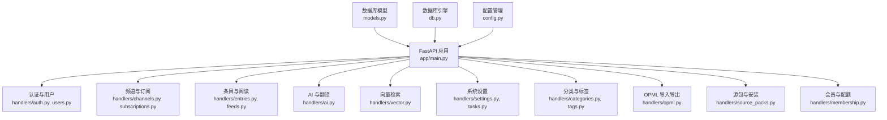
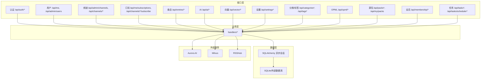
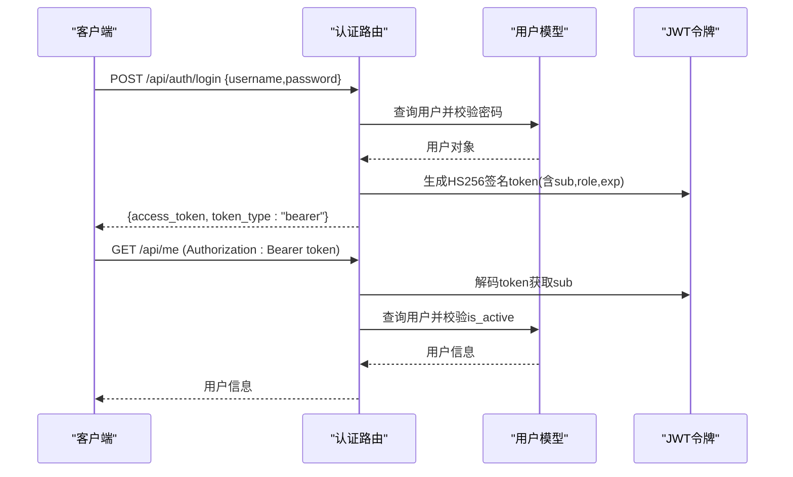
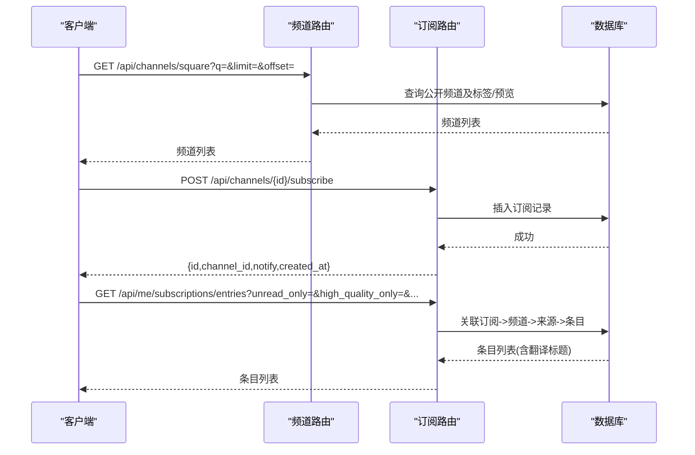
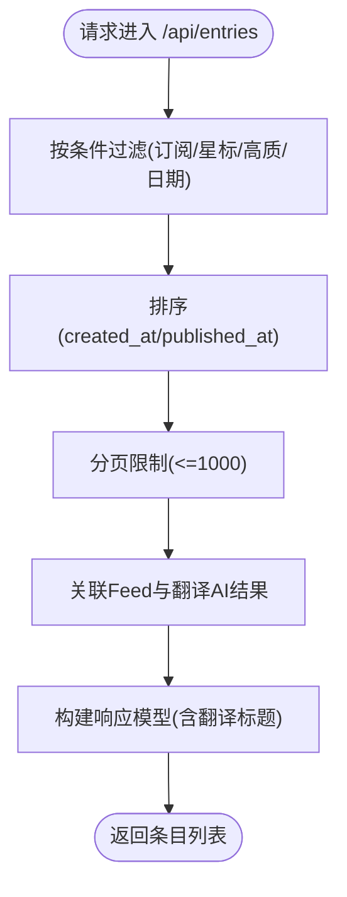
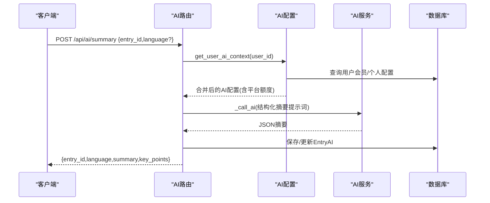
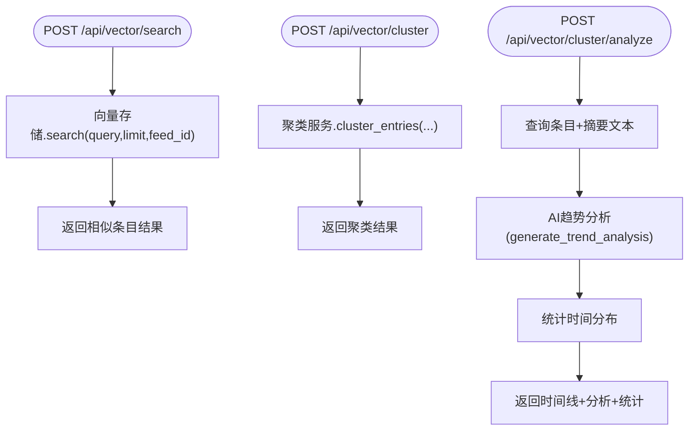
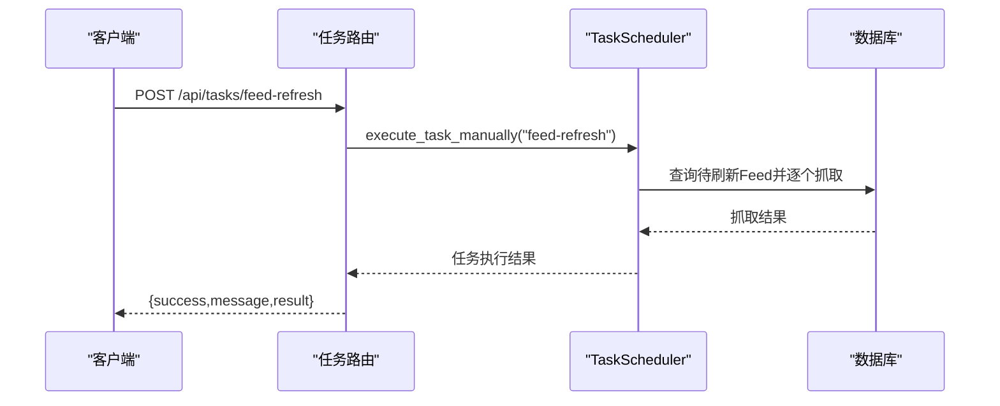
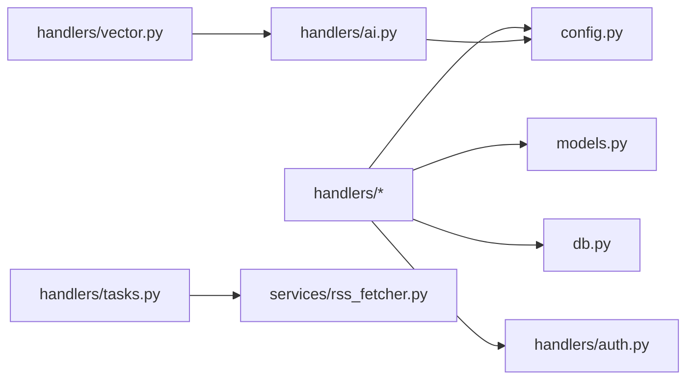

# 后端API文档

<cite>
**本文档引用的文件**
- [python-backend/app/main.py](file://python-backend/app/main.py)
- [python-backend/app/config.py](file://python-backend/app/config.py)
- [python-backend/app/models.py](file://python-backend/app/models.py)
- [python-backend/app/db.py](file://python-backend/app/db.py)
- [python-backend/app/handlers/auth.py](file://python-backend/app/handlers/auth.py)
- [python-backend/app/handlers/users.py](file://python-backend/app/handlers/users.py)
- [python-backend/app/handlers/channels.py](file://python-backend/app/handlers/channels.py)
- [python-backend/app/handlers/subscriptions.py](file://python-backend/app/handlers/subscriptions.py)
- [python-backend/app/handlers/entries.py](file://python-backend/app/handlers/entries.py)
- [python-backend/app/handlers/feeds.py](file://python-backend/app/handlers/feeds.py)
- [python-backend/app/handlers/ai.py](file://python-backend/app/handlers/ai.py)
- [python-backend/app/handlers/vector.py](file://python-backend/app/handlers/vector.py)
- [python-backend/app/handlers/settings.py](file://python-backend/app/handlers/settings.py)
- [python-backend/app/handlers/categories.py](file://python-backend/app/handlers/categories.py)
- [python-backend/app/handlers/tags.py](file://python-backend/app/handlers/tags.py)
- [python-backend/app/handlers/opml.py](file://python-backend/app/handlers/opml.py)
- [python-backend/app/handlers/source_packs.py](file://python-backend/app/handlers/source_packs.py)
- [python-backend/app/handlers/membership.py](file://python-backend/app/handlers/membership.py)
- [python-backend/app/handlers/tasks.py](file://python-backend/app/handlers/tasks.py)
</cite>

## 目录
1. [简介](#简介)
2. [项目结构](#项目结构)
3. [核心组件](#核心组件)
4. [架构总览](#架构总览)
5. [详细组件分析](#详细组件分析)
6. [依赖分析](#依赖分析)
7. [性能考虑](#性能考虑)
8. [故障排除指南](#故障排除指南)
9. [结论](#结论)
10. [附录](#附录)

## 简介
本文件为 Tan RSS Reader 后端 API 的完整技术文档，覆盖 RESTful 接口设计、认证与授权、数据模型、AI 服务、向量检索、任务调度、系统设置与频道管理等模块。文档提供各端点的 HTTP 方法、URL 模式、请求/响应结构、认证方式、错误码说明、速率限制与安全建议、SDK 使用指南与客户端实现要点，以及设计原则与扩展点。

## 项目结构
后端采用 FastAPI 构建，通过主应用入口集中注册各功能路由，数据库使用 SQLAlchemy 异步 ORM，配置通过 Pydantic 设置类与环境变量管理，AI 与向量检索集成 Aurora AI 服务与 Milvus 向量库。

图表来源
- [python-backend/app/main.py:44-62](file://python-backend/app/main.py#L44-L62)
- [python-backend/app/models.py:1-228](file://python-backend/app/models.py#L1-L228)
- [python-backend/app/db.py:1-27](file://python-backend/app/db.py#L1-L27)
- [python-backend/app/config.py:1-75](file://python-backend/app/config.py#L1-L75)

章节来源
- [python-backend/app/main.py:28-62](file://python-backend/app/main.py#L28-L62)
- [python-backend/app/db.py:1-27](file://python-backend/app/db.py#L1-L27)
- [python-backend/app/config.py:1-75](file://python-backend/app/config.py#L1-L75)

## 核心组件
- 应用入口与路由注册：集中注册认证、用户、频道、订阅、条目、订阅、AI、向量、设置、分类、标签、OPML、源包、会员、任务等路由，统一前缀 /api。
- 数据库与模型：异步 SQLAlchemy 引擎与模型定义，支持 SQLite 默认存储与扩展至外部数据库。
- 配置系统：环境变量与 Pydantic 设置类，统一管理数据库、Redis/Celery、Milvus、AI 服务等外部依赖。
- 认证与授权：基于 HS256 JWT 的 Bearer Token，内置管理员权限校验与可选登录态。
- AI 与向量：封装 Aurora AI 服务调用、嵌入生成、向量检索、聚类分析与趋势分析；支持用户级配置与平台级配额。
- 任务调度：基于 APScheduler 的定时任务，支持手动执行、启停与历史记录。

章节来源
- [python-backend/app/main.py:44-62](file://python-backend/app/main.py#L44-L62)
- [python-backend/app/models.py:1-228](file://python-backend/app/models.py#L1-L228)
- [python-backend/app/config.py:1-75](file://python-backend/app/config.py#L1-L75)
- [python-backend/app/handlers/auth.py:91-124](file://python-backend/app/handlers/auth.py#L91-L124)
- [python-backend/app/handlers/tasks.py:57-230](file://python-backend/app/handlers/tasks.py#L57-L230)

## 架构总览
后端采用分层架构：接口层（FastAPI 路由）、业务层（handlers）、数据访问层（SQLAlchemy 异步会话）、外部服务集成（AI 与 Milvus）。CORS 中间件允许跨域访问，启动时初始化数据库表与系统配置。

图表来源
- [python-backend/app/main.py:44-62](file://python-backend/app/main.py#L44-L62)
- [python-backend/app/handlers/ai.py:34-64](file://python-backend/app/handlers/ai.py#L34-L64)
- [python-backend/app/handlers/vector.py:13](file://python-backend/app/handlers/vector.py#L13)

## 详细组件分析

### 认证与用户管理
- 认证机制
  - 登录：POST /api/auth/login，返回 Bearer Token。
  - 注册：POST /api/auth/register，用户名与密码规则校验，首次用户自动成为管理员。
  - Token 校验：Header Authorization: Bearer <token>，解码后校验用户存在且激活。
  - 管理员校验：仅管理员可访问 /api/admin/*。
- 用户管理
  - 当前用户信息：GET /api/me
  - 管理员查看用户列表：GET /api/admin/users
  - 管理员更新用户：PATCH /api/admin/users/{id}
  - 管理员删除用户：DELETE /api/admin/users/{id}

图表来源
- [python-backend/app/handlers/auth.py:166-174](file://python-backend/app/handlers/auth.py#L166-L174)
- [python-backend/app/handlers/auth.py:126-164](file://python-backend/app/handlers/auth.py#L126-L164)
- [python-backend/app/handlers/auth.py:91-104](file://python-backend/app/handlers/auth.py#L91-L104)
- [python-backend/app/handlers/users.py:30-39](file://python-backend/app/handlers/users.py#L30-L39)

章节来源
- [python-backend/app/handlers/auth.py:91-124](file://python-backend/app/handlers/auth.py#L91-L124)
- [python-backend/app/handlers/auth.py:126-174](file://python-backend/app/handlers/auth.py#L126-L174)
- [python-backend/app/handlers/users.py:30-149](file://python-backend/app/handlers/users.py#L30-L149)

### 频道与订阅管理
- 频道
  - 公共频道广场：GET /api/channels/square
  - 管理员频道列表：GET /api/admin/channels
  - 创建频道：POST /api/admin/channels
  - 获取频道详情：GET /api/admin/channels/{id}
  - 更新频道：PUT/PATCH /api/admin/channels/{id}
  - 删除频道：DELETE /api/admin/channels/{id}
  - 频道来源管理：GET/POST/DELETE /api/admin/channels/{id}/sources
  - 频道内条目：GET /api/channels/{id}/entries
- 订阅
  - 我的订阅：GET /api/me/subscriptions
  - 订阅频道：POST /api/channels/{id}/subscribe
  - 取消订阅：DELETE /api/channels/{id}/subscribe
  - 我的订阅条目流：GET /api/me/subscriptions/entries

图表来源
- [python-backend/app/handlers/channels.py:101-179](file://python-backend/app/handlers/channels.py#L101-L179)
- [python-backend/app/handlers/channels.py:181-242](file://python-backend/app/handlers/channels.py#L181-L242)
- [python-backend/app/handlers/channels.py:244-380](file://python-backend/app/handlers/channels.py#L244-L380)
- [python-backend/app/handlers/channels.py:382-452](file://python-backend/app/handlers/channels.py#L382-L452)
- [python-backend/app/handlers/channels.py:454-501](file://python-backend/app/handlers/channels.py#L454-L501)
- [python-backend/app/handlers/subscriptions.py:49-107](file://python-backend/app/handlers/subscriptions.py#L49-L107)
- [python-backend/app/handlers/subscriptions.py:109-175](file://python-backend/app/handlers/subscriptions.py#L109-L175)

章节来源
- [python-backend/app/handlers/channels.py:101-501](file://python-backend/app/handlers/channels.py#L101-L501)
- [python-backend/app/handlers/subscriptions.py:49-175](file://python-backend/app/handlers/subscriptions.py#L49-L175)

### 条目与阅读
- 条目查询：GET /api/entries（支持按 feed_id、是否加星、高质、日期范围、排序）
- 星标条目：GET /api/entries/starred
- 星标统计：GET /api/entries/starred/stats
- 获取条目详情：GET /api/entries/{id}
- 更新条目：PUT/PATCH /api/entries/{id}
- 标记已读/未读：POST /api/entries/{id}/read, /api/entries/{id}/unread
- 加星/去星：POST /api/entries/{id}/star, /api/entries/{id}/unstar
- 批量加星/去星：POST /api/entries/bulk-star, /api/entries/bulk-unstar

图表来源
- [python-backend/app/handlers/entries.py:41-107](file://python-backend/app/handlers/entries.py#L41-L107)
- [python-backend/app/handlers/entries.py:109-149](file://python-backend/app/handlers/entries.py#L109-L149)
- [python-backend/app/handlers/entries.py:151-193](file://python-backend/app/handlers/entries.py#L151-L193)
- [python-backend/app/handlers/entries.py:195-222](file://python-backend/app/handlers/entries.py#L195-L222)
- [python-backend/app/handlers/entries.py:224-277](file://python-backend/app/handlers/entries.py#L224-L277)
- [python-backend/app/handlers/entries.py:279-310](file://python-backend/app/handlers/entries.py#L279-L310)

章节来源
- [python-backend/app/handlers/entries.py:41-310](file://python-backend/app/handlers/entries.py#L41-L310)

### AI 服务与翻译
- 配置管理
  - 获取平台 AI 配置：GET /api/ai/config
  - 更新平台 AI 配置：POST/PATCH /api/ai/config
  - 获取用户 AI 配置：GET /api/ai/user/config
  - 更新用户 AI 配置：PUT /api/ai/user/config
  - 测试 AI 连通性：POST /api/ai/test
- 文本处理
  - 结构化摘要：POST /api/ai/summary 或 /api/ai/summarize
  - 翻译：POST /api/ai/translate（支持 title/content）
  - 标题翻译：POST /api/ai/translate-title
- 会员与配额
  - 会员状态：GET /api/membership/status
  - 订阅升级：POST /api/membership/subscribe

图表来源
- [python-backend/app/handlers/ai.py:506-596](file://python-backend/app/handlers/ai.py#L506-L596)
- [python-backend/app/handlers/ai.py:616-715](file://python-backend/app/handlers/ai.py#L616-L715)
- [python-backend/app/handlers/ai.py:717-792](file://python-backend/app/handlers/ai.py#L717-L792)
- [python-backend/app/handlers/membership.py:28-57](file://python-backend/app/handlers/membership.py#L28-L57)

章节来源
- [python-backend/app/handlers/ai.py:34-64](file://python-backend/app/handlers/ai.py#L34-L64)
- [python-backend/app/handlers/ai.py:373-504](file://python-backend/app/handlers/ai.py#L373-L504)
- [python-backend/app/handlers/ai.py:506-792](file://python-backend/app/handlers/ai.py#L506-L792)
- [python-backend/app/handlers/membership.py:28-113](file://python-backend/app/handlers/membership.py#L28-L113)

### 向量检索与聚类
- 连接 Milvus：POST /api/vector/connect
- 向量搜索：POST /api/vector/search
- 聚类分析：POST /api/vector/cluster
- 聚类结果分析：POST /api/vector/cluster/analyze
- 触发索引：POST /api/vector/index（后台任务）

图表来源
- [python-backend/app/handlers/vector.py:38-111](file://python-backend/app/handlers/vector.py#L38-L111)
- [python-backend/app/handlers/vector.py:43-50](file://python-backend/app/handlers/vector.py#L43-L50)
- [python-backend/app/handlers/vector.py:52-106](file://python-backend/app/handlers/vector.py#L52-L106)
- [python-backend/app/handlers/vector.py:146-158](file://python-backend/app/handlers/vector.py#L146-L158)

章节来源
- [python-backend/app/handlers/vector.py:1-158](file://python-backend/app/handlers/vector.py#L1-L158)

### 系统设置与任务调度
- 系统设置
  - 获取设置：GET /api/settings
  - 更新设置：PUT/PATCH /api/settings
  - 获取 RSSHub 地址：GET /api/settings/rsshub-url
  - 设置 RSSHub 地址：POST /api/settings/rsshub-url
  - 快速测试 RSSHub：POST /api/settings/test-rsshub-quick
- 任务调度
  - 获取任务列表：GET /api/tasks
  - 获取任务历史：GET /api/tasks/{task_id}/history
  - 手动执行任务：POST /api/tasks/{task_id}
  - 切换任务开关：POST /api/tasks/{task_id}/toggle
  - 调度器状态：GET /api/tasks/scheduler/status
  - 启动调度器：POST /api/tasks/scheduler/start
  - 停止调度器：POST /api/tasks/scheduler/stop
  - 健康检查：GET /api/health

图表来源
- [python-backend/app/handlers/tasks.py:178-228](file://python-backend/app/handlers/tasks.py#L178-L228)
- [python-backend/app/handlers/tasks.py:232-276](file://python-backend/app/handlers/tasks.py#L232-L276)
- [python-backend/app/handlers/settings.py:20-161](file://python-backend/app/handlers/settings.py#L20-L161)

章节来源
- [python-backend/app/handlers/settings.py:20-161](file://python-backend/app/handlers/settings.py#L20-L161)
- [python-backend/app/handlers/tasks.py:57-276](file://python-backend/app/handlers/tasks.py#L57-L276)

### 分类与标签
- 分类
  - 获取公开分类：GET /api/categories
  - 管理员获取分类：GET /api/admin/categories
  - 创建分类：POST /api/admin/categories
  - 更新分类：PATCH /api/admin/categories/{id}
  - 删除分类：DELETE /api/admin/categories/{id}
- 标签
  - 管理员获取标签：GET /api/admin/tags
  - 创建标签：POST /api/admin/tags
  - 删除标签：DELETE /api/admin/tags/{id}

章节来源
- [python-backend/app/handlers/categories.py:33-123](file://python-backend/app/handlers/categories.py#L33-L123)
- [python-backend/app/handlers/tags.py:27-73](file://python-backend/app/handlers/tags.py#L27-L73)

### OPML 导入导出
- 导入：POST /api/opml/import（支持 multipart/form-data、application/json、原始 XML）
- 导出：GET /api/opml/export（返回 OPML XML）

章节来源
- [python-backend/app/handlers/opml.py:43-199](file://python-backend/app/handlers/opml.py#L43-L199)

### 源包与安装
- 获取公共源包：GET /api/packs
- 获取源包详情：GET /api/packs/{slug}
- 创建源包：POST /api/packs
- 安装源包：POST /api/packs/{slug}/install
- 查看我的源包：GET /api/my/packs
- 删除源包：DELETE /api/packs/{pack_id}

章节来源
- [python-backend/app/handlers/source_packs.py:41-277](file://python-backend/app/handlers/source_packs.py#L41-L277)

### 频源与抓取
- 获取所有频源：GET /api/admin/feeds 或 GET /api/feeds（登录用户）
- 创建频源：POST /api/admin/feeds 或 POST /api/feeds
- 更新频源：PUT /api/admin/feeds/{id} 或 PUT /api/feeds/{id}
- 删除频源：DELETE /api/admin/feeds/{id} 或 DELETE /api/feeds/{id}
- 刷新频源：POST /api/feeds/{id}/refresh

章节来源
- [python-backend/app/handlers/feeds.py:39-477](file://python-backend/app/handlers/feeds.py#L39-L477)

## 依赖分析
- 组件耦合
  - handlers 层依赖 models 与 db 会话，部分模块依赖 auth 的权限校验函数。
  - AI 与向量模块依赖配置系统与外部服务。
  - 任务调度模块依赖 APScheduler 与 rss_fetcher。
- 外部依赖
  - 数据库：SQLite（默认）或外部数据库（通过环境变量配置）
  - Redis/Celery：用于任务队列（环境变量）
  - Milvus：向量数据库（环境变量）
  - Aurora AI：大模型与嵌入服务（环境变量）
  - RSSHub：聚合服务（系统设置）

图表来源
- [python-backend/app/handlers/ai.py:24-33](file://python-backend/app/handlers/ai.py#L24-L33)
- [python-backend/app/handlers/vector.py:10-13](file://python-backend/app/handlers/vector.py#L10-L13)
- [python-backend/app/handlers/tasks.py:9](file://python-backend/app/handlers/tasks.py#L9)

章节来源
- [python-backend/app/handlers/ai.py:24-33](file://python-backend/app/handlers/ai.py#L24-L33)
- [python-backend/app/handlers/vector.py:10-13](file://python-backend/app/handlers/vector.py#L10-L13)
- [python-backend/app/handlers/tasks.py:9](file://python-backend/app/handlers/tasks.py#L9)

## 性能考虑
- 分页与限制
  - 多数列表接口限制最大返回数量（如 1000），避免一次性返回过多数据。
- 数据库查询优化
  - 使用索引字段（如 created_at、published_at、feed_id）进行排序与过滤。
  - 关联查询时尽量减少不必要的 JOIN。
- 缓存与幂等
  - AI 摘要与翻译结果缓存于 EntryAI 表，避免重复计算。
- 异步与并发
  - SQLAlchemy 使用异步会话，AI 与向量调用采用异步 HTTP 客户端。
- 任务调度
  - 定时任务间隔可配置，避免频繁抓取导致资源压力。

## 故障排除指南
- 认证失败
  - 401 未授权：检查 Authorization 头是否为 Bearer token，token 是否过期或无效。
  - 403 禁止访问：检查用户角色是否为管理员。
- 数据不存在
  - 404 未找到：确认资源 ID 是否正确，或相关外键是否存在。
- 参数错误
  - 400 错误请求：检查请求体字段类型与长度，如用户名/邮箱/密码规则。
- 速率限制
  - 429 太多请求：AI 服务在特定条件下可能触发限流，重试策略已在客户端实现。
- 数据库异常
  - 唯一约束冲突：用户名/邮箱/标签名等重复时返回 400。
- 外部服务异常
  - RSSHub/AI/Milvus 不可用时，返回相应错误码与消息。

章节来源
- [python-backend/app/handlers/auth.py:91-124](file://python-backend/app/handlers/auth.py#L91-L124)
- [python-backend/app/handlers/ai.py:198-228](file://python-backend/app/handlers/ai.py#L198-L228)
- [python-backend/app/handlers/feeds.py:472-477](file://python-backend/app/handlers/feeds.py#L472-L477)

## 结论
本后端 API 以清晰的模块划分与严格的权限控制为基础，结合 AI 与向量检索能力，提供了完整的 RSS 阅读与智能增强体验。通过配置化与任务调度机制，系统具备良好的可维护性与扩展性。建议在生产环境中启用 HTTPS、限制 CORS、实施速率限制与审计日志，并定期评估外部服务可用性与成本。

## 附录

### API 设计原则与扩展点
- 设计原则
  - 单一职责：每个路由专注于一类资源或操作。
  - 一致的响应结构：成功与错误均返回明确字段。
  - 权限最小化：非必要不暴露管理端点。
  - 版本管理：当前统一前缀 /api，后续可通过子路径实现版本隔离。
- 扩展点
  - 新增路由：在 main.py 中注册新路由并选择合适前缀。
  - 新增模型：在 models.py 中定义并迁移数据库。
  - 新增外部服务：在 config.py 中添加配置项并通过环境变量注入。

### SDK 使用指南与客户端实现要点
- 认证流程
  - 注册/登录获取 access_token，后续请求在 Header 中携带 Authorization: Bearer <token>。
- 请求与响应
  - 使用标准 HTTP 客户端发送请求，解析 JSON 响应。
  - 对于流式响应（如 AI 翻译），按事件流格式处理增量数据。
- 错误处理
  - 根据状态码与错误信息进行重试或提示。
- 最佳实践
  - 本地缓存常用数据（如频道列表、设置），减少网络请求。
  - 在移动端或桌面端实现离线模式与增量同步。