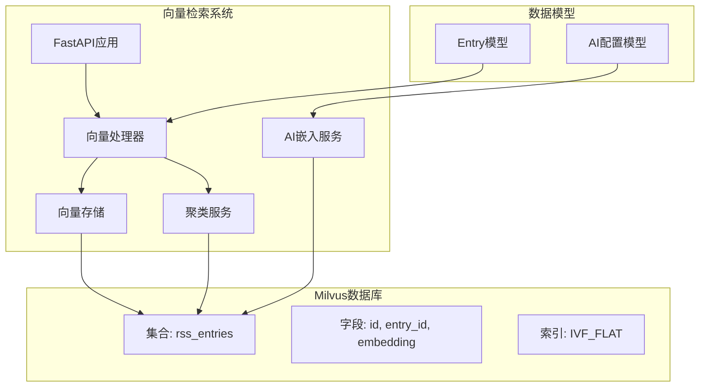
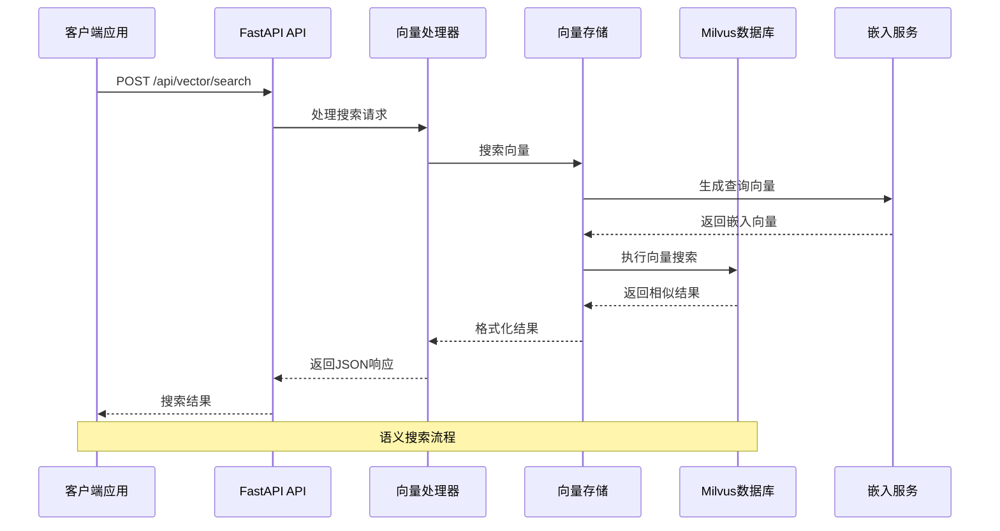
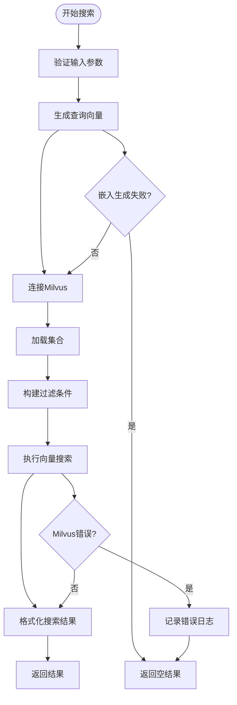
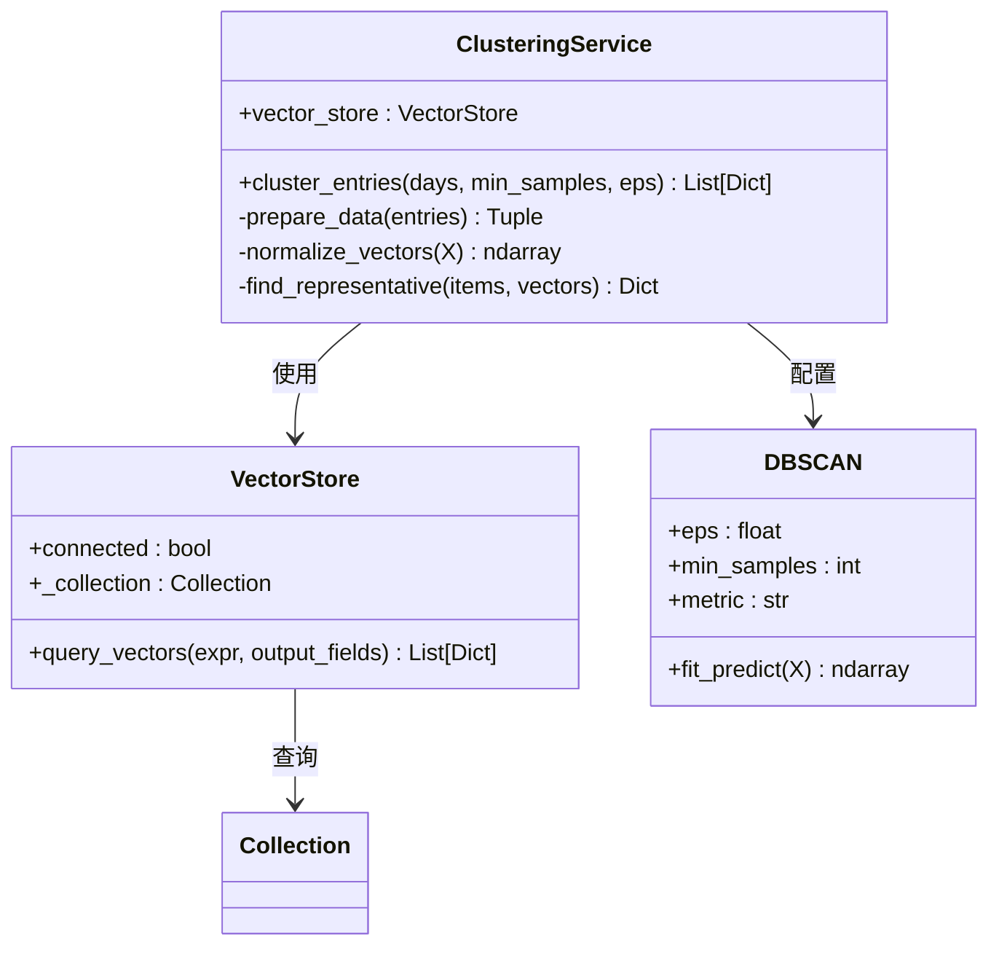
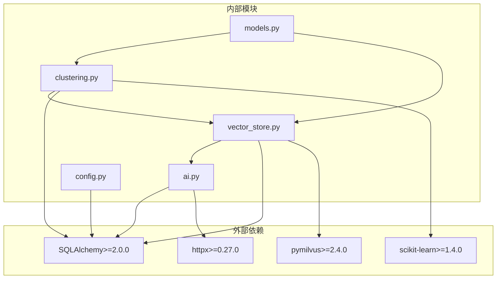

# 向量检索API

<cite>
**本文档引用的文件**
- [vector.py](file://python-backend/app/handlers/vector.py)
- [vector_store.py](file://python-backend/app/handlers/vector_store.py)
- [clustering.py](file://python-backend/app/handlers/clustering.py)
- [ai.py](file://python-backend/app/handlers/ai.py)
- [config.py](file://python-backend/app/config.py)
- [models.py](file://python-backend/app/models.py)
- [vectorize_history.py](file://python-backend/scripts/vectorize_history.py)
- [test_vector_system.py](file://python-backend/tests/test_vector_system.py)
- [main.py](file://python-backend/app/main.py)
- [requirements.txt](file://python-backend/requirements.txt)
</cite>

## 目录
1. [简介](#简介)
2. [项目结构](#项目结构)
3. [核心组件](#核心组件)
4. [架构概览](#架构概览)
5. [详细组件分析](#详细组件分析)
6. [依赖关系分析](#依赖关系分析)
7. [性能考虑](#性能考虑)
8. [故障排除指南](#故障排除指南)
9. [结论](#结论)

## 简介

Tan RSS Reader的向量检索API是一个基于Milvus向量数据库的智能搜索系统，为RSS阅读器提供了强大的语义搜索、内容聚类和相似度计算功能。该系统通过将RSS条目的文本内容转换为高维向量表示，实现了超越传统关键词匹配的智能检索体验。

该API支持以下核心功能：
- **语义搜索**：基于向量相似度的智能内容检索
- **内容聚类**：使用DBSCAN算法对相关内容进行自动分组
- **相似度计算**：提供精确的向量相似度评分
- **向量索引管理**：完整的向量数据生命周期管理
- **批量处理**：支持历史数据的批量向量化处理

## 项目结构

向量检索系统在Python后端中的组织结构如下：

**图表来源**
- [main.py:44-62](file://python-backend/app/main.py#L44-L62)
- [vector.py:15](file://python-backend/app/handlers/vector.py#L15)
- [vector_store.py:18](file://python-backend/app/handlers/vector_store.py#L18)

**章节来源**
- [main.py:28-62](file://python-backend/app/main.py#L28-L62)
- [requirements.txt:14](file://python-backend/requirements.txt#L14)

## 核心组件

### 向量存储服务 (VectorStore)

VectorStore是整个向量检索系统的核心组件，负责与Milvus数据库的交互和向量数据的管理。

**主要特性：**
- **连接管理**：支持本地Milvus Lite和远程Milvus实例
- **集合管理**：自动创建和管理向量集合
- **向量索引**：支持多种索引类型和参数配置
- **异步操作**：使用线程池避免阻塞事件循环

**数据模型：**
- `id`: 主键（自增整数）
- `entry_id`: RSS条目ID（VARCHAR）
- `embedding`: 向量数据（FLOAT_VECTOR, 1024维）
- `feed_id`: 来源订阅ID（VARCHAR）
- `published_at`: 发布时间戳（INT64）
- `title`: 条目标题（VARCHAR）

**章节来源**
- [vector_store.py:18-197](file://python-backend/app/handlers/vector_store.py#L18-L197)
- [models.py:21-38](file://python-backend/app/models.py#L21-L38)

### 向量检索处理器 (VectorHandler)

VectorHandler提供REST API接口，封装了向量检索的所有业务逻辑。

**核心端点：**
- `POST /api/vector/connect` - 连接Milvus数据库
- `POST /api/vector/search` - 执行向量搜索
- `POST /api/vector/index` - 触发批量索引任务
- `POST /api/vector/cluster` - 执行内容聚类
- `POST /api/vector/cluster/analyze` - 分析聚类结果

**章节来源**
- [vector.py:38-158](file://python-backend/app/handlers/vector.py#L38-L158)

### 聚类服务 (ClusteringService)

ClusteringService使用DBSCAN算法对向量数据进行无监督聚类，实现内容的自动分类和主题发现。

**聚类参数：**
- `days`: 时间范围（默认1天）
- `min_samples`: 最小样本数（默认2）
- `eps`: 聚类半径（默认0.3）

**章节来源**
- [clustering.py:10-142](file://python-backend/app/handlers/clustering.py#L10-L142)

## 架构概览

向量检索系统采用分层架构设计，确保了良好的可扩展性和维护性：

**图表来源**
- [vector.py:108-111](file://python-backend/app/handlers/vector.py#L108-L111)
- [vector_store.py:130-178](file://python-backend/app/handlers/vector_store.py#L130-L178)

**章节来源**
- [vector.py:108-111](file://python-backend/app/handlers/vector.py#L108-L111)
- [vector_store.py:130-178](file://python-backend/app/handlers/vector_store.py#L130-L178)

## 详细组件分析

### 向量搜索实现

向量搜索是系统的核心功能，通过以下步骤实现：

**图表来源**
- [vector_store.py:130-178](file://python-backend/app/handlers/vector_store.py#L130-L178)
- [ai.py:313-346](file://python-backend/app/handlers/ai.py#L313-L346)

**搜索参数配置：**
- **相似度度量**: COSINE（余弦相似度）
- **搜索参数**: nprobe=10（搜索探测数量）
- **结果限制**: 默认10条记录
- **过滤条件**: 支持按feed_id过滤

**章节来源**
- [vector_store.py:130-178](file://python-backend/app/handlers/vector_store.py#L130-L178)

### 向量索引管理

系统提供了完整的向量索引管理功能，包括：

**索引策略：**
- **索引类型**: IVF_FLAT（倒排文件平面索引）
- **距离度量**: COSINE
- **索引参数**: nlist=128（倒排表数量）
- **向量维度**: 1024维

**索引优化：**
- 使用异步线程池避免阻塞
- 支持本地Milvus Lite和远程Milvus
- 自动集合创建和加载

**章节来源**
- [vector_store.py:55-84](file://python-backend/app/handlers/vector_store.py#L55-L84)
- [vector_store.py:77-82](file://python-backend/app/handlers/vector_store.py#L77-L82)

### 内容聚类实现

聚类服务使用DBSCAN算法对向量数据进行无监督聚类：

**图表来源**
- [clustering.py:10-142](file://python-backend/app/handlers/clustering.py#L10-L142)
- [vector_store.py:180-193](file://python-backend/app/handlers/vector_store.py#L180-L193)

**聚类流程：**
1. **数据获取**: 从Milvus查询指定时间范围内的向量数据
2. **数据准备**: 提取嵌入向量、标题和时间戳
3. **向量归一化**: 对向量进行L2归一化处理
4. **DBSCAN聚类**: 使用余弦距离进行密度聚类
5. **结果处理**: 计算聚类中心和代表性项目

**章节来源**
- [clustering.py:14-139](file://python-backend/app/handlers/clustering.py#L14-L139)

### 历史数据向量化

系统提供了批量处理历史数据的功能：

**处理流程：**
1. **配置初始化**: 加载AI配置和连接Milvus
2. **数据获取**: 从数据库查询RSS条目
3. **内容清理**: 移除HTML标签和空白字符
4. **向量化处理**: 生成嵌入向量并插入Milvus
5. **进度监控**: 实时显示处理进度和统计信息

**并发控制：**
- 使用信号量限制并发数（默认5）
- 支持强制重新向量化
- 支持处理限制（limit参数）

**章节来源**
- [vectorize_history.py:25-129](file://python-backend/scripts/vectorize_history.py#L25-L129)

## 依赖关系分析

向量检索系统的关键依赖关系如下：

**图表来源**
- [requirements.txt:14](file://python-backend/requirements.txt#L14)
- [requirements.txt:15](file://python-backend/requirements.txt#L15)
- [requirements.txt:7](file://python-backend/requirements.txt#L7)

**依赖特点：**
- **Milvus客户端**: 支持本地Lite模式和远程集群
- **机器学习库**: DBSCAN聚类算法
- **HTTP客户端**: 异步嵌入服务调用
- **ORM框架**: SQLAlchemy数据库操作

**章节来源**
- [requirements.txt:1-18](file://python-backend/requirements.txt#L1-L18)

## 性能考虑

### 向量维度配置

系统使用1024维向量进行嵌入表示，这是基于以下考虑：

**维度选择：**
- **精度平衡**: 1024维提供良好的语义表达能力
- **内存效率**: 相比更高维度更节省存储空间
- **计算效率**: 适中的维度便于快速相似度计算
- **兼容性**: 与主流嵌入模型保持一致

**优化建议：**
- 根据具体应用场景调整维度大小
- 考虑使用量化技术减少存储需求
- 实施向量压缩以提高检索速度

### 相似度阈值设置

**默认配置：**
- **DBSCAN半径**: 0.3（对应相似度>0.7）
- **最小样本**: 2
- **搜索探测**: 10

**调优策略：**
- **宽松聚类**: 增大eps值（如0.4-0.5）
- **严格聚类**: 减小eps值（如0.2-0.3）
- **大数据集**: 增加min_samples以提高质量

### 搜索优化

**索引优化：**
- **nlist参数**: 控制倒排表数量，影响召回率和速度
- **nprobe参数**: 控制搜索时检查的倒排表数量
- **批量查询**: 支持并发查询提升吞吐量

**查询优化：**
- **过滤条件**: 使用feed_id过滤减少搜索空间
- **结果限制**: 合理设置limit参数
- **缓存策略**: 对热门查询结果进行缓存

### 性能监控

**关键指标：**
- **查询延迟**: 搜索响应时间
- **召回率**: 检索到相关结果的比例
- **误检率**: 检索到不相关结果的比例
- **内存使用**: 向量存储和索引占用

**监控建议：**
- 实施查询性能日志
- 定期检查索引状态
- 监控向量分布情况

## 故障排除指南

### 常见问题及解决方案

**Milvus连接问题：**
- **症状**: 连接超时或拒绝连接
- **原因**: 网络配置错误或服务未启动
- **解决**: 检查milvus_host和milvus_port配置

**向量生成失败：**
- **症状**: 嵌入向量为空或维度不正确
- **原因**: AI服务不可用或API密钥错误
- **解决**: 验证AI配置和网络连接

**聚类结果异常：**
- **症状**: 聚类数量过少或过多
- **原因**: eps参数设置不当
- **解决**: 调整DBSCAN参数或数据预处理

**章节来源**
- [vector_store.py:23-54](file://python-backend/app/handlers/vector_store.py#L23-L54)
- [ai.py:313-346](file://python-backend/app/handlers/ai.py#L313-L346)

### 调试工具

**测试脚本**：
- 提供完整的向量系统测试用例
- 包含连接、插入、搜索和聚类测试
- 支持日志输出和结果验证

**监控方法**：
- 实时查看向量存储状态
- 监控查询性能指标
- 检查向量分布和质量

**章节来源**
- [test_vector_system.py:17-81](file://python-backend/tests/test_vector_system.py#L17-L81)

## 结论

Tan RSS Reader的向量检索API提供了一个完整、高效的语义搜索解决方案。通过将Milvus向量数据库与AI嵌入服务相结合，系统实现了超越传统关键词匹配的智能内容检索体验。

**主要优势：**
- **语义理解**: 基于向量相似度的智能检索
- **自动聚类**: DBSCAN算法实现内容自动分类
- **灵活配置**: 支持多种索引策略和参数调优
- **高性能**: 异步处理和并发优化
- **易扩展**: 模块化设计便于功能扩展

**未来发展建议：**
- 实施向量缓存机制提升查询性能
- 添加向量压缩技术减少存储开销
- 优化DBSCAN参数自适应调整
- 增强向量质量评估和监控
- 支持多模态向量（文本+图像）

该系统为RSS阅读器提供了强大的内容发现能力，显著提升了用户的阅读体验和信息获取效率。