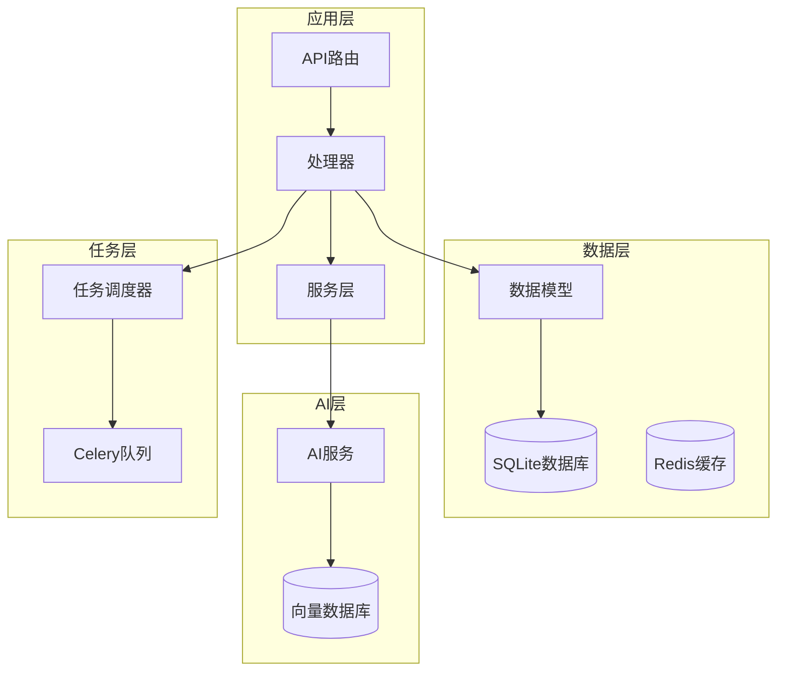
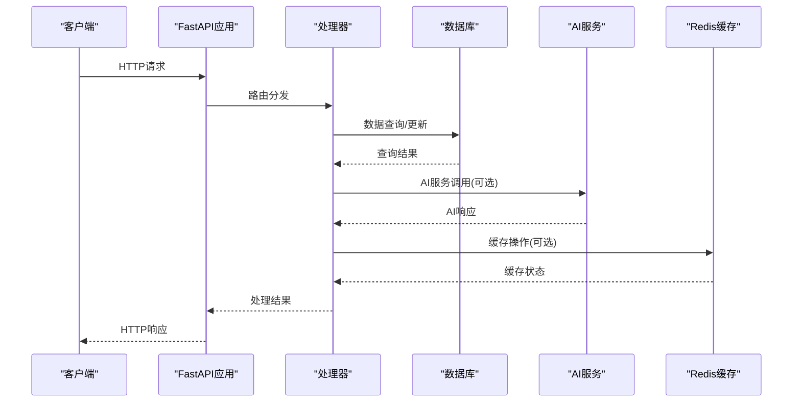
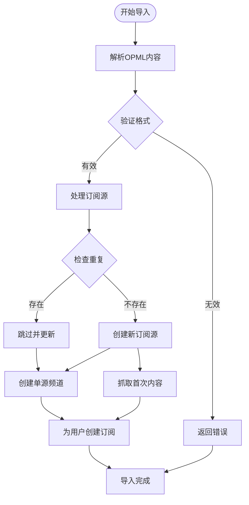
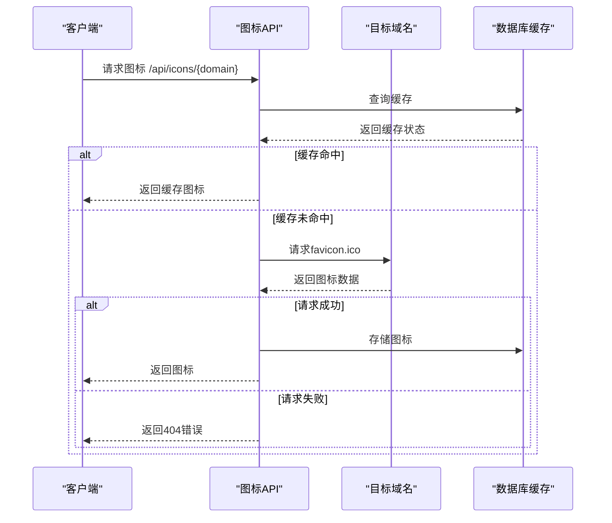
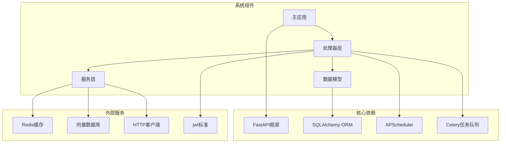

# 系统管理API

<cite>
**本文档引用的文件**
- [python-backend/app/main.py](file://python-backend/app/main.py)
- [python-backend/app/config.py](file://python-backend/app/config.py)
- [python-backend/app/models.py](file://python-backend/app/models.py)
- [python-backend/app/db.py](file://python-backend/app/db.py)
- [python-backend/app/handlers/settings.py](file://python-backend/app/handlers/settings.py)
- [python-backend/app/handlers/membership.py](file://python-backend/app/handlers/membership.py)
- [python-backend/app/handlers/tasks.py](file://python-backend/app/handlers/tasks.py)
- [python-backend/app/handlers/opml.py](file://python-backend/app/handlers/opml.py)
- [python-backend/app/handlers/icons.py](file://python-backend/app/handlers/icons.py)
- [python-backend/app/handlers/users.py](file://python-backend/app/handlers/users.py)
- [python-backend/app/handlers/auth.py](file://python-backend/app/handlers/auth.py)
- [python-backend/app/handlers/ai.py](file://python-backend/app/handlers/ai.py)
- [python-backend/app/celery_app.py](file://python-backend/app/celery_app.py)
</cite>

## 目录
1. [简介](#简介)
2. [项目结构](#项目结构)
3. [核心组件](#核心组件)
4. [架构概览](#架构概览)
5. [详细组件分析](#详细组件分析)
6. [依赖分析](#依赖分析)
7. [性能考虑](#性能考虑)
8. [故障排除指南](#故障排除指南)
9. [结论](#结论)
10. [附录](#附录)

## 简介

Tan RSS Reader是一个基于FastAPI的RSS阅读器系统，提供了完整的系统管理API功能。该系统支持系统配置管理、用户权限管理、任务调度、OPML导入导出、图标管理等核心管理功能。

系统采用现代化的架构设计，使用异步数据库连接、任务调度器、AI服务集成和多平台前端支持。主要特性包括：

- **系统配置管理**：动态调整应用参数、RSS抓取间隔、UI显示选项等
- **用户权限管理**：管理员权限控制、用户状态管理、会员等级系统
- **任务调度系统**：自动RSS刷新、图标清理、健康检查、AI质量评分
- **数据导入导出**：OPML格式的订阅源批量导入和导出
- **图标管理系统**：自动获取和缓存网站favicon图标
- **AI集成**：智能摘要、翻译、嵌入向量生成
- **监控与诊断**：任务执行历史、健康状态检查、性能监控

## 项目结构

系统采用模块化的项目结构，主要分为以下几个层次：



**图表来源**
- [python-backend/app/main.py:1-103](file://python-backend/app/main.py#L1-L103)
- [python-backend/app/db.py:1-27](file://python-backend/app/db.py#L1-L27)

**章节来源**
- [python-backend/app/main.py:1-103](file://python-backend/app/main.py#L1-L103)
- [python-backend/app/config.py:1-75](file://python-backend/app/config.py#L1-L75)

## 核心组件

### 数据库模型系统

系统使用SQLAlchemy ORM定义了完整的数据模型体系，包括用户管理、订阅源、内容管理、AI配置等多个核心实体。

```mermaid
classDiagram
class User {
+string id
+string username
+string email
+string role
+boolean is_active
+datetime created_at
+datetime updated_at
}
class UserMembership {
+string id
+string user_id
+string tier
+datetime expires_at
+datetime created_at
+datetime updated_at
}
class Feed {
+string id
+string title
+string url
+string favicon
+integer update_interval
+datetime last_updated
+string last_status
+integer error_count
+datetime created_at
+datetime updated_at
}
class Entry {
+string id
+string feed_id
+string title
+string url
+string author
+text content
+text summary
+datetime published_at
+boolean is_read
+boolean is_starred
+integer reading_time
+integer word_count
+integer quality_score
+string dedup_key
}
class AppSettingsRow {
+string id
+integer fetch_interval_minutes
+integer items_per_page
+boolean enable_date_filter
+string default_date_range
+string time_field
+boolean show_entry_summary
+integer max_auto_title_translations
+string translation_display_mode
+boolean branding_toggle
+string rsshub_url
+datetime created_at
+datetime updated_at
}
User ||--o{ UserMembership : "拥有"
User ||--o{ Subscription : "订阅"
Feed ||--o{ Entry : "包含"
User ||--o{ EntryAI : "生成"
```

**图表来源**
- [python-backend/app/models.py:168-228](file://python-backend/app/models.py#L168-L228)

### 配置管理系统

系统采用分层配置架构，支持环境变量、配置文件和运行时动态配置：

- **AppSettings**：应用基础配置参数
- **EnvSettings**：环境变量配置
- **AIConfig**：AI服务配置
- **VectorConfig**：向量数据库配置

**章节来源**
- [python-backend/app/config.py:5-75](file://python-backend/app/config.py#L5-L75)
- [python-backend/app/models.py:82-125](file://python-backend/app/models.py#L82-L125)

## 架构概览

系统采用微服务架构模式，通过FastAPI提供RESTful API，支持异步处理和高并发访问。



**图表来源**
- [python-backend/app/main.py:28-62](file://python-backend/app/main.py#L28-L62)
- [python-backend/app/handlers/auth.py:91-104](file://python-backend/app/handlers/auth.py#L91-L104)

## 详细组件分析

### 系统配置管理

系统配置管理是整个系统的核心控制中心，负责管理应用的各种运行参数。

#### 配置端点

| 端点 | 方法 | 功能描述 | 权限要求 |
|------|------|----------|----------|
| `/api/settings` | GET | 获取系统配置 | 无需登录 |
| `/api/settings` | PUT/PATCH | 更新系统配置 | 管理员 |
| `/api/settings/rsshub-url` | GET | 获取RSSHub URL | 无需登录 |
| `/api/settings/rsshub-url` | POST | 设置RSSHub URL | 管理员 |
| `/api/settings/test-rsshub-quick` | POST | 快速测试RSSHub连通性 | 无需登录 |

#### 配置参数详解

系统支持以下关键配置参数：

- **fetch_interval_minutes**: RSS抓取间隔（默认15分钟）
- **items_per_page**: 分页大小（默认50条）
- **enable_date_filter**: 是否启用日期过滤
- **default_date_range**: 默认日期范围（如"30d"）
- **time_field**: 时间字段选择
- **show_entry_summary**: 是否显示摘要
- **max_auto_title_translations**: 自动标题翻译最大数量
- **translation_display_mode**: 翻译显示模式
- **branding_toggle**: 品牌标识开关
- **rsshub_url**: RSSHub服务URL

**章节来源**
- [python-backend/app/handlers/settings.py:20-161](file://python-backend/app/handlers/settings.py#L20-L161)
- [python-backend/app/models.py:82-96](file://python-backend/app/models.py#L82-L96)

### 用户权限管理

用户权限管理系统提供了完整的用户生命周期管理和权限控制。

#### 用户管理端点

| 端点 | 方法 | 功能描述 | 权限要求 |
|------|------|----------|----------|
| `/api/me` | GET | 获取当前用户信息 | 已登录用户 |
| `/api/admin/users` | GET | 获取用户列表 | 管理员 |
| `/api/admin/users/{id}` | PATCH | 更新用户信息 | 管理员 |
| `/api/admin/users/{id}` | DELETE | 删除用户 | 管理员 |

#### 权限控制机制

系统采用基于JWT的认证机制，支持以下权限级别：

- **普通用户**：基本功能访问
- **管理员**：系统管理权限
- **超级管理员**：最高权限

**章节来源**
- [python-backend/app/handlers/users.py:30-149](file://python-backend/app/handlers/users.py#L30-L149)
- [python-backend/app/handlers/auth.py:91-174](file://python-backend/app/handlers/auth.py#L91-L174)

### 任务调度系统

系统集成了强大的任务调度功能，支持定时任务和手动任务执行。

#### 任务类型

系统内置以下任务类型：

| 任务ID | 任务名称 | 执行频率 | 功能描述 |
|--------|----------|----------|----------|
| feed-refresh | RSS Feed刷新 | 按配置间隔 | 抓取所有RSS源 |
| icon-cleanup | 图标清理 | 按配置间隔 | 清理无效图标 |
| health-check | 健康检查 | 按配置间隔 | 系统健康状态检查 |
| quality-scoring | AI质量评分 | 每5分钟 | 为文章计算质量分数 |

#### 任务调度端点

| 端点 | 方法 | 功能描述 | 权限要求 |
|------|------|----------|----------|
| `/api/tasks` | GET | 获取任务列表 | 管理员 |
| `/api/tasks/{task_id}` | POST | 手动执行任务 | 管理员 |
| `/api/tasks/{task_id}/toggle` | POST | 启用/禁用任务 | 管理员 |
| `/api/tasks/scheduler/start` | POST | 启动调度器 | 管理员 |
| `/api/tasks/scheduler/stop` | POST | 停止调度器 | 管理员 |

**章节来源**
- [python-backend/app/handlers/tasks.py:57-276](file://python-backend/app/handlers/tasks.py#L57-L276)

### OPML导入导出系统

OPML（Outline Processor Markup Language）是RSS订阅源的标准格式，系统提供了完整的导入导出功能。

#### OPML处理流程



**图表来源**
- [python-backend/app/handlers/opml.py:43-171](file://python-backend/app/handlers/opml.py#L43-L171)

#### OPML端点

| 端点 | 方法 | 功能描述 | 权限要求 |
|------|------|----------|----------|
| `/api/opml/import` | POST | 导入OPML文件 | 无需登录 |
| `/api/opml/export` | GET | 导出OPML文件 | 无需登录 |

**章节来源**
- [python-backend/app/handlers/opml.py:19-199](file://python-backend/app/handlers/opml.py#L19-L199)

### 图标管理系统

系统提供了完整的网站图标管理功能，支持自动获取、缓存和代理服务。

#### 图标处理流程



**图表来源**
- [python-backend/app/handlers/icons.py:30-98](file://python-backend/app/handlers/icons.py#L30-L98)

#### 图标管理端点

| 端点 | 方法 | 功能描述 | 权限要求 |
|------|------|----------|----------|
| `/api/icons` | GET | 获取所有图标列表 | 管理员 |
| `/api/icons/{domain}` | GET | 获取指定域名图标 | 无需登录 |
| `/api/icons/{domain}/refresh` | POST | 刷新指定域名图标 | 管理员 |
| `/api/icons/cleanup` | POST | 清理无效图标 | 管理员 |
| `/api/icons/proxy` | GET | 代理图标请求 | 无需登录 |

**章节来源**
- [python-backend/app/handlers/icons.py:17-98](file://python-backend/app/handlers/icons.py#L17-L98)

### 会员管理系统

系统实现了完整的会员等级和权限控制系统。

#### 会员等级体系

| 等级 | 描述 | 主要功能 |
|------|------|----------|
| free | 免费用户 | 基础功能，有限制 |
| plus | Plus会员 | 增加AI调用额度 |
| pro | Pro会员 | 完整功能权限 |

#### 会员管理端点

| 端点 | 方法 | 功能描述 | 权限要求 |
|------|------|----------|----------|
| `/api/membership/status` | GET | 获取会员状态 | 已登录用户 |
| `/api/membership/subscribe` | POST | 订阅会员服务 | 已登录用户 |

**章节来源**
- [python-backend/app/handlers/membership.py:28-113](file://python-backend/app/handlers/membership.py#L28-L113)

### AI服务集成

系统深度集成了AI服务，提供智能摘要、翻译、嵌入向量生成功能。

#### AI配置管理

AI服务配置支持多种来源：

- **平台默认配置**：系统预设的AI服务参数
- **用户自定义配置**：每个用户的独立AI设置
- **会员权限控制**：不同等级用户的AI使用权限

#### AI端点

| 端点 | 方法 | 功能描述 | 权限要求 |
|------|------|----------|----------|
| `/api/ai/config` | GET/PUT | 获取/更新AI配置 | 管理员 |
| `/api/ai/user/config` | GET/PUT | 获取/更新用户AI配置 | 已登录用户 |
| `/api/ai/test` | POST | 测试AI服务 | 已登录用户 |
| `/api/ai/summary` | POST | 生成文章摘要 | 已登录用户 |
| `/api/ai/translate` | POST | 翻译文章内容 | 已登录用户 |

**章节来源**
- [python-backend/app/handlers/ai.py:373-800](file://python-backend/app/handlers/ai.py#L373-L800)

## 依赖分析

系统采用了模块化的依赖架构，各组件之间保持松耦合。



**图表来源**
- [python-backend/app/main.py:1-27](file://python-backend/app/main.py#L1-L27)
- [python-backend/app/celery_app.py:1-23](file://python-backend/app/celery_app.py#L1-L23)

**章节来源**
- [python-backend/app/main.py:1-103](file://python-backend/app/main.py#L1-L103)
- [python-backend/app/celery_app.py:1-23](file://python-backend/app/celery_app.py#L1-L23)

## 性能考虑

### 数据库优化

系统采用异步数据库连接，支持高并发访问：

- **连接池管理**：自动管理数据库连接
- **异步查询**：非阻塞数据库操作
- **索引优化**：关键字段建立索引
- **事务管理**：确保数据一致性

### 缓存策略

- **Redis缓存**：用户会话和临时数据
- **图标缓存**：网站favicon图标本地存储
- **配置缓存**：系统配置内存缓存

### 任务调度优化

- **APScheduler集成**：高效的定时任务调度
- **Celery队列**：后台任务异步处理
- **任务重试机制**：失败任务自动重试
- **资源限制**：任务执行时间限制

## 故障排除指南

### 常见问题及解决方案

#### 数据库连接问题

**症状**：应用启动失败，数据库连接错误
**解决方案**：
1. 检查数据库URL配置
2. 验证SQLite文件权限
3. 确认数据库文件路径

#### 任务调度异常

**症状**：RSS抓取任务不执行
**解决方案**：
1. 检查APScheduler安装状态
2. 验证调度器启动状态
3. 查看任务执行历史

#### AI服务连接失败

**症状**：AI功能调用超时或失败
**解决方案**：
1. 验证AI服务URL配置
2. 检查网络连接
3. 确认API密钥有效性

#### 图标获取失败

**症状**：网站图标显示为默认图标
**解决方案**：
1. 检查目标网站favicon.ico可用性
2. 验证网络代理设置
3. 清理图标缓存重新获取

**章节来源**
- [python-backend/app/handlers/tasks.py:273-276](file://python-backend/app/handlers/tasks.py#L273-L276)
- [python-backend/app/handlers/icons.py:40-52](file://python-backend/app/handlers/icons.py#L40-L52)

## 结论

Tan RSS Reader的系统管理API提供了完整的企业级功能，具有以下优势：

1. **模块化设计**：清晰的组件分离，便于维护和扩展
2. **异步架构**：支持高并发访问，良好的性能表现
3. **灵活配置**：动态配置管理，适应不同部署需求
4. **完整监控**：内置健康检查和任务监控功能
5. **安全可靠**：完善的权限控制和数据保护机制

系统支持多种部署方式，从单机部署到分布式集群，能够满足不同规模的应用需求。通过合理的配置和优化，可以实现稳定高效的RSS内容管理服务。

## 附录

### 环境变量配置

系统支持通过环境变量进行配置管理：

| 环境变量 | 默认值 | 用途 |
|----------|--------|------|
| PY_BACKEND_DB_URL | 无 | 数据库连接URL |
| REDIS_URL | redis://localhost:6379/0 | Redis连接URL |
| AURORA_AUTH_SECRET | dev-secret | JWT密钥 |
| AURORA_AUTH_EXPIRE_MINUTES | 20160 | 令牌过期时间(分钟) |
| AURORA_AI_API_KEY | 空 | AI服务API密钥 |
| AURORA_AI_BASE_URL | 本地服务 | AI服务基础URL |

### 最佳实践建议

1. **生产环境部署**：
   - 使用HTTPS协议
   - 配置反向代理
   - 设置适当的超时时间
   - 启用详细的日志记录

2. **性能优化**：
   - 合理设置RSS抓取间隔
   - 使用Redis缓存热点数据
   - 优化数据库查询性能
   - 监控系统资源使用情况

3. **安全配置**：
   - 定期更换JWT密钥
   - 限制API访问频率
   - 启用HTTPS证书
   - 定期更新依赖包

4. **监控告警**：
   - 设置系统健康检查
   - 监控任务执行状态
   - 跟踪用户行为日志
   - 配置异常告警通知