# 订阅管理API

<cite>
**本文档引用的文件**
- [subscriptions.py](file://python-backend/app/handlers/subscriptions.py)
- [feeds.py](file://python-backend/app/handlers/feeds.py)
- [channels.py](file://python-backend/app/handlers/channels.py)
- [entries.py](file://python-backend/app/handlers/entries.py)
- [categories.py](file://python-backend/app/handlers/categories.py)
- [tags.py](file://python-backend/app/handlers/tags.py)
- [opml.py](file://python-backend/app/handlers/opml.py)
- [source_packs.py](file://python-backend/app/handlers/source_packs.py)
- [rss_fetcher.py](file://python-backend/app/services/rss_fetcher.py)
- [filters.py](file://python-backend/app/utils/filters.py)
- [models.py](file://python-backend/app/models.py)
- [main.py](file://python-backend/app/main.py)
</cite>

## 目录
1. [简介](#简介)
2. [项目结构](#项目结构)
3. [核心组件](#核心组件)
4. [架构概览](#架构概览)
5. [详细组件分析](#详细组件分析)
6. [依赖关系分析](#依赖关系分析)
7. [性能考虑](#性能考虑)
8. [故障排除指南](#故障排除指南)
9. [结论](#结论)

## 简介

Tan RSS Reader是一个基于FastAPI构建的RSS阅读器系统，提供了完整的订阅管理功能。该系统支持多用户、多订阅源管理，具备内容抓取、条目管理、去重机制、缓存策略等核心功能。本文档详细介绍了订阅管理API的所有端点，包括RSS订阅源的增删改查、内容抓取、条目管理等功能。

## 项目结构

项目采用模块化设计，主要分为以下层次：

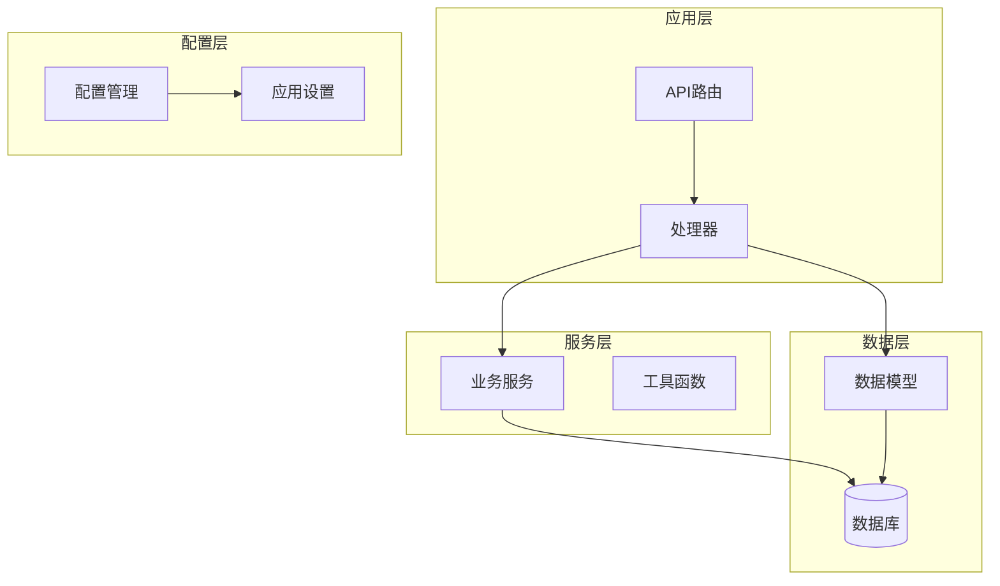

**图表来源**
- [main.py:44-62](file://python-backend/app/main.py#L44-L62)
- [models.py:1-228](file://python-backend/app/models.py#L1-L228)

**章节来源**
- [main.py:1-103](file://python-backend/app/main.py#L1-L103)
- [models.py:1-228](file://python-backend/app/models.py#L1-L228)

## 核心组件

### 数据模型关系

系统的核心数据模型包括订阅源、频道、条目、分类等实体，它们之间存在复杂的关联关系：

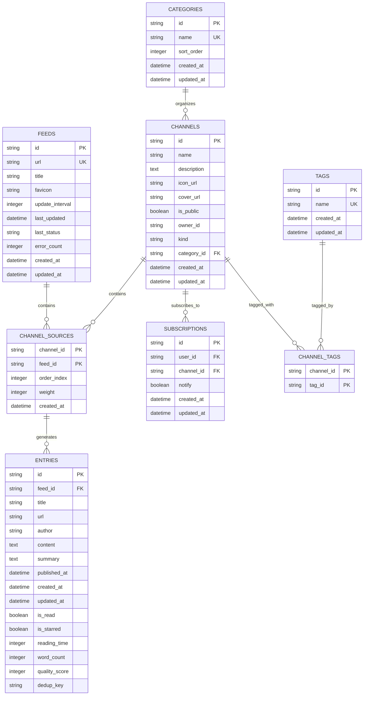

**图表来源**
- [models.py:7-228](file://python-backend/app/models.py#L7-L228)

**章节来源**
- [models.py:1-228](file://python-backend/app/models.py#L1-L228)

## 架构概览

系统采用分层架构设计，各层职责明确：

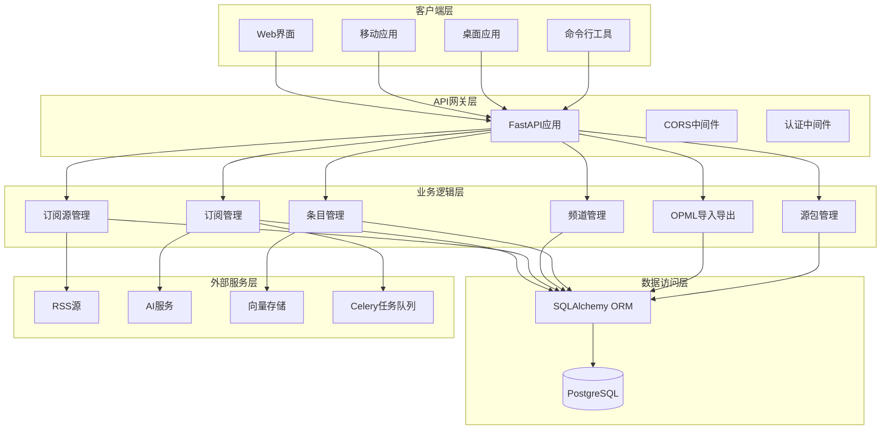

**图表来源**
- [main.py:28-62](file://python-backend/app/main.py#L28-L62)
- [rss_fetcher.py:104-312](file://python-backend/app/services/rss_fetcher.py#L104-L312)

## 详细组件分析

### 订阅管理API

#### 用户订阅接口

用户订阅管理是整个系统的核心功能之一，提供了完整的订阅生命周期管理：

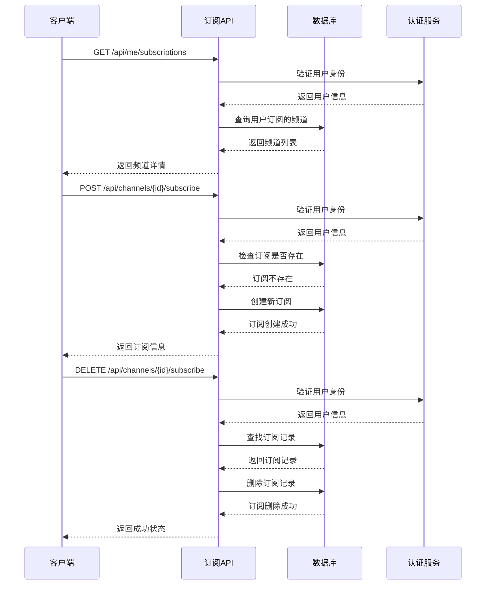

**图表来源**
- [subscriptions.py:49-107](file://python-backend/app/handlers/subscriptions.py#L49-L107)

**章节来源**
- [subscriptions.py:1-175](file://python-backend/app/handlers/subscriptions.py#L1-L175)

#### 订阅源管理接口

订阅源管理提供了对RSS源的完整CRUD操作：

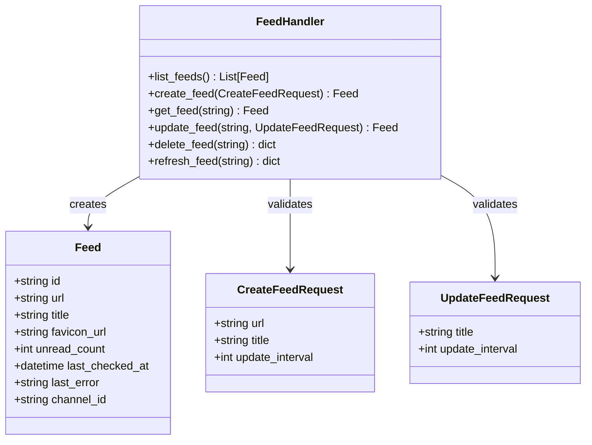

**图表来源**
- [feeds.py:20-477](file://python-backend/app/handlers/feeds.py#L20-L477)

**章节来源**
- [feeds.py:1-477](file://python-backend/app/handlers/feeds.py#L1-L477)

#### 频道管理接口

频道作为订阅的容器，提供了丰富的管理功能：

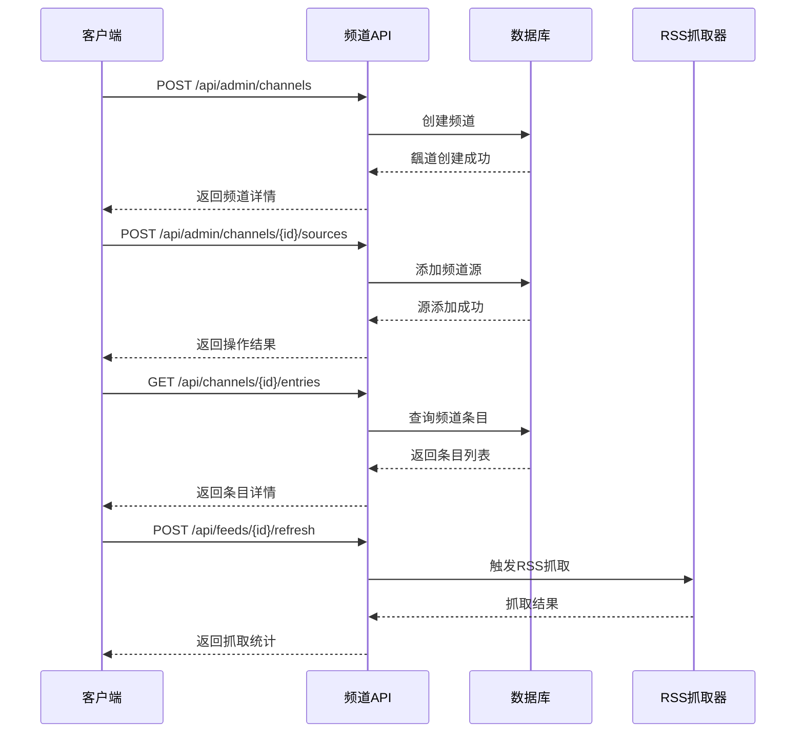

**图表来源**
- [channels.py:244-502](file://python-backend/app/handlers/channels.py#L244-L502)

**章节来源**
- [channels.py:1-502](file://python-backend/app/handlers/channels.py#L1-L502)

#### 条目管理接口

条目管理提供了对RSS文章的完整生命周期管理：

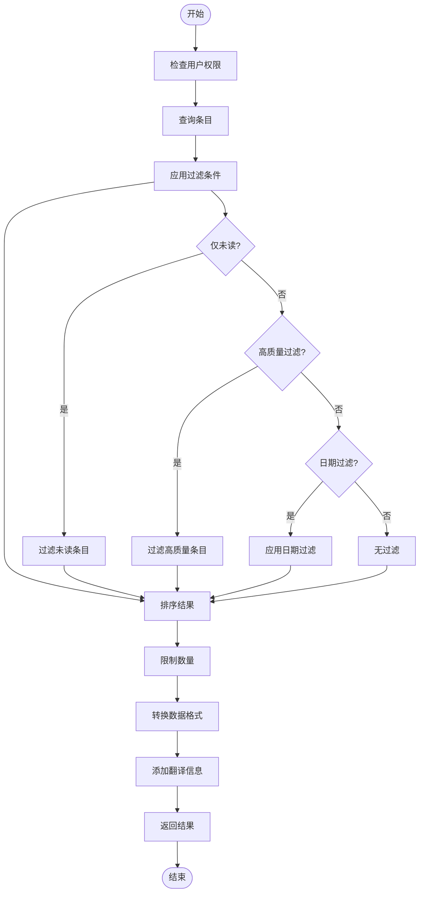

**图表来源**
- [entries.py:41-107](file://python-backend/app/handlers/entries.py#L41-L107)

**章节来源**
- [entries.py:1-310](file://python-backend/app/handlers/entries.py#L1-L310)

#### 分类和标签管理

系统支持对频道进行分类和标签管理：

```mermaid
classDiagram
class Category {
+string id
+string name
+int sort_order
+datetime created_at
+datetime updated_at
}
class Tag {
+string id
+string name
+datetime created_at
+datetime updated_at
}
class ChannelTag {
+string channel_id PK
+string tag_id PK
}
class CategoryHandler {
+list_public_categories() List[Category]
+list_categories() List[Category]
+create_category(CreateCategoryRequest) Category
+update_category(string, UpdateCategoryRequest) Category
+delete_category(string) dict
}
class TagHandler {
+list_tags() List[Tag]
+create_tag(CreateTagRequest) Tag
+delete_tag(string) dict
}
CategoryHandler --> Category : manages
TagHandler --> Tag : manages
Category ||--o{ Channel : organizes
Tag ||--o{ ChannelTag : tagged_by
Channel ||--o{ ChannelTag : tagged_with
```

**图表来源**
- [categories.py:18-123](file://python-backend/app/handlers/categories.py#L18-L123)
- [tags.py:18-73](file://python-backend/app/handlers/tags.py#L18-L73)

**章节来源**
- [categories.py:1-123](file://python-backend/app/handlers/categories.py#L1-L123)
- [tags.py:1-73](file://python-backend/app/handlers/tags.py#L1-L73)

#### OPML导入导出

系统支持标准的OPML格式导入导出功能：

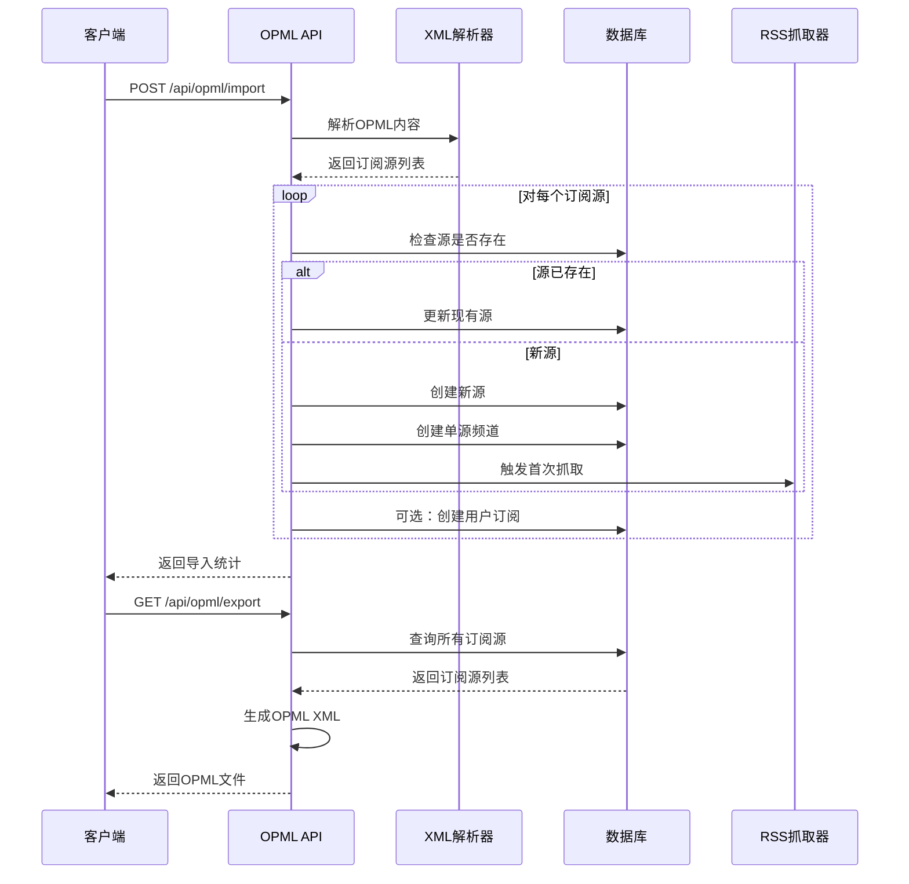

**图表来源**
- [opml.py:43-199](file://python-backend/app/handlers/opml.py#L43-L199)

**章节来源**
- [opml.py:1-199](file://python-backend/app/handlers/opml.py#L1-L199)

#### 源包管理

源包功能允许用户创建、分享和安装预定义的订阅源组合：

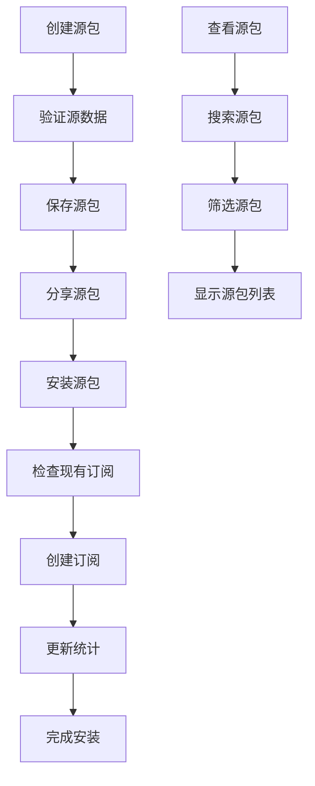

**图表来源**
- [source_packs.py:108-224](file://python-backend/app/handlers/source_packs.py#L108-L224)

**章节来源**
- [source_packs.py:1-277](file://python-backend/app/handlers/source_packs.py#L1-L277)

## 依赖关系分析

系统各组件之间的依赖关系如下：

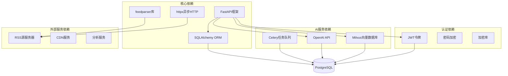

**图表来源**
- [rss_fetcher.py:1-312](file://python-backend/app/services/rss_fetcher.py#L1-L312)
- [main.py:1-103](file://python-backend/app/main.py#L1-L103)

**章节来源**
- [rss_fetcher.py:1-312](file://python-backend/app/services/rss_fetcher.py#L1-L312)
- [main.py:1-103](file://python-backend/app/main.py#L1-L103)

## 性能考虑

### 去重机制

系统实现了多层次的去重机制以避免重复内容：

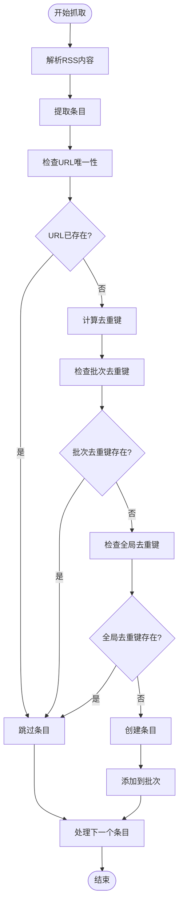

**图表来源**
- [rss_fetcher.py:13-27](file://python-backend/app/services/rss_fetcher.py#L13-L27)

### 缓存策略

系统采用了多级缓存策略：

1. **数据库缓存**：使用SQLAlchemy的查询缓存
2. **内存缓存**：Redis用于热点数据缓存
3. **静态资源缓存**：CDN加速图标和媒体资源
4. **API响应缓存**：针对不频繁变化的数据设置缓存头

### 性能优化

1. **批量操作**：支持批量创建、更新和删除操作
2. **异步处理**：使用async/await实现非阻塞I/O
3. **连接池**：数据库连接池管理
4. **分页查询**：默认限制每页100条记录
5. **索引优化**：为常用查询字段建立索引

## 故障排除指南

### 常见问题及解决方案

#### RSS抓取失败

**问题症状**：
- 订阅源状态显示错误
- 条目数量没有更新
- 抓取日志出现异常

**可能原因**：
1. RSS源服务器不可达
2. 网络连接超时
3. RSS格式不符合规范
4. 防爬虫机制拦截

**解决步骤**：
1. 检查RSS源URL是否正确
2. 测试网络连接和DNS解析
3. 查看服务器日志获取详细错误信息
4. 调整User-Agent和请求头
5. 检查防火墙和代理设置

#### 订阅管理异常

**问题症状**：
- 订阅无法创建或删除
- 订阅列表显示异常
- 用户权限验证失败

**解决步骤**：
1. 验证用户登录状态
2. 检查用户角色权限
3. 确认订阅源存在且有效
4. 查看数据库事务状态
5. 重启相关服务进程

#### OPML导入失败

**问题症状**：
- OPML文件导入后无效果
- 部分订阅源导入失败
- 导入进度异常中断

**解决步骤**：
1. 验证OPML文件格式正确性
2. 检查XML编码格式（UTF-8/Latin-1）
3. 确认订阅源URL有效性
4. 查看导入过程中的错误日志
5. 手动添加失败的订阅源

**章节来源**
- [rss_fetcher.py:104-312](file://python-backend/app/services/rss_fetcher.py#L104-L312)
- [opml.py:43-199](file://python-backend/app/handlers/opml.py#L43-L199)

## 结论

Tan RSS Reader的订阅管理API提供了完整的RSS订阅生命周期管理功能。通过模块化的架构设计和丰富的API端点，系统能够满足不同用户的需求。关键特性包括：

1. **完整的订阅管理**：支持用户的订阅创建、删除和查询
2. **强大的RSS源管理**：提供订阅源的CRUD操作和自动抓取
3. **灵活的内容过滤**：支持按多种条件过滤条目
4. **高效的去重机制**：避免重复内容的存储和展示
5. **标准化的导入导出**：支持OPML格式的标准交换
6. **可扩展的源包系统**：便于分享和批量安装订阅源

系统在设计上注重性能和可维护性，采用了现代化的技术栈和最佳实践。通过合理的架构分层和依赖管理，为未来的功能扩展奠定了良好的基础。