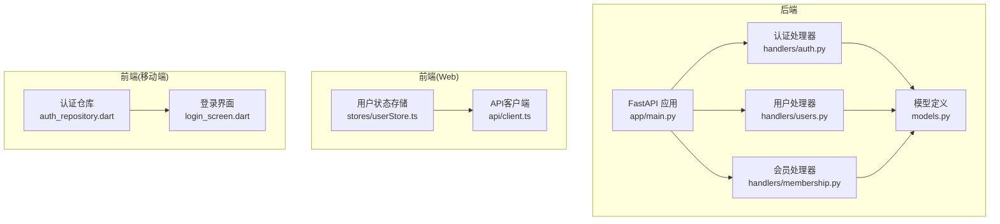
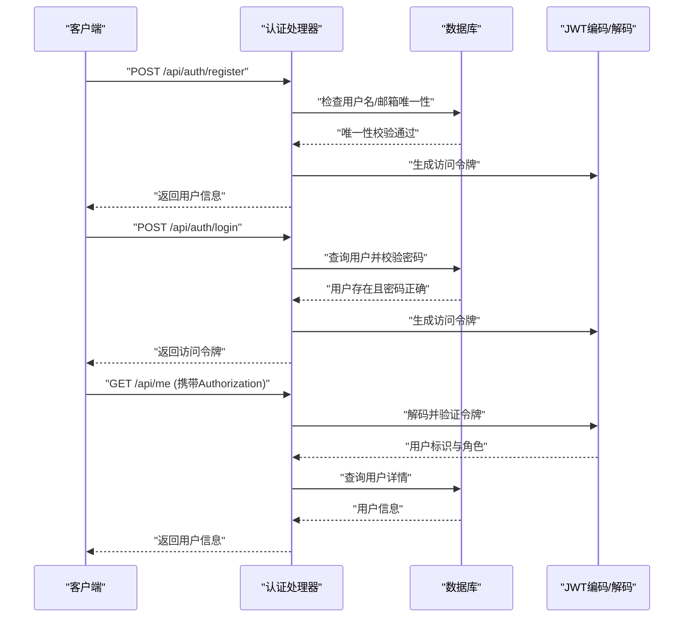
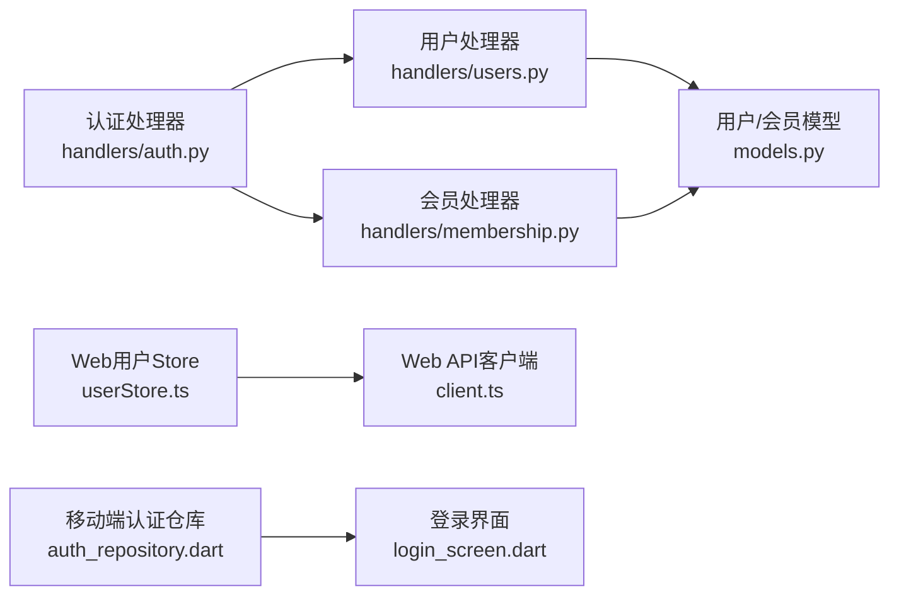

# 认证与授权API

<cite>
**本文档引用的文件**
- [python-backend/app/handlers/auth.py](file://python-backend/app/handlers/auth.py)
- [python-backend/app/handlers/users.py](file://python-backend/app/handlers/users.py)
- [python-backend/app/handlers/membership.py](file://python-backend/app/handlers/membership.py)
- [python-backend/app/models.py](file://python-backend/app/models.py)
- [python-backend/app/main.py](file://python-backend/app/main.py)
- [python-backend/app/config.py](file://python-backend/app/config.py)
- [rss-desktop/src/stores/userStore.ts](file://rss-desktop/src/stores/userStore.ts)
- [rss-desktop/src/api/client.ts](file://rss-desktop/src/api/client.ts)
- [tan_rss_mobile/lib/features/auth/data/auth_repository.dart](file://tan_rss_mobile/lib/features/auth/data/auth_repository.dart)
- [tan_rss_mobile/lib/features/auth/presentation/login_screen.dart](file://tan_rss_mobile/lib/features/auth/presentation/login_screen.dart)
</cite>

## 目录
1. [简介](#简介)
2. [项目结构](#项目结构)
3. [核心组件](#核心组件)
4. [架构总览](#架构总览)
5. [详细组件分析](#详细组件分析)
6. [依赖关系分析](#依赖关系分析)
7. [性能考量](#性能考量)
8. [故障排查指南](#故障排查指南)
9. [结论](#结论)
10. [附录](#附录)

## 简介
本文件面向Tan RSS Reader的认证与授权API，系统性梳理用户注册、登录、登出、用户信息查询、管理员用户管理、会员状态与订阅等接口。重点覆盖以下方面：
- 认证流程与JWT令牌管理
- 令牌有效期与刷新策略（当前实现未提供专用刷新端点）
- 权限验证与角色控制（普通用户、管理员）
- 请求参数、响应格式、错误码与安全考虑
- 客户端集成指南（Web与移动端）
- 会话管理、CSRF保护与安全最佳实践

## 项目结构
后端采用FastAPI框架，认证相关路由集中在认证处理器中，并通过依赖注入完成会话与权限校验；前端Web端使用Pinia状态管理与Axios拦截器处理认证态；移动端Flutter端通过Riverpod与Dio进行认证交互。

图表来源
- [python-backend/app/main.py:44-62](file://python-backend/app/main.py#L44-L62)
- [python-backend/app/handlers/auth.py:16-174](file://python-backend/app/handlers/auth.py#L16-L174)
- [python-backend/app/handlers/users.py:10-149](file://python-backend/app/handlers/users.py#L10-L149)
- [python-backend/app/handlers/membership.py:12-113](file://python-backend/app/handlers/membership.py#L12-L113)
- [rss-desktop/src/stores/userStore.ts:14-143](file://rss-desktop/src/stores/userStore.ts#L14-L143)
- [rss-desktop/src/api/client.ts:3-29](file://rss-desktop/src/api/client.ts#L3-L29)
- [tan_rss_mobile/lib/features/auth/data/auth_repository.dart:10-101](file://tan_rss_mobile/lib/features/auth/data/auth_repository.dart#L10-L101)
- [tan_rss_mobile/lib/features/auth/presentation/login_screen.dart:7-318](file://tan_rss_mobile/lib/features/auth/presentation/login_screen.dart#L7-L318)

章节来源
- [python-backend/app/main.py:44-62](file://python-backend/app/main.py#L44-L62)
- [python-backend/app/handlers/auth.py:16-174](file://python-backend/app/handlers/auth.py#L16-L174)
- [python-backend/app/handlers/users.py:10-149](file://python-backend/app/handlers/users.py#L10-L149)
- [python-backend/app/handlers/membership.py:12-113](file://python-backend/app/handlers/membership.py#L12-L113)
- [rss-desktop/src/stores/userStore.ts:14-143](file://rss-desktop/src/stores/userStore.ts#L14-L143)
- [rss-desktop/src/api/client.ts:3-29](file://rss-desktop/src/api/client.ts#L3-L29)
- [tan_rss_mobile/lib/features/auth/data/auth_repository.dart:10-101](file://tan_rss_mobile/lib/features/auth/data/auth_repository.dart#L10-L101)
- [tan_rss_mobile/lib/features/auth/presentation/login_screen.dart:7-318](file://tan_rss_mobile/lib/features/auth/presentation/login_screen.dart#L7-L318)

## 核心组件
- 认证处理器：提供注册、登录、当前用户信息查询、管理员用户管理、会员状态与订阅等接口。
- 用户模型：包含用户标识、凭据哈希、角色、激活状态等字段。
- 前端Web：通过Axios拦截器自动附加Authorization头，本地持久化令牌并处理401。
- 前端移动端：通过Riverpod与Dio封装认证仓库，本地校验令牌过期并清理无效令牌。

章节来源
- [python-backend/app/handlers/auth.py:126-174](file://python-backend/app/handlers/auth.py#L126-L174)
- [python-backend/app/handlers/users.py:30-149](file://python-backend/app/handlers/users.py#L30-L149)
- [python-backend/app/handlers/membership.py:28-113](file://python-backend/app/handlers/membership.py#L28-L113)
- [python-backend/app/models.py:168-178](file://python-backend/app/models.py#L168-L178)
- [rss-desktop/src/api/client.ts:8-26](file://rss-desktop/src/api/client.ts#L8-L26)
- [tan_rss_mobile/lib/features/auth/data/auth_repository.dart:15-101](file://tan_rss_mobile/lib/features/auth/data/auth_repository.dart#L15-L101)

## 架构总览
认证与授权的整体流程如下：
- 客户端向后端发起注册/登录请求
- 后端验证凭据，生成JWT访问令牌
- 客户端在后续请求中携带Authorization: Bearer <token>
- 后端通过中间件解码JWT，校验用户存在且激活，再执行业务逻辑
- 管理员端点仅对role=admin生效

图表来源
- [python-backend/app/handlers/auth.py:126-174](file://python-backend/app/handlers/auth.py#L126-L174)
- [python-backend/app/handlers/users.py:30-39](file://python-backend/app/handlers/users.py#L30-L39)
- [python-backend/app/models.py:168-178](file://python-backend/app/models.py#L168-L178)

## 详细组件分析

### 认证处理器（handlers/auth.py）
- 注册接口
  - 路径：/api/auth/register
  - 方法：POST
  - 请求体：用户名、密码、可选邮箱
  - 校验规则：用户名字母数字下划线横线且至少3字符；密码至少6字符；邮箱格式校验
  - 业务逻辑：检查唯一性，计算密码哈希，按是否首用户分配admin或user角色，写入数据库
  - 响应：用户信息（含角色与激活状态）
  - 错误码：400（重复/校验失败），409（并发冲突回滚）
- 登录接口
  - 路径：/api/auth/login
  - 方法：POST
  - 请求体：用户名、密码
  - 业务逻辑：查询用户并校验密码哈希，生成访问令牌
  - 响应：访问令牌（bearer）
  - 错误码：401（凭据错误）
- 当前用户接口
  - 路径：/api/me
  - 方法：GET
  - 鉴权：Authorization Bearer
  - 业务逻辑：解码JWT获取用户ID，查询用户并返回信息
  - 错误码：401（未携带或无效令牌）、403（非激活用户）
- 令牌解析与鉴权辅助
  - 解析Authorization头，校验Bearer前缀
  - 使用HS256算法解码JWT，提取sub与role
  - 查询用户并校验is_active
  - 提供管理员校验依赖（role=admin）

章节来源
- [python-backend/app/handlers/auth.py:29-68](file://python-backend/app/handlers/auth.py#L29-L68)
- [python-backend/app/handlers/auth.py:126-174](file://python-backend/app/handlers/auth.py#L126-L174)
- [python-backend/app/handlers/auth.py:91-125](file://python-backend/app/handlers/auth.py#L91-L125)
- [python-backend/app/handlers/auth.py:106-109](file://python-backend/app/handlers/auth.py#L106-L109)

### 用户管理处理器（handlers/users.py）
- 当前用户信息
  - 路径：/api/me
  - 方法：GET
  - 鉴权：get_current_user
  - 响应：用户信息（含创建时间ISO字符串）
- 管理员用户列表
  - 路径：/api/admin/users
  - 方法：GET
  - 鉴权：get_current_admin
  - 参数：limit（默认50，上限1000）、offset
  - 响应：用户列表（包含会员等级）
- 更新用户
  - 路径：/api/admin/users/{id}
  - 方法：PATCH
  - 鉴权：get_current_admin
  - 请求体：role、is_active、password、tier
  - 限制：禁止自我降级或停用自身账户
  - 响应：更新后的用户信息
- 删除用户
  - 路径：/api/admin/users/{id}
  - 方法：DELETE
  - 鉴权：get_current_admin
  - 限制：禁止删除自身；删除时需确保级联或手动清理关联数据
  - 响应：成功消息

章节来源
- [python-backend/app/handlers/users.py:30-39](file://python-backend/app/handlers/users.py#L30-L39)
- [python-backend/app/handlers/users.py:41-66](file://python-backend/app/handlers/users.py#L41-L66)
- [python-backend/app/handlers/users.py:68-124](file://python-backend/app/handlers/users.py#L68-L124)
- [python-backend/app/handlers/users.py:126-149](file://python-backend/app/handlers/users.py#L126-L149)

### 会员状态与订阅（handlers/membership.py）
- 会员状态
  - 路径：/api/membership/status
  - 方法：GET
  - 鉴权：get_current_user
  - 响应：包含tier、到期时间、是否有效、当日AI调用次数
- 订阅
  - 路径：/api/membership/subscribe
  - 方法：POST
  - 鉴权：get_current_user
  - 请求体：tier（plus/pro/free）、months（默认1）
  - 业务逻辑：免费降级直接更新；付费订阅模拟支付后延长有效期

章节来源
- [python-backend/app/handlers/membership.py:28-57](file://python-backend/app/handlers/membership.py#L28-L57)
- [python-backend/app/handlers/membership.py:59-113](file://python-backend/app/handlers/membership.py#L59-L113)

### 数据模型（models.py）
- 用户表（users）关键字段：id、username（唯一）、email（唯一，可空）、password_hash、role（默认user）、is_active（默认true）、created_at、updated_at
- 会员表（user_memberships）：user_id（唯一索引）、tier、expires_at
- 使用场景：认证处理器读取用户信息、管理员更新用户角色与激活状态、会员模块查询与更新会员状态

章节来源
- [python-backend/app/models.py:168-178](file://python-backend/app/models.py#L168-L178)
- [python-backend/app/models.py:179-187](file://python-backend/app/models.py#L179-L187)

### Web前端集成（rss-desktop）
- Axios拦截器自动附加Authorization头
- 登录成功后保存令牌到localStorage
- 401响应触发自定义事件，便于全局处理登出UI
- Pinia Store负责登录/注册、获取当前用户、登出等操作

章节来源
- [rss-desktop/src/api/client.ts:8-26](file://rss-desktop/src/api/client.ts#L8-L26)
- [rss-desktop/src/stores/userStore.ts:33-81](file://rss-desktop/src/stores/userStore.ts#L33-L81)
- [rss-desktop/src/stores/userStore.ts:83-87](file://rss-desktop/src/stores/userStore.ts#L83-L87)

### 移动端集成（tan_rss_mobile）
- Riverpod + Dio封装认证仓库
- 登录/注册调用后端认证接口
- 本地校验令牌过期并清理无效令牌
- 登录界面支持切换登录/注册模式与服务器地址配置

章节来源
- [tan_rss_mobile/lib/features/auth/data/auth_repository.dart:15-67](file://tan_rss_mobile/lib/features/auth/data/auth_repository.dart#L15-L67)
- [tan_rss_mobile/lib/features/auth/presentation/login_screen.dart:49-63](file://tan_rss_mobile/lib/features/auth/presentation/login_screen.dart#L49-L63)

## 依赖关系分析
- 认证处理器依赖数据库会话与用户模型，提供get_current_user与get_current_admin依赖，用于权限控制
- 用户与会员处理器依赖认证依赖注入，确保仅管理员可访问管理端点
- 前端通过统一的API客户端与拦截器，集中处理认证态与错误处理

图表来源
- [python-backend/app/handlers/auth.py:91-109](file://python-backend/app/handlers/auth.py#L91-L109)
- [python-backend/app/handlers/users.py:8](file://python-backend/app/handlers/users.py#L8)
- [python-backend/app/handlers/membership.py:10](file://python-backend/app/handlers/membership.py#L10)
- [rss-desktop/src/stores/userStore.ts:14-143](file://rss-desktop/src/stores/userStore.ts#L14-L143)
- [rss-desktop/src/api/client.ts:3-29](file://rss-desktop/src/api/client.ts#L3-L29)
- [tan_rss_mobile/lib/features/auth/data/auth_repository.dart:10-101](file://tan_rss_mobile/lib/features/auth/data/auth_repository.dart#L10-L101)
- [tan_rss_mobile/lib/features/auth/presentation/login_screen.dart:7-318](file://tan_rss_mobile/lib/features/auth/presentation/login_screen.dart#L7-L318)

## 性能考量
- 密码哈希：bcrypt，安全性高但计算成本较高，建议在高并发场景下评估CPU占用与延迟
- JWT解码：HS256算法轻量，适合无状态鉴权；令牌较长时注意网络开销
- 数据库查询：注册/登录涉及用户名/邮箱唯一性检查与用户查询，建议在用户名与邮箱字段建立唯一索引（模型已定义唯一约束）
- 会话与连接：后端使用异步SQLAlchemy会话，避免阻塞IO

## 故障排查指南
- 400错误（注册/更新用户）
  - 可能原因：用户名/邮箱重复、密码长度不足、邮箱格式不合法
  - 处理建议：检查输入参数与唯一性约束
- 401错误（登录/受保护接口）
  - 可能原因：缺少Authorization头、Bearer前缀缺失、令牌无效或过期、用户被停用
  - 处理建议：确认令牌格式与有效期；检查用户激活状态
- 403错误（管理员端点）
  - 可能原因：当前用户非admin
  - 处理建议：确认用户角色或使用具备管理员权限的账户
- 前端401处理
  - Web端：Axios拦截器检测401并触发自定义事件，建议在应用根部监听并执行登出与跳转
  - 移动端：本地校验令牌过期并清理无效令牌，避免重复请求失败

章节来源
- [python-backend/app/handlers/auth.py:129-130](file://python-backend/app/handlers/auth.py#L129-L130)
- [python-backend/app/handlers/auth.py:170-171](file://python-backend/app/handlers/auth.py#L170-L171)
- [python-backend/app/handlers/auth.py:92-99](file://python-backend/app/handlers/auth.py#L92-L99)
- [python-backend/app/handlers/auth.py:106-109](file://python-backend/app/handlers/auth.py#L106-L109)
- [rss-desktop/src/api/client.ts:20-25](file://rss-desktop/src/api/client.ts#L20-L25)
- [tan_rss_mobile/lib/features/auth/data/auth_repository.dart:86-99](file://tan_rss_mobile/lib/features/auth/data/auth_repository.dart#L86-L99)

## 结论
本认证体系基于JWT实现了标准的注册、登录与权限控制流程，结合前端拦截器与本地令牌持久化，提供了跨平台的一致体验。当前未提供专用的令牌刷新端点，建议在后续版本中引入刷新令牌机制或长周期令牌配合安全轮换策略，以提升用户体验与安全性。

## 附录

### API定义与调用示例

- 注册
  - 方法：POST
  - 路径：/api/auth/register
  - 请求体字段：username, password, email(可选)
  - 成功响应：用户信息（id, username, email, role, is_active）
  - 典型错误：400（重复/校验失败）
- 登录
  - 方法：POST
  - 路径：/api/auth/login
  - 请求体字段：username, password
  - 成功响应：{ access_token, token_type: "bearer" }
  - 典型错误：401（凭据错误）
- 获取当前用户
  - 方法：GET
  - 路径：/api/me
  - 请求头：Authorization: Bearer <token>
  - 成功响应：用户信息（含创建时间）
  - 典型错误：401（未认证/令牌无效），403（非激活用户）
- 管理员：列出用户
  - 方法：GET
  - 路径：/api/admin/users?limit=&offset=
  - 请求头：Authorization: Bearer <token>
  - 成功响应：用户列表（含tier）
  - 典型错误：401/403
- 管理员：更新用户
  - 方法：PATCH
  - 路径：/api/admin/users/{id}
  - 请求头：Authorization: Bearer <token>
  - 请求体字段：role(可选)、is_active(可选)、password(可选)、tier(可选)
  - 成功响应：更新后的用户信息
  - 典型错误：400（禁止自我降级/停用）、404（用户不存在）、401/403
- 管理员：删除用户
  - 方法：DELETE
  - 路径：/api/admin/users/{id}
  - 请求头：Authorization: Bearer <token>
  - 成功响应：{"message": "..."}
  - 典型错误：400（禁止删除自身）、404（用户不存在）、401/403
- 会员状态
  - 方法：GET
  - 路径：/api/membership/status
  - 请求头：Authorization: Bearer <token>
  - 成功响应：{ tier, expires_at, is_active, today_ai_calls }
- 订阅
  - 方法：POST
  - 路径：/api/membership/subscribe
  - 请求头：Authorization: Bearer <token>
  - 请求体字段：tier("plus"/"pro"/"free")、months(默认1)
  - 成功响应：订阅结果与到期时间

章节来源
- [python-backend/app/handlers/auth.py:126-174](file://python-backend/app/handlers/auth.py#L126-L174)
- [python-backend/app/handlers/users.py:30-149](file://python-backend/app/handlers/users.py#L30-L149)
- [python-backend/app/handlers/membership.py:28-113](file://python-backend/app/handlers/membership.py#L28-L113)

### 安全最佳实践
- 令牌管理
  - 建议引入刷新令牌机制，避免长期持有访问令牌
  - 在高风险操作（如修改密码、删除账户）要求二次验证
- 传输安全
  - 强制HTTPS，防止令牌在传输中泄露
- 存储安全
  - 仅在内存或安全存储中缓存令牌，避免明文落盘
- CSRF防护
  - 当前为无状态JWT，无需CSRF令牌；若未来引入Cookie会话，需启用SameSite与CSRF保护
- 输入校验
  - 严格校验用户名、密码、邮箱格式，拒绝空值与非法字符
- 角色与权限
  - 管理员端点必须通过role=admin校验
  - 禁止管理员自我降级或停用自身账户