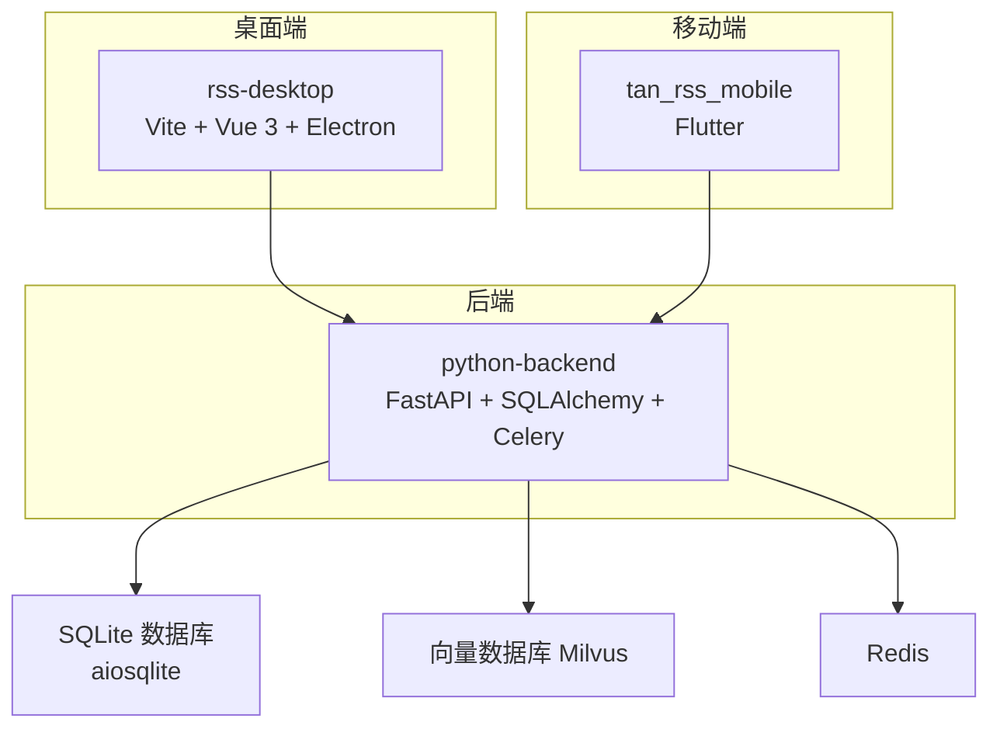
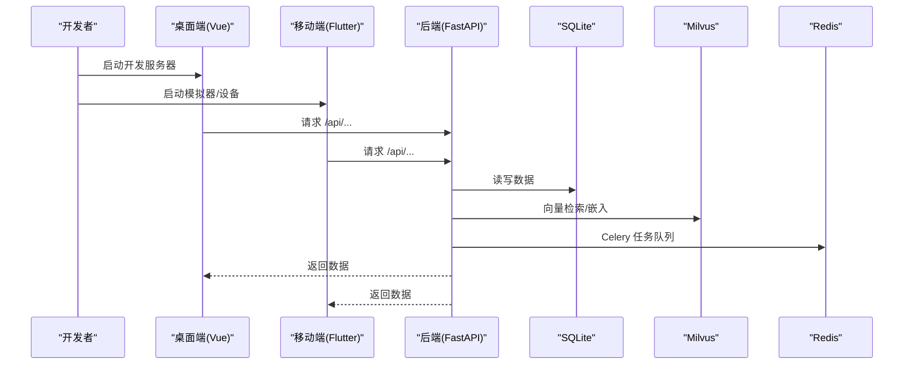
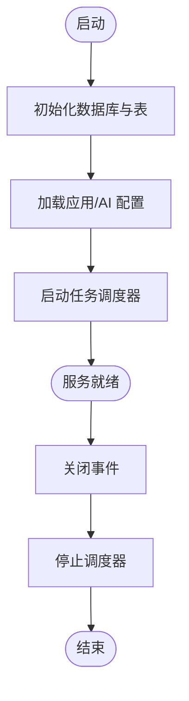
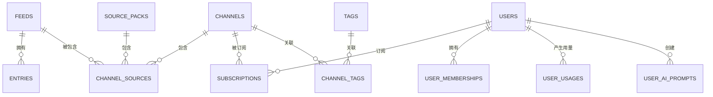
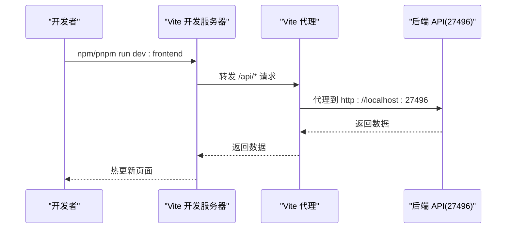
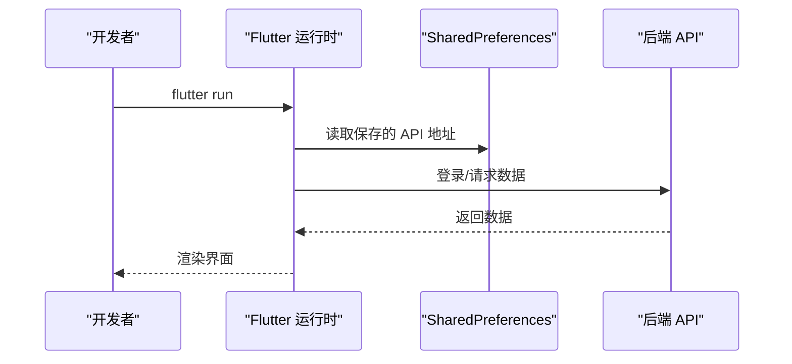
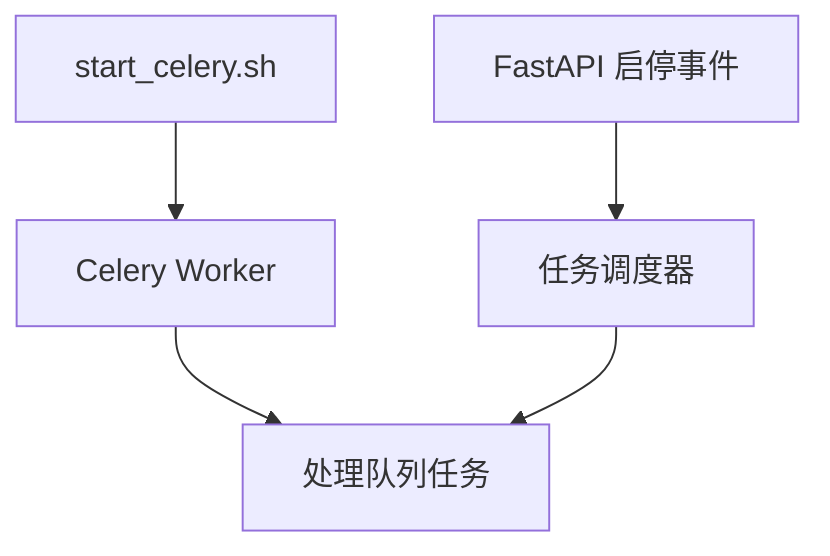
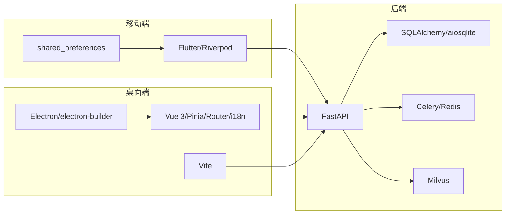

# 开发者指南

<cite>
**本文引用的文件**
- [todo.md](file://todo.md)
- [todo_vip.md](file://todo_vip.md)
- [start.sh](file://start.sh)
- [requirements.txt](file://python-backend/requirements.txt)
- [main.py](file://python-backend/app/main.py)
- [config.py](file://python-backend/app/config.py)
- [db.py](file://python-backend/app/db.py)
- [models.py](file://python-backend/app/models.py)
- [vite.config.ts](file://rss-desktop/vite.config.ts)
- [main.ts](file://rss-desktop/src/main.ts)
- [package.json](file://rss-desktop/package.json)
- [flutter_ci.yml](file://.github/workflows/flutter_ci.yml)
- [pubspec.yaml](file://tan_rss_mobile/pubspec.yaml)
- [main.dart](file://tan_rss_mobile/lib/main.dart)
- [analysis_options.yaml](file://tan_rss_mobile/analysis_options.yaml)
- [start_celery.sh](file://python-backend/scripts/start_celery.sh)
</cite>

## 目录
1. [简介](#简介)
2. [项目结构](#项目结构)
3. [核心组件](#核心组件)
4. [架构总览](#架构总览)
5. [详细组件分析](#详细组件分析)
6. [依赖关系分析](#依赖关系分析)
7. [性能考虑](#性能考虑)
8. [故障排查指南](#故障排查指南)
9. [结论](#结论)
10. [附录](#附录)

## 简介
本指南面向开发者，帮助你快速搭建 Tan RSS Reader 的开发环境，理解代码规范与最佳实践，掌握测试策略与贡献流程，并提供性能测试、安全审计与兼容性测试的落地建议。项目采用多端架构：桌面端基于 Electron + Vue 3 + Vite；移动端基于 Flutter；后端基于 Python + FastAPI + SQLAlchemy + Celery；数据库默认 SQLite，支持 Milvus 向量检索与 Redis/Celery 异步任务。

## 项目结构
项目由三个主要部分组成：
- 桌面端（Electron + Vue 3 + Vite）
- 移动端（Flutter）
- 后端（FastAPI + SQLAlchemy + Celery）

图表来源
- [main.py:1-103](file://python-backend/app/main.py#L1-L103)
- [db.py:1-27](file://python-backend/app/db.py#L1-L27)
- [vite.config.ts:1-55](file://rss-desktop/vite.config.ts#L1-L55)

章节来源
- [main.py:1-103](file://python-backend/app/main.py#L1-L103)
- [db.py:1-27](file://python-backend/app/db.py#L1-L27)
- [vite.config.ts:1-55](file://rss-desktop/vite.config.ts#L1-L55)

## 核心组件
- 后端 API 服务：基于 FastAPI，统一挂载各业务路由（认证、订阅、条目、AI、向量等），启动时初始化数据库表与配置，关闭时停止调度器。
- 数据模型：使用 SQLAlchemy ORM 定义 Feed、Entry、Channel、User、AI 配置、向量摘要等核心实体。
- 桌面端应用：Vue 3 + Pinia + Vue Router + i18n，开发时通过 Vite 代理后端 API，构建 Electron 应用。
- 移动端应用：Flutter Riverpod 状态管理，SharedPreferences 存储基础配置，Material 3 主题与本地化。
- 异步任务：Celery + Redis，脚本入口位于后端 scripts 目录。

章节来源
- [main.py:1-103](file://python-backend/app/main.py#L1-L103)
- [models.py:1-228](file://python-backend/app/models.py#L1-L228)
- [main.ts:1-9](file://rss-desktop/src/main.ts#L1-L9)
- [main.dart:1-153](file://tan_rss_mobile/lib/main.dart#L1-L153)
- [start_celery.sh:1-5](file://python-backend/scripts/start_celery.sh#L1-L5)

## 架构总览
后端作为统一入口，提供 REST API；桌面端与移动端分别消费 API 并渲染界面；数据库负责持久化；向量数据库与 Redis 支持 AI 与异步任务能力。

图表来源
- [main.py:1-103](file://python-backend/app/main.py#L1-L103)
- [db.py:1-27](file://python-backend/app/db.py#L1-L27)
- [config.py:1-75](file://python-backend/app/config.py#L1-L75)
- [vite.config.ts:1-55](file://rss-desktop/vite.config.ts#L1-L55)

## 详细组件分析

### 后端服务与路由
- 启动与关闭：在 startup 事件中创建数据库表、迁移字段、加载应用与 AI 配置、启动任务调度器；shutdown 事件中停止调度器。
- 路由组织：集中注册各类业务路由（认证、订阅、条目、AI、向量、OPML 等），统一前缀 /api。
- 配置管理：AppSettings 与 EnvSettings 分别管理应用参数与环境变量，支持从 .env 加载。

图表来源
- [main.py:64-103](file://python-backend/app/main.py#L64-L103)
- [config.py:1-75](file://python-backend/app/config.py#L1-L75)

章节来源
- [main.py:1-103](file://python-backend/app/main.py#L1-L103)
- [config.py:1-75](file://python-backend/app/config.py#L1-L75)

### 数据模型与关系
- 关键实体：Feed、Entry、SiteIcon、EntryAI、RSSHubConfig、AIDailyDigest、AppSettingsRow、AIConfigRow、Channel、Category、Tag、ChannelTag、ChannelSource、User、UserMembership、UserUsage、UserAIPrompt、Subscription、SourcePack。
- 字段设计：涵盖标题、URL、作者、内容、摘要、发布时间、阅读时间、词数、质量分、去重键、用户角色与会员等级、使用统计、提示词等。
- 外键与索引：通过外键关联用户、频道、订阅、标签等，对常用查询字段建立索引提升性能。

图表来源
- [models.py:1-228](file://python-backend/app/models.py#L1-L228)

章节来源
- [models.py:1-228](file://python-backend/app/models.py#L1-L228)

### 桌面端应用
- 入口与状态：main.ts 创建 Vue 应用，注册 Pinia、Router、i18n。
- 开发服务器：Vite 配置代理到后端 27496 端口，支持 host 与热更新。
- 构建与打包：package.json 提供 dev、build、pack、web 构建脚本，Electron 打包配置于 electron-builder.json5。

图表来源
- [main.ts:1-9](file://rss-desktop/src/main.ts#L1-L9)
- [vite.config.ts:1-55](file://rss-desktop/vite.config.ts#L1-L55)
- [package.json:1-81](file://rss-desktop/package.json#L1-L81)

章节来源
- [main.ts:1-9](file://rss-desktop/src/main.ts#L1-L9)
- [vite.config.ts:1-55](file://rss-desktop/vite.config.ts#L1-L55)
- [package.json:1-81](file://rss-desktop/package.json#L1-L81)

### 移动端应用
- 入口与主题：main.dart 初始化 SharedPreferences、设置 API 基础地址、注册语言包、Material 3 主题与深色模式。
- 状态管理：Riverpod 提供主题、认证等状态；SharedPreferences 存储用户偏好。
- 依赖与构建：pubspec.yaml 管理依赖与构建配置；analysis_options.yaml 统一 Lint 规则。

图表来源
- [main.dart:1-153](file://tan_rss_mobile/lib/main.dart#L1-L153)
- [pubspec.yaml:1-112](file://tan_rss_mobile/pubspec.yaml#L1-L112)
- [analysis_options.yaml:1-29](file://tan_rss_mobile/analysis_options.yaml#L1-L29)

章节来源
- [main.dart:1-153](file://tan_rss_mobile/lib/main.dart#L1-L153)
- [pubspec.yaml:1-112](file://tan_rss_mobile/pubspec.yaml#L1-L112)
- [analysis_options.yaml:1-29](file://tan_rss_mobile/analysis_options.yaml#L1-L29)

### 异步任务与 Celery
- 启动方式：脚本设置 PYTHONPATH 并以 app.celery_app 为入口启动 worker。
- 集成位置：后端主程序在 startup 事件中启动任务调度器，在 shutdown 事件中停止。

图表来源
- [start_celery.sh:1-5](file://python-backend/scripts/start_celery.sh#L1-L5)
- [main.py:64-103](file://python-backend/app/main.py#L64-L103)

章节来源
- [start_celery.sh:1-5](file://python-backend/scripts/start_celery.sh#L1-L5)
- [main.py:64-103](file://python-backend/app/main.py#L64-L103)

## 依赖关系分析
- 后端依赖：FastAPI、Uvicorn、SQLAlchemy、aiosqlite、Celery、Redis、PyJWT、Passlib、Milvus SDK、sklearn、feedparser、httpx、APScheduler 等。
- 桌面端依赖：Vue 3、Pinia、Vue Router、Vue i18n、Axios、Chart.js、Electron、electron-builder、Vite 等。
- 移动端依赖：Flutter 生态、Riverpod、shared_preferences、intl、timeago、flutter_html、dio、sqflite 等。

图表来源
- [requirements.txt:1-18](file://python-backend/requirements.txt#L1-L18)
- [package.json:1-81](file://rss-desktop/package.json#L1-L81)
- [pubspec.yaml:1-112](file://tan_rss_mobile/pubspec.yaml#L1-L112)

章节来源
- [requirements.txt:1-18](file://python-backend/requirements.txt#L1-L18)
- [package.json:1-81](file://rss-desktop/package.json#L1-L81)
- [pubspec.yaml:1-112](file://tan_rss_mobile/pubspec.yaml#L1-L112)

## 性能考虑
- 数据库与索引：为高频查询字段（如 entries.dedup_key、entries.feed_id、ai_configs.auto_quality_scoring 等）建立索引，避免全表扫描。
- 异步任务：使用 Celery + Redis 将耗时任务（如向量化、翻译、摘要）放入队列，避免阻塞主请求。
- 向量检索：合理配置 Milvus 连接参数与集合名，批量插入与查询时注意分页与超时设置。
- 前端性能：Vite 已启用热更新与按需打包；桌面端代理仅在开发环境生效，生产构建应直连后端。
- 移动端性能：避免在主线程执行重 IO；使用 Riverpod 管理状态，减少不必要的重建。

## 故障排查指南
- 后端无法启动
  - 检查 Python 版本与虚拟环境是否正确激活，依赖是否安装完整。
  - 查看数据库路径与权限，确保 data 目录可写。
  - 端口占用：确认 27496 未被占用。
- 前端无法访问后端
  - 检查 Vite 代理配置是否指向正确的后端地址。
  - 确认 CORS 设置允许来自前端的请求。
- Celery 任务不执行
  - 确认 Redis 可用且连接正常。
  - 使用脚本启动 worker 并查看日志。
- 移动端登录失败
  - 检查 SharedPreferences 是否保存了正确的 API 基础地址。
  - 确认后端认证接口返回有效令牌。

章节来源
- [start.sh:1-94](file://start.sh#L1-L94)
- [vite.config.ts:1-55](file://rss-desktop/vite.config.ts#L1-L55)
- [db.py:1-27](file://python-backend/app/db.py#L1-L27)
- [start_celery.sh:1-5](file://python-backend/scripts/start_celery.sh#L1-L5)
- [main.dart:1-153](file://tan_rss_mobile/lib/main.dart#L1-L153)

## 结论
本指南提供了 Tan RSS Reader 的开发环境搭建、代码规范与最佳实践、测试策略、贡献流程以及性能与安全方面的建议。建议团队在日常开发中遵循统一的命名与注释规范，严格执行 CI 流程，并持续完善测试覆盖与文档维护。

## 附录

### 开发环境搭建
- 后端
  - 使用 Python 3.10+，创建并激活虚拟环境，安装 requirements.txt 中的依赖。
  - 在项目根目录执行启动脚本，自动安装依赖并启动后端服务。
- 桌面端
  - 安装 Node.js 18+ 与 pnpm 8+，执行依赖安装后启动开发服务器。
  - 开发服务器通过代理转发 /api 到后端 27496 端口。
- 移动端
  - 安装 Flutter 3.29+，在 tan_rss_mobile 目录执行依赖安装与运行命令。
  - 使用分析工具与 Lint 规则保证代码质量。

章节来源
- [start.sh:1-94](file://start.sh#L1-L94)
- [requirements.txt:1-18](file://python-backend/requirements.txt#L1-L18)
- [package.json:1-81](file://rss-desktop/package.json#L1-L81)
- [flutter_ci.yml:1-43](file://.github/workflows/flutter_ci.yml#L1-L43)
- [analysis_options.yaml:1-29](file://tan_rss_mobile/analysis_options.yaml#L1-L29)

### 代码规范与最佳实践
- 命名约定
  - Python：类名使用 PascalCase，函数与变量使用 snake_case；SQLAlchemy 模型类名使用单数形式。
  - TypeScript/Vue：组件与页面使用 PascalCase，文件与方法使用 camelCase。
  - Dart：类名使用 PascalCase，方法与变量使用 camelCase。
- 注释标准
  - 函数与类需提供清晰的用途说明与参数/返回值说明。
  - 关键业务逻辑与算法处补充注释，便于他人理解。
- 架构原则
  - 单一职责：每个模块/文件聚焦于特定功能。
  - 依赖倒置：上层模块不依赖下层具体实现，通过抽象交互。
  - 最小暴露：对外仅暴露必要接口，内部细节封装。

### 测试策略
- 单元测试
  - Python：在 tests 目录编写针对服务与工具函数的单元测试。
  - Flutter：使用 flutter_test 编写 Widget 与 Model 测试。
- 集成测试
  - 桌面端：通过 Vite 代理与后端联调，验证路由与 API 交互。
  - 移动端：在模拟器/设备上验证登录、订阅、阅读等流程。
- 端到端测试
  - 使用自动化测试框架（如 Cypress/E2E）覆盖关键用户路径。
- CI/CD
  - GitHub Actions 对 Flutter 项目执行分析、测试与 APK 构建。

章节来源
- [.github/workflows/flutter_ci.yml:1-43](file://.github/workflows/flutter_ci.yml#L1-L43)
- [flutter_ci.yml:1-43](file://.github/workflows/flutter_ci.yml#L1-L43)

### 贡献流程
- Git 工作流
  - 使用分支开发特性，提交前运行分析与测试。
  - 提交信息清晰描述变更内容与动机。
- 代码审查
  - 至少一名维护者审查，关注安全性、性能与可维护性。
- 发布流程
  - 后端：更新版本号与依赖，部署至服务器。
  - 桌面端：使用 electron-builder 打包，发布到分发渠道。
  - 移动端：生成签名包并发布到应用商店或分发平台。

### 性能测试、安全审计与兼容性测试
- 性能测试
  - 使用压测工具对后端接口进行并发测试，记录响应时间与吞吐量。
  - 前端使用浏览器性能面板分析首屏与交互延迟。
  - 移动端使用性能分析工具定位卡顿与内存泄漏。
- 安全审计
  - 定期扫描依赖漏洞，及时更新。
  - 强制 HTTPS 传输，校验 JWT 令牌有效性。
  - 输入校验与输出转义，防止注入与 XSS。
- 兼容性测试
  - 桌面端：在主流操作系统上验证 Electron 应用。
  - 移动端：覆盖主流 Android/iOS 版本与设备分辨率。

### 文档维护与版本管理
- 文档维护
  - 重要变更同步更新 README 与开发者指南。
  - API 变更在后端与前端同步更新契约与示例。
- 版本管理
  - 使用语义化版本号，明确主次补丁版本含义。
  - 发布前准备变更日志，记录破坏性变更与修复项。
- 社区参与
  - 鼓励 Issue 与 PR，提供清晰的贡献指引与行为准则。

### 产品与技术规划参考
- 产品理念与功能规划：参考产品规划文档，明确“AI 编辑部”模式、结构化简报、Mark 与深度解读、噪音过滤与智能策展、Source Packs 与去重中间层等方向。
- 会员体系与用户级 AI 配置：参考 VIP 规划文档，明确会员等级、权限验证、订阅管理与特权扩展机制。

章节来源
- [todo.md:1-26](file://todo.md#L1-L26)
- [todo_vip.md:1-31](file://todo_vip.md#L1-L31)