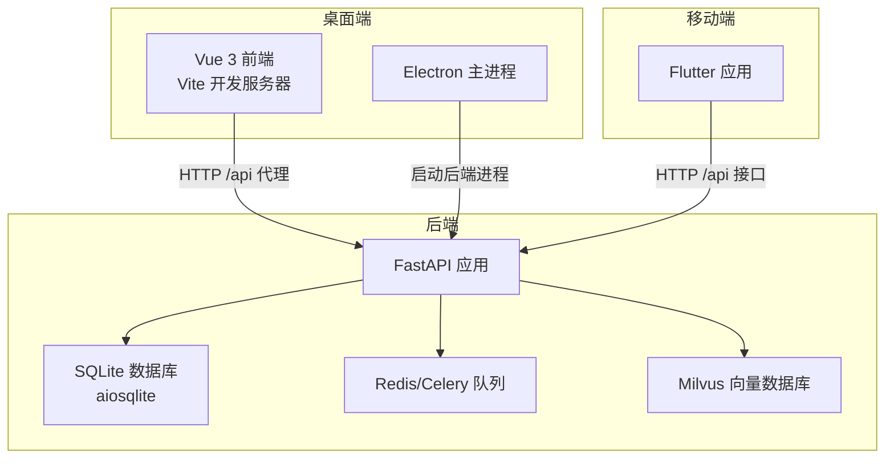
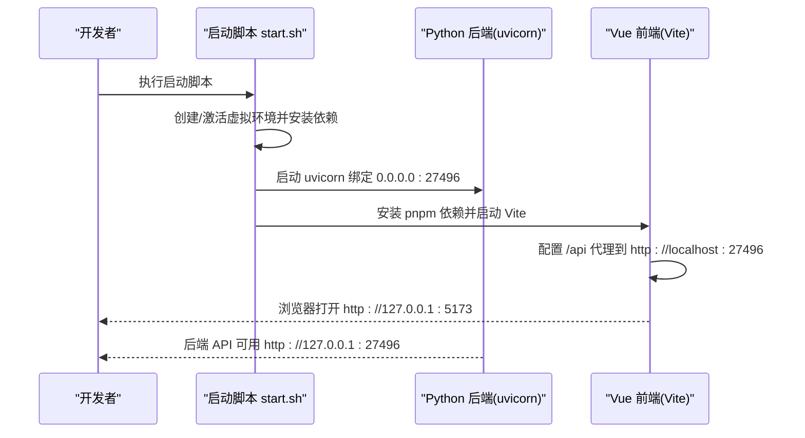
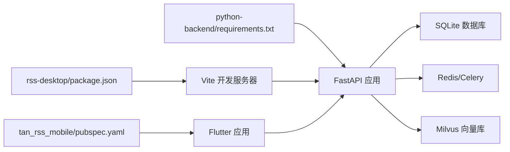

# 快速开始

<cite>
**本文引用的文件**
- [start.sh](file://start.sh)
- [python-backend/requirements.txt](file://python-backend/requirements.txt)
- [python-backend/app/config.py](file://python-backend/app/config.py)
- [python-backend/app/main.py](file://python-backend/app/main.py)
- [python-backend/app/db.py](file://python-backend/app/db.py)
- [python-backend/app/models.py](file://python-backend/app/models.py)
- [python-backend/seed_channels.py](file://python-backend/seed_channels.py)
- [python-backend/scripts/start_celery.sh](file://python-backend/scripts/start_celery.sh)
- [rss-desktop/package.json](file://rss-desktop/package.json)
- [rss-desktop/vite.config.ts](file://rss-desktop/vite.config.ts)
- [rss-desktop/resources/start-backend.sh](file://rss-desktop/resources/start-backend.sh)
- [rss-desktop/src/main.ts](file://rss-desktop/src/main.ts)
- [tan_rss_mobile/pubspec.yaml](file://tan_rss_mobile/pubspec.yaml)
- [tan_rss_mobile/lib/main.dart](file://tan_rss_mobile/lib/main.dart)
</cite>

## 目录
1. [简介](#简介)
2. [项目结构](#项目结构)
3. [核心组件](#核心组件)
4. [架构总览](#架构总览)
5. [详细组件分析](#详细组件分析)
6. [依赖关系分析](#依赖关系分析)
7. [性能考虑](#性能考虑)
8. [故障排除指南](#故障排除指南)
9. [结论](#结论)
10. [附录](#附录)

## 简介
本指南面向新手开发者，帮助你在约30分钟内完成 Tan RSS Reader 的环境搭建与首次运行。你将学到：
- Python 后端依赖安装与数据库初始化
- Node.js 与 pnpm 环境配置
- Flutter 移动端开发环境准备
- AI 服务配置与 Milvus 向量数据库准备
- 多平台启动流程与常用脚本使用
- 常见问题排查与性能优化建议

## 项目结构
该项目采用多模块架构：
- 后端：Python FastAPI 应用，提供 REST API、定时任务与向量化能力
- 桌面端：Vue 3 + Vite + Electron 应用，通过代理访问后端 API
- 移动端：Flutter 应用，通过 HTTP 客户端访问后端 API
- 数据库：SQLite（默认），支持自定义连接串；向量数据库使用 Milvus

图表来源
- [rss-desktop/vite.config.ts:46-52](file://rss-desktop/vite.config.ts#L46-L52)
- [rss-desktop/resources/start-backend.sh:11-28](file://rss-desktop/resources/start-backend.sh#L11-L28)
- [python-backend/app/main.py:44-62](file://python-backend/app/main.py#L44-L62)
- [python-backend/app/db.py:24-25](file://python-backend/app/db.py#L24-L25)

章节来源
- [rss-desktop/package.json:41-54](file://rss-desktop/package.json#L41-L54)
- [rss-desktop/vite.config.ts:46-52](file://rss-desktop/vite.config.ts#L46-L52)
- [python-backend/app/main.py:44-62](file://python-backend/app/main.py#L44-L62)

## 核心组件
- 后端服务（FastAPI）
  - 自动创建 SQLite 表结构，启动时迁移字段
  - 提供认证、订阅、条目、AI、向量等路由
- 数据库（SQLite）
  - 默认使用本地 sqlite+aiosqlite，路径位于 python-backend/data/rss.db
  - 支持通过环境变量覆盖数据库 URL
- AI 与向量系统
  - AI 配置支持平台默认配置与用户级覆盖
  - 向量数据库默认连接 localhost:19530，集合名 rss_entries
- 桌面端（Vue 3 + Electron）
  - Vite 开发服务器监听 5174，代理 /api 到后端 27496
  - Electron 模式下打包主进程与渲染进程
- 移动端（Flutter）
  - 通过 Dio 客户端访问后端 API
  - 支持主题、语言、登录态持久化

章节来源
- [python-backend/app/main.py:64-98](file://python-backend/app/main.py#L64-L98)
- [python-backend/app/db.py:11-22](file://python-backend/app/db.py#L11-L22)
- [python-backend/app/config.py:41-71](file://python-backend/app/config.py#L41-L71)
- [rss-desktop/vite.config.ts:43-52](file://rss-desktop/vite.config.ts#L43-L52)
- [tan_rss_mobile/lib/main.dart:40-54](file://tan_rss_mobile/lib/main.dart#L40-L54)

## 架构总览
下面的序列图展示了“启动后端 + 启动前端”的典型流程。

图表来源
- [start.sh:30-76](file://start.sh#L30-L76)
- [rss-desktop/vite.config.ts:46-52](file://rss-desktop/vite.config.ts#L46-L52)

章节来源
- [start.sh:30-76](file://start.sh#L30-L76)
- [rss-desktop/vite.config.ts:43-52](file://rss-desktop/vite.config.ts#L43-L52)

## 详细组件分析

### Python 后端环境与依赖
- Python 版本要求
  - 使用 python3 命令进行虚拟环境创建与依赖安装
- 依赖安装
  - 使用 requirements.txt 安装 FastAPI、SQLAlchemy、Celery、Redis、Milvus 等
- 数据库初始化
  - 启动时自动创建表并尝试添加新字段（如 branding_toggle、quality_score、auto_quality_scoring）
- AI 与向量配置
  - 通过环境变量或 .env 文件设置 Redis、Milvus、AI 服务地址与密钥
  - 启动时读取默认 AI 配置并合并用户级配置

章节来源
- [start.sh:33-48](file://start.sh#L33-L48)
- [python-backend/requirements.txt:1-18](file://python-backend/requirements.txt#L1-L18)
- [python-backend/app/main.py:64-98](file://python-backend/app/main.py#L64-L98)
- [python-backend/app/config.py:41-71](file://python-backend/app/config.py#L41-L71)
- [python-backend/app/db.py:11-22](file://python-backend/app/db.py#L11-L22)

### 数据库初始化与种子数据
- 初始化流程
  - 启动时自动创建所有表
  - 尝试新增字段，兼容升级
- 种子数据
  - 提供 seed_channels.py 用于快速创建演示用的 Feed、Channel 与关联关系

章节来源
- [python-backend/app/main.py:64-98](file://python-backend/app/main.py#L64-L98)
- [python-backend/seed_channels.py:13-99](file://python-backend/seed_channels.py#L13-L99)

### AI 服务与向量数据库配置
- AI 服务配置
  - 平台默认配置可通过环境变量覆盖
  - 用户可在个人配置中覆盖 AI 密钥、基础地址与模型
- 向量数据库
  - 默认连接 localhost:19530，集合名为 rss_entries
  - 可在用户配置中指定自定义 Milvus 地址

章节来源
- [python-backend/app/config.py:17-39](file://python-backend/app/config.py#L17-L39)
- [python-backend/app/handlers/ai.py:34-64](file://python-backend/app/handlers/ai.py#L34-L64)
- [python-backend/app/handlers/ai.py:141-152](file://python-backend/app/handlers/ai.py#L141-L152)

### 桌面端应用（Vue 3 + Electron）
- 开发与构建
  - pnpm 脚本提供 dev:frontend、dev:electron、build、pack 等
  - Vite 开发服务器默认端口 5174，开启 /api 代理到后端 27496
- Electron 打包
  - resources/start-backend.sh 用于在桌面应用中启动后端并执行 Rust 后端二进制

章节来源
- [rss-desktop/package.json:41-54](file://rss-desktop/package.json#L41-L54)
- [rss-desktop/vite.config.ts:43-52](file://rss-desktop/vite.config.ts#L43-L52)
- [rss-desktop/resources/start-backend.sh:11-28](file://rss-desktop/resources/start-backend.sh#L11-L28)
- [rss-desktop/src/main.ts:1-9](file://rss-desktop/src/main.ts#L1-L9)

### 移动端应用（Flutter）
- 依赖与版本
  - SDK 版本要求与依赖项在 pubspec.yaml 中声明
- 运行与配置
  - 应用启动时从 SharedPreferences 读取 API 基础地址，若存在则覆盖默认值
  - 支持主题、语言、登录态持久化

章节来源
- [tan_rss_mobile/pubspec.yaml:21-22](file://tan_rss_mobile/pubspec.yaml#L21-L22)
- [tan_rss_mobile/lib/main.dart:40-54](file://tan_rss_mobile/lib/main.dart#L40-L54)

### Celery 任务队列（可选）
- 启动方式
  - 通过 scripts/start_celery.sh 在项目根目录启动 Celery 工作进程
  - 需要 Redis 作为消息中间件

章节来源
- [python-backend/scripts/start_celery.sh:1-5](file://python-backend/scripts/start_celery.sh#L1-L5)

## 依赖关系分析

图表来源
- [python-backend/requirements.txt:1-18](file://python-backend/requirements.txt#L1-L18)
- [rss-desktop/package.json:41-54](file://rss-desktop/package.json#L41-L54)
- [tan_rss_mobile/pubspec.yaml:21-22](file://tan_rss_mobile/pubspec.yaml#L21-L22)

章节来源
- [python-backend/requirements.txt:1-18](file://python-backend/requirements.txt#L1-L18)
- [rss-desktop/package.json:41-54](file://rss-desktop/package.json#L41-L54)
- [tan_rss_mobile/pubspec.yaml:21-22](file://tan_rss_mobile/pubspec.yaml#L21-L22)

## 性能考虑
- 数据库
  - SQLite 适合开发与小规模使用；生产建议迁移到 PostgreSQL 并配置连接池
  - 启动时的表迁移与字段变更仅在首次或升级时发生，避免频繁 IO
- AI 请求
  - 后端对 AI 服务请求有重试与限流处理；合理设置超时与并发
  - 对于大文本摘要，建议限制输入长度以控制成本与延迟
- 向量检索
  - Milvus 查询需关注索引与分区策略；批量插入前先构建索引
- 前端
  - Vite 开发服务器热更新与代理已启用；生产构建建议开启压缩与缓存

## 故障排除指南
- 后端无法启动（uvicorn）
  - 确认 Python 虚拟环境已激活，依赖已安装
  - 检查端口 27496 是否被占用
  - 查看启动脚本输出，确认数据库路径与权限
- 前端无法访问后端 API
  - 确认 Vite 代理已配置到 http://localhost:27496
  - 检查浏览器网络面板与 CORS 设置
- 数据库连接失败
  - 确认 SQLite 文件可写；或设置 PY_BACKEND_DB_URL 环境变量指向自定义数据库
- AI 服务报错或无响应
  - 检查 AURORA_AI_* 环境变量是否正确
  - 若使用自有密钥，确认 base_url 与模型名称
- Celery 任务不执行
  - 确认 Redis 可用；查看 Celery 日志
- 种子数据未生效
  - 确认已执行 seed_channels.py 并成功提交事务

章节来源
- [start.sh:33-48](file://start.sh#L33-L48)
- [rss-desktop/vite.config.ts:46-52](file://rss-desktop/vite.config.ts#L46-L52)
- [python-backend/app/db.py:11-22](file://python-backend/app/db.py#L11-L22)
- [python-backend/app/config.py:57-61](file://python-backend/app/config.py#L57-L61)
- [python-backend/scripts/start_celery.sh:1-5](file://python-backend/scripts/start_celery.sh#L1-L5)
- [python-backend/seed_channels.py:13-99](file://python-backend/seed_channels.py#L13-L99)

## 结论
按照本指南，你可以在 30 分钟内完成环境搭建、数据库初始化、AI 与向量配置，并成功启动后端与桌面端应用。移动端可随时接入同一套后端 API。遇到问题时，可依据“故障排除指南”逐项定位。

## 附录

### 环境与工具要求
- Python 3.x（推荐使用 3.10+）
- Node.js >= 18，pnpm >= 8
- Flutter SDK（移动端）
- Redis（可选，Celery 使用）
- Milvus（可选，向量检索）

章节来源
- [rss-desktop/package.json:37-40](file://rss-desktop/package.json#L37-L40)
- [tan_rss_mobile/pubspec.yaml:21-22](file://tan_rss_mobile/pubspec.yaml#L21-L22)
- [python-backend/requirements.txt:1-18](file://python-backend/requirements.txt#L1-L18)

### 安装与启动命令清单
- 后端依赖安装与启动
  - 创建并激活虚拟环境，安装依赖
  - 启动 uvicorn 绑定 0.0.0.0:27496
- 前端依赖安装与启动
  - 安装 pnpm 依赖
  - 启动 Vite 开发服务器（默认端口 5174，已配置 /api 代理）
- 桌面端启动
  - 使用资源脚本启动后端并执行 Rust 后端二进制
- 移动端启动
  - 使用 Flutter 运行设备或模拟器
- Celery 启动（可选）
  - 在项目根目录执行 Celery 启动脚本

章节来源
- [start.sh:30-76](file://start.sh#L30-L76)
- [rss-desktop/resources/start-backend.sh:11-28](file://rss-desktop/resources/start-backend.sh#L11-L28)
- [rss-desktop/package.json:41-54](file://rss-desktop/package.json#L41-L54)
- [tan_rss_mobile/lib/main.dart:40-54](file://tan_rss_mobile/lib/main.dart#L40-L54)
- [python-backend/scripts/start_celery.sh:1-5](file://python-backend/scripts/start_celery.sh#L1-L5)

### 配置文件示例（说明）
- 环境变量与 .env
  - 数据库：db_url（可选）
  - Redis：redis_url（默认 redis://localhost:6379/0）
  - Milvus：milvus_host、milvus_port、milvus_collection
  - AI 服务：aurora_ai_api_key、aurora_ai_base_url、aurora_ai_model、aurora_ai_embedding_model
  - 后端：host、port
- AI 配置
  - 平台默认配置与用户级覆盖逻辑已在后端实现
- 数据模型
  - 包含 feeds、entries、channels、users、ai_configs 等核心表

章节来源
- [python-backend/app/config.py:41-71](file://python-backend/app/config.py#L41-L71)
- [python-backend/app/models.py:7-228](file://python-backend/app/models.py#L7-L228)