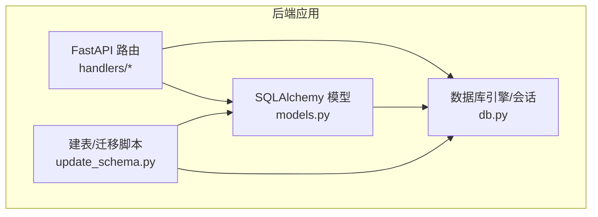
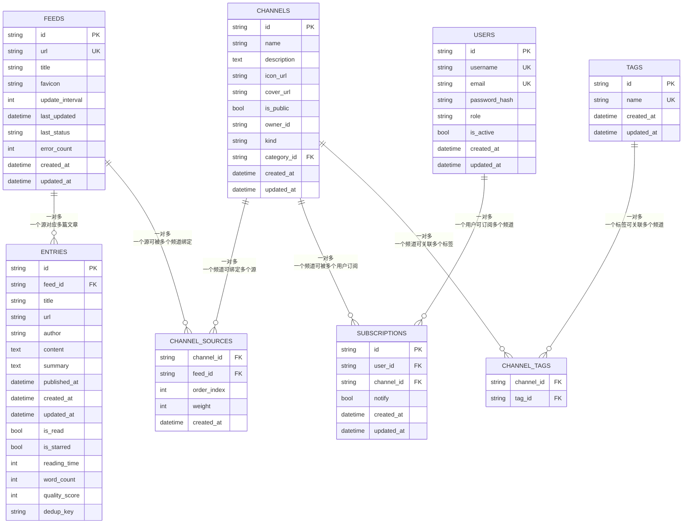
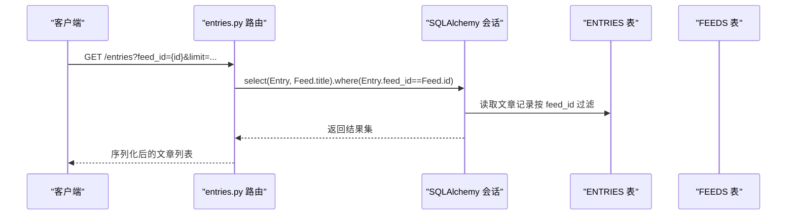
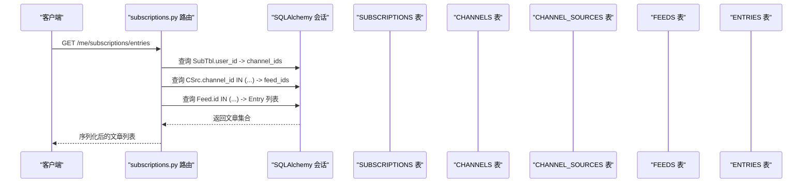
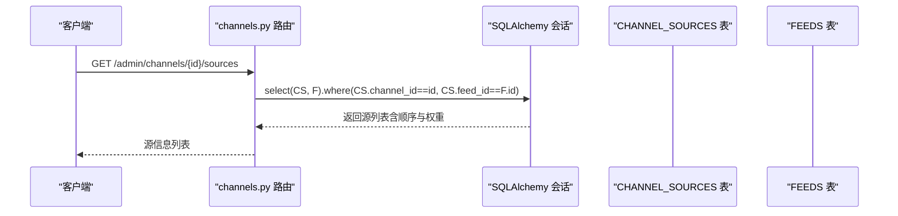
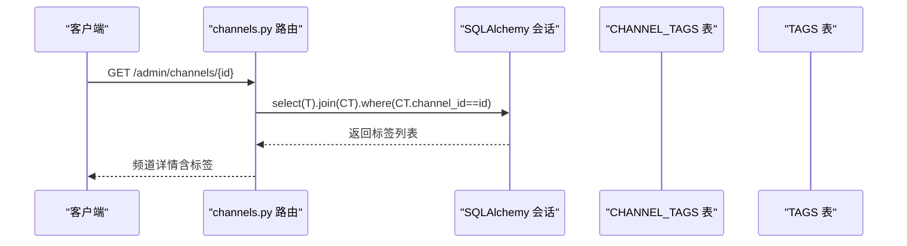
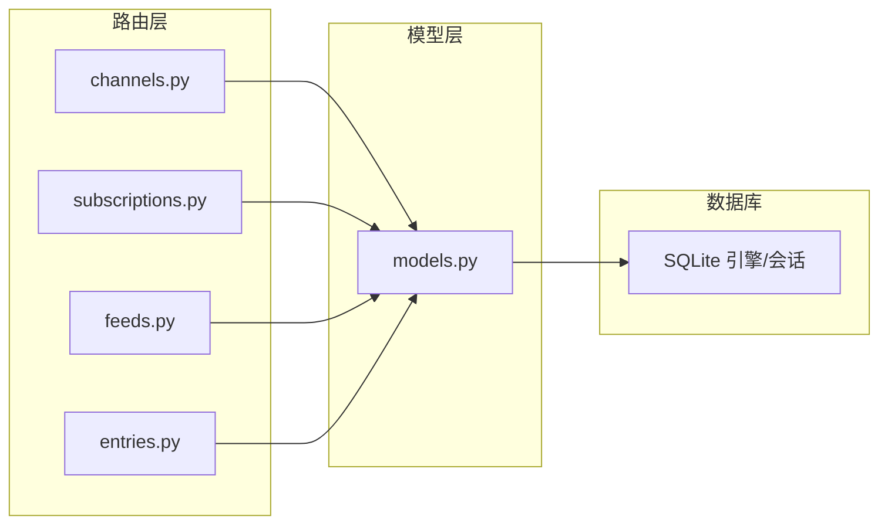

# 关系设计

<cite>
**本文引用的文件**
- [python-backend/app/models.py](file://python-backend/app/models.py)
- [python-backend/app/db.py](file://python-backend/app/db.py)
- [python-backend/update_schema.py](file://python-backend/update_schema.py)
- [python-backend/app/handlers/channels.py](file://python-backend/app/handlers/channels.py)
- [python-backend/app/handlers/subscriptions.py](file://python-backend/app/handlers/subscriptions.py)
- [python-backend/app/handlers/feeds.py](file://python-backend/app/handlers/feeds.py)
- [python-backend/app/handlers/entries.py](file://python-backend/app/handlers/entries.py)
- [python-backend/app/handlers/opml.py](file://python-backend/app/handlers/opml.py)
- [python-backend/app/utils/filters.py](file://python-backend/app/utils/filters.py)
</cite>

## 目录
1. [简介](#简介)
2. [项目结构](#项目结构)
3. [核心组件](#核心组件)
4. [架构总览](#架构总览)
5. [详细组件分析](#详细组件分析)
6. [依赖分析](#依赖分析)
7. [性能考虑](#性能考虑)
8. [故障排查指南](#故障排查指南)
9. [结论](#结论)
10. [附录](#附录)

## 简介
本文件系统性梳理 Tan RSS Reader 的数据库实体关系设计，重点解释以下关键关系与中间表模式：
- Feed 与 Entry 的一对多关系（一个源产生多条文章）
- User 与 Subscription 的多对一关系（用户对频道的订阅记录）
- Channel 与 Source（通过 Feed）的多对多关系（频道聚合多个源，源也可被多个频道复用）

同时说明中间表 ChannelSource、ChannelTag 的作用，以及外键约束与参照完整性的保障方式；给出 ER 图与关系图，并提供关系查询的最佳实践与性能优化建议。

## 项目结构
后端采用 SQLAlchemy ORM 定义模型，使用异步 SQLite 引擎，配合 FastAPI 路由层实现数据访问与业务逻辑。核心模型定义于 models.py，数据库引擎与会话工厂在 db.py 中初始化，update_schema.py 负责建表与列迁移。

图表来源
- [python-backend/app/handlers/channels.py:1-502](file://python-backend/app/handlers/channels.py#L1-L502)
- [python-backend/app/models.py:1-228](file://python-backend/app/models.py#L1-L228)
- [python-backend/app/db.py:1-27](file://python-backend/app/db.py#L1-L27)
- [python-backend/update_schema.py:1-136](file://python-backend/update_schema.py#L1-L136)

章节来源
- [python-backend/app/models.py:1-228](file://python-backend/app/models.py#L1-L228)
- [python-backend/app/db.py:1-27](file://python-backend/app/db.py#L1-L27)
- [python-backend/update_schema.py:1-136](file://python-backend/update_schema.py#L1-L136)

## 核心组件
- 实体与主键
  - Feed：源（RSS/Atom），主键 id
  - Entry：文章条目，主键 id，外键 feed_id 指向 Feed
  - Channel：频道，主键 id
  - Subscription：用户订阅，主键 id，外键 user_id 指向 User，channel_id 指向 Channel
  - Tag：标签，主键 id
  - User：用户，主键 id
- 中间表
  - ChannelSource：频道与源的多对多桥接，复合主键 (channel_id, feed_id)，并含排序与权重字段
  - ChannelTag：频道与标签的多对多桥接，复合主键 (channel_id, tag_id)

章节来源
- [python-backend/app/models.py:7-228](file://python-backend/app/models.py#L7-L228)

## 架构总览
下图展示实体与中间表之间的关系，体现一对多与多对多的连接方式及外键约束方向。

图表来源
- [python-backend/app/models.py:7-228](file://python-backend/app/models.py#L7-L228)

## 详细组件分析

### Feed-Entry 一对多关系
- 设计要点
  - Entry.feed_id 外键指向 Feed.id，形成典型的“一个源对应多篇文章”的一对多
  - Entry 表包含 is_read、is_starred、quality_score、word_count 等阅读状态与质量指标字段
  - 为 dedup_key 建立索引以支持去重场景
- 查询模式
  - 按源过滤文章：基于 feed_id 精确匹配
  - 高质量筛选：quality_score 或 word_count 组合条件
  - 时间范围：结合时间字段与日期过滤工具函数
- 性能建议
  - 在 feed_id 上建立索引（模型已标注）
  - 对 published_at、created_at 建立索引以支持排序与范围查询
  - 使用 LIMIT/MIN(...) 控制返回规模

图表来源
- [python-backend/app/handlers/entries.py:41-107](file://python-backend/app/handlers/entries.py#L41-L107)
- [python-backend/app/models.py:21-38](file://python-backend/app/models.py#L21-L38)

章节来源
- [python-backend/app/models.py:21-38](file://python-backend/app/models.py#L21-L38)
- [python-backend/app/handlers/entries.py:41-107](file://python-backend/app/handlers/entries.py#L41-L107)
- [python-backend/app/utils/filters.py:5-24](file://python-backend/app/utils/filters.py#L5-L24)

### User-Subscription 多对一关系
- 设计要点
  - Subscription.user_id 外键指向 User.id，Subscription.channel_id 外键指向 Channel.id
  - 订阅记录包含 notify 字段，支持是否推送提醒
- 查询模式
  - 获取某用户的订阅频道：先查 Subscription.user_id，再查 Channel
  - 获取某用户的订阅文章流：先查 Subscription.channel_id，再经 ChannelSource 找到 Feed，最后查 Entry
- 性能建议
  - 在 Subscription.user_id、channel_id 上建立索引（模型已标注）
  - 对订阅文章流查询进行分页与限制返回数量

图表来源
- [python-backend/app/handlers/subscriptions.py:109-174](file://python-backend/app/handlers/subscriptions.py#L109-L174)
- [python-backend/app/models.py:207-214](file://python-backend/app/models.py#L207-L214)

章节来源
- [python-backend/app/models.py:207-214](file://python-backend/app/models.py#L207-L214)
- [python-backend/app/handlers/subscriptions.py:49-174](file://python-backend/app/handlers/subscriptions.py#L49-L174)

### Channel-Source 多对多关系（通过中间表 ChannelSource）
- 设计要点
  - ChannelSource 是频道与源的多对多桥接，复合主键 (channel_id, feed_id)
  - 提供 order_index 与 weight 字段，用于频道内源的排序与权重控制
- 查询模式
  - 获取频道的所有源：按 channel_id 查询 ChannelSource 并关联 Feed
  - 获取源被哪些频道使用：按 feed_id 查询 ChannelSource 并关联 Channel
- 性能建议
  - 在 ChannelSource.channel_id、feed_id 上建立索引（模型已标注）
  - 对 order_index 进行排序时避免全表扫描，必要时建立复合索引

图表来源
- [python-backend/app/handlers/channels.py:382-412](file://python-backend/app/handlers/channels.py#L382-L412)
- [python-backend/app/models.py:160-167](file://python-backend/app/models.py#L160-L167)

章节来源
- [python-backend/app/models.py:160-167](file://python-backend/app/models.py#L160-L167)
- [python-backend/app/handlers/channels.py:382-412](file://python-backend/app/handlers/channels.py#L382-L412)

### Channel-Tag 多对多关系（通过中间表 ChannelTag）
- 设计要点
  - ChannelTag 是频道与标签的多对多桥接，复合主键 (channel_id, tag_id)
  - 支持为频道打标签，便于分类与检索
- 查询模式
  - 获取频道的标签：按 channel_id 查询 ChannelTag 并关联 Tag
  - 获取标签下的频道：按 tag_id 查询 ChannelTag 并关联 Channel
- 性能建议
  - 在 ChannelTag.channel_id、tag_id 上建立索引（模型已标注）

图表来源
- [python-backend/app/handlers/channels.py:289-315](file://python-backend/app/handlers/channels.py#L289-L315)
- [python-backend/app/models.py:155-158](file://python-backend/app/models.py#L155-L158)

章节来源
- [python-backend/app/models.py:155-158](file://python-backend/app/models.py#L155-L158)
- [python-backend/app/handlers/channels.py:289-315](file://python-backend/app/handlers/channels.py#L289-L315)

### 级联与参照完整性
- 外键约束
  - Entry.feed_id → Feed.id
  - Subscription.user_id → User.id
  - Subscription.channel_id → Channel.id
  - ChannelSource.channel_id → Channel.id
  - ChannelSource.feed_id → Feed.id
  - ChannelTag.channel_id → Channel.id
  - ChannelTag.tag_id → Tag.id
- 级联行为
  - 代码中未显式声明级联删除，但存在删除操作：
    - 删除频道时，先删除其 ChannelSource 记录，再删除频道本身
    - 删除订阅时直接删除记录
  - 由于 SQLite 默认不强制外键约束，建议在生产环境中启用外键检查或改用支持外键的数据库
- 参照完整性保障
  - 通过路由层在写入前校验对象存在性（如添加源到频道、订阅频道等）
  - 对唯一约束字段（如 Feed.url、User.username/email、Tag.name）进行存在性检查

章节来源
- [python-backend/app/models.py:21-228](file://python-backend/app/models.py#L21-L228)
- [python-backend/app/handlers/channels.py:369-380](file://python-backend/app/handlers/channels.py#L369-L380)
- [python-backend/app/handlers/subscriptions.py:83-107](file://python-backend/app/handlers/subscriptions.py#L83-L107)
- [python-backend/app/handlers/feeds.py:141-220](file://python-backend/app/handlers/feeds.py#L141-L220)

## 依赖分析
- 模块耦合
  - handlers 层依赖 models 定义的实体与外键关系
  - handlers 层依赖 db 会话工厂进行事务与查询
  - update_schema 脚本负责建表与列迁移，确保模型与数据库一致
- 查询依赖链
  - 频道文章查询：Subscription → ChannelSource → Feed → Entry
  - 源列表查询：Subscription → Channel → ChannelSource → Feed
  - 标签查询：Channel → ChannelTag → Tag

图表来源
- [python-backend/app/handlers/channels.py:1-502](file://python-backend/app/handlers/channels.py#L1-L502)
- [python-backend/app/handlers/subscriptions.py:1-175](file://python-backend/app/handlers/subscriptions.py#L1-L175)
- [python-backend/app/handlers/feeds.py:1-477](file://python-backend/app/handlers/feeds.py#L1-L477)
- [python-backend/app/handlers/entries.py:1-310](file://python-backend/app/handlers/entries.py#L1-L310)
- [python-backend/app/models.py:1-228](file://python-backend/app/models.py#L1-L228)
- [python-backend/app/db.py:1-27](file://python-backend/app/db.py#L1-L27)

章节来源
- [python-backend/app/models.py:1-228](file://python-backend/app/models.py#L1-L228)
- [python-backend/app/db.py:1-27](file://python-backend/app/db.py#L1-L27)
- [python-backend/app/handlers/channels.py:1-502](file://python-backend/app/handlers/channels.py#L1-L502)
- [python-backend/app/handlers/subscriptions.py:1-175](file://python-backend/app/handlers/subscriptions.py#L1-L175)
- [python-backend/app/handlers/feeds.py:1-477](file://python-backend/app/handlers/feeds.py#L1-L477)
- [python-backend/app/handlers/entries.py:1-310](file://python-backend/app/handlers/entries.py#L1-L310)

## 性能考虑
- 索引策略
  - Entry.feed_id 已标注索引，建议为 published_at、created_at 建立索引以提升排序与范围查询性能
  - Subscription.user_id、channel_id 已标注索引，建议限制返回条数与分页
  - ChannelSource.channel_id、feed_id 已标注索引，必要时考虑复合索引优化排序
- 查询优化
  - 使用 LIMIT 和 MIN(...) 控制返回规模，避免一次性拉取大量数据
  - 对高复杂度查询（如 JOIN 多表）优先使用 EXISTS 或子查询减少中间结果集
  - 合理使用日期过滤工具函数，避免全表扫描
- 写入与一致性
  - 批量写入时尽量合并提交，减少事务开销
  - 删除频道前先清理其 ChannelSource 记录，避免悬挂引用

[本节为通用性能建议，无需特定文件引用]

## 故障排查指南
- 常见问题
  - 外键约束失败：确认目标实体是否存在，或在 SQLite 中启用外键检查
  - 查询结果为空：检查过滤参数（如 feed_id、user_id、date_range）是否正确
  - 订阅/取消订阅异常：确认用户身份与频道所有权校验逻辑
- 排查步骤
  - 使用路由层的错误响应码定位问题（404、403、400）
  - 在 update_schema 中确认表结构与索引是否正确创建
  - 对高频查询路径增加 LIMIT 与分页，验证性能瓶颈
- 相关实现参考
  - 删除频道时先删中间表记录再删频道
  - 订阅/取消订阅时进行存在性检查与重复保护

章节来源
- [python-backend/app/handlers/channels.py:369-380](file://python-backend/app/handlers/channels.py#L369-L380)
- [python-backend/app/handlers/subscriptions.py:83-107](file://python-backend/app/handlers/subscriptions.py#L83-L107)
- [python-backend/update_schema.py:13-22](file://python-backend/update_schema.py#L13-L22)

## 结论
本设计以 Feed-Entry 一对多为核心，通过 Subscription 将 User 与 Channel 解耦，借助 ChannelSource 与 ChannelTag 实现频道与源、标签的多对多聚合。中间表承担了排序、权重与多对多映射职责，配合索引与分页策略可在中小规模数据下获得良好性能。建议在生产环境启用外键约束与更完善的索引覆盖，并持续监控高频查询路径的执行计划。

[本节为总结性内容，无需特定文件引用]

## 附录

### 关系查询最佳实践清单
- 限定返回规模：使用 limit/min 限制输出
- 合理分页：offset + limit 控制翻页
- 精准过滤：优先使用索引列（feed_id、user_id、channel_id、tag_id）
- 避免 N+1：批量查询与预加载
- 日期范围：使用日期过滤工具函数统一时间字段选择

章节来源
- [python-backend/app/handlers/entries.py:41-107](file://python-backend/app/handlers/entries.py#L41-L107)
- [python-backend/app/handlers/subscriptions.py:109-174](file://python-backend/app/handlers/subscriptions.py#L109-L174)
- [python-backend/app/utils/filters.py:5-24](file://python-backend/app/utils/filters.py#L5-L24)