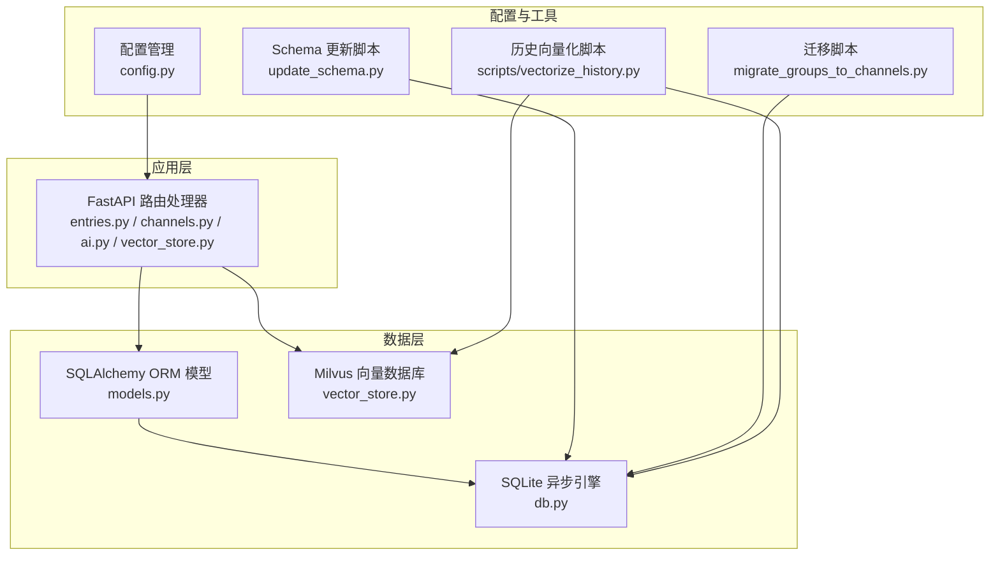
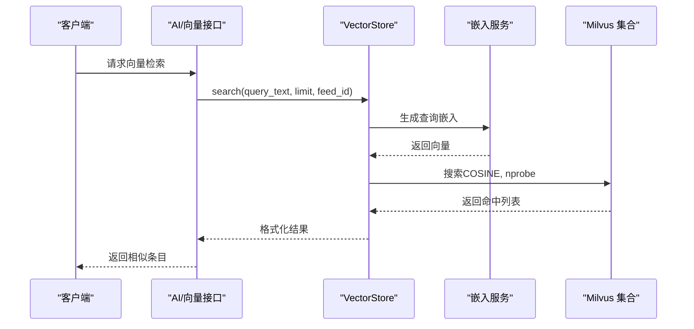
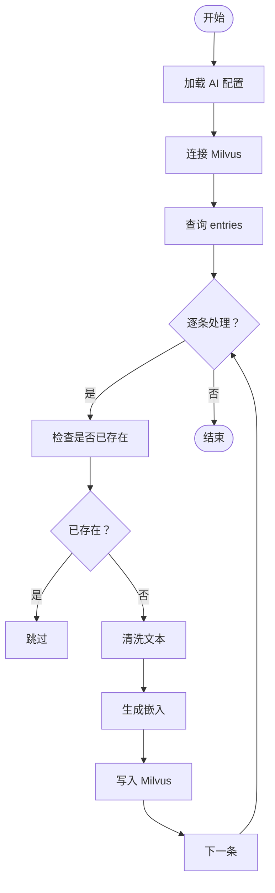
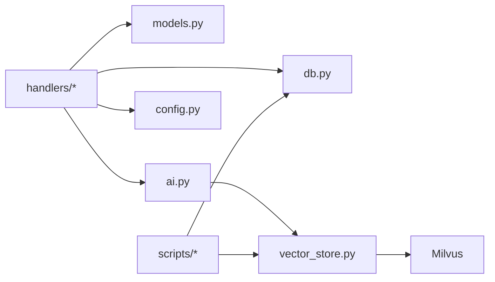

# 数据库设计

<cite>
**本文引用的文件**
- [python-backend/app/db.py](file://python-backend/app/db.py)
- [python-backend/app/models.py](file://python-backend/app/models.py)
- [python-backend/app/config.py](file://python-backend/app/config.py)
- [python-backend/app/handlers/vector_store.py](file://python-backend/app/handlers/vector_store.py)
- [python-backend/app/handlers/ai.py](file://python-backend/app/handlers/ai.py)
- [python-backend/update_schema.py](file://python-backend/update_schema.py)
- [python-backend/scripts/vectorize_history.py](file://python-backend/scripts/vectorize_history.py)
- [python-backend/scripts/migrate_groups_to_channels.py](file://python-backend/scripts/migrate_groups_to_channels.py)
- [python-backend/app/handlers/entries.py](file://python-backend/app/handlers/entries.py)
- [python-backend/app/handlers/channels.py](file://python-backend/app/handlers/channels.py)
</cite>

## 目录
1. [简介](#简介)
2. [项目结构](#项目结构)
3. [核心组件](#核心组件)
4. [架构总览](#架构总览)
5. [详细组件分析](#详细组件分析)
6. [依赖分析](#依赖分析)
7. [性能考虑](#性能考虑)
8. [故障排查指南](#故障排查指南)
9. [结论](#结论)
10. [附录](#附录)

## 简介
本文件为 Tan RSS Reader 的数据库设计文档，聚焦于 SQLite 主数据库与 Milvus 向量数据库的协同使用。文档详细描述了所有表结构、字段定义、数据类型与约束；解释实体关系图（ERD），涵盖 Feed、Entry、User、Channel 等核心模型之间的关系；说明索引策略、查询优化与缓存机制；给出数据模型演进历史与版本管理；提供数据访问模式、事务处理与并发控制策略；并解释数据生命周期管理、备份恢复与性能监控方法，以及数据迁移脚本与 schema 更新流程。

## 项目结构
后端采用 SQLAlchemy ORM 映射 SQLite 表，Milvus 作为向量检索引擎，通过独立的向量存储模块进行连接与操作。迁移脚本负责将旧的“Feed 分组”概念迁移到新的“个人频道（Channel）”体系。



图表来源
- [python-backend/app/db.py:1-27](file://python-backend/app/db.py#L1-L27)
- [python-backend/app/models.py:1-228](file://python-backend/app/models.py#L1-L228)
- [python-backend/app/config.py:1-75](file://python-backend/app/config.py#L1-L75)
- [python-backend/app/handlers/vector_store.py:1-197](file://python-backend/app/handlers/vector_store.py#L1-L197)
- [python-backend/update_schema.py:1-136](file://python-backend/update_schema.py#L1-L136)
- [python-backend/scripts/migrate_groups_to_channels.py:1-210](file://python-backend/scripts/migrate_groups_to_channels.py#L1-L210)
- [python-backend/scripts/vectorize_history.py:1-137](file://python-backend/scripts/vectorize_history.py#L1-L137)

章节来源
- [python-backend/app/db.py:1-27](file://python-backend/app/db.py#L1-L27)
- [python-backend/app/models.py:1-228](file://python-backend/app/models.py#L1-L228)
- [python-backend/app/config.py:1-75](file://python-backend/app/config.py#L1-L75)
- [python-backend/app/handlers/vector_store.py:1-197](file://python-backend/app/handlers/vector_store.py#L1-L197)
- [python-backend/update_schema.py:1-136](file://python-backend/update_schema.py#L1-L136)
- [python-backend/scripts/migrate_groups_to_channels.py:1-210](file://python-backend/scripts/migrate_groups_to_channels.py#L1-L210)
- [python-backend/scripts/vectorize_history.py:1-137](file://python-backend/scripts/vectorize_history.py#L1-L137)

## 核心组件
- SQLite 主数据库：使用 SQLAlchemy 异步引擎，表结构由 ORM 模型定义，支持异步会话与事务。
- Milvus 向量数据库：独立的向量存储模块，负责条目文本嵌入的生成、索引与相似度检索。
- 配置系统：集中管理数据库、Redis/Celery、Milvus 与 AI 服务的连接参数。
- 迁移与更新：提供 schema 初始化与增量列添加逻辑，以及从旧模型到新模型的数据迁移脚本。

章节来源
- [python-backend/app/db.py:1-27](file://python-backend/app/db.py#L1-L27)
- [python-backend/app/models.py:1-228](file://python-backend/app/models.py#L1-L228)
- [python-backend/app/config.py:1-75](file://python-backend/app/config.py#L1-L75)
- [python-backend/app/handlers/vector_store.py:1-197](file://python-backend/app/handlers/vector_store.py#L1-L197)
- [python-backend/update_schema.py:1-136](file://python-backend/update_schema.py#L1-L136)
- [python-backend/scripts/migrate_groups_to_channels.py:1-210](file://python-backend/scripts/migrate_groups_to_channels.py#L1-L210)

## 架构总览
Tan RSS Reader 的数据库架构由两部分组成：
- 关系型数据（SQLite）：承载用户、订阅、频道、标签、设置、AI 配置与条目元数据等。
- 向量数据库（Milvus）：承载条目的向量表示，用于语义检索与相似度匹配。

```mermaid
graph TB
subgraph "关系型数据库SQLite"
FEEDS["feeds"]
ENTRIES["entries"]
USERS["users"]
CHANNELS["channels"]
SUBSCRIPTIONS["subscriptions"]
TAGS["tags"]
CHANNEL_TAGS["channel_tags"]
CHANNEL_SOURCES["channel_sources"]
AI_CONFIGS["ai_configs"]
APP_SETTINGS["app_settings"]
SITE_ICONS["site_icons"]
ENTRY_AI["entry_ai"]
RSSHUB["rsshub_configs"]
DAILY_DIGEST["ai_daily_digests"]
USER_MEMBERSHIP["user_memberships"]
USER_USAGES["user_usages"]
USER_AI_PROMPTS["user_ai_prompts"]
SOURCE_PACKS["source_packs"]
end
subgraph "向量数据库Milvus"
COLLECTION["rss_entries 集合"]
end
ENTRIES --> COLLECTION
USERS --> SUBSCRIPTIONS
CHANNELS <- --> CHANNEL_TAGS
CHANNELS <- --> CHANNEL_SOURCES
FEEDS <- --> CHANNEL_SOURCES
AI_CONFIGS -.-> COLLECTION
```

图表来源
- [python-backend/app/models.py:1-228](file://python-backend/app/models.py#L1-L228)
- [python-backend/app/handlers/vector_store.py:55-91](file://python-backend/app/handlers/vector_store.py#L55-L91)

## 详细组件分析

### 表结构与字段定义
以下为核心表的结构概要（字段名、类型、是否可空、是否主键/唯一、默认值、注释与约束）。具体实现以 ORM 定义为准。

- feeds
  - id: 字符串（主键）
  - title: 字符串（可空）
  - url: 字符串（非空，唯一）
  - favicon: 字符串（可空）
  - update_interval: 整数（可空）
  - last_updated: 时间戳（可空）
  - last_status: 字符串（可空）
  - error_count: 整数，默认 0
  - created_at/updated_at: 时间戳，默认当前 UTC

- entries
  - id: 字符串（主键）
  - feed_id: 字符串（外键 feeds.id，建立索引）
  - title/url/author/content/summary: 字符串/文本（可空）
  - published_at: 时间戳（可空）
  - is_read/is_starred: 布尔，默认 false
  - reading_time/word_count/quality_score: 整数（可空）
  - dedup_key: 字符串（可空，建立索引）
  - created_at/updated_at: 时间戳，默认当前 UTC

- users
  - id: 字符串（主键）
  - username/email: 字符串（唯一）
  - password_hash: 字符串
  - role: 字符串，默认 "user"
  - is_active: 布尔，默认 true
  - created_at/updated_at: 时间戳

- channels
  - id: 字符串（主键）
  - name: 字符串（唯一）
  - description/icon_url/cover_url: 字符串（可空）
  - is_public: 布尔，默认 true
  - owner_id: 字符串（可空）
  - kind: 字符串，默认 "topic"
  - category_id: 字符串（可空，外键 categories.id）
  - created_at/updated_at: 时间戳

- subscriptions
  - id: 字符串（主键）
  - user_id: 字符串（外键 users.id，建立索引）
  - channel_id: 字符串（外键 channels.id，建立索引）
  - notify: 布尔，默认 false
  - created_at/updated_at: 时间戳

- tags
  - id: 字符串（主键）
  - name: 字符串（唯一）
  - created_at/updated_at: 时间戳

- channel_tags
  - channel_id: 字符串（主键，外键 channels.id）
  - tag_id: 字符串（主键，外键 tags.id）

- channel_sources
  - channel_id: 字符串（主键，外键 channels.id）
  - feed_id: 字符串（主键，外键 feeds.id）
  - order_index/weight: 整数（可空）
  - created_at: 时间戳

- ai_configs
  - id: 字符串（主键）
  - summary/translation/embedding: 服务配置（API Key/Base URL/Model Name/Has Key）
  - embedding_* 与 milvus_*：新增向量配置字段
  - features.auto_* 与 translation_language：功能开关与语言设置
  - created_at/updated_at: 时间戳

- app_settings
  - id: 字符串（主键）
  - fetch_interval_minutes/items_per_page/enable_date_filter/default_date_range/time_field/show_entry_summary/max_auto_title_translations/translation_display_mode/branding_toggle/rsshub_url: 多种配置项
  - created_at/updated_at: 时间戳

- site_icons
  - domain: 字符串（主键）
  - mime/data_base64/source_url/last_fetched/error_count/is_active: 图标元数据
  - created_at/updated_at: 时间戳

- entry_ai
  - entry_id: 字符串（主键，外键 entries.id）
  - summary/translation: 文本（JSON 字符串）
  - created_at/updated_at: 时间戳

- rsshub_configs
  - id: 字符串（主键）
  - url: 字符串（唯一）
  - priority/is_active/last_tested/response_time/error_count: RSSHub 配置与状态
  - created_at/updated_at: 时间戳

- ai_daily_digests
  - id: 字符串（主键）
  - user_id: 字符串（外键 users.id，建立索引）
  - date_str: 字符串（YYYY-MM-DD，建立索引）
  - content/references: 文本
  - created_at/updated_at: 时间戳

- user_memberships
  - id: 字符串（主键）
  - user_id: 字符串（外键 users.id，唯一，建立索引）
  - tier: 字符串，默认 "free"
  - expires_at: 时间戳（可空）
  - created_at/updated_at: 时间戳

- user_usages
  - id: 字符串（主键）
  - user_id: 字符串（外键 users.id，建立索引）
  - date_str: 字符串（YYYY-MM-DD，建立索引）
  - ai_calls: 整数，默认 0
  - created_at/updated_at: 时间戳

- user_ai_prompts
  - id: 字符串（主键）
  - user_id: 字符串（外键 users.id，建立索引）
  - name/prompt_type: 字符串
  - content: 文本
  - created_at/updated_at: 时间戳

- source_packs
  - id: 字符串（主键）
  - name/description/slug: 字符串（slug 唯一）
  - sources_json: 文本，默认 "[]"
  - created_by: 字符串（外键 users.id，可空）
  - is_public: 布尔，默认 true
  - install_count: 整数，默认 0
  - created_at/updated_at: 时间戳

章节来源
- [python-backend/app/models.py:7-228](file://python-backend/app/models.py#L7-L228)

### 实体关系图（ERD）
```mermaid
erDiagram
FEEDS {
string id PK
string title
string url UK
string favicon
int update_interval
datetime last_updated
string last_status
int error_count
datetime created_at
datetime updated_at
}
ENTRIES {
string id PK
string feed_id FK
string title
string url
string author
text content
text summary
datetime published_at
datetime created_at
datetime updated_at
boolean is_read
boolean is_starred
int reading_time
int word_count
int quality_score
string dedup_key
}
USERS {
string id PK
string username UK
string email UK
string password_hash
string role
boolean is_active
datetime created_at
datetime updated_at
}
CHANNELS {
string id PK
string name UK
text description
string icon_url
string cover_url
boolean is_public
string owner_id
string kind
string category_id FK
datetime created_at
datetime updated_at
}
SUBSCRIPTIONS {
string id PK
string user_id FK
string channel_id FK
boolean notify
datetime created_at
datetime updated_at
}
TAGS {
string id PK
string name UK
datetime created_at
datetime updated_at
}
CHANNEL_TAGS {
string channel_id FK PK
string tag_id FK PK
}
CHANNEL_SOURCES {
string channel_id FK PK
string feed_id FK PK
int order_index
int weight
datetime created_at
}
AI_CONFIGS {
string id PK
string summary_api_key
string summary_base_url
string summary_model_name
boolean summary_has_api_key
string translation_api_key
string translation_base_url
string translation_model_name
boolean translation_has_api_key
string embedding_api_key
string embedding_base_url
string embedding_model_name
boolean embedding_has_api_key
string milvus_host
string milvus_port
string milvus_collection_name
boolean auto_summary
boolean auto_translation
boolean auto_title_translation
boolean auto_quality_scoring
string translation_language
datetime created_at
datetime updated_at
}
APP_SETTINGS {
string id PK
int fetch_interval_minutes
int items_per_page
boolean enable_date_filter
string default_date_range
string time_field
boolean show_entry_summary
int max_auto_title_translations
string translation_display_mode
boolean branding_toggle
string rsshub_url
datetime created_at
datetime updated_at
}
SITE_ICONS {
string domain PK
string mime
text data_base64
string source_url
datetime last_fetched
int error_count
boolean is_active
datetime created_at
datetime updated_at
}
ENTRY_AI {
string entry_id PK FK
text summary
text translation
datetime created_at
datetime updated_at
}
RSSHUB_CONFIGS {
string id PK
string url UK
int priority
boolean is_active
datetime last_tested
int response_time
int error_count
datetime created_at
datetime updated_at
}
AI_DAILY_DIGESTS {
string id PK
string user_id FK
string date_str
text content
text references
datetime created_at
datetime updated_at
}
USER_MEMBERSHIPS {
string id PK
string user_id UK FK
string tier
datetime expires_at
datetime created_at
datetime updated_at
}
USER_USAGES {
string id PK
string user_id FK
string date_str
int ai_calls
datetime created_at
datetime updated_at
}
USER_AI_PROMPTS {
string id PK
string user_id FK
string name
string prompt_type
text content
datetime created_at
datetime updated_at
}
SOURCE_PACKS {
string id PK
string name
text description
string slug UK
text sources_json
string created_by FK
boolean is_public
int install_count
datetime created_at
datetime updated_at
}
FEEDS ||--o{ ENTRIES : "包含"
USERS ||--o{ SUBSCRIPTIONS : "订阅"
CHANNELS ||--o{ SUBSCRIPTIONS : "被订阅"
CHANNELS ||--o{ CHANNEL_TAGS : "关联"
TAGS ||--o{ CHANNEL_TAGS : "被关联"
CHANNELS ||--o{ CHANNEL_SOURCES : "包含"
FEEDS ||--o{ CHANNEL_SOURCES : "来源"
ENTRIES ||--|| ENTRY_AI : "AI 元数据"
USERS ||--o{ USER_MEMBERSHIPS : "拥有"
USERS ||--o{ USER_USAGES : "用量"
USERS ||--o{ USER_AI_PROMPTS : "提示词"
USERS ||--o{ SOURCE_PACKS : "创建"
USERS ||--o{ AI_DAILY_DIGESTS : "生成"
```

图表来源
- [python-backend/app/models.py:7-228](file://python-backend/app/models.py#L7-L228)

### 索引策略与查询优化
- 关系型索引
  - entries.feed_id：按源聚合与过滤常用
  - entries.dedup_key：去重键索引
  - ai_daily_digests.user_id/date_str：按用户与日期范围检索
  - user_memberships.user_id：一对一索引
  - user_usages.user_id/date_str：日用量统计
  - subscriptions.user_id/channel_id：订阅关系快速定位
  - channels.category_id：组织结构索引
- 查询优化建议
  - 使用外连接与批量查询减少往返
  - 对高频过滤条件（时间、是否已读/收藏、质量评分）建立复合索引
  - 分页查询限制每页最大数量，避免超大偏移
  - 对 AI 相关字段（summary/translation）采用 JSON 文本存储，必要时在应用层做二级索引或缓存

章节来源
- [python-backend/app/models.py:21-38](file://python-backend/app/models.py#L21-L38)
- [python-backend/app/models.py:72-80](file://python-backend/app/models.py#L72-L80)
- [python-backend/app/models.py:179-186](file://python-backend/app/models.py#L179-L186)
- [python-backend/app/models.py:188-195](file://python-backend/app/models.py#L188-L195)
- [python-backend/app/handlers/entries.py:41-107](file://python-backend/app/handlers/entries.py#L41-L107)

### 缓存机制
- 应用层缓存
  - 使用 Redis 作为 Celery 任务队列与结果缓存（由配置项提供连接地址）
  - 可扩展用于热点条目标题翻译、频道封面图标等静态资源缓存
- 数据层缓存
  - Milvus 自带内存与磁盘缓存，通过合适的 nlist/nprobe 参数平衡延迟与召回
- 建议
  - 对高频读取的频道预览、标签映射与用户配置进行进程内缓存
  - 对向量检索结果进行短期缓存，避免重复计算

章节来源
- [python-backend/app/config.py:49-55](file://python-backend/app/config.py#L49-L55)
- [python-backend/app/handlers/vector_store.py:130-178](file://python-backend/app/handlers/vector_store.py#L130-L178)

### 数据访问模式、事务与并发控制
- 事务与会话
  - 使用 SQLAlchemy 异步会话，每个请求一个会话，确保一致性与隔离级别
  - 对写操作（插入/更新/删除）在单事务中完成，失败回滚
- 并发控制
  - SQLite 默认 WAL 模式提升并发读写能力
  - Milvus 通过集合锁与线程池控制并发写入
- 并发建议
  - 批量导入/导出使用分批与信号量控制速率
  - 对高并发写入场景，拆分写入任务至后台队列

章节来源
- [python-backend/app/db.py:24-25](file://python-backend/app/db.py#L24-L25)
- [python-backend/app/handlers/vector_store.py:180-193](file://python-backend/app/handlers/vector_store.py#L180-L193)

### 数据生命周期管理、备份与恢复
- 生命周期
  - entries：按时间窗口清理过期条目（可选）
  - ai_daily_digests：按日期维度归档或清理
  - user_usages：按自然日滚动统计
- 备份
  - SQLite：直接复制 .db 文件；或使用 .backup 命令
  - Milvus：备份集合快照与日志目录
- 恢复
  - SQLite：停止服务后替换 .db 文件并重启
  - Milvus：根据快照重建集合并加载
- 监控
  - SQLite：监控文件大小、连接数、慢查询
  - Milvus：监控集合行数、索引进度、查询延迟与错误率

章节来源
- [python-backend/app/handlers/vector_store.py:55-91](file://python-backend/app/handlers/vector_store.py#L55-L91)

### 数据模型演进与版本管理
- 历史演进
  - Feed 的 category 字段弃用，改由 Channel 组织
  - 新增 ai_daily_digests 表与 ai_configs 的向量配置字段
  - 新增 entries.dedup_key 字段
- 版本管理
  - 使用 update_schema.py 初始化与增量更新
  - 迁移脚本 migrate_groups_to_channels.py 将旧数据转换为新模型
- 流程
  - 开发阶段：先运行 update_schema.py 创建/更新表结构
  - 生产阶段：先执行迁移脚本，再启动服务

章节来源
- [python-backend/app/models.py:12-12](file://python-backend/app/models.py#L12-L12)
- [python-backend/update_schema.py:24-136](file://python-backend/update_schema.py#L24-L136)
- [python-backend/scripts/migrate_groups_to_channels.py:27-168](file://python-backend/scripts/migrate_groups_to_channels.py#L27-L168)

### 向量数据库集成与检索流程
- 连接与集合
  - 支持本地 Milvus Lite 与远程 Milvus
  - 集合字段：自增 id、entry_id、embedding、feed_id、published_at、title
  - 索引类型：IVF_FLAT，度量：COSINE
- 写入流程
  - 生成 1024 维嵌入
  - 去重（按 entry_id 查询并删除旧向量）
  - 插入新向量
- 检索流程
  - 生成查询嵌入
  - 按 feed_id 过滤（可选）
  - COSINE 相似度检索，返回 top-k



图表来源
- [python-backend/app/handlers/vector_store.py:130-178](file://python-backend/app/handlers/vector_store.py#L130-L178)
- [python-backend/app/handlers/ai.py:313-345](file://python-backend/app/handlers/ai.py#L313-L345)

### 历史向量化与批量处理
- 脚本作用
  - 读取 entries 表，清洗文本，生成嵌入并写入 Milvus
  - 支持限速与强制重向量化
- 并发控制
  - 使用信号量限制同时向嵌入服务发起的请求数



图表来源
- [python-backend/scripts/vectorize_history.py:25-129](file://python-backend/scripts/vectorize_history.py#L25-L129)
- [python-backend/app/handlers/vector_store.py:92-128](file://python-backend/app/handlers/vector_store.py#L92-L128)

## 依赖分析
- 组件耦合
  - handlers 依赖 models 与 db，形成清晰的分层
  - vector_store 与 ai 模块共同依赖配置与嵌入服务
- 外部依赖
  - SQLite（aiosqlite）、Milvus（pymilvus）、Redis（Celery）
- 潜在风险
  - Milvus 连接失败时的降级策略
  - 嵌入服务超时与重试机制



图表来源
- [python-backend/app/handlers/vector_store.py:1-197](file://python-backend/app/handlers/vector_store.py#L1-L197)
- [python-backend/app/handlers/ai.py:1-800](file://python-backend/app/handlers/ai.py#L1-L800)
- [python-backend/app/db.py:1-27](file://python-backend/app/db.py#L1-L27)
- [python-backend/app/models.py:1-228](file://python-backend/app/models.py#L1-L228)
- [python-backend/app/config.py:1-75](file://python-backend/app/config.py#L1-L75)

章节来源
- [python-backend/app/handlers/vector_store.py:1-197](file://python-backend/app/handlers/vector_store.py#L1-L197)
- [python-backend/app/handlers/ai.py:1-800](file://python-backend/app/handlers/ai.py#L1-L800)
- [python-backend/app/db.py:1-27](file://python-backend/app/db.py#L1-L27)
- [python-backend/app/models.py:1-228](file://python-backend/app/models.py#L1-L228)
- [python-backend/app/config.py:1-75](file://python-backend/app/config.py#L1-L75)

## 性能考虑
- 查询性能
  - 为高频过滤字段建立索引；避免 SELECT *，仅取必要字段
  - 使用 LIMIT 与 OFFSET 控制分页大小
- 写入性能
  - 批量插入/更新；对 Milvus 写入使用信号量限流
- 向量检索
  - 合理设置 nprobe 与 nlist；对 feed_id 做过滤减少搜索空间
- 存储与 IO
  - SQLite 使用 WAL；定期检查文件大小与碎片
  - Milvus 索引构建与查询延迟监控

## 故障排查指南
- Milvus 连接失败
  - 检查配置中的 host/port/collection 名称
  - 确认 Milvus 服务可用与网络连通
- 嵌入服务异常
  - 检查 AI 服务的 base_url/api_key
  - 观察重试与超时设置
- 数据迁移失败
  - 确认迁移脚本依赖的表结构已更新
  - 查看迁移日志与回滚事务
- 查询缓慢
  - 检查索引是否存在；确认 SQL 是否有不必要的 JOIN
  - 分析慢查询日志（SQLite）与 Milvus 查询日志

章节来源
- [python-backend/app/handlers/vector_store.py:23-54](file://python-backend/app/handlers/vector_store.py#L23-L54)
- [python-backend/app/handlers/ai.py:173-228](file://python-backend/app/handlers/ai.py#L173-L228)
- [python-backend/scripts/migrate_groups_to_channels.py:170-209](file://python-backend/scripts/migrate_groups_to_channels.py#L170-L209)

## 结论
Tan RSS Reader 的数据库设计以 SQLite 为主、Milvus 为辅，实现了结构化数据与向量检索的有机融合。通过明确的 ERD、索引策略与迁移流程，系统具备良好的可维护性与扩展性。建议在生产环境中强化监控与告警、完善备份与灾难恢复方案，并持续优化查询与写入路径。

## 附录
- 数据库初始化与更新
  - 使用 update_schema.py 创建/更新表结构
- 历史数据向量化
  - 使用 scripts/vectorize_history.py 批量生成向量
- 数据迁移
  - 使用 scripts/migrate_groups_to_channels.py 将旧的 Feed 分组迁移到个人频道

章节来源
- [python-backend/update_schema.py:13-22](file://python-backend/update_schema.py#L13-L22)
- [python-backend/scripts/vectorize_history.py:1-137](file://python-backend/scripts/vectorize_history.py#L1-L137)
- [python-backend/scripts/migrate_groups_to_channels.py:1-210](file://python-backend/scripts/migrate_groups_to_channels.py#L1-L210)