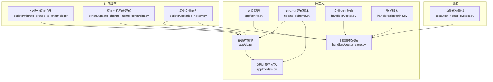
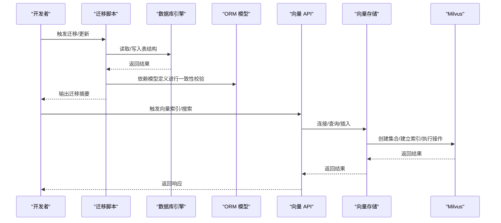
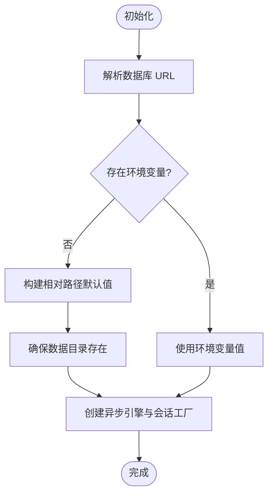
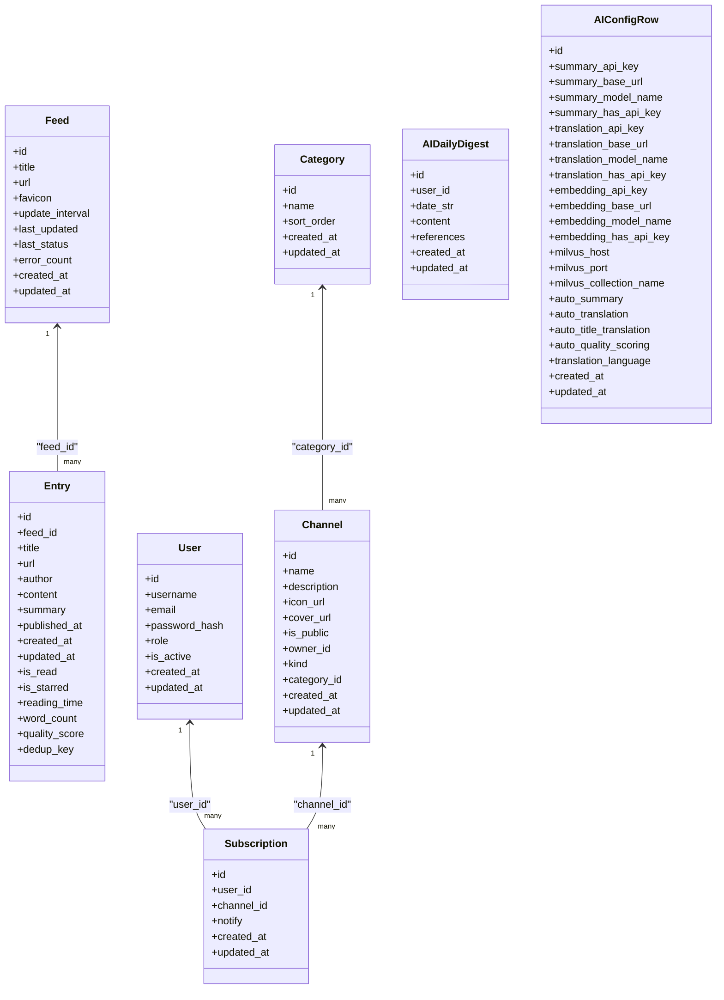
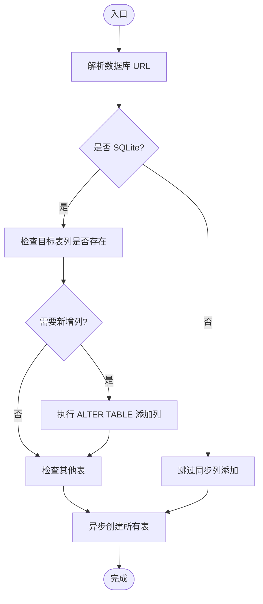
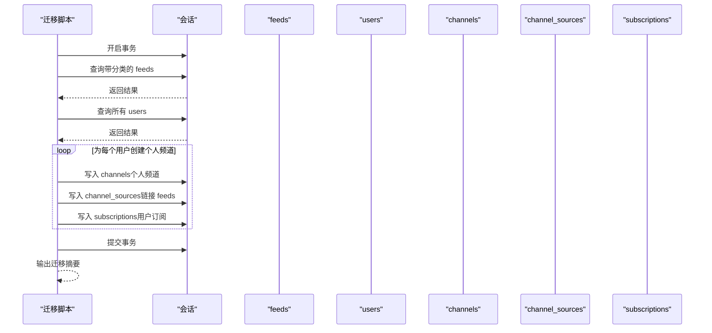
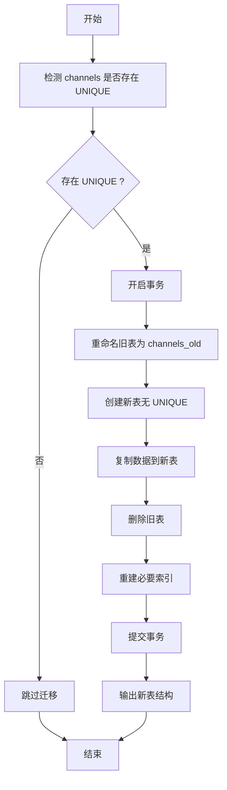
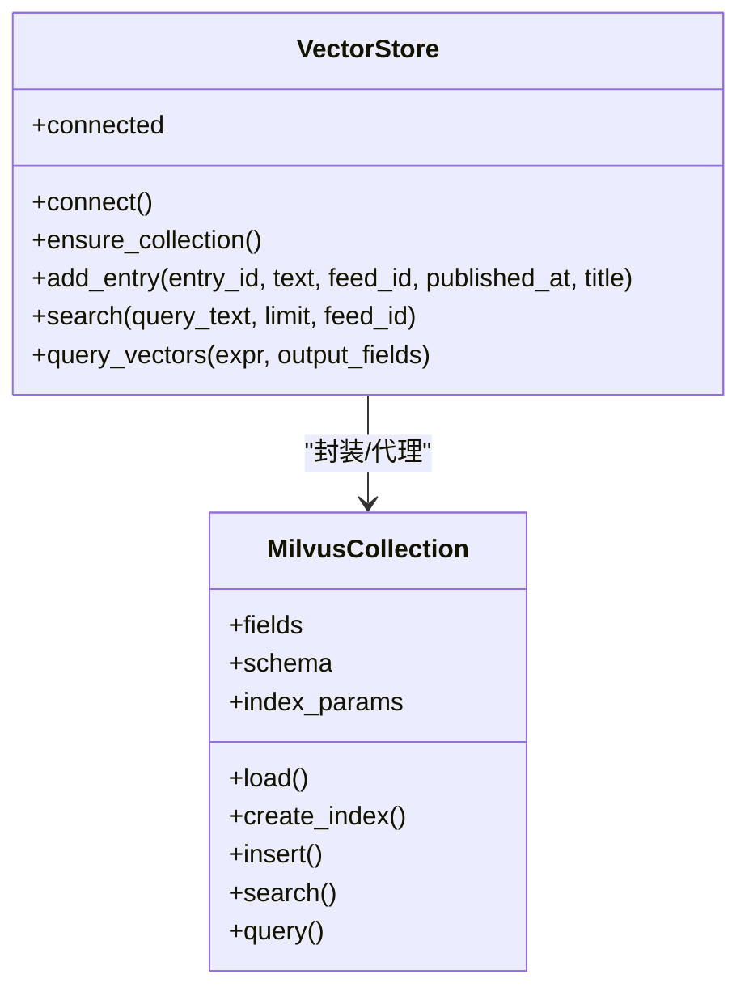
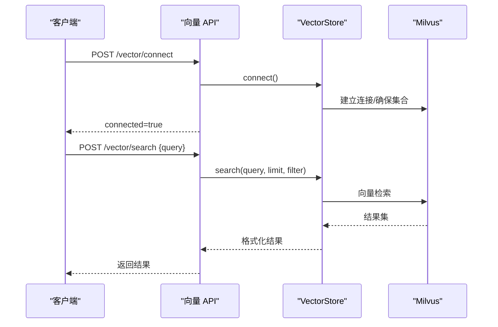
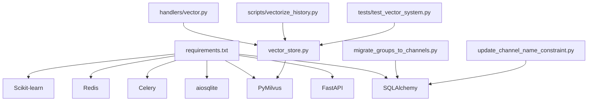

# 数据迁移

<cite>
**本文引用的文件**
- [python-backend/app/db.py](file://python-backend/app/db.py)
- [python-backend/app/models.py](file://python-backend/app/models.py)
- [python-backend/app/config.py](file://python-backend/app/config.py)
- [python-backend/update_schema.py](file://python-backend/update_schema.py)
- [python-backend/app/handlers/vector_store.py](file://python-backend/app/handlers/vector_store.py)
- [python-backend/app/handlers/vector.py](file://python-backend/app/handlers/vector.py)
- [python-backend/scripts/vectorize_history.py](file://python-backend/scripts/vectorize_history.py)
- [python-backend/scripts/migrate_groups_to_channels.py](file://python-backend/scripts/migrate_groups_to_channels.py)
- [python-backend/scripts/update_channel_name_constraint.py](file://python-backend/scripts/update_channel_name_constraint.py)
- [python-backend/app/handlers/clustering.py](file://python-backend/app/handlers/clustering.py)
- [python-backend/tests/test_vector_system.py](file://python-backend/tests/test_vector_system.py)
- [python-backend/requirements.txt](file://python-backend/requirements.txt)
</cite>

## 目录
1. [简介](#简介)
2. [项目结构](#项目结构)
3. [核心组件](#核心组件)
4. [架构总览](#架构总览)
5. [详细组件分析](#详细组件分析)
6. [依赖分析](#依赖分析)
7. [性能考量](#性能考量)
8. [故障排查指南](#故障排查指南)
9. [结论](#结论)
10. [附录](#附录)

## 简介
本文件系统性梳理 Tan RSS Reader 的数据迁移与 schema 管理实践，覆盖：
- 数据库版本管理策略与迁移脚本编写规范
- 安全新增表、修改表结构与删除废弃字段的方法
- 迁移回滚机制与错误处理策略
- 增量迁移与全量迁移最佳实践
- 向量数据库（Milvus）schema 变更的特殊考虑
- 迁移测试流程与生产部署安全措施
- 数据一致性保障与最小停机时间策略

## 项目结构
后端采用 SQLAlchemy ORM + aiosqlite，向量检索基于 Milvus。迁移与向量处理通过独立脚本与 API 路由实现，确保业务与迁移逻辑解耦。

图表来源
- [python-backend/app/db.py:1-27](file://python-backend/app/db.py#L1-L27)
- [python-backend/app/models.py:1-228](file://python-backend/app/models.py#L1-L228)
- [python-backend/app/config.py:1-75](file://python-backend/app/config.py#L1-L75)
- [python-backend/update_schema.py:1-136](file://python-backend/update_schema.py#L1-L136)
- [python-backend/app/handlers/vector_store.py:1-197](file://python-backend/app/handlers/vector_store.py#L1-L197)
- [python-backend/app/handlers/vector.py:1-158](file://python-backend/app/handlers/vector.py#L1-L158)
- [python-backend/app/handlers/clustering.py:1-142](file://python-backend/app/handlers/clustering.py#L1-L142)
- [python-backend/scripts/migrate_groups_to_channels.py:1-210](file://python-backend/scripts/migrate_groups_to_channels.py#L1-L210)
- [python-backend/scripts/update_channel_name_constraint.py:1-102](file://python-backend/scripts/update_channel_name_constraint.py#L1-L102)
- [python-backend/scripts/vectorize_history.py:1-137](file://python-backend/scripts/vectorize_history.py#L1-L137)
- [python-backend/tests/test_vector_system.py:1-85](file://python-backend/tests/test_vector_system.py#L1-L85)

章节来源
- [python-backend/app/db.py:1-27](file://python-backend/app/db.py#L1-L27)
- [python-backend/app/models.py:1-228](file://python-backend/app/models.py#L1-L228)
- [python-backend/app/config.py:1-75](file://python-backend/app/config.py#L1-L75)
- [python-backend/update_schema.py:1-136](file://python-backend/update_schema.py#L1-L136)

## 核心组件
- 数据库引擎与会话：异步 SQLite 引擎与会话工厂，支持本地相对路径数据库文件。
- ORM 模型：集中定义所有表结构与外键关系，作为 schema 的权威来源。
- 环境配置：统一管理数据库、Redis/Celery、Milvus 等外部依赖的连接参数。
- Schema 更新工具：同步/异步结合的方式创建表与追加列；兼容 SQLite 元信息检查。
- 向量存储封装：连接 Milvus（含本地 Lite），按需创建集合、建立索引、插入与查询。
- 迁移脚本：面向业务演进的离线迁移，如“将旧分组迁移到个人频道”、“去除频道名称唯一性”等。
- 向量历史索引：批量为历史条目生成向量并写入 Milvus，支持并发与限流。
- 测试用例：验证向量连接、搜索与聚类的基本功能。

章节来源
- [python-backend/app/db.py:1-27](file://python-backend/app/db.py#L1-L27)
- [python-backend/app/models.py:1-228](file://python-backend/app/models.py#L1-L228)
- [python-backend/app/config.py:1-75](file://python-backend/app/config.py#L1-L75)
- [python-backend/update_schema.py:1-136](file://python-backend/update_schema.py#L1-L136)
- [python-backend/app/handlers/vector_store.py:1-197](file://python-backend/app/handlers/vector_store.py#L1-L197)
- [python-backend/scripts/migrate_groups_to_channels.py:1-210](file://python-backend/scripts/migrate_groups_to_channels.py#L1-L210)
- [python-backend/scripts/update_channel_name_constraint.py:1-102](file://python-backend/scripts/update_channel_name_constraint.py#L1-L102)
- [python-backend/scripts/vectorize_history.py:1-137](file://python-backend/scripts/vectorize_history.py#L1-L137)
- [python-backend/tests/test_vector_system.py:1-85](file://python-backend/tests/test_vector_system.py#L1-L85)

## 架构总览
下图展示迁移与向量处理在整体系统中的位置与交互。

图表来源
- [python-backend/update_schema.py:1-136](file://python-backend/update_schema.py#L1-L136)
- [python-backend/app/handlers/vector.py:1-158](file://python-backend/app/handlers/vector.py#L1-L158)
- [python-backend/app/handlers/vector_store.py:1-197](file://python-backend/app/handlers/vector_store.py#L1-L197)

## 详细组件分析

### 组件一：数据库引擎与会话（aiosqlite）
- 使用异步引擎与会话工厂，支持本地 SQLite 文件路径，便于开发与部署一致性。
- 提供统一的数据库 URL 解析逻辑，优先使用环境变量，否则生成相对路径下的默认数据库文件。

图表来源
- [python-backend/app/db.py:11-27](file://python-backend/app/db.py#L11-L27)

章节来源
- [python-backend/app/db.py:1-27](file://python-backend/app/db.py#L1-L27)

### 组件二：ORM 模型与 Schema 权威
- 所有表结构以 ORM 模型为准，迁移时应先对比模型定义与实际数据库结构，再决定创建/修改/删除。
- 关系与索引在模型中显式声明，保证跨环境一致性。

图表来源
- [python-backend/app/models.py:7-228](file://python-backend/app/models.py#L7-L228)

章节来源
- [python-backend/app/models.py:1-228](file://python-backend/app/models.py#L1-L228)

### 组件三：Schema 更新与迁移工具（update_schema.py）
- 支持两类操作：
  - 同步方式：解析数据库 URL，直接连接 SQLite 并按需添加列、创建缺失表与索引。
  - 异步方式：创建异步引擎，调用 ORM 元数据创建所有表。
- 针对 channels、ai_configs、entries、ai_daily_digests 等表进行增量补丁，避免破坏已有数据。
- 对 ai_daily_digests 表创建复合索引以优化查询。

图表来源
- [python-backend/update_schema.py:13-136](file://python-backend/update_schema.py#L13-L136)

章节来源
- [python-backend/update_schema.py:1-136](file://python-backend/update_schema.py#L1-L136)

### 组件四：迁移脚本示例（分组到频道）
- 将旧的 feeds.category 字段转换为用户级个人频道，并建立频道-订阅关系。
- 使用原生 SQL 查询与事务提交，确保幂等与可回滚。
- 提供迁移后验证步骤，统计创建数量与样本核对。

图表来源
- [python-backend/scripts/migrate_groups_to_channels.py:27-168](file://python-backend/scripts/migrate_groups_to_channels.py#L27-L168)

章节来源
- [python-backend/scripts/migrate_groups_to_channels.py:1-210](file://python-backend/scripts/migrate_groups_to_channels.py#L1-L210)

### 组件五：迁移脚本示例（频道名称唯一性变更）
- 面向 SQLite 的“去唯一性”迁移：通过重命名旧表、重建新表（无 UNIQUE）、复制数据、重建索引、删除旧表的原子流程实现。
- 包含显式事务与回滚保护，最后输出新表结构确认。

图表来源
- [python-backend/scripts/update_channel_name_constraint.py:17-92](file://python-backend/scripts/update_channel_name_constraint.py#L17-L92)

章节来源
- [python-backend/scripts/update_channel_name_constraint.py:1-102](file://python-backend/scripts/update_channel_name_constraint.py#L1-L102)

### 组件六：向量数据库（Milvus）Schema 与索引
- 连接策略：支持本地 Milvus Lite（URI 指向 .db 文件）与远程 Milvus，自动选择连接方式。
- 集合创建：按需检测集合是否存在，不存在则创建，定义字段、主键、向量维度与索引参数。
- 插入与查询：插入前按 entry_id 去重（查询已存在记录并删除），查询支持过滤条件与输出字段。
- 索引类型与参数：使用 IVF_FLAT + COSINE 距离度量，nlist 控制倒排表数量。

图表来源
- [python-backend/app/handlers/vector_store.py:18-197](file://python-backend/app/handlers/vector_store.py#L18-L197)

章节来源
- [python-backend/app/handlers/vector_store.py:1-197](file://python-backend/app/handlers/vector_store.py#L1-L197)

### 组件七：向量 API 与历史索引
- API 路由：提供连接、搜索、聚类、触发索引等接口。
- 历史索引：批量抓取条目，清洗文本，限制并发，逐条调用向量存储写入。
- 聚类服务：从 Milvus 查询向量，使用 DBSCAN（余弦距离）进行聚类，计算主题代表性条目。

图表来源
- [python-backend/app/handlers/vector.py:38-158](file://python-backend/app/handlers/vector.py#L38-L158)
- [python-backend/app/handlers/vector_store.py:18-197](file://python-backend/app/handlers/vector_store.py#L18-L197)

章节来源
- [python-backend/app/handlers/vector.py:1-158](file://python-backend/app/handlers/vector.py#L1-L158)
- [python-backend/app/handlers/clustering.py:1-142](file://python-backend/app/handlers/clustering.py#L1-L142)
- [python-backend/scripts/vectorize_history.py:1-137](file://python-backend/scripts/vectorize_history.py#L1-L137)

## 依赖分析
- 外部依赖：FastAPI、SQLAlchemy、aiosqlite、PyMilvus、Celery/Redis、Scikit-learn 等。
- 向量检索依赖 Milvus，索引与查询参数直接影响性能与召回质量。
- 迁移脚本依赖 SQLAlchemy 会话与 ORM 模型，确保与应用层一致。

图表来源
- [python-backend/requirements.txt:1-18](file://python-backend/requirements.txt#L1-L18)
- [python-backend/app/handlers/vector_store.py:1-197](file://python-backend/app/handlers/vector_store.py#L1-L197)
- [python-backend/app/handlers/vector.py:1-158](file://python-backend/app/handlers/vector.py#L1-L158)
- [python-backend/scripts/migrate_groups_to_channels.py:1-210](file://python-backend/scripts/migrate_groups_to_channels.py#L1-L210)
- [python-backend/scripts/update_channel_name_constraint.py:1-102](file://python-backend/scripts/update_channel_name_constraint.py#L1-L102)
- [python-backend/scripts/vectorize_history.py:1-137](file://python-backend/scripts/vectorize_history.py#L1-L137)
- [python-backend/tests/test_vector_system.py:1-85](file://python-backend/tests/test_vector_system.py#L1-L85)

章节来源
- [python-backend/requirements.txt:1-18](file://python-backend/requirements.txt#L1-L18)

## 性能考量
- 向量索引并发控制：历史索引脚本使用信号量限制并发，避免触发下游速率限制或内存峰值。
- Milvus 索引参数：IVF_FLAT + COSINE 在精度与速度间折衷，nlist 可根据数据规模调整。
- 查询过滤：按 feed_id 或时间范围缩小检索空间，减少返回集大小。
- 数据清洗：去除 HTML 标签与空白，降低无效噪声，提升嵌入质量与检索效率。

## 故障排查指南
- 连接失败
  - 检查 Milvus 地址与端口配置，确认网络可达。
  - 本地 Lite 模式需确保 URI 指向有效文件路径。
- 插入失败
  - 确认嵌入维度与模型一致；若为空或长度不匹配，写入会失败。
  - 检查集合是否存在且已 load。
- 查询异常
  - 确认输出字段列表与集合字段一致；表达式语法正确。
- 迁移失败
  - SQLite 唯一性变更需在事务内执行，失败会自动回滚；检查日志定位具体步骤。
  - 分组迁移需确保用户与 feeds 数据存在，避免空迁移。
- 测试验证
  - 使用测试脚本快速验证连接、插入与聚类基本链路，观察日志输出。

章节来源
- [python-backend/app/handlers/vector_store.py:18-197](file://python-backend/app/handlers/vector_store.py#L18-L197)
- [python-backend/scripts/migrate_groups_to_channels.py:170-209](file://python-backend/scripts/migrate_groups_to_channels.py#L170-L209)
- [python-backend/scripts/update_channel_name_constraint.py:79-82](file://python-backend/scripts/update_channel_name_constraint.py#L79-L82)
- [python-backend/tests/test_vector_system.py:17-85](file://python-backend/tests/test_vector_system.py#L17-L85)

## 结论
本项目通过 ORM 模型驱动的 schema 管理、脚本化的离线迁移与向量系统封装，实现了从传统关系型数据库到向量数据库的平滑演进。建议在生产环境中遵循“可回滚、可验证、低停机”的原则，配合并发控制与索引参数调优，持续保障数据一致性与检索性能。

## 附录

### 数据库版本管理与迁移规范
- 版本标识：以模型定义为权威，迁移脚本仅做“补齐/修正”，不直接修改模型。
- 迁移顺序：先同步补丁（SQLite 元信息检查与 ALTER），再异步创建表，确保幂等。
- 回滚策略：对不可逆操作（如删除列）提供“注释保留/迁移后清理”的两阶段方案；事务内失败自动回滚。
- 错误处理：捕获异常并记录上下文，必要时中断流程并提示修复步骤。

### 新增/修改/删除表结构的实践
- 新增表：优先在 ORM 中定义，运行异步建表；随后在同步脚本中补充索引与默认值。
- 修改表结构：使用 SQLite PRAGMA 检查列存在性，按需 ALTER；避免 DROP COLUMN（SQLite 不支持），改用重建表或数据迁移。
- 删除废弃字段：先迁移数据至新字段，再在后续版本清理旧字段；保留迁移验证步骤。

### 增量迁移与全量迁移最佳实践
- 增量迁移：基于时间窗口或 ID 范围分页处理，记录进度，失败重试。
- 全量迁移：使用并发控制与限速，避免对数据库与 Milvus 造成瞬时压力；完成后进行抽样验证。

### 向量数据库 schema 变更的特殊考虑
- 集合创建与索引：首次创建时定义字段与索引参数；变更时评估重建成本与停机窗口。
- 去重与一致性：插入前按 entry_id 查询并删除旧记录，确保同一条目的最新状态。
- 性能权衡：索引类型与 nlist 影响查询延迟与资源占用，需结合业务场景调参。

### 迁移测试流程与生产部署安全措施
- 测试流程：本地/预发布环境先跑迁移脚本与向量系统测试，验证连接、搜索与聚类。
- 生产部署：灰度发布，先对小部分用户或频道执行迁移，监控指标与日志；准备回滚预案。
- 停机最小化：优先使用在线索引（后台任务）与增量迁移；对必须停机的操作安排维护窗口。