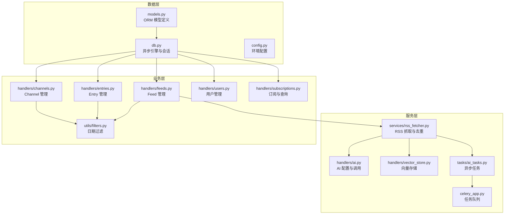
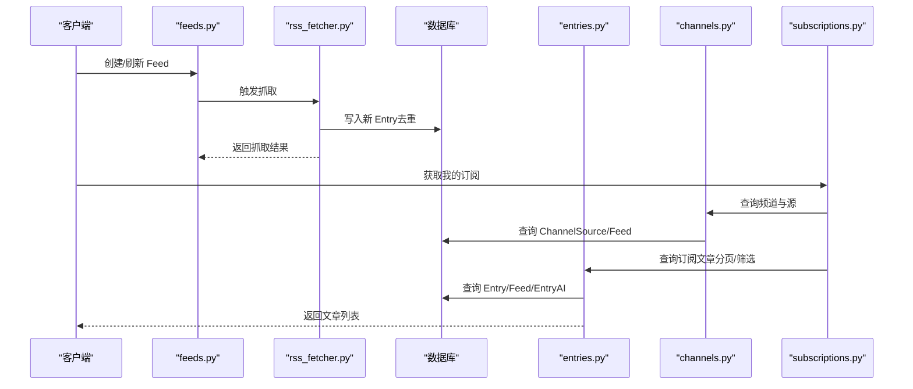
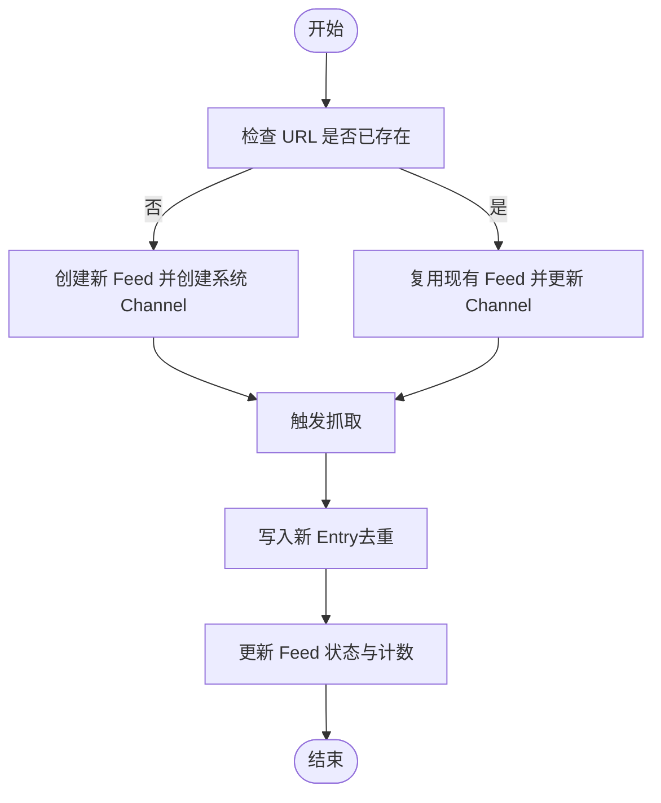
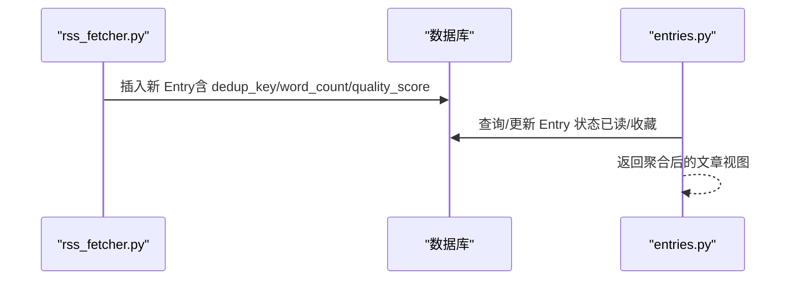
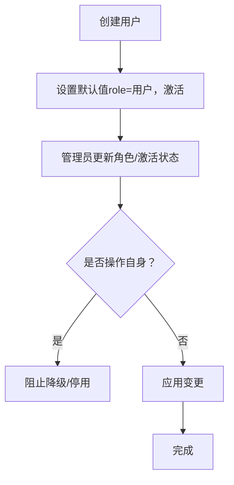
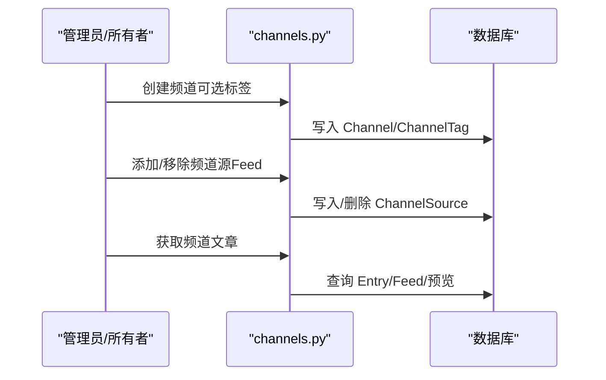
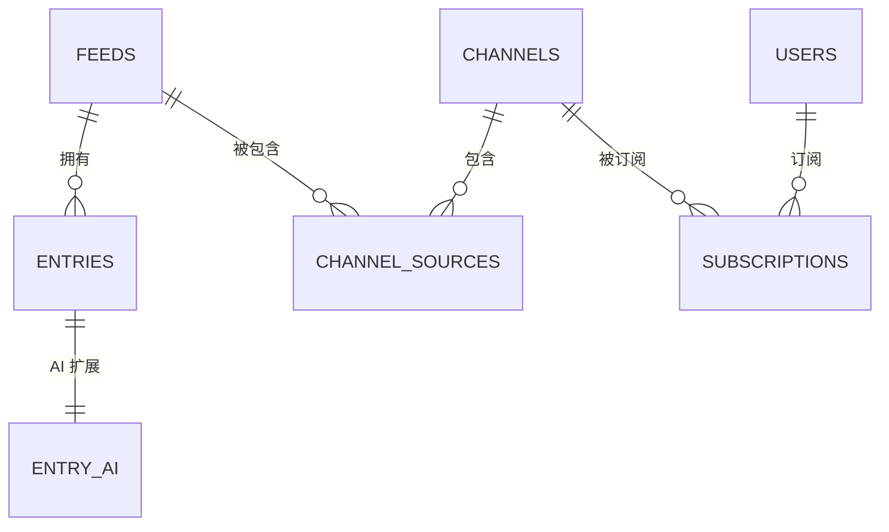
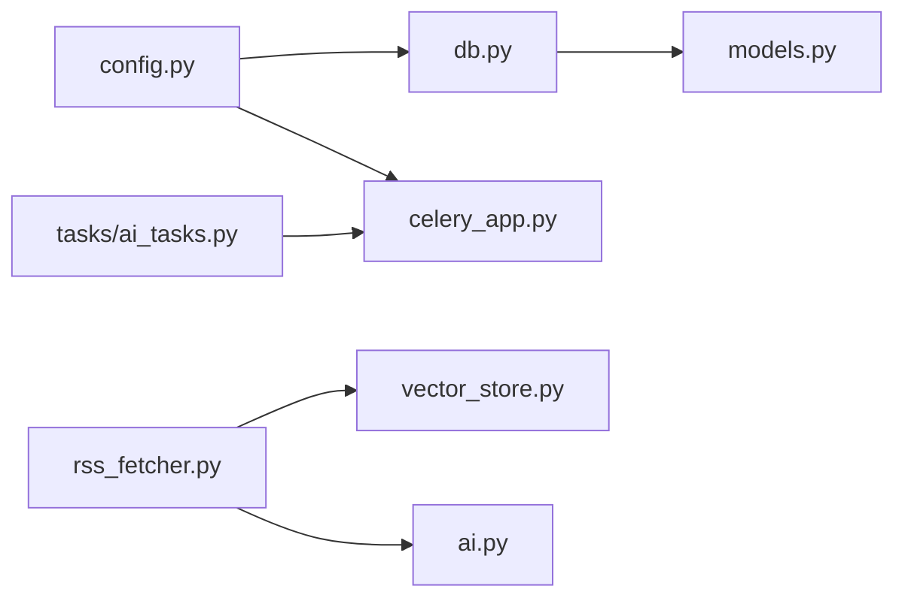

# 核心数据模型

<cite>
**本文档引用的文件**
- [models.py](file://python-backend/app/models.py)
- [db.py](file://python-backend/app/db.py)
- [config.py](file://python-backend/app/config.py)
- [feeds.py](file://python-backend/app/handlers/feeds.py)
- [entries.py](file://python-backend/app/handlers/entries.py)
- [channels.py](file://python-backend/app/handlers/channels.py)
- [users.py](file://python-backend/app/handlers/users.py)
- [subscriptions.py](file://python-backend/app/handlers/subscriptions.py)
- [rss_fetcher.py](file://python-backend/app/services/rss_fetcher.py)
- [filters.py](file://python-backend/app/utils/filters.py)
- [ai.py](file://python-backend/app/handlers/ai.py)
- [vector_store.py](file://python-backend/app/handlers/vector_store.py)
- [celery_app.py](file://python-backend/app/celery_app.py)
- [tasks/ai_tasks.py](file://python-backend/app/tasks/ai_tasks.py)
- [update_schema.py](file://python-backend/update_schema.py)
</cite>

## 目录
1. [简介](#简介)
2. [项目结构](#项目结构)
3. [核心组件](#核心组件)
4. [架构总览](#架构总览)
5. [详细组件分析](#详细组件分析)
6. [依赖分析](#依赖分析)
7. [性能考虑](#性能考虑)
8. [故障排查指南](#故障排查指南)
9. [结论](#结论)
10. [附录](#附录)

## 简介
本文件系统性梳理 Tan RSS Reader 的核心数据模型，聚焦 Feed、Entry、User、Channel 等关键实体，阐述其设计理念、字段定义、约束与默认值、模型间关系、生命周期管理、软删除机制与数据验证规则，并提供使用示例与最佳实践，帮助开发者与运维人员高效理解与维护系统。

## 项目结构
后端采用 Python + FastAPI + SQLAlchemy ORM + 异步数据库访问，模型定义集中在 models.py 中，通过 db.py 统一数据库连接与引擎配置；业务处理器位于 handlers/*，负责对外 API 与业务编排；服务层包括 rss_fetcher.py、ai.py、vector_store.py 等；update_schema.py 提供数据库模式初始化与增量迁移能力。

图表来源
- [models.py:1-228](file://python-backend/app/models.py#L1-L228)
- [db.py:1-27](file://python-backend/app/db.py#L1-L27)
- [config.py:1-75](file://python-backend/app/config.py#L1-L75)
- [feeds.py:1-477](file://python-backend/app/handlers/feeds.py#L1-L477)
- [entries.py:1-310](file://python-backend/app/handlers/entries.py#L1-L310)
- [channels.py:1-502](file://python-backend/app/handlers/channels.py#L1-L502)
- [users.py:1-149](file://python-backend/app/handlers/users.py#L1-L149)
- [subscriptions.py:1-175](file://python-backend/app/handlers/subscriptions.py#L1-L175)
- [rss_fetcher.py:1-312](file://python-backend/app/services/rss_fetcher.py#L1-L312)
- [ai.py:1-1157](file://python-backend/app/handlers/ai.py#L1-L1157)
- [vector_store.py:1-197](file://python-backend/app/handlers/vector_store.py#L1-L197)
- [celery_app.py:1-23](file://python-backend/app/celery_app.py#L1-L23)
- [tasks/ai_tasks.py:1-87](file://python-backend/app/tasks/ai_tasks.py#L1-L87)
- [filters.py:1-25](file://python-backend/app/utils/filters.py#L1-L25)

章节来源
- [models.py:1-228](file://python-backend/app/models.py#L1-L228)
- [db.py:1-27](file://python-backend/app/db.py#L1-L27)
- [config.py:1-75](file://python-backend/app/config.py#L1-L75)

## 核心组件
本节对核心实体进行逐项解析，涵盖字段、类型、约束、默认值、业务含义与典型用途。

- Feed（订阅源）
  - 字段与类型
    - id: 主键，字符串
    - title: 可空，字符串
    - url: 非空，唯一，字符串
    - favicon: 可空，字符串
    - update_interval: 可空，整数
    - last_updated: 可空，时间戳
    - last_status: 可空，字符串
    - error_count: 整数，默认 0
    - created_at/updated_at: 时间戳，默认当前 UTC
  - 约束与默认值
    - url 唯一；error_count 默认 0；时间戳默认值为当前 UTC
  - 业务含义
    - 表示一个 RSS/Atom 源，支持定时刷新与错误统计
  - 处理器关联
    - feeds.py 提供创建、更新、删除、刷新接口；rss_fetcher.py 执行抓取与去重

- Entry（文章条目）
  - 字段与类型
    - id: 主键，字符串
    - feed_id: 外键 feeds.id，索引
    - title/url/author: 可空/非空字符串
    - content/summary: 文本
    - published_at: 可空，时间戳
    - created_at/updated_at: 时间戳，默认当前 UTC
    - is_read/is_starred: 布尔，默认 false
    - reading_time/word_count/quality_score: 可空整数
    - dedup_key: 可空，字符串，带索引
  - 约束与默认值
    - is_read/is_starred 默认 false；dedup_key 唯一性由业务保证（见去重流程）
  - 业务含义
    - 表示单条文章，支持阅读状态、收藏、质量评分与去重
  - 处理器关联
    - entries.py 提供列表、详情、标记已读/未读、加星/取消星等操作

- User（用户）
  - 字段与类型
    - id: 主键，字符串
    - username: 唯一，字符串
    - email: 可空，唯一
    - password_hash: 必填，字符串
    - role: 字符串，默认 user
    - is_active: 布尔，默认 true
    - created_at/updated_at: 时间戳
  - 约束与默认值
    - username/email 唯一；is_active 默认 true
  - 业务含义
    - 系统用户，支持角色与激活状态控制

- Channel（频道）
  - 字段与类型
    - id: 主键，字符串
    - name: 非空，字符串
    - description/icon_url/cover_url: 可空文本
    - is_public: 布尔，默认 true
    - owner_id: 可空，字符串
    - kind: 字符串，默认 topic
    - category_id: 可空，外键 categories.id
    - created_at/updated_at: 时间戳
  - 约束与默认值
    - name 唯一性由外键链路与业务约束共同保障
  - 业务含义
    - 对 Feed 的组织与展示单元，支持公开/私有、所有者、分类等属性

- 关系与引用完整性
  - Entry.feed_id → Feed.id（一对多）
  - Subscription.user_id → User.id；Subscription.channel_id → Channel.id（多对一）
  - ChannelSource.channel_id → Channel.id；ChannelSource.feed_id → Feed.id（多对多桥接）
  - EntryAI.entry_id → Entry.id（一对一扩展）
  - SiteIcon.domain → 域名主键
  - 其他表如 AIDailyDigest、UserMembership、UserUsage、UserAIPrompt 等均遵循标准外键与索引设计

章节来源
- [models.py:7-228](file://python-backend/app/models.py#L7-L228)
- [feeds.py:141-262](file://python-backend/app/handlers/feeds.py#L141-L262)
- [entries.py:19-310](file://python-backend/app/handlers/entries.py#L19-L310)
- [users.py:16-149](file://python-backend/app/handlers/users.py#L16-L149)
- [channels.py:38-502](file://python-backend/app/handlers/channels.py#L38-L502)

## 架构总览
下图展示核心实体在业务流程中的交互：Feed 通过 rss_fetcher 抓取生成 Entry；Entry 与 Channel 通过 ChannelSource 关联；用户通过 Subscription 订阅 Channel 并消费 Entry；AI 与向量存储在异步任务中完成摘要、翻译与向量化。

图表来源
- [feeds.py:141-262](file://python-backend/app/handlers/feeds.py#L141-L262)
- [rss_fetcher.py:104-312](file://python-backend/app/services/rss_fetcher.py#L104-L312)
- [entries.py:41-107](file://python-backend/app/handlers/entries.py#L41-L107)
- [channels.py:454-501](file://python-backend/app/handlers/channels.py#L454-L501)
- [subscriptions.py:109-175](file://python-backend/app/handlers/subscriptions.py#L109-L175)

## 详细组件分析

### Feed 实体分析
- 设计理念
  - 将 RSS 源抽象为独立实体，便于统一管理、定时刷新与错误监控
- 字段与约束
  - url 唯一，避免重复源；last_updated/last_status/error_count 支持健康度追踪
- 生命周期
  - 创建：管理员或用户可创建，若存在则复用并更新关联 Channel
  - 刷新：触发 rss_fetcher 抓取，写入 Entry 并更新 Feed 状态
- 数据验证
  - URL 合法性由上游校验与抓取器返回状态反映
- 使用示例
  - 创建并绑定 Channel：见 feeds.py 中“创建 Feed”流程
  - 刷新：见 feeds.py 中“刷新 Feed”
- 最佳实践
  - 定期检查 last_status 与 error_count，异常时重试或告警
  - 使用 update_interval 控制抓取频率，避免过载

图表来源
- [feeds.py:141-262](file://python-backend/app/handlers/feeds.py#L141-L262)
- [rss_fetcher.py:104-312](file://python-backend/app/services/rss_fetcher.py#L104-L312)

章节来源
- [models.py:7-19](file://python-backend/app/models.py#L7-L19)
- [feeds.py:141-262](file://python-backend/app/handlers/feeds.py#L141-L262)
- [rss_fetcher.py:104-312](file://python-backend/app/services/rss_fetcher.py#L104-L312)

### Entry 实体分析
- 设计理念
  - 以文章为中心，记录标题、正文、作者、发布时间、阅读状态、收藏、质量评分与去重键
- 字段与约束
  - dedup_key 用于跨源与批次去重；is_read/is_starred 提供用户态状态
- 生命周期
  - 由 Feed 抓取产生；支持批量标记已读/未读、加星/取消星
- 数据验证
  - 标题/正文长度与词数计算在抓取阶段完成；质量评分按规则计算
- 使用示例
  - 列表与筛选：见 entries.py 的列表接口与高亮/未读/收藏筛选
  - 标记状态：见 entries.py 的更新接口
- 最佳实践
  - 使用 dedup_key 与 URL 双重去重策略
  - 结合 AI 任务异步评分与向量化

图表来源
- [rss_fetcher.py:214-254](file://python-backend/app/services/rss_fetcher.py#L214-L254)
- [entries.py:41-107](file://python-backend/app/handlers/entries.py#L41-L107)

章节来源
- [models.py:21-38](file://python-backend/app/models.py#L21-L38)
- [entries.py:41-107](file://python-backend/app/handlers/entries.py#L41-L107)
- [rss_fetcher.py:214-254](file://python-backend/app/services/rss_fetcher.py#L214-L254)

### User 实体分析
- 设计理念
  - 用户身份与权限控制，支持角色与激活状态
- 字段与约束
  - username/email 唯一；role 默认 user；is_active 默认 true
- 生命周期
  - 注册/登录后创建；支持管理员修改角色与激活状态
- 使用示例
  - 查看个人信息：见 users.py 的 me 接口
  - 管理员列表与更新：见 users.py 的管理员接口
- 最佳实践
  - 禁止管理员自我降级或停用自身账户
  - 删除用户前清理相关订阅与使用记录（处理器中注释说明）

图表来源
- [users.py:68-125](file://python-backend/app/handlers/users.py#L68-L125)

章节来源
- [models.py:168-178](file://python-backend/app/models.py#L168-L178)
- [users.py:16-149](file://python-backend/app/handlers/users.py#L16-L149)

### Channel 实体分析
- 设计理念
  - 对 Feed 进行逻辑分组与展示，支持标签、图标、封面、分类与所有者
- 字段与约束
  - name 唯一性由外键链路与业务约束保障；kind 支持 topic/feed 等类型
- 生命周期
  - 管理员或所有者创建；支持更新、删除与标签维护
- 使用示例
  - 创建/更新频道：见 channels.py 的创建/更新接口
  - 获取频道文章：见 channels.py 的频道文章接口
- 最佳实践
  - 为缺失图标提供回退策略（来自 ChannelSource 的 Feed favicon）
  - 私有频道需校验所有权或管理员权限

图表来源
- [channels.py:244-381](file://python-backend/app/handlers/channels.py#L244-L381)
- [channels.py:454-501](file://python-backend/app/handlers/channels.py#L454-L501)

章节来源
- [models.py:126-139](file://python-backend/app/models.py#L126-L139)
- [channels.py:244-381](file://python-backend/app/handlers/channels.py#L244-L381)
- [channels.py:454-501](file://python-backend/app/handlers/channels.py#L454-L501)

### 关系与引用完整性
- 外键关系
  - Entry.feed_id → Feed.id
  - Subscription.user_id → User.id；Subscription.channel_id → Channel.id
  - ChannelSource(channel_id, feed_id) → (Channel.id, Feed.id)
  - EntryAI.entry_id → Entry.id
- 索引与约束
  - Entry.dedup_key 建有索引；Feed.url 唯一；User.username/email 唯一
- 软删除机制
  - 当前模型未显式实现软删除字段；删除行为为物理删除（如 feeds.py 的删除接口）。如需软删除，建议在相关实体增加 deleted_at/active 等字段并在查询中默认过滤

图表来源
- [models.py:7-228](file://python-backend/app/models.py#L7-L228)

章节来源
- [models.py:7-228](file://python-backend/app/models.py#L7-L228)
- [feeds.py:249-262](file://python-backend/app/handlers/feeds.py#L249-L262)
- [channels.py:369-381](file://python-backend/app/handlers/channels.py#L369-L381)
- [users.py:126-149](file://python-backend/app/handlers/users.py#L126-L149)

## 依赖分析
- 数据库连接
  - db.py 通过 async_engine 与 SessionLocal 提供异步会话；默认使用 SQLite（路径相对工程目录），可通过环境变量覆盖
- 环境配置
  - config.py 提供数据库、Redis/Celery、Milvus、AI 服务等配置项，支持 .env 文件加载
- 异步任务
  - celery_app.py 配置 Redis 作为 Broker/Backend；tasks/ai_tasks.py 提供批量质量评分与向量化任务
- 向量存储
  - vector_store.py 基于 Milvus，支持本地 Lite 与远程实例；集合自动创建与索引构建

图表来源
- [db.py:1-27](file://python-backend/app/db.py#L1-L27)
- [config.py:41-75](file://python-backend/app/config.py#L41-L75)
- [rss_fetcher.py:1-312](file://python-backend/app/services/rss_fetcher.py#L1-L312)
- [vector_store.py:1-197](file://python-backend/app/handlers/vector_store.py#L1-L197)
- [celery_app.py:1-23](file://python-backend/app/celery_app.py#L1-L23)
- [tasks/ai_tasks.py:1-87](file://python-backend/app/tasks/ai_tasks.py#L1-L87)

章节来源
- [db.py:1-27](file://python-backend/app/db.py#L1-L27)
- [config.py:41-75](file://python-backend/app/config.py#L41-L75)
- [celery_app.py:1-23](file://python-backend/app/celery_app.py#L1-L23)
- [tasks/ai_tasks.py:1-87](file://python-backend/app/tasks/ai_tasks.py#L1-L87)
- [vector_store.py:1-197](file://python-backend/app/handlers/vector_store.py#L1-L197)

## 性能考虑
- 查询优化
  - Entry.feed_id、Entry.dedup_key、Subscription.user_id、AIDailyDigest.user_id/date_str 等字段建立索引，提升过滤与分页性能
- 去重策略
  - dedup_key 基于 URL/标题/内容哈希，减少重复写入与存储开销
- 异步与批处理
  - RSS 抓取完成后，通过 Celery 异步执行向量化与质量评分，避免阻塞主线程
- 分页与筛选
  - 使用 filters.py 的日期范围过滤与 order_by/published_at 控制排序，限制 limit 降低数据库压力

章节来源
- [models.py:38-38](file://python-backend/app/models.py#L38-L38)
- [rss_fetcher.py:13-27](file://python-backend/app/services/rss_fetcher.py#L13-L27)
- [filters.py:5-25](file://python-backend/app/utils/filters.py#L5-L25)
- [tasks/ai_tasks.py:16-51](file://python-backend/app/tasks/ai_tasks.py#L16-L51)

## 故障排查指南
- 数据库连接问题
  - 检查 db.py 的 database_url 解析与 .env 中 PY_BACKEND_DB_URL；确保 data 目录存在
- 模式初始化与迁移
  - 使用 update_schema.py 初始化表结构；SQLite 新增列与创建表的同步/异步步骤需正确执行
- 抓取失败
  - 查看 Feed.last_status 与 error_count；确认网络可达与目标站点可用性
- AI 与向量存储
  - 核对 AI 配置与 Milvus 连接参数；确认 Celery 任务队列可用
- 权限与安全
  - 管理员不可自我降级/停用；删除用户需谨慎处理相关数据

章节来源
- [db.py:11-27](file://python-backend/app/db.py#L11-L27)
- [update_schema.py:13-136](file://python-backend/update_schema.py#L13-L136)
- [rss_fetcher.py:127-144](file://python-backend/app/services/rss_fetcher.py#L127-L144)
- [ai.py:348-372](file://python-backend/app/handlers/ai.py#L348-L372)
- [vector_store.py:23-54](file://python-backend/app/handlers/vector_store.py#L23-L54)
- [users.py:75-81](file://python-backend/app/handlers/users.py#L75-L81)

## 结论
Tan RSS Reader 的核心数据模型围绕 Feed、Entry、User、Channel 展开，通过清晰的外键关系与索引设计支撑高效的订阅与阅读体验。结合异步抓取、AI 与向量存储，系统实现了高质量的内容组织与检索能力。建议在生产环境中完善软删除、审计日志与更严格的权限控制，并持续优化去重与批处理策略以提升性能与稳定性。

## 附录
- 模式更新脚本
  - update_schema.py 支持 SQLite 新增列与创建缺失表，适合首次部署与增量演进
- 配置要点
  - 通过 config.py 与 .env 管理数据库、Redis、Milvus、AI 服务等外部依赖
- 处理器职责
  - feeds.py：Feed 管理与刷新
  - entries.py：Entry 列表、详情与状态更新
  - channels.py：频道管理与文章查询
  - users.py：用户信息与管理员操作
  - subscriptions.py：订阅管理与聚合查询

章节来源
- [update_schema.py:13-136](file://python-backend/update_schema.py#L13-L136)
- [config.py:41-75](file://python-backend/app/config.py#L41-L75)
- [feeds.py:141-262](file://python-backend/app/handlers/feeds.py#L141-L262)
- [entries.py:41-107](file://python-backend/app/handlers/entries.py#L41-L107)
- [channels.py:244-381](file://python-backend/app/handlers/channels.py#L244-L381)
- [users.py:16-149](file://python-backend/app/handlers/users.py#L16-L149)
- [subscriptions.py:109-175](file://python-backend/app/handlers/subscriptions.py#L109-L175)