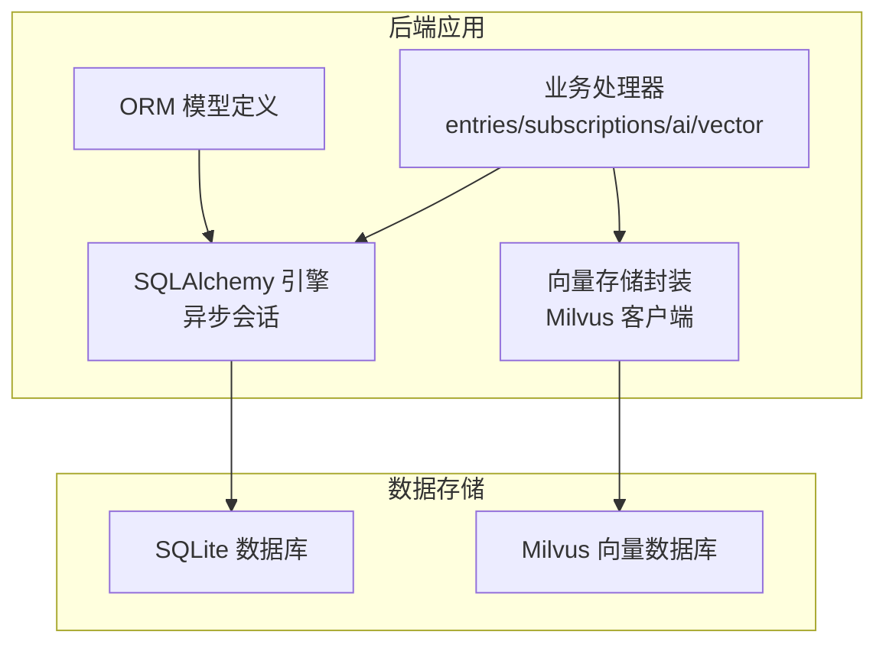
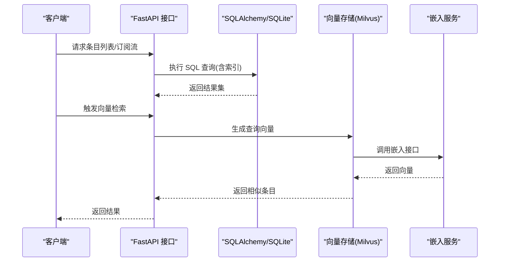
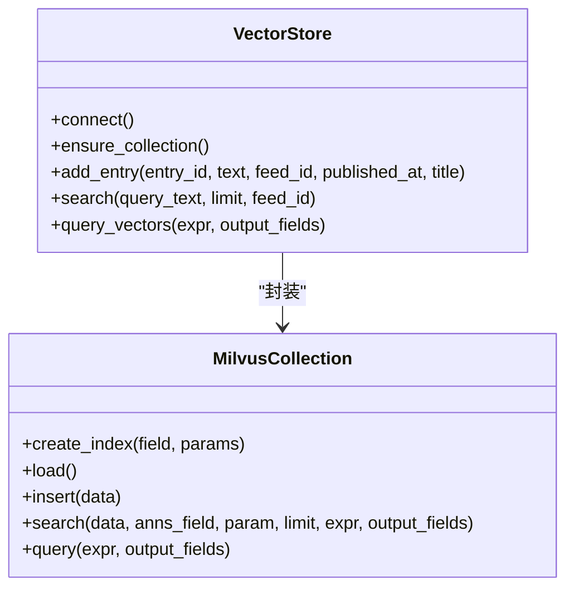
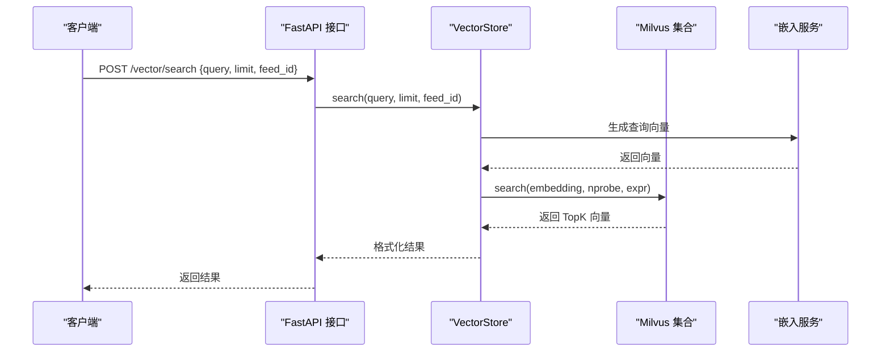
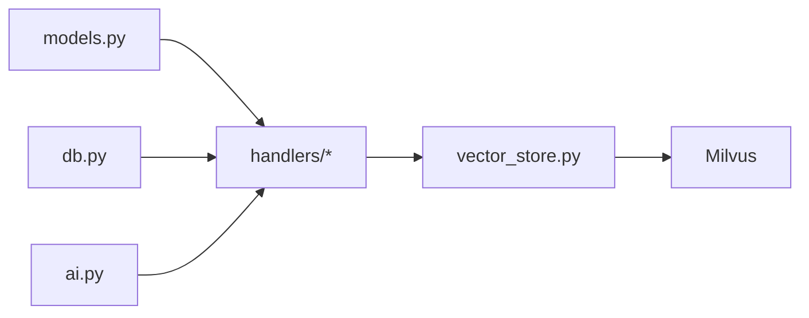

# 索引策略

<cite>
**本文引用的文件**
- [python-backend/app/db.py](file://python-backend/app/db.py)
- [python-backend/app/models.py](file://python-backend/app/models.py)
- [python-backend/update_schema.py](file://python-backend/update_schema.py)
- [python-backend/app/handlers/entries.py](file://python-backend/app/handlers/entries.py)
- [python-backend/app/handlers/subscriptions.py](file://python-backend/app/handlers/subscriptions.py)
- [python-backend/app/handlers/vector_store.py](file://python-backend/app/handlers/vector_store.py)
- [python-backend/app/handlers/vector.py](file://python-backend/app/handlers/vector.py)
- [python-backend/app/handlers/ai.py](file://python-backend/app/handlers/ai.py)
- [python-backend/app/config.py](file://python-backend/app/config.py)
- [python-backend/tests/test_vector_system.py](file://python-backend/tests/test_vector_system.py)
</cite>

## 目录
1. [简介](#简介)
2. [项目结构](#项目结构)
3. [核心组件](#核心组件)
4. [架构总览](#架构总览)
5. [详细组件分析](#详细组件分析)
6. [依赖分析](#依赖分析)
7. [性能考量](#性能考量)
8. [故障排查指南](#故障排查指南)
9. [结论](#结论)
10. [附录](#附录)

## 简介
本文件面向 Tan RSS Reader 的数据库与向量数据库索引策略，系统性阐述主键索引、唯一索引、复合索引与向量索引的设计决策与实现细节。重点解释高频查询字段为何需要索引（如 feed_id、user_id、channel_id 等），并给出写入性能与查询性能的平衡策略、索引维护成本与存储开销的权衡分析，以及针对常见查询模式的索引设计方案。同时对比传统关系数据库与 Milvus 向量数据库在索引机制上的差异。

## 项目结构
后端采用 SQLAlchemy ORM + 异步引擎，SQLite 作为本地默认存储；Milvus 作为向量检索后端。模型定义集中于 models.py，数据库初始化与迁移脚本位于 update_schema.py，查询接口集中在 handlers 子模块中，向量检索与聚类由 vector_store.py 与 vector.py 提供。



图表来源
- [python-backend/app/db.py:1-27](file://python-backend/app/db.py#L1-L27)
- [python-backend/app/models.py:1-228](file://python-backend/app/models.py#L1-L228)
- [python-backend/app/handlers/vector_store.py:1-197](file://python-backend/app/handlers/vector_store.py#L1-L197)

章节来源
- [python-backend/app/db.py:1-27](file://python-backend/app/db.py#L1-L27)
- [python-backend/app/models.py:1-228](file://python-backend/app/models.py#L1-L228)
- [python-backend/update_schema.py:1-136](file://python-backend/update_schema.py#L1-L136)

## 核心组件
- 关系数据库层
  - 引擎与会话：异步 SQLite 引擎与会话工厂，支持按需创建表与列。
  - 模型与索引：通过 mapped_column 的 index/unique 参数声明索引；外键自动建立索引。
- 向量数据库层
  - Milvus 集合：定义向量字段、主键、分区键与倒排索引参数，支持语义相似度检索。
- 查询接口层
  - 常见查询：按 feed_id、订阅频道关联链路、星标/未读过滤、日期范围过滤等。
  - 向量检索：基于嵌入向量的近似最近邻搜索，支持按 feed_id 过滤。

章节来源
- [python-backend/app/db.py:1-27](file://python-backend/app/db.py#L1-L27)
- [python-backend/app/models.py:1-228](file://python-backend/app/models.py#L1-L228)
- [python-backend/app/handlers/entries.py:1-310](file://python-backend/app/handlers/entries.py#L1-L310)
- [python-backend/app/handlers/subscriptions.py:1-175](file://python-backend/app/handlers/subscriptions.py#L1-L175)
- [python-backend/app/handlers/vector_store.py:1-197](file://python-backend/app/handlers/vector_store.py#L1-L197)

## 架构总览
下图展示查询路径与索引使用的关键节点，包括关系数据库与向量数据库的协同工作方式。



图表来源
- [python-backend/app/handlers/entries.py:41-107](file://python-backend/app/handlers/entries.py#L41-L107)
- [python-backend/app/handlers/subscriptions.py:109-174](file://python-backend/app/handlers/subscriptions.py#L109-L174)
- [python-backend/app/handlers/vector.py:108-111](file://python-backend/app/handlers/vector.py#L108-L111)
- [python-backend/app/handlers/vector_store.py:130-178](file://python-backend/app/handlers/vector_store.py#L130-L178)

## 详细组件分析

### 关系数据库索引设计与查询热点
- 主键索引
  - 所有实体主键均为主键索引，保证唯一性与快速定位。
  - 示例：Feed.id、Entry.id、User.id、Channel.id、Category.id、Tag.id、EntryAI.entry_id 等。
- 唯一索引
  - 唯一约束自动建立唯一索引，加速去重与唯一查找。
  - 示例：Feed.url、Category.name、Tag.name、User.username、User.email、UserMembership.user_id。
- 外键索引
  - 外键字段默认建立索引，加速 JOIN 与反向引用。
  - 示例：Entry.feed_id、Subscription.user_id、Subscription.channel_id、UserAIPrompt.user_id、UserUsage.user_id、AIDailyDigest.user_id、UserMembership.user_id。
- 复合索引
  - 当前代码未显式定义复合索引，但可通过组合单列索引达到类似效果。
  - 建议场景：AIDailyDigest(user_id, date_str)、UserUsage(user_id, date_str) 可考虑复合索引以优化聚合与范围查询。
- 全文索引
  - SQLite 不支持原生全文索引，可通过扩展或应用侧实现（如 FTS5）。当前项目未启用全文索引。

```mermaid
erDiagram
FEEDS {
string id PK
string url UK
string title
datetime last_updated
}
ENTRIES {
string id PK
string feed_id FK
string dedup_key
boolean is_read
boolean is_starred
datetime published_at
datetime created_at
}
USERS {
string id PK
string username UK
string email UK
string role
}
SUBSCRIPTIONS {
string id PK
string user_id FK
string channel_id FK
}
CHANNELS {
string id PK
string owner_id
string category_id FK
}
CATEGORIES {
string id PK
string name UK
}
TAGS {
string id PK
string name UK
}
CHANNEL_TAGS {
string channel_id FK PK
string tag_id FK PK
}
CHANNEL_SOURCES {
string channel_id FK PK
string feed_id FK PK
}
USER_MEMBERSHIPS {
string id PK
string user_id UK
string tier
}
USER_USAGES {
string id PK
string user_id
string date_str
}
AI_DAILY_DIGESTS {
string id PK
string user_id
string date_str
}
FEEDS ||--o{ ENTRIES : "拥有"
USERS ||--o{ SUBSCRIPTIONS : "订阅"
CHANNELS ||--o{ SUBSCRIPTIONS : "被订阅"
CHANNELS ||--o{ CHANNEL_TAGS : "关联"
TAGS ||--o{ CHANNEL_TAGS : "关联"
CHANNELS ||--o{ CHANNEL_SOURCES : "包含"
FEEDS ||--o{ CHANNEL_SOURCES : "来源"
USERS ||--o{ USER_MEMBERSHIPS : "拥有"
USERS ||--o{ USER_USAGES : "用量"
USERS ||--o{ AI_DAILY_DIGESTS : "日摘要"
```

图表来源
- [python-backend/app/models.py:7-228](file://python-backend/app/models.py#L7-L228)

章节来源
- [python-backend/app/models.py:7-228](file://python-backend/app/models.py#L7-L228)
- [python-backend/update_schema.py:104-127](file://python-backend/update_schema.py#L104-L127)

### 查询热点字段与索引需求
- feed_id
  - 用途：条目列表按源过滤、订阅聚合、统计分析。
  - 索引：Entry.feed_id 已建立索引；建议在 ENTRIES 上补充 (feed_id, published_at) 或 (feed_id, created_at) 组合查询优化。
- user_id
  - 用途：用户维度的数据隔离、订阅、AI 使用统计、日摘要。
  - 索引：Subscription.user_id、UserAIPrompt.user_id、UserUsage.user_id、AIDailyDigest.user_id、UserMembership.user_id 已建立索引。
- channel_id
  - 用途：订阅关系、频道聚合视图。
  - 索引：Subscription.channel_id 已建立索引。
- dedup_key
  - 用途：去重标识，入库前快速判重。
  - 索引：Entry.dedup_key 已建立索引。
- date_str
  - 用途：日维度统计与摘要。
  - 索引：AIDailyDigest.date_str、UserUsage.date_str 已建立索引；可考虑 (user_id, date_str) 复合索引提升聚合效率。

章节来源
- [python-backend/app/models.py:21-38](file://python-backend/app/models.py#L21-L38)
- [python-backend/app/models.py:72-80](file://python-backend/app/models.py#L72-L80)
- [python-backend/app/models.py:179-186](file://python-backend/app/models.py#L179-L186)
- [python-backend/app/models.py:197-205](file://python-backend/app/models.py#L197-L205)
- [python-backend/app/models.py:207-214](file://python-backend/app/models.py#L207-L214)
- [python-backend/update_schema.py:122-123](file://python-backend/update_schema.py#L122-L123)

### 常见查询模式与索引建议
- 列表查询（按 feed_id 过滤）
  - SQL 特征：WHERE feed_id = ? ORDER BY published_at DESC/created_at DESC LIMIT N OFFSET M
  - 现状：feed_id 已索引，排序字段未复合索引
  - 建议：为 ENTRIES(feed_id, published_at) 或 (feed_id, created_at) 创建复合索引，避免排序时回表
- 星标/未读过滤
  - SQL 特征：WHERE is_starred = TRUE/FALSE OR is_read = FALSE
  - 现状：is_starred/is_read 为普通布尔列，未建索引
  - 建议：对高频过滤条件建立单列索引，或根据选择性合并为复合索引（如 (feed_id, is_starred)）
- 订阅聚合（我的订阅条目）
  - SQL 特征：子查询获取订阅频道 -> 查找频道来源 feed_id -> IN 查询 feed_id
  - 现状：涉及多次 JOIN 与 IN 列表，feed_id 已索引
  - 建议：确保中间结果集较小，必要时在临时表上建立 (channel_id, feed_id) 复合索引
- 日摘要与用量统计
  - SQL 特征：按 user_id/date_str 聚合
  - 现状：已建立单列索引
  - 建议：(user_id, date_str) 复合索引可显著降低排序与分组成本

章节来源
- [python-backend/app/handlers/entries.py:41-107](file://python-backend/app/handlers/entries.py#L41-L107)
- [python-backend/app/handlers/subscriptions.py:109-174](file://python-backend/app/handlers/subscriptions.py#L109-L174)
- [python-backend/update_schema.py:122-123](file://python-backend/update_schema.py#L122-L123)

### 写入性能影响与平衡策略
- 索引数量与写入代价
  - 每增加一个索引，INSERT/UPDATE/DELETE 需要维护多个 B-Tree 结构，写入延迟上升
  - 对高频写入表（如 ENTRIES）应控制索引数量，优先保留最常用查询的索引
- 读写权衡
  - 读多写少场景：适度增加索引，提升查询性能
  - 写多读少场景：减少索引，降低写放大
- 建议
  - 将高频过滤字段（feed_id、user_id、channel_id、dedup_key）保持索引
  - 对低选择性的布尔字段（is_read、is_starred）谨慎加索引
  - 对日期类字段（date_str）优先考虑复合索引

章节来源
- [python-backend/app/models.py:21-38](file://python-backend/app/models.py#L21-L38)
- [python-backend/app/models.py:72-80](file://python-backend/app/models.py#L72-L80)
- [python-backend/app/models.py:179-186](file://python-backend/app/models.py#L179-L186)
- [python-backend/app/models.py:197-205](file://python-backend/app/models.py#L197-L205)
- [python-backend/app/models.py:207-214](file://python-backend/app/models.py#L207-L214)

### 索引维护成本、存储开销与查询性能权衡
- 存储开销
  - 索引占用额外磁盘空间，通常为主键表的 1.2~2 倍
  - 复合索引比单列索引占用更多空间
- 维护成本
  - 写操作触发索引更新，CPU 与 I/O 开销随索引数量线性增长
  - 大批量导入建议先禁用非必要索引，导入完成后再重建
- 查询性能
  - 单列索引可显著降低等值/范围查询成本
  - 复合索引可消除排序与回表，大幅降低 IO
- 建议
  - 对高选择性字段优先建立索引
  - 定期分析查询计划，移除低效或冗余索引

章节来源
- [python-backend/app/models.py:7-228](file://python-backend/app/models.py#L7-L228)

### 向量数据库 Milvus 索引机制与传统数据库对比
- Milvus 索引类型
  - IVF_FLAT（倒排向量索引，适合中小规模向量集合）
  - HNSW（图算法，适合高维稀疏向量）
  - ANNOY（树结构，适合大规模向量集合）
- 本项目实现
  - 字段：id（自增主键）、entry_id（业务主键）、embedding（向量）、feed_id、published_at、title
  - 索引：embedding 字段使用 IVF_FLAT，metric_type=COSINE，nlist 控制倒排桶数量
  - 加载：集合创建后立即 load，支持后续插入与查询
- 与传统数据库差异
  - 传统数据库：B-Tree/哈希索引，适用于结构化等值/范围查询
  - Milvus：近似最近邻索引，适用于高维向量相似度检索
  - 查询参数：nprobe 控制扫描桶数，越大召回率越高但延迟上升
- 应用实践
  - 插入：先删除旧 entry_id 的向量，再插入新向量，避免重复
  - 查询：可选按 feed_id 过滤，提高相关性与召回质量



图表来源
- [python-backend/app/handlers/vector_store.py:18-197](file://python-backend/app/handlers/vector_store.py#L18-L197)

章节来源
- [python-backend/app/handlers/vector_store.py:55-91](file://python-backend/app/handlers/vector_store.py#L55-L91)
- [python-backend/app/handlers/vector_store.py:92-128](file://python-backend/app/handlers/vector_store.py#L92-L128)
- [python-backend/app/handlers/vector_store.py:130-178](file://python-backend/app/handlers/vector_store.py#L130-L178)
- [python-backend/app/handlers/vector.py:108-111](file://python-backend/app/handlers/vector.py#L108-L111)

### 向量检索流程与性能要点


图表来源
- [python-backend/app/handlers/vector.py:108-111](file://python-backend/app/handlers/vector.py#L108-L111)
- [python-backend/app/handlers/vector_store.py:130-178](file://python-backend/app/handlers/vector_store.py#L130-L178)

章节来源
- [python-backend/app/handlers/vector.py:108-111](file://python-backend/app/handlers/vector.py#L108-L111)
- [python-backend/app/handlers/vector_store.py:130-178](file://python-backend/app/handlers/vector_store.py#L130-L178)

### 测试与验证
- 测试流程
  - 连接 Milvus → 插入测试向量 → 等待加载 → 向量检索 → 聚类分析
- 建议
  - 在 CI 中集成 Milvus 容器，自动化向量检索与聚类测试
  - 对不同 nprobe/nlist 组合进行回归测试，评估召回与延迟

章节来源
- [python-backend/tests/test_vector_system.py:17-81](file://python-backend/tests/test_vector_system.py#L17-L81)

## 依赖分析
- 模块耦合
  - handlers 依赖 models 与 db，负责业务逻辑与查询组织
  - vector_store 依赖 Milvus SDK，封装向量插入与检索
  - ai.py 提供嵌入调用与配置管理，贯穿向量检索链路
- 外部依赖
  - SQLite：轻量级本地存储，适合开发与小规模部署
  - Milvus：高性能向量检索，适合生产环境



图表来源
- [python-backend/app/models.py:1-228](file://python-backend/app/models.py#L1-L228)
- [python-backend/app/db.py:1-27](file://python-backend/app/db.py#L1-L27)
- [python-backend/app/handlers/ai.py:1-800](file://python-backend/app/handlers/ai.py#L1-L800)
- [python-backend/app/handlers/vector_store.py:1-197](file://python-backend/app/handlers/vector_store.py#L1-L197)

章节来源
- [python-backend/app/models.py:1-228](file://python-backend/app/models.py#L1-L228)
- [python-backend/app/db.py:1-27](file://python-backend/app/db.py#L1-L27)
- [python-backend/app/handlers/ai.py:1-800](file://python-backend/app/handlers/ai.py#L1-L800)
- [python-backend/app/handlers/vector_store.py:1-197](file://python-backend/app/handlers/vector_store.py#L1-L197)

## 性能考量
- 写入性能
  - 减少索引数量，批量写入时避免频繁提交
  - 对高频写入表（如 ENTRIES）仅保留必要索引
- 查询性能
  - 使用 EXPLAIN QUERY PLAN 分析慢查询
  - 为热点查询字段建立复合索引，避免回表与排序
- 向量检索
  - nprobe 与 nlist 是召回与延迟的主要调节参数
  - 按 feed_id 过滤可提升相关性，但会增加过滤成本
- 存储与维护
  - 定期备份 SQLite 与 Milvus，监控索引大小与查询延迟
  - 对历史数据进行冷热分离，降低索引维护压力

## 故障排查指南
- Milvus 连接失败
  - 检查主机与端口配置，确认服务可达
  - 若使用本地 Lite，确认 URI 路径正确
- 插入重复或缺失
  - 确认按 entry_id 删除旧记录后再插入
  - 检查嵌入维度是否符合预期（1024）
- 查询无结果
  - 调整 nprobe 值，增大召回
  - 确认集合已 load，且存在数据
- 查询计划异常
  - 使用 EXPLAIN 分析 SQL，确认索引命中
  - 对复合查询字段建立相应复合索引

章节来源
- [python-backend/app/handlers/vector_store.py:23-54](file://python-backend/app/handlers/vector_store.py#L23-L54)
- [python-backend/app/handlers/vector_store.py:92-128](file://python-backend/app/handlers/vector_store.py#L92-L128)
- [python-backend/app/handlers/vector_store.py:130-178](file://python-backend/app/handlers/vector_store.py#L130-L178)

## 结论
- 传统数据库索引应围绕高频查询字段（feed_id、user_id、channel_id、dedup_key、date_str）构建，优先满足最常用的过滤与排序需求
- 对复合查询场景引入复合索引，可显著降低排序与回表成本
- 写入性能与查询性能需动态平衡，建议在写多读少场景减少索引，在读多写少场景适度增加
- Milvus 向量索引以 COSINE 距离与 IVF_FLAT 为主，nprobe 与 nlist 是关键调优参数
- 建议建立索引变更规范与回归测试，保障线上稳定性

## 附录
- 配置项参考
  - Milvus 主机、端口、集合名：见配置模块
  - AI 服务与嵌入模型：见 AI 配置模块
- 常用查询模式
  - 按 feed_id 列表页：WHERE feed_id = ? ORDER BY published_at DESC LIMIT N
  - 我的订阅条目：JOIN/IN 链路 + WHERE 条件 + 日期过滤
  - 日摘要与用量：按 user_id/date_str 聚合

章节来源
- [python-backend/app/config.py:29-56](file://python-backend/app/config.py#L29-L56)
- [python-backend/app/handlers/ai.py:34-64](file://python-backend/app/handlers/ai.py#L34-L64)
- [python-backend/app/handlers/entries.py:41-107](file://python-backend/app/handlers/entries.py#L41-L107)
- [python-backend/app/handlers/subscriptions.py:109-174](file://python-backend/app/handlers/subscriptions.py#L109-L174)