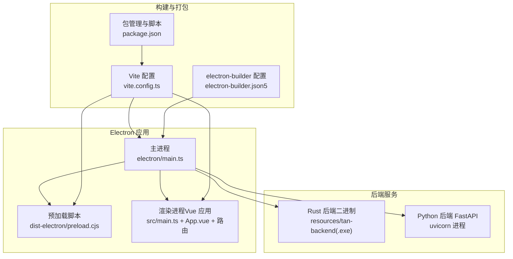
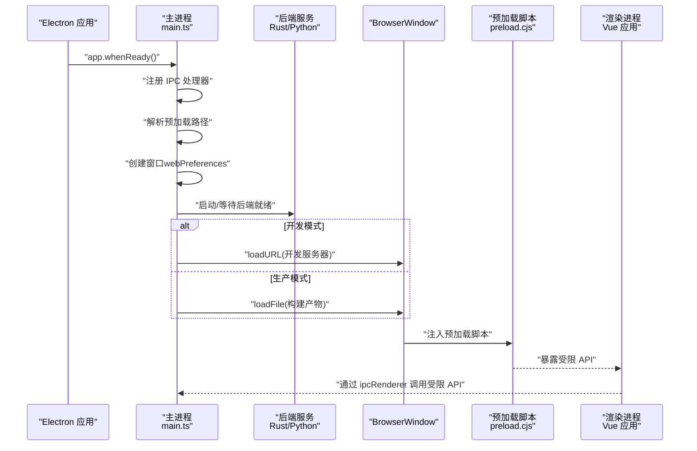
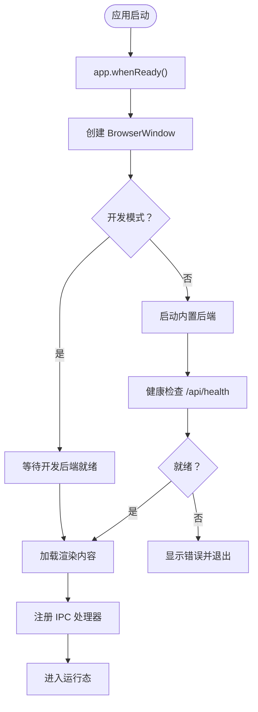
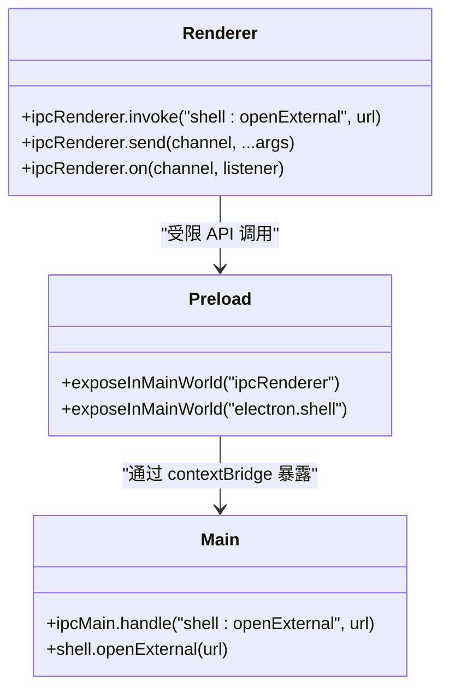
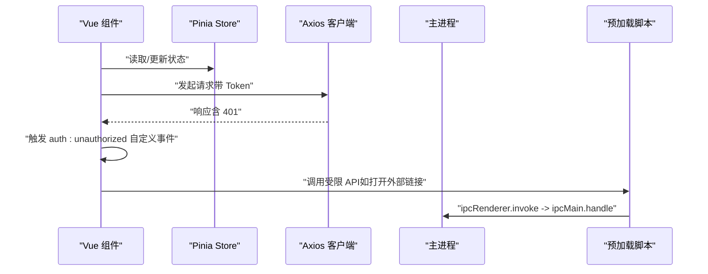
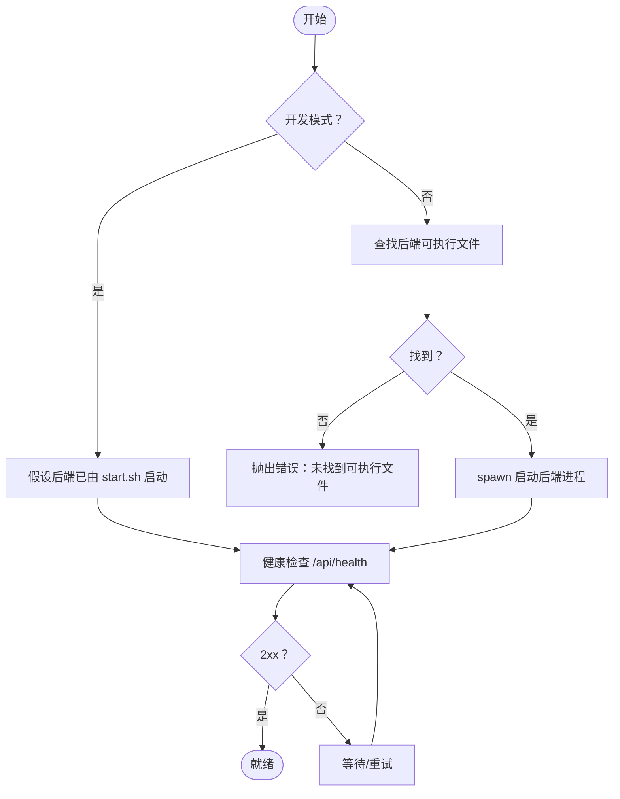
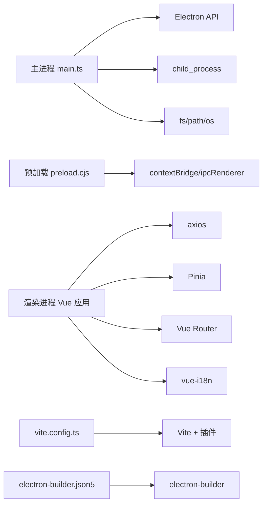

# Electron架构设计

<cite>
**本文档引用的文件**
- [rss-desktop/electron/main.ts](file://rss-desktop/electron/main.ts)
- [rss-desktop/dist-electron/preload.cjs](file://rss-desktop/dist-electron/preload.cjs)
- [rss-desktop/vite.config.ts](file://rss-desktop/vite.config.ts)
- [rss-desktop/package.json](file://rss-desktop/package.json)
- [rss-desktop/src/main.ts](file://rss-desktop/src/main.ts)
- [rss-desktop/src/App.vue](file://rss-desktop/src/App.vue)
- [rss-desktop/src/router/index.ts](file://rss-desktop/src/router/index.ts)
- [rss-desktop/src/api/client.ts](file://rss-desktop/src/api/client.ts)
- [rss-desktop/tsconfig.json](file://rss-desktop/tsconfig.json)
- [rss-desktop/tsconfig.node.json](file://rss-desktop/tsconfig.node.json)
- [rss-desktop/electron-builder.json5](file://rss-desktop/electron-builder.json5)
- [rss-desktop/resources/start-backend.sh](file://rss-desktop/resources/start-backend.sh)
- [start.sh](file://start.sh)
</cite>

## 目录
1. [简介](#简介)
2. [项目结构](#项目结构)
3. [核心组件](#核心组件)
4. [架构总览](#架构总览)
5. [详细组件分析](#详细组件分析)
6. [依赖关系分析](#依赖关系分析)
7. [性能考虑](#性能考虑)
8. [故障排查指南](#故障排查指南)
9. [结论](#结论)
10. [附录](#附录)

## 简介
本文件面向 Tan RSS Reader 的 Electron 架构，系统化阐述主进程与渲染进程的职责划分、进程间通信（IPC）机制、安全隔离策略、应用生命周期与窗口管理、系统集成（托盘/通知）、预加载脚本与安全上下文、Node.js 集成限制、开发与生产模式差异、热重载与调试策略、跨平台兼容性处理，以及性能优化、内存管理与崩溃处理的最佳实践。

## 项目结构
rss-desktop 采用“前端（Vue 3 + Vite）+ Electron 主进程 + 预加载脚本”的典型桌面应用布局，并通过 electron-builder 进行多平台打包。后端由两部分组成：Rust 后端二进制（随应用分发）与 Python 后端（FastAPI，开发时由脚本启动或生产时由资源脚本启动）。

图表来源
- [rss-desktop/electron/main.ts:1-548](file://rss-desktop/electron/main.ts#L1-L548)
- [rss-desktop/dist-electron/preload.cjs:1-36](file://rss-desktop/dist-electron/preload.cjs#L1-L36)
- [rss-desktop/vite.config.ts:1-55](file://rss-desktop/vite.config.ts#L1-L55)
- [rss-desktop/package.json:1-81](file://rss-desktop/package.json#L1-L81)
- [rss-desktop/electron-builder.json5:1-87](file://rss-desktop/electron-builder.json5#L1-L87)

章节来源
- [rss-desktop/electron/main.ts:1-548](file://rss-desktop/electron/main.ts#L1-L548)
- [rss-desktop/vite.config.ts:1-55](file://rss-desktop/vite.config.ts#L1-L55)
- [rss-desktop/package.json:1-81](file://rss-desktop/package.json#L1-L81)
- [rss-desktop/electron-builder.json5:1-87](file://rss-desktop/electron-builder.json5#L1-L87)

## 核心组件
- 主进程：负责应用生命周期、窗口管理、子进程（后端）管理、IPC 注册与处理、系统集成（如打开外部链接）、日志与状态页展示。
- 预加载脚本：通过 contextBridge 暴露受控 API 到渲染进程，实现安全的 IPC 通道。
- 渲染进程：Vue 应用，负责 UI、路由、状态管理、网络请求拦截与认证处理。
- 后端服务：Rust 二进制与 Python FastAPI，提供数据与 AI 功能；主进程负责发现、启动与健康检查。
- 构建与打包：Vite + vite-plugin-electron，electron-builder 多平台打包与资源注入。

章节来源
- [rss-desktop/electron/main.ts:1-548](file://rss-desktop/electron/main.ts#L1-L548)
- [rss-desktop/dist-electron/preload.cjs:1-36](file://rss-desktop/dist-electron/preload.cjs#L1-L36)
- [rss-desktop/src/main.ts:1-9](file://rss-desktop/src/main.ts#L1-L9)
- [rss-desktop/src/App.vue:1-333](file://rss-desktop/src/App.vue#L1-L333)
- [rss-desktop/src/router/index.ts:1-77](file://rss-desktop/src/router/index.ts#L1-L77)
- [rss-desktop/src/api/client.ts:1-29](file://rss-desktop/src/api/client.ts#L1-L29)

## 架构总览
下图展示了从应用启动到渲染内容加载的关键交互，包括主进程如何管理后端、如何创建窗口、如何加载渲染内容，以及渲染进程如何通过预加载脚本与主进程通信。

图表来源
- [rss-desktop/electron/main.ts:449-506](file://rss-desktop/electron/main.ts#L449-L506)
- [rss-desktop/dist-electron/preload.cjs:5-35](file://rss-desktop/dist-electron/preload.cjs#L5-L35)
- [rss-desktop/vite.config.ts:15-41](file://rss-desktop/vite.config.ts#L15-L41)

章节来源
- [rss-desktop/electron/main.ts:304-444](file://rss-desktop/electron/main.ts#L304-L444)
- [rss-desktop/dist-electron/preload.cjs:1-36](file://rss-desktop/dist-electron/preload.cjs#L1-L36)
- [rss-desktop/vite.config.ts:1-55](file://rss-desktop/vite.config.ts#L1-L55)

## 详细组件分析

### 主进程职责与生命周期
- 生命周期管理：监听 app 事件（ready、window-all-closed、activate、before-quit、quit），在不同平台行为上保持一致。
- 窗口管理：创建 BrowserWindow，设置最小尺寸、图标、webPreferences（禁用 nodeIntegration、启用 contextIsolation、允许 webview、放宽 webSecurity 支持阅读模式跨域）。
- 后端管理：解析后端可执行文件路径（支持多平台与打包后位置），spawn 子进程，记录 stdout/stderr，健康检查（HTTP /api/health），超时与错误处理。
- IPC 注册：注册 shell:openExternal 处理器，供渲染进程调用以在系统默认浏览器打开链接。
- 启动状态页：在加载真实页面前显示 data:text/html 启动页，提升用户体验。
- 日志与路径：启动时切换日志路径到用户数据目录，保证持久化。

图表来源
- [rss-desktop/electron/main.ts:449-506](file://rss-desktop/electron/main.ts#L449-L506)
- [rss-desktop/electron/main.ts:93-132](file://rss-desktop/electron/main.ts#L93-L132)
- [rss-desktop/electron/main.ts:197-273](file://rss-desktop/electron/main.ts#L197-L273)

章节来源
- [rss-desktop/electron/main.ts:449-548](file://rss-desktop/electron/main.ts#L449-L548)
- [rss-desktop/electron/main.ts:304-444](file://rss-desktop/electron/main.ts#L304-L444)

### 预加载脚本与安全上下文
- 作用：通过 contextBridge 将有限的 ipcRenderer 和特定 API 暴露给渲染进程，实现安全隔离。
- 暴露接口：ipcRenderer.on/off/send/invoke；electron.shell.openExternal(url) 通过 ipcRenderer.invoke 调用主进程处理器。
- 安全策略：渲染进程无法直接访问 Node.js 或 Electron 主进程 API，只能通过白名单方法通信。

图表来源
- [rss-desktop/dist-electron/preload.cjs:5-35](file://rss-desktop/dist-electron/preload.cjs#L5-L35)
- [rss-desktop/electron/main.ts:450-459](file://rss-desktop/electron/main.ts#L450-L459)

章节来源
- [rss-desktop/dist-electron/preload.cjs:1-36](file://rss-desktop/dist-electron/preload.cjs#L1-L36)
- [rss-desktop/electron/main.ts:320-329](file://rss-desktop/electron/main.ts#L320-L329)

### 渲染进程与路由、状态管理
- 入口：src/main.ts 创建 Vue 应用，挂载 App.vue。
- App.vue：全局布局、侧边栏拖拽、通知 Toast、认证弹窗、频道编辑弹窗等。
- 路由：src/router/index.ts 定义页面路由与鉴权守卫（requiresAuth、requiresAdmin）。
- 网络层：src/api/client.ts 使用 axios，设置 baseURL（开发代理到本地后端），拦截 401 触发自定义事件以驱动登出与 UI 更新。

图表来源
- [rss-desktop/src/main.ts:1-9](file://rss-desktop/src/main.ts#L1-L9)
- [rss-desktop/src/App.vue:1-333](file://rss-desktop/src/App.vue#L1-L333)
- [rss-desktop/src/router/index.ts:50-77](file://rss-desktop/src/router/index.ts#L50-L77)
- [rss-desktop/src/api/client.ts:1-29](file://rss-desktop/src/api/client.ts#L1-L29)
- [rss-desktop/dist-electron/preload.cjs:5-35](file://rss-desktop/dist-electron/preload.cjs#L5-L35)
- [rss-desktop/electron/main.ts:450-459](file://rss-desktop/electron/main.ts#L450-L459)

章节来源
- [rss-desktop/src/main.ts:1-9](file://rss-desktop/src/main.ts#L1-L9)
- [rss-desktop/src/App.vue:1-333](file://rss-desktop/src/App.vue#L1-L333)
- [rss-desktop/src/router/index.ts:1-77](file://rss-desktop/src/router/index.ts#L1-L77)
- [rss-desktop/src/api/client.ts:1-29](file://rss-desktop/src/api/client.ts#L1-L29)

### 后端服务管理与健康检查
- 后端类型：Rust 二进制（随应用分发）与 Python FastAPI（开发时由 start.sh 启动，生产时由资源脚本启动）。
- 启动策略：开发模式优先假设后端已由 start.sh 启动；生产模式扫描多处资源路径定位可执行文件并启动。
- 健康检查：定时轮询 /api/health，超时时间较长以适配慢盘与首次初始化。
- 错误处理：记录后端输出、进程退出原因、超时与找不到可执行文件场景。

图表来源
- [rss-desktop/electron/main.ts:137-192](file://rss-desktop/electron/main.ts#L137-L192)
- [rss-desktop/electron/main.ts:93-132](file://rss-desktop/electron/main.ts#L93-L132)
- [rss-desktop/resources/start-backend.sh:1-29](file://rss-desktop/resources/start-backend.sh#L1-L29)

章节来源
- [rss-desktop/electron/main.ts:137-273](file://rss-desktop/electron/main.ts#L137-L273)
- [rss-desktop/resources/start-backend.sh:1-29](file://rss-desktop/resources/start-backend.sh#L1-L29)

### 开发模式与生产模式差异
- 开发模式：Vite 开发服务器地址作为渲染内容来源；禁用安全警告；自动打开开发者工具；后端由 start.sh 管理。
- 生产模式：加载本地构建产物；严格打包与资源注入；后端二进制随应用分发；健康检查与错误提示更完善。
- 构建配置：vite.config.ts 在 electron 模式下启用 vite-plugin-electron，分别构建主进程与预加载脚本；package.json 指定 main 入口与脚本。

章节来源
- [rss-desktop/electron/main.ts:26-31](file://rss-desktop/electron/main.ts#L26-L31)
- [rss-desktop/electron/main.ts:434-444](file://rss-desktop/electron/main.ts#L434-L444)
- [rss-desktop/vite.config.ts:15-41](file://rss-desktop/vite.config.ts#L15-L41)
- [rss-desktop/package.json:41-54](file://rss-desktop/package.json#L41-L54)

### 热重载与调试策略
- Vite 热重载：vite-plugin-electron 在 electron 模式下构建主进程与预加载脚本，并在启动时触发 reload。
- 调试策略：开发模式自动打开开发者工具；主进程日志输出到控制台与用户数据目录下的日志文件；渲染进程通过自定义事件与主进程通信便于定位问题。

章节来源
- [rss-desktop/vite.config.ts:22-26](file://rss-desktop/vite.config.ts#L22-L26)
- [rss-desktop/electron/main.ts:352-357](file://rss-desktop/electron/main.ts#L352-L357)
- [rss-desktop/electron/main.ts:68-88](file://rss-desktop/electron/main.ts#L68-L88)

### 跨平台兼容性与系统集成
- 平台差异：Windows 下后端可执行文件添加 .exe 后缀；macOS Dock 行为与窗口激活；Linux/Windows 打包目标与图标配置。
- 系统集成：通过 shell.openExternal 在系统默认浏览器打开链接；electron-builder 配置各平台安装器与快捷方式。
- 阅读模式：启用 webviewTag 并放宽 webSecurity 以支持跨域阅读场景。

章节来源
- [rss-desktop/electron/main.ts:160-166](file://rss-desktop/electron/main.ts#L160-L166)
- [rss-desktop/electron/main.ts:508-537](file://rss-desktop/electron/main.ts#L508-L537)
- [rss-desktop/electron-builder.json5:45-85](file://rss-desktop/electron-builder.json5#L45-L85)
- [rss-desktop/electron/main.ts:320-329](file://rss-desktop/electron/main.ts#L320-L329)

## 依赖关系分析
- 主进程依赖：electron（app、BrowserWindow、ipcMain、shell）、node:child_process（spawn）、fs/path/os（文件系统与路径）。
- 预加载脚本依赖：electron（contextBridge、ipcRenderer）。
- 渲染进程依赖：Vue 3、Pinia、Vue Router、axios、国际化等。
- 构建依赖：Vite、vite-plugin-electron、electron-builder、TypeScript。

图表来源
- [rss-desktop/electron/main.ts:1-8](file://rss-desktop/electron/main.ts#L1-L8)
- [rss-desktop/dist-electron/preload.cjs:5-35](file://rss-desktop/dist-electron/preload.cjs#L5-L35)
- [rss-desktop/src/api/client.ts:1-29](file://rss-desktop/src/api/client.ts#L1-L29)
- [rss-desktop/vite.config.ts:1-55](file://rss-desktop/vite.config.ts#L1-L55)
- [rss-desktop/electron-builder.json5:1-87](file://rss-desktop/electron-builder.json5#L1-L87)

章节来源
- [rss-desktop/electron/main.ts:1-548](file://rss-desktop/electron/main.ts#L1-L548)
- [rss-desktop/dist-electron/preload.cjs:1-36](file://rss-desktop/dist-electron/preload.cjs#L1-L36)
- [rss-desktop/src/api/client.ts:1-29](file://rss-desktop/src/api/client.ts#L1-L29)
- [rss-desktop/vite.config.ts:1-55](file://rss-desktop/vite.config.ts#L1-L55)
- [rss-desktop/electron-builder.json5:1-87](file://rss-desktop/electron-builder.json5#L1-L87)

## 性能考虑
- 窗口与渲染：合理设置最小宽高，避免频繁重绘；在阅读模式下放宽 webSecurity 仅限于必要场景。
- 后端启动：健康检查间隔与超时参数平衡启动体验与稳定性；首次初始化时适当延长超时。
- 打包与资源：asar 打包与资源注入减少体积；生产模式下预加载与主进程脚本格式为 cjs，利于加载性能。
- 网络层：统一拦截器处理认证与错误，避免重复请求与无谓重试。
- TypeScript 编译：严格模式与模块解析配置提升类型安全与打包效率。

章节来源
- [rss-desktop/electron/main.ts:313-329](file://rss-desktop/electron/main.ts#L313-L329)
- [rss-desktop/electron/main.ts:49-51](file://rss-desktop/electron/main.ts#L49-L51)
- [rss-desktop/electron-builder.json5:5-6](file://rss-desktop/electron-builder.json5#L5-L6)
- [rss-desktop/src/api/client.ts:8-26](file://rss-desktop/src/api/client.ts#L8-L26)
- [rss-desktop/tsconfig.json:1-25](file://rss-desktop/tsconfig.json#L1-L25)
- [rss-desktop/tsconfig.node.json:1-11](file://rss-desktop/tsconfig.node.json#L1-L11)

## 故障排查指南
- 后端未就绪：检查 start.sh 是否正确启动 Python/FastAPI 与 Rust 后端；确认 /api/health 可访问；查看主进程日志与启动状态页提示。
- 找不到后端可执行文件：核对 electron-builder extraResources 配置与打包产物；确认运行时 resources 目录包含 tan-backend。
- 窗口加载失败：确认 loadURL/loadFile 路径有效；注意 macOS 关闭窗口后引用需清理，避免“对象已销毁”错误。
- IPC 调用异常：确认预加载脚本已注入；检查 ipcMain.handle 是否注册；渲染进程仅能通过受限 API 与主进程通信。
- 开发者工具：开发模式自动打开；若未出现，手动调用 openDevTools 或检查 VITE_DEV_SERVER_URL 环境变量。
- 日志定位：主进程日志输出到控制台与用户数据目录日志文件；启动状态页用于快速反馈错误信息。

章节来源
- [rss-desktop/electron/main.ts:470-505](file://rss-desktop/electron/main.ts#L470-L505)
- [rss-desktop/electron/main.ts:167-191](file://rss-desktop/electron/main.ts#L167-L191)
- [rss-desktop/electron/main.ts:334-357](file://rss-desktop/electron/main.ts#L334-L357)
- [rss-desktop/dist-electron/preload.cjs:5-35](file://rss-desktop/dist-electron/preload.cjs#L5-L35)
- [rss-desktop/electron/main.ts:352-357](file://rss-desktop/electron/main.ts#L352-L357)
- [rss-desktop/electron/main.ts:68-88](file://rss-desktop/electron/main.ts#L68-L88)

## 结论
Tan RSS Reader 的 Electron 架构以清晰的主/渲染进程边界、严格的预加载安全模型、完善的后端生命周期管理与跨平台打包配置为基础，结合 Vite 热重载与 electron-builder 的多平台能力，实现了功能完备、可维护性强的桌面应用。通过合理的健康检查、日志与错误处理策略，能够在复杂环境下稳定运行。

## 附录
- 开发启动脚本：start.sh 一键启动 Python 后端与 Vue 前端，便于本地联调。
- 资源脚本：resources/start-backend.sh 在生产环境中启动 Python/FastAPI 与 Rust 后端。
- 构建与打包：package.json 提供 dev/build/pack 等脚本；electron-builder.json5 配置多平台产物与安装器。

章节来源
- [start.sh:1-94](file://start.sh#L1-L94)
- [rss-desktop/resources/start-backend.sh:1-29](file://rss-desktop/resources/start-backend.sh#L1-L29)
- [rss-desktop/package.json:41-54](file://rss-desktop/package.json#L41-L54)
- [rss-desktop/electron-builder.json5:1-87](file://rss-desktop/electron-builder.json5#L1-L87)