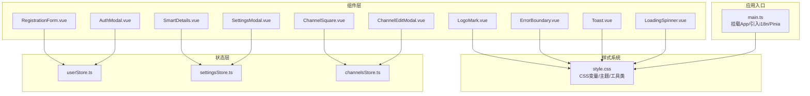
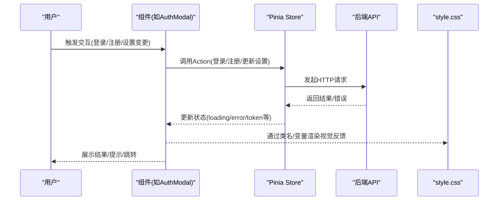
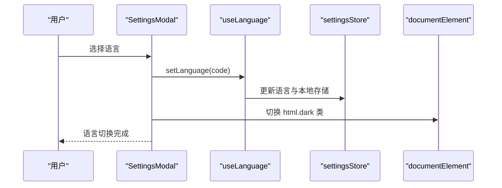
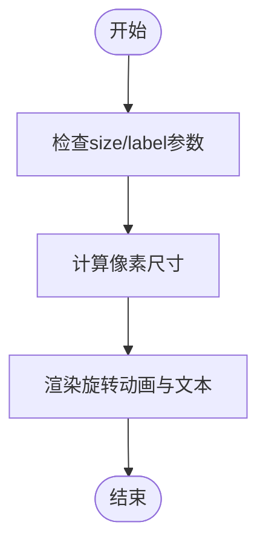
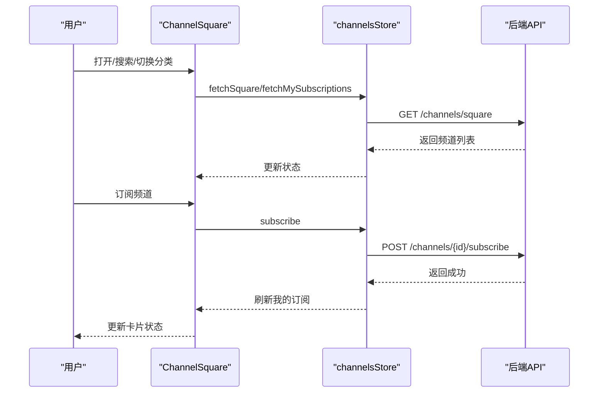
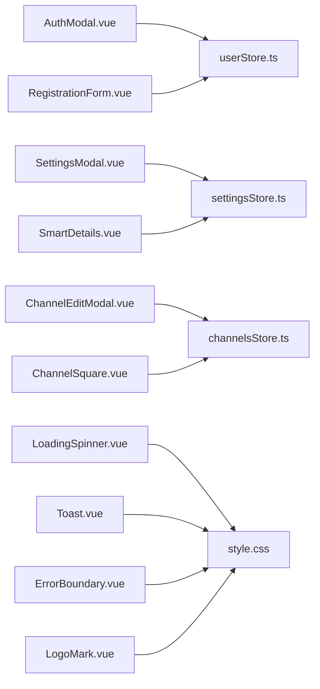

# UI组件库

<cite>
**本文引用的文件**
- [style.css](file://rss-desktop/src/style.css)
- [main.ts](file://rss-desktop/src/main.ts)
- [AuthModal.vue](file://rss-desktop/src/components/AuthModal.vue)
- [RegistrationForm.vue](file://rss-desktop/src/components/RegistrationForm.vue)
- [SettingsModal.vue](file://rss-desktop/src/components/SettingsModal.vue)
- [ChannelEditModal.vue](file://rss-desktop/src/components/ChannelEditModal.vue)
- [ChannelSquare.vue](file://rss-desktop/src/components/ChannelSquare.vue)
- [SmartDetails.vue](file://rss-desktop/src/components/SmartDetails.vue)
- [LoadingSpinner.vue](file://rss-desktop/src/components/LoadingSpinner.vue)
- [Toast.vue](file://rss-desktop/src/components/Toast.vue)
- [ErrorBoundary.vue](file://rss-desktop/src/components/ErrorBoundary.vue)
- [LogoMark.vue](file://rss-desktop/src/components/LogoMark.vue)
- [userStore.ts](file://rss-desktop/src/stores/userStore.ts)
- [settingsStore.ts](file://rss-desktop/src/stores/settingsStore.ts)
- [channelsStore.ts](file://rss-desktop/src/stores/channelsStore.ts)
</cite>

## 目录
1. [引言](#引言)
2. [项目结构](#项目结构)
3. [核心组件](#核心组件)
4. [架构总览](#架构总览)
5. [详细组件分析](#详细组件分析)
6. [依赖关系分析](#依赖关系分析)
7. [性能考量](#性能考量)
8. [故障排查指南](#故障排查指南)
9. [结论](#结论)
10. [附录](#附录)

## 引言
本文件面向 Tan RSS Reader 的前端 UI 组件库，系统性梳理基础设计原则、样式系统与主题定制、通用组件（按钮、表单、模态框、加载指示器等）、可访问性与响应式设计、事件与属性传递机制，并给出 CSS 变量、自定义样式与主题切换的实现方式。文档同时提供使用示例、最佳实践与常见问题解决方案，帮助开发者在多端（桌面 Web）稳定复用与扩展组件。

## 项目结构
- 样式系统集中于全局样式文件，采用 CSS 变量驱动的主题体系，覆盖颜色、阴影、过渡、间距与字体层级。
- 组件以 Vue 单文件组件形式组织，按功能模块划分，如认证、设置、频道、详情、提示等。
- 状态管理由 Pinia Store 提供，组件通过 Store 与后端 API 交互，实现数据驱动的 UI 更新。

图表来源
- [style.css:1-1279](file://rss-desktop/src/style.css#L1-L1279)
- [main.ts:1-9](file://rss-desktop/src/main.ts#L1-L9)
- [AuthModal.vue:1-236](file://rss-desktop/src/components/AuthModal.vue#L1-L236)
- [RegistrationForm.vue:1-604](file://rss-desktop/src/components/RegistrationForm.vue#L1-L604)
- [SettingsModal.vue:1-513](file://rss-desktop/src/components/SettingsModal.vue#L1-L513)
- [ChannelEditModal.vue:1-208](file://rss-desktop/src/components/ChannelEditModal.vue#L1-L208)
- [ChannelSquare.vue:1-667](file://rss-desktop/src/components/ChannelSquare.vue#L1-L667)
- [SmartDetails.vue:1-335](file://rss-desktop/src/components/SmartDetails.vue#L1-L335)
- [LoadingSpinner.vue:1-59](file://rss-desktop/src/components/LoadingSpinner.vue#L1-L59)
- [Toast.vue:1-92](file://rss-desktop/src/components/Toast.vue#L1-L92)
- [ErrorBoundary.vue:1-81](file://rss-desktop/src/components/ErrorBoundary.vue#L1-L81)
- [LogoMark.vue:1-24](file://rss-desktop/src/components/LogoMark.vue#L1-L24)
- [userStore.ts:1-143](file://rss-desktop/src/stores/userStore.ts#L1-L143)
- [settingsStore.ts:1-202](file://rss-desktop/src/stores/settingsStore.ts#L1-L202)
- [channelsStore.ts:1-363](file://rss-desktop/src/stores/channelsStore.ts#L1-L363)

章节来源
- [main.ts:1-9](file://rss-desktop/src/main.ts#L1-L9)
- [style.css:1-1279](file://rss-desktop/src/style.css#L1-L1279)

## 核心组件
本节概述 UI 组件库的关键构件及其职责：
- 按钮与表单：统一的按钮与输入控件样式，支持主次/幽灵/尺寸变体；表单具备实时校验与错误提示。
- 模态框：认证、设置、频道编辑等弹窗，支持点击遮罩关闭、键盘无障碍与过渡动画。
- 加载与提示：轻量加载指示器与全局 Toast 通知，支持类型区分与自动消失。
- 频道广场：网格布局展示频道卡片，支持搜索、分类筛选、订阅流程与可访问性属性。
- 详情面板：智能摘要与关键信息展示，支持生成、收藏、打开原文等操作。
- 错误边界：捕获子树异常，提供重试能力。
- 图标与品牌：Logo 组件，支持尺寸传参。

章节来源
- [AuthModal.vue:1-236](file://rss-desktop/src/components/AuthModal.vue#L1-L236)
- [RegistrationForm.vue:1-604](file://rss-desktop/src/components/RegistrationForm.vue#L1-L604)
- [SettingsModal.vue:1-513](file://rss-desktop/src/components/SettingsModal.vue#L1-L513)
- [ChannelEditModal.vue:1-208](file://rss-desktop/src/components/ChannelEditModal.vue#L1-L208)
- [ChannelSquare.vue:1-667](file://rss-desktop/src/components/ChannelSquare.vue#L1-L667)
- [SmartDetails.vue:1-335](file://rss-desktop/src/components/SmartDetails.vue#L1-L335)
- [LoadingSpinner.vue:1-59](file://rss-desktop/src/components/LoadingSpinner.vue#L1-L59)
- [Toast.vue:1-92](file://rss-desktop/src/components/Toast.vue#L1-L92)
- [ErrorBoundary.vue:1-81](file://rss-desktop/src/components/ErrorBoundary.vue#L1-L81)
- [LogoMark.vue:1-24](file://rss-desktop/src/components/LogoMark.vue#L1-L24)

## 架构总览
组件与状态管理的交互路径如下：

图表来源
- [AuthModal.vue:41-67](file://rss-desktop/src/components/AuthModal.vue#L41-L67)
- [RegistrationForm.vue:123-138](file://rss-desktop/src/components/RegistrationForm.vue#L123-L138)
- [SettingsModal.vue:62-70](file://rss-desktop/src/components/SettingsModal.vue#L62-L70)
- [userStore.ts:33-66](file://rss-desktop/src/stores/userStore.ts#L33-L66)
- [settingsStore.ts:111-179](file://rss-desktop/src/stores/settingsStore.ts#L111-L179)
- [style.css:222-376](file://rss-desktop/src/style.css#L222-L376)

## 详细组件分析

### 按钮与表单组件
- 设计原则
  - 语义化命名与状态反馈：主/次/幽灵按钮、禁用态、悬停/激活态过渡。
  - 表单一致性：输入框聚焦高亮、占位符、禁用态与错误态。
- 样式系统
  - 使用 CSS 变量统一颜色、圆角、阴影与过渡时长，便于主题切换。
  - 工具类提供 Flex、Gap、Padding/Margin 等布局辅助。
- 可访问性
  - 表单控件具备 focus 样式与对比度保障；按钮提供禁用态与 aria-* 属性支持。
- 使用建议
  - 优先使用语义化按钮类名；表单字段统一使用 au-input/au-button 类名族。
  - 自定义样式时尽量通过 CSS 变量覆盖，避免破坏主题一致性。

章节来源
- [style.css:222-376](file://rss-desktop/src/style.css#L222-L376)
- [RegistrationForm.vue:365-382](file://rss-desktop/src/components/RegistrationForm.vue#L365-L382)
- [AuthModal.vue:198-217](file://rss-desktop/src/components/AuthModal.vue#L198-L217)

### 模态框组件
- 认证模态(AuthModal)
  - 支持登录/注册双模式切换，内部嵌入 RegistrationForm 或传统表单。
  - 通过 emits 事件向上抛出关闭与成功信号；遮罩点击关闭。
- 设置模态(SettingsModal)
  - 语言切换、显示设置、时间过滤与时间基准等配置项。
  - 使用 computed getter/setter 同步 Store 与本地存储，支持暗色模式覆盖。
- 频道编辑模态(ChannelEditModal)
  - 编辑频道名称与描述，保存时刷新订阅列表并触发更新事件。
- 通用特性
  - Transition 动画、点击遮罩关闭、键盘 ESC 关闭（需在父组件中接入）。
  - 暗色模式下提供全局覆盖样式，保证对比度与可读性。

图表来源
- [SettingsModal.vue:82-100](file://rss-desktop/src/components/SettingsModal.vue#L82-L100)
- [settingsStore.ts:49-57](file://rss-desktop/src/stores/settingsStore.ts#L49-L57)

章节来源
- [AuthModal.vue:1-236](file://rss-desktop/src/components/AuthModal.vue#L1-L236)
- [SettingsModal.vue:1-513](file://rss-desktop/src/components/SettingsModal.vue#L1-L513)
- [ChannelEditModal.vue:1-208](file://rss-desktop/src/components/ChannelEditModal.vue#L1-L208)
- [settingsStore.ts:49-57](file://rss-desktop/src/stores/settingsStore.ts#L49-L57)

### 加载与提示组件
- 加载指示器(LoadingSpinner)
  - 支持 size 数值/小/中/大；label/message 可选；使用 CSS 动画旋转。
- Toast
  - 自动 2.5 秒关闭；支持 success/error/info 三类；带过渡动画。
- 最佳实践
  - 在异步操作开始时显示加载，在结束时隐藏；错误场景使用 Toast 提示。

图表来源
- [LoadingSpinner.vue:17-25](file://rss-desktop/src/components/LoadingSpinner.vue#L17-L25)

章节来源
- [LoadingSpinner.vue:1-59](file://rss-desktop/src/components/LoadingSpinner.vue#L1-L59)
- [Toast.vue:1-92](file://rss-desktop/src/components/Toast.vue#L1-L92)

### 频道广场组件
- 功能要点
  - 搜索、分类筛选、订阅流程；支持 A/B 版本卡片布局；可访问性属性完善。
  - 订阅状态与加载/错误态处理；本地 AB 实验记录。
- 响应式设计
  - 不同断点下网格列数与布局调整，移动端适配更紧凑。
- 可访问性
  - 按钮具备 aria-* 属性，输入具备 aria-label/aria-expanded 等。

图表来源
- [ChannelSquare.vue:85-122](file://rss-desktop/src/components/ChannelSquare.vue#L85-L122)
- [channelsStore.ts:135-177](file://rss-desktop/src/stores/channelsStore.ts#L135-L177)

章节来源
- [ChannelSquare.vue:1-667](file://rss-desktop/src/components/ChannelSquare.vue#L1-L667)
- [channelsStore.ts:135-177](file://rss-desktop/src/stores/channelsStore.ts#L135-L177)

### 详情面板组件
- 功能要点
  - 智能摘要与关键信息展示；根据生成状态显示“生成”按钮；收藏/打开原文/沉浸阅读等操作。
  - 阅读时长估算、字数统计、发布信息等元数据展示。
- 事件系统
  - 通过 emits 抛出 generate/open-reader/open-original/toggle-star 等事件，供父组件处理。

章节来源
- [SmartDetails.vue:1-335](file://rss-desktop/src/components/SmartDetails.vue#L1-L335)

### 错误边界组件
- 功能要点
  - 捕获子树错误并展示错误信息与重试按钮；无错误时渲染插槽内容。
- 适用场景
  - 包裹易出错的子组件或异步渲染区域，提升整体稳定性。

章节来源
- [ErrorBoundary.vue:1-81](file://rss-desktop/src/components/ErrorBoundary.vue#L1-L81)

### Logo 组件
- 功能要点
  - 支持 size 传参，动态解析图标资源路径，alt 文案明确。
- 使用建议
  - 在页眉、品牌区、登录页等场景使用，保持一致的视觉比例。

章节来源
- [LogoMark.vue:1-24](file://rss-desktop/src/components/LogoMark.vue#L1-L24)

## 依赖关系分析
- 组件与 Store 的耦合
  - 认证/设置/频道相关组件均依赖对应 Store，实现数据驱动与状态同步。
- Store 与 API 的交互
  - Store 通过统一的 API 客户端发起请求，封装加载/错误状态。
- 样式与主题
  - 全局 CSS 变量驱动主题；暗色模式通过根节点类名切换实现。

图表来源
- [AuthModal.vue:1-236](file://rss-desktop/src/components/AuthModal.vue#L1-L236)
- [RegistrationForm.vue:1-604](file://rss-desktop/src/components/RegistrationForm.vue#L1-L604)
- [SettingsModal.vue:1-513](file://rss-desktop/src/components/SettingsModal.vue#L1-L513)
- [ChannelEditModal.vue:1-208](file://rss-desktop/src/components/ChannelEditModal.vue#L1-L208)
- [ChannelSquare.vue:1-667](file://rss-desktop/src/components/ChannelSquare.vue#L1-L667)
- [SmartDetails.vue:1-335](file://rss-desktop/src/components/SmartDetails.vue#L1-L335)
- [LoadingSpinner.vue:1-59](file://rss-desktop/src/components/LoadingSpinner.vue#L1-L59)
- [Toast.vue:1-92](file://rss-desktop/src/components/Toast.vue#L1-L92)
- [ErrorBoundary.vue:1-81](file://rss-desktop/src/components/ErrorBoundary.vue#L1-L81)
- [LogoMark.vue:1-24](file://rss-desktop/src/components/LogoMark.vue#L1-L24)
- [userStore.ts:1-143](file://rss-desktop/src/stores/userStore.ts#L1-L143)
- [settingsStore.ts:1-202](file://rss-desktop/src/stores/settingsStore.ts#L1-L202)
- [channelsStore.ts:1-363](file://rss-desktop/src/stores/channelsStore.ts#L1-L363)
- [style.css:1-1279](file://rss-desktop/src/style.css#L1-L1279)

## 性能考量
- 渲染优化
  - 使用 computed 与响应式数据减少重复渲染；对高频交互组件（如频道卡片）采用虚拟滚动或分页策略（视业务规模而定）。
- 网络与缓存
  - Store 对设置与频道列表进行本地存储合并，降低网络请求频率；合理设置缓存头与失效策略。
- 动画与过渡
  - 控制过渡时长与复杂度，避免在低端设备上造成掉帧；加载动画采用纯 CSS，减少 JS 干扰。
- 图片与资源
  - Logo 使用内联资源路径，减少额外请求；频道封面图懒加载与占位处理。

## 故障排查指南
- 登录/注册失败
  - 检查 Store 的 error 字段与后端返回；确认 token 是否写入 localStorage。
- 设置无法保存
  - 管理员权限不足会导致 403；Store 会回滚状态并提示无权修改系统设置。
- 订阅失败
  - 确认用户已登录；检查网络请求与错误消息；必要时重试或刷新订阅列表。
- 暗色模式不生效
  - 确认切换逻辑已为 documentElement 添加/移除 dark 类；检查全局覆盖样式是否被覆盖。
- 可访问性问题
  - 确保按钮/输入具备 aria-* 属性；焦点可见性良好；键盘可操作。

章节来源
- [userStore.ts:33-66](file://rss-desktop/src/stores/userStore.ts#L33-L66)
- [settingsStore.ts:164-179](file://rss-desktop/src/stores/settingsStore.ts#L164-L179)
- [channelsStore.ts:163-177](file://rss-desktop/src/stores/channelsStore.ts#L163-L177)
- [settingsStore.ts:49-57](file://rss-desktop/src/stores/settingsStore.ts#L49-L57)

## 结论
Tan RSS Reader 的 UI 组件库以 CSS 变量为核心构建主题系统，结合 Pinia Store 实现清晰的数据流与可维护的交互逻辑。组件在可访问性、响应式与跨浏览器兼容方面具备良好基础，适合在桌面 Web 环境稳定运行。通过统一的样式规范与事件/属性传递机制，团队可在保证一致性的同时快速扩展新功能。

## 附录

### 样式系统与主题定制
- CSS 变量
  - 文字、背景、交互态、功能色、阴影、过渡、字号、间距、圆角等均通过 CSS 变量定义，便于主题切换与品牌定制。
- 暗色模式
  - 通过 :root.dark 与全局覆盖样式实现暗色主题；组件样式中也提供局部覆盖。
- 工具类
  - Flex、Gap、Padding/Margin 等工具类提升布局效率。

章节来源
- [style.css:6-135](file://rss-desktop/src/style.css#L6-L135)
- [SettingsModal.vue:435-512](file://rss-desktop/src/components/SettingsModal.vue#L435-L512)

### 插槽、事件与属性传递
- 插槽
  - ErrorBoundary 提供默认插槽，用于渲染正常内容；其他组件以具名/默认插槽形式暴露内容区域。
- 事件
  - 组件通过 defineEmits 定义事件，如 close/success/generate/toggle-star 等，父组件监听并处理。
- 属性
  - 通过 defineProps 接收外部传入的配置与数据，如 show、entry、size、label 等。

章节来源
- [ErrorBoundary.vue:1-27](file://rss-desktop/src/components/ErrorBoundary.vue#L1-L27)
- [SmartDetails.vue:6-19](file://rss-desktop/src/components/SmartDetails.vue#L6-L19)
- [LoadingSpinner.vue:4-15](file://rss-desktop/src/components/LoadingSpinner.vue#L4-L15)

### 使用示例与最佳实践
- 认证流程
  - 在需要登录的页面打开 AuthModal，监听 success/close 事件，成功后刷新用户信息。
- 设置切换
  - 通过 SettingsModal 的语言选择器与 computed setter 实现即时保存；暗色模式切换后自动更新根节点类名。
- 频道订阅
  - 打开 ChannelSquare，根据订阅状态渲染不同按钮文案；订阅成功后刷新我的订阅列表。
- 表单校验
  - RegistrationForm 提供实时校验与错误提示；提交前确保必填项通过验证。
- 提示与加载
  - 异步操作中显示 LoadingSpinner；错误使用 Toast；成功后及时关闭模态框。

章节来源
- [AuthModal.vue:29-67](file://rss-desktop/src/components/AuthModal.vue#L29-L67)
- [SettingsModal.vue:82-100](file://rss-desktop/src/components/SettingsModal.vue#L82-L100)
- [ChannelSquare.vue:105-122](file://rss-desktop/src/components/ChannelSquare.vue#L105-L122)
- [RegistrationForm.vue:98-138](file://rss-desktop/src/components/RegistrationForm.vue#L98-L138)
- [Toast.vue:14-20](file://rss-desktop/src/components/Toast.vue#L14-L20)
- [LoadingSpinner.vue:17-25](file://rss-desktop/src/components/LoadingSpinner.vue#L17-L25)