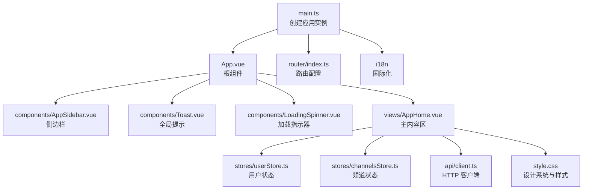
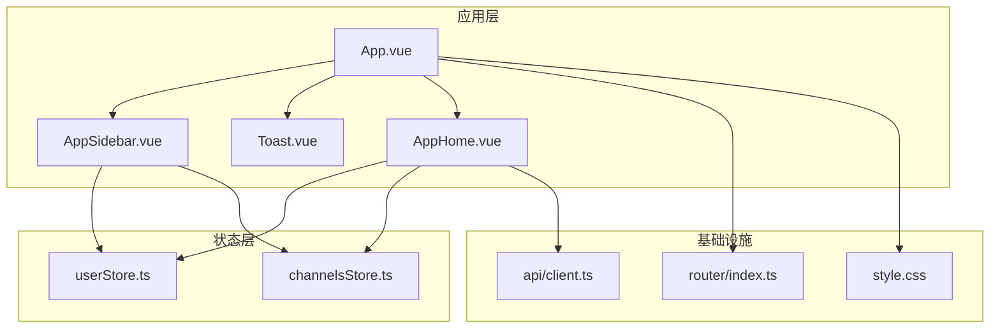
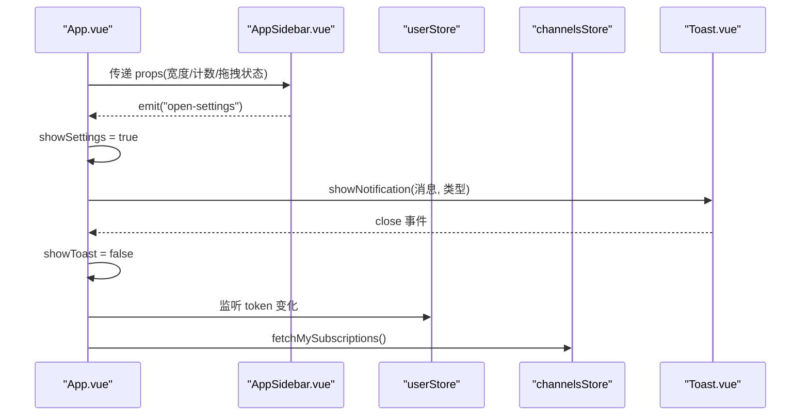
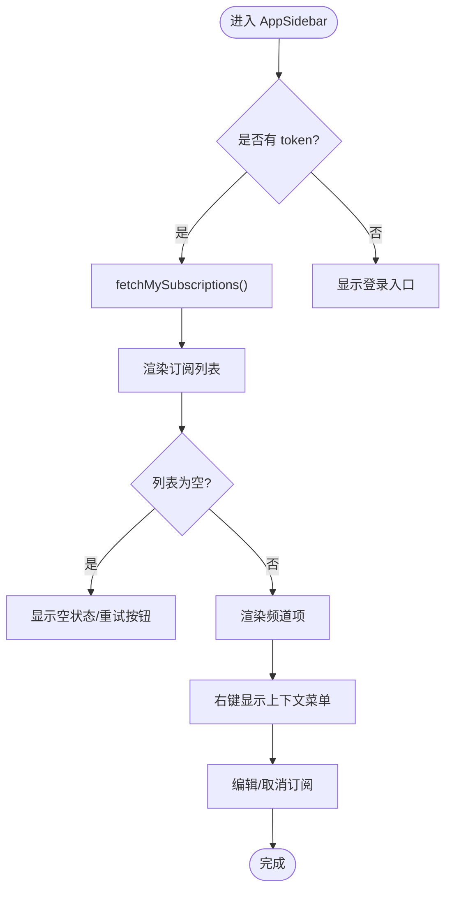
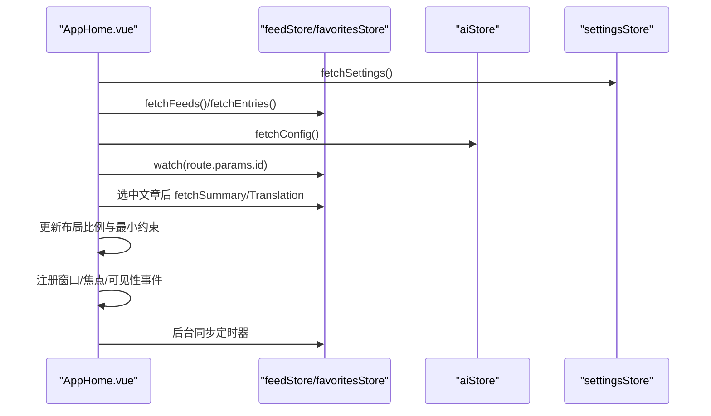
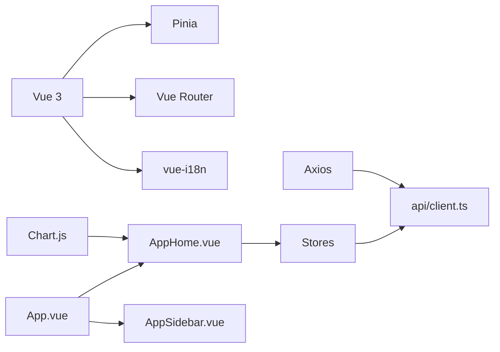

# Vue前端组件架构

<cite>
**本文档引用的文件**
- [main.ts](file://rss-desktop/src/main.ts)
- [App.vue](file://rss-desktop/src/App.vue)
- [AppSidebar.vue](file://rss-desktop/src/components/AppSidebar.vue)
- [Toast.vue](file://rss-desktop/src/components/Toast.vue)
- [LoadingSpinner.vue](file://rss-desktop/src/components/LoadingSpinner.vue)
- [userStore.ts](file://rss-desktop/src/stores/userStore.ts)
- [channelsStore.ts](file://rss-desktop/src/stores/channelsStore.ts)
- [index.ts](file://rss-desktop/src/router/index.ts)
- [AppHome.vue](file://rss-desktop/src/views/AppHome.vue)
- [style.css](file://rss-desktop/src/style.css)
- [client.ts](file://rss-desktop/src/api/client.ts)
- [package.json](file://rss-desktop/package.json)
- [vite.config.ts](file://rss-desktop/vite.config.ts)
- [tsconfig.json](file://rss-desktop/tsconfig.json)
- [types.ts](file://rss-desktop/src/types.ts)
</cite>

## 目录
1. [引言](#引言)
2. [项目结构](#项目结构)
3. [核心组件](#核心组件)
4. [架构总览](#架构总览)
5. [详细组件分析](#详细组件分析)
6. [依赖关系分析](#依赖关系分析)
7. [性能考虑](#性能考虑)
8. [故障排查指南](#故障排查指南)
9. [结论](#结论)
10. [附录](#附录)

## 引言
本文件面向 Tan RSS Reader 的 Vue 前端组件架构，系统性阐述基于 Vue 3 Composition API 的组件设计模式、复用策略与最佳实践；解析组件树结构、父子通信与事件传递机制；总结响应式数据管理、计算属性与侦听器的使用；说明生命周期钩子、条件渲染与动态组件的应用场景；给出组件测试策略、性能优化与代码分割建议，并提供命名规范、样式组织与主题系统的实现细节。

## 项目结构
该前端采用 Vite + Vue 3 + TypeScript + Pinia + Vue Router 架构，核心入口在 main.ts 创建应用实例并挂载路由与国际化插件；App.vue 作为根组件承载全局布局与状态；组件位于 components 目录，业务状态通过 stores 管理，视图页面位于 views 目录，样式统一在 style.css 中定义设计系统变量与通用组件样式。

**图表来源**
- [main.ts:1-9](file://rss-desktop/src/main.ts#L1-L9)
- [App.vue:1-333](file://rss-desktop/src/App.vue#L1-L333)
- [AppSidebar.vue:1-1025](file://rss-desktop/src/components/AppSidebar.vue#L1-L1025)
- [Toast.vue:1-92](file://rss-desktop/src/components/Toast.vue#L1-L92)
- [LoadingSpinner.vue:1-59](file://rss-desktop/src/components/LoadingSpinner.vue#L1-L59)
- [AppHome.vue:1-3195](file://rss-desktop/src/views/AppHome.vue#L1-L3195)
- [userStore.ts:1-143](file://rss-desktop/src/stores/userStore.ts#L1-L143)
- [channelsStore.ts:1-363](file://rss-desktop/src/stores/channelsStore.ts#L1-L363)
- [client.ts:1-29](file://rss-desktop/src/api/client.ts#L1-L29)
- [style.css:1-1279](file://rss-desktop/src/style.css#L1-L1279)

**章节来源**
- [main.ts:1-9](file://rss-desktop/src/main.ts#L1-L9)
- [package.json:1-81](file://rss-desktop/package.json#L1-L81)
- [vite.config.ts:1-55](file://rss-desktop/vite.config.ts#L1-L55)
- [tsconfig.json:1-25](file://rss-desktop/tsconfig.json#L1-L25)

## 核心组件
- 根组件 App.vue：负责全局 UI 状态（侧边栏宽度、通知、模态框）、路由守卫联动、跨模块状态同步与事件监听。
- 侧边栏 AppSidebar.vue：展示订阅频道、用户菜单、上下文菜单、图标懒加载与滚动定位。
- 主内容区 AppHome.vue：负责文章列表、过滤与搜索、布局拖拽、AI 翻译/摘要、收藏管理、主题切换与后台同步。
- 全局提示 Toast.vue：统一的通知展示组件，支持类型区分与自动关闭。
- 加载指示器 LoadingSpinner.vue：轻量加载占位组件，支持尺寸与文案配置。
- Pinia Store：用户(userStore)、频道(channelsStore)等状态集中管理，提供 CRUD 与 UI 状态。
- 路由 router/index.ts：基于 meta 控制鉴权与管理员权限，支持动态导入视图。
- API 客户端 client.ts：统一拦截器处理鉴权与 401 未授权事件。

**章节来源**
- [App.vue:1-333](file://rss-desktop/src/App.vue#L1-L333)
- [AppSidebar.vue:1-1025](file://rss-desktop/src/components/AppSidebar.vue#L1-L1025)
- [AppHome.vue:1-3195](file://rss-desktop/src/views/AppHome.vue#L1-L3195)
- [Toast.vue:1-92](file://rss-desktop/src/components/Toast.vue#L1-L92)
- [LoadingSpinner.vue:1-59](file://rss-desktop/src/components/LoadingSpinner.vue#L1-L59)
- [userStore.ts:1-143](file://rss-desktop/src/stores/userStore.ts#L1-L143)
- [channelsStore.ts:1-363](file://rss-desktop/src/stores/channelsStore.ts#L1-L363)
- [index.ts:1-77](file://rss-desktop/src/router/index.ts#L1-L77)
- [client.ts:1-29](file://rss-desktop/src/api/client.ts#L1-L29)

## 架构总览
整体采用“根组件承载 + 多 Store 管理 + 组件分治”的模式。根组件 App.vue 通过 props 与 emits 与子组件通信，使用 Pinia 管理全局状态并通过 watch 监听错误与消息进行统一提示；AppHome.vue 作为内容区承载复杂交互与业务逻辑，通过多个 Store 协同完成数据流闭环；路由通过 beforeEach 实现鉴权与管理员权限控制；API 客户端通过拦截器统一处理认证与未授权事件。

**图表来源**
- [App.vue:1-333](file://rss-desktop/src/App.vue#L1-L333)
- [AppHome.vue:1-3195](file://rss-desktop/src/views/AppHome.vue#L1-L3195)
- [AppSidebar.vue:1-1025](file://rss-desktop/src/components/AppSidebar.vue#L1-L1025)
- [Toast.vue:1-92](file://rss-desktop/src/components/Toast.vue#L1-L92)
- [userStore.ts:1-143](file://rss-desktop/src/stores/userStore.ts#L1-L143)
- [channelsStore.ts:1-363](file://rss-desktop/src/stores/channelsStore.ts#L1-L363)
- [index.ts:1-77](file://rss-desktop/src/router/index.ts#L1-L77)
- [client.ts:1-29](file://rss-desktop/src/api/client.ts#L1-L29)
- [style.css:1-1279](file://rss-desktop/src/style.css#L1-L1279)

## 详细组件分析

### 根组件 App.vue（全局布局与状态）
- 组件职责
  - 布局与拖拽：维护侧边栏宽度、最小宽度约束、本地持久化与窗口变化处理。
  - 全局 UI：Toast 提示、设置弹窗、认证弹窗、频道编辑弹窗。
  - 路由联动：根据路由名称决定侧边栏显示与阅读器模式。
  - 错误与消息：监听各 Store 的错误与消息，统一展示 Toast。
  - 事件处理：监听窗口事件与自定义未授权事件，触发登出与提示。
- 关键模式
  - 响应式：ref/computed 管理布局与 UI 状态。
  - 侦听：watch 监听 store 错误与消息，触发 UI 提示。
  - 生命周期：onMounted/onUnmounted 注册/注销全局事件。
  - 事件传递：emit 自定义事件给子组件（如打开设置、打开频道编辑）。
- 性能要点
  - 拖拽与窗口事件使用节流/防抖策略（可选）。
  - 本地存储读写需注意序列化与边界值校验。

**图表来源**
- [App.vue:1-333](file://rss-desktop/src/App.vue#L1-L333)
- [AppSidebar.vue:1-1025](file://rss-desktop/src/components/AppSidebar.vue#L1-L1025)
- [Toast.vue:1-92](file://rss-desktop/src/components/Toast.vue#L1-L92)
- [userStore.ts:1-143](file://rss-desktop/src/stores/userStore.ts#L1-L143)
- [channelsStore.ts:1-363](file://rss-desktop/src/stores/channelsStore.ts#L1-L363)

**章节来源**
- [App.vue:1-333](file://rss-desktop/src/App.vue#L1-L333)

### 侧边栏组件 AppSidebar.vue（导航与上下文菜单）
- 组件职责
  - 展示“全部订阅”“我的专题”“趋势分析”等导航项。
  - 订阅频道列表：支持加载状态、空状态、错误重试。
  - 用户菜单：登录/注册入口、频道广场、创建频道、设置、退出登录。
  - 上下文菜单：对订阅源进行重命名与取消订阅。
  - 图标懒加载：记录加载状态，避免闪烁。
- 关键模式
  - Props/Emits：接收父组件传入的布局与计数，向外发出动作事件。
  - 侦听：watch 活跃频道变化，滚动定位到对应节点。
  - 事件：document click 关闭菜单，contextmenu 显示上下文菜单。
  - 条件渲染：根据 token 与列表状态渲染不同 UI。
- 性能要点
  - 列表渲染使用 v-for + key，避免不必要的重排。
  - 图标加载使用本地状态缓存，减少重复请求。

**图表来源**
- [AppSidebar.vue:1-1025](file://rss-desktop/src/components/AppSidebar.vue#L1-L1025)
- [channelsStore.ts:1-363](file://rss-desktop/src/stores/channelsStore.ts#L1-L363)

**章节来源**
- [AppSidebar.vue:1-1025](file://rss-desktop/src/components/AppSidebar.vue#L1-L1025)

### 主内容区 AppHome.vue（文章列表与AI能力）
- 组件职责
  - 文章列表：过滤（全部/未读/收藏）、搜索、分组与时间范围。
  - 布局拖拽：详情面板宽度与最小宽度约束，本地持久化。
  - AI 能力：标题翻译并发控制、自动摘要、翻译显示模式。
  - 收藏管理：收藏/取消收藏、收藏统计与选择。
  - 主题切换：本地存储与 DOM 类名切换。
  - 后台同步：定时任务与可见性变更同步。
- 关键模式
  - 计算属性：filteredEntries、layoutStyle、translationMode 等。
  - 侦听：watch 路由参数、选中文章、过滤条件与 AI 设置。
  - 生命周期：onMounted 注册事件与初始化数据；onUnmounted 清理。
  - 并发控制：信号量与队列控制标题翻译并发。
- 性能要点
  - 批量翻译使用 Promise.allSettled 控制并发与稳定性。
  - ResizeObserver 监听容器尺寸变化，避免频繁重排。
  - 本地缓存翻译/摘要结果，减少重复请求。

**图表来源**
- [AppHome.vue:1-3195](file://rss-desktop/src/views/AppHome.vue#L1-L3195)
- [userStore.ts:1-143](file://rss-desktop/src/stores/userStore.ts#L1-L143)
- [channelsStore.ts:1-363](file://rss-desktop/src/stores/channelsStore.ts#L1-L363)

**章节来源**
- [AppHome.vue:1-3195](file://rss-desktop/src/views/AppHome.vue#L1-L3195)

### 全局提示 Toast.vue 与加载 LoadingSpinner.vue
- Toast.vue
  - 通过 watch 监听 show 变化，在一定延迟后自动关闭。
  - 支持三种类型（成功/错误/信息），使用 Transition 实现淡入淡出。
- LoadingSpinner.vue
  - 支持 size 尺寸枚举与数值混合，计算像素值。
  - 通过动画 keyframes 实现旋转加载效果。

**章节来源**
- [Toast.vue:1-92](file://rss-desktop/src/components/Toast.vue#L1-L92)
- [LoadingSpinner.vue:1-59](file://rss-desktop/src/components/LoadingSpinner.vue#L1-L59)

### Pinia Store（用户与频道）
- userStore.ts
  - 管理 token、用户资料、认证弹窗状态、登录/注册/登出。
  - 提供 fetchMe 与管理员用户列表操作。
- channelsStore.ts
  - 管理频道列表、订阅/取消订阅、频道详情、分类/标签管理。
  - 提供频道源增删改查、管理端频道列表等。
- 最佳实践
  - 将副作用封装在 action 内，避免在 getter 中发起异步。
  - 使用 loading/error/message 状态字段统一反馈 UI。

**章节来源**
- [userStore.ts:1-143](file://rss-desktop/src/stores/userStore.ts#L1-L143)
- [channelsStore.ts:1-363](file://rss-desktop/src/stores/channelsStore.ts#L1-L363)

### 路由与鉴权
- 路由规则：使用动态导入视图，meta 控制鉴权与管理员权限。
- 导航守卫：beforeEach 检查 token 与管理员角色，必要时重定向至登录页或首页。
- 与根组件联动：未授权事件通过自定义事件触发登出与提示。

**章节来源**
- [index.ts:1-77](file://rss-desktop/src/router/index.ts#L1-L77)
- [client.ts:1-29](file://rss-desktop/src/api/client.ts#L1-L29)
- [App.vue:1-333](file://rss-desktop/src/App.vue#L1-L333)

### API 客户端与拦截器
- 基础配置：开发环境代理 /api，生产环境使用 VITE_API_BASE_URL。
- 请求拦截：自动附加 Authorization Bearer Token。
- 响应拦截：401 触发自定义事件，交由根组件处理登出与提示。

**章节来源**
- [client.ts:1-29](file://rss-desktop/src/api/client.ts#L1-L29)

## 依赖关系分析
- 模块耦合
  - App.vue 与 AppSidebar.vue 为父子关系，通过 props/emit 通信。
  - AppHome.vue 与多个 Store 解耦，通过组合式 API 调用。
  - 路由与鉴权解耦于业务组件，通过守卫集中处理。
- 外部依赖
  - Vue 3、Pinia、Vue Router、Axios、Chart.js、vue-i18n 等。
- 代码分割
  - 路由视图使用动态导入，实现按需加载。

**图表来源**
- [package.json:55-66](file://rss-desktop/package.json#L55-L66)
- [client.ts:1-29](file://rss-desktop/src/api/client.ts#L1-L29)
- [App.vue:1-333](file://rss-desktop/src/App.vue#L1-L333)
- [AppHome.vue:1-3195](file://rss-desktop/src/views/AppHome.vue#L1-L3195)

**章节来源**
- [package.json:1-81](file://rss-desktop/package.json#L1-L81)
- [vite.config.ts:1-55](file://rss-desktop/vite.config.ts#L1-L55)

## 性能考虑
- 响应式与计算属性
  - 将昂贵的过滤/排序逻辑放入计算属性，避免重复计算。
  - 使用深度计算时注意依赖稳定性和缓存命中率。
- 侦听器与副作用
  - 在 watch 中执行异步操作时，确保及时清理与去抖。
  - 对高频事件（mousemove、resize）使用节流/防抖。
- 列表渲染
  - 为 v-for 提供稳定 key，避免不必要的重排。
  - 对长列表使用虚拟滚动（可选扩展）。
- 缓存与并发
  - 本地缓存翻译/摘要结果，减少重复请求。
  - 使用信号量与队列控制 AI 翻译并发，避免阻塞。
- 资源加载
  - 图标懒加载与失败回退，减少首屏压力。
  - 动态导入路由视图，降低首屏体积。
- 主题与样式
  - 使用 CSS 变量与暗色模式类名切换，避免重复样式计算。

[本节为通用指导，不直接分析具体文件]

## 故障排查指南
- 未授权与登出
  - API 401 触发自定义事件，根组件监听并调用登出与提示。
  - 检查本地 token 是否存在与有效。
- 通知不显示
  - 确认 App.vue 中 showNotification 调用与 Toast 组件 props 传递。
  - 检查 watch 对 store 错误/消息的监听是否生效。
- 布局异常
  - 检查本地存储的布局比例是否越界，normalizeRatios 是否正确归一化。
  - 窗口 resize 与拖拽事件是否正确注册/注销。
- 数据未更新
  - 确认路由守卫与 beforeEach 是否正确拉取用户资料与订阅。
  - 检查 store 的 loading/error/message 状态是否被正确消费。

**章节来源**
- [client.ts:17-26](file://rss-desktop/src/api/client.ts#L17-L26)
- [App.vue:158-227](file://rss-desktop/src/App.vue#L158-L227)
- [Toast.vue:14-20](file://rss-desktop/src/components/Toast.vue#L14-L20)

## 结论
该架构以 Composition API 为核心，结合 Pinia 管理状态、Vue Router 控制导航、Axios 统一请求，形成清晰的职责分离与良好的可维护性。通过全局布局与组件化拆分，实现了高内聚低耦合的前端组件体系。建议持续完善测试覆盖、性能监控与可观测性，进一步提升用户体验与工程质量。

[本节为总结性内容，不直接分析具体文件]

## 附录

### 组件命名规范
- 文件命名：PascalCase（如 AppSidebar.vue、ArticleReader.vue）。
- 组件导出：默认导出组件对象，便于按需导入。
- 组合式 API：函数名使用 use 前缀（如 useLanguage）。

[本节为通用规范，不直接分析具体文件]

### 样式组织与主题系统
- 设计系统：在 style.css 中定义 CSS 变量与暗色模式映射，组件通过变量引用实现主题一致性。
- 组件样式：scoped 样式隔离，必要时使用深度选择器与变量覆盖。
- 响应式：基于断点的字体与布局调整，确保桌面优先体验。

**章节来源**
- [style.css:1-1279](file://rss-desktop/src/style.css#L1-L1279)

### 类型定义
- Feed、Entry、ChannelSourceItem 等接口统一定义数据结构，便于 Store 与 API 返回值校验。

**章节来源**
- [types.ts:1-54](file://rss-desktop/src/types.ts#L1-L54)