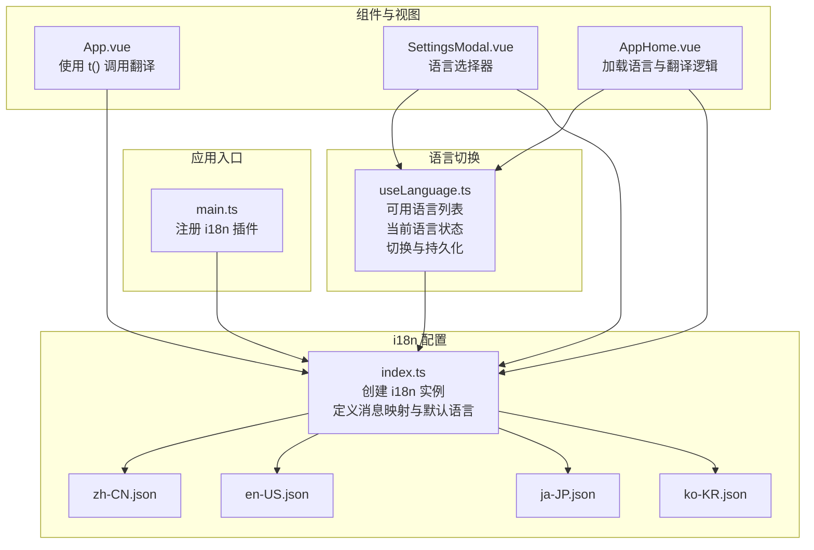
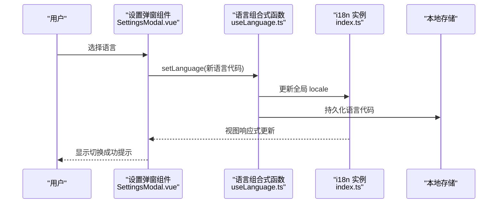
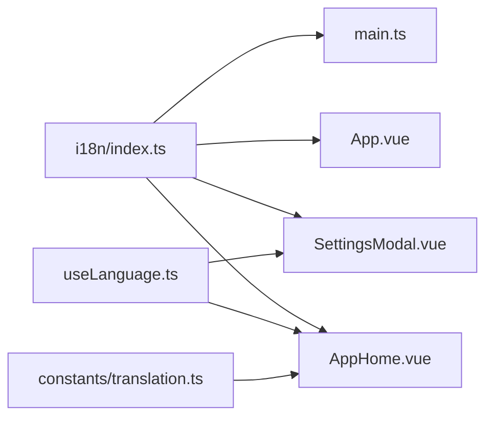

# 国际化与本地化

<cite>
**本文引用的文件**   
- [rss-desktop/src/i18n/index.ts](file://rss-desktop/src/i18n/index.ts)
- [rss-desktop/src/composables/useLanguage.ts](file://rss-desktop/src/composables/useLanguage.ts)
- [rss-desktop/src/constants/translation.ts](file://rss-desktop/src/constants/translation.ts)
- [rss-desktop/src/i18n/locales/zh-CN.json](file://rss-desktop/src/i18n/locales/zh-CN.json)
- [rss-desktop/src/i18n/locales/en-US.json](file://rss-desktop/src/i18n/locales/en-US.json)
- [rss-desktop/src/i18n/locales/ja-JP.json](file://rss-desktop/src/i18n/locales/ja-JP.json)
- [rss-desktop/src/i18n/locales/ko-KR.json](file://rss-desktop/src/i18n/locales/ko-KR.json)
- [rss-desktop/src/main.ts](file://rss-desktop/src/main.ts)
- [rss-desktop/src/App.vue](file://rss-desktop/src/App.vue)
- [rss-desktop/src/components/SettingsModal.vue](file://rss-desktop/src/components/SettingsModal.vue)
- [rss-desktop/src/views/AppHome.vue](file://rss-desktop/src/views/AppHome.vue)
</cite>

## 目录
1. [简介](#简介)
2. [项目结构](#项目结构)
3. [核心组件](#核心组件)
4. [架构总览](#架构总览)
5. [详细组件分析](#详细组件分析)
6. [依赖关系分析](#依赖关系分析)
7. [性能考量](#性能考量)
8. [故障排查指南](#故障排查指南)
9. [结论](#结论)
10. [附录](#附录)

## 简介
本文件系统性梳理 Tan RSS Reader 的国际化（i18n）与本地化（l10n）实现，覆盖以下关键主题：
- i18n 配置与初始化
- 语言包管理与组织
- 动态语言切换机制
- 文本翻译、日期时间格式化与数字本地化
- 语言检测、默认语言与用户偏好持久化
- 复数形式、占位符替换与上下文翻译
- 语言包维护、翻译工作流与多语言测试策略
- 语言切换组件实现与翻译文件组织结构

## 项目结构
Tan RSS Reader 的国际化主要集中在桌面端前端（Vue + TypeScript）的 i18n 子系统，核心文件如下：
- i18n 配置与消息映射：[rss-desktop/src/i18n/index.ts](file://rss-desktop/src/i18n/index.ts)
- 语言切换组合式函数：[rss-desktop/src/composables/useLanguage.ts](file://rss-desktop/src/composables/useLanguage.ts)
- 翻译常量与并发控制：[rss-desktop/src/constants/translation.ts](file://rss-desktop/src/constants/translation.ts)
- 语言包 JSON 文件：[rss-desktop/src/i18n/locales/zh-CN.json](file://rss-desktop/src/i18n/locales/zh-CN.json)、[rss-desktop/src/i18n/locales/en-US.json](file://rss-desktop/src/i18n/locales/en-US.json)、[rss-desktop/src/i18n/locales/ja-JP.json](file://rss-desktop/src/i18n/locales/ja-JP.json)、[rss-desktop/src/i18n/locales/ko-KR.json](file://rss-desktop/src/i18n/locales/ko-KR.json)
- 应用入口注册 i18n：[rss-desktop/src/main.ts](file://rss-desktop/src/main.ts)
- 使用翻译的组件与视图：[rss-desktop/src/App.vue](file://rss-desktop/src/App.vue)、[rss-desktop/src/components/SettingsModal.vue](file://rss-desktop/src/components/SettingsModal.vue)、[rss-desktop/src/views/AppHome.vue](file://rss-desktop/src/views/AppHome.vue)

图表来源
- [rss-desktop/src/main.ts:1-9](file://rss-desktop/src/main.ts#L1-L9)
- [rss-desktop/src/i18n/index.ts:1-35](file://rss-desktop/src/i18n/index.ts#L1-L35)
- [rss-desktop/src/composables/useLanguage.ts:1-49](file://rss-desktop/src/composables/useLanguage.ts#L1-L49)
- [rss-desktop/src/App.vue:1-333](file://rss-desktop/src/App.vue#L1-L333)
- [rss-desktop/src/components/SettingsModal.vue:1-513](file://rss-desktop/src/components/SettingsModal.vue#L1-L513)
- [rss-desktop/src/views/AppHome.vue:1-800](file://rss-desktop/src/views/AppHome.vue#L1-L800)

章节来源
- [rss-desktop/src/i18n/index.ts:1-35](file://rss-desktop/src/i18n/index.ts#L1-L35)
- [rss-desktop/src/composables/useLanguage.ts:1-49](file://rss-desktop/src/composables/useLanguage.ts#L1-L49)
- [rss-desktop/src/main.ts:1-9](file://rss-desktop/src/main.ts#L1-L9)

## 核心组件
- i18n 实例与消息映射
  - 在配置文件中集中导入各语言包，并通过键值对建立语言代码到消息对象的映射；同时定义默认语言与回退语言。
  - 关键点：使用常量类型限定可用语言代码，确保类型安全；初始化时从本地存储恢复语言偏好，若不存在则回退到默认语言。

- 语言切换组合式函数
  - 提供可用语言列表、当前语言状态、语言切换与加载方法；切换时更新全局语言并持久化到本地存储。

- 应用入口注册
  - 在应用启动时注册 i18n 插件，使全局具备翻译能力。

章节来源
- [rss-desktop/src/i18n/index.ts:1-35](file://rss-desktop/src/i18n/index.ts#L1-L35)
- [rss-desktop/src/composables/useLanguage.ts:1-49](file://rss-desktop/src/composables/useLanguage.ts#L1-L49)
- [rss-desktop/src/main.ts:1-9](file://rss-desktop/src/main.ts#L1-L9)

## 架构总览
Tan RSS Reader 的国际化采用 vue-i18n 的 Composition API 模式，整体流程如下：
- 应用启动时，从本地存储读取用户语言偏好，若不存在则使用默认语言。
- 用户在设置界面选择语言后，调用组合式函数更新全局语言并写入本地存储。
- 组件通过 useI18n 获取 t 函数进行文本翻译；部分日期时间与数字展示使用 dayjs 插件实现本地化。

图表来源
- [rss-desktop/src/components/SettingsModal.vue:82-100](file://rss-desktop/src/components/SettingsModal.vue#L82-L100)
- [rss-desktop/src/composables/useLanguage.ts:24-32](file://rss-desktop/src/composables/useLanguage.ts#L24-L32)
- [rss-desktop/src/i18n/index.ts:32-34](file://rss-desktop/src/i18n/index.ts#L32-L34)

## 详细组件分析

### i18n 配置与初始化
- 消息映射与类型约束
  - 通过常量映射将语言代码与对应 JSON 消息对象关联，使用类型别名限定可用语言集合，避免拼写错误与非法语言代码。
- 默认语言与回退语言
  - 初始化时优先从本地存储恢复语言；若不存在或无效则回退到默认语言；同时设置回退语言，保证缺失键值时有合理兜底。
- 本地存储持久化
  - 提供持久化函数将用户选择的语言写入本地存储，下次启动自动生效。

章节来源
- [rss-desktop/src/i18n/index.ts:7-35](file://rss-desktop/src/i18n/index.ts#L7-L35)

### 语言切换组合式函数
- 可用语言列表
  - 内置语言信息数组，包含语言代码、显示名称与旗帜标识，便于 UI 展示。
- 当前语言状态
  - 基于 i18n 全局语言状态推导当前语言，首次加载时同步一次。
- 语言切换与持久化
  - 设置语言时更新全局 locale，并将新语言写入本地存储；切换后同步当前语言状态。

章节来源
- [rss-desktop/src/composables/useLanguage.ts:10-49](file://rss-desktop/src/composables/useLanguage.ts#L10-L49)

### 应用入口注册与组件使用
- 应用入口
  - 在 main.ts 中注册 i18n 插件，使整个应用具备翻译能力。
- 组件使用
  - 在多个组件与视图中通过 useI18n 获取 t 函数进行文本翻译，如设置弹窗、首页等。

章节来源
- [rss-desktop/src/main.ts:1-9](file://rss-desktop/src/main.ts#L1-L9)
- [rss-desktop/src/App.vue:8-24](file://rss-desktop/src/App.vue#L8-L24)
- [rss-desktop/src/components/SettingsModal.vue:1-20](file://rss-desktop/src/components/SettingsModal.vue#L1-L20)
- [rss-desktop/src/views/AppHome.vue:1-50](file://rss-desktop/src/views/AppHome.vue#L1-L50)

### 语言包组织与内容结构
- 组织结构
  - 语言包位于 i18n/locales 目录下，每个语言一个 JSON 文件，文件名遵循语言标签规范。
- 内容结构
  - 采用分层键空间组织（如 common、navigation、feeds、articles、settings、time、errors 等），便于模块化维护与查找。
- 占位符与上下文
  - 大量使用带占位符的键值（如计数、语言、版本等），在渲染时传入参数完成替换。
  - 部分键值包含上下文信息（如不同时间范围的文案），通过键名区分。

章节来源
- [rss-desktop/src/i18n/locales/zh-CN.json:1-394](file://rss-desktop/src/i18n/locales/zh-CN.json#L1-L394)
- [rss-desktop/src/i18n/locales/en-US.json:1-394](file://rss-desktop/src/i18n/locales/en-US.json#L1-L394)

### 语言检测、默认语言与用户偏好
- 语言检测与默认值
  - 初始化时读取本地存储中的语言偏好；若为空或不在可用列表内，则回退到默认语言。
- 用户偏好持久化
  - 语言切换后立即写入本地存储，确保刷新或重启后仍保持用户选择。

章节来源
- [rss-desktop/src/i18n/index.ts:16-22](file://rss-desktop/src/i18n/index.ts#L16-L22)
- [rss-desktop/src/i18n/index.ts:32-34](file://rss-desktop/src/i18n/index.ts#L32-L34)

### 动态语言切换与组件集成
- 设置弹窗中的语言选择器
  - 使用组合式函数提供的语言列表与切换方法，绑定到 select 控件；切换时进行有效性校验并持久化。
- 首页加载语言
  - 在首页组件中调用语言加载方法，确保应用启动时语言状态正确。

章节来源
- [rss-desktop/src/components/SettingsModal.vue:16-100](file://rss-desktop/src/components/SettingsModal.vue#L16-L100)
- [rss-desktop/src/views/AppHome.vue:40-46](file://rss-desktop/src/views/AppHome.vue#L40-L46)

### 文本翻译、占位符替换与上下文翻译
- 文本翻译
  - 通过 t 函数按层级键空间查找对应语言的文本。
- 占位符替换
  - 在语言包中使用占位符键（如 {count}、{language}、{version} 等），在组件中传参完成替换。
- 上下文翻译
  - 通过不同键名表达同一语义的不同上下文（如时间范围、错误提示等），保证翻译一致性与准确性。

章节来源
- [rss-desktop/src/i18n/locales/zh-CN.json:89-90](file://rss-desktop/src/i18n/locales/zh-CN.json#L89-L90)
- [rss-desktop/src/i18n/locales/en-US.json:89-90](file://rss-desktop/src/i18n/locales/en-US.json#L89-L90)

### 日期时间格式化与数字本地化
- 日期时间本地化
  - 在首页组件中引入 dayjs 插件（相对时间、UTC），用于将时间戳转换为本地化的相对时间字符串，如“刚刚”、“X 分钟前”等。
- 数字本地化
  - 当前代码库未发现专门的数字本地化（如千分位、货币、小数位）实现；如需扩展，可在组件中引入相应插件或工具库。

章节来源
- [rss-desktop/src/views/AppHome.vue:1-30](file://rss-desktop/src/views/AppHome.vue#L1-L30)

### 复数形式处理
- 当前实现
  - 语言包中通过占位符与不同键名表达复数语义（如“X 篇文章”、“X 未读”），在渲染时根据数值动态选择合适键。
- 建议
  - 若未来需要更复杂的复数规则，可考虑引入 vue-i18n 的复数化功能或自定义解析器。

章节来源
- [rss-desktop/src/i18n/locales/zh-CN.json:89-90](file://rss-desktop/src/i18n/locales/zh-CN.json#L89-L90)
- [rss-desktop/src/i18n/locales/en-US.json:89-90](file://rss-desktop/src/i18n/locales/en-US.json#L89-L90)

### 翻译并发与标题翻译
- 并发控制
  - 在翻译常量中定义标题翻译的并发限制与回退值，并结合用户设置进行动态调整。
- 批量翻译
  - 在首页组件中实现标题翻译的并发队列与批量处理，避免过度请求影响性能与稳定性。

章节来源
- [rss-desktop/src/constants/translation.ts:1-65](file://rss-desktop/src/constants/translation.ts#L1-L65)
- [rss-desktop/src/views/AppHome.vue:129-169](file://rss-desktop/src/views/AppHome.vue#L129-L169)
- [rss-desktop/src/views/AppHome.vue:337-362](file://rss-desktop/src/views/AppHome.vue#L337-L362)

## 依赖关系分析
- 组件耦合
  - SettingsModal 依赖 useLanguage 与 i18n；AppHome 依赖 useLanguage 与 i18n；App.vue 依赖 i18n。
- 外部依赖
  - vue-i18n 提供翻译能力；dayjs 提供本地化时间格式化；本地存储提供用户偏好的持久化。

图表来源
- [rss-desktop/src/i18n/index.ts:1-35](file://rss-desktop/src/i18n/index.ts#L1-L35)
- [rss-desktop/src/main.ts:1-9](file://rss-desktop/src/main.ts#L1-L9)
- [rss-desktop/src/composables/useLanguage.ts:1-49](file://rss-desktop/src/composables/useLanguage.ts#L1-L49)
- [rss-desktop/src/constants/translation.ts:1-65](file://rss-desktop/src/constants/translation.ts#L1-L65)
- [rss-desktop/src/App.vue:1-333](file://rss-desktop/src/App.vue#L1-L333)
- [rss-desktop/src/components/SettingsModal.vue:1-513](file://rss-desktop/src/components/SettingsModal.vue#L1-L513)
- [rss-desktop/src/views/AppHome.vue:1-800](file://rss-desktop/src/views/AppHome.vue#L1-L800)

## 性能考量
- 并发控制
  - 通过并发队列与批量处理减少网络请求峰值，避免对后端造成压力。
- 缓存与去重
  - 在首页组件中对标题翻译与摘要进行缓存，避免重复请求。
- 渲染优化
  - 使用响应式计算与懒加载策略，减少不必要的重渲染。

## 故障排查指南
- 语言切换无效
  - 检查本地存储中是否存在语言键；确认语言代码是否在可用列表中；查看切换函数是否被正确调用。
- 翻译缺失或回退
  - 检查语言包中对应键是否存在；确认键名层级是否正确；核对占位符参数是否传入。
- 时间显示异常
  - 确认 dayjs 插件是否正确引入与扩展；检查时间戳格式与时区处理。

章节来源
- [rss-desktop/src/i18n/index.ts:16-22](file://rss-desktop/src/i18n/index.ts#L16-L22)
- [rss-desktop/src/components/SettingsModal.vue:82-100](file://rss-desktop/src/components/SettingsModal.vue#L82-L100)
- [rss-desktop/src/views/AppHome.vue:1-30](file://rss-desktop/src/views/AppHome.vue#L1-L30)

## 结论
Tan RSS Reader 的国际化系统以 vue-i18n 为核心，配合本地存储实现语言偏好持久化，通过组合式函数统一管理语言切换逻辑。语言包采用模块化分层结构，支持占位符与上下文翻译；首页组件实现了标题翻译的并发控制与批量处理。整体架构清晰、易于维护与扩展，建议后续在数字本地化与复杂复数规则方面进一步完善。

## 附录
- 语言包维护建议
  - 统一键命名规范与层级结构；定期清理冗余键；为常用占位符提供默认值。
- 翻译工作流
  - 基于现有 JSON 结构进行增量翻译；使用自动化脚本校验键一致性；建立 PR 审查流程。
- 多语言测试策略
  - 在设置界面增加语言切换测试；模拟网络环境下的翻译并发；验证时间显示与占位符替换。