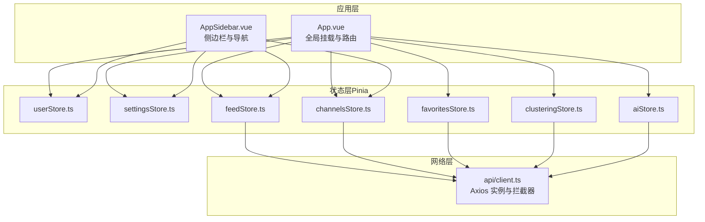
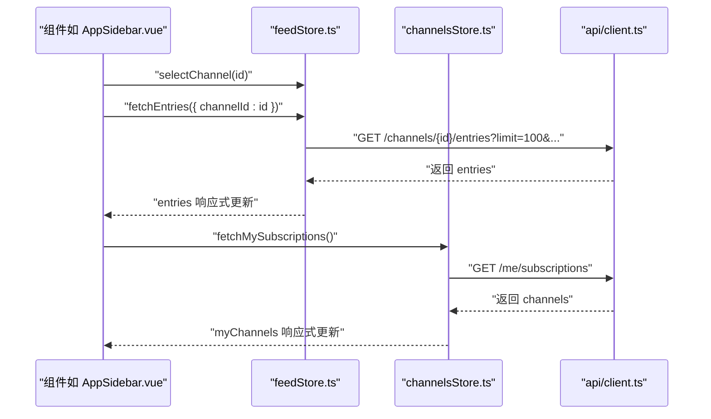
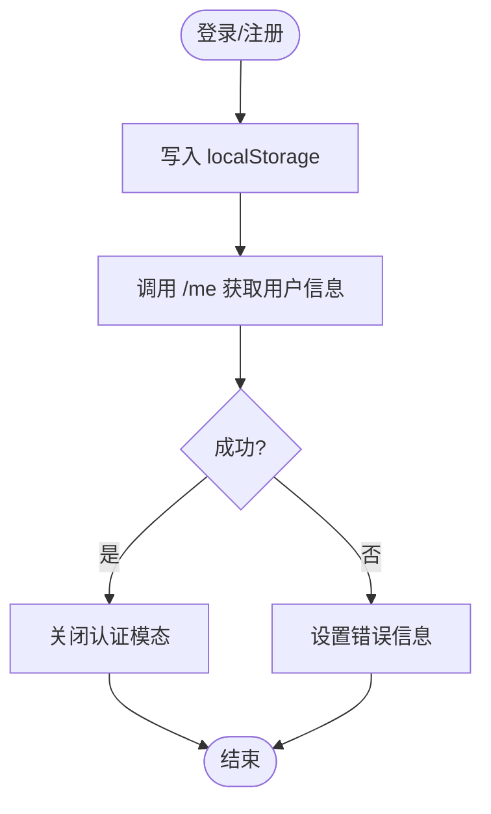
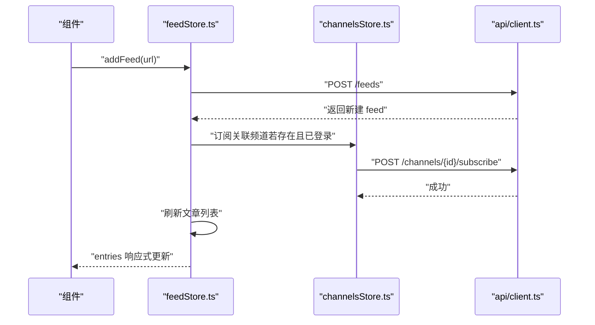
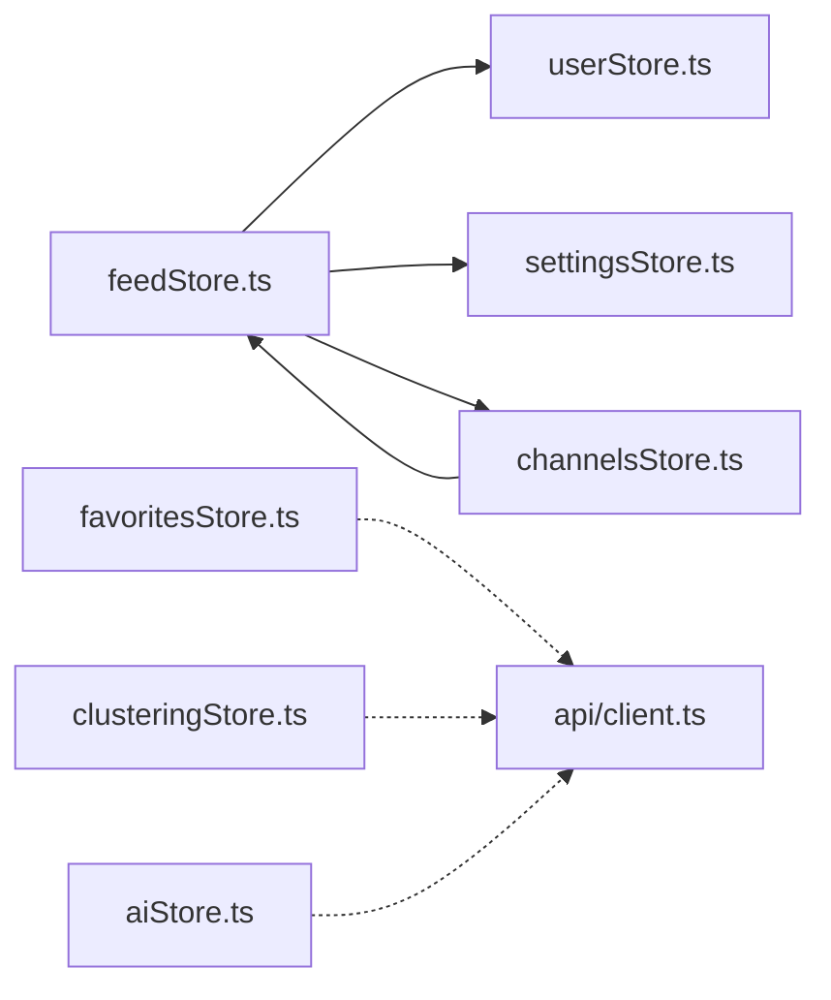

# 状态管理（Pinia）

<cite>
**本文引用的文件**
- [main.ts](file://rss-desktop/src/main.ts)
- [client.ts](file://rss-desktop/src/api/client.ts)
- [types.ts](file://rss-desktop/src/types.ts)
- [userStore.ts](file://rss-desktop/src/stores/userStore.ts)
- [settingsStore.ts](file://rss-desktop/src/stores/settingsStore.ts)
- [feedStore.ts](file://rss-desktop/src/stores/feedStore.ts)
- [channelsStore.ts](file://rss-desktop/src/stores/channelsStore.ts)
- [favoritesStore.ts](file://rss-desktop/src/stores/favoritesStore.ts)
- [clusteringStore.ts](file://rss-desktop/src/stores/clusteringStore.ts)
- [aiStore.ts](file://rss-desktop/src/stores/aiStore.ts)
- [App.vue](file://rss-desktop/src/App.vue)
- [AppSidebar.vue](file://rss-desktop/src/components/AppSidebar.vue)
- [package.json](file://rss-desktop/package.json)
</cite>

## 目录
1. [简介](#简介)
2. [项目结构](#项目结构)
3. [核心组件](#核心组件)
4. [架构总览](#架构总览)
5. [详细组件分析](#详细组件分析)
6. [依赖分析](#依赖分析)
7. [性能考量](#性能考量)
8. [故障排查指南](#故障排查指南)
9. [结论](#结论)
10. [附录](#附录)

## 简介
本文件系统化梳理 Tan RSS Reader 的 Pinia 状态管理体系，覆盖 store 设计模式、状态结构与数据流、模块化组织、action 异步处理与 getter 计算逻辑、store 间依赖关系、状态持久化与共享策略、响应式更新机制、调试与性能优化、测试方法与状态快照/回滚实践，并给出具体实现示例与使用模式参考路径。

## 项目结构
- 应用通过根入口初始化 Pinia，随后在各功能模块中按领域拆分 store，形成清晰的模块化状态管理。
- store 之间通过组合式 API 互相调用，避免直接耦合，降低复杂度。
- API 层统一由 axios 客户端封装，集中处理鉴权与错误拦截。

图表来源
- [main.ts:1-9](file://rss-desktop/src/main.ts#L1-L9)
- [App.vue:3-20](file://rss-desktop/src/App.vue#L3-L20)
- [AppSidebar.vue:1-36](file://rss-desktop/src/components/AppSidebar.vue#L1-L36)
- [client.ts:1-29](file://rss-desktop/src/api/client.ts#L1-L29)

章节来源
- [main.ts:1-9](file://rss-desktop/src/main.ts#L1-L9)
- [package.json:55-66](file://rss-desktop/package.json#L55-L66)

## 核心组件
- 用户态与认证：userStore 提供 token、profile、登录/注册/登出、用户管理等能力。
- 应用设置：settingsStore 提供主题、分页、日期过滤、翻译显示模式等偏好与系统设置。
- 订阅与文章：feedStore 管理 feeds、entries、分组、活跃项、缓存与刷新流程。
- 频道与内容：channelsStore 管理频道、分类、标签、频道源、订阅/取消订阅、管理接口。
- 收藏夹：favoritesStore 管理星标文章与统计。
- 向量聚类与检索：clusteringStore 管理聚类、搜索与分析结果。
- AI 配置与连通性：aiStore 管理 AI 服务配置、特性开关与连通性测试。
- 类型与 API 客户端：types.ts 定义数据模型；client.ts 统一请求与鉴权。

章节来源
- [userStore.ts:14-142](file://rss-desktop/src/stores/userStore.ts#L14-L142)
- [settingsStore.ts:25-201](file://rss-desktop/src/stores/settingsStore.ts#L25-L201)
- [feedStore.ts:7-641](file://rss-desktop/src/stores/feedStore.ts#L7-L641)
- [channelsStore.ts:36-362](file://rss-desktop/src/stores/channelsStore.ts#L36-L362)
- [favoritesStore.ts:6-69](file://rss-desktop/src/stores/favoritesStore.ts#L6-L69)
- [clusteringStore.ts:49-108](file://rss-desktop/src/stores/clusteringStore.ts#L49-L108)
- [aiStore.ts:61-155](file://rss-desktop/src/stores/aiStore.ts#L61-L155)
- [types.ts:1-54](file://rss-desktop/src/types.ts#L1-L54)
- [client.ts:1-29](file://rss-desktop/src/api/client.ts#L1-L29)

## 架构总览
- 状态管理采用组合式 Store（setup-style），以函数形式导出状态与方法，便于 TypeScript 推断与 Tree-shaking。
- 数据流遵循“UI 触发 action → 调用 API 客户端 → 更新本地状态 → 触发响应式渲染”的单向流动。
- 错误与加载状态统一维护，便于 UI 层做一致的反馈。
- 通过计算属性（computed）对派生状态进行高效缓存与复用。

图表来源
- [AppSidebar.vue:117-124](file://rss-desktop/src/components/AppSidebar.vue#L117-L124)
- [feedStore.ts:332-403](file://rss-desktop/src/stores/feedStore.ts#L332-L403)
- [channelsStore.ts:150-161](file://rss-desktop/src/stores/channelsStore.ts#L150-L161)
- [client.ts:1-29](file://rss-desktop/src/api/client.ts#L1-L29)

## 详细组件分析

### 用户与认证（userStore）
- 关键状态：token、profile、users、loading、error、认证模态可见性与模式。
- 行为要点：
  - 登录/注册/登出，持久化 token 至 localStorage。
  - 管理员视角的用户查询、更新与删除。
  - 打开/关闭认证模态，支持登录/注册两种模式。
- 与其它 store 的交互：
  - feedStore 在新增订阅后尝试自动订阅并刷新文章列表，若无 token 则打开认证模态。
  - channelsStore 在订阅/取消订阅后刷新我的订阅列表。

图表来源
- [userStore.ts:33-87](file://rss-desktop/src/stores/userStore.ts#L33-L87)

章节来源
- [userStore.ts:14-142](file://rss-desktop/src/stores/userStore.ts#L14-L142)
- [feedStore.ts:115-142](file://rss-desktop/src/stores/feedStore.ts#L115-L142)
- [channelsStore.ts:163-197](file://rss-desktop/src/stores/channelsStore.ts#L163-L197)

### 设置（settingsStore）
- 关键状态：AppSettings 结构，含拉取间隔、分页数、日期过滤、默认时间字段、摘要显示、翻译模式、品牌文案切换、主题等。
- 行为要点：
  - 本地存储优先策略：优先读取 localStorage，再合并系统设置。
  - 乐观更新：先更新本地状态，再异步提交系统设置；若权限不足则回滚。
  - 主题切换：同步更新 DOM class，影响全局样式。
- 与其它 store 的交互：
  - feedStore 在获取文章时读取时间字段与日期过滤策略。

章节来源
- [settingsStore.ts:25-201](file://rss-desktop/src/stores/settingsStore.ts#L25-L201)
- [feedStore.ts:346-356](file://rss-desktop/src/stores/feedStore.ts#L346-L356)

### 订阅与文章（feedStore）
- 关键状态：feeds、adminFeeds、entries、selectedEntry、activeFeedId/group/channel、loading、addingFeed、refreshingGroup、summaryCache/translationCache/titleTranslationCache、collapsedGroups、lastFeedFilters/lastEntryFilters。
- 计算属性：
  - groupedFeeds：按分组名聚合并排序。
  - groupStats：统计每组订阅数与未读数。
  - sortedGroupNames：对分组名排序（未分组排最后）。
  - selectedEntry：基于选中 id 的派生项。
- 行为要点：
  - 获取 feeds/entries：支持按 feedId/groupName/channelId 三种维度，统一时间字段与排序。
  - 刷新：支持单源、分组、频道三种模式的并行刷新。
  - 缓存：摘要、翻译、标题翻译分别缓存，减少重复请求。
  - OPML 导入/导出：触发后端接口并刷新订阅与文章列表。
  - 分组折叠：基于 localStorage 的折叠状态持久化。
- 与其它 store 的交互：
  - 新增订阅后联动 channelsStore 自动订阅并刷新文章。
  - OPML 导入后刷新 channelsStore 与自身状态。

图表来源
- [feedStore.ts:108-149](file://rss-desktop/src/stores/feedStore.ts#L108-L149)
- [channelsStore.ts:163-177](file://rss-desktop/src/stores/channelsStore.ts#L163-L177)

章节来源
- [feedStore.ts:7-641](file://rss-desktop/src/stores/feedStore.ts#L7-L641)

### 频道与内容（channelsStore）
- 关键状态：square、myChannels、channelEntries、activeChannelId、loading、error、message、adminChannels、channelSources、categories、tags、UI 状态 showChannelSquareModal。
- 行为要点：
  - 公共/管理两类分类与标签的增删改查。
  - 频道广场、我的订阅、频道详情（文章列表）的获取。
  - 频道源的增删与管理。
  - 订阅/取消订阅后的状态同步与 UI 反馈。
- 与其它 store 的交互：
  - 与 feedStore 的订阅联动（新增订阅后自动订阅频道）。

章节来源
- [channelsStore.ts:36-362](file://rss-desktop/src/stores/channelsStore.ts#L36-L362)

### 收藏夹（favoritesStore）
- 关键状态：starredEntries、starredCount、loading、error。
- 行为要点：
  - 获取星标文章与统计，支持按 feed 过滤。
  - 星标/取消星标的原子操作。
  - 计算属性 hasFavorites：基于计数判断是否存在收藏。

章节来源
- [favoritesStore.ts:6-69](file://rss-desktop/src/stores/favoritesStore.ts#L6-L69)

### 向量聚类与检索（clusteringStore）
- 关键状态：clusters、searchResults、analysisResult、loading、error。
- 行为要点：
  - 聚类：按天数参数请求向量聚类。
  - 搜索：关键词向量检索。
  - 分析：对选定条目集合进行主题分析与统计。

章节来源
- [clusteringStore.ts:49-108](file://rss-desktop/src/stores/clusteringStore.ts#L49-L108)

### AI 配置与连通性（aiStore）
- 关键状态：config（含 summary/translation/features）、loading、error。
- 行为要点：
  - 获取/更新 AI 配置，支持部分字段更新。
  - 测试服务连通性，校验必填字段。
  - 清理错误与重置配置。

章节来源
- [aiStore.ts:61-155](file://rss-desktop/src/stores/aiStore.ts#L61-L155)

## 依赖分析
- store 间依赖关系：
  - feedStore 依赖 userStore（鉴权弹窗）、settingsStore（时间字段与过滤）、channelsStore（订阅联动）。
  - channelsStore 与 feedStore 存在双向协作（订阅/取消订阅与文章刷新）。
  - favoritesStore、clusteringStore、aiStore 相对独立，主要依赖 API 客户端。
- 外部依赖：
  - axios：统一请求与鉴权拦截。
  - localStorage：用户偏好与分组折叠状态持久化。
  - Vue 响应式系统：ref/computed 驱动 UI 更新。

图表来源
- [feedStore.ts:5-26](file://rss-desktop/src/stores/feedStore.ts#L5-L26)
- [channelsStore.ts:1-4](file://rss-desktop/src/stores/channelsStore.ts#L1-L4)
- [client.ts:1-29](file://rss-desktop/src/api/client.ts#L1-L29)

章节来源
- [feedStore.ts:5-26](file://rss-desktop/src/stores/feedStore.ts#L5-L26)
- [channelsStore.ts:1-4](file://rss-desktop/src/stores/channelsStore.ts#L1-L4)
- [client.ts:1-29](file://rss-desktop/src/api/client.ts#L1-L29)

## 性能考量
- 并行刷新：feedStore 在分组/频道模式下对多个订阅源并行刷新，提升吞吐。
- 请求缓存：feedStore 内置摘要、翻译、标题翻译缓存，减少重复请求。
- 计算属性：groupedFeeds、groupStats、sortedGroupNames 使用 computed，避免重复计算。
- 分页与限制：feedStore 在获取文章时限制每页数量，避免一次性加载过多数据。
- 本地持久化：settingsStore 与 feedStore 的分组折叠状态使用 localStorage，减少每次启动的网络请求。
- UI 加载状态：各 store 维护 loading/error，避免 UI 闪烁与重复请求。

章节来源
- [feedStore.ts:223-252](file://rss-desktop/src/stores/feedStore.ts#L223-L252)
- [feedStore.ts:448-505](file://rss-desktop/src/stores/feedStore.ts#L448-L505)
- [feedStore.ts:557-590](file://rss-desktop/src/stores/feedStore.ts#L557-L590)
- [settingsStore.ts:59-108](file://rss-desktop/src/stores/settingsStore.ts#L59-L108)

## 故障排查指南
- 401 未授权：
  - axios 拦截器检测 401，派发自定义事件，应用层可监听并执行登出/跳转。
- 错误状态：
  - 各 store 维护 error 字段，UI 层根据 error/message 渲染提示。
- 认证弹窗：
  - userStore 提供 open/close 模态方法，feedStore 在需要时触发。
- 日志与回退：
  - settingsStore 在更新系统设置失败时回滚本地状态，保证一致性。

章节来源
- [client.ts:17-26](file://rss-desktop/src/api/client.ts#L17-L26)
- [userStore.ts:24-31](file://rss-desktop/src/stores/userStore.ts#L24-L31)
- [settingsStore.ts:164-178](file://rss-desktop/src/stores/settingsStore.ts#L164-L178)

## 结论
Tan RSS Reader 的 Pinia 状态管理以领域驱动的方式模块化组织，结合组合式 Store 的强类型与响应式能力，实现了清晰的数据流与良好的扩展性。通过计算属性与缓存、并行刷新与本地持久化，兼顾了性能与用户体验。建议在后续迭代中补充单元测试与集成测试，完善状态快照与回滚机制，进一步增强可观测性与可维护性。

## 附录

### 使用模式与示例路径
- 初始化 Pinia：在应用入口创建并挂载 Pinia。
  - 示例路径：[main.ts:1-9](file://rss-desktop/src/main.ts#L1-L9)
- 在组件中使用 store：
  - App.vue 全局挂载多个 store：[App.vue:3-20](file://rss-desktop/src/App.vue#L3-L20)
  - AppSidebar.vue 使用 feedStore、channelsStore、settingsStore、userStore：[AppSidebar.vue:1-36](file://rss-desktop/src/components/AppSidebar.vue#L1-L36)
- 调用 action：
  - 订阅/取消订阅：[channelsStore.ts:163-197](file://rss-desktop/src/stores/channelsStore.ts#L163-L197)
  - 获取文章：[feedStore.ts:332-403](file://rss-desktop/src/stores/feedStore.ts#L332-L403)
  - 获取设置：[settingsStore.ts:60-108](file://rss-desktop/src/stores/settingsStore.ts#L60-L108)
  - 登录/登出：[userStore.ts:33-87](file://rss-desktop/src/stores/userStore.ts#L33-L87)
  - 获取收藏：[favoritesStore.ts:14-29](file://rss-desktop/src/stores/favoritesStore.ts#L14-L29)

### 状态持久化与共享策略
- 用户偏好与主题：settingsStore 读取/写入 localStorage，作为系统设置与本地偏好的合并策略。
  - 示例路径：[settingsStore.ts:59-108](file://rss-desktop/src/stores/settingsStore.ts#L59-L108)
- 分组折叠状态：feedStore 将折叠集合序列化至 localStorage，页面刷新后恢复。
  - 示例路径：[feedStore.ts:557-590](file://rss-desktop/src/stores/feedStore.ts#L557-L590)
- 认证令牌：userStore 从 localStorage 读取 token，axios 在请求头注入 Authorization。
  - 示例路径：[userStore.ts:15-16](file://rss-desktop/src/stores/userStore.ts#L15-L16)、[client.ts:8-15](file://rss-desktop/src/api/client.ts#L8-L15)

### 响应式更新机制
- 使用 ref 管理可变状态，computed 管理派生状态，确保最小化重渲染。
  - 示例路径：[feedStore.ts:32-73](file://rss-desktop/src/stores/feedStore.ts#L32-L73)、[favoritesStore.ts:12-12](file://rss-desktop/src/stores/favoritesStore.ts#L12-L12)

### 调试与性能优化技巧
- 在开发环境开启 Vue DevTools，观察 store 状态变化与组件渲染次数。
- 对高频请求使用缓存与防抖，如 feedStore 的摘要/翻译缓存。
- 合理拆分请求参数，避免一次性请求过多数据。
- 使用 computed 复用派生数据，减少重复计算。

### 测试方法、状态快照与回滚
- 单元测试建议：
  - 对纯函数与计算属性进行断言（如 groupedFeeds、groupStats）。
  - 对 action 的错误分支进行模拟（如 401/403）。
- 集成测试建议：
  - 模拟 API 返回，验证 store 状态变更与 UI 响应。
- 状态快照与回滚：
  - 可在 settingsStore 的更新流程基础上扩展“快照”与“回滚”逻辑，记录前一次系统设置并在失败时恢复。
  - 示例参考：[settingsStore.ts:111-179](file://rss-desktop/src/stores/settingsStore.ts#L111-L179)