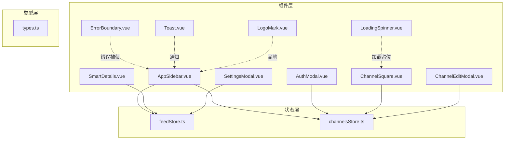
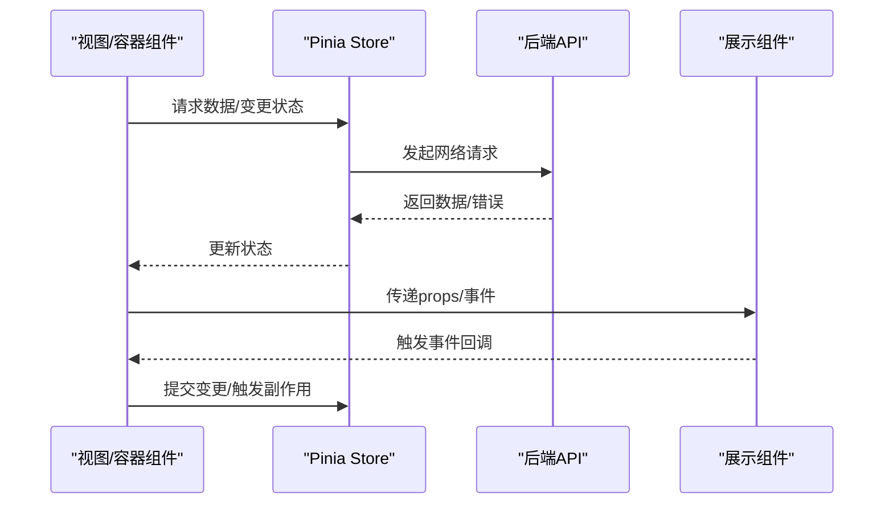
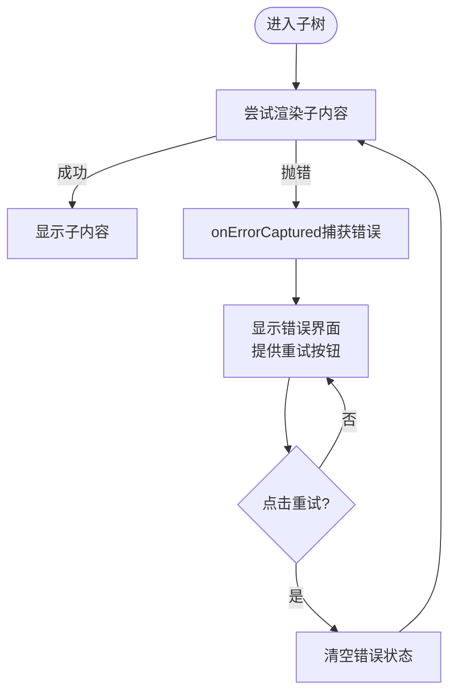
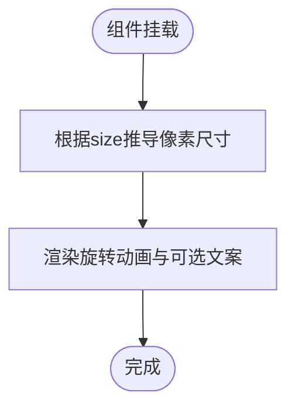
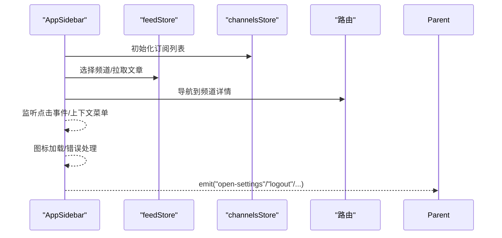
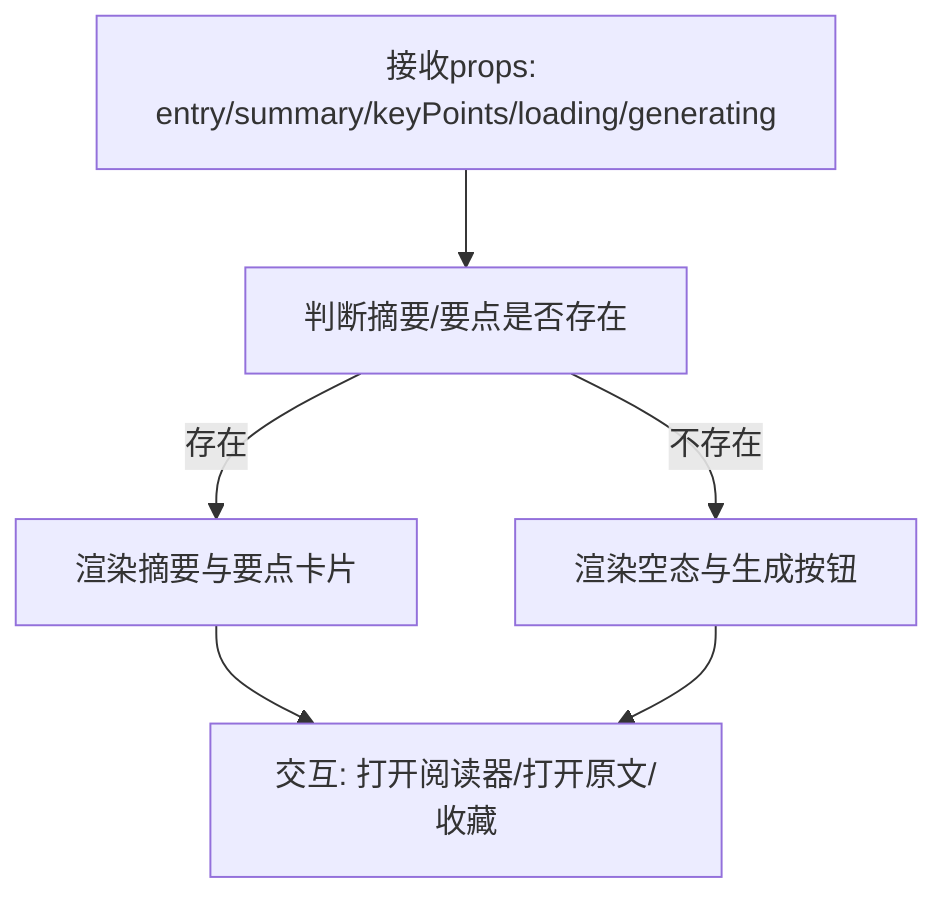
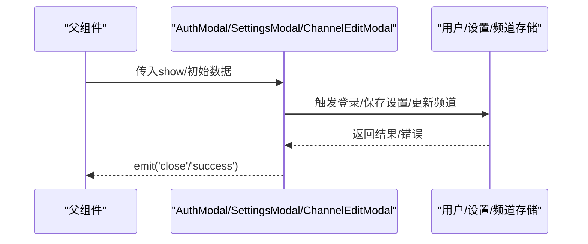
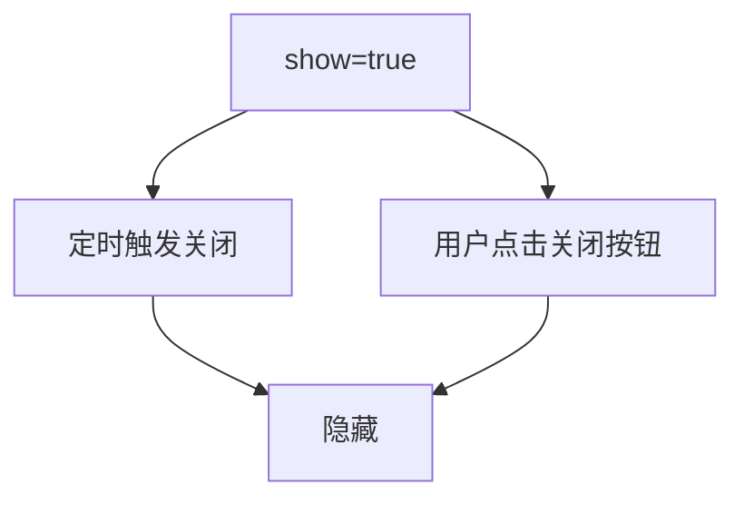
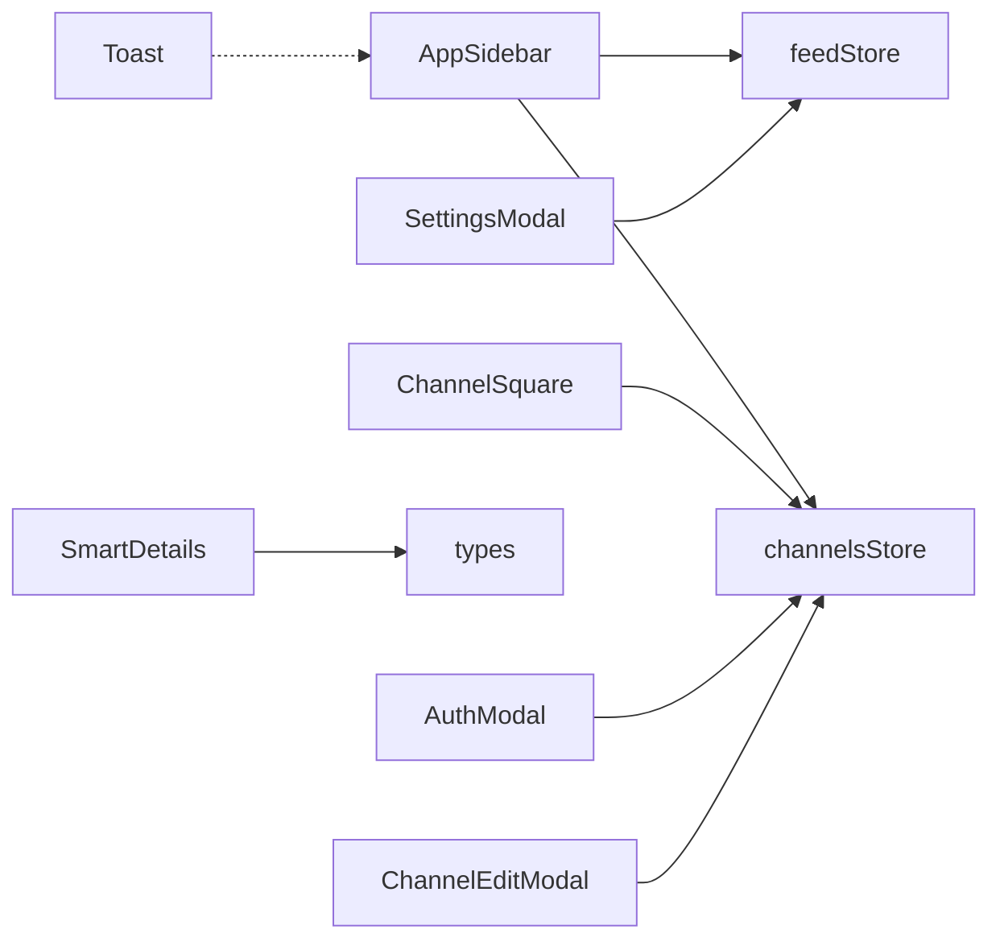

# 组件设计模式

<cite>
**本文引用的文件**
- [ErrorBoundary.vue](file://rss-desktop/src/components/ErrorBoundary.vue)
- [LoadingSpinner.vue](file://rss-desktop/src/components/LoadingSpinner.vue)
- [AppSidebar.vue](file://rss-desktop/src/components/AppSidebar.vue)
- [SmartDetails.vue](file://rss-desktop/src/components/SmartDetails.vue)
- [AuthModal.vue](file://rss-desktop/src/components/AuthModal.vue)
- [Toast.vue](file://rss-desktop/src/components/Toast.vue)
- [ChannelSquare.vue](file://rss-desktop/src/components/ChannelSquare.vue)
- [LogoMark.vue](file://rss-desktop/src/components/LogoMark.vue)
- [ChannelEditModal.vue](file://rss-desktop/src/components/ChannelEditModal.vue)
- [SettingsModal.vue](file://rss-desktop/src/components/SettingsModal.vue)
- [feedStore.ts](file://rss-desktop/src/stores/feedStore.ts)
- [channelsStore.ts](file://rss-desktop/src/stores/channelsStore.ts)
- [types.ts](file://rss-desktop/src/types.ts)
</cite>

## 目录
1. [引言](#引言)
2. [项目结构](#项目结构)
3. [核心组件](#核心组件)
4. [架构总览](#架构总览)
5. [详细组件分析](#详细组件分析)
6. [依赖关系分析](#依赖关系分析)
7. [性能考量](#性能考量)
8. [故障排查指南](#故障排查指南)
9. [结论](#结论)
10. [附录](#附录)

## 引言
本文件面向 Tan RSS Reader 的 Vue 组件体系，系统梳理其组件设计模式与工程实践，重点覆盖以下主题：
- 命名规范与结构设计
- 容器组件与展示组件的分离原则
- 高阶组件的使用场景与替代方案
- 组件间通信模式（props/events、provide/inject、全局状态）
- 组件组合与继承最佳实践
- 错误边界与加载状态组件的设计
- 测试策略、性能优化与可访问性实现
- 设计决策依据与代码示例路径

## 项目结构
项目采用“功能域+层”混合组织方式：组件位于 src/components，状态管理位于 src/stores，类型定义位于 src/types，页面视图位于 src/views。组件之间通过 props/events 与 Pinia 状态进行松耦合交互。

图表来源
- [AppSidebar.vue:1-120](file://rss-desktop/src/components/AppSidebar.vue#L1-L120)
- [SmartDetails.vue:1-40](file://rss-desktop/src/components/SmartDetails.vue#L1-L40)
- [AuthModal.vue:1-40](file://rss-desktop/src/components/AuthModal.vue#L1-L40)
- [ChannelSquare.vue:1-40](file://rss-desktop/src/components/ChannelSquare.vue#L1-L40)
- [SettingsModal.vue:1-40](file://rss-desktop/src/components/SettingsModal.vue#L1-L40)
- [ChannelEditModal.vue:1-40](file://rss-desktop/src/components/ChannelEditModal.vue#L1-L40)
- [ErrorBoundary.vue:1-40](file://rss-desktop/src/components/ErrorBoundary.vue#L1-L40)
- [LoadingSpinner.vue:1-30](file://rss-desktop/src/components/LoadingSpinner.vue#L1-L30)
- [Toast.vue:1-30](file://rss-desktop/src/components/Toast.vue#L1-L30)
- [LogoMark.vue:1-10](file://rss-desktop/src/components/LogoMark.vue#L1-L10)
- [feedStore.ts:1-60](file://rss-desktop/src/stores/feedStore.ts#L1-L60)
- [channelsStore.ts:1-40](file://rss-desktop/src/stores/channelsStore.ts#L1-L40)
- [types.ts:1-20](file://rss-desktop/src/types.ts#L1-L20)

章节来源
- [AppSidebar.vue:1-120](file://rss-desktop/src/components/AppSidebar.vue#L1-L120)
- [feedStore.ts:1-120](file://rss-desktop/src/stores/feedStore.ts#L1-L120)
- [channelsStore.ts:1-80](file://rss-desktop/src/stores/channelsStore.ts#L1-L80)

## 核心组件
- 错误边界组件：统一捕获子树错误，提供重试机制，避免应用崩溃扩散。
- 加载状态组件：提供可配置尺寸与文案的加载指示器，支持无障碍属性。
- 容器组件：如 AppSidebar、ChannelSquare、SettingsModal，负责状态拉取、路由与用户交互协调。
- 展示组件：如 SmartDetails、Toast、LogoMark，专注渲染与最小化副作用。
- 模态对话框：AuthModal、ChannelEditModal、SettingsModal，封装复杂交互与表单校验。

章节来源
- [ErrorBoundary.vue:1-81](file://rss-desktop/src/components/ErrorBoundary.vue#L1-L81)
- [LoadingSpinner.vue:1-59](file://rss-desktop/src/components/LoadingSpinner.vue#L1-L59)
- [AppSidebar.vue:1-120](file://rss-desktop/src/components/AppSidebar.vue#L1-L120)
- [ChannelSquare.vue:1-120](file://rss-desktop/src/components/ChannelSquare.vue#L1-L120)
- [SettingsModal.vue:1-120](file://rss-desktop/src/components/SettingsModal.vue#L1-L120)
- [SmartDetails.vue:1-60](file://rss-desktop/src/components/SmartDetails.vue#L1-L60)
- [Toast.vue:1-40](file://rss-desktop/src/components/Toast.vue#L1-L40)
- [LogoMark.vue:1-20](file://rss-desktop/src/components/LogoMark.vue#L1-L20)
- [ChannelEditModal.vue:1-60](file://rss-desktop/src/components/ChannelEditModal.vue#L1-L60)
- [AuthModal.vue:1-60](file://rss-desktop/src/components/AuthModal.vue#L1-L60)

## 架构总览
组件与状态的交互遵循“容器-展示”分离与“单向数据流”原则。容器组件通过 Pinia Store 获取/更新状态，展示组件仅消费 props 与事件回调，保证可测试性与可维护性。

图表来源
- [feedStore.ts:75-150](file://rss-desktop/src/stores/feedStore.ts#L75-L150)
- [channelsStore.ts:135-177](file://rss-desktop/src/stores/channelsStore.ts#L135-L177)
- [AppSidebar.vue:74-124](file://rss-desktop/src/components/AppSidebar.vue#L74-L124)
- [ChannelSquare.vue:85-122](file://rss-desktop/src/components/ChannelSquare.vue#L85-L122)

## 详细组件分析

### 错误边界组件 ErrorBoundary
- 设计目标：在组件树局部异常时阻止错误冒泡，提供用户可操作的重试入口。
- 实现要点：
  - 使用生命周期钩子捕获错误并记录日志。
  - 通过插槽渲染正常内容或错误界面。
  - 提供重试函数清空错误状态。
- 可访问性：错误消息具备语义化标签与键盘可达性。
- 适用场景：异步渲染失败、第三方资源加载失败等。

图表来源
- [ErrorBoundary.vue:6-26](file://rss-desktop/src/components/ErrorBoundary.vue#L6-L26)

章节来源
- [ErrorBoundary.vue:1-81](file://rss-desktop/src/components/ErrorBoundary.vue#L1-L81)

### 加载状态组件 LoadingSpinner
- 设计目标：为长耗时操作提供明确反馈，支持不同尺寸与文案。
- 实现要点：
  - 默认参数与类型约束，计算属性派生像素尺寸。
  - 支持无障碍属性 role 与 aria-live。
- 适用场景：列表加载、卡片渲染、异步请求等待。

图表来源
- [LoadingSpinner.vue:17-31](file://rss-desktop/src/components/LoadingSpinner.vue#L17-L31)

章节来源
- [LoadingSpinner.vue:1-59](file://rss-desktop/src/components/LoadingSpinner.vue#L1-L59)

### 容器组件 AppSidebar（容器-展示分离）
- 分离原则：
  - 容器职责：状态管理（feedStore、channelsStore、settingsStore、userStore）、路由跳转、上下文菜单、图标加载与错误处理。
  - 展示职责：导航项、用户菜单、频道列表、空态与错误提示。
- 事件与回调：
  - 通过 emit 向父级传递动作（重置过滤、打开设置、打开认证、登出、打开频道详情等）。
- 交互细节：
  - 动态滚动定位到当前激活频道。
  - 上下文菜单与文档点击外侧关闭。
  - 图标加载失败降级处理。

图表来源
- [AppSidebar.vue:74-124](file://rss-desktop/src/components/AppSidebar.vue#L74-L124)
- [feedStore.ts:332-403](file://rss-desktop/src/stores/feedStore.ts#L332-L403)
- [channelsStore.ts:150-161](file://rss-desktop/src/stores/channelsStore.ts#L150-L161)

章节来源
- [AppSidebar.vue:1-200](file://rss-desktop/src/components/AppSidebar.vue#L1-L200)
- [feedStore.ts:332-403](file://rss-desktop/src/stores/feedStore.ts#L332-L403)
- [channelsStore.ts:150-161](file://rss-desktop/src/stores/channelsStore.ts#L150-L161)

### 展示组件 SmartDetails（智能摘要与元数据）
- 设计目标：以卡片化布局呈现摘要、关键信息与元数据；支持生成与收藏切换。
- 数据驱动：
  - 通过 props 接收 Entry、摘要、要点、生成状态与加载状态。
  - 通过 emits 触发打开阅读器、打开原文、收藏切换等行为。
- 响应式与可访问性：
  - 条件渲染与禁用态控制。
  - 文案国际化与无障碍标签。

图表来源
- [SmartDetails.vue:23-75](file://rss-desktop/src/components/SmartDetails.vue#L23-L75)

章节来源
- [SmartDetails.vue:1-140](file://rss-desktop/src/components/SmartDetails.vue#L1-L140)
- [types.ts:14-34](file://rss-desktop/src/types.ts#L14-L34)

### 模态对话框组件（AuthModal、ChannelEditModal、SettingsModal）
- 共同特征：
  - 通过 props 控制显示/隐藏，emit 关闭事件。
  - 内部状态与外部状态通过 props/watch 同步。
  - 封装复杂交互（登录/注册、频道编辑、设置项）。
- AuthModal：
  - 切换登录/注册模式，调用用户存储执行登录。
  - 注册成功后自动切换到登录态并提示。
- ChannelEditModal：
  - 双向绑定频道名称与描述，提交后刷新订阅列表。
- SettingsModal：
  - 使用 computed getter/setter 与设置存储联动，支持语言切换与日期过滤设置。

图表来源
- [AuthModal.vue:25-67](file://rss-desktop/src/components/AuthModal.vue#L25-L67)
- [ChannelEditModal.vue:21-45](file://rss-desktop/src/components/ChannelEditModal.vue#L21-L45)
- [SettingsModal.vue:20-70](file://rss-desktop/src/components/SettingsModal.vue#L20-L70)

章节来源
- [AuthModal.vue:1-120](file://rss-desktop/src/components/AuthModal.vue#L1-L120)
- [ChannelEditModal.vue:1-100](file://rss-desktop/src/components/ChannelEditModal.vue#L1-L100)
- [SettingsModal.vue:1-120](file://rss-desktop/src/components/SettingsModal.vue#L1-L120)

### 通知组件 Toast
- 设计目标：全局轻提示，自动消失与手动关闭。
- 实现要点：
  - 监听 show 变化自动定时关闭。
  - 支持不同类型样式与过渡动画。
  - 无障碍角色与关闭按钮。

图表来源
- [Toast.vue:14-20](file://rss-desktop/src/components/Toast.vue#L14-L20)

章节来源
- [Toast.vue:1-92](file://rss-desktop/src/components/Toast.vue#L1-L92)

### 品牌与通用组件 LogoMark
- 设计目标：统一品牌标识，支持尺寸可配置。
- 实现要点：静态图片资源与可选 alt 文本。

章节来源
- [LogoMark.vue:1-24](file://rss-desktop/src/components/LogoMark.vue#L1-L24)

## 依赖关系分析
- 组件依赖：
  - AppSidebar 依赖 feedStore、channelsStore、settingsStore、userStore 与路由/i18n。
  - ChannelSquare 依赖 channelsStore 与 LoadingSpinner。
  - SettingsModal 依赖 settingsStore 与国际化能力。
  - SmartDetails 依赖 types 与国际化。
- 状态依赖：
  - feedStore 提供文章、订阅、分组、缓存与翻译能力。
  - channelsStore 提供频道列表、订阅、分类与标签管理。

图表来源
- [AppSidebar.vue:29-35](file://rss-desktop/src/components/AppSidebar.vue#L29-L35)
- [ChannelSquare.vue:15-16](file://rss-desktop/src/components/ChannelSquare.vue#L15-L16)
- [SettingsModal.vue:6-18](file://rss-desktop/src/components/SettingsModal.vue#L6-L18)
- [SmartDetails.vue:4-5](file://rss-desktop/src/components/SmartDetails.vue#L4-L5)
- [feedStore.ts:1-26](file://rss-desktop/src/stores/feedStore.ts#L1-L26)
- [channelsStore.ts:1-47](file://rss-desktop/src/stores/channelsStore.ts#L1-L47)

章节来源
- [feedStore.ts:1-120](file://rss-desktop/src/stores/feedStore.ts#L1-L120)
- [channelsStore.ts:1-120](file://rss-desktop/src/stores/channelsStore.ts#L1-L120)

## 性能考量
- 渲染优化
  - 使用计算属性缓存派生数据（如 AppSidebar 的可见频道、SmartDetails 的摘要存在性）。
  - 列表渲染中使用 key 与虚拟滚动（若后续扩展）。
- 状态与网络
  - feedStore 与 channelsStore 内置 loading/error/message 状态，避免重复请求与闪烁。
  - 摘要与翻译结果缓存，减少重复调用。
- 事件与副作用
  - AppSidebar 在 mounted 中监听文档点击，注意在卸载时清理事件监听。
  - ChannelSquare 使用防抖/节流策略（如搜索）与本地 AB 实验标记，避免频繁写入。
- 可访问性
  - LoadingSpinner、Toast、ChannelSquare 等组件均提供 role、aria-live、aria-label 等属性。
  - 表单控件具备标签与焦点管理。

章节来源
- [AppSidebar.vue:74-103](file://rss-desktop/src/components/AppSidebar.vue#L74-L103)
- [ChannelSquare.vue:96-122](file://rss-desktop/src/components/ChannelSquare.vue#L96-L122)
- [feedStore.ts:448-505](file://rss-desktop/src/stores/feedStore.ts#L448-L505)
- [LoadingSpinner.vue:28-31](file://rss-desktop/src/components/LoadingSpinner.vue#L28-L31)
- [Toast.vue:25-29](file://rss-desktop/src/components/Toast.vue#L25-L29)

## 故障排查指南
- 错误边界
  - 若子组件渲染异常导致整页白屏，检查 ErrorBoundary 是否正确包裹。
  - 重试后仍失败，查看控制台日志与错误消息。
- 加载状态
  - LoadingSpinner 不出现：检查父组件是否正确传递 show/size/label。
- 认证与订阅
  - 登录失败：查看 AuthModal 的错误提示与 userStore 的错误状态。
  - 订阅失败：检查 channelsStore 的 error/message，并确认用户令牌。
- 设置与语言
  - 设置不生效：确认 computed setter 已触发 settingsStore.updateSettings。
  - 语言切换无效：检查 useLanguage 的 setLanguage 与可用语言列表。

章节来源
- [ErrorBoundary.vue:6-26](file://rss-desktop/src/components/ErrorBoundary.vue#L6-L26)
- [AuthModal.vue:41-67](file://rss-desktop/src/components/AuthModal.vue#L41-L67)
- [channelsStore.ts:163-177](file://rss-desktop/src/stores/channelsStore.ts#L163-L177)
- [SettingsModal.vue:62-100](file://rss-desktop/src/components/SettingsModal.vue#L62-L100)

## 结论
Tan RSS Reader 的组件设计遵循“容器-展示”分离与“单向数据流”，通过 Pinia 管理跨组件状态，结合错误边界与加载状态组件提升用户体验与稳定性。建议持续：
- 强化组件单元测试与集成测试，覆盖关键交互路径。
- 逐步引入 SSR/预渲染与懒加载策略，优化首屏性能。
- 完善可访问性审计与键盘导航覆盖。
- 保持命名一致性与文档化最佳实践，降低团队协作成本。

## 附录
- 组件命名规范
  - 容器组件：以动词或复合动词短语命名，体现职责（如 AppSidebar、ChannelSquare）。
  - 展示组件：以名词或抽象概念命名，强调呈现（如 LoadingSpinner、Toast、LogoMark）。
  - 模态组件：以 Modal 结尾（如 AuthModal、SettingsModal、ChannelEditModal）。
- 高阶组件使用建议
  - 优先使用组合式函数（composables）与 provide/inject 解耦共享逻辑。
  - 仅在必要时使用高阶组件（如权限包装），避免过度嵌套。
- 组件通信清单
  - props/events：父子组件直接通信。
  - provide/inject：跨层级共享配置或服务实例。
  - 全局状态：Pinia Store 管理跨页面状态与业务逻辑。