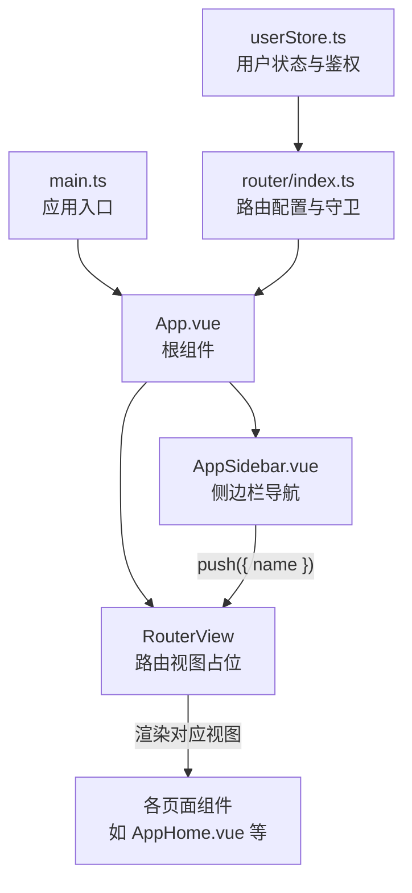
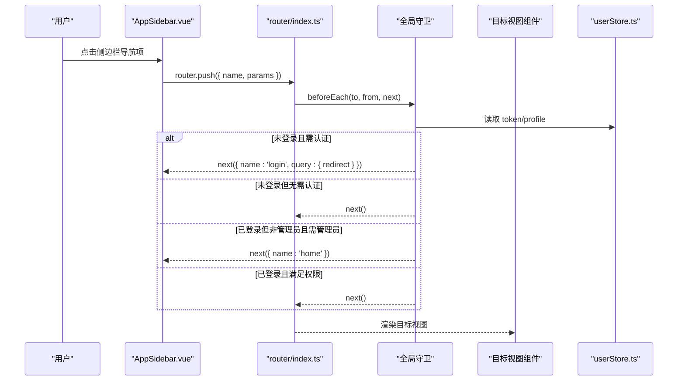
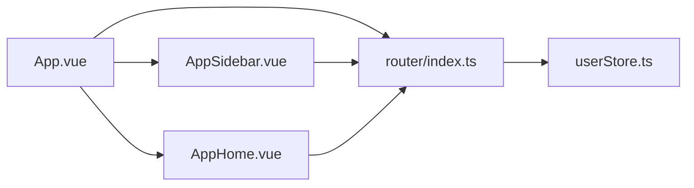

# 路由与导航

<cite>
**本文引用的文件**
- [router/index.ts](file://rss-desktop/src/router/index.ts)
- [main.ts](file://rss-desktop/src/main.ts)
- [App.vue](file://rss-desktop/src/App.vue)
- [AppSidebar.vue](file://rss-desktop/src/components/AppSidebar.vue)
- [AppHome.vue](file://rss-desktop/src/views/AppHome.vue)
- [userStore.ts](file://rss-desktop/src/stores/userStore.ts)
</cite>

## 目录
1. [简介](#简介)
2. [项目结构](#项目结构)
3. [核心组件](#核心组件)
4. [架构总览](#架构总览)
5. [详细组件分析](#详细组件分析)
6. [依赖关系分析](#依赖关系分析)
7. [性能考量](#性能考量)
8. [故障排查指南](#故障排查指南)
9. [结论](#结论)
10. [附录](#附录)

## 简介
本章节面向 Tan RSS Reader 的 Vue Router 路由系统，系统性梳理路由配置、导航守卫、动态路由与懒加载、路由元信息、程序化导航、命名路由与参数传递、路由过渡与面包屑联动、权限控制、404 处理与 SEO 策略，并提供可直接定位到源码位置的参考路径，帮助开发者快速理解与扩展。

## 项目结构
- 路由入口与配置位于路由模块，通过 Hash 模式构建历史记录。
- 应用根组件负责布局与全局 UI 状态，结合侧边栏与主内容区渲染 RouterView。
- 侧边栏组件与主页面组件均通过命名路由进行程序化导航，实现侧边栏联动与导航一致性。
- 用户状态通过 Pinia Store 管理，配合全局前置守卫实现权限控制。

图表来源
- [main.ts:1-9](file://rss-desktop/src/main.ts#L1-L9)
- [router/index.ts:1-77](file://rss-desktop/src/router/index.ts#L1-L77)
- [App.vue:1-333](file://rss-desktop/src/App.vue#L1-L333)
- [AppSidebar.vue:1-1025](file://rss-desktop/src/components/AppSidebar.vue#L1-L1025)
- [AppHome.vue:1-3195](file://rss-desktop/src/views/AppHome.vue#L1-L3195)
- [userStore.ts:1-143](file://rss-desktop/src/stores/userStore.ts#L1-L143)

章节来源
- [main.ts:1-9](file://rss-desktop/src/main.ts#L1-L9)
- [router/index.ts:1-77](file://rss-desktop/src/router/index.ts#L1-L77)
- [App.vue:1-333](file://rss-desktop/src/App.vue#L1-L333)

## 核心组件
- 路由配置与守卫
  - 定义了多条命名路由，包含首页、登录、频道、管理员后台、趋势分析、话题详情等。
  - 使用路由元信息标记访问权限（requiresAuth、requiresAdmin）。
  - 全局前置守卫实现登录态校验、管理员权限校验与登录页重定向。
- 用户状态与鉴权
  - 提供登录、注册、登出、获取用户资料等方法，作为守卫与组件交互的依据。
- 根组件与布局
  - 根组件负责全局 UI 状态、侧边栏宽度与 Reader 模式切换，并在特定路由隐藏侧边栏。
- 侧边栏导航
  - 通过命名路由 push 实现与路由表一致的导航行为，支持活跃态高亮与滚动对齐。
- 主页面（订阅流）
  - 监听路由参数变化，实现频道详情与首页的切换逻辑，支持窄屏直接进入阅读页。

章节来源
- [router/index.ts:5-43](file://rss-desktop/src/router/index.ts#L5-L43)
- [router/index.ts:50-74](file://rss-desktop/src/router/index.ts#L50-L74)
- [userStore.ts:14-142](file://rss-desktop/src/stores/userStore.ts#L14-L142)
- [App.vue:26-28](file://rss-desktop/src/App.vue#L26-L28)
- [AppSidebar.vue:117-124](file://rss-desktop/src/components/AppSidebar.vue#L117-L124)
- [AppHome.vue:100-115](file://rss-desktop/src/views/AppHome.vue#L100-L115)

## 架构总览
路由系统采用 Hash 模式，结合命名路由与路由元信息，实现清晰的权限控制与导航体验。全局守卫在每次路由切换前执行，确保受保护页面的访问安全。侧边栏与主页面通过命名路由保持导航一致性，支持活跃态联动与参数驱动的详情页。

图表来源
- [router/index.ts:50-74](file://rss-desktop/src/router/index.ts#L50-L74)
- [userStore.ts:14-142](file://rss-desktop/src/stores/userStore.ts#L14-L142)
- [AppSidebar.vue:117-124](file://rss-desktop/src/components/AppSidebar.vue#L117-L124)

## 详细组件分析

### 路由配置与懒加载
- 路由定义集中在路由模块，采用命名路由提升可维护性与可读性。
- 动态导入（懒加载）用于登录页、频道、管理后台、趋势分析、话题详情等页面，减少首屏体积。
- 路由元信息：
  - requiresAuth：标记页面需登录态。
  - requiresAdmin：标记页面需管理员角色。
- 参数路由：
  - 频道详情与话题详情使用动态参数，便于参数驱动的页面渲染与面包屑生成。

章节来源
- [router/index.ts:5-43](file://rss-desktop/src/router/index.ts#L5-L43)

### 导航守卫与权限控制
- 登录态校验：若存在 token 但无用户资料，尝试拉取用户资料；失败则登出。
- 权限校验：若目标路由要求认证且无 token，重定向至登录页并携带 redirect 参数。
- 管理员校验：若目标路由要求管理员且用户非 admin，重定向至首页。
- 未匹配路由：当前配置未显式声明通配符 404 路由，建议补充兜底路由以提升健壮性。

章节来源
- [router/index.ts:50-74](file://rss-desktop/src/router/index.ts#L50-L74)
- [userStore.ts:68-87](file://rss-desktop/src/stores/userStore.ts#L68-L87)

### 程序化导航与命名路由
- 侧边栏导航：通过 router.push({ name }) 实现与路由表一致的导航行为，支持活跃态高亮与滚动对齐。
- 主页面导航：在 AppHome 中，点击条目后通过 router.push({ name:'reader', params:{ id } }) 进入阅读页。
- 返回与重置：根组件根据路由名决定是否隐藏侧边栏，以及重置筛选条件。

章节来源
- [AppSidebar.vue:117-124](file://rss-desktop/src/components/AppSidebar.vue#L117-L124)
- [AppHome.vue:1095-1098](file://rss-desktop/src/views/AppHome.vue#L1095-L1098)
- [App.vue:26-28](file://rss-desktop/src/App.vue#L26-L28)
- [App.vue:133-143](file://rss-desktop/src/App.vue#L133-L143)

### 路由参数传递与参数监听
- 参数路由：/my-channels/:id、/reader/:id、/trends/:id 等。
- 参数监听：AppHome 监听 route.params.id，实现频道详情与首页切换逻辑。
- 参数传递最佳实践：
  - 使用命名路由与 params 传递关键标识，避免拼接字符串。
  - 在组件内使用 watch 监听 $route.params 或组合式 API 的 useRoute，确保参数变化触发数据刷新。

章节来源
- [router/index.ts:16-20](file://rss-desktop/src/router/index.ts#L16-L20)
- [router/index.ts:26-30](file://rss-desktop/src/router/index.ts#L26-L30)
- [router/index.ts:37-42](file://rss-desktop/src/router/index.ts#L37-L42)
- [AppHome.vue:100-115](file://rss-desktop/src/views/AppHome.vue#L100-L115)

### 代码分割与懒加载
- 通过动态导入实现按需加载，降低首屏资源压力。
- 建议对大型页面（如趋势分析、话题详情）进一步拆分异步组件，结合路由级别的懒加载与路由级预加载策略，优化首屏与交互体验。

章节来源
- [router/index.ts:7-42](file://rss-desktop/src/router/index.ts#L7-L42)

### 路由过渡动画与面包屑导航
- 路由过渡动画：当前未在路由层配置过渡效果，可在 RouterView 上增加过渡类名或使用 keep-alive 结合过渡组件实现页面切换动画。
- 面包屑导航：当前未实现专用面包屑组件，可通过路由元信息（如 title、parent）与路由栈计算生成，或在目标视图内根据路由 name 与 params 动态渲染。

章节来源
- [App.vue:277-279](file://rss-desktop/src/App.vue#L277-L279)

### 侧边栏联动与活跃态
- 侧边栏根据当前路由名设置活跃态，支持点击后滚动到对应频道元素。
- 通过 watch 监听 store.activeChannelId，在频道列表中自动滚动到当前频道，增强导航一致性。

章节来源
- [AppSidebar.vue:196-199](file://rss-desktop/src/components/AppSidebar.vue#L196-L199)
- [AppSidebar.vue:95-103](file://rss-desktop/src/components/AppSidebar.vue#L95-L103)

### 404 处理与 SEO 策略
- 404 处理：当前未配置通配符 404 路由，建议新增兜底路由并返回统一的 404 视图，记录访问日志以便后续 SEO 优化。
- SEO 策略：
  - 为每个页面设置标题与描述（可基于路由元信息或页面级 computed）。
  - 使用动态 meta 标签或第三方插件注入页面级 SEO 元数据。
  - 对外链打开使用新窗口并设置 rel="noopener noreferrer"，提升安全性。

章节来源
- [router/index.ts:5-43](file://rss-desktop/src/router/index.ts#L5-L43)

## 依赖关系分析
- 路由模块依赖用户状态存储以实现权限控制。
- 根组件依赖路由实例以控制布局与 Reader 模式。
- 侧边栏与主页面组件依赖路由实例进行程序化导航。
- AppHome 依赖路由实例与路由参数实现频道详情与阅读页跳转。

图表来源
- [router/index.ts:1-77](file://rss-desktop/src/router/index.ts#L1-L77)
- [userStore.ts:1-143](file://rss-desktop/src/stores/userStore.ts#L1-L143)
- [App.vue:1-333](file://rss-desktop/src/App.vue#L1-L333)
- [AppSidebar.vue:1-1025](file://rss-desktop/src/components/AppSidebar.vue#L1-L1025)
- [AppHome.vue:1-3195](file://rss-desktop/src/views/AppHome.vue#L1-L3195)

## 性能考量
- 懒加载与代码分割：已通过动态导入实现，建议结合路由级预加载策略与缓存策略进一步优化。
- 路由守卫开销：守卫中涉及用户资料拉取与权限判断，建议在守卫中加入必要的缓存与降级逻辑，避免重复请求。
- 视图切换：在 RouterView 上启用 keep-alive 可显著减少重复渲染带来的性能损耗。

## 故障排查指南
- 登录态异常
  - 现象：访问受保护页面被重定向至登录页。
  - 排查：确认 token 是否存在，用户资料是否拉取成功；检查守卫逻辑与用户状态存储。
- 权限不足
  - 现象：访问管理员页面被重定向至首页。
  - 排查：确认用户角色是否为 admin；检查路由元信息与守卫判断。
- 参数路由无效
  - 现象：频道详情或阅读页无法正确渲染。
  - 排查：确认路由表中的命名与参数是否与导航一致；检查组件内对 $route.params 的监听与数据刷新逻辑。
- 侧边栏不联动
  - 现象：点击导航后活跃态未更新或未滚动到对应项。
  - 排查：确认路由名与侧边栏活跃态判断一致；检查 store.activeChannelId 的更新与滚动逻辑。

章节来源
- [router/index.ts:50-74](file://rss-desktop/src/router/index.ts#L50-L74)
- [userStore.ts:68-87](file://rss-desktop/src/stores/userStore.ts#L68-L87)
- [AppSidebar.vue:117-124](file://rss-desktop/src/components/AppSidebar.vue#L117-L124)
- [AppHome.vue:100-115](file://rss-desktop/src/views/AppHome.vue#L100-L115)

## 结论
该路由系统以命名路由为核心，结合路由元信息与全局守卫实现了清晰的权限控制与导航体验。通过懒加载与参数路由提升了性能与可维护性。建议后续完善 404 兜底、路由过渡动画与面包屑导航，并在守卫中引入更完善的缓存与降级策略，以进一步提升稳定性与用户体验。

## 附录
- 路由配置示例（定位到源码）
  - [路由定义与懒加载:5-43](file://rss-desktop/src/router/index.ts#L5-L43)
  - [全局前置守卫:50-74](file://rss-desktop/src/router/index.ts#L50-L74)
- 导航守卫具体实现（定位到源码）
  - [用户资料拉取与登出:68-87](file://rss-desktop/src/stores/userStore.ts#L68-L87)
  - [登录态与管理员权限校验:50-74](file://rss-desktop/src/router/index.ts#L50-L74)
- 程序化导航与命名路由（定位到源码）
  - [侧边栏导航:117-124](file://rss-desktop/src/components/AppSidebar.vue#L117-124)
  - [阅读页跳转:1095-1098](file://rss-desktop/src/views/AppHome.vue#L1095-1098)
  - [重置筛选与返回首页:133-143](file://rss-desktop/src/App.vue#L133-143)
- 路由参数传递最佳实践（定位到源码）
  - [参数监听与切换逻辑:100-115](file://rss-desktop/src/views/AppHome.vue#L100-115)
  - [参数路由定义:16-20](file://rss-desktop/src/router/index.ts#L16-L20)