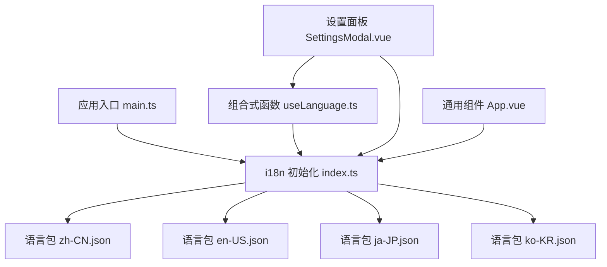
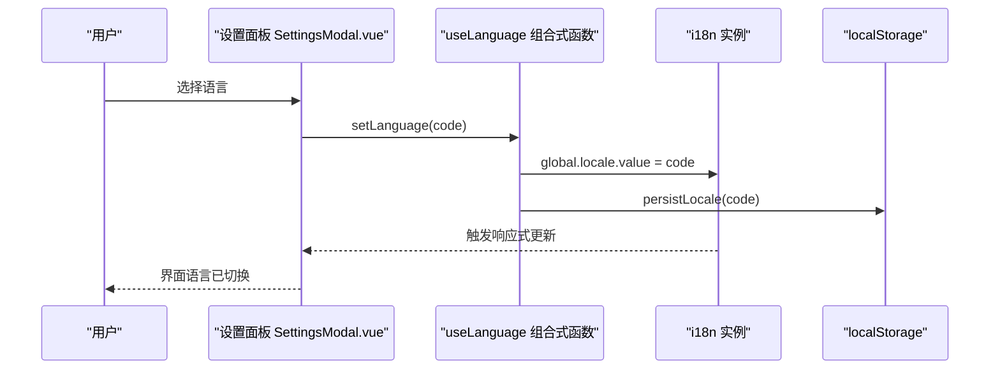
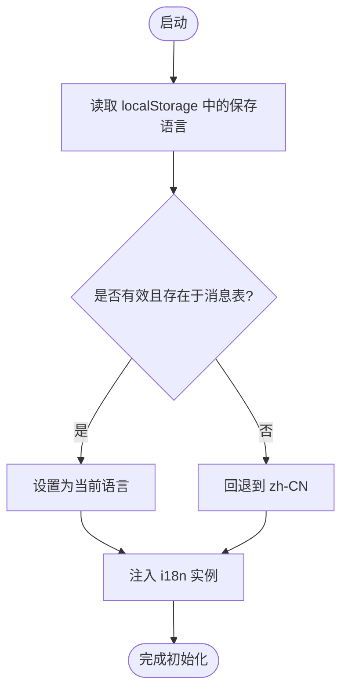
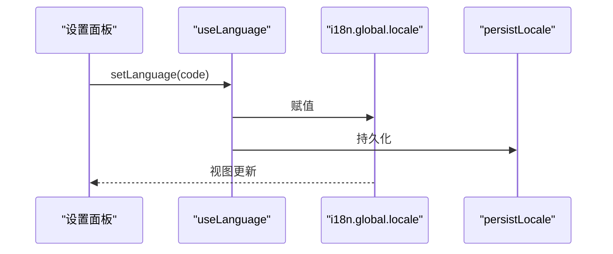
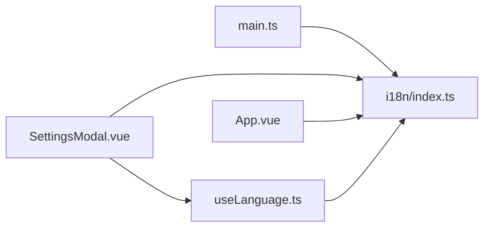

# 国际化与本地化

<cite>
**本文引用的文件**
- [rss-desktop/src/i18n/index.ts](file://rss-desktop/src/i18n/index.ts)
- [rss-desktop/src/composables/useLanguage.ts](file://rss-desktop/src/composables/useLanguage.ts)
- [rss-desktop/src/i18n/locales/en-US.json](file://rss-desktop/src/i18n/locales/en-US.json)
- [rss-desktop/src/i18n/locales/zh-CN.json](file://rss-desktop/src/i18n/locales/zh-CN.json)
- [rss-desktop/src/i18n/locales/ja-JP.json](file://rss-desktop/src/i18n/locales/ja-JP.json)
- [rss-desktop/src/i18n/locales/ko-KR.json](file://rss-desktop/src/i18n/locales/ko-KR.json)
- [rss-desktop/src/constants/translation.ts](file://rss-desktop/src/constants/translation.ts)
- [rss-desktop/src/main.ts](file://rss-desktop/src/main.ts)
- [rss-desktop/src/components/SettingsModal.vue](file://rss-desktop/src/components/SettingsModal.vue)
- [rss-desktop/src/App.vue](file://rss-desktop/src/App.vue)
</cite>

## 目录
1. [简介](#简介)
2. [项目结构](#项目结构)
3. [核心组件](#核心组件)
4. [架构总览](#架构总览)
5. [详细组件分析](#详细组件分析)
6. [依赖关系分析](#依赖关系分析)
7. [性能考量](#性能考量)
8. [故障排查指南](#故障排查指南)
9. [结论](#结论)
10. [附录](#附录)

## 简介
本文件面向 Tan RSS Reader 的国际化与本地化系统，系统基于 Vue 3 + vue-i18n 实现，覆盖语言包管理、动态切换、文本翻译、数字与日期本地化、RTL 支持策略、字体与布局适配、语言检测与回退、翻译并发控制、性能优化与调试方法等。文档旨在帮助开发者与翻译人员高效协作，确保多语言体验的一致性与可维护性。

## 项目结构
- 国际化入口与语言包
  - i18n 初始化与消息注册：[rss-desktop/src/i18n/index.ts](file://rss-desktop/src/i18n/index.ts)
  - 语言包目录：[rss-desktop/src/i18n/locales/](file://rss-desktop/src/i18n/locales/)
- 语言切换组合式函数
  - 语言列表与切换逻辑：[rss-desktop/src/composables/useLanguage.ts](file://rss-desktop/src/composables/useLanguage.ts)
- 应用挂载与注入
  - 在应用入口注入 i18n：[rss-desktop/src/main.ts](file://rss-desktop/src/main.ts)
- 组件中的使用
  - 设置面板语言选择与翻译调用：[rss-desktop/src/components/SettingsModal.vue](file://rss-desktop/src/components/SettingsModal.vue)
  - 通用组件中使用 t 函数进行翻译：[rss-desktop/src/App.vue](file://rss-desktop/src/App.vue)
- 翻译相关常量与并发控制
  - 标题翻译并发与限速策略：[rss-desktop/src/constants/translation.ts](file://rss-desktop/src/constants/translation.ts)

**图表来源**
- [rss-desktop/src/main.ts:1-9](file://rss-desktop/src/main.ts#L1-L9)
- [rss-desktop/src/i18n/index.ts:1-35](file://rss-desktop/src/i18n/index.ts#L1-L35)
- [rss-desktop/src/composables/useLanguage.ts:1-49](file://rss-desktop/src/composables/useLanguage.ts#L1-L49)
- [rss-desktop/src/components/SettingsModal.vue:1-102](file://rss-desktop/src/components/SettingsModal.vue#L1-L102)
- [rss-desktop/src/App.vue:140-333](file://rss-desktop/src/App.vue#L140-L333)

**章节来源**
- [rss-desktop/src/i18n/index.ts:1-35](file://rss-desktop/src/i18n/index.ts#L1-L35)
- [rss-desktop/src/composables/useLanguage.ts:1-49](file://rss-desktop/src/composables/useLanguage.ts#L1-L49)
- [rss-desktop/src/main.ts:1-9](file://rss-desktop/src/main.ts#L1-L9)

## 核心组件
- i18n 初始化与回退
  - 使用 vue-i18n 创建实例，启用全局注入与非传统模式；设置初始语言与回退语言；注册语言包。
  - 关键点：持久化键名、初始语言解析、回退语言、消息映射。
- 语言切换组合式函数
  - 提供可用语言列表、当前语言、设置语言与加载语言的方法；内部通过 i18n.global.locale.value 更新语言并持久化。
- 语言包结构
  - 按模块划分键空间（common/navigation/feeds/articles/ai/time/settings/groups/toast/errors/layout/opml/languages/readingMode/filters），便于维护与查找。
- 应用级使用
  - 在组件中通过 useI18n 获取 t 函数进行翻译；在设置面板中实现语言选择与即时切换。

**章节来源**
- [rss-desktop/src/i18n/index.ts:1-35](file://rss-desktop/src/i18n/index.ts#L1-L35)
- [rss-desktop/src/composables/useLanguage.ts:1-49](file://rss-desktop/src/composables/useLanguage.ts#L1-L49)
- [rss-desktop/src/i18n/locales/en-US.json:1-394](file://rss-desktop/src/i18n/locales/en-US.json#L1-L394)
- [rss-desktop/src/i18n/locales/zh-CN.json:1-394](file://rss-desktop/src/i18n/locales/zh-CN.json#L1-L394)
- [rss-desktop/src/i18n/locales/ja-JP.json:1-394](file://rss-desktop/src/i18n/locales/ja-JP.json#L1-L394)
- [rss-desktop/src/i18n/locales/ko-KR.json:1-394](file://rss-desktop/src/i18n/locales/ko-KR.json#L1-L394)
- [rss-desktop/src/components/SettingsModal.vue:1-102](file://rss-desktop/src/components/SettingsModal.vue#L1-L102)
- [rss-desktop/src/App.vue:140-333](file://rss-desktop/src/App.vue#L140-L333)

## 架构总览
整体架构围绕“初始化 → 注入 → 切换 → 渲染”的主路径展开，语言包按需加载，切换时通过组合式函数更新全局语言并持久化。

**图表来源**
- [rss-desktop/src/components/SettingsModal.vue:82-100](file://rss-desktop/src/components/SettingsModal.vue#L82-L100)
- [rss-desktop/src/composables/useLanguage.ts:24-32](file://rss-desktop/src/composables/useLanguage.ts#L24-L32)
- [rss-desktop/src/i18n/index.ts:32-34](file://rss-desktop/src/i18n/index.ts#L32-L34)

## 详细组件分析

### i18n 初始化与语言包管理
- 初始化要点
  - legacy: false，globalInjection: true，启用组合式 API 与全局注入。
  - locale: resolveInitialLocale()，从 localStorage 读取；若不存在或非法则回退到 zh-CN。
  - fallbackLocale: en-US，作为兜底语言。
  - messages: 将各语言 JSON 文件合并为映射表。
- 语言包组织
  - 每个语言包为独立 JSON，键空间按功能域划分，便于翻译与校验。
  - 支持占位符与复数/数量变体（如 {count}）。

**图表来源**
- [rss-desktop/src/i18n/index.ts:16-30](file://rss-desktop/src/i18n/index.ts#L16-L30)

**章节来源**
- [rss-desktop/src/i18n/index.ts:1-35](file://rss-desktop/src/i18n/index.ts#L1-L35)
- [rss-desktop/src/i18n/locales/en-US.json:1-394](file://rss-desktop/src/i18n/locales/en-US.json#L1-L394)
- [rss-desktop/src/i18n/locales/zh-CN.json:1-394](file://rss-desktop/src/i18n/locales/zh-CN.json#L1-L394)
- [rss-desktop/src/i18n/locales/ja-JP.json:1-394](file://rss-desktop/src/i18n/locales/ja-JP.json#L1-L394)
- [rss-desktop/src/i18n/locales/ko-KR.json:1-394](file://rss-desktop/src/i18n/locales/ko-KR.json#L1-L394)

### 语言切换与持久化
- 可用语言列表
  - zh-CN、en-US、ja-JP、ko-KR，包含语言名与旗帜标识。
- 切换流程
  - setLanguage 更新全局语言并调用 persistLocale 写入 localStorage。
  - loadLanguage 与内部同步逻辑确保当前语言与全局状态一致。
- 组件集成
  - 设置面板通过 v-model 与 computed 实现双向绑定，并在变更时调用 setLanguage。

**图表来源**
- [rss-desktop/src/composables/useLanguage.ts:24-47](file://rss-desktop/src/composables/useLanguage.ts#L24-L47)
- [rss-desktop/src/components/SettingsModal.vue:20-100](file://rss-desktop/src/components/SettingsModal.vue#L20-L100)

**章节来源**
- [rss-desktop/src/composables/useLanguage.ts:1-49](file://rss-desktop/src/composables/useLanguage.ts#L1-L49)
- [rss-desktop/src/components/SettingsModal.vue:1-102](file://rss-desktop/src/components/SettingsModal.vue#L1-L102)

### 文本翻译与日期/数字本地化
- 文本翻译
  - 在组件中通过 useI18n 获取 t 函数，传入键路径（如 common.confirmMarkAllRead）获取对应语言的文本。
- 日期与时间本地化
  - 时间文案采用占位符（如 {count}），在渲染时替换具体数值。
  - 项目中存在“时间范围”文案与“相对时间”文案，建议在需要时结合日期库进行本地化格式化（如 Day.js/Date-fns）。
- 数字格式化
  - 当前语言包未直接暴露数字格式化键，可在业务层对数字进行本地化处理（如千分位、小数点）。

**章节来源**
- [rss-desktop/src/App.vue:145-148](file://rss-desktop/src/App.vue#L145-L148)
- [rss-desktop/src/i18n/locales/en-US.json:179-200](file://rss-desktop/src/i18n/locales/en-US.json#L179-L200)
- [rss-desktop/src/i18n/locales/zh-CN.json:179-200](file://rss-desktop/src/i18n/locales/zh-CN.json#L179-L200)

### RTL 语言支持、字体适配与布局调整
- RTL 支持
  - 当前语言包未体现 RTL 文本方向（如阿拉伯语、希伯来语）。若需支持，建议：
    - 在根容器添加 dir 属性，随语言切换动态更新。
    - 引入方向感知的样式变量与工具类，避免硬编码的 margin/padding。
    - 对布局组件（如侧边栏、按钮排列）进行 RTL 兼容。
- 字体适配
  - 不同语言的字符集与字形差异较大（如东亚文字）。建议：
    - 为关键 UI 定义字体族优先级，确保在缺少字体时有降级方案。
    - 对标题与正文使用不同字重，保证可读性。
- 布局调整
  - 长文本可能导致布局溢出，建议：
    - 使用弹性布局与断词策略（word-break/overflow-wrap）。
    - 为关键区域预留最小宽度与最大宽度，避免极端长度导致的 UI 畸变。

[本节为通用指导，不直接分析具体文件，故无“章节来源”]

### 语言检测、用户偏好与回退机制
- 语言检测
  - 从 localStorage 读取用户上次选择；若为空或非法，则回退到 zh-CN。
- 用户偏好保存
  - setLanguage 调用 persistLocale 将语言写入 localStorage，重启后恢复。
- 回退机制
  - fallbackLocale 设为 en-US，确保缺失键或不可用语言时仍能显示英文。

**章节来源**
- [rss-desktop/src/i18n/index.ts:16-30](file://rss-desktop/src/i18n/index.ts#L16-L30)
- [rss-desktop/src/composables/useLanguage.ts:24-32](file://rss-desktop/src/composables/useLanguage.ts#L24-L32)

### 翻译工作流、批量更新与质量保证
- 工作流
  - 新增/修改键：在各语言包中统一新增或修改键，保持键路径一致。
  - 键空间划分：遵循现有 common/navigation/... 等分类，避免散乱。
  - 占位符一致性：统一使用 {variable} 形式，避免硬编码数字或文本。
- 批量更新
  - 使用工具对比语言包差异，确保所有语言包同步更新。
  - 对缺失键进行标记与补全，必要时保留占位符以便后续翻译。
- 质量保证
  - 为每个语言包提供“未翻译占位符”清单，定期清理。
  - 在设置面板增加“语言切换提示”，并在控制台记录切换事件，便于审计。

[本节为通用指导，不直接分析具体文件，故无“章节来源”]

### 性能优化与缓存策略
- 语言包加载
  - 当前为静态导入，打包时会包含所有语言包。若未来扩展更多语言，建议采用动态导入按需加载，减少首屏体积。
- 切换性能
  - 语言切换为纯内存操作（更新全局状态与持久化），开销极低。
- 翻译并发控制
  - 标题翻译并发限制与网络连接类型感知，避免过度请求导致服务压力。

**章节来源**
- [rss-desktop/src/constants/translation.ts:1-65](file://rss-desktop/src/constants/translation.ts#L1-L65)

### 开发调试方法
- 控制台日志
  - 设置面板在语言切换后输出日志，便于确认切换生效。
- 键路径检查
  - 在组件中使用 t 函数时，若键不存在会回退到回退语言或原键，可通过控制台观察回退行为。
- 本地化测试
  - 在设置面板中快速切换语言，观察界面文案变化；对长文本与特殊字符进行边界测试。

**章节来源**
- [rss-desktop/src/components/SettingsModal.vue:95-100](file://rss-desktop/src/components/SettingsModal.vue#L95-L100)
- [rss-desktop/src/i18n/index.ts:24-30](file://rss-desktop/src/i18n/index.ts#L24-L30)

## 依赖关系分析
- 组件依赖
  - SettingsModal 依赖 useLanguage 与 useI18n，负责语言选择与翻译展示。
  - App.vue 依赖 useI18n 进行通用文案翻译。
- 运行时依赖
  - main.ts 注入 i18n，使全局可用。
  - useLanguage 依赖 i18n 实例与 localStorage。

**图表来源**
- [rss-desktop/src/main.ts:1-9](file://rss-desktop/src/main.ts#L1-L9)
- [rss-desktop/src/components/SettingsModal.vue:1-102](file://rss-desktop/src/components/SettingsModal.vue#L1-L102)
- [rss-desktop/src/App.vue:140-333](file://rss-desktop/src/App.vue#L140-L333)
- [rss-desktop/src/composables/useLanguage.ts:1-49](file://rss-desktop/src/composables/useLanguage.ts#L1-L49)
- [rss-desktop/src/i18n/index.ts:1-35](file://rss-desktop/src/i18n/index.ts#L1-L35)

**章节来源**
- [rss-desktop/src/main.ts:1-9](file://rss-desktop/src/main.ts#L1-L9)
- [rss-desktop/src/components/SettingsModal.vue:1-102](file://rss-desktop/src/components/SettingsModal.vue#L1-L102)
- [rss-desktop/src/App.vue:140-333](file://rss-desktop/src/App.vue#L140-L333)
- [rss-desktop/src/composables/useLanguage.ts:1-49](file://rss-desktop/src/composables/useLanguage.ts#L1-L49)
- [rss-desktop/src/i18n/index.ts:1-35](file://rss-desktop/src/i18n/index.ts#L1-L35)

## 性能考量
- 语言包大小
  - 当前静态导入所有语言包，建议在语言包增多时采用动态导入，按需加载。
- 切换成本
  - 语言切换为纯内存操作，几乎无性能损耗。
- 翻译请求节流
  - 标题翻译并发限制与网络状况感知，避免资源滥用与服务压力。

[本节为通用指导，不直接分析具体文件，故无“章节来源”]

## 故障排查指南
- 语言未生效
  - 检查 localStorage 是否保存了合法语言码；若无或非法，将回退到 zh-CN。
- 键不存在
  - 若键未定义，将回退到回退语言（en-US）或原键；请在对应语言包中补齐。
- 切换后界面未更新
  - 确认组件是否使用了响应式绑定（如 computed）与正确的语言码。
- 翻译请求过多
  - 检查标题翻译并发限制与网络连接类型，避免超出阈值。

**章节来源**
- [rss-desktop/src/i18n/index.ts:16-30](file://rss-desktop/src/i18n/index.ts#L16-L30)
- [rss-desktop/src/constants/translation.ts:1-65](file://rss-desktop/src/constants/translation.ts#L1-L65)

## 结论
Tan RSS Reader 的国际化系统以 vue-i18n 为核心，配合组合式函数与语言包目录，实现了简洁而可扩展的语言切换与文本翻译能力。通过明确的键空间划分、持久化与回退机制、以及标题翻译并发控制，系统在易用性与性能之间取得了良好平衡。建议在未来引入动态语言包加载与 RTL 支持，进一步提升可维护性与全球化体验。

## 附录
- 术语
  - 语言码：如 zh-CN、en-US、ja-JP、ko-KR。
  - 键路径：如 common.confirmMarkAllRead，用于定位翻译键。
  - 回退语言：当目标语言缺失时的兜底语言（en-US）。
- 推荐实践
  - 保持键路径稳定，避免频繁重构。
  - 为新增语言提供完整键集合，减少运行时回退。
  - 在设置面板中提供语言切换提示与日志输出，便于调试。