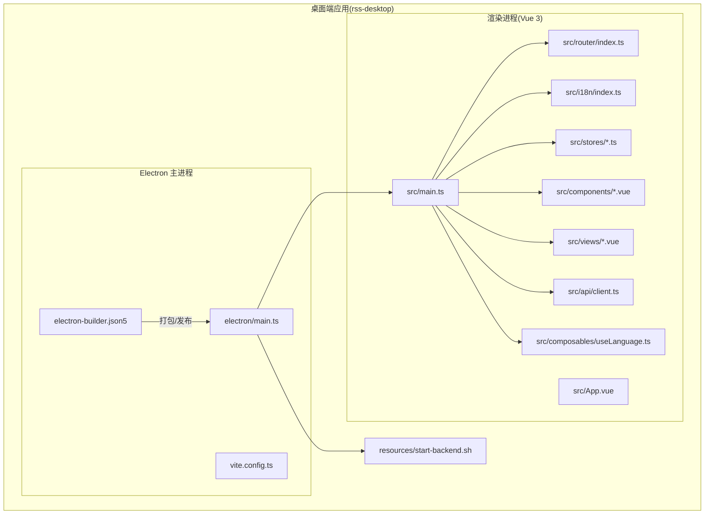
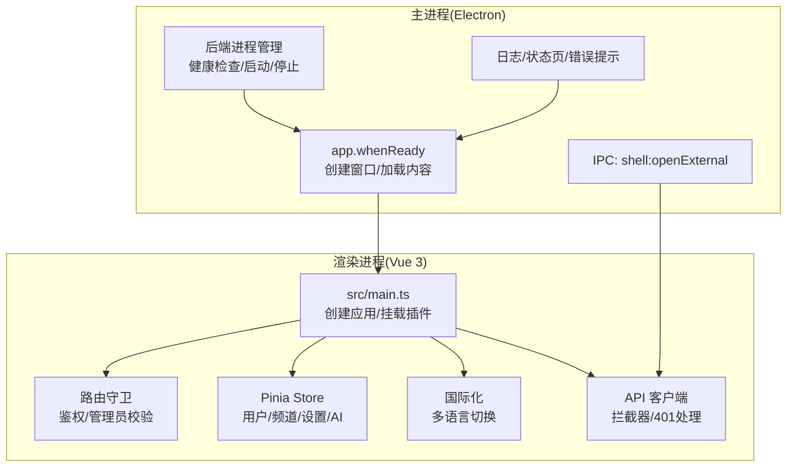
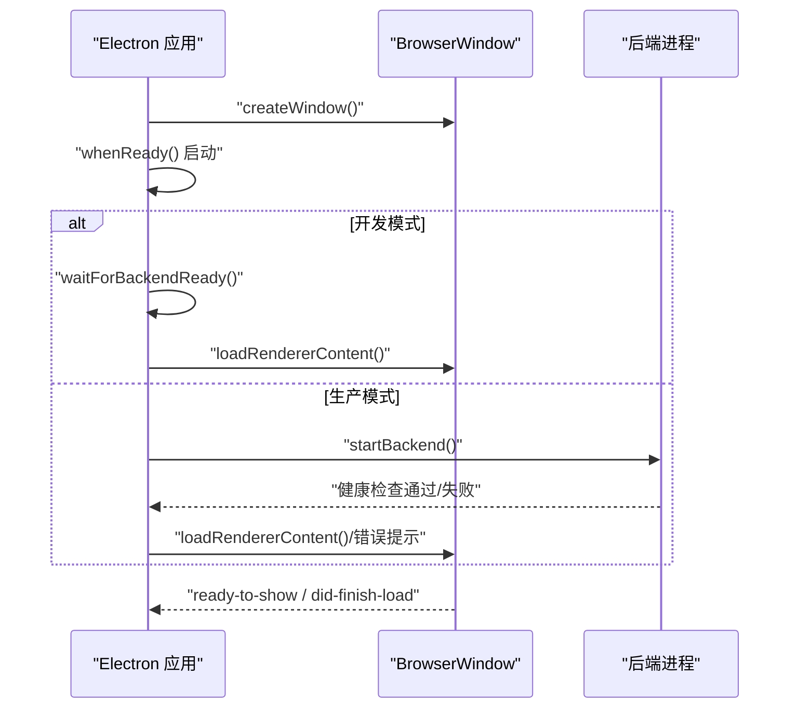
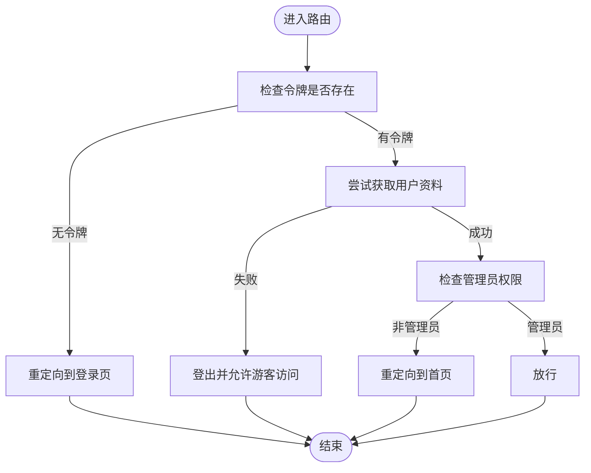
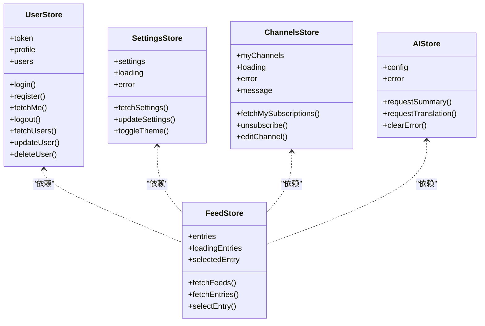
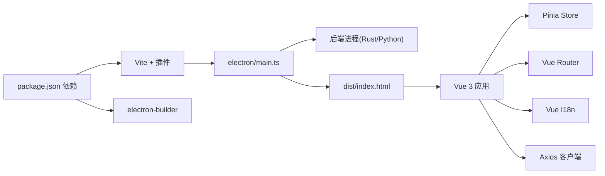
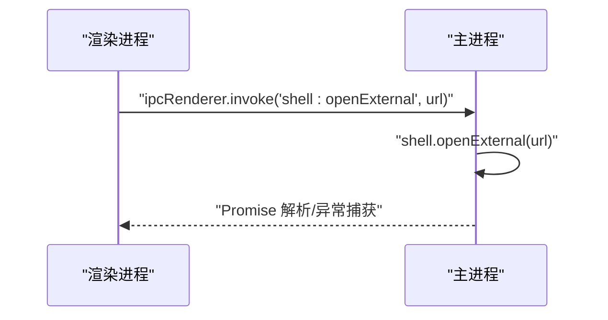
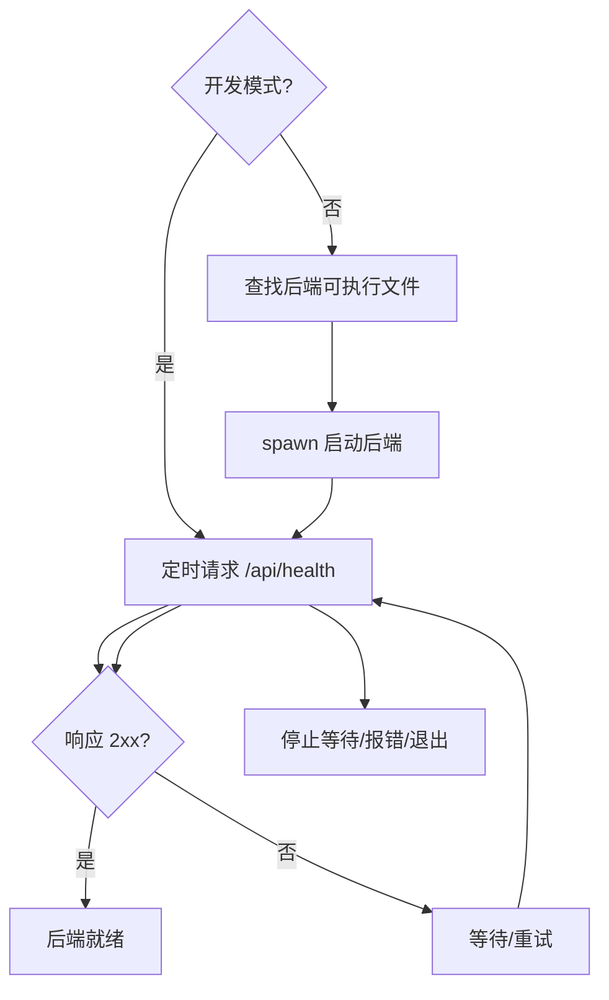

# 桌面端应用

<cite>
**本文档引用的文件**
- [package.json](file://rss-desktop/package.json)
- [main.ts](file://rss-desktop/electron/main.ts)
- [main.ts](file://rss-desktop/src/main.ts)
- [vite.config.ts](file://rss-desktop/vite.config.ts)
- [electron-builder.json5](file://rss-desktop/electron-builder.json5)
- [App.vue](file://rss-desktop/src/App.vue)
- [index.ts](file://rss-desktop/src/router/index.ts)
- [index.ts](file://rss-desktop/src/i18n/index.ts)
- [settingsStore.ts](file://rss-desktop/src/stores/settingsStore.ts)
- [AppSidebar.vue](file://rss-desktop/src/components/AppSidebar.vue)
- [client.ts](file://rss-desktop/src/api/client.ts)
- [userStore.ts](file://rss-desktop/src/stores/userStore.ts)
- [AppHome.vue](file://rss-desktop/src/views/AppHome.vue)
- [useLanguage.ts](file://rss-desktop/src/composables/useLanguage.ts)
- [start-backend.sh](file://rss-desktop/resources/start-backend.sh)
</cite>

## 目录
1. [简介](#简介)
2. [项目结构](#项目结构)
3. [核心组件](#核心组件)
4. [架构总览](#架构总览)
5. [详细组件分析](#详细组件分析)
6. [依赖关系分析](#依赖关系分析)
7. [性能考虑](#性能考虑)
8. [故障排查指南](#故障排查指南)
9. [结论](#结论)
10. [附录](#附录)

## 简介
本项目为 Tan RSS Reader 的桌面端应用，基于 Electron 与 Vue 3 技术栈构建，提供跨平台 RSS 阅读体验，并集成 AI 翻译与摘要功能。应用采用主进程负责系统级能力（窗口、菜单、托盘、后端进程管理等），渲染进程负责 UI 交互与业务逻辑；通过 IPC 实现主/渲染进程通信；借助 Pinia 管理全局状态，Vue Router 提供路由导航，Vue I18n 支持多语言，electron-builder 完成打包与发布。

## 项目结构
桌面端位于 rss-desktop 目录，主要分为：
- Electron 主进程与预加载脚本：electron/main.ts、vite.config.ts 中的 Electron 插件配置
- 渲染进程前端：src 下的 Vue 3 应用、路由、状态管理、国际化、组件与视图
- 构建与打包：package.json 脚本、electron-builder.json5、资源脚本 resources/start-backend.sh

**图表来源**
- [main.ts:1-548](file://rss-desktop/electron/main.ts#L1-L548)
- [vite.config.ts:1-55](file://rss-desktop/vite.config.ts#L1-L55)
- [electron-builder.json5:1-87](file://rss-desktop/electron-builder.json5#L1-L87)
- [main.ts:1-9](file://rss-desktop/src/main.ts#L1-L9)

**章节来源**
- [package.json:1-81](file://rss-desktop/package.json#L1-L81)
- [vite.config.ts:1-55](file://rss-desktop/vite.config.ts#L1-L55)
- [electron-builder.json5:1-87](file://rss-desktop/electron-builder.json5#L1-L87)

## 核心组件
- 主进程与窗口管理：负责创建 BrowserWindow、加载渲染内容、健康检查后端、IPC 处理、生命周期事件与日志记录
- 渲染进程入口：创建 Vue 应用，挂载 Pinia、路由与国际化插件
- 路由与鉴权：基于 meta 字段的鉴权守卫，支持游客与管理员访问控制
- 国际化：多语言配置与持久化，动态切换语言
- 状态管理：Pinia Store 管理用户、频道、订阅、设置、AI 等状态
- 组件体系：侧边栏、文章列表、阅读器、模态框、通知等
- API 客户端：Axios 封装，自动注入 Token，统一处理 401 未授权事件
- 构建与打包：Vite + Electron 插件，electron-builder 多平台产物

**章节来源**
- [main.ts:449-548](file://rss-desktop/electron/main.ts#L449-L548)
- [main.ts:1-9](file://rss-desktop/src/main.ts#L1-L9)
- [index.ts:50-74](file://rss-desktop/src/router/index.ts#L50-L74)
- [index.ts:1-35](file://rss-desktop/src/i18n/index.ts#L1-L35)
- [settingsStore.ts:1-202](file://rss-desktop/src/stores/settingsStore.ts#L1-L202)
- [App.vue:1-333](file://rss-desktop/src/App.vue#L1-L333)
- [client.ts:1-29](file://rss-desktop/src/api/client.ts#L1-L29)

## 架构总览
应用采用经典的 Electron 双进程架构：
- 主进程：管理应用生命周期、窗口、菜单、托盘、系统通知、后端进程（Python/Rust）、日志与 IPC
- 渲染进程：Vue 3 单页应用，组件化 UI、路由导航、状态管理、国际化与 API 交互

**图表来源**
- [main.ts:449-548](file://rss-desktop/electron/main.ts#L449-L548)
- [main.ts:1-9](file://rss-desktop/src/main.ts#L1-L9)
- [index.ts:50-74](file://rss-desktop/src/router/index.ts#L50-L74)
- [settingsStore.ts:1-202](file://rss-desktop/src/stores/settingsStore.ts#L1-L202)
- [client.ts:1-29](file://rss-desktop/src/api/client.ts#L1-L29)

## 详细组件分析

### 主进程与窗口管理
- 窗口创建：设置最小尺寸、图标、webPreferences（启用 webview、上下文隔离、禁用 Node 集成等）
- 启动流程：开发模式检测、启动内置后端（Rust 或外部 start.sh）、健康检查、加载渲染内容
- IPC：提供 shell:openExternal 用于在系统默认浏览器打开链接
- 生命周期：窗口关闭、激活、退出前/退出时的后端进程管理与日志路径更新

**图表来源**
- [main.ts:304-360](file://rss-desktop/electron/main.ts#L304-L360)
- [main.ts:449-506](file://rss-desktop/electron/main.ts#L449-L506)

**章节来源**
- [main.ts:1-548](file://rss-desktop/electron/main.ts#L1-L548)

### 渲染进程入口与插件装配
- 创建 Vue 应用，注册 Pinia、路由、国际化插件，挂载到 #app
- 作为全局入口，承载所有业务视图与组件

**章节来源**
- [main.ts:1-9](file://rss-desktop/src/main.ts#L1-L9)

### 路由与鉴权
- 路由表定义页面与元信息（requiresAuth、requiresAdmin）
- 全局前置守卫：校验令牌、拉取用户资料、管理员权限判断、重定向处理

**图表来源**
- [index.ts:50-74](file://rss-desktop/src/router/index.ts#L50-L74)

**章节来源**
- [index.ts:1-77](file://rss-desktop/src/router/index.ts#L1-L77)

### 国际化与主题切换
- 多语言：支持 zh-CN、en-US、ja-JP、ko-KR，持久化到 localStorage
- 主题：light/dark，切换时更新 documentElement 类名并持久化

**章节来源**
- [index.ts:1-35](file://rss-desktop/src/i18n/index.ts#L1-L35)
- [settingsStore.ts:1-202](file://rss-desktop/src/stores/settingsStore.ts#L1-L202)
- [useLanguage.ts:1-49](file://rss-desktop/src/composables/useLanguage.ts#L1-L49)

### 状态管理（Pinia）
- 用户：登录/注册/登出、用户资料、管理员操作
- 频道/订阅：订阅列表、频道详情、取消订阅、编辑
- 设置：应用设置、系统设置（管理员）、主题切换
- AI：摘要/翻译配置与缓存、标题翻译并发控制
- 通用：错误/消息通知、加载状态

**图表来源**
- [userStore.ts:1-143](file://rss-desktop/src/stores/userStore.ts#L1-L143)
- [settingsStore.ts:1-202](file://rss-desktop/src/stores/settingsStore.ts#L1-L202)
- [AppHome.vue:1-800](file://rss-desktop/src/views/AppHome.vue#L1-L800)

**章节来源**
- [userStore.ts:1-143](file://rss-desktop/src/stores/userStore.ts#L1-L143)
- [settingsStore.ts:1-202](file://rss-desktop/src/stores/settingsStore.ts#L1-L202)

### 组件体系与布局
- App.vue：全局布局、侧边栏拖拽、通知、模态框、路由视图容器
- AppSidebar.vue：品牌区、导航、订阅频道列表、用户菜单、上下文菜单
- 视图：首页、登录、频道、趋势、阅读器等页面
- 通用组件：加载、错误边界、Toast、模态框等

**章节来源**
- [App.vue:1-333](file://rss-desktop/src/App.vue#L1-L333)
- [AppSidebar.vue:1-800](file://rss-desktop/src/components/AppSidebar.vue#L1-L800)
- [AppHome.vue:1-800](file://rss-desktop/src/views/AppHome.vue#L1-L800)

### API 客户端与错误处理
- Axios 实例：自动注入 Authorization 头，统一处理 401 未授权事件
- 与主进程通信：通过 IPC 打开外部链接等系统行为

**章节来源**
- [client.ts:1-29](file://rss-desktop/src/api/client.ts#L1-L29)
- [main.ts:450-459](file://rss-desktop/electron/main.ts#L450-L459)

### 构建与打包
- Vite 配置：开发服务器、代理、Electron 插件（主进程/预加载）
- electron-builder：多平台产物（macOS dmg/arm64/x64、Windows nsis/portable、Linux AppImage/deb）
- 资源：额外拷贝后端可执行与启动脚本

**章节来源**
- [vite.config.ts:1-55](file://rss-desktop/vite.config.ts#L1-L55)
- [electron-builder.json5:1-87](file://rss-desktop/electron-builder.json5#L1-L87)
- [package.json:41-54](file://rss-desktop/package.json#L41-L54)

## 依赖关系分析
- 主进程依赖：Electron 核心 API、子进程管理、文件系统、日志
- 渲染进程依赖：Vue 3、Vue Router、Pinia、Vue I18n、Axios、第三方库（Chart.js、Day.js、DOMPurify 等）
- 构建工具：Vite、electron-plugin、electron-builder
- 后端：Python FastAPI（uvicorn）与 Rust 二进制（tan-backend）

**图表来源**
- [package.json:55-78](file://rss-desktop/package.json#L55-L78)
- [vite.config.ts:1-55](file://rss-desktop/vite.config.ts#L1-L55)
- [electron-builder.json5:1-87](file://rss-desktop/electron-builder.json5#L1-L87)
- [main.ts:1-548](file://rss-desktop/electron/main.ts#L1-L548)

**章节来源**
- [package.json:1-81](file://rss-desktop/package.json#L1-L81)

## 性能考虑
- 渲染性能
  - 虚拟滚动与分页：在大量条目场景下建议分页或虚拟化
  - 图标懒加载与缓存：已实现加载状态与错误处理，减少闪烁
  - 并发控制：标题翻译使用信号量限制并发，避免网络拥塞
- 状态与内存
  - Pinia Store 按模块拆分，避免单 Store 过大
  - 清理事件监听：组件卸载时移除监听器，防止内存泄漏
- 网络与缓存
  - API 请求拦截器统一处理 401，触发登出与提示
  - 缓存摘要/翻译结果，减少重复请求
- 主进程稳定性
  - 健康检查与超时控制，避免长时间阻塞
  - 后端进程优雅停止与强制终止兜底

[本节为通用指导，无需特定文件来源]

## 故障排查指南
- 后端未就绪
  - 现象：启动状态页提示后端未就绪
  - 排查：确认 start.sh 是否运行、端口占用、日志文件位置
- 401 未授权
  - 现象：全局拦截器触发未授权事件
  - 处理：触发登出与登录弹窗，检查 Token 存储
- 窗口加载失败
  - 现象：启动页或渲染页加载异常
  - 处理：检查 VITE_DEV_SERVER_URL、资源路径、preload 脚本
- 主题/语言不生效
  - 现象：切换主题或语言后未更新
  - 处理：确认 localStorage 写入、documentElement 类名、i18n 全局切换

**章节来源**
- [main.ts:461-506](file://rss-desktop/electron/main.ts#L461-L506)
- [client.ts:17-26](file://rss-desktop/src/api/client.ts#L17-L26)
- [settingsStore.ts:49-57](file://rss-desktop/src/stores/settingsStore.ts#L49-L57)
- [index.ts:32-34](file://rss-desktop/src/i18n/index.ts#L32-L34)

## 结论
本项目以 Electron + Vue 3 为基础，清晰划分主/渲染进程职责，通过 IPC 实现系统能力与 UI 的解耦；借助 Pinia、Vue Router、Vue I18n 构建现代化桌面应用；结合 electron-builder 实现跨平台打包与发布。整体架构具备良好的扩展性与可维护性，适合持续迭代 AI 翻译与摘要等增强功能。

## 附录

### IPC 通信示例
- 主进程注册 IPC 处理器：在系统默认浏览器打开链接
- 渲染进程调用：通过 ipcRenderer.invoke 调用

**图表来源**
- [main.ts:450-459](file://rss-desktop/electron/main.ts#L450-L459)

### 后端启动与健康检查
- 开发模式：检测开发服务器，等待 /api/health 就绪
- 生产模式：查找并启动 Rust 后端，健康检查超时与重试

**图表来源**
- [main.ts:93-132](file://rss-desktop/electron/main.ts#L93-L132)
- [main.ts:137-192](file://rss-desktop/electron/main.ts#L137-L192)
- [start-backend.sh:1-29](file://rss-desktop/resources/start-backend.sh#L1-L29)