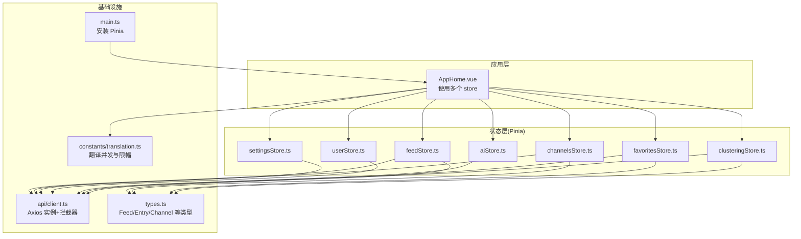
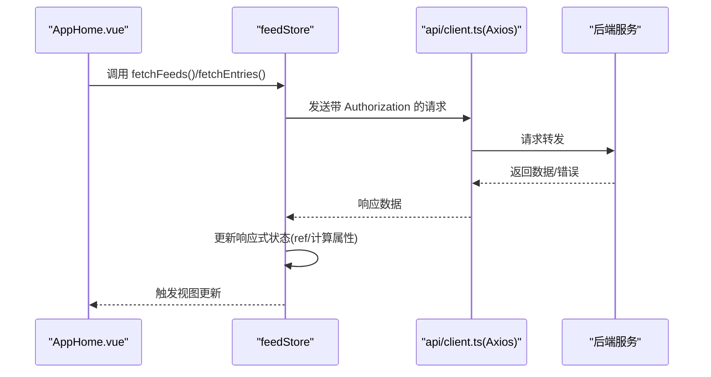
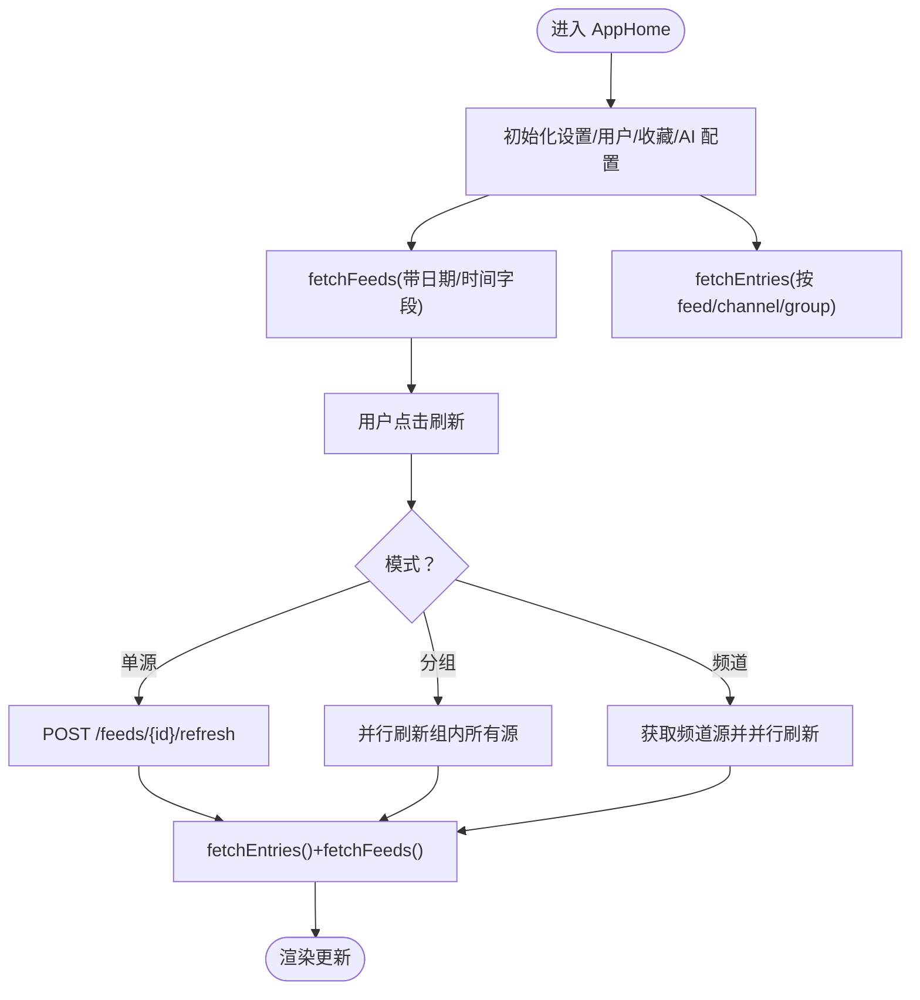
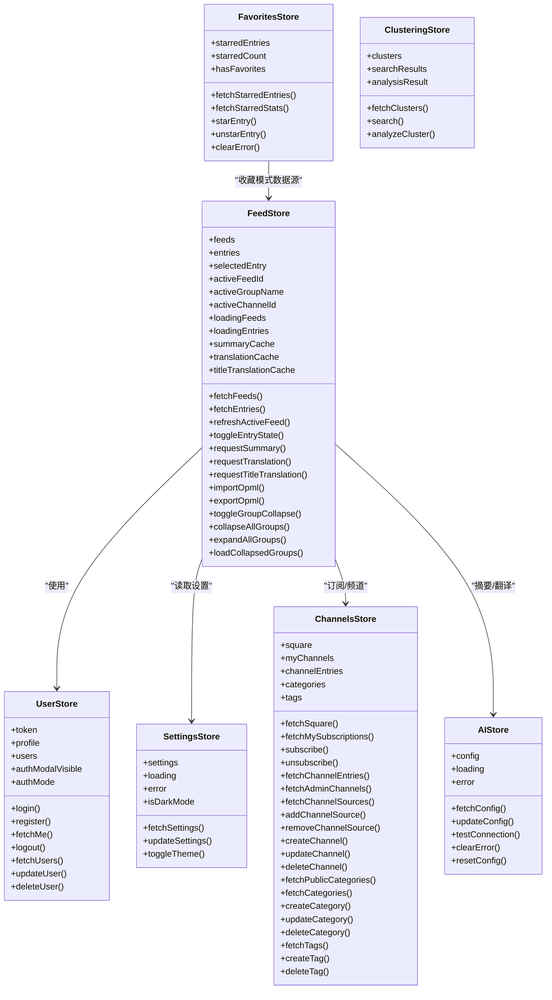
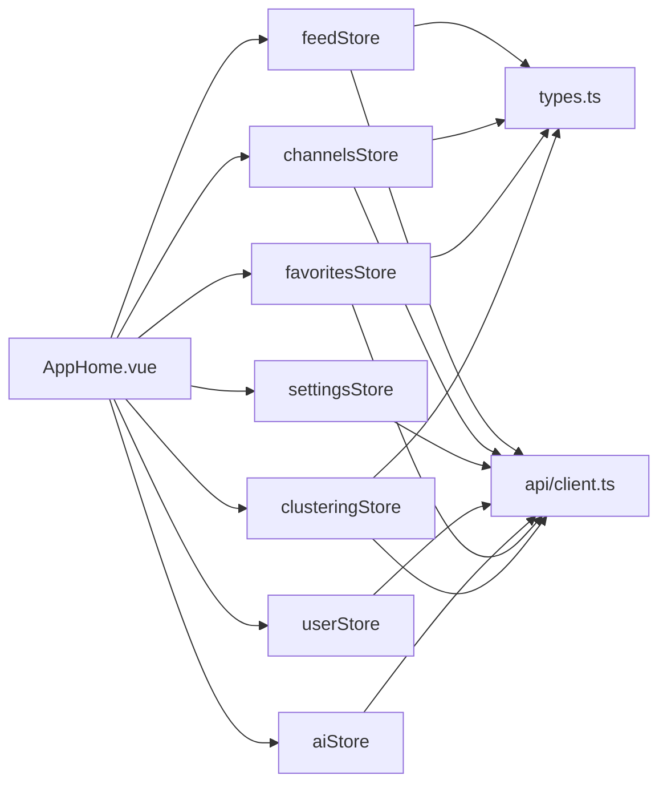

# 状态管理系统

<cite>
**本文引用的文件**
- [rss-desktop/src/main.ts](file://rss-desktop/src/main.ts)
- [rss-desktop/src/api/client.ts](file://rss-desktop/src/api/client.ts)
- [rss-desktop/src/stores/feedStore.ts](file://rss-desktop/src/stores/feedStore.ts)
- [rss-desktop/src/stores/channelsStore.ts](file://rss-desktop/src/stores/channelsStore.ts)
- [rss-desktop/src/stores/settingsStore.ts](file://rss-desktop/src/stores/settingsStore.ts)
- [rss-desktop/src/stores/userStore.ts](file://rss-desktop/src/stores/userStore.ts)
- [rss-desktop/src/stores/aiStore.ts](file://rss-desktop/src/stores/aiStore.ts)
- [rss-desktop/src/stores/favoritesStore.ts](file://rss-desktop/src/stores/favoritesStore.ts)
- [rss-desktop/src/stores/clusteringStore.ts](file://rss-desktop/src/stores/clusteringStore.ts)
- [rss-desktop/src/views/AppHome.vue](file://rss-desktop/src/views/AppHome.vue)
- [rss-desktop/src/types.ts](file://rss-desktop/src/types.ts)
- [rss-desktop/src/constants/translation.ts](file://rss-desktop/src/constants/translation.ts)
</cite>

## 目录
1. [简介](#简介)
2. [项目结构](#项目结构)
3. [核心组件](#核心组件)
4. [架构总览](#架构总览)
5. [详细组件分析](#详细组件分析)
6. [依赖关系分析](#依赖关系分析)
7. [性能考量](#性能考量)
8. [故障排查指南](#故障排查指南)
9. [结论](#结论)
10. [附录](#附录)

## 简介
本文件系统性梳理 Tan RSS Reader 的 Pinia 状态管理系统，覆盖状态管理模式、store 设计原则与模块化组织策略，详解状态定义、getter 计算与 action 方法的实现模式，阐述状态持久化、时间旅行调试与中间件集成思路，解释组合式 API 的使用、响应式状态与副作用处理，包含状态同步、并发控制与错误处理机制，并提供性能优化技巧、内存泄漏防护与开发工具使用建议。

## 项目结构
- 状态管理位于桌面端前端工程 rss-desktop 的 stores 目录，采用组合式 Store（setup-style）风格，围绕“订阅源/频道/条目/用户/设置/AI/收藏/聚类”等业务域划分模块。
- 入口在 main.ts 中安装 Pinia，各页面通过组合式 API 在组件中使用对应 store。
- API 客户端封装在 api/client.ts，统一注入鉴权头与处理 401 未授权事件。

图表来源
- [rss-desktop/src/main.ts:1-9](file://rss-desktop/src/main.ts#L1-L9)
- [rss-desktop/src/api/client.ts:1-29](file://rss-desktop/src/api/client.ts#L1-L29)
- [rss-desktop/src/stores/feedStore.ts:1-642](file://rss-desktop/src/stores/feedStore.ts#L1-L642)
- [rss-desktop/src/stores/channelsStore.ts:1-363](file://rss-desktop/src/stores/channelsStore.ts#L1-L363)
- [rss-desktop/src/stores/settingsStore.ts:1-202](file://rss-desktop/src/stores/settingsStore.ts#L1-L202)
- [rss-desktop/src/stores/userStore.ts:1-143](file://rss-desktop/src/stores/userStore.ts#L1-L143)
- [rss-desktop/src/stores/aiStore.ts:1-156](file://rss-desktop/src/stores/aiStore.ts#L1-L156)
- [rss-desktop/src/stores/favoritesStore.ts:1-70](file://rss-desktop/src/stores/favoritesStore.ts#L1-L70)
- [rss-desktop/src/stores/clusteringStore.ts:1-109](file://rss-desktop/src/stores/clusteringStore.ts#L1-L109)
- [rss-desktop/src/views/AppHome.vue:1-1112](file://rss-desktop/src/views/AppHome.vue#L1-L1112)
- [rss-desktop/src/types.ts:1-54](file://rss-desktop/src/types.ts#L1-L54)
- [rss-desktop/src/constants/translation.ts:1-65](file://rss-desktop/src/constants/translation.ts#L1-L65)

章节来源
- [rss-desktop/src/main.ts:1-9](file://rss-desktop/src/main.ts#L1-L9)
- [rss-desktop/src/api/client.ts:1-29](file://rss-desktop/src/api/client.ts#L1-L29)

## 核心组件
- feedStore：订阅源与条目主数据流，负责分组、筛选、刷新、缓存与翻译摘要等。
- channelsStore：频道与分类/标签管理，支持订阅/取消订阅、频道源管理与公共频道广场。
- settingsStore：应用设置与主题持久化，支持系统设置与用户偏好合并。
- userStore：用户认证与会话管理，支持登录/注册/登出与用户列表。
- aiStore：AI 配置与连通性测试，支持摘要/翻译服务配置。
- favoritesStore：收藏条目与统计，支持收藏增删与懒加载。
- clusteringStore：向量聚类、搜索与分析结果展示。

章节来源
- [rss-desktop/src/stores/feedStore.ts:1-642](file://rss-desktop/src/stores/feedStore.ts#L1-L642)
- [rss-desktop/src/stores/channelsStore.ts:1-363](file://rss-desktop/src/stores/channelsStore.ts#L1-L363)
- [rss-desktop/src/stores/settingsStore.ts:1-202](file://rss-desktop/src/stores/settingsStore.ts#L1-L202)
- [rss-desktop/src/stores/userStore.ts:1-143](file://rss-desktop/src/stores/userStore.ts#L1-L143)
- [rss-desktop/src/stores/aiStore.ts:1-156](file://rss-desktop/src/stores/aiStore.ts#L1-L156)
- [rss-desktop/src/stores/favoritesStore.ts:1-70](file://rss-desktop/src/stores/favoritesStore.ts#L1-L70)
- [rss-desktop/src/stores/clusteringStore.ts:1-109](file://rss-desktop/src/stores/clusteringStore.ts#L1-L109)

## 架构总览
- 状态管理模式：采用组合式 Store，以 ref/readonly/ref 包装状态，以函数形式暴露 actions，配合 computed 实现派生状态。
- 模块化组织：按业务域拆分 store，彼此通过 API 客户端与类型系统协作，避免强耦合。
- 响应式与副作用：在组件中通过 watch/computed 触发 store 的异步动作，store 内部通过 ref 控制 loading/error 状态，API 调用通过 axios 拦截器统一处理鉴权与未授权事件。
- 数据持久化：settingsStore 与 feedStore 使用 localStorage 存储主题、布局、分组折叠等偏好；用户令牌存储在 localStorage；AI 配置与设置通过后端接口持久化。
- 中间件集成：通过 axios 拦截器实现请求/响应中间件，集中处理鉴权头与 401 未授权事件，供所有 store 的 API 调用共享。

图表来源
- [rss-desktop/src/views/AppHome.vue:637-644](file://rss-desktop/src/views/AppHome.vue#L637-L644)
- [rss-desktop/src/stores/feedStore.ts:75-106](file://rss-desktop/src/stores/feedStore.ts#L75-L106)
- [rss-desktop/src/api/client.ts:8-26](file://rss-desktop/src/api/client.ts#L8-L26)

## 详细组件分析

### feedStore：订阅与条目主状态
- 状态定义：feeds/adminFeeds/entries/selectedEntry/activeFeedId/activeGroupName/activeChannelId/loadingFeeds/loadingEntries/addingFeed/refreshingGroup/summaryCache/translationCache/titleTranslationCache/errorMessage/collapsedGroups/lastFeedFilters/lastEntryFilters/userStore。
- 计算属性：groupedFeeds/groupStats/sortedGroupNames/selectedEntry。
- Action 模式：
  - 列表加载：fetchFeeds/fetchEntries，支持日期范围、时间字段、未读过滤与分组/频道/订阅源多维度选择。
  - 刷新：refreshActiveFeed，支持单源、分组、频道三种模式的并行刷新。
  - 条目状态切换：toggleEntryState，原子更新条目 read/starred 并联动 feed 未读计数。
  - AI 相关：requestSummary/requestTranslation/requestTitleTranslation，带缓存与超时控制。
  - OPML 导入导出：importOpml/exportOpml。
  - 分组折叠：toggleGroupCollapse/isGroupCollapsed/expandAllGroups/collapseAllGroups/loadCollapsedGroups，基于 localStorage。
- 错误处理：统一设置 errorMessage，组件层通过 watch 监听并提示。
- 性能要点：Promise.allSettled 并行刷新；缓存摘要/翻译/标题翻译；防抖过滤器应用；后台短周期同步仅刷新计数。

图表来源
- [rss-desktop/src/views/AppHome.vue:613-644](file://rss-desktop/src/views/AppHome.vue#L613-L644)
- [rss-desktop/src/stores/feedStore.ts:210-292](file://rss-desktop/src/stores/feedStore.ts#L210-L292)

章节来源
- [rss-desktop/src/stores/feedStore.ts:1-642](file://rss-desktop/src/stores/feedStore.ts#L1-L642)
- [rss-desktop/src/views/AppHome.vue:1-1112](file://rss-desktop/src/views/AppHome.vue#L1-L1112)

### channelsStore：频道与分类/标签管理
- 状态：square/myChannels/channelEntries/activeChannelId/loading/error/message/adminChannels/channelSources/categories/tags/showChannelSquareModal。
- 功能：公共频道广场、我的订阅、订阅/取消订阅、频道源管理（增删）、频道 CRUD、分类/标签 CRUD。
- 错误处理：统一设置 error，组件层 watch 提示。
- UI 状态：showChannelSquareModal 控制弹窗显示。

章节来源
- [rss-desktop/src/stores/channelsStore.ts:1-363](file://rss-desktop/src/stores/channelsStore.ts#L1-L363)

### settingsStore：应用设置与主题持久化
- 状态：settings/loading/error，settings 包含拉取间隔、分页、日期过滤、默认时间字段、摘要显示、翻译显示模式、品牌开关、主题等。
- 行为：fetchSettings 合并本地与系统设置；updateSettings 乐观更新本地并按需调用后端；toggleTheme 切换主题并写入 DOM。
- 持久化：localStorage 存储主题、翻译显示模式、品牌开关、摘要显示、日期过滤、默认日期范围；系统设置通过后端接口合并。

章节来源
- [rss-desktop/src/stores/settingsStore.ts:1-202](file://rss-desktop/src/stores/settingsStore.ts#L1-L202)

### userStore：认证与会话管理
- 状态：token/profile/users/loading/error，以及 authModalVisible/authMode。
- 行为：login/register/fetchMe/logout；管理员用户管理（fetchUsers/updateUser/deleteUser）。
- 与 API：通过 axios 拦截器自动附加 Authorization 头；401 触发自定义事件供应用层处理登出。

章节来源
- [rss-desktop/src/stores/userStore.ts:1-143](file://rss-desktop/src/stores/userStore.ts#L1-L143)
- [rss-desktop/src/api/client.ts:1-29](file://rss-desktop/src/api/client.ts#L1-L29)

### aiStore：AI 配置与连通性测试
- 状态：config/loading/error，config 包括摘要/翻译服务配置与特性开关。
- 行为：fetchConfig/updateConfig/testConnection/resetConfig/clearError。
- 错误处理：统一设置 error，组件层 watch 提示。

章节来源
- [rss-desktop/src/stores/aiStore.ts:1-156](file://rss-desktop/src/stores/aiStore.ts#L1-L156)

### favoritesStore：收藏管理
- 状态：starredEntries/starredCount/loading/error，hasFavorites 计算属性。
- 行为：fetchStarredEntries/fetchStarredStats/starEntry/unstarEntry/clearError。
- 与 feedStore：收藏模式下切换数据源，保持 UI 一致性。

章节来源
- [rss-desktop/src/stores/favoritesStore.ts:1-70](file://rss-desktop/src/stores/favoritesStore.ts#L1-L70)

### clusteringStore：向量聚类与搜索
- 状态：clusters/searchResults/analysisResult/loading/error。
- 行为：fetchClusters/search/analyzeCluster。
- 与 feedStore：可结合条目 ID 列表进行分析。

章节来源
- [rss-desktop/src/stores/clusteringStore.ts:1-109](file://rss-desktop/src/stores/clusteringStore.ts#L1-L109)

### 类图：核心 Store 关系

图表来源
- [rss-desktop/src/stores/feedStore.ts:1-642](file://rss-desktop/src/stores/feedStore.ts#L1-L642)
- [rss-desktop/src/stores/channelsStore.ts:1-363](file://rss-desktop/src/stores/channelsStore.ts#L1-L363)
- [rss-desktop/src/stores/settingsStore.ts:1-202](file://rss-desktop/src/stores/settingsStore.ts#L1-L202)
- [rss-desktop/src/stores/userStore.ts:1-143](file://rss-desktop/src/stores/userStore.ts#L1-L143)
- [rss-desktop/src/stores/aiStore.ts:1-156](file://rss-desktop/src/stores/aiStore.ts#L1-L156)
- [rss-desktop/src/stores/favoritesStore.ts:1-70](file://rss-desktop/src/stores/favoritesStore.ts#L1-L70)
- [rss-desktop/src/stores/clusteringStore.ts:1-109](file://rss-desktop/src/stores/clusteringStore.ts#L1-L109)

## 依赖关系分析
- 组件对 store 的依赖：AppHome.vue 统一注入并使用 feedStore、channelsStore、settingsStore、userStore、aiStore、favoritesStore、clusteringStore。
- store 对外部的依赖：均通过 api/client.ts 发起请求；feedStore 与 channelsStore 互相协作（订阅/频道联动）；settingsStore 影响 feedStore 的筛选与刷新行为。
- 类型依赖：types.ts 定义 Feed/Entry/ChannelSourceItem 等核心类型，被多个 store 与组件复用。

图表来源
- [rss-desktop/src/views/AppHome.vue:1-1112](file://rss-desktop/src/views/AppHome.vue#L1-L1112)
- [rss-desktop/src/stores/feedStore.ts:1-642](file://rss-desktop/src/stores/feedStore.ts#L1-L642)
- [rss-desktop/src/stores/channelsStore.ts:1-363](file://rss-desktop/src/stores/channelsStore.ts#L1-L363)
- [rss-desktop/src/stores/settingsStore.ts:1-202](file://rss-desktop/src/stores/settingsStore.ts#L1-L202)
- [rss-desktop/src/stores/userStore.ts:1-143](file://rss-desktop/src/stores/userStore.ts#L1-L143)
- [rss-desktop/src/stores/aiStore.ts:1-156](file://rss-desktop/src/stores/aiStore.ts#L1-L156)
- [rss-desktop/src/stores/favoritesStore.ts:1-70](file://rss-desktop/src/stores/favoritesStore.ts#L1-L70)
- [rss-desktop/src/stores/clusteringStore.ts:1-109](file://rss-desktop/src/stores/clusteringStore.ts#L1-L109)
- [rss-desktop/src/api/client.ts:1-29](file://rss-desktop/src/api/client.ts#L1-L29)
- [rss-desktop/src/types.ts:1-54](file://rss-desktop/src/types.ts#L1-L54)

章节来源
- [rss-desktop/src/views/AppHome.vue:1-1112](file://rss-desktop/src/views/AppHome.vue#L1-L1112)
- [rss-desktop/src/stores/feedStore.ts:1-642](file://rss-desktop/src/stores/feedStore.ts#L1-L642)
- [rss-desktop/src/stores/channelsStore.ts:1-363](file://rss-desktop/src/stores/channelsStore.ts#L1-L363)
- [rss-desktop/src/stores/settingsStore.ts:1-202](file://rss-desktop/src/stores/settingsStore.ts#L1-L202)
- [rss-desktop/src/stores/userStore.ts:1-143](file://rss-desktop/src/stores/userStore.ts#L1-L143)
- [rss-desktop/src/stores/aiStore.ts:1-156](file://rss-desktop/src/stores/aiStore.ts#L1-L156)
- [rss-desktop/src/stores/favoritesStore.ts:1-70](file://rss-desktop/src/stores/favoritesStore.ts#L1-L70)
- [rss-desktop/src/stores/clusteringStore.ts:1-109](file://rss-desktop/src/stores/clusteringStore.ts#L1-L109)
- [rss-desktop/src/api/client.ts:1-29](file://rss-desktop/src/api/client.ts#L1-L29)
- [rss-desktop/src/types.ts:1-54](file://rss-desktop/src/types.ts#L1-L54)

## 性能考量
- 并发控制
  - 标题翻译并发：通过信号量与队列控制最大并发，避免网络拥塞与资源争用；并发数来自 settingsStore 的用户设置，必要时回退到默认值。
  - 分组刷新：使用 Promise.allSettled 并行刷新组内所有订阅源，提升吞吐并保证失败不影响整体流程。
- 缓存策略
  - 摘要/翻译/标题翻译缓存：以 entryId 为键，减少重复请求与网络开销。
- 防抖与节流
  - 过滤器应用使用防抖，降低频繁请求带来的压力。
- 后台同步
  - 页面不可见时降低同步频率，聚焦时进行全量同步，平衡实时性与性能。
- 本地持久化
  - 主题、布局、分组折叠、翻译显示模式等偏好使用 localStorage，减少每次启动的网络请求。
- 类型与响应式
  - 使用 computed 与 ref 精准追踪依赖，避免不必要的重渲染；合理拆分 store，降低单一 store 的状态规模。

章节来源
- [rss-desktop/src/views/AppHome.vue:130-169](file://rss-desktop/src/views/AppHome.vue#L130-L169)
- [rss-desktop/src/views/AppHome.vue:210-284](file://rss-desktop/src/views/AppHome.vue#L210-L284)
- [rss-desktop/src/stores/feedStore.ts:222-252](file://rss-desktop/src/stores/feedStore.ts#L222-L252)
- [rss-desktop/src/stores/feedStore.ts:448-505](file://rss-desktop/src/stores/feedStore.ts#L448-L505)
- [rss-desktop/src/constants/translation.ts:1-65](file://rss-desktop/src/constants/translation.ts#L1-L65)

## 故障排查指南
- 401 未授权
  - 现象：触发自定义 auth:unauthorized 事件，应用层应处理登出与重定向。
  - 处理：在应用根组件监听该事件并清理本地状态。
- 设置更新失败
  - 现象：updateSettings 对系统设置失败时会回滚状态并提示“无权修改系统设置”。
  - 处理：确认用户角色权限，或仅更新用户偏好设置。
- 刷新失败
  - 现象：分组/频道刷新使用 Promise.allSettled，个别失败不影响整体；日志输出失败源。
  - 处理：检查网络与后端服务状态，必要时单独重试。
- 翻译/摘要失败
  - 现象：AI 配置缺失或后端异常导致失败；aiStore 设置 error。
  - 处理：先执行 testConnection，完善配置后再重试。
- 收藏加载失败
  - 现象：favoritesStore 抛错并设置 error，组件层 watch 提示。
  - 处理：重试或检查后端收藏接口。

章节来源
- [rss-desktop/src/api/client.ts:17-26](file://rss-desktop/src/api/client.ts#L17-L26)
- [rss-desktop/src/stores/settingsStore.ts:164-178](file://rss-desktop/src/stores/settingsStore.ts#L164-L178)
- [rss-desktop/src/stores/feedStore.ts:222-252](file://rss-desktop/src/stores/feedStore.ts#L222-L252)
- [rss-desktop/src/stores/aiStore.ts:102-135](file://rss-desktop/src/stores/aiStore.ts#L102-L135)
- [rss-desktop/src/stores/favoritesStore.ts:23-28](file://rss-desktop/src/stores/favoritesStore.ts#L23-L28)

## 结论
Tan RSS Reader 的 Pinia 状态管理以组合式 Store 为核心，围绕订阅源/频道/条目/用户/设置/AI/收藏/聚类等业务域进行模块化组织。通过 axios 拦截器实现统一鉴权与未授权处理，借助 computed/ref 实现高效响应式更新，配合缓存、并发控制与后台同步策略，在保证用户体验的同时兼顾性能与可维护性。建议后续引入时间旅行调试与持久化插件，进一步增强开发体验与问题定位能力。

## 附录
- 开发工具建议
  - Vue DevTools：监控响应式状态与组件树。
  - Pinia Devtools：查看 store 注册、状态快照与变更历史。
  - 浏览器 Network 面板：观察请求/响应与拦截器行为。
  - 日志与错误边界：在组件层增加错误边界与通知，提升可观测性。
- 最佳实践
  - 将 UI 状态与业务状态分离，避免混杂。
  - 使用 computed 精准依赖，减少重渲染。
  - 对高频异步操作使用防抖/节流与缓存。
  - 严格区分用户偏好与系统设置，避免越权更新。
  - 在 store 中统一错误处理与提示，组件层专注展示。