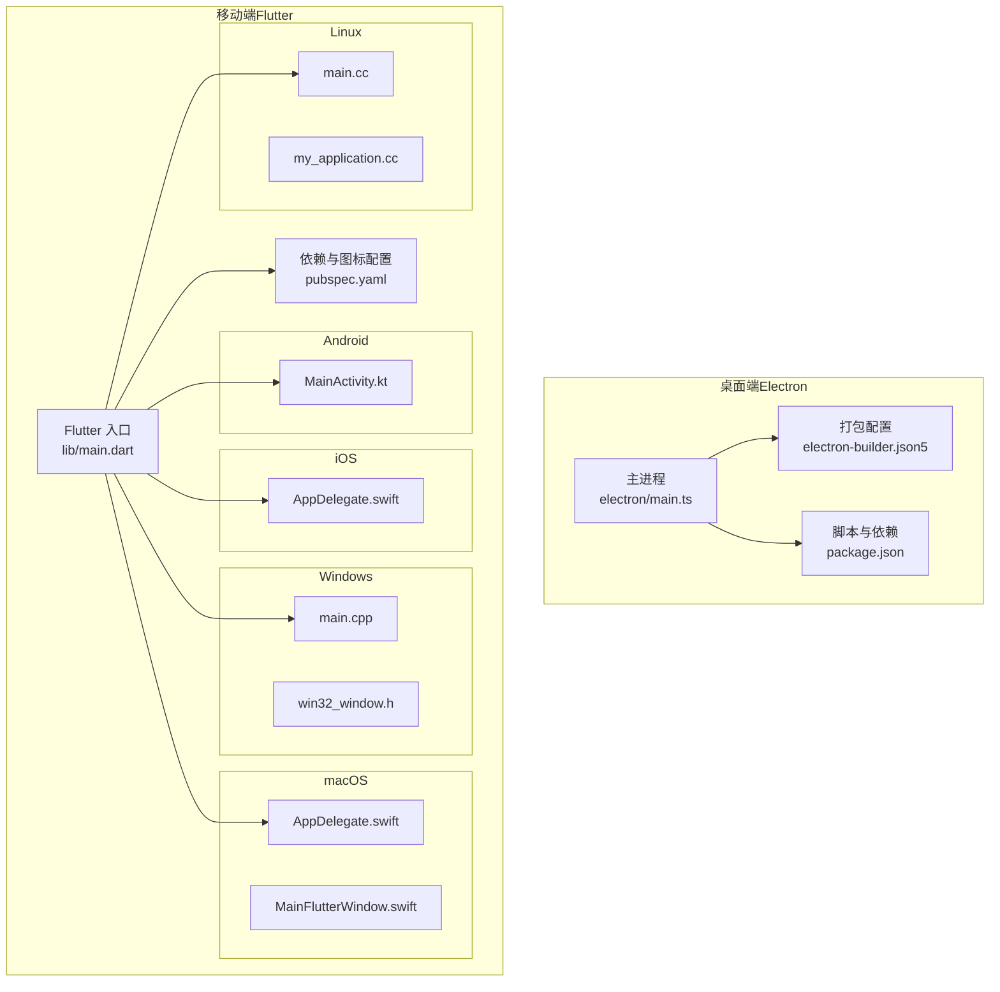
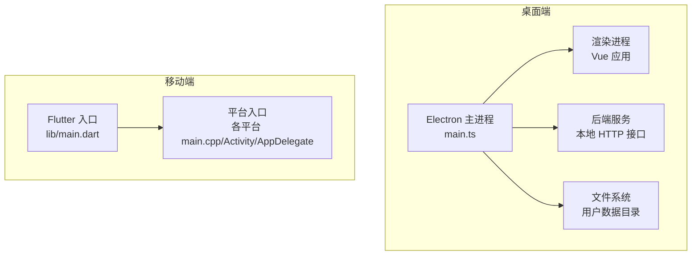
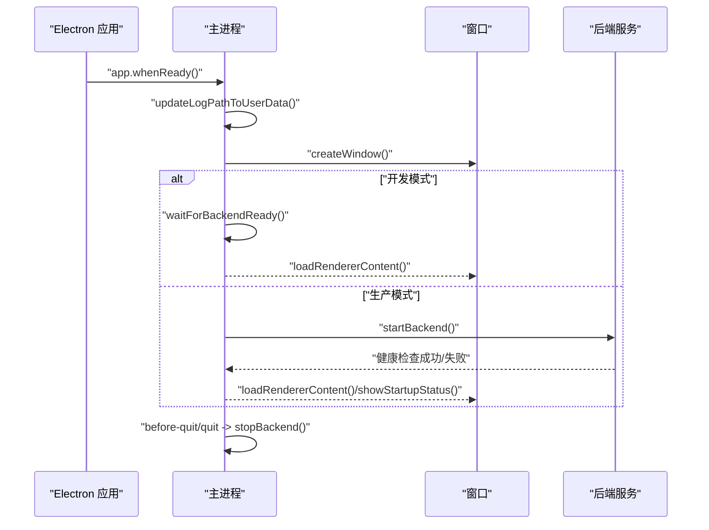
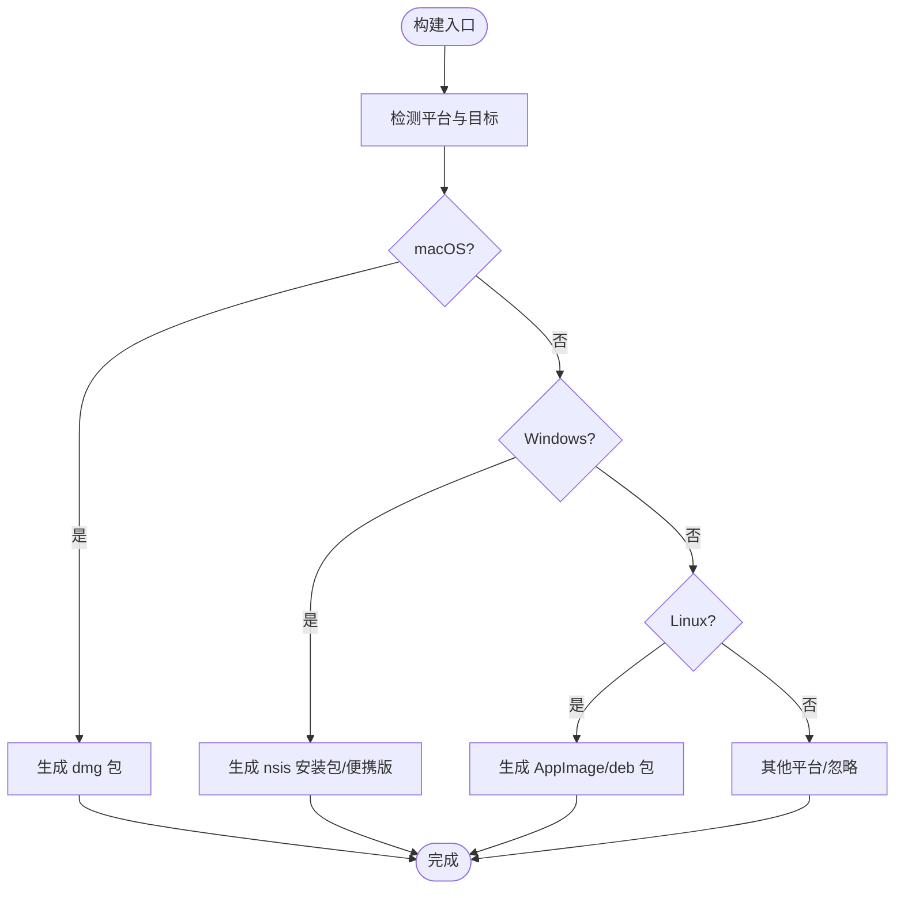
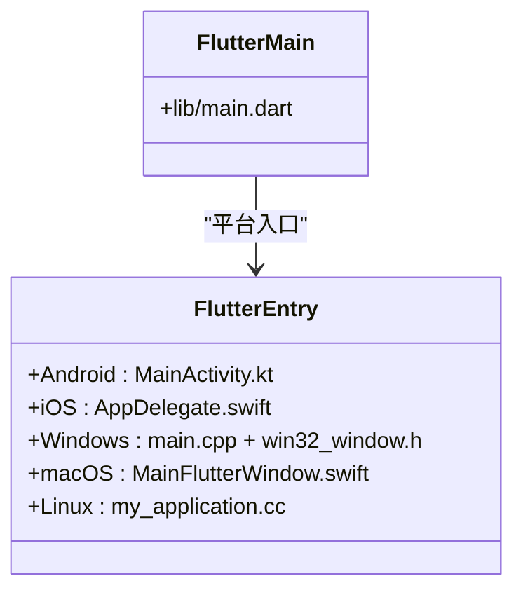
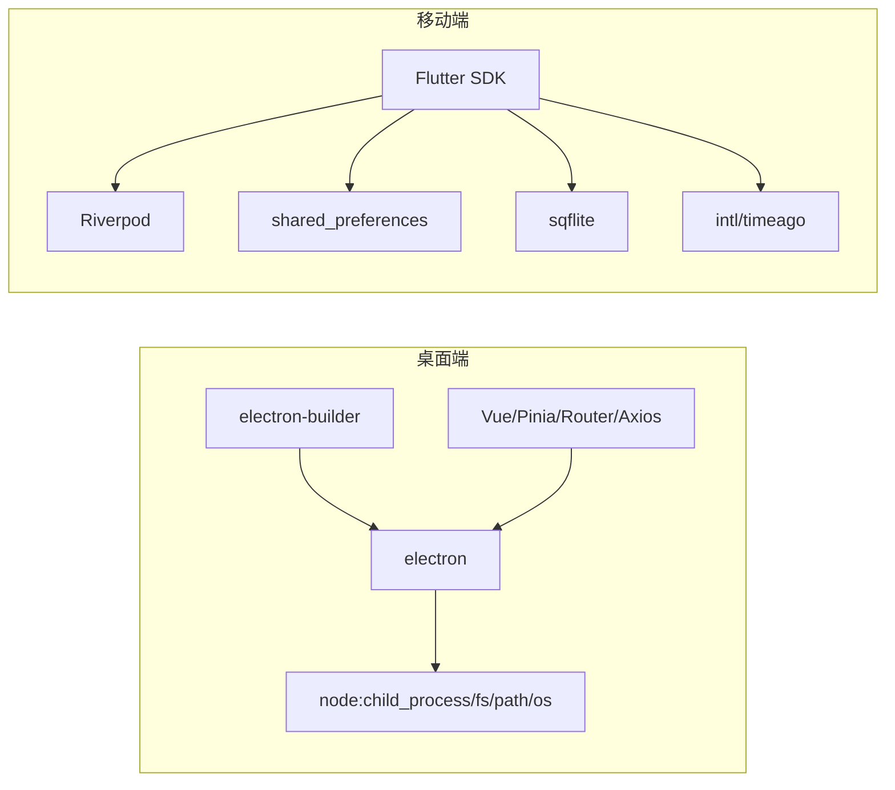

# 跨平台适配与优化

<cite>
**本文引用的文件**
- [rss-desktop/electron/main.ts](file://rss-desktop/electron/main.ts)
- [rss-desktop/package.json](file://rss-desktop/package.json)
- [rss-desktop/electron-builder.json5](file://rss-desktop/electron-builder.json5)
- [tan_rss_mobile/lib/main.dart](file://tan_rss_mobile/lib/main.dart)
- [tan_rss_mobile/pubspec.yaml](file://tan_rss_mobile/pubspec.yaml)
- [tan_rss_mobile/macos/Runner/AppDelegate.swift](file://tan_rss_mobile/macos/Runner/AppDelegate.swift)
- [tan_rss_mobile/macos/Runner/MainFlutterWindow.swift](file://tan_rss_mobile/macos/Runner/MainFlutterWindow.swift)
- [tan_rss_mobile/windows/runner/main.cpp](file://tan_rss_mobile/windows/runner/main.cpp)
- [tan_rss_mobile/windows/runner/win32_window.h](file://tan_rss_mobile/windows/runner/win32_window.h)
- [tan_rss_mobile/linux/runner/main.cc](file://tan_rss_mobile/linux/runner/main.cc)
- [tan_rss_mobile/linux/runner/my_application.cc](file://tan_rss_mobile/linux/runner/my_application.cc)
- [tan_rss_mobile/android/app/src/main/kotlin/com/chronoai/tanrss/tan_rss_mobile/MainActivity.kt](file://tan_rss_mobile/android/app/src/main/kotlin/com/chronoai/tanrss/tan_rss_mobile/MainActivity.kt)
- [tan_rss_mobile/ios/Runner/AppDelegate.swift](file://tan_rss_mobile/ios/Runner/AppDelegate.swift)
</cite>

## 目录
1. [简介](#简介)
2. [项目结构](#项目结构)
3. [核心组件](#核心组件)
4. [架构总览](#架构总览)
5. [详细组件分析](#详细组件分析)
6. [依赖关系分析](#依赖关系分析)
7. [性能考虑](#性能考虑)
8. [故障排查指南](#故障排查指南)
9. [结论](#结论)
10. [附录](#附录)

## 简介
本文件面向 Tan RSS Reader 的跨平台适配与优化，系统梳理 Windows、macOS、Linux 平台的特性与适配策略，覆盖原生菜单集成、系统托盘、Dock 图标与通知中心、窗口管理、快捷键绑定、文件关联、文件系统访问与权限管理、应用图标与启动体验、以及平台特定的性能优化与崩溃处理方案。文档同时给出架构图、序列图与流程图，帮助读者快速理解各平台实现要点。

## 项目结构
Tan RSS Reader 采用多端并行架构：
- 桌面端（Electron + Vue）：位于 rss-desktop，负责桌面应用的主进程与渲染进程、打包与分发。
- 移动端（Flutter）：位于 tan_rss_mobile，分别针对 Android、iOS、Windows、macOS、Linux 提供平台入口与适配。

图表来源
- [rss-desktop/electron/main.ts:1-548](file://rss-desktop/electron/main.ts#L1-L548)
- [rss-desktop/electron-builder.json5:1-87](file://rss-desktop/electron-builder.json5#L1-L87)
- [rss-desktop/package.json:1-81](file://rss-desktop/package.json#L1-L81)
- [tan_rss_mobile/lib/main.dart:1-153](file://tan_rss_mobile/lib/main.dart#L1-L153)
- [tan_rss_mobile/pubspec.yaml:1-112](file://tan_rss_mobile/pubspec.yaml#L1-L112)
- [tan_rss_mobile/android/app/src/main/kotlin/com/chronoai/tanrss/tan_rss_mobile/MainActivity.kt:1-6](file://tan_rss_mobile/android/app/src/main/kotlin/com/chronoai/tanrss/tan_rss_mobile/MainActivity.kt#L1-L6)
- [tan_rss_mobile/ios/Runner/AppDelegate.swift:1-17](file://tan_rss_mobile/ios/Runner/AppDelegate.swift#L1-L17)
- [tan_rss_mobile/windows/runner/main.cpp:1-44](file://tan_rss_mobile/windows/runner/main.cpp#L1-L44)
- [tan_rss_mobile/windows/runner/win32_window.h:1-103](file://tan_rss_mobile/windows/runner/win32_window.h#L1-L103)
- [tan_rss_mobile/macos/Runner/AppDelegate.swift:1-14](file://tan_rss_mobile/macos/Runner/AppDelegate.swift#L1-L14)
- [tan_rss_mobile/macos/Runner/MainFlutterWindow.swift:1-16](file://tan_rss_mobile/macos/Runner/MainFlutterWindow.swift#L1-L16)
- [tan_rss_mobile/linux/runner/main.cc:1-7](file://tan_rss_mobile/linux/runner/main.cc#L1-L7)
- [tan_rss_mobile/linux/runner/my_application.cc:1-149](file://tan_rss_mobile/linux/runner/my_application.cc#L1-L149)

章节来源
- [rss-desktop/electron/main.ts:1-548](file://rss-desktop/electron/main.ts#L1-L548)
- [rss-desktop/electron-builder.json5:1-87](file://rss-desktop/electron-builder.json5#L1-L87)
- [rss-desktop/package.json:1-81](file://rss-desktop/package.json#L1-L81)
- [tan_rss_mobile/lib/main.dart:1-153](file://tan_rss_mobile/lib/main.dart#L1-L153)
- [tan_rss_mobile/pubspec.yaml:1-112](file://tan_rss_mobile/pubspec.yaml#L1-L112)

## 核心组件
- 桌面端 Electron 主进程：负责窗口生命周期、后端服务启动与健康检查、日志与错误处理、开发/生产模式差异、IPC 通信等。
- 桌面端打包配置：electron-builder 定义产物类型（DMG、NSIS、AppImage、DEB）、图标、额外资源、目标架构与安装行为。
- 移动端 Flutter 入口：统一主题、语言与时区、认证状态恢复、路由与页面组织。
- 各平台入口与窗口抽象：Android/iOS 使用 Flutter 默认 Activity/Controller；Windows/Linux/macOS 分别通过各自原生入口与窗口类实现。

章节来源
- [rss-desktop/electron/main.ts:449-548](file://rss-desktop/electron/main.ts#L449-L548)
- [rss-desktop/electron-builder.json5:1-87](file://rss-desktop/electron-builder.json5#L1-L87)
- [tan_rss_mobile/lib/main.dart:40-153](file://tan_rss_mobile/lib/main.dart#L40-L153)

## 架构总览
桌面端采用“主进程 + 渲染进程 + 内嵌后端”的架构。主进程负责窗口创建、后端进程管理、健康检查与错误上报；渲染进程承载前端界面；后端通过本地 HTTP 接口提供数据与功能。移动端以 Flutter 为核心，按平台入口组织，共享业务逻辑与 UI 组件。

图表来源
- [rss-desktop/electron/main.ts:449-548](file://rss-desktop/electron/main.ts#L449-L548)
- [tan_rss_mobile/lib/main.dart:40-153](file://tan_rss_mobile/lib/main.dart#L40-L153)

## 详细组件分析

### 桌面端主进程与窗口管理
- 窗口创建与最小尺寸：窗口具备最小宽高限制，防止过小影响阅读体验；在 macOS 下关闭窗口不退出应用，保留后台运行能力。
- 启动状态页：启动阶段加载内联 HTML 的状态页，展示进度与错误提示，提升用户感知。
- 开发/生产模式差异：开发模式下直接连接外部开发服务器，不启动内置后端；生产模式下自动查找并启动后端可执行文件。
- 后端健康检查：定时轮询健康接口，超时时间较长以适应慢盘与首次初始化场景。
- 日志与退出：统一记录日志至用户数据目录下的 logs 子目录；应用退出前统一停止后端进程。

图表来源
- [rss-desktop/electron/main.ts:449-548](file://rss-desktop/electron/main.ts#L449-L548)

章节来源
- [rss-desktop/electron/main.ts:304-360](file://rss-desktop/electron/main.ts#L304-L360)
- [rss-desktop/electron/main.ts:468-506](file://rss-desktop/electron/main.ts#L468-L506)
- [rss-desktop/electron/main.ts:508-548](file://rss-desktop/electron/main.ts#L508-L548)

### 桌面端打包与分发
- 产物类型与架构：macOS 支持 dmg（x64/arm64），Windows 支持 nsis 与便携版（x64），Linux 支持 AppImage 与 deb（x64/arm64）。
- 图标与额外资源：macOS 使用圆角 DMG 图标；Linux 使用正方形 PNG；额外资源包含后端可执行文件与启动脚本。
- 安装行为：Windows 安装程序支持桌面/开始菜单快捷方式；便携版无注册表改动。

图表来源
- [rss-desktop/electron-builder.json5:31-85](file://rss-desktop/electron-builder.json5#L31-L85)

章节来源
- [rss-desktop/electron-builder.json5:1-87](file://rss-desktop/electron-builder.json5#L1-L87)

### 移动端入口与平台适配
- Android：继承 FlutterActivity，作为应用入口。
- iOS：AppDelegate 实现隐式引擎委托，注册插件。
- Windows：Win32 窗口类封装，创建 Flutter 窗口并处理消息循环。
- macOS：NSWindow 子类化，注入 FlutterViewController。
- Linux：GtkApplication 启动，根据桌面环境选择标题栏风格，首帧后显示窗口。

图表来源
- [tan_rss_mobile/lib/main.dart:40-153](file://tan_rss_mobile/lib/main.dart#L40-L153)
- [tan_rss_mobile/android/app/src/main/kotlin/com/chronoai/tanrss/tan_rss_mobile/MainActivity.kt:1-6](file://tan_rss_mobile/android/app/src/main/kotlin/com/chronoai/tanrss/tan_rss_mobile/MainActivity.kt#L1-L6)
- [tan_rss_mobile/ios/Runner/AppDelegate.swift:1-17](file://tan_rss_mobile/ios/Runner/AppDelegate.swift#L1-L17)
- [tan_rss_mobile/windows/runner/main.cpp:1-44](file://tan_rss_mobile/windows/runner/main.cpp#L1-L44)
- [tan_rss_mobile/windows/runner/win32_window.h:1-103](file://tan_rss_mobile/windows/runner/win32_window.h#L1-L103)
- [tan_rss_mobile/macos/Runner/MainFlutterWindow.swift:1-16](file://tan_rss_mobile/macos/Runner/MainFlutterWindow.swift#L1-L16)
- [tan_rss_mobile/linux/runner/my_application.cc:22-79](file://tan_rss_mobile/linux/runner/my_application.cc#L22-L79)

章节来源
- [tan_rss_mobile/lib/main.dart:40-153](file://tan_rss_mobile/lib/main.dart#L40-L153)
- [tan_rss_mobile/android/app/src/main/kotlin/com/chronoai/tanrss/tan_rss_mobile/MainActivity.kt:1-6](file://tan_rss_mobile/android/app/src/main/kotlin/com/chronoai/tanrss/tan_rss_mobile/MainActivity.kt#L1-L6)
- [tan_rss_mobile/ios/Runner/AppDelegate.swift:1-17](file://tan_rss_mobile/ios/Runner/AppDelegate.swift#L1-L17)
- [tan_rss_mobile/windows/runner/main.cpp:1-44](file://tan_rss_mobile/windows/runner/main.cpp#L1-L44)
- [tan_rss_mobile/windows/runner/win32_window.h:1-103](file://tan_rss_mobile/windows/runner/win32_window.h#L1-L103)
- [tan_rss_mobile/macos/Runner/AppDelegate.swift:1-14](file://tan_rss_mobile/macos/Runner/AppDelegate.swift#L1-L14)
- [tan_rss_mobile/macos/Runner/MainFlutterWindow.swift:1-16](file://tan_rss_mobile/macos/Runner/MainFlutterWindow.swift#L1-L16)
- [tan_rss_mobile/linux/runner/main.cc:1-7](file://tan_rss_mobile/linux/runner/main.cc#L1-L7)
- [tan_rss_mobile/linux/runner/my_application.cc:1-149](file://tan_rss_mobile/linux/runner/my_application.cc#L1-L149)

### 文件系统访问、路径与权限
- 用户数据目录：日志与缓存统一写入 app.getPath('userData') 下的子目录，保证跨平台一致性与权限可控。
- 后端可执行文件定位：在多处候选路径中查找后端二进制，Windows 自动追加 .exe 后缀；非 Windows 平台尝试设置执行权限。
- 资源路径：开发模式下从 Vite 服务器加载，生产模式从打包后的 dist 目录加载。

章节来源
- [rss-desktop/electron/main.ts:79-88](file://rss-desktop/electron/main.ts#L79-L88)
- [rss-desktop/electron/main.ts:137-192](file://rss-desktop/electron/main.ts#L137-L192)
- [rss-desktop/electron/main.ts:434-444](file://rss-desktop/electron/main.ts#L434-L444)

### 原生菜单、系统托盘、Dock/通知中心
- 原生菜单：当前仓库未见显式菜单定义，建议在主进程中使用 Menu/MenuItem 构建原生菜单（如文件、编辑、视图、窗口、帮助）。
- 系统托盘：当前仓库未见托盘实现，可在主进程创建 Tray 并绑定右键菜单与点击事件。
- Dock 图标与通知：macOS 可通过 NSApplication 与 UNUserNotificationCenter 集成通知；Windows/Linux 可通过平台通知 API 或第三方库实现。

说明：以上为通用建议，当前仓库未包含具体实现代码。

### 快捷键绑定与文件关联
- 快捷键：建议在主进程为常用操作（如新建窗口、刷新、全屏、偏好设置）绑定全局或窗口级快捷键。
- 文件关联：Windows 可通过注册表关联 RSS/OPML 文件；macOS 可在 Info.plist 中声明 UTI；Linux 可通过 MIME 与 .desktop 文件关联。

说明：以上为通用建议，当前仓库未包含具体实现代码。

### 应用图标与启动体验
- 桌面端：electron-builder 配置了多平台图标路径与产物命名；Windows/Linux/macOS 分别使用对应格式的图标。
- 移动端：pubspec.yaml 使用 flutter_launcher_icons 生成多分辨率图标，Android/iOS 开启自动生成。

章节来源
- [rss-desktop/electron-builder.json5:12-28](file://rss-desktop/electron-builder.json5#L12-L28)
- [tan_rss_mobile/pubspec.yaml:66-71](file://tan_rss_mobile/pubspec.yaml#L66-L71)

### 平台特定的性能优化与内存管理
- 桌面端
  - 后端进程管理：统一启动/停止，避免僵尸进程；健康检查超时放宽以适应慢盘与首次初始化。
  - 渲染进程隔离：启用上下文隔离与 webviewTag，允许阅读模式跨域内容。
  - 日志落盘：启动后切换日志路径到用户数据目录，便于问题诊断。
- 移动端
  - 主题与颜色：基于系统主题动态生成色板，支持深色与 AMOLED 黑色模式优化。
  - 首帧显示：Linux 使用“首帧后显示”策略减少白屏时间；Windows/macOS/Linux 均设置合理初始窗口大小。
  - 依赖与缓存：使用 shared_preferences、sqflite 等本地存储，降低网络依赖。

章节来源
- [rss-desktop/electron/main.ts:93-132](file://rss-desktop/electron/main.ts#L93-L132)
- [rss-desktop/electron/main.ts:320-329](file://rss-desktop/electron/main.ts#L320-L329)
- [tan_rss_mobile/lib/main.dart:124-147](file://tan_rss_mobile/lib/main.dart#L124-L147)
- [tan_rss_mobile/linux/runner/my_application.cc:18-79](file://tan_rss_mobile/linux/runner/my_application.cc#L18-L79)

### 崩溃处理与错误上报
- 桌面端
  - 后端进程错误与退出码/信号记录，统一停止后端并反馈错误信息。
  - 启动失败时显示状态页并延时退出，便于用户观察。
- 移动端
  - 未见专门的崩溃捕获实现，建议引入异常监控库并在各平台入口注册崩溃回调。

章节来源
- [rss-desktop/electron/main.ts:240-252](file://rss-desktop/electron/main.ts#L240-L252)
- [rss-desktop/electron/main.ts:495-501](file://rss-desktop/electron/main.ts#L495-L501)

## 依赖关系分析
- 桌面端
  - 主进程依赖 electron、node 子进程模块、fs/path/os；打包依赖 electron-builder。
  - 渲染进程依赖 Vue、Pinia、Vue Router、Chart.js、Axios 等。
- 移动端
  - Flutter SDK、Riverpod、shared_preferences、sqflite、intl、timeago 等。

图表来源
- [rss-desktop/package.json:55-78](file://rss-desktop/package.json#L55-L78)
- [tan_rss_mobile/pubspec.yaml:30-51](file://tan_rss_mobile/pubspec.yaml#L30-L51)

章节来源
- [rss-desktop/package.json:1-81](file://rss-desktop/package.json#L1-L81)
- [tan_rss_mobile/pubspec.yaml:1-112](file://tan_rss_mobile/pubspec.yaml#L1-L112)

## 性能考虑
- 启动阶段
  - 桌面端：延长健康检查超时，避免误判；启动状态页减少用户焦虑。
  - 移动端：Linux 首帧显示策略；统一初始窗口尺寸，避免布局抖动。
- 渲染与网络
  - 桌面端：webviewTag 允许跨域阅读模式，需注意安全与性能平衡。
  - 移动端：本地缓存与离线策略，减少网络请求；图片懒加载与缓存。
- 资源与打包
  - 桌面端：asar 打包与最大压缩；仅包含必要映射文件。
  - 移动端：按平台生成多分辨率图标，减小包体。

章节来源
- [rss-desktop/electron/main.ts:487-491](file://rss-desktop/electron/main.ts#L487-L491)
- [rss-desktop/electron-builder.json5:5-7](file://rss-desktop/electron-builder.json5#L5-L7)
- [tan_rss_mobile/linux/runner/my_application.cc:18-20](file://tan_rss_mobile/linux/runner/my_application.cc#L18-L20)

## 故障排查指南
- 后端启动失败
  - 现象：启动状态页显示错误信息并延时退出。
  - 排查：检查日志路径与权限；确认后端可执行文件存在且具备执行权限；核对健康检查端口与超时配置。
- 开发模式无法连接后端
  - 现象：健康检查失败。
  - 排查：确认已运行 start.sh 并监听正确端口；检查防火墙与代理。
- 日志定位
  - 路径：用户数据目录下的 logs 子目录；若不可写，回退到临时目录。
- 窗口相关问题
  - 现象：窗口关闭即退出或无法唤起。
  - 排查：macOS 下关闭窗口不退出的应用行为；检查窗口引用与 ready-to-show 时机。

章节来源
- [rss-desktop/electron/main.ts:495-501](file://rss-desktop/electron/main.ts#L495-L501)
- [rss-desktop/electron/main.ts:79-88](file://rss-desktop/electron/main.ts#L79-L88)
- [rss-desktop/electron/main.ts:508-537](file://rss-desktop/electron/main.ts#L508-L537)

## 结论
Tan RSS Reader 在桌面端通过 Electron 实现跨平台窗口与后端集成，在移动端通过 Flutter 实现一致的 UI 与平台入口。当前仓库已具备基础的日志、健康检查与打包配置，建议在后续版本中补充原生菜单、系统托盘、通知中心、快捷键与文件关联等平台特性，并完善崩溃监控与错误上报机制，以进一步提升跨平台体验与稳定性。

## 附录
- 平台入口与窗口类
  - Windows：Win32Window 抽象与消息循环。
  - Linux：GtkApplication 启动与首帧显示。
  - macOS：NSWindow 子类化与 FlutterViewController 注入。
  - Android/iOS：FlutterActivity/AppDelegate 默认入口。

章节来源
- [tan_rss_mobile/windows/runner/win32_window.h:13-100](file://tan_rss_mobile/windows/runner/win32_window.h#L13-L100)
- [tan_rss_mobile/linux/runner/my_application.cc:22-79](file://tan_rss_mobile/linux/runner/my_application.cc#L22-L79)
- [tan_rss_mobile/macos/Runner/MainFlutterWindow.swift:4-14](file://tan_rss_mobile/macos/Runner/MainFlutterWindow.swift#L4-L14)
- [tan_rss_mobile/android/app/src/main/kotlin/com/chronoai/tanrss/tan_rss_mobile/MainActivity.kt:1-6](file://tan_rss_mobile/android/app/src/main/kotlin/com/chronoai/tanrss/tan_rss_mobile/MainActivity.kt#L1-L6)
- [tan_rss_mobile/ios/Runner/AppDelegate.swift:1-17](file://tan_rss_mobile/ios/Runner/AppDelegate.swift#L1-L17)