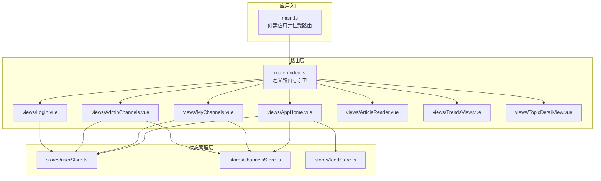
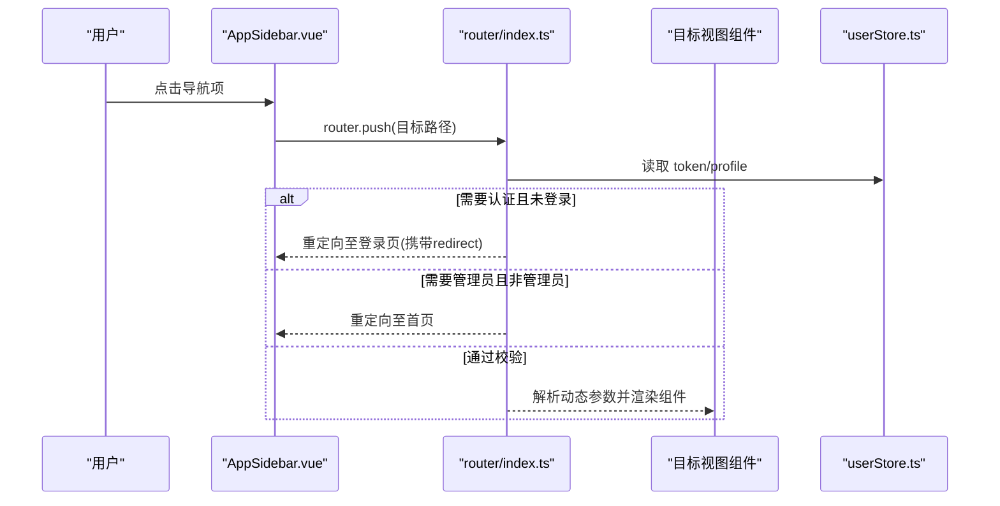
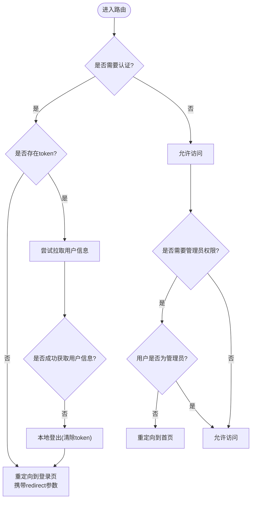
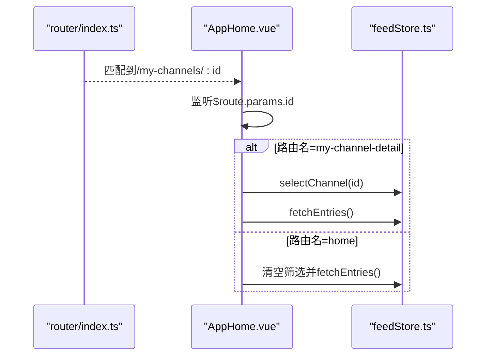
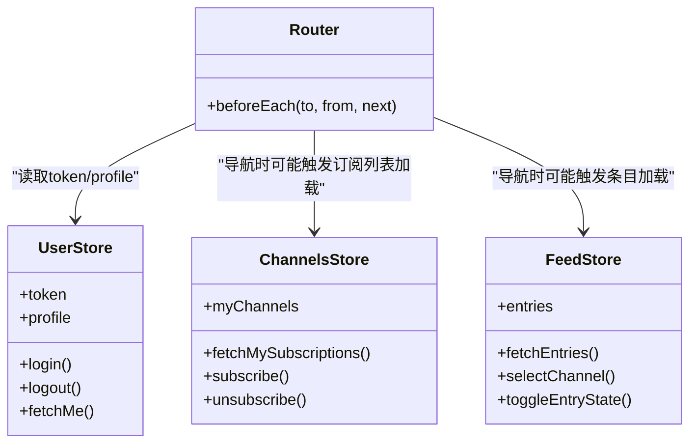
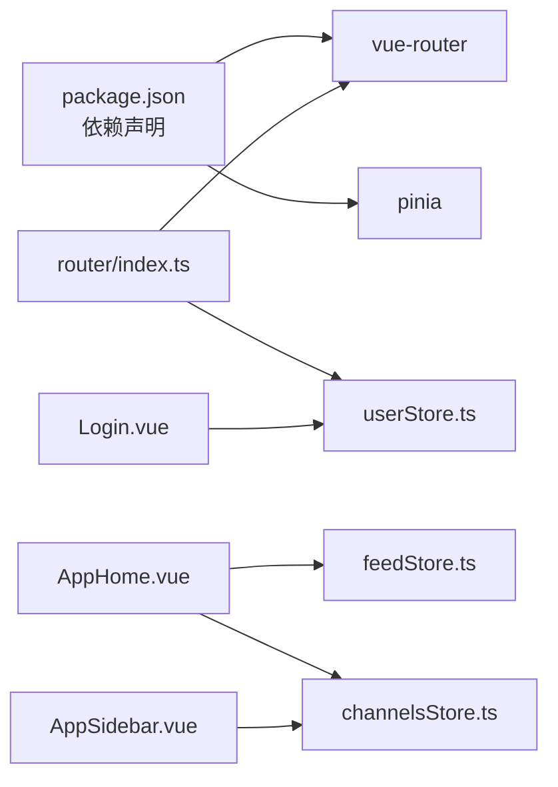

# 路由与导航系统

<cite>
**本文档引用的文件**
- [router/index.ts](file://rss-desktop/src/router/index.ts)
- [main.ts](file://rss-desktop/src/main.ts)
- [App.vue](file://rss-desktop/src/App.vue)
- [userStore.ts](file://rss-desktop/src/stores/userStore.ts)
- [channelsStore.ts](file://rss-desktop/src/stores/channelsStore.ts)
- [feedStore.ts](file://rss-desktop/src/stores/feedStore.ts)
- [AppHome.vue](file://rss-desktop/src/views/AppHome.vue)
- [AppSidebar.vue](file://rss-desktop/src/components/AppSidebar.vue)
- [Login.vue](file://rss-desktop/src/views/Login.vue)
- [MyChannels.vue](file://rss-desktop/src/views/MyChannels.vue)
- [AdminChannels.vue](file://rss-desktop/src/views/AdminChannels.vue)
- [package.json](file://rss-desktop/package.json)
</cite>

## 目录
1. [简介](#简介)
2. [项目结构](#项目结构)
3. [核心组件](#核心组件)
4. [架构总览](#架构总览)
5. [详细组件分析](#详细组件分析)
6. [依赖关系分析](#依赖关系分析)
7. [性能考虑](#性能考虑)
8. [故障排除指南](#故障排除指南)
9. [结论](#结论)

## 简介
本文件针对 Tan RSS Reader 的前端路由与导航系统进行深入解析，涵盖 Vue Router 的配置模式、路由守卫与导航拦截机制、路由懒加载与代码分割、嵌套与动态路由参数处理、程序化导航与路由元信息、权限控制集成、以及与状态管理（Pinia）的协同工作方式。文档同时提供可视化图表帮助理解系统架构与数据流，并给出性能优化、缓存策略与错误处理建议。

## 项目结构
- 路由定义位于 `rss-desktop/src/router/index.ts`，采用 Hash 历史模式与按需加载的路由组件。
- 应用入口在 `rss-desktop/src/main.ts` 注册路由与状态管理。
- 视图组件分布在 `rss-desktop/src/views/`，侧边栏等通用组件位于 `rss-desktop/src/components/`。
- 状态管理通过 Pinia Store 提供用户、频道、订阅源、条目等状态，路由守卫与导航逻辑与其紧密协作。

**图表来源**
- [main.ts:1-9](file://rss-desktop/src/main.ts#L1-L9)
- [router/index.ts:1-77](file://rss-desktop/src/router/index.ts#L1-L77)
- [App.vue:1-333](file://rss-desktop/src/App.vue#L1-L333)
- [userStore.ts:1-143](file://rss-desktop/src/stores/userStore.ts#L1-L143)
- [channelsStore.ts:1-363](file://rss-desktop/src/stores/channelsStore.ts#L1-L363)
- [feedStore.ts:1-642](file://rss-desktop/src/stores/feedStore.ts#L1-L642)

**章节来源**
- [main.ts:1-9](file://rss-desktop/src/main.ts#L1-L9)
- [router/index.ts:1-77](file://rss-desktop/src/router/index.ts#L1-L77)

## 核心组件
- 路由器与历史模式：使用 Hash 历史模式，便于桌面端与静态部署场景；路由表定义了首页、登录、频道、管理员页面、阅读器、趋势分析等路径。
- 路由守卫：全局前置守卫负责鉴权与管理员权限校验，同时尝试在有令牌但无用户资料时拉取用户信息以增强持久化体验。
- 懒加载与代码分割：路由组件普遍采用动态导入，实现按需加载与打包拆分，减少首屏体积。
- 权限控制：通过路由元信息 `requiresAuth` 和 `requiresAdmin` 控制访问；结合用户 Store 的角色判断实现细粒度权限。
- 程序化导航：在视图组件与侧边栏中广泛使用 `router.push()` 实现无刷新导航。
- 状态管理集成：路由与 Store 协同，如登录后根据 redirect 参数返回原目标页，频道详情页根据动态参数选择频道并加载条目。

**章节来源**
- [router/index.ts:5-48](file://rss-desktop/src/router/index.ts#L5-L48)
- [router/index.ts:50-74](file://rss-desktop/src/router/index.ts#L50-L74)
- [Login.vue:27-41](file://rss-desktop/src/views/Login.vue#L27-L41)
- [AppSidebar.vue:117-124](file://rss-desktop/src/components/AppSidebar.vue#L117-L124)
- [MyChannels.vue:27-29](file://rss-desktop/src/views/MyChannels.vue#L27-L29)

## 架构总览
Tan RSS Reader 的路由与导航系统围绕以下要点构建：
- 路由层：定义路径、组件与元信息；全局守卫统一处理认证与权限。
- 视图层：承载业务功能，使用组合式 API 与路由实例进行程序化导航。
- 状态层：用户、频道、订阅源、条目等状态通过 Store 管理，路由变化驱动状态更新与数据拉取。
- 导航层：侧边栏与视图组件通过 `router.push()` 与 `router.replace()` 实现导航；路由参数与查询参数在组件内监听并触发数据加载。

**图表来源**
- [router/index.ts:50-74](file://rss-desktop/src/router/index.ts#L50-L74)
- [AppSidebar.vue:117-124](file://rss-desktop/src/components/AppSidebar.vue#L117-L124)
- [userStore.ts:14-87](file://rss-desktop/src/stores/userStore.ts#L14-L87)

## 详细组件分析

### 路由器与路由表
- 历史模式：使用 Hash 历史模式，适合桌面端与静态托管环境。
- 路由表：包含首页、登录、频道广场、我的频道、管理员页面、阅读器、趋势分析、话题详情等路由。
- 动态路由参数：如 `/my-channels/:id`、`/reader/:id`、`/trends/:id`，用于在单页应用中承载详情页。
- 查询参数：登录页使用查询参数 `redirect` 作为登录后的返回地址。
- 路由元信息：通过 `meta.requiresAuth` 与 `meta.requiresAdmin` 实现权限控制。

**图表来源**
- [router/index.ts:50-74](file://rss-desktop/src/router/index.ts#L50-L74)

**章节来源**
- [router/index.ts:5-48](file://rss-desktop/src/router/index.ts#L5-L48)
- [router/index.ts:50-74](file://rss-desktop/src/router/index.ts#L50-L74)
- [Login.vue:36-37](file://rss-desktop/src/views/Login.vue#L36-L37)

### 路由懒加载与代码分割
- 路由组件普遍采用动态导入，实现按需加载与打包拆分，降低首屏资源压力。
- 适用场景：登录页、频道详情页、管理员页面、阅读器、趋势分析等。

**章节来源**
- [router/index.ts:7-42](file://rss-desktop/src/router/index.ts#L7-L42)

### 嵌套路由与动态路由参数
- 嵌套路由：根路由指向 AppHome，其内部通过 RouterView 展示子视图，形成嵌套结构。
- 动态路由参数：
  - `/my-channels/:id`：在 AppHome 中监听路由参数变化，选择频道并加载条目。
  - `/reader/:id`：进入阅读器视图。
  - `/trends/:id`：进入话题详情视图。
- 查询参数：登录页使用 `redirect` 参数实现登录后返回原目标页。

**图表来源**
- [router/index.ts:15-20](file://rss-desktop/src/router/index.ts#L15-L20)
- [AppHome.vue:100-115](file://rss-desktop/src/views/AppHome.vue#L100-L115)
- [feedStore.ts:332-403](file://rss-desktop/src/stores/feedStore.ts#L332-L403)

**章节来源**
- [router/index.ts:15-20](file://rss-desktop/src/router/index.ts#L15-L20)
- [AppHome.vue:100-115](file://rss-desktop/src/views/AppHome.vue#L100-L115)

### 程序化导航与导航拦截
- 程序化导航：
  - 侧边栏点击频道卡片时，若已在目标详情页则刷新数据，否则使用 `router.push()` 跳转。
  - “我的专题”页面点击专题卡片跳转到对应频道详情页。
  - 登录成功后根据查询参数 `redirect` 返回原目标页。
- 导航拦截：
  - 全局守卫根据 `requiresAuth` 与 `requiresAdmin` 决定是否放行或重定向。
  - 若用户令牌存在但缺少用户资料，先尝试拉取用户信息，失败则本地登出。

**章节来源**
- [AppSidebar.vue:117-124](file://rss-desktop/src/components/AppSidebar.vue#L117-L124)
- [MyChannels.vue:27-29](file://rss-desktop/src/views/MyChannels.vue#L27-L29)
- [Login.vue:36-41](file://rss-desktop/src/views/Login.vue#L36-L41)
- [router/index.ts:50-74](file://rss-desktop/src/router/index.ts#L50-L74)

### 路由元信息与权限控制
- 元信息：
  - `requiresAuth`: 需要登录才能访问。
  - `requiresAdmin`: 需要管理员角色。
- 权限控制流程：
  - 若需要认证且无 token，重定向到登录页并附带 `redirect`。
  - 若需要管理员但角色非 admin，重定向到首页。
  - 成功后允许访问目标路由。

**章节来源**
- [router/index.ts:13](file://rss-desktop/src/router/index.ts#L13)
- [router/index.ts:21](file://rss-desktop/src/router/index.ts#L21)
- [router/index.ts:63-71](file://rss-desktop/src/router/index.ts#L63-L71)

### 与状态管理的集成
- 用户状态：登录、注册、登出、拉取用户信息等。
- 频道与订阅源：订阅、取消订阅、获取频道条目、管理频道与源。
- 条目数据：按频道、订阅源或分组筛选加载条目，支持未读标记与收藏状态切换。
- 路由与状态联动：
  - 登录成功后根据 `redirect` 参数导航。
  - 频道详情页根据动态参数选择频道并加载条目。
  - 侧边栏根据活跃频道滚动定位。

**图表来源**
- [router/index.ts:50-74](file://rss-desktop/src/router/index.ts#L50-L74)
- [userStore.ts:14-87](file://rss-desktop/src/stores/userStore.ts#L14-L87)
- [channelsStore.ts:150-197](file://rss-desktop/src/stores/channelsStore.ts#L150-L197)
- [feedStore.ts:332-403](file://rss-desktop/src/stores/feedStore.ts#L332-L403)

**章节来源**
- [userStore.ts:14-87](file://rss-desktop/src/stores/userStore.ts#L14-L87)
- [channelsStore.ts:150-197](file://rss-desktop/src/stores/channelsStore.ts#L150-L197)
- [feedStore.ts:332-403](file://rss-desktop/src/stores/feedStore.ts#L332-L403)

## 依赖关系分析
- 路由依赖：Vue Router 版本在 package.json 中声明，确保与项目兼容。
- 状态管理：Pinia 作为状态管理库，与路由共同驱动应用状态。
- 组件依赖：视图组件依赖 Store，Store 依赖 API 客户端；路由守卫依赖 Store。

**图表来源**
- [package.json:66](file://rss-desktop/package.json#L66)
- [router/index.ts:1-3](file://rss-desktop/src/router/index.ts#L1-L3)
- [userStore.ts:1-3](file://rss-desktop/src/stores/userStore.ts#L1-L3)
- [AppHome.vue:1-20](file://rss-desktop/src/views/AppHome.vue#L1-L20)
- [channelsStore.ts:1-4](file://rss-desktop/src/stores/channelsStore.ts#L1-L4)
- [feedStore.ts:1-6](file://rss-desktop/src/stores/feedStore.ts#L1-L6)
- [AppSidebar.vue:1-10](file://rss-desktop/src/components/AppSidebar.vue#L1-L10)
- [Login.vue:1-6](file://rss-desktop/src/views/Login.vue#L1-L6)

**章节来源**
- [package.json:66](file://rss-desktop/package.json#L66)
- [router/index.ts:1-3](file://rss-desktop/src/router/index.ts#L1-L3)

## 性能考虑
- 路由懒加载：通过动态导入实现按需加载，减少初始包体大小，提升首屏性能。
- 代码分割：路由级拆分，配合 Webpack/Vite 的代码分割策略，进一步优化加载速度。
- 数据加载优化：
  - 在 AppHome 中监听路由参数变化，仅在必要时加载数据，避免重复请求。
  - 使用 Store 缓存条目与频道数据，减少重复网络请求。
- 路由守卫优化：仅在需要时进行用户信息拉取，失败时快速降级为本地登出，避免阻塞导航。
- 图标与媒体资源：对图标加载状态进行跟踪，避免闪烁与重复请求。

[本节为通用性能建议，不直接分析具体文件，故无“章节来源”]

## 故障排除指南
- 登录后无法返回原页面：
  - 检查登录页是否正确读取并使用 `redirect` 查询参数。
  - 确认路由守卫中对 `redirect` 的处理逻辑。
- 无权限访问页面：
  - 检查路由元信息 `requiresAuth` 与 `requiresAdmin` 是否正确设置。
  - 确认用户 Store 的角色信息是否正确。
- 用户令牌过期：
  - 路由守卫会在拉取用户信息失败时执行本地登出，确保不会出现半登录状态。
- 频道详情页数据不更新：
  - 检查 AppHome 中对路由参数变化的监听与数据加载逻辑。
  - 确认 Store 的 `selectChannel` 与 `fetchEntries` 调用顺序。

**章节来源**
- [Login.vue:36-41](file://rss-desktop/src/views/Login.vue#L36-L41)
- [router/index.ts:50-74](file://rss-desktop/src/router/index.ts#L50-L74)
- [AppHome.vue:100-115](file://rss-desktop/src/views/AppHome.vue#L100-L115)

## 结论
Tan RSS Reader 的路由与导航系统以 Vue Router 为核心，结合 Pinia 状态管理与全局守卫，实现了清晰的权限控制、灵活的程序化导航与良好的用户体验。通过路由懒加载与代码分割，系统在保证功能完整性的同时兼顾了性能表现。未来可在路由过渡动画、面包屑导航与 SEO 优化方面进一步完善，以提升多场景下的可用性与可访问性。