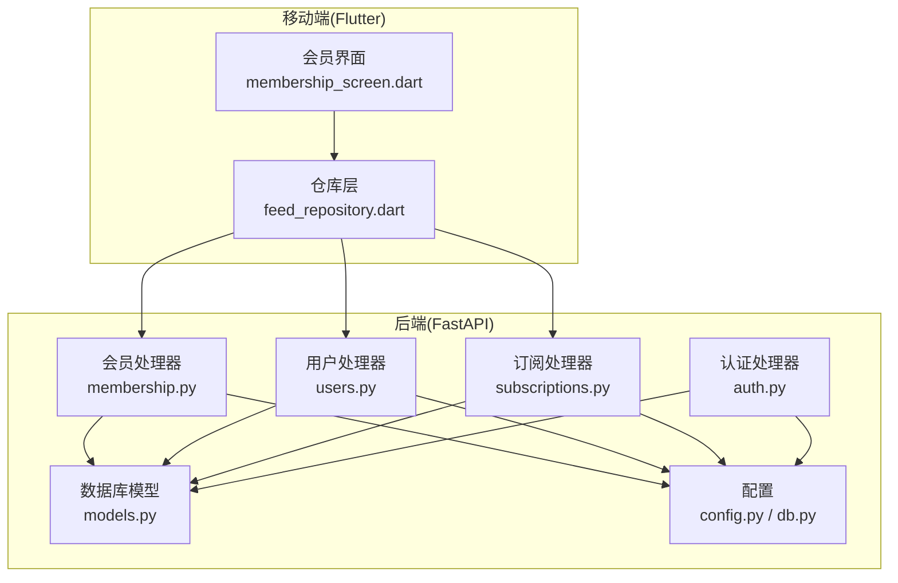
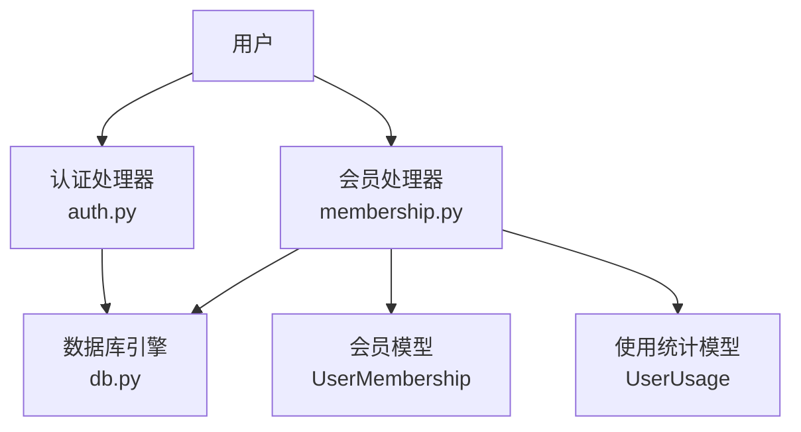
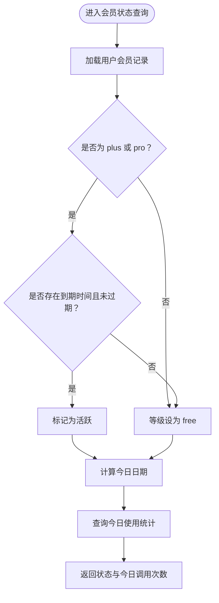
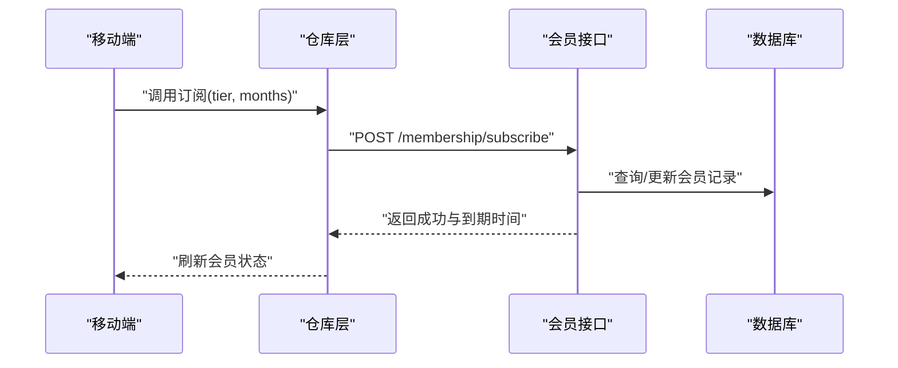
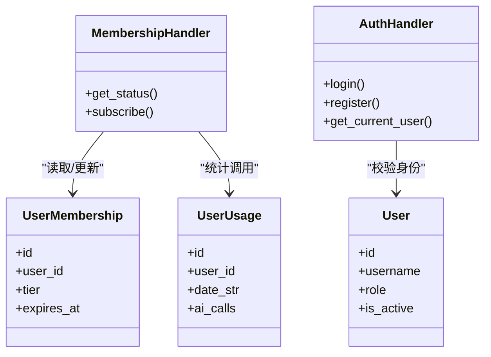
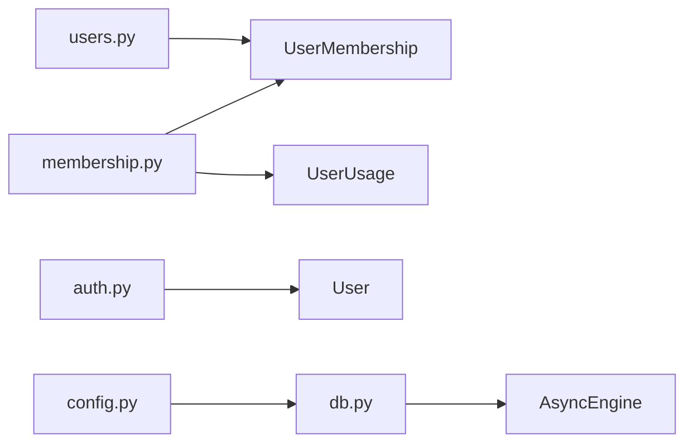

# 会员系统

<cite>
**本文引用的文件**
- [python-backend/app/models.py](file://python-backend/app/models.py)
- [python-backend/app/handlers/membership.py](file://python-backend/app/handlers/membership.py)
- [python-backend/app/handlers/users.py](file://python-backend/app/handlers/users.py)
- [python-backend/app/handlers/subscriptions.py](file://python-backend/app/handlers/subscriptions.py)
- [python-backend/app/handlers/auth.py](file://python-backend/app/handlers/auth.py)
- [python-backend/app/db.py](file://python-backend/app/db.py)
- [python-backend/app/config.py](file://python-backend/app/config.py)
- [python-backend/app/utils/filters.py](file://python-backend/app/utils/filters.py)
- [tan_rss_mobile/lib/features/feed/presentation/membership_screen.dart](file://tan_rss_mobile/lib/features/feed/presentation/membership_screen.dart)
- [tan_rss_mobile/lib/features/feed/data/feed_repository.dart](file://tan_rss_mobile/lib/features/feed/data/feed_repository.dart)
- [VIP_ARCHITECTURE.md](file://VIP_ARCHITECTURE.md)
- [todo_vip.md](file://todo_vip.md)
</cite>

## 目录
1. [简介](#简介)
2. [项目结构](#项目结构)
3. [核心组件](#核心组件)
4. [架构总览](#架构总览)
5. [详细组件分析](#详细组件分析)
6. [依赖分析](#依赖分析)
7. [性能考虑](#性能考虑)
8. [故障排查指南](#故障排查指南)
9. [结论](#结论)
10. [附录](#附录)

## 简介
本文件面向 Tan RSS Reader 的会员系统，围绕会员等级管理、订阅状态控制、功能权限分配、会员权益管理、支付与订单集成、生命周期管理与营销策略等方面，提供从后端数据模型到移动端交互的全栈文档。系统采用“平台/系统配置与用户个人配置分离”的架构，引入两级会员（Plus、Pro）与使用统计，为后续商业化与高级功能扩展奠定基础。

## 项目结构
会员系统涉及后端 FastAPI 接口与数据库模型、移动端 Flutter 屏幕与仓库层、以及架构设计文档。关键目录与文件如下：
- 后端
  - 数据模型：用户、会员、使用统计、订阅等
  - 处理器：会员、用户、订阅、认证等
  - 配置与工具：数据库连接、环境配置、查询过滤
- 移动端
  - 会员界面与仓库层，负责调用后端会员接口

图表来源
- [python-backend/app/handlers/membership.py:1-113](file://python-backend/app/handlers/membership.py#L1-L113)
- [python-backend/app/handlers/users.py:1-149](file://python-backend/app/handlers/users.py#L1-L149)
- [python-backend/app/handlers/subscriptions.py:1-175](file://python-backend/app/handlers/subscriptions.py#L1-L175)
- [python-backend/app/handlers/auth.py:1-174](file://python-backend/app/handlers/auth.py#L1-L174)
- [python-backend/app/models.py:168-228](file://python-backend/app/models.py#L168-L228)
- [python-backend/app/db.py:1-27](file://python-backend/app/db.py#L1-L27)
- [python-backend/app/config.py:1-75](file://python-backend/app/config.py#L1-L75)
- [tan_rss_mobile/lib/features/feed/presentation/membership_screen.dart:1-255](file://tan_rss_mobile/lib/features/feed/presentation/membership_screen.dart#L1-L255)
- [tan_rss_mobile/lib/features/feed/data/feed_repository.dart:446-466](file://tan_rss_mobile/lib/features/feed/data/feed_repository.dart#L446-L466)

章节来源
- [python-backend/app/models.py:168-228](file://python-backend/app/models.py#L168-L228)
- [python-backend/app/handlers/membership.py:1-113](file://python-backend/app/handlers/membership.py#L1-L113)
- [python-backend/app/handlers/users.py:1-149](file://python-backend/app/handlers/users.py#L1-L149)
- [python-backend/app/handlers/subscriptions.py:1-175](file://python-backend/app/handlers/subscriptions.py#L1-L175)
- [python-backend/app/handlers/auth.py:1-174](file://python-backend/app/handlers/auth.py#L1-L174)
- [python-backend/app/db.py:1-27](file://python-backend/app/db.py#L1-L27)
- [python-backend/app/config.py:1-75](file://python-backend/app/config.py#L1-L75)
- [tan_rss_mobile/lib/features/feed/presentation/membership_screen.dart:1-255](file://tan_rss_mobile/lib/features/feed/presentation/membership_screen.dart#L1-L255)
- [tan_rss_mobile/lib/features/feed/data/feed_repository.dart:446-466](file://tan_rss_mobile/lib/features/feed/data/feed_repository.dart#L446-L466)

## 核心组件
- 数据模型
  - 用户表：用户基本信息与角色
  - 会员表：用户会员等级与到期时间
  - 使用统计表：按日统计平台 AI 调用次数
  - 订阅表：用户与频道的订阅关系
- 处理器
  - 会员：查询状态、订阅/升级/降级
  - 用户：管理员查看与更新用户信息（含会员等级）
  - 订阅：查询我的订阅、订阅/取消订阅频道、拉取订阅源文章
  - 认证：登录注册、令牌校验、管理员校验
- 移动端
  - 会员界面：展示当前等级、到期时间、今日调用次数；提供升级/降级入口
  - 仓库层：封装会员接口调用

章节来源
- [python-backend/app/models.py:168-228](file://python-backend/app/models.py#L168-L228)
- [python-backend/app/handlers/membership.py:1-113](file://python-backend/app/handlers/membership.py#L1-L113)
- [python-backend/app/handlers/users.py:1-149](file://python-backend/app/handlers/users.py#L1-L149)
- [python-backend/app/handlers/subscriptions.py:1-175](file://python-backend/app/handlers/subscriptions.py#L1-L175)
- [python-backend/app/handlers/auth.py:1-174](file://python-backend/app/handlers/auth.py#L1-L174)
- [tan_rss_mobile/lib/features/feed/presentation/membership_screen.dart:1-255](file://tan_rss_mobile/lib/features/feed/presentation/membership_screen.dart#L1-L255)
- [tan_rss_mobile/lib/features/feed/data/feed_repository.dart:446-466](file://tan_rss_mobile/lib/features/feed/data/feed_repository.dart#L446-L466)

## 架构总览
会员系统采用“用户级配置分离 + 会员等级控制”的架构，核心要点：
- 会员等级：free、plus、pro
- 有效期：以 UTC 时间为准，到期后自动降级为 free
- 平台 AI 调用：Free 会员需自行配置 API Key；Plus/Pro 可使用平台额度并统计当日调用次数
- 订阅管理：用户可订阅/取消订阅频道，拉取订阅源文章

图表来源
- [python-backend/app/handlers/membership.py:28-57](file://python-backend/app/handlers/membership.py#L28-L57)
- [python-backend/app/models.py:179-186](file://python-backend/app/models.py#L179-L186)
- [python-backend/app/models.py:188-196](file://python-backend/app/models.py#L188-L196)
- [python-backend/app/handlers/auth.py:91-104](file://python-backend/app/handlers/auth.py#L91-L104)
- [python-backend/app/db.py:24-25](file://python-backend/app/db.py#L24-L25)

章节来源
- [VIP_ARCHITECTURE.md:1-74](file://VIP_ARCHITECTURE.md#L1-L74)
- [python-backend/app/handlers/membership.py:1-113](file://python-backend/app/handlers/membership.py#L1-L113)
- [python-backend/app/models.py:179-196](file://python-backend/app/models.py#L179-L196)
- [python-backend/app/handlers/auth.py:1-174](file://python-backend/app/handlers/auth.py#L1-L174)
- [python-backend/app/db.py:1-27](file://python-backend/app/db.py#L1-L27)

## 详细组件分析

### 会员等级管理
- 等级定义
  - free：基础会员，需自行配置 API Key 才能使用平台 AI 能力
  - plus：专业会员，可直接使用平台高质量 AI 模型，有每日调用额度
  - pro：终极会员，享有更高额度与优先支持
- 升级/降级/续费
  - 通过订阅接口提交 tier 与月份，系统计算到期时间并更新会员记录
  - 降级到 free 会清空到期时间
- 到期处理
  - 若到期时间存在且已过期，则自动降级为 free
  - 仅 plus/pro 会员在有效期内视为活跃

图表来源
- [python-backend/app/handlers/membership.py:28-57](file://python-backend/app/handlers/membership.py#L28-L57)
- [python-backend/app/models.py:179-186](file://python-backend/app/models.py#L179-L186)
- [python-backend/app/models.py:188-196](file://python-backend/app/models.py#L188-L196)

章节来源
- [python-backend/app/handlers/membership.py:28-113](file://python-backend/app/handlers/membership.py#L28-L113)
- [python-backend/app/models.py:179-196](file://python-backend/app/models.py#L179-L196)

### 订阅状态控制
- 订阅周期
  - 通过订阅接口传入 months 参数，按 30 天折算增加有效期
- 自动续费
  - 当前实现为一次性订阅，未内置自动续费逻辑
- 到期处理
  - 到期后会员等级降为 free，但订阅关系与频道仍保留

图表来源
- [tan_rss_mobile/lib/features/feed/data/feed_repository.dart:456-466](file://tan_rss_mobile/lib/features/feed/data/feed_repository.dart#L456-L466)
- [python-backend/app/handlers/membership.py:59-113](file://python-backend/app/handlers/membership.py#L59-L113)

章节来源
- [python-backend/app/handlers/membership.py:59-113](file://python-backend/app/handlers/membership.py#L59-L113)
- [tan_rss_mobile/lib/features/feed/data/feed_repository.dart:456-466](file://tan_rss_mobile/lib/features/feed/data/feed_repository.dart#L456-L466)

### 功能权限分配
- 权限维度
  - 会员等级：free、plus、pro
  - 平台 AI 能力：Free 需自行配置 Key；Plus/Pro 可使用平台额度
  - 自定义指令集：Plus 特权（前端已预留）
- 控制点
  - 会员状态查询接口返回 is_active 与今日调用次数
  - 认证中间件保障接口访问安全

图表来源
- [python-backend/app/models.py:168-196](file://python-backend/app/models.py#L168-L196)
- [python-backend/app/handlers/membership.py:18-57](file://python-backend/app/handlers/membership.py#L18-L57)
- [python-backend/app/handlers/auth.py:91-104](file://python-backend/app/handlers/auth.py#L91-L104)

章节来源
- [python-backend/app/handlers/membership.py:18-57](file://python-backend/app/handlers/membership.py#L18-L57)
- [python-backend/app/handlers/auth.py:1-174](file://python-backend/app/handlers/auth.py#L1-L174)
- [VIP_ARCHITECTURE.md:1-74](file://VIP_ARCHITECTURE.md#L1-L74)

### 会员权益管理
- 内容访问限制
  - 通过会员等级与 is_active 控制功能可用性
- 高级功能解锁
  - Plus：免配置使用平台高质量 AI 模型、每日调用额度
  - Pro：更高额度、高级主题定制（规划中）、优先支持
- 优先服务
  - 通过会员等级与到期时间判断服务优先级

章节来源
- [VIP_ARCHITECTURE.md:70-74](file://VIP_ARCHITECTURE.md#L70-L74)
- [tan_rss_mobile/lib/features/feed/presentation/membership_screen.dart:147-182](file://tan_rss_mobile/lib/features/feed/presentation/membership_screen.dart#L147-L182)

### 支付集成、订单管理与退款处理
- 支付集成
  - 订阅接口预留支付处理位，当前为模拟流程
- 订单管理
  - 通过订阅接口生成订单与有效期延长
- 退款处理
  - 当前未实现退款逻辑，建议在支付网关对接后补充

章节来源
- [python-backend/app/handlers/membership.py:81-82](file://python-backend/app/handlers/membership.py#L81-L82)
- [VIP_ARCHITECTURE.md:73-74](file://VIP_ARCHITECTURE.md#L73-L74)

### 会员生命周期管理
- 生命周期阶段
  - 注册与初始状态（free）
  - 订阅/升级（plus/pro）
  - 到期降级（free）
  - 续费/再次升级
- 数据驱动
  - 会员记录与使用统计共同决定功能可用性与额度

章节来源
- [python-backend/app/handlers/membership.py:28-113](file://python-backend/app/handlers/membership.py#L28-L113)
- [python-backend/app/models.py:179-196](file://python-backend/app/models.py#L179-L196)

### 数据分析与营销策略
- 数据指标
  - 会员转化率、留存率、到期率、每日调用量
- 营销策略
  - 到期提醒、限时优惠、升级引导、免费试用

章节来源
- [VIP_ARCHITECTURE.md:70-74](file://VIP_ARCHITECTURE.md#L70-L74)

## 依赖分析
- 组件耦合
  - 会员处理器依赖用户模型与使用统计模型
  - 用户处理器依赖会员模型以展示与更新等级
  - 认证处理器为所有受保护接口提供身份校验
- 外部依赖
  - 数据库：SQLite（异步引擎）
  - 环境配置：.env 加载与默认值

图表来源
- [python-backend/app/handlers/membership.py:8-10](file://python-backend/app/handlers/membership.py#L8-L10)
- [python-backend/app/models.py:179-196](file://python-backend/app/models.py#L179-L196)
- [python-backend/app/handlers/users.py:7-8](file://python-backend/app/handlers/users.py#L7-L8)
- [python-backend/app/handlers/auth.py:12-14](file://python-backend/app/handlers/auth.py#L12-L14)
- [python-backend/app/db.py:24-25](file://python-backend/app/db.py#L24-L25)
- [python-backend/app/config.py:41-75](file://python-backend/app/config.py#L41-L75)

章节来源
- [python-backend/app/handlers/membership.py:1-113](file://python-backend/app/handlers/membership.py#L1-L113)
- [python-backend/app/handlers/users.py:1-149](file://python-backend/app/handlers/users.py#L1-L149)
- [python-backend/app/handlers/auth.py:1-174](file://python-backend/app/handlers/auth.py#L1-L174)
- [python-backend/app/db.py:1-27](file://python-backend/app/db.py#L1-L27)
- [python-backend/app/config.py:1-75](file://python-backend/app/config.py#L1-L75)

## 性能考虑
- 查询优化
  - 会员状态查询与使用统计均使用主键/索引字段，避免全表扫描
- 并发与事务
  - 异步数据库会话减少阻塞
- 缓存与离线
  - 移动端对 AI 结果进行缓存，降低重复调用成本

## 故障排查指南
- 401 未授权
  - 检查令牌格式与签名；确认用户状态为激活
- 403 权限不足
  - 管理员接口需具备 admin 角色
- 400 参数错误
  - 订阅接口 tier 必须为 plus/pro/free
- 404 资源不存在
  - 用户或订阅记录不存在
- 429 额度超限
  - Plus/Pro 的调用次数限制为预留项，当前未强制启用

章节来源
- [python-backend/app/handlers/auth.py:91-109](file://python-backend/app/handlers/auth.py#L91-L109)
- [python-backend/app/handlers/membership.py:65-66](file://python-backend/app/handlers/membership.py#L65-L66)
- [python-backend/app/handlers/subscriptions.py:84-107](file://python-backend/app/handlers/subscriptions.py#L84-L107)
- [python-backend/app/handlers/ai.py:164-169](file://python-backend/app/handlers/ai.py#L164-L169)

## 结论
Tan RSS Reader 的会员系统已完成基础架构与两级会员设计，覆盖会员状态查询、订阅/升级/降级、平台 AI 调用统计与移动端交互。后续可在支付网关对接、调用额度限制、Pro 特权扩展与数据分析方面持续完善，以支撑商业化运营与用户体验提升。

## 附录
- 术语
  - Plus/Pro：会员等级
  - 平台额度：无需用户 Key 即可使用的 AI 调用配额
- 参考文档
  - VIP 架构设计与 API 文档
  - 会员功能规划与后续演进

章节来源
- [VIP_ARCHITECTURE.md:1-74](file://VIP_ARCHITECTURE.md#L1-L74)
- [todo_vip.md:1-31](file://todo_vip.md#L1-L31)