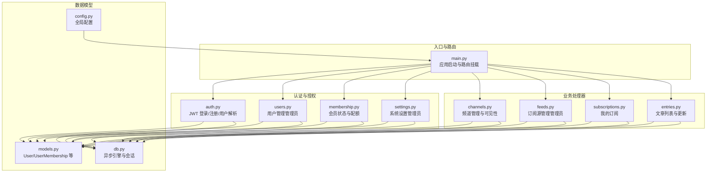
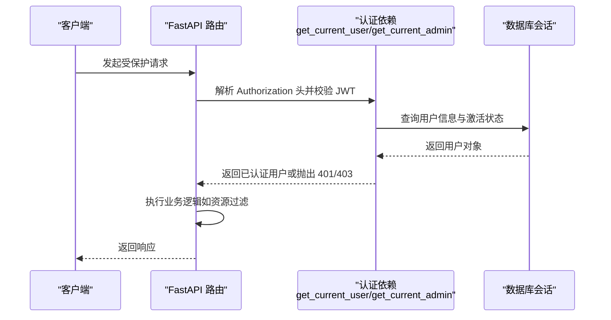
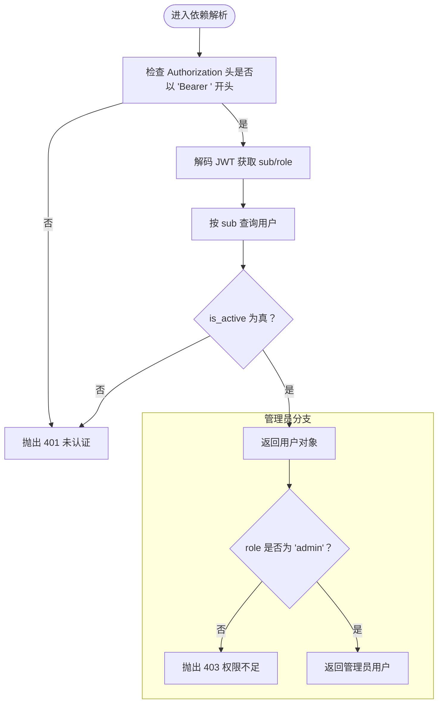
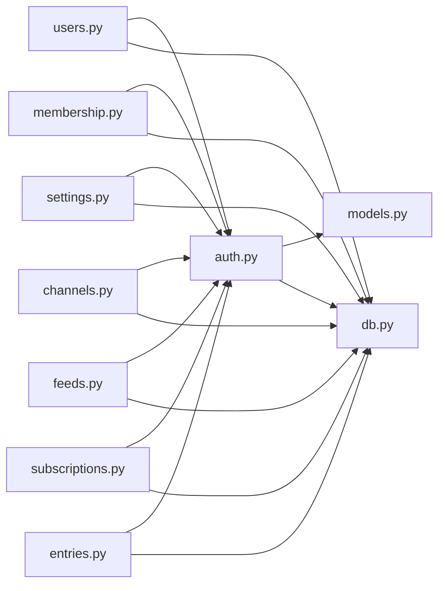

# 权限控制系统

<cite>
**本文引用的文件**
- [auth.py](file://python-backend/app/handlers/auth.py)
- [users.py](file://python-backend/app/handlers/users.py)
- [models.py](file://python-backend/app/models.py)
- [membership.py](file://python-backend/app/handlers/membership.py)
- [settings.py](file://python-backend/app/handlers/settings.py)
- [channels.py](file://python-backend/app/handlers/channels.py)
- [feeds.py](file://python-backend/app/handlers/feeds.py)
- [subscriptions.py](file://python-backend/app/handlers/subscriptions.py)
- [entries.py](file://python-backend/app/handlers/entries.py)
- [main.py](file://python-backend/app/main.py)
- [db.py](file://python-backend/app/db.py)
- [config.py](file://python-backend/app/config.py)
- [requirements.txt](file://python-backend/requirements.txt)
</cite>

## 目录
1. [简介](#简介)
2. [项目结构](#项目结构)
3. [核心组件](#核心组件)
4. [架构总览](#架构总览)
5. [详细组件分析](#详细组件分析)
6. [依赖分析](#依赖分析)
7. [性能考虑](#性能考虑)
8. [故障排除指南](#故障排除指南)
9. [结论](#结论)
10. [附录](#附录)

## 简介
本文件系统性梳理 Tan RSS Reader 后端的权限控制系统，重点覆盖以下方面：
- 角色定义与默认分配：用户角色（user）、管理员角色（admin），以及首次注册时的系统默认角色分配逻辑。
- 权限检查流程：get_current_user、get_current_admin、get_optional_user 的实现与使用方式。
- 访问控制列表（ACL）设计：资源权限、操作权限与条件权限在各处理器中的体现。
- 权限继承与冲突处理：角色升级、权限合并与冲突解决策略。
- 权限缓存策略、性能优化与安全审计建议。
- 配置示例、调试方法与故障排除。

## 项目结构
后端采用 FastAPI + SQLAlchemy 异步 ORM 架构，权限控制集中在认证与授权两个层面：
- 认证层：基于 JWT 的登录/注册与令牌解析，提供当前用户解析与可选用户解析。
- 授权层：通过依赖注入的装饰器实现“仅管理员”或“需登录”的访问限制，并结合业务模型进行细粒度控制。

图表来源
- [main.py:1-103](file://python-backend/app/main.py#L1-L103)
- [auth.py:1-174](file://python-backend/app/handlers/auth.py#L1-L174)
- [users.py:1-149](file://python-backend/app/handlers/users.py#L1-L149)
- [membership.py:1-113](file://python-backend/app/handlers/membership.py#L1-L113)
- [settings.py:1-161](file://python-backend/app/handlers/settings.py#L1-L161)
- [channels.py:1-200](file://python-backend/app/handlers/channels.py#L1-L200)
- [feeds.py:1-200](file://python-backend/app/handlers/feeds.py#L1-L200)
- [subscriptions.py:1-175](file://python-backend/app/handlers/subscriptions.py#L1-L175)
- [entries.py:1-200](file://python-backend/app/handlers/entries.py#L1-L200)
- [models.py:168-187](file://python-backend/app/models.py#L168-L187)
- [db.py:1-27](file://python-backend/app/db.py#L1-L27)
- [config.py:1-75](file://python-backend/app/config.py#L1-L75)

章节来源
- [main.py:1-103](file://python-backend/app/main.py#L1-L103)
- [db.py:1-27](file://python-backend/app/db.py#L1-L27)
- [config.py:1-75](file://python-backend/app/config.py#L1-L75)

## 核心组件
- 用户模型与角色字段
  - 用户表包含角色字段，默认值为“user”，管理员为“admin”。[User 模型:168-178](file://python-backend/app/models.py#L168-L178)
- JWT 认证与令牌管理
  - 登录/注册接口、令牌生成与校验、过期时间配置。[认证处理器:1-174](file://python-backend/app/handlers/auth.py#L1-L174)
- 当前用户与管理员依赖
  - get_current_user：解析 Authorization 头，验证 JWT 并查询用户是否有效；get_current_admin：在非管理员时返回 403；get_optional_user：允许匿名访问并返回 None。[用户解析函数:91-124](file://python-backend/app/handlers/auth.py#L91-L124)
- 首次注册与默认角色分配
  - 注册时统计用户数量，若为 0 则授予“admin”，否则为“user”。[注册逻辑:141-144](file://python-backend/app/handlers/auth.py#L141-L144)
- 会员与配额控制
  - 会员状态与到期时间、当日调用次数统计，用于影响高级功能可用性。[会员处理器:28-57](file://python-backend/app/handlers/membership.py#L28-L57)

章节来源
- [models.py:168-178](file://python-backend/app/models.py#L168-L178)
- [auth.py:76-124](file://python-backend/app/handlers/auth.py#L76-L124)
- [auth.py:141-144](file://python-backend/app/handlers/auth.py#L141-L144)
- [membership.py:28-57](file://python-backend/app/handlers/membership.py#L28-L57)

## 架构总览
权限控制贯穿请求生命周期：路由挂载后，各处理器通过依赖注入获取当前用户或强制管理员身份，再结合业务逻辑进行资源与操作的访问控制。

图表来源
- [auth.py:91-124](file://python-backend/app/handlers/auth.py#L91-L124)
- [main.py:44-62](file://python-backend/app/main.py#L44-L62)

## 详细组件分析

### 角色定义与默认分配
- 角色类型
  - user：普通用户，具备基本阅读与订阅能力。
  - admin：管理员，拥有系统级管理权限。
- 默认分配策略
  - 首个注册用户自动成为 admin；后续注册用户默认为 user。[注册路径:141-144](file://python-backend/app/handlers/auth.py#L141-L144)
- 数据模型支撑
  - 用户模型 role 字段默认为“user”。[User 模型](file://python-backend/app/models.py#L174)

章节来源
- [auth.py:141-144](file://python-backend/app/handlers/auth.py#L141-L144)
- [models.py:174](file://python-backend/app/models.py#L174)

### 权限检查流程
- get_current_user
  - 校验 Authorization 头格式，解码 JWT 获取 sub 与 role，查询用户是否存在且 is_active 为真。[实现:91-104](file://python-backend/app/handlers/auth.py#L91-L104)
- get_current_admin
  - 在 get_current_user 基础上进一步校验 role 是否为“admin”，否则返回 403。[实现:106-109](file://python-backend/app/handlers/auth.py#L106-L109)
- get_optional_user
  - 允许匿名访问，失败时返回 None，供公开接口使用。[实现:111-124](file://python-backend/app/handlers/auth.py#L111-L124)

图表来源
- [auth.py:91-109](file://python-backend/app/handlers/auth.py#L91-L109)

章节来源
- [auth.py:91-124](file://python-backend/app/handlers/auth.py#L91-L124)

### 访问控制列表（ACL）设计
- 资源权限
  - 用户资料与订阅：仅限本人访问，通过 get_current_user 依赖实现。[我的订阅:50-81](file://python-backend/app/handlers/subscriptions.py#L50-L81)、[我的文章:109-175](file://python-backend/app/handlers/subscriptions.py#L109-L175)
  - 频道列表：公开频道对匿名可见，登录用户可获取更多上下文。[频道广场:101-179](file://python-backend/app/handlers/channels.py#L101-L179)
- 操作权限
  - 管理员专属：用户管理、系统设置、订阅源管理等均依赖 get_current_admin。[用户管理:42-66](file://python-backend/app/handlers/users.py#L42-L66)、[系统设置:58-87](file://python-backend/app/handlers/settings.py#L58-L87)、[订阅源管理:111-139](file://python-backend/app/handlers/feeds.py#L111-L139)
- 条件权限
  - 频道所有者限制：非管理员仅能管理自身拥有的频道。[频道列表（管理员/所有者）:181-196](file://python-backend/app/handlers/channels.py#L181-L196)
  - 会员等级与配额：根据会员状态与当日调用量决定功能可用性。[会员状态:28-57](file://python-backend/app/handlers/membership.py#L28-L57)

章节来源
- [subscriptions.py:50-81](file://python-backend/app/handlers/subscriptions.py#L50-L81)
- [subscriptions.py:109-175](file://python-backend/app/handlers/subscriptions.py#L109-L175)
- [channels.py:101-179](file://python-backend/app/handlers/channels.py#L101-L179)
- [users.py:42-66](file://python-backend/app/handlers/users.py#L42-L66)
- [settings.py:58-87](file://python-backend/app/handlers/settings.py#L58-L87)
- [feeds.py:111-139](file://python-backend/app/handlers/feeds.py#L111-L139)
- [channels.py:181-196](file://python-backend/app/handlers/channels.py#L181-L196)
- [membership.py:28-57](file://python-backend/app/handlers/membership.py#L28-L57)

### 权限继承关系与冲突解决
- 角色升级
  - 首个注册用户自动成为管理员，后续用户为普通用户。[注册逻辑:141-144](file://python-backend/app/handlers/auth.py#L141-L144)
- 权限合并
  - 管理员权限覆盖普通用户权限，管理员可访问所有受保护资源。[管理员依赖:106-109](file://python-backend/app/handlers/auth.py#L106-L109)
- 冲突解决
  - 自我约束：管理员不可自我降级或停用账户，避免自我锁定。[用户更新:75-81](file://python-backend/app/handlers/users.py#L75-L81)
  - 资源归属：非管理员仅能操作自身拥有的频道。[频道列表:189-191](file://python-backend/app/handlers/channels.py#L189-L191)

章节来源
- [auth.py:141-144](file://python-backend/app/handlers/auth.py#L141-L144)
- [auth.py:106-109](file://python-backend/app/handlers/auth.py#L106-L109)
- [users.py:75-81](file://python-backend/app/handlers/users.py#L75-L81)
- [channels.py:189-191](file://python-backend/app/handlers/channels.py#L189-L191)

### 权限缓存策略、性能优化与安全审计
- 缓存策略建议
  - 令牌校验结果可短期缓存于进程内字典（键为 token 子串或用户 ID），减少重复解码与数据库查询。注意：需配合失效策略与并发安全。
  - 用户权限位可在会话中缓存，避免重复查询用户与会员状态。
- 性能优化
  - 使用分页与 LIMIT 控制查询规模（如 1000）。[多处使用](file://python-backend/app/handlers/channels.py#L112)
  - 复合查询合并为单次执行，减少往返次数。
- 安全审计
  - 记录关键操作（用户增删改、设置变更、订阅源管理）的日志，包含操作者、目标与时间戳。
  - 对异常 401/403 场景进行统计，识别潜在攻击或误用。

[本节为通用指导，无需特定文件来源]

## 依赖分析
- 组件耦合
  - 所有处理器依赖 auth 中的依赖函数实现权限控制，耦合度低、职责清晰。
  - 数据模型集中于 models.py，被各处理器共享。
- 外部依赖
  - FastAPI、SQLAlchemy、PyJWT、bcrypt 等。[依赖清单:1-18](file://python-backend/requirements.txt#L1-L18)

图表来源
- [auth.py:1-174](file://python-backend/app/handlers/auth.py#L1-L174)
- [users.py:1-149](file://python-backend/app/handlers/users.py#L1-L149)
- [membership.py:1-113](file://python-backend/app/handlers/membership.py#L1-L113)
- [settings.py:1-161](file://python-backend/app/handlers/settings.py#L1-L161)
- [channels.py:1-200](file://python-backend/app/handlers/channels.py#L1-L200)
- [feeds.py:1-200](file://python-backend/app/handlers/feeds.py#L1-L200)
- [subscriptions.py:1-175](file://python-backend/app/handlers/subscriptions.py#L1-L175)
- [entries.py:1-200](file://python-backend/app/handlers/entries.py#L1-L200)
- [models.py:168-187](file://python-backend/app/models.py#L168-L187)
- [db.py:1-27](file://python-backend/app/db.py#L1-L27)

章节来源
- [requirements.txt:1-18](file://python-backend/requirements.txt#L1-L18)

## 性能考虑
- 令牌解析成本
  - JWT 解码与数据库查询为 O(1)，但应避免在高频路径中重复解析同一令牌。
- 查询规模控制
  - 多处使用 min(limit, 1000) 限制返回条数，防止超大结果集。[示例](file://python-backend/app/handlers/channels.py#L112)
- 连接与事务
  - 使用异步会话与短事务，避免长事务占用连接池。

[本节为通用指导，无需特定文件来源]

## 故障排除指南
- 401 未认证
  - 检查请求头 Authorization 是否为 Bearer 令牌；确认密钥与过期时间正确。[解析逻辑:91-99](file://python-backend/app/handlers/auth.py#L91-L99)
- 403 权限不足
  - 确认用户角色为“admin”；检查管理员依赖是否正确注入。[管理员校验:106-109](file://python-backend/app/handlers/auth.py#L106-L109)
- 用户无法登录
  - 核对用户名与密码哈希；确认用户 is_active 为真。[登录逻辑:166-173](file://python-backend/app/handlers/auth.py#L166-L173)
- 自我锁定
  - 管理员不可自我降级或停用账户；修改他人账户时确保目标不是自己。[自我约束:75-81](file://python-backend/app/handlers/users.py#L75-L81)
- 频道无权限
  - 非管理员仅能管理自身拥有的频道；确认 owner_id 与当前用户一致。[所有者限制:189-191](file://python-backend/app/handlers/channels.py#L189-L191)

章节来源
- [auth.py:91-109](file://python-backend/app/handlers/auth.py#L91-L109)
- [auth.py:166-173](file://python-backend/app/handlers/auth.py#L166-L173)
- [users.py:75-81](file://python-backend/app/handlers/users.py#L75-L81)
- [channels.py:189-191](file://python-backend/app/handlers/channels.py#L189-L191)

## 结论
Tan RSS Reader 的权限体系以 JWT 为基础，通过依赖注入将认证与授权无缝嵌入到各业务处理器中。系统采用“首个注册即管理员”的简单策略，辅以管理员自我约束与资源归属控制，形成清晰的 ACL 分层。建议在生产环境中引入令牌缓存、审计日志与更细粒度的操作权限矩阵，以进一步提升安全性与可观测性。

[本节为总结，无需特定文件来源]

## 附录
- 配置示例
  - 认证密钥与过期时间：通过环境变量设置，用于生成与校验 JWT。[配置项:18-24](file://python-backend/app/handlers/auth.py#L18-L24)
  - 数据库连接：支持 SQLite 或外部数据库 URL。[数据库配置:11-22](file://python-backend/app/db.py#L11-L22)
- 调试方法
  - 使用 HTTP 客户端发送带 Bearer 令牌的请求，观察 401/403 响应原因。
  - 在处理器中临时打印当前用户角色与请求参数，定位权限问题。
- 故障排除清单
  - 令牌格式与签名是否正确
  - 用户是否激活
  - 是否满足管理员条件
  - 是否越权访问自身资源

章节来源
- [auth.py:18-24](file://python-backend/app/handlers/auth.py#L18-L24)
- [db.py:11-22](file://python-backend/app/db.py#L11-L22)