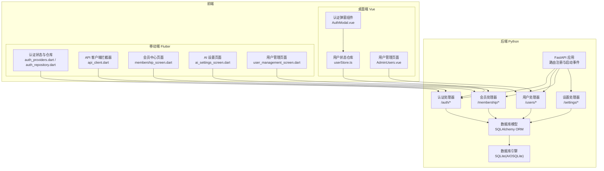
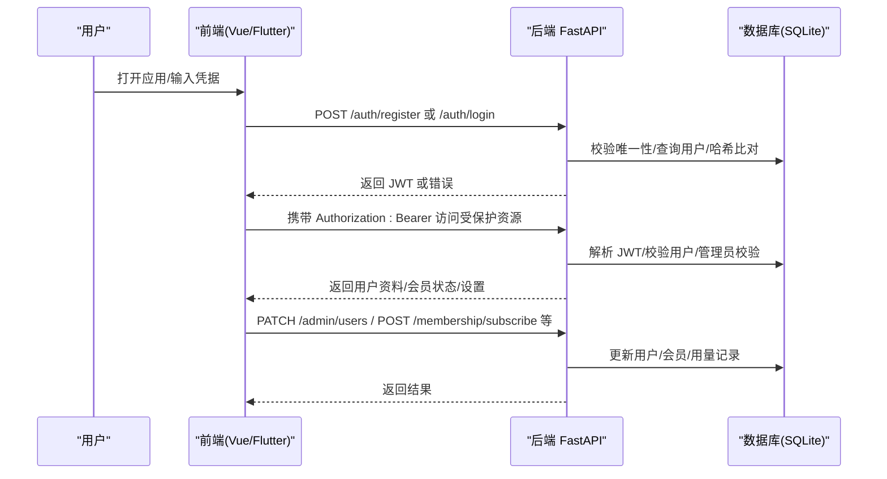
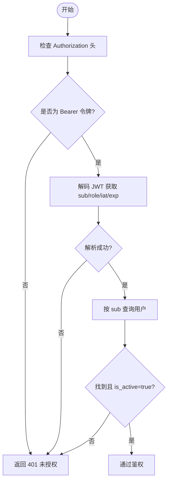
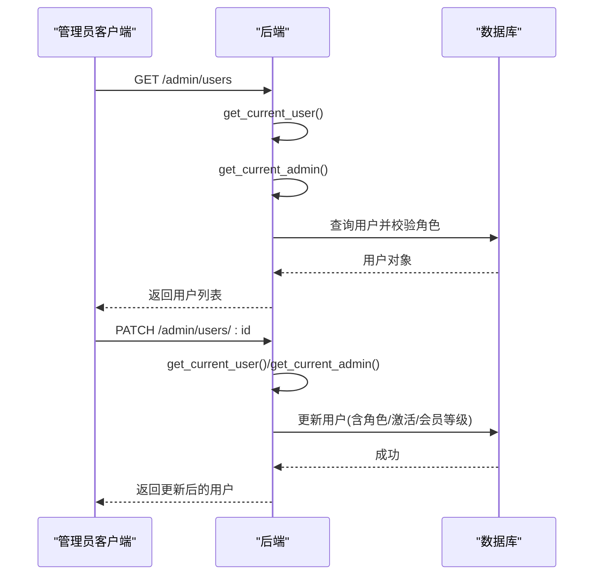
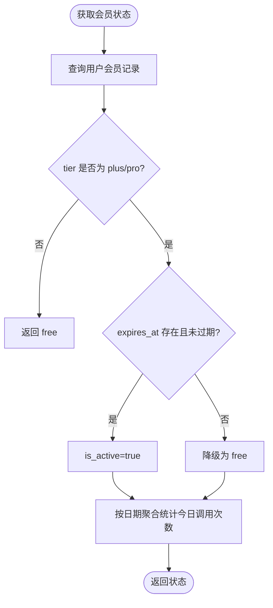
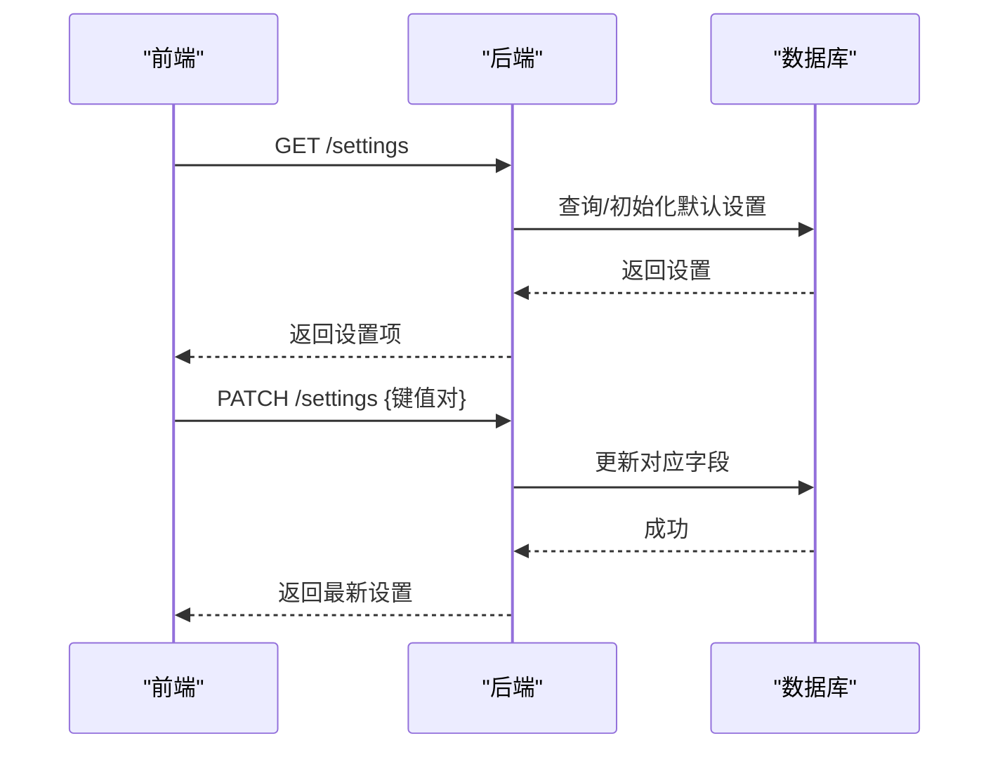
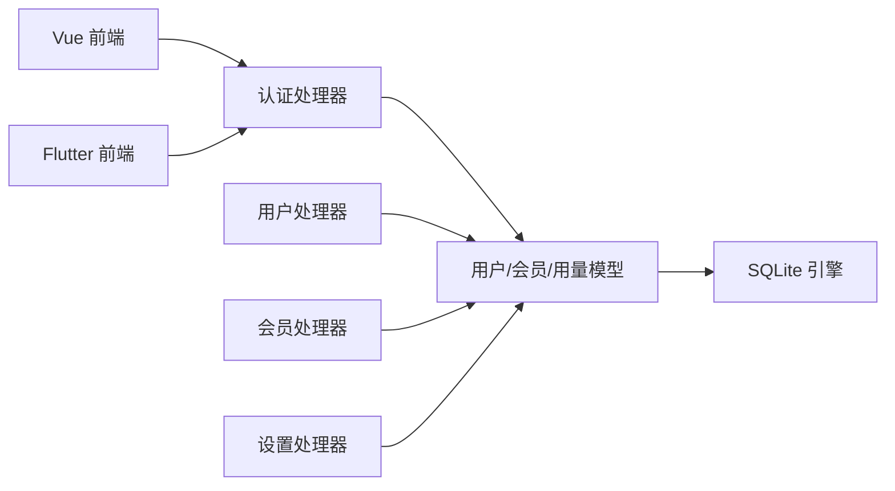
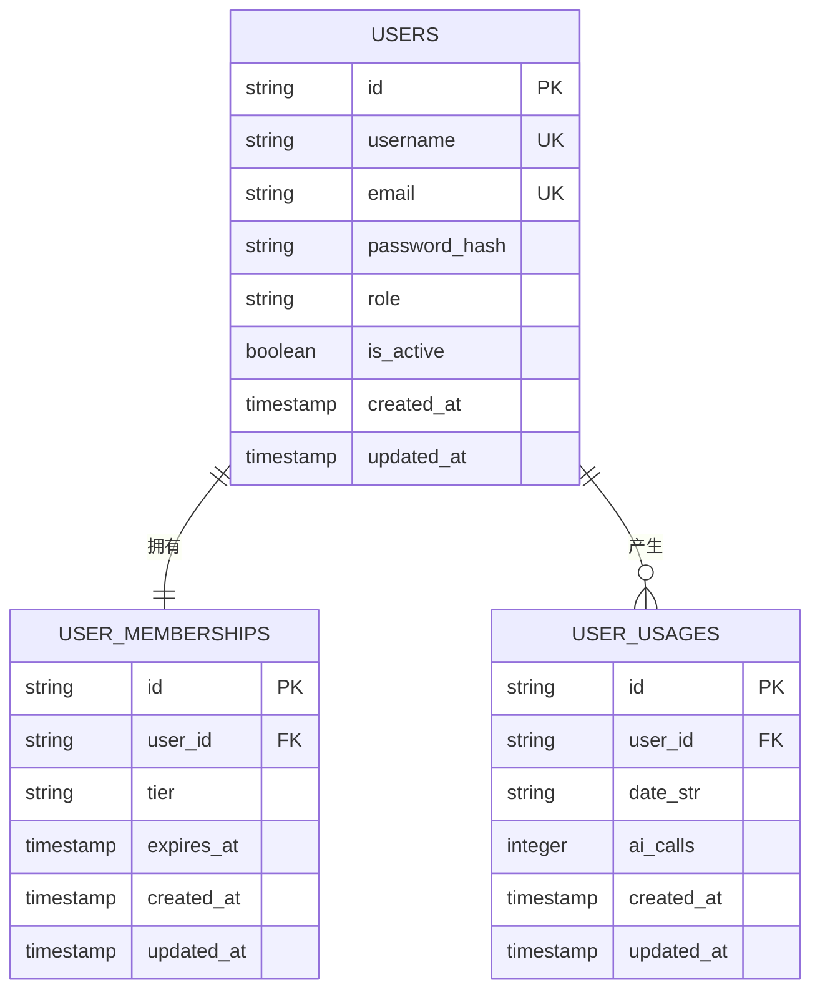

# 用户管理体系

<cite>
**本文引用的文件**
- [python-backend/app/handlers/auth.py](file://python-backend/app/handlers/auth.py)
- [python-backend/app/handlers/users.py](file://python-backend/app/handlers/users.py)
- [python-backend/app/handlers/membership.py](file://python-backend/app/handlers/membership.py)
- [python-backend/app/handlers/settings.py](file://python-backend/app/handlers/settings.py)
- [python-backend/app/models.py](file://python-backend/app/models.py)
- [python-backend/app/db.py](file://python-backend/app/db.py)
- [python-backend/app/main.py](file://python-backend/app/main.py)
- [rss-desktop/src/stores/userStore.ts](file://rss-desktop/src/stores/userStore.ts)
- [rss-desktop/src/components/AuthModal.vue](file://rss-desktop/src/components/AuthModal.vue)
- [tan_rss_mobile/lib/features/auth/presentation/auth_providers.dart](file://tan_rss_mobile/lib/features/auth/presentation/auth_providers.dart)
- [tan_rss_mobile/lib/features/auth/data/auth_repository.dart](file://tan_rss_mobile/lib/features/auth/data/auth_repository.dart)
- [tan_rss_mobile/lib/core/api/api_client.dart](file://tan_rss_mobile/lib/core/api/api_client.dart)
- [tan_rss_mobile/lib/features/feed/presentation/membership_screen.dart](file://tan_rss_mobile/lib/features/feed/presentation/membership_screen.dart)
- [tan_rss_mobile/lib/features/feed/presentation/ai_settings_screen.dart](file://tan_rss_mobile/lib/features/feed/presentation/ai_settings_screen.dart)
- [tan_rss_mobile/lib/features/feed/presentation/user_management_screen.dart](file://tan_rss_mobile/lib/features/feed/presentation/user_management_screen.dart)
- [rss-desktop/src/views/AdminUsers.vue](file://rss-desktop/src/views/AdminUsers.vue)
- [python-backend/app/config.py](file://python-backend/app/config.py)
</cite>

## 目录
1. [简介](#简介)
2. [项目结构](#项目结构)
3. [核心组件](#核心组件)
4. [架构总览](#架构总览)
5. [详细组件分析](#详细组件分析)
6. [依赖分析](#依赖分析)
7. [性能考量](#性能考量)
8. [故障排查指南](#故障排查指南)
9. [结论](#结论)
10. [附录](#附录)

## 简介
本文件系统化梳理 Tan RSS Reader 的用户管理体系，覆盖认证与会话、权限控制、会员体系、用户设置、第三方登录与单点登录、数据保护与隐私合规、以及用户行为追踪与统计分析等主题。文档以代码为依据，结合前后端实现，提供可操作的架构图与流程图，帮助开发者与运营人员快速理解与落地。

## 项目结构
用户相关能力由后端 FastAPI 提供 REST 接口，前端 Vue 与 Flutter 分别在桌面端与移动端消费接口，形成统一的用户生命周期闭环。

图表来源
- [python-backend/app/main.py:44-62](file://python-backend/app/main.py#L44-L62)
- [python-backend/app/handlers/auth.py:126-174](file://python-backend/app/handlers/auth.py#L126-L174)
- [python-backend/app/handlers/users.py:30-149](file://python-backend/app/handlers/users.py#L30-L149)
- [python-backend/app/handlers/membership.py:28-113](file://python-backend/app/handlers/membership.py#L28-L113)
- [python-backend/app/handlers/settings.py:20-161](file://python-backend/app/handlers/settings.py#L20-L161)
- [python-backend/app/models.py:168-228](file://python-backend/app/models.py#L168-L228)
- [rss-desktop/src/stores/userStore.ts:14-143](file://rss-desktop/src/stores/userStore.ts#L14-L143)
- [tan_rss_mobile/lib/features/auth/presentation/auth_providers.dart:47-123](file://tan_rss_mobile/lib/features/auth/presentation/auth_providers.dart#L47-L123)
- [tan_rss_mobile/lib/features/auth/data/auth_repository.dart:15-100](file://tan_rss_mobile/lib/features/auth/data/auth_repository.dart#L15-L100)
- [tan_rss_mobile/lib/core/api/api_client.dart:26-42](file://tan_rss_mobile/lib/core/api/api_client.dart#L26-L42)

章节来源
- [python-backend/app/main.py:44-62](file://python-backend/app/main.py#L44-L62)
- [python-backend/app/db.py:11-27](file://python-backend/app/db.py#L11-L27)
- [python-backend/app/models.py:168-228](file://python-backend/app/models.py#L168-L228)

## 核心组件
- 认证与会话
  - JWT 令牌签发与校验、密码哈希与验证、Bearer 令牌传递与拦截、管理员中间件
- 权限控制
  - 角色字段、管理员校验、用户自我权限限制
- 会员体系
  - 等级与有效期、订阅与续期、当日调用次数统计
- 用户设置
  - 全局应用设置读取与更新、RSSHub 地址测试与校验
- 前端会话与持久化
  - 桌面端本地存储、移动端安全存储与拦截器、乐观登录与静默刷新

章节来源
- [python-backend/app/handlers/auth.py:76-125](file://python-backend/app/handlers/auth.py#L76-L125)
- [python-backend/app/handlers/users.py:68-124](file://python-backend/app/handlers/users.py#L68-L124)
- [python-backend/app/handlers/membership.py:28-113](file://python-backend/app/handlers/membership.py#L28-L113)
- [python-backend/app/handlers/settings.py:20-161](file://python-backend/app/handlers/settings.py#L20-L161)
- [rss-desktop/src/stores/userStore.ts:14-87](file://rss-desktop/src/stores/userStore.ts#L14-L87)
- [tan_rss_mobile/lib/core/api/api_client.dart:26-42](file://tan_rss_mobile/lib/core/api/api_client.dart#L26-L42)

## 架构总览
下图展示用户从注册/登录到使用会员功能与管理后台的完整链路。

图表来源
- [python-backend/app/handlers/auth.py:126-174](file://python-backend/app/handlers/auth.py#L126-L174)
- [python-backend/app/handlers/users.py:41-124](file://python-backend/app/handlers/users.py#L41-L124)
- [python-backend/app/handlers/membership.py:28-113](file://python-backend/app/handlers/membership.py#L28-L113)
- [python-backend/app/handlers/settings.py:20-87](file://python-backend/app/handlers/settings.py#L20-L87)
- [tan_rss_mobile/lib/core/api/api_client.dart:26-42](file://tan_rss_mobile/lib/core/api/api_client.dart#L26-L42)

## 详细组件分析

### 认证与会话（JWT、密码、会话）
- JWT 令牌
  - 签发：包含 sub、role、iat、exp；密钥与过期时间来自环境变量
  - 校验：请求头携带 Bearer 令牌，后端解码并按用户 ID 查询用户，检查是否激活
- 密码处理
  - 注册时使用 bcrypt 哈希存储；登录时比对哈希
- 会话与拦截器
  - 前端在请求头注入 Authorization: Bearer token；401 自动清理本地状态
  - 移动端还进行本地 token 过期检测与清理

图表来源
- [python-backend/app/handlers/auth.py:91-125](file://python-backend/app/handlers/auth.py#L91-L125)
- [tan_rss_mobile/lib/core/api/api_client.dart:26-42](file://tan_rss_mobile/lib/core/api/api_client.dart#L26-L42)

章节来源
- [python-backend/app/handlers/auth.py:76-125](file://python-backend/app/handlers/auth.py#L76-L125)
- [tan_rss_mobile/lib/core/api/api_client.dart:26-42](file://tan_rss_mobile/lib/core/api/api_client.dart#L26-L42)

### 权限控制系统（角色、管理员、访问控制）
- 角色定义
  - 用户表含 role 字段，默认 user；首个用户默认 admin
- 管理员校验
  - 提供 get_current_admin 中间件，非 admin 直接 403
- 自我权限限制
  - 管理员禁止自我降级或停用账户
- 受保护端点
  - 管理端用户列表、更新、删除均需管理员权限

图表来源
- [python-backend/app/handlers/users.py:41-124](file://python-backend/app/handlers/users.py#L41-L124)
- [python-backend/app/handlers/auth.py:106-109](file://python-backend/app/handlers/auth.py#L106-L109)

章节来源
- [python-backend/app/handlers/users.py:68-124](file://python-backend/app/handlers/users.py#L68-L124)
- [python-backend/app/handlers/auth.py:106-109](file://python-backend/app/handlers/auth.py#L106-L109)

### 会员系统（等级、订阅、功能权限）
- 等级与有效期
  - 用户会员表包含 tier 与 expires_at；到期或非 plus/pro 视为 free
- 订阅与续期
  - 支持 plus/pro/free；续费按月累加；free 降级清除到期时间
- 功能权限
  - 会员状态决定是否可使用平台 AI 能力及调用配额
- 当日调用统计
  - 按 user_id_YYYY-MM-DD 聚合统计 AI 调用次数

图表来源
- [python-backend/app/handlers/membership.py:28-57](file://python-backend/app/handlers/membership.py#L28-L57)
- [python-backend/app/models.py:179-196](file://python-backend/app/models.py#L179-L196)

章节来源
- [python-backend/app/handlers/membership.py:28-113](file://python-backend/app/handlers/membership.py#L28-L113)
- [python-backend/app/models.py:179-196](file://python-backend/app/models.py#L179-L196)

### 用户设置管理（个性化、偏好、导出）
- 全局设置
  - 读取/更新应用设置；支持动态刷新调度器
- RSSHub 配置
  - 设置/校验 RSSHub 地址；快速连通性测试
- 偏好与个性化
  - 移动端通过 SharedPreferences 存储交互、外观、语言等偏好；桌面端通过本地状态管理

图表来源
- [python-backend/app/handlers/settings.py:20-87](file://python-backend/app/handlers/settings.py#L20-L87)
- [tan_rss_mobile/lib/features/feed/presentation/interaction_settings_screen.dart:32-88](file://tan_rss_mobile/lib/features/feed/presentation/interaction_settings_screen.dart#L32-L88)

章节来源
- [python-backend/app/handlers/settings.py:20-161](file://python-backend/app/handlers/settings.py#L20-L161)
- [tan_rss_mobile/lib/features/feed/presentation/interaction_settings_screen.dart:32-88](file://tan_rss_mobile/lib/features/feed/presentation/interaction_settings_screen.dart#L32-L88)

### OAuth 第三方登录、社交账号绑定与 SSO
- 现状
  - 后端仅实现基于用户名/密码的本地认证；未发现 OAuth/SSO 相关处理器或路由
- 建议
  - 引入 OAuth 登录端点与社交账号绑定流程；确保令牌安全存储与刷新策略

章节来源
- [python-backend/app/handlers/auth.py:126-174](file://python-backend/app/handlers/auth.py#L126-L174)

### 用户数据保护、隐私设置与合规
- 数据库与存储
  - SQLite 本地存储；移动端使用安全存储保存令牌
- 敏感字段
  - 密码经 bcrypt 哈希；JWT 密钥与过期时间来自环境变量
- 合规建议
  - 明示隐私政策；提供数据删除与导出接口；最小化收集原则

章节来源
- [python-backend/app/db.py:11-27](file://python-backend/app/db.py#L11-L27)
- [tan_rss_mobile/lib/core/api/api_client.dart:8-11](file://tan_rss_mobile/lib/core/api/api_client.dart#L8-L11)

### 用户行为追踪、统计分析与营销
- 行为追踪
  - 会员系统内置当日 AI 调用计数；可用于统计与风控
- 统计分析
  - 可扩展：按用户维度聚合阅读时长、订阅数、标签偏好等指标
- 营销功能
  - 会员等级与订阅作为付费转化路径；AI 能力作为差异化卖点

章节来源
- [python-backend/app/handlers/membership.py:46-57](file://python-backend/app/handlers/membership.py#L46-L57)

## 依赖分析
- 后端依赖
  - FastAPI 路由注册、CORS、数据库引擎与会话、Pydantic 模型、bcrypt/jwt
- 前端依赖
  - Pinia/Vue 状态管理、Riverpod 状态管理、Dio 拦截器、Flutter Secure Storage

图表来源
- [python-backend/app/handlers/auth.py:126-174](file://python-backend/app/handlers/auth.py#L126-L174)
- [python-backend/app/handlers/users.py:30-149](file://python-backend/app/handlers/users.py#L30-L149)
- [python-backend/app/handlers/membership.py:28-113](file://python-backend/app/handlers/membership.py#L28-L113)
- [python-backend/app/handlers/settings.py:20-161](file://python-backend/app/handlers/settings.py#L20-L161)
- [python-backend/app/models.py:168-228](file://python-backend/app/models.py#L168-L228)
- [python-backend/app/db.py:24-27](file://python-backend/app/db.py#L24-L27)

章节来源
- [python-backend/app/main.py:44-62](file://python-backend/app/main.py#L44-L62)
- [python-backend/app/models.py:168-228](file://python-backend/app/models.py#L168-L228)

## 性能考量
- 数据库
  - 使用异步 SQLAlchemy 引擎；注意外连接查询与分页参数上限
- 网络
  - 前端拦截器统一注入令牌；避免重复请求；移动端对 401 自动清理
- 缓存
  - 可引入 Redis 缓存热点用户资料与设置；减少数据库压力
- 并发
  - 令牌过期与并发登录场景需完善幂等与互斥逻辑

## 故障排查指南
- 401 未授权
  - 检查 Authorization 头是否为 Bearer 令牌；确认 JWT 未过期；核对用户是否激活
- 403 禁止访问
  - 管理员权限不足；确认角色为 admin
- 注册冲突
  - 用户名/邮箱唯一性冲突；检查前端提示与后端异常
- 会员状态异常
  - 检查会员表 expires_at 与 tier；确认当日用量统计键格式

章节来源
- [python-backend/app/handlers/auth.py:91-125](file://python-backend/app/handlers/auth.py#L91-L125)
- [python-backend/app/handlers/users.py:68-124](file://python-backend/app/handlers/users.py#L68-L124)
- [python-backend/app/handlers/membership.py:28-113](file://python-backend/app/handlers/membership.py#L28-L113)

## 结论
Tan RSS Reader 的用户管理体系以 JWT 为基础，结合 bcrypt 密码哈希与管理员中间件，实现了清晰的认证与权限控制；会员体系通过 tier 与有效期管理，配合当日调用统计，支撑了功能权限与商业化路径；前端通过拦截器与本地存储保障会话一致性。后续可在 OAuth/SSO、隐私合规与行为分析方面进一步完善。

## 附录
- 环境变量与配置
  - 认证密钥与过期时间、数据库 URL、AI 服务配置、RSSHub 默认地址等
- 数据模型概览

图表来源
- [python-backend/app/models.py:168-196](file://python-backend/app/models.py#L168-L196)