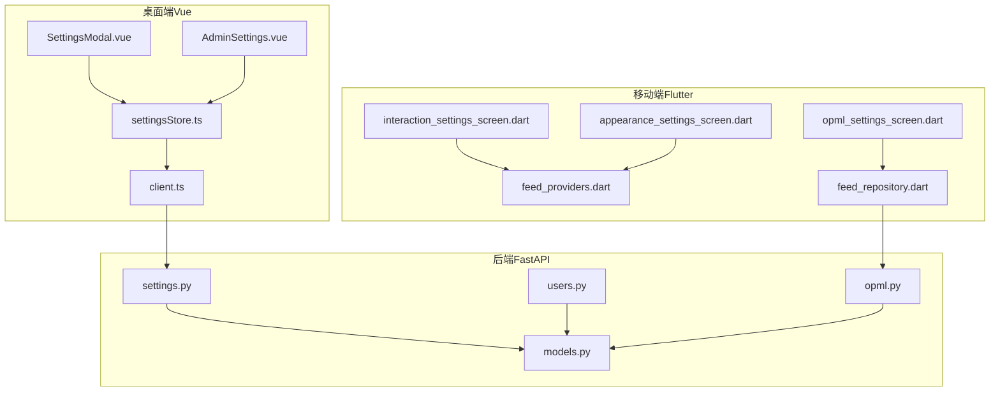
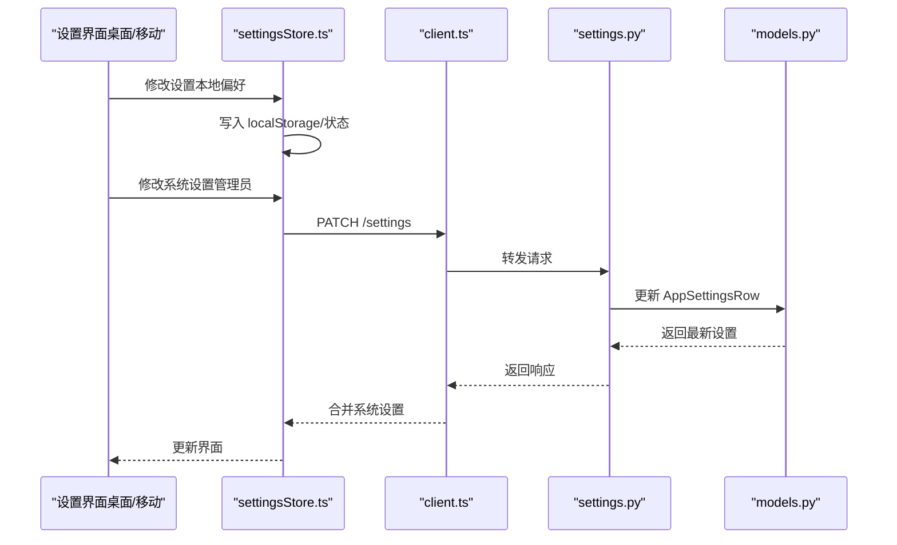
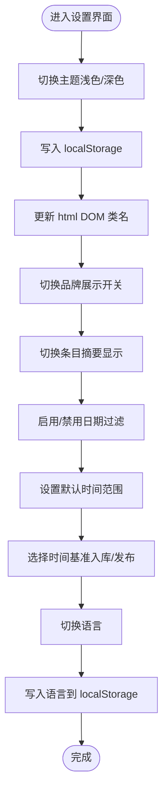
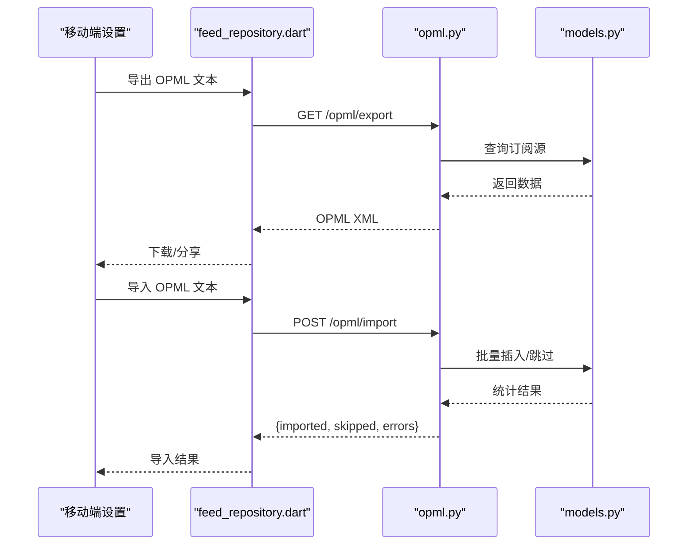
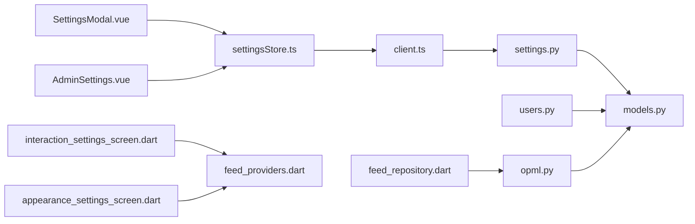

# 用户设置管理

<cite>
**本文档引用的文件**
- [settingsStore.ts](file://rss-desktop/src/stores/settingsStore.ts)
- [SettingsModal.vue](file://rss-desktop/src/components/SettingsModal.vue)
- [AdminSettings.vue](file://rss-desktop/src/views/AdminSettings.vue)
- [settings.py](file://python-backend/app/handlers/settings.py)
- [models.py](file://python-backend/app/models.py)
- [client.ts](file://rss-desktop/src/api/client.ts)
- [index.ts](file://rss-desktop/src/i18n/index.ts)
- [useLanguage.ts](file://rss-desktop/src/composables/useLanguage.ts)
- [translation.ts](file://rss-desktop/src/constants/translation.ts)
- [zh-CN.json](file://rss-desktop/src/i18n/locales/zh-CN.json)
- [users.py](file://python-backend/app/handlers/users.py)
- [opml.py](file://python-backend/app/handlers/opml.py)
- [feed_repository.dart](file://tan_rss_mobile/lib/features/feed/data/feed_repository.dart)
- [opml_settings_screen.dart](file://tan_rss_mobile/lib/features/feed/presentation/opml_settings_screen.dart)
- [interaction_settings_screen.dart](file://tan_rss_mobile/lib/features/feed/presentation/interaction_settings_screen.dart)
- [appearance_settings_screen.dart](file://tan_rss_mobile/lib/features/feed/presentation/appearance_settings_screen.dart)
- [feed_providers.dart](file://tan_rss_mobile/lib/features/feed/presentation/feed_providers.dart)
</cite>

## 目录
1. [简介](#简介)
2. [项目结构](#项目结构)
3. [核心组件](#核心组件)
4. [架构总览](#架构总览)
5. [详细组件分析](#详细组件分析)
6. [依赖关系分析](#依赖关系分析)
7. [性能考量](#性能考量)
8. [故障排查指南](#故障排查指南)
9. [结论](#结论)
10. [附录](#附录)

## 简介
本文件面向 Tan RSS Reader 的用户设置管理，系统性梳理个性化配置、阅读偏好、数据管理、隐私设置、设置同步与备份恢复、设置迁移与批量操作等能力。文档以代码为依据，结合前端 Vue Store、后端 FastAPI 接口与移动端 Flutter 设置项，提供可操作的使用指南与技术实现说明。

## 项目结构
设置管理涉及三层：
- 前端（Vue + Pinia）：负责用户界面、本地持久化与状态管理
- 后端（FastAPI）：提供系统级设置接口与数据库持久化
- 移动端（Flutter Riverpod）：提供本地设置持久化与部分设置入口

**图表来源**
- [SettingsModal.vue:1-513](file://rss-desktop/src/components/SettingsModal.vue#L1-L513)
- [settingsStore.ts:1-202](file://rss-desktop/src/stores/settingsStore.ts#L1-L202)
- [AdminSettings.vue:1-200](file://rss-desktop/src/views/AdminSettings.vue#L1-L200)
- [client.ts:1-29](file://rss-desktop/src/api/client.ts#L1-L29)
- [settings.py:1-161](file://python-backend/app/handlers/settings.py#L1-L161)
- [models.py:82-96](file://python-backend/app/models.py#L82-L96)
- [users.py:1-149](file://python-backend/app/handlers/users.py#L1-L149)
- [opml.py:43-81](file://python-backend/app/handlers/opml.py#L43-L81)
- [interaction_settings_screen.dart:1-88](file://tan_rss_mobile/lib/features/feed/presentation/interaction_settings_screen.dart#L1-L88)
- [appearance_settings_screen.dart:1-204](file://tan_rss_mobile/lib/features/feed/presentation/appearance_settings_screen.dart#L1-L204)
- [feed_providers.dart:109-178](file://tan_rss_mobile/lib/features/feed/presentation/feed_providers.dart#L109-L178)
- [opml_settings_screen.dart:1-162](file://tan_rss_mobile/lib/features/feed/presentation/opml_settings_screen.dart#L1-L162)
- [feed_repository.dart:210-248](file://tan_rss_mobile/lib/features/feed/data/feed_repository.dart#L210-L248)

**章节来源**
- [settingsStore.ts:1-202](file://rss-desktop/src/stores/settingsStore.ts#L1-L202)
- [settings.py:1-161](file://python-backend/app/handlers/settings.py#L1-L161)
- [models.py:82-96](file://python-backend/app/models.py#L82-L96)

## 核心组件
- 应用设置 Store（桌面端）：集中管理主题、显示偏好、翻译显示模式、品牌展示开关、日期过滤、默认时间范围、时间基准、RSSHub URL 等，并提供乐观更新与本地持久化。
- 管理员设置页（桌面端）：提供系统级设置入口，包括刷新间隔、AI 配置、RSSHub URL 测试、OPML 导入导出等。
- 后端设置接口：提供系统设置的读取与更新、RSSHub URL 管理与连通性测试。
- 国际化与语言设置：提供多语言切换与本地持久化。
- 移动端设置：提供交互、外观、OPML 导入导出等本地设置项。

**章节来源**
- [settingsStore.ts:6-23](file://rss-desktop/src/stores/settingsStore.ts#L6-L23)
- [AdminSettings.vue:65-120](file://rss-desktop/src/views/AdminSettings.vue#L65-L120)
- [settings.py:20-87](file://python-backend/app/handlers/settings.py#L20-L87)
- [index.ts:16-35](file://rss-desktop/src/i18n/index.ts#L16-L35)
- [useLanguage.ts:10-49](file://rss-desktop/src/composables/useLanguage.ts#L10-L49)

## 架构总览
设置管理采用“前端 Store + 后端接口 + 数据库”的分层设计：
- 前端 Store 负责本地偏好与乐观更新；系统级设置通过后端接口同步。
- 后端接口对管理员开放，提供系统级配置与测试能力。
- 移动端设置主要通过本地持久化实现，部分入口与桌面端互通。

**图表来源**
- [settingsStore.ts:110-179](file://rss-desktop/src/stores/settingsStore.ts#L110-L179)
- [client.ts:1-29](file://rss-desktop/src/api/client.ts#L1-L29)
- [settings.py:58-87](file://python-backend/app/handlers/settings.py#L58-L87)
- [models.py:82-96](file://python-backend/app/models.py#L82-L96)

## 详细组件分析

### 个性化配置管理（界面主题、语言设置、显示偏好）
- 主题与品牌展示
  - 主题：支持浅色/深色切换，写入 localStorage 并动态更新 DOM 类名。
  - 品牌展示开关：本地持久化，影响界面品牌元素显示。
- 显示偏好
  - 条目摘要显示：控制时间线中是否显示摘要预览。
  - 日期过滤：启用/禁用时间范围过滤，默认时间范围、时间基准（入库时间/发布时间）。
- 翻译显示模式
  - 支持替换模式与双语对照（原文在上/译文在上），本地持久化。
- 语言设置
  - 通过 i18n 与语言组合式函数实现，切换时写入 localStorage 并同步当前语言。

**图表来源**
- [settingsStore.ts:49-57](file://rss-desktop/src/stores/settingsStore.ts#L49-L57)
- [SettingsModal.vue:114-201](file://rss-desktop/src/components/SettingsModal.vue#L114-L201)
- [index.ts:16-35](file://rss-desktop/src/i18n/index.ts#L16-L35)
- [useLanguage.ts:24-47](file://rss-desktop/src/composables/useLanguage.ts#L24-L47)

**章节来源**
- [settingsStore.ts:25-57](file://rss-desktop/src/stores/settingsStore.ts#L25-L57)
- [SettingsModal.vue:114-201](file://rss-desktop/src/components/SettingsModal.vue#L114-L201)
- [index.ts:16-35](file://rss-desktop/src/i18n/index.ts#L16-L35)
- [useLanguage.ts:10-49](file://rss-desktop/src/composables/useLanguage.ts#L10-L49)

### 阅读偏好设置（字体大小、阅读模式、通知配置、快捷键设置）
- 字体大小与阅读模式
  - 桌面端：通过主题与显示偏好控制条目摘要与时间范围，间接影响阅读体验。
  - 移动端：提供交互设置（滚动标记已读、懒加载详情、外部浏览器等）与外观设置（视图模式、主题模式、AMOLED 黑色模式、配色风格）。
- 通知配置
  - 当前代码未发现专门的通知设置项；若需通知，建议通过系统通知权限与浏览器/操作系统设置进行管理。
- 快捷键设置
  - 未发现快捷键设置项；若需快捷键，可在浏览器扩展或系统层面配置。

**章节来源**
- [interaction_settings_screen.dart:1-88](file://tan_rss_mobile/lib/features/feed/presentation/interaction_settings_screen.dart#L1-L88)
- [appearance_settings_screen.dart:1-204](file://tan_rss_mobile/lib/features/feed/presentation/appearance_settings_screen.dart#L1-L204)
- [feed_providers.dart:109-178](file://tan_rss_mobile/lib/features/feed/presentation/feed_providers.dart#L109-L178)

### 数据管理功能（账户信息编辑、密码修改、数据导出）
- 账户信息与密码
  - 桌面端：未发现直接的“修改密码”入口；账户信息可通过后端用户接口查看。
  - 后端用户接口：提供用户信息查询、管理员更新用户角色/状态/层级等能力，密码修改未在当前接口暴露。
- 数据导出
  - OPML 导出：桌面端与移动端均提供 OPML 导出入口，便于跨平台迁移订阅源。
  - 导入：支持从文件或文本导入 OPML，自动统计导入/跳过/错误数量。

**图表来源**
- [opml_settings_screen.dart:62-162](file://tan_rss_mobile/lib/features/feed/presentation/opml_settings_screen.dart#L62-L162)
- [feed_repository.dart:218-248](file://tan_rss_mobile/lib/features/feed/data/feed_repository.dart#L218-L248)
- [opml.py:43-81](file://python-backend/app/handlers/opml.py#L43-L81)
- [models.py:1-228](file://python-backend/app/models.py#L1-L228)

**章节来源**
- [users.py:30-149](file://python-backend/app/handlers/users.py#L30-L149)
- [opml_settings_screen.dart:1-162](file://tan_rss_mobile/lib/features/feed/presentation/opml_settings_screen.dart#L1-L162)
- [feed_repository.dart:218-248](file://tan_rss_mobile/lib/features/feed/data/feed_repository.dart#L218-L248)
- [opml.py:43-81](file://python-backend/app/handlers/opml.py#L43-L81)

### 隐私设置选项（数据收集、分享控制、删除请求）
- 数据收集与分享
  - 代码中未发现显式的“数据收集/分享控制”开关；若涉及第三方服务（如 AI 翻译/摘要），请参考对应服务的隐私政策。
- 删除请求
  - 后端提供删除用户的接口，但需注意删除行为与数据保留策略，建议在生产环境中谨慎处理用户数据删除与合规要求。

**章节来源**
- [users.py:126-149](file://python-backend/app/handlers/users.py#L126-L149)

### 设置同步机制、跨设备一致性与备份恢复
- 同步与一致性
  - 前端 Store 优先读取本地存储（localStorage），再尝试拉取系统设置；更新时仅对系统设置发起后端请求，本地偏好即时生效。
  - 管理员可统一修改系统设置（如刷新间隔、条目数、RSSHub URL、标题翻译并发限制），后端持久化并广播给各端。
- 备份与恢复
  - 通过 OPML 导出/导入实现订阅源的备份与恢复；用户可将订阅源迁移到其他平台或同一平台的另一台设备。
  - 语言与显示偏好等本地设置由浏览器 localStorage 保存，更换设备后可手动导入 OPML 恢复订阅源。

**章节来源**
- [settingsStore.ts:60-108](file://rss-desktop/src/stores/settingsStore.ts#L60-L108)
- [settings.py:20-87](file://python-backend/app/handlers/settings.py#L20-L87)
- [opml.py:43-81](file://python-backend/app/handlers/opml.py#L43-L81)

### 设置迁移、批量操作与高级配置
- 设置迁移
  - 订阅源迁移：使用 OPML 导出/导入完成跨设备/跨平台迁移。
  - 本地设置迁移：语言与显示偏好依赖 localStorage，可随浏览器同步或手动备份。
- 批量操作
  - OPML 导入支持批量订阅源导入，自动统计导入/跳过/错误数量，便于批量迁移与整理。
- 高级配置
  - 管理员可配置刷新间隔、RSSHub URL、AI 服务参数与翻译显示模式等系统级设置。
  - 标题翻译并发限制具备智能上限与范围约束，避免过度消耗服务资源。

**章节来源**
- [AdminSettings.vue:691-727](file://rss-desktop/src/views/AdminSettings.vue#L691-L727)
- [settings.py:58-87](file://python-backend/app/handlers/settings.py#L58-L87)
- [translation.ts:13-46](file://rss-desktop/src/constants/translation.ts#L13-L46)

## 依赖关系分析
- 前端依赖
  - settingsStore.ts 依赖 axios 客户端与本地存储，负责乐观更新与错误处理。
  - SettingsModal.vue 与 AdminSettings.vue 通过 Pinia Store 与 i18n 实现设置界面与国际化。
- 后端依赖
  - settings.py 依赖 SQLAlchemy 模型 AppSettingsRow，提供系统设置的增删改查与测试接口。
  - users.py 提供用户信息与权限管理，配合设置更新的鉴权。
- 移动端依赖
  - shared_preferences 提供本地设置持久化；OPML 导入导出通过仓库层调用后端接口。

**图表来源**
- [settingsStore.ts:1-202](file://rss-desktop/src/stores/settingsStore.ts#L1-L202)
- [client.ts:1-29](file://rss-desktop/src/api/client.ts#L1-L29)
- [settings.py:1-161](file://python-backend/app/handlers/settings.py#L1-L161)
- [models.py:82-96](file://python-backend/app/models.py#L82-L96)
- [SettingsModal.vue:1-513](file://rss-desktop/src/components/SettingsModal.vue#L1-L513)
- [AdminSettings.vue:1-200](file://rss-desktop/src/views/AdminSettings.vue#L1-L200)
- [users.py:1-149](file://python-backend/app/handlers/users.py#L1-L149)
- [opml.py:43-81](file://python-backend/app/handlers/opml.py#L43-L81)
- [feed_repository.dart:218-248](file://tan_rss_mobile/lib/features/feed/data/feed_repository.dart#L218-L248)
- [interaction_settings_screen.dart:1-88](file://tan_rss_mobile/lib/features/feed/presentation/interaction_settings_screen.dart#L1-L88)
- [appearance_settings_screen.dart:1-204](file://tan_rss_mobile/lib/features/feed/presentation/appearance_settings_screen.dart#L1-L204)
- [feed_providers.dart:109-178](file://tan_rss_mobile/lib/features/feed/presentation/feed_providers.dart#L109-L178)

**章节来源**
- [settingsStore.ts:1-202](file://rss-desktop/src/stores/settingsStore.ts#L1-L202)
- [settings.py:1-161](file://python-backend/app/handlers/settings.py#L1-L161)
- [models.py:82-96](file://python-backend/app/models.py#L82-L96)
- [feed_repository.dart:218-248](file://tan_rss_mobile/lib/features/feed/data/feed_repository.dart#L218-L248)

## 性能考量
- 前端乐观更新：系统设置变更时先更新本地状态，减少等待时间；若后端失败则回滚，保障一致性。
- 翻译并发限制：根据网络连接类型与下行速度自动推荐并发数，避免过度请求导致延迟或失败。
- 请求超时与错误处理：统一拦截 401 未授权事件，引导登出流程，避免无效重试。

**章节来源**
- [settingsStore.ts:110-179](file://rss-desktop/src/stores/settingsStore.ts#L110-L179)
- [translation.ts:27-64](file://rss-desktop/src/constants/translation.ts#L27-L64)
- [client.ts:17-26](file://rss-desktop/src/api/client.ts#L17-L26)

## 故障排查指南
- 设置无法保存
  - 检查网络与后端接口可用性；查看前端错误提示与控制台日志。
  - 若为管理员权限错误（403），确认当前登录用户角色是否具备修改系统设置的权限。
- 语言切换无效
  - 确认 localStorage 中语言键值是否正确写入；检查 i18n 初始化逻辑。
- OPML 导入失败
  - 确认文件格式与编码（UTF-8/Latin-1），查看后端导入接口返回的错误列表。
- RSSHub 连接测试失败
  - 检查 RSSHub URL 是否正确且可访问；查看测试接口返回的响应时间、条目数与错误信息。

**章节来源**
- [settingsStore.ts:164-178](file://rss-desktop/src/stores/settingsStore.ts#L164-L178)
- [index.ts:16-35](file://rss-desktop/src/i18n/index.ts#L16-L35)
- [opml.py:43-81](file://python-backend/app/handlers/opml.py#L43-L81)
- [AdminSettings.vue:168-200](file://rss-desktop/src/views/AdminSettings.vue#L168-L200)

## 结论
Tan RSS Reader 的用户设置管理以“前端 Store + 后端接口 + 数据库”为核心，实现了本地偏好与系统设置的分离、管理员权限下的系统级配置、以及通过 OPML 的订阅源迁移能力。通过乐观更新与本地持久化，提升了用户体验；通过翻译并发限制与网络感知，兼顾性能与稳定性。建议在生产环境中完善用户数据删除与隐私控制选项，并持续优化跨设备的一致性与可移植性。

## 附录
- 关键术语
  - 本地偏好：仅影响当前设备的设置（如主题、语言、显示偏好）。
  - 系统设置：由管理员统一配置并对全平台生效（如刷新间隔、RSSHub URL、标题翻译并发限制）。
- 常用路径
  - 设置 Store：[settingsStore.ts:1-202](file://rss-desktop/src/stores/settingsStore.ts#L1-L202)
  - 设置界面（桌面）：[SettingsModal.vue:1-513](file://rss-desktop/src/components/SettingsModal.vue#L1-L513)、[AdminSettings.vue:1-200](file://rss-desktop/src/views/AdminSettings.vue#L1-L200)
  - 后端设置接口：[settings.py:1-161](file://python-backend/app/handlers/settings.py#L1-L161)
  - 用户与权限：[users.py:1-149](file://python-backend/app/handlers/users.py#L1-L149)
  - OPML 导入导出：[opml.py:43-81](file://python-backend/app/handlers/opml.py#L43-L81)、[feed_repository.dart:218-248](file://tan_rss_mobile/lib/features/feed/data/feed_repository.dart#L218-L248)
  - 国际化：[index.ts:1-35](file://rss-desktop/src/i18n/index.ts#L1-L35)、[useLanguage.ts:1-49](file://rss-desktop/src/composables/useLanguage.ts#L1-L49)
  - 移动端设置：[interaction_settings_screen.dart:1-88](file://tan_rss_mobile/lib/features/feed/presentation/interaction_settings_screen.dart#L1-L88)、[appearance_settings_screen.dart:1-204](file://tan_rss_mobile/lib/features/feed/presentation/appearance_settings_screen.dart#L1-L204)、[feed_providers.dart:109-178](file://tan_rss_mobile/lib/features/feed/presentation/feed_providers.dart#L109-L178)