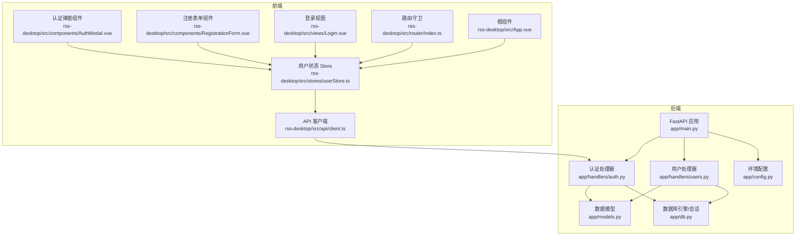
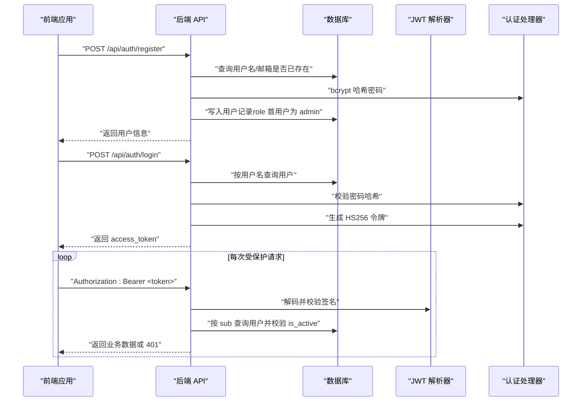
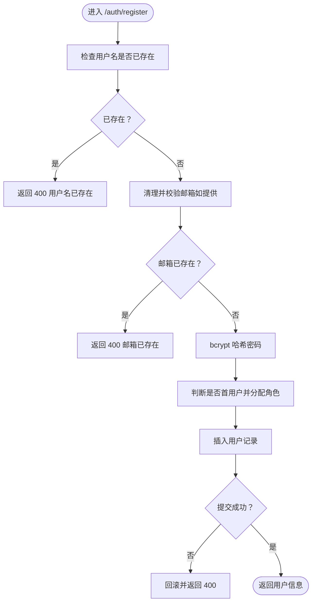
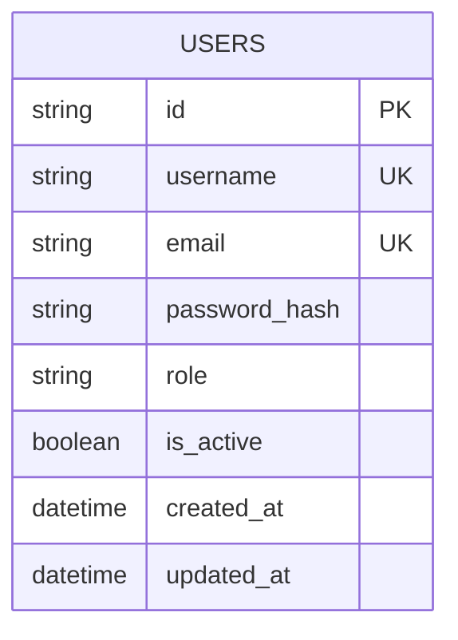
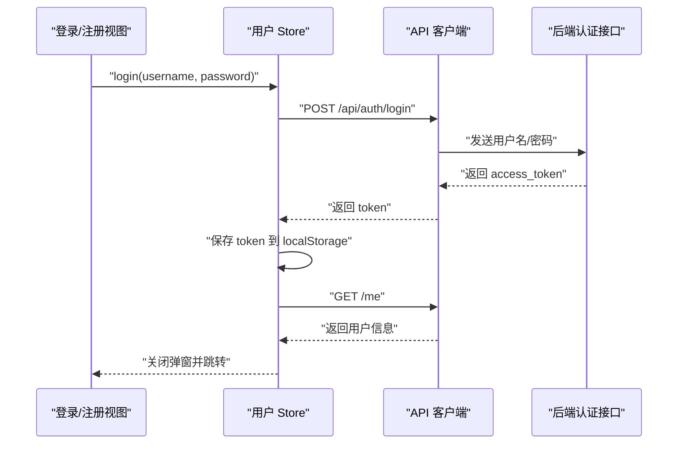
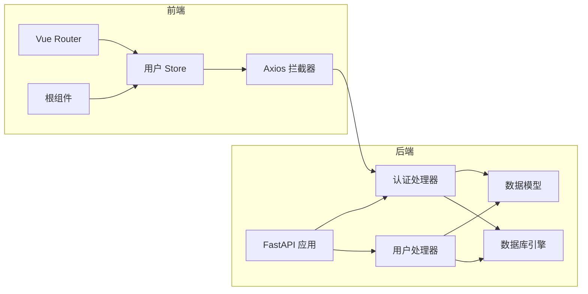

# 认证系统

<cite>
**本文引用的文件**
- [auth.py](file://python-backend/app/handlers/auth.py)
- [models.py](file://python-backend/app/models.py)
- [db.py](file://python-backend/app/db.py)
- [config.py](file://python-backend/app/config.py)
- [users.py](file://python-backend/app/handlers/users.py)
- [main.py](file://python-backend/app/main.py)
- [client.ts](file://rss-desktop/src/api/client.ts)
- [userStore.ts](file://rss-desktop/src/stores/userStore.ts)
- [AuthModal.vue](file://rss-desktop/src/components/AuthModal.vue)
- [RegistrationForm.vue](file://rss-desktop/src/components/RegistrationForm.vue)
- [Login.vue](file://rss-desktop/src/views/Login.vue)
- [index.ts](file://rss-desktop/src/router/index.ts)
- [App.vue](file://rss-desktop/src/App.vue)
</cite>

## 目录
1. [简介](#简介)
2. [项目结构](#项目结构)
3. [核心组件](#核心组件)
4. [架构总览](#架构总览)
5. [详细组件分析](#详细组件分析)
6. [依赖分析](#依赖分析)
7. [性能考虑](#性能考虑)
8. [故障排查指南](#故障排查指南)
9. [结论](#结论)
10. [附录](#附录)

## 简介
本文件面向 Tan RSS Reader 的认证系统，围绕后端 JWT 令牌生成与校验、密码加密（bcrypt）、用户注册与登录流程、权限控制以及前端令牌持久化与拦截器进行系统化说明。文档同时提供安全最佳实践、常见攻击防护建议与调试技巧，帮助开发者在不直接展示代码的前提下理解实现细节与风险控制点。

## 项目结构
认证相关代码主要分布在以下位置：
- 后端 Python FastAPI 应用：认证路由、模型定义、数据库连接与初始化
- 前端 Vue 应用：Axios 请求拦截器、用户状态 Pinia Store、认证弹窗与登录页

图表来源
- [main.py:1-103](file://python-backend/app/main.py#L1-L103)
- [auth.py:1-174](file://python-backend/app/handlers/auth.py#L1-L174)
- [users.py:1-149](file://python-backend/app/handlers/users.py#L1-L149)
- [models.py:168-178](file://python-backend/app/models.py#L168-L178)
- [db.py:1-27](file://python-backend/app/db.py#L1-L27)
- [config.py:41-75](file://python-backend/app/config.py#L41-L75)
- [client.ts:1-29](file://rss-desktop/src/api/client.ts#L1-L29)
- [userStore.ts:1-143](file://rss-desktop/src/stores/userStore.ts#L1-L143)
- [AuthModal.vue:1-236](file://rss-desktop/src/components/AuthModal.vue#L1-L236)
- [RegistrationForm.vue:1-604](file://rss-desktop/src/components/RegistrationForm.vue#L1-L604)
- [Login.vue:1-91](file://rss-desktop/src/views/Login.vue#L1-L91)
- [index.ts:1-77](file://rss-desktop/src/router/index.ts#L1-L77)
- [App.vue:1-333](file://rss-desktop/src/App.vue#L1-L333)

章节来源
- [main.py:1-103](file://python-backend/app/main.py#L1-L103)
- [auth.py:1-174](file://python-backend/app/handlers/auth.py#L1-L174)
- [users.py:1-149](file://python-backend/app/handlers/users.py#L1-L149)
- [models.py:168-178](file://python-backend/app/models.py#L168-L178)
- [db.py:1-27](file://python-backend/app/db.py#L1-L27)
- [config.py:41-75](file://python-backend/app/config.py#L41-L75)
- [client.ts:1-29](file://rss-desktop/src/api/client.ts#L1-L29)
- [userStore.ts:1-143](file://rss-desktop/src/stores/userStore.ts#L1-L143)
- [AuthModal.vue:1-236](file://rss-desktop/src/components/AuthModal.vue#L1-L236)
- [RegistrationForm.vue:1-604](file://rss-desktop/src/components/RegistrationForm.vue#L1-L604)
- [Login.vue:1-91](file://rss-desktop/src/views/Login.vue#L1-L91)
- [index.ts:1-77](file://rss-desktop/src/router/index.ts#L1-L77)
- [App.vue:1-333](file://rss-desktop/src/App.vue#L1-L333)

## 核心组件
- 后端认证处理器
  - JWT 密钥与过期时间：通过环境变量读取密钥与过期分钟数，生成 HS256 签名令牌
  - 密码加密：使用 bcrypt 生成盐值并哈希存储
  - 用户注册：用户名/邮箱唯一性校验、长度与格式校验、首用户自动提升为管理员
  - 登录认证：用户名查询与密码校验，成功后签发访问令牌
  - 身份解析与权限：基于 Authorization 头解析 JWT，校验用户存在且激活；提供管理员权限检查
- 数据模型
  - 用户表包含 id、username、email、password_hash、role、is_active 等字段
- 数据库连接
  - 使用异步 SQLAlchemy 引擎，默认 SQLite（支持自定义数据库 URL）
- 前端认证客户端
  - Axios 请求拦截器自动注入 Bearer 令牌
  - 响应拦截器处理 401 未授权事件，触发全局登出与提示
- 前端用户状态与路由守卫
  - Store 统一管理 token、profile、错误与加载状态
  - 路由守卫根据 requiresAuth/ requiresAdmin 控制页面访问
  - 根组件监听未授权事件，执行登出与弹窗

章节来源
- [auth.py:22-23](file://python-backend/app/handlers/auth.py#L22-L23)
- [auth.py:76-79](file://python-backend/app/handlers/auth.py#L76-L79)
- [auth.py:87-89](file://python-backend/app/handlers/auth.py#L87-L89)
- [auth.py:127-164](file://python-backend/app/handlers/auth.py#L127-L164)
- [auth.py:166-173](file://python-backend/app/handlers/auth.py#L166-L173)
- [auth.py:91-104](file://python-backend/app/handlers/auth.py#L91-L104)
- [auth.py:106-109](file://python-backend/app/handlers/auth.py#L106-L109)
- [models.py:168-178](file://python-backend/app/models.py#L168-L178)
- [db.py:11-25](file://python-backend/app/db.py#L11-L25)
- [client.ts:8-26](file://rss-desktop/src/api/client.ts#L8-L26)
- [userStore.ts:14-87](file://rss-desktop/src/stores/userStore.ts#L14-L87)
- [index.ts:50-74](file://rss-desktop/src/router/index.ts#L50-L74)
- [App.vue:158-162](file://rss-desktop/src/App.vue#L158-L162)

## 架构总览
后端以 FastAPI 提供 REST 接口，前端通过 Axios 发起请求并携带 Bearer 令牌。认证流程贯穿注册、登录、令牌签发、请求拦截与权限校验。

图表来源
- [auth.py:127-164](file://python-backend/app/handlers/auth.py#L127-L164)
- [auth.py:166-173](file://python-backend/app/handlers/auth.py#L166-L173)
- [auth.py:91-104](file://python-backend/app/handlers/auth.py#L91-L104)
- [client.ts:8-15](file://rss-desktop/src/api/client.ts#L8-L15)

## 详细组件分析

### 后端认证处理器（JWT、密码、注册、登录、权限）
- 密钥与过期时间
  - 从环境变量读取密钥与过期分钟数，缺省值用于开发场景
  - 令牌载荷包含 sub、role、iat、exp，采用 HS256 算法签名
- 密码加密
  - 使用 bcrypt 生成盐值并哈希存储，校验时使用 checkpw
- 注册流程
  - 校验用户名仅允许字母数字下划线与连字符，长度至少 3
  - 校验密码长度至少 6
  - 可选邮箱格式校验（非空时）
  - 唯一性检查：用户名与邮箱均需唯一
  - 首个用户自动赋予管理员角色
  - 写入数据库并捕获并发冲突
- 登录流程
  - 按用户名查询用户，校验密码哈希
  - 成功后签发访问令牌
- 权限与身份解析
  - 从 Authorization 头提取 Bearer 令牌
  - 解码并校验签名，提取 sub（用户 id）
  - 查询用户并校验 is_active
  - 提供管理员权限检查依赖注入

图表来源
- [auth.py:127-164](file://python-backend/app/handlers/auth.py#L127-L164)

章节来源
- [auth.py:22-23](file://python-backend/app/handlers/auth.py#L22-L23)
- [auth.py:76-79](file://python-backend/app/handlers/auth.py#L76-L79)
- [auth.py:87-89](file://python-backend/app/handlers/auth.py#L87-L89)
- [auth.py:127-164](file://python-backend/app/handlers/auth.py#L127-L164)
- [auth.py:166-173](file://python-backend/app/handlers/auth.py#L166-L173)
- [auth.py:91-104](file://python-backend/app/handlers/auth.py#L91-L104)
- [auth.py:106-109](file://python-backend/app/handlers/auth.py#L106-L109)

### 数据模型与数据库
- 用户模型字段
  - id、username（唯一）、email（唯一，可空）、password_hash、role、is_active、时间戳
- 数据库引擎
  - 默认 SQLite（异步），可通过环境变量或配置指定数据库 URL
  - 启动时自动创建表并迁移部分列

图表来源
- [models.py:168-178](file://python-backend/app/models.py#L168-L178)
- [db.py:11-25](file://python-backend/app/db.py#L11-L25)

章节来源
- [models.py:168-178](file://python-backend/app/models.py#L168-L178)
- [db.py:11-25](file://python-backend/app/db.py#L11-L25)

### 前端认证客户端与状态管理
- Axios 拦截器
  - 请求：自动在 Authorization 头添加 Bearer 令牌
  - 响应：401 触发自定义事件，通知根组件登出并弹窗
- 用户 Store
  - 管理 token、profile、错误与加载状态
  - 提供 login/register/fetchMe/logout 等方法
  - 本地持久化 token 到 localStorage
- 路由守卫
  - requiresAuth：未登录跳转到登录页并携带 redirect
  - requiresAdmin：非管理员跳转首页
- 根组件
  - 监听未授权事件，执行登出与弹窗提示

图表来源
- [userStore.ts:33-81](file://rss-desktop/src/stores/userStore.ts#L33-L81)
- [client.ts:8-15](file://rss-desktop/src/api/client.ts#L8-L15)
- [index.ts:50-74](file://rss-desktop/src/router/index.ts#L50-L74)
- [App.vue:158-162](file://rss-desktop/src/App.vue#L158-L162)

章节来源
- [client.ts:1-29](file://rss-desktop/src/api/client.ts#L1-L29)
- [userStore.ts:1-143](file://rss-desktop/src/stores/userStore.ts#L1-L143)
- [index.ts:1-77](file://rss-desktop/src/router/index.ts#L1-L77)
- [App.vue:1-333](file://rss-desktop/src/App.vue#L1-L333)

### 前端认证 UI 组件
- 认证弹窗与登录页
  - 登录页支持切换注册模式，注册表单分步校验用户名/密码/邮箱/手机
  - 注册表单内置密码强度检测与实时校验
- 注册表单
  - 步骤式 UI，逐项校验并滚动定位错误
  - 支持一键填充示例数据便于测试

章节来源
- [AuthModal.vue:1-236](file://rss-desktop/src/components/AuthModal.vue#L1-L236)
- [RegistrationForm.vue:1-604](file://rss-desktop/src/components/RegistrationForm.vue#L1-L604)
- [Login.vue:1-91](file://rss-desktop/src/views/Login.vue#L1-L91)

## 依赖分析
- 后端
  - FastAPI 路由挂载认证与用户模块
  - SQLAlchemy 异步引擎与会话管理
  - Pydantic 模型用于请求体校验
  - JWT 与 bcrypt 用于令牌与密码处理
- 前端
  - Axios 拦截器与 Pinia Store
  - Vue Router 守卫与全局事件

图表来源
- [main.py:18-62](file://python-backend/app/main.py#L18-L62)
- [auth.py:127-173](file://python-backend/app/handlers/auth.py#L127-L173)
- [users.py:31-148](file://python-backend/app/handlers/users.py#L31-L148)
- [models.py:168-178](file://python-backend/app/models.py#L168-L178)
- [db.py:11-25](file://python-backend/app/db.py#L11-L25)
- [client.ts:8-26](file://rss-desktop/src/api/client.ts#L8-L26)
- [userStore.ts:14-87](file://rss-desktop/src/stores/userStore.ts#L14-L87)
- [index.ts:50-74](file://rss-desktop/src/router/index.ts#L50-L74)
- [App.vue:158-162](file://rss-desktop/src/App.vue#L158-L162)

章节来源
- [main.py:1-103](file://python-backend/app/main.py#L1-L103)
- [auth.py:1-174](file://python-backend/app/handlers/auth.py#L1-L174)
- [users.py:1-149](file://python-backend/app/handlers/users.py#L1-L149)
- [models.py:168-178](file://python-backend/app/models.py#L168-L178)
- [db.py:1-27](file://python-backend/app/db.py#L1-L27)
- [client.ts:1-29](file://rss-desktop/src/api/client.ts#L1-L29)
- [userStore.ts:1-143](file://rss-desktop/src/stores/userStore.ts#L1-L143)
- [index.ts:1-77](file://rss-desktop/src/router/index.ts#L1-L77)
- [App.vue:1-333](file://rss-desktop/src/App.vue#L1-L333)

## 性能考虑
- 令牌过期时间较长（默认约 14 天），建议生产环境缩短过期时间并结合刷新策略
- bcrypt 哈希成本参数可在部署时调整，平衡安全性与性能
- 前端每次请求均附加 Authorization 头，建议在高频请求场景减少不必要的重复请求
- 数据库为 SQLite，适合小规模应用；高并发场景建议迁移到 PostgreSQL/MySQL 并启用连接池

## 故障排查指南
- 401 未授权
  - 检查前端是否正确设置 Authorization 头
  - 检查后端密钥是否与前端一致
  - 检查用户是否被禁用（is_active）
- 注册失败
  - 确认用户名/邮箱唯一性
  - 检查用户名与密码长度与格式要求
- 登录失败
  - 确认用户名存在且密码正确
  - 检查 bcrypt 哈希一致性
- 路由守卫导致无法访问
  - 检查 requiresAuth/ requiresAdmin 元信息与用户角色
  - 确保登录后已拉取 /me 并缓存 profile

章节来源
- [client.ts:17-26](file://rss-desktop/src/api/client.ts#L17-L26)
- [auth.py:91-104](file://python-backend/app/handlers/auth.py#L91-L104)
- [auth.py:127-164](file://python-backend/app/handlers/auth.py#L127-L164)
- [auth.py:166-173](file://python-backend/app/handlers/auth.py#L166-L173)
- [index.ts:50-74](file://rss-desktop/src/router/index.ts#L50-L74)

## 结论
该认证系统以 HS256 JWT 实现无状态会话，bcrypt 保障密码安全，前后端配合通过拦截器与路由守卫实现统一的鉴权体验。建议在生产环境中强化密钥管理、缩短令牌过期时间、引入刷新令牌与双因子等安全措施，并对数据库与网络层进行加固。

## 附录

### 安全最佳实践
- 密钥管理
  - 生产环境必须设置独立的密钥，避免硬编码
  - 使用环境变量或密钥管理服务，定期轮换
- 令牌策略
  - 缩短 access_token 过期时间，引入 refresh_token 机制
  - 在高风险操作（如修改密码）时强制二次验证
- 密码与输入校验
  - 前端与后端双重校验用户名/邮箱/密码长度与格式
  - 对异常输入进行严格过滤与日志记录
- 传输与存储
  - 使用 HTTPS，避免明文传输
  - 不在客户端存储明文密码，仅保存令牌
- 权限控制
  - 所有受保护资源均需通过 get_current_user/get_current_admin 校验
  - 管理员操作需额外二次确认

### 常见攻击与防护
- JWT 重放与篡改
  - 使用强随机密钥，避免共享密钥
  - 严格校验 exp 与 iat，拒绝过期或未来时间令牌
- 密码暴力破解
  - bcrypt 成本参数适当提高，限制登录尝试次数
  - 登录失败返回统一错误，避免泄露用户存在性
- CSRF/XSS
  - 前端避免在 localStorage 存储敏感数据
  - 后端对跨域请求严格白名单与头校验
- 账户锁定与滥用
  - 登录失败计数与临时封禁
  - 管理员操作审计与日志

### 调试技巧
- 后端
  - 开启 FastAPI 日志，观察路由与异常栈
  - 使用 SQL 查询验证用户名/邮箱唯一性
  - 校验 bcrypt 哈希是否一致
- 前端
  - 检查 localStorage 中的 token 是否存在
  - 打开浏览器 Network 面板，确认 Authorization 头是否正确
  - 监听 auth:unauthorized 自定义事件，验证登出逻辑