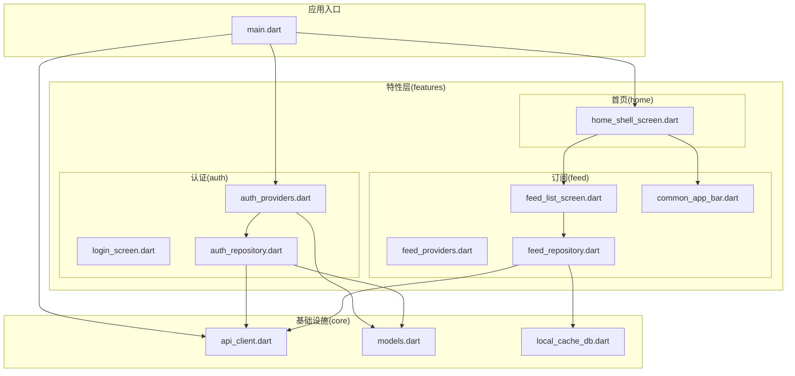
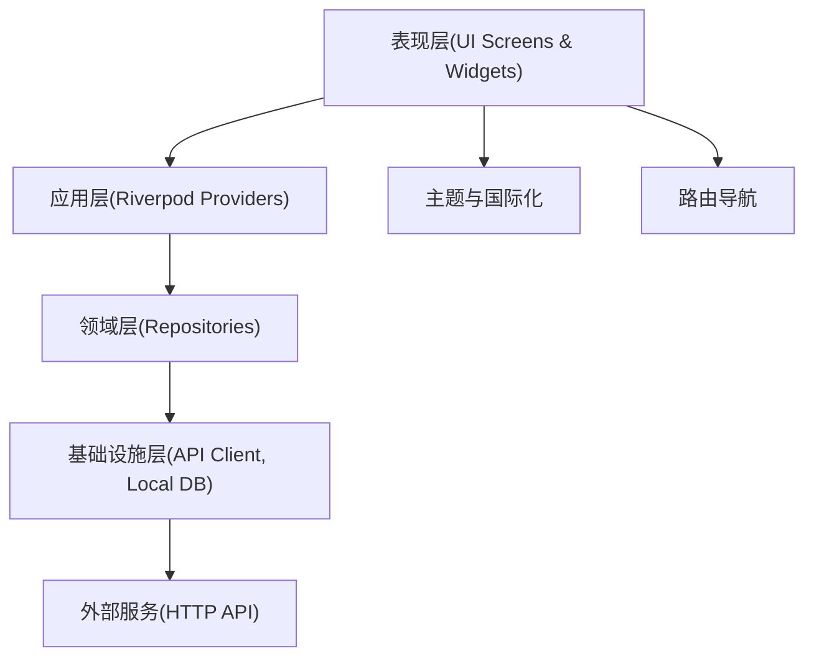
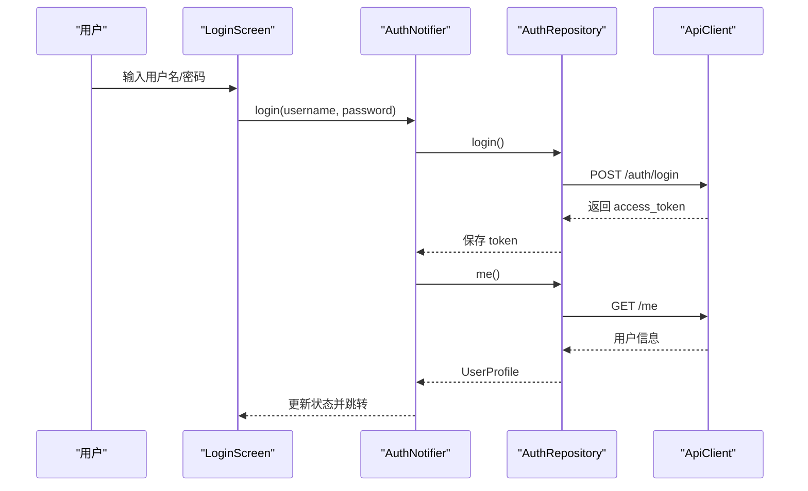
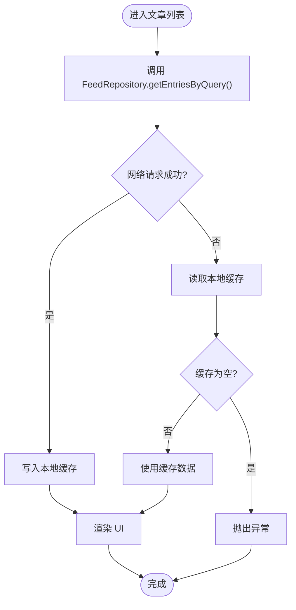
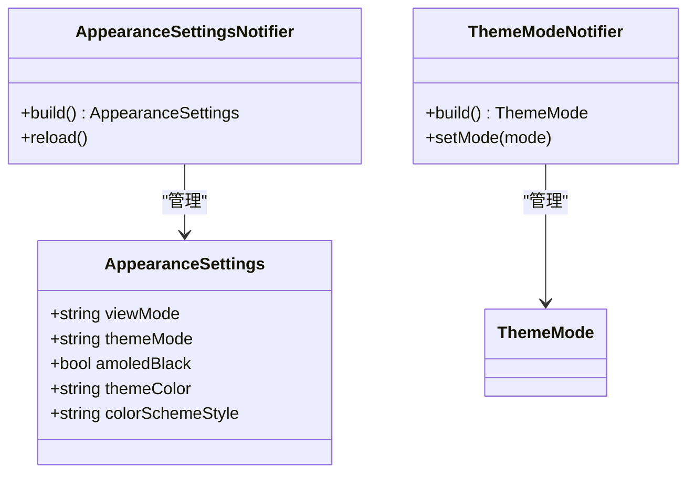
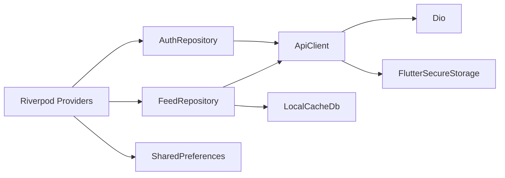

# Flutter架构设计

<cite>
**本文档引用的文件**
- [pubspec.yaml](file://tan_rss_mobile/pubspec.yaml)
- [main.dart](file://tan_rss_mobile/lib/main.dart)
- [api_client.dart](file://tan_rss_mobile/lib/core/api/api_client.dart)
- [models.dart](file://tan_rss_mobile/lib/core/models/models.dart)
- [local_cache_db.dart](file://tan_rss_mobile/lib/core/storage/local_cache_db.dart)
- [auth_providers.dart](file://tan_rss_mobile/lib/features/auth/presentation/auth_providers.dart)
- [login_screen.dart](file://tan_rss_mobile/lib/features/auth/presentation/login_screen.dart)
- [auth_repository.dart](file://tan_rss_mobile/lib/features/auth/data/auth_repository.dart)
- [feed_providers.dart](file://tan_rss_mobile/lib/features/feed/presentation/feed_providers.dart)
- [home_shell_screen.dart](file://tan_rss_mobile/lib/features/home/presentation/home_shell_screen.dart)
- [feed_list_screen.dart](file://tan_rss_mobile/lib/features/feed/presentation/feed_list_screen.dart)
- [common_app_bar.dart](file://tan_rss_mobile/lib/features/feed/presentation/common_app_bar.dart)
- [feed_repository.dart](file://tan_rss_mobile/lib/features/feed/data/feed_repository.dart)
</cite>

## 目录
1. [简介](#简介)
2. [项目结构](#项目结构)
3. [核心组件](#核心组件)
4. [架构总览](#架构总览)
5. [详细组件分析](#详细组件分析)
6. [依赖关系分析](#依赖关系分析)
7. [性能考虑](#性能考虑)
8. [故障排除指南](#故障排除指南)
9. [结论](#结论)
10. [附录](#附录)

## 简介
本文件针对 Tan RSS Reader 的 Flutter 移动端应用进行系统性架构设计文档梳理，重点围绕 Clean Architecture 应用、模块化设计与依赖注入策略展开；同时覆盖核心包结构、路由配置与启动流程、平台通道设计思路、国际化与主题系统、响应式布局以及代码组织规范与命名约定等。文档旨在帮助开发者快速理解系统架构、把握关键实现点，并在后续迭代中遵循一致的设计原则。

## 项目结构
Tan RSS Reader 的 Flutter 工程采用按功能域划分的模块化组织方式，核心目录如下：
- lib/core：基础设施层，包含 API 客户端、模型定义、本地缓存数据库等
- lib/features：特性层，按业务功能拆分，如认证、订阅源管理、文章列表等
- lib/main.dart：应用入口，负责全局初始化、主题与国际化设置、Provider 树搭建

**图表来源**
- [main.dart:1-153](file://tan_rss_mobile/lib/main.dart#L1-L153)
- [api_client.dart:1-71](file://tan_rss_mobile/lib/core/api/api_client.dart#L1-L71)
- [models.dart:1-653](file://tan_rss_mobile/lib/core/models/models.dart#L1-L653)
- [local_cache_db.dart:1-353](file://tan_rss_mobile/lib/core/storage/local_cache_db.dart#L1-L353)
- [auth_providers.dart:1-123](file://tan_rss_mobile/lib/features/auth/presentation/auth_providers.dart#L1-L123)
- [login_screen.dart:1-318](file://tan_rss_mobile/lib/features/auth/presentation/login_screen.dart#L1-L318)
- [auth_repository.dart:1-101](file://tan_rss_mobile/lib/features/auth/data/auth_repository.dart#L1-L101)
- [feed_providers.dart:1-254](file://tan_rss_mobile/lib/features/feed/presentation/feed_providers.dart#L1-L254)
- [home_shell_screen.dart:1-344](file://tan_rss_mobile/lib/features/home/presentation/home_shell_screen.dart#L1-L344)
- [feed_list_screen.dart:1-807](file://tan_rss_mobile/lib/features/feed/presentation/feed_list_screen.dart#L1-L807)
- [common_app_bar.dart:1-83](file://tan_rss_mobile/lib/features/feed/presentation/common_app_bar.dart#L1-L83)
- [feed_repository.dart:1-1025](file://tan_rss_mobile/lib/features/feed/data/feed_repository.dart#L1-L1025)

**章节来源**
- [main.dart:1-153](file://tan_rss_mobile/lib/main.dart#L1-L153)
- [pubspec.yaml:1-112](file://tan_rss_mobile/pubspec.yaml#L1-L112)

## 核心组件
本节从架构视角对关键组件进行概览说明，涵盖数据模型、API 客户端、本地缓存、认证与订阅源仓库、Provider 状态管理以及 UI 层。

- 数据模型层：统一的数据结构定义，便于跨层传递与序列化，包含文章、订阅源、频道、向量检索结果等
- API 客户端：基于 Dio 的单例客户端，内置拦截器处理鉴权与 401 处理，支持动态设置基础 URL
- 本地缓存：基于 sqflite 的轻量级本地数据库，缓存文章、订阅源与 AI 结果，提升离线可用性
- 认证仓库：封装登录、注册、登出与用户信息获取，含令牌有效性校验
- 订阅源仓库：封装文章、频道、向量聚类、语义搜索、AI 总结/翻译等接口，统一调用与缓存策略
- Provider 状态管理：使用 Riverpod 的 Notifier/FutureProvider 组织应用状态，分离 UI 与业务逻辑
- UI 层：按功能拆分页面与组件，采用 ConsumerWidget/ConsumerStatefulWidget 与 Provider 组合

**章节来源**
- [models.dart:1-653](file://tan_rss_mobile/lib/core/models/models.dart#L1-L653)
- [api_client.dart:1-71](file://tan_rss_mobile/lib/core/api/api_client.dart#L1-L71)
- [local_cache_db.dart:1-353](file://tan_rss_mobile/lib/core/storage/local_cache_db.dart#L1-L353)
- [auth_repository.dart:1-101](file://tan_rss_mobile/lib/features/auth/data/auth_repository.dart#L1-L101)
- [feed_repository.dart:1-1025](file://tan_rss_mobile/lib/features/feed/data/feed_repository.dart#L1-L1025)
- [auth_providers.dart:1-123](file://tan_rss_mobile/lib/features/auth/presentation/auth_providers.dart#L1-L123)
- [feed_providers.dart:1-254](file://tan_rss_mobile/lib/features/feed/presentation/feed_providers.dart#L1-L254)

## 架构总览
Tan RSS Reader 采用 Clean Architecture 的分层思想：
- 表现层：UI 组件与屏幕，通过 Provider 订阅状态
- 应用层：Provider Notifiers/FutureProviders 负责协调业务流与状态
- 领域层：仓库（Repository）封装对外部服务的调用与缓存策略
- 基础设施层：API 客户端、本地数据库、模型定义

**图表来源**
- [main.dart:1-153](file://tan_rss_mobile/lib/main.dart#L1-L153)
- [feed_repository.dart:1-1025](file://tan_rss_mobile/lib/features/feed/data/feed_repository.dart#L1-L1025)
- [api_client.dart:1-71](file://tan_rss_mobile/lib/core/api/api_client.dart#L1-L71)
- [local_cache_db.dart:1-353](file://tan_rss_mobile/lib/core/storage/local_cache_db.dart#L1-L353)

## 详细组件分析

### 认证模块
- 认证状态管理：使用 Notifier 组织登录、注册、登出与恢复流程，支持乐观登录与后台刷新
- 仓库封装：统一处理登录/注册/登出与用户信息获取，含令牌有效性校验
- UI 交互：登录页支持切换登录/注册模式、服务器地址配置与错误提示

**图表来源**
- [login_screen.dart:1-318](file://tan_rss_mobile/lib/features/auth/presentation/login_screen.dart#L1-L318)
- [auth_providers.dart:1-123](file://tan_rss_mobile/lib/features/auth/presentation/auth_providers.dart#L1-L123)
- [auth_repository.dart:1-101](file://tan_rss_mobile/lib/features/auth/data/auth_repository.dart#L1-L101)
- [api_client.dart:1-71](file://tan_rss_mobile/lib/core/api/api_client.dart#L1-L71)

**章节来源**
- [auth_providers.dart:1-123](file://tan_rss_mobile/lib/features/auth/presentation/auth_providers.dart#L1-L123)
- [login_screen.dart:1-318](file://tan_rss_mobile/lib/features/auth/presentation/login_screen.dart#L1-L318)
- [auth_repository.dart:1-101](file://tan_rss_mobile/lib/features/auth/data/auth_repository.dart#L1-L101)

### 订阅源与文章模块
- 文章查询：支持按订阅源、未读、收藏、精选过滤，分页与滚动加载
- 缓存策略：优先网络请求，失败时回退到本地缓存；AI 翻译/摘要结果也写入本地缓存
- UI 列表：支持卡片/杂志/列表三种视图模式，悬浮按钮生成 AI 简报

**图表来源**
- [feed_repository.dart:108-162](file://tan_rss_mobile/lib/features/feed/data/feed_repository.dart#L108-L162)
- [local_cache_db.dart:81-164](file://tan_rss_mobile/lib/core/storage/local_cache_db.dart#L81-L164)
- [feed_list_screen.dart:72-151](file://tan_rss_mobile/lib/features/feed/presentation/feed_list_screen.dart#L72-L151)

**章节来源**
- [feed_providers.dart:1-254](file://tan_rss_mobile/lib/features/feed/presentation/feed_providers.dart#L1-L254)
- [feed_list_screen.dart:1-807](file://tan_rss_mobile/lib/features/feed/presentation/feed_list_screen.dart#L1-L807)
- [feed_repository.dart:1-1025](file://tan_rss_mobile/lib/features/feed/data/feed_repository.dart#L1-L1025)

### 主题系统与外观设置
- 主题模式：支持跟随系统、浅色、深色；深色模式支持 AMOLED 黑暗模式
- 动态配色：基于种子色生成 ColorScheme，并自定义表面色
- 设置持久化：通过 SharedPreferences 存储主题模式、颜色方案、视图模式等

**图表来源**
- [feed_providers.dart:128-165](file://tan_rss_mobile/lib/features/feed/presentation/feed_providers.dart#L128-L165)
- [main.dart:11-38](file://tan_rss_mobile/lib/main.dart#L11-L38)

**章节来源**
- [main.dart:1-153](file://tan_rss_mobile/lib/main.dart#L1-L153)
- [feed_providers.dart:128-165](file://tan_rss_mobile/lib/features/feed/presentation/feed_providers.dart#L128-L165)

### 国际化与语言设置
- 语言资源：通过 timeago 设置多语言时间格式
- 本地化扩展：可在应用中引入 intl 包与本地化资源文件，实现文本国际化
- 建议：将语言切换与本地化资源加载解耦至 Provider，避免在 UI 中直接访问系统语言

[本节为概念性说明，无需代码来源]

### 响应式布局与导航
- 导航栏：底部导航切换文章、订阅、发现三个主区域
- 公共工具栏：通用 AppBar 提供设置、添加订阅源、打开频道广场等入口
- 响应式卡片：根据视图模式渲染不同布局，适配不同屏幕尺寸

**章节来源**
- [home_shell_screen.dart:1-344](file://tan_rss_mobile/lib/features/home/presentation/home_shell_screen.dart#L1-L344)
- [common_app_bar.dart:1-83](file://tan_rss_mobile/lib/features/feed/presentation/common_app_bar.dart#L1-L83)

### 平台通道（Platform Channels）设计思路
- 设计目标：在 Flutter 与原生平台之间建立稳定通信，用于系统级能力（如设备信息、权限、通知等）
- 实现建议：
  - 使用 MethodChannel 进行方法调用，EventChannel 处理事件流
  - 在 Android 使用 Kotlin/Java，在 iOS 使用 Swift/Objective-C 实现桥接
  - 将平台特定逻辑封装在独立的 native 模块中，保持 Flutter 层纯 UI
  - 对异常与空值进行严格处理，确保主线程安全
- 当前项目：未见 Platform Channels 相关实现，建议在需要系统级能力时按上述模式扩展

[本节为概念性说明，无需代码来源]

## 依赖关系分析
- 依赖注入：通过 Riverpod Provider 注入 ApiClient 与仓库实例，避免在 UI 中直接依赖具体实现
- 外部依赖：Dio（HTTP）、shared_preferences（配置存储）、sqflite（本地数据库）、intl（国际化）、timeago（时间格式化）
- 模块内聚：每个特性模块内部通过 Provider 协作，减少跨模块耦合

**图表来源**
- [auth_repository.dart:1-101](file://tan_rss_mobile/lib/features/auth/data/auth_repository.dart#L1-L101)
- [feed_repository.dart:1-1025](file://tan_rss_mobile/lib/features/feed/data/feed_repository.dart#L1-L1025)
- [api_client.dart:1-71](file://tan_rss_mobile/lib/core/api/api_client.dart#L1-L71)
- [local_cache_db.dart:1-353](file://tan_rss_mobile/lib/core/storage/local_cache_db.dart#L1-L353)
- [feed_providers.dart:1-254](file://tan_rss_mobile/lib/features/feed/presentation/feed_providers.dart#L1-L254)
- [auth_providers.dart:1-123](file://tan_rss_mobile/lib/features/auth/presentation/auth_providers.dart#L1-L123)

**章节来源**
- [pubspec.yaml:30-51](file://tan_rss_mobile/pubspec.yaml#L30-L51)

## 性能考虑
- 网络与缓存：优先网络请求，失败回退本地缓存；对高频接口（文章列表、订阅源）启用批量写入与条件查询
- 懒加载与分页：滚动到底部加载更多，控制分页大小与偏移，避免一次性加载过多数据
- 图片与渲染：使用缓存图片库，卡片模式下按需加载缩略图，减少内存占用
- 状态更新：使用 Notifier 的细粒度状态更新，避免不必要的重建
- 主题与国际化：预设语言消息，避免运行时重复解析

[本节为通用指导，无需代码来源]

## 故障排除指南
- 401 未授权：ApiClient 拦截器检测到 401 自动清除令牌并触发登出回调
- 登录失败：检查服务器地址配置与网络连通性，查看错误提示
- 加载失败：确认网络状态，必要时查看本地缓存是否可用
- 主题异常：检查 SharedPreferences 中的主题键值，必要时重置默认值

**章节来源**
- [api_client.dart:34-41](file://tan_rss_mobile/lib/core/api/api_client.dart#L34-L41)
- [login_screen.dart:40-47](file://tan_rss_mobile/lib/features/auth/presentation/login_screen.dart#L40-L47)
- [auth_providers.dart:64-72](file://tan_rss_mobile/lib/features/auth/presentation/auth_providers.dart#L64-L72)

## 结论
Tan RSS Reader 的 Flutter 架构以 Clean Architecture 为核心，结合 Riverpod 的声明式状态管理与模块化设计，实现了清晰的职责分离与良好的可维护性。通过 API 客户端与本地缓存的协同，兼顾了在线与离线体验；通过 Provider 组织认证、订阅源与外观设置，使 UI 与业务逻辑解耦。未来可在平台通道、国际化与响应式布局方面进一步完善，以满足更复杂的业务需求。

## 附录

### 代码组织规范与命名约定
- 文件命名：小写加下划线，如 feed_list_screen.dart
- 类型命名：大驼峰，如 FeedRepository、EntryQuery
- Provider 命名：以 Provider 结尾，如 authProvider、entriesProvider
- 仓库命名：以 Repository 结尾，如 FeedRepository
- 屏幕与组件：屏幕以 Screen 结尾，组件以 Widget 结尾（如 CommonAppBar）

[本节为通用规范说明，无需代码来源]