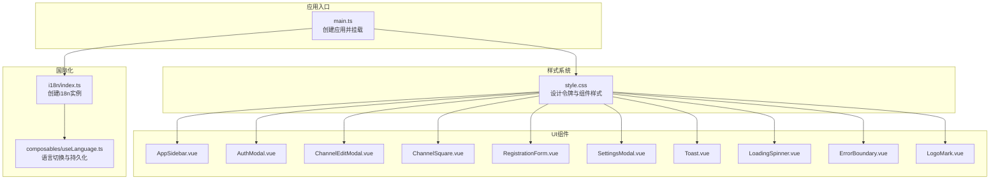
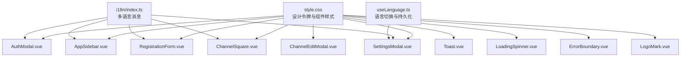
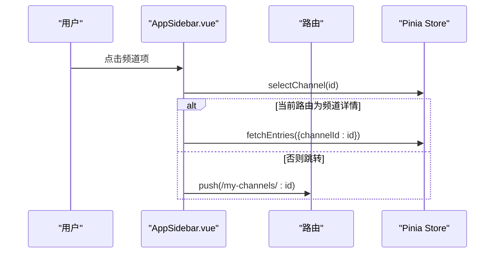
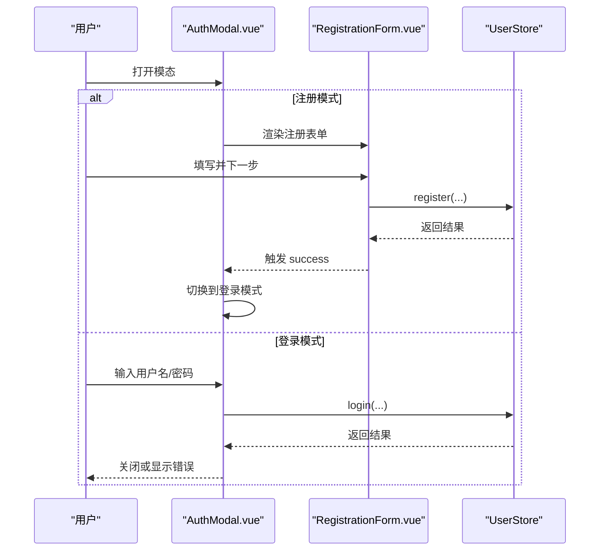
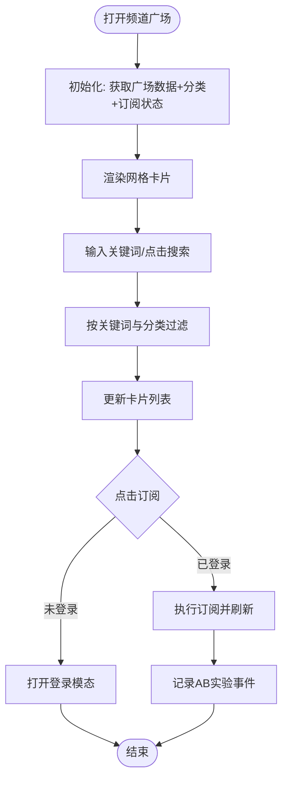
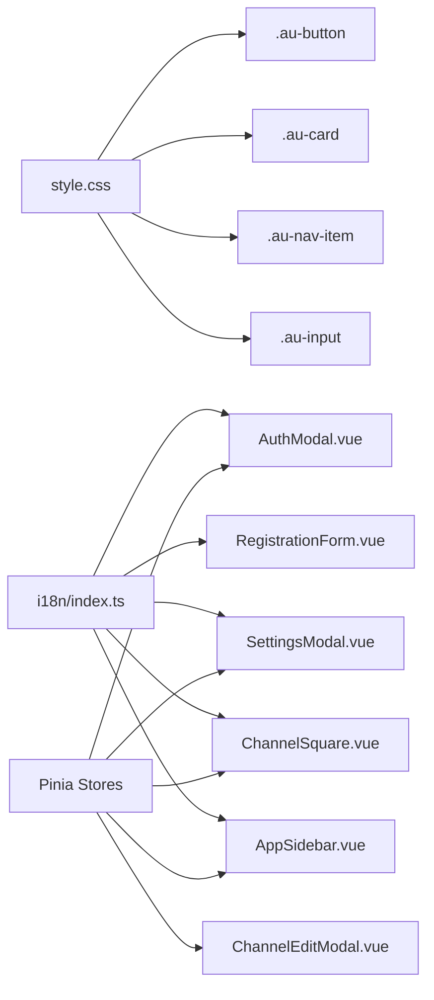

# UI组件库

<cite>
**本文引用的文件**
- [AppSidebar.vue](file://rss-desktop/src/components/AppSidebar.vue)
- [AuthModal.vue](file://rss-desktop/src/components/AuthModal.vue)
- [ChannelEditModal.vue](file://rss-desktop/src/components/ChannelEditModal.vue)
- [ChannelSquare.vue](file://rss-desktop/src/components/ChannelSquare.vue)
- [ErrorBoundary.vue](file://rss-desktop/src/components/ErrorBoundary.vue)
- [LoadingSpinner.vue](file://rss-desktop/src/components/LoadingSpinner.vue)
- [LogoMark.vue](file://rss-desktop/src/components/LogoMark.vue)
- [RegistrationForm.vue](file://rss-desktop/src/components/RegistrationForm.vue)
- [SettingsModal.vue](file://rss-desktop/src/components/SettingsModal.vue)
- [Toast.vue](file://rss-desktop/src/components/Toast.vue)
- [style.css](file://rss-desktop/src/style.css)
- [main.ts](file://rss-desktop/src/main.ts)
- [index.ts](file://rss-desktop/src/i18n/index.ts)
- [useLanguage.ts](file://rss-desktop/src/composables/useLanguage.ts)
</cite>

## 目录
1. [引言](#引言)
2. [项目结构](#项目结构)
3. [核心组件](#核心组件)
4. [架构总览](#架构总览)
5. [详细组件分析](#详细组件分析)
6. [依赖关系分析](#依赖关系分析)
7. [性能考量](#性能考量)
8. [故障排查指南](#故障排查指南)
9. [结论](#结论)
10. [附录](#附录)

## 引言
本文件为 Tan RSS Reader 的 UI 组件库文档，聚焦于桌面端 Vue 应用中的自定义组件设计与实现。内容涵盖卡片、按钮、导航栏、模态框等核心组件的使用方法与设计理念；解释响应式布局策略与断点设计；阐述主题系统（明/暗）与 CSS 变量映射；说明动画、过渡与交互反馈；并提供可访问性、国际化适配与性能优化建议。

## 项目结构
- 组件集中于 rss-desktop/src/components 下，采用单文件组件（.vue）组织，按功能模块划分。
- 样式系统以全局 CSS 变量为核心，配合语义化类名与暗色模式变量覆盖，形成统一的设计令牌。
- 国际化通过 vue-i18n 提供，组件内广泛使用 t() 获取多语言文案。
- 状态管理由 Pinia 提供，组件通过 store 实现数据与行为解耦。

图表来源
- [main.ts:1-9](file://rss-desktop/src/main.ts#L1-L9)
- [index.ts:1-35](file://rss-desktop/src/i18n/index.ts#L1-L35)
- [useLanguage.ts:1-49](file://rss-desktop/src/composables/useLanguage.ts#L1-L49)
- [style.css:1-1279](file://rss-desktop/src/style.css#L1-L1279)
- [AppSidebar.vue:1-1025](file://rss-desktop/src/components/AppSidebar.vue#L1-L1025)
- [AuthModal.vue:1-236](file://rss-desktop/src/components/AuthModal.vue#L1-L236)
- [ChannelEditModal.vue:1-208](file://rss-desktop/src/components/ChannelEditModal.vue#L1-L208)
- [ChannelSquare.vue:1-667](file://rss-desktop/src/components/ChannelSquare.vue#L1-L667)
- [RegistrationForm.vue:1-604](file://rss-desktop/src/components/RegistrationForm.vue#L1-L604)
- [SettingsModal.vue:1-513](file://rss-desktop/src/components/SettingsModal.vue#L1-L513)
- [Toast.vue:1-92](file://rss-desktop/src/components/Toast.vue#L1-L92)
- [LoadingSpinner.vue:1-59](file://rss-desktop/src/components/LoadingSpinner.vue#L1-L59)
- [ErrorBoundary.vue:1-81](file://rss-desktop/src/components/ErrorBoundary.vue#L1-L81)
- [LogoMark.vue:1-24](file://rss-desktop/src/components/LogoMark.vue#L1-L24)

章节来源
- [main.ts:1-9](file://rss-desktop/src/main.ts#L1-L9)
- [style.css:1-1279](file://rss-desktop/src/style.css#L1-L1279)

## 核心组件
- 导航侧边栏：提供品牌区、固定导航、订阅频道列表、上下文菜单与用户菜单，支持滚动定位与动态宽度。
- 登录/注册模态：支持登录与注册两种模式切换，注册采用三步表单，含实时校验与强度指示。
- 频道编辑模态：编辑频道名称与描述，支持保存与加载状态。
- 频道广场：网格卡片展示频道，支持搜索、分类筛选、订阅与描述展开/收起。
- 设置模态：语言切换、显示与时间过滤设置，自动持久化至 store。
- 加载指示器：旋转动画与可读标签，支持不同尺寸。
- 错误边界：捕获子树错误并提供重试。
- Logo 标记：图标资源加载与可配置尺寸。
- 通知提示：右上角弹出式 Toast，支持类型区分与自动关闭。

章节来源
- [AppSidebar.vue:1-1025](file://rss-desktop/src/components/AppSidebar.vue#L1-L1025)
- [AuthModal.vue:1-236](file://rss-desktop/src/components/AuthModal.vue#L1-L236)
- [ChannelEditModal.vue:1-208](file://rss-desktop/src/components/ChannelEditModal.vue#L1-L208)
- [ChannelSquare.vue:1-667](file://rss-desktop/src/components/ChannelSquare.vue#L1-L667)
- [SettingsModal.vue:1-513](file://rss-desktop/src/components/SettingsModal.vue#L1-L513)
- [RegistrationForm.vue:1-604](file://rss-desktop/src/components/RegistrationForm.vue#L1-L604)
- [LoadingSpinner.vue:1-59](file://rss-desktop/src/components/LoadingSpinner.vue#L1-L59)
- [ErrorBoundary.vue:1-81](file://rss-desktop/src/components/ErrorBoundary.vue#L1-L81)
- [LogoMark.vue:1-24](file://rss-desktop/src/components/LogoMark.vue#L1-L24)
- [Toast.vue:1-92](file://rss-desktop/src/components/Toast.vue#L1-L92)

## 架构总览
组件间通过 props、events 与 Pinia store 解耦协作；国际化通过 i18n 注入；样式通过 CSS 变量与语义类名统一风格；暗色模式通过 :root.dark 覆盖变量。

图表来源
- [style.css:1-1279](file://rss-desktop/src/style.css#L1-L1279)
- [index.ts:1-35](file://rss-desktop/src/i18n/index.ts#L1-L35)
- [useLanguage.ts:1-49](file://rss-desktop/src/composables/useLanguage.ts#L1-L49)
- [AppSidebar.vue:1-1025](file://rss-desktop/src/components/AppSidebar.vue#L1-L1025)
- [AuthModal.vue:1-236](file://rss-desktop/src/components/AuthModal.vue#L1-L236)
- [ChannelEditModal.vue:1-208](file://rss-desktop/src/components/ChannelEditModal.vue#L1-L208)
- [ChannelSquare.vue:1-667](file://rss-desktop/src/components/ChannelSquare.vue#L1-L667)
- [RegistrationForm.vue:1-604](file://rss-desktop/src/components/RegistrationForm.vue#L1-L604)
- [SettingsModal.vue:1-513](file://rss-desktop/src/components/SettingsModal.vue#L1-L513)
- [Toast.vue:1-92](file://rss-desktop/src/components/Toast.vue#L1-L92)
- [LoadingSpinner.vue:1-59](file://rss-desktop/src/components/LoadingSpinner.vue#L1-L59)
- [ErrorBoundary.vue:1-81](file://rss-desktop/src/components/ErrorBoundary.vue#L1-L81)
- [LogoMark.vue:1-24](file://rss-desktop/src/components/LogoMark.vue#L1-L24)

## 详细组件分析

### 导航侧边栏（AppSidebar）
- 设计理念
  - 以“信息密度”与“操作路径”为导向，左侧固定导航 + 可拖拽宽度，支持用户个性化。
  - 使用 CSS 变量映射主题色，结合模糊背景与渐变增强层级感。
- 关键能力
  - 订阅频道列表渲染与滚动定位，支持空态与错误态。
  - 上下文菜单与用户菜单，点击外部自动关闭。
  - 图标代理加载与错误回退，避免跨域与加载失败影响体验。
- 交互与动画
  - 导航项悬停与激活态过渡；侧边栏宽度平滑过渡；滚动条 hover 显隐。
- 可访问性
  - 空态与错误态使用 role 与 aria-live/aria-atomic 提升可读性。
- 性能
  - 列表项使用 v-for 渲染，仅在活跃频道变化时触发一次滚动定位。

图表来源
- [AppSidebar.vue:117-124](file://rss-desktop/src/components/AppSidebar.vue#L117-L124)

章节来源
- [AppSidebar.vue:1-1025](file://rss-desktop/src/components/AppSidebar.vue#L1-L1025)

### 登录/注册模态（AuthModal + RegistrationForm）
- 设计理念
  - 登录页复用简单表单；注册页采用三步流程，提升复杂表单的可读性与可维护性。
- 关键能力
  - 模态显隐控制、登录/注册模式切换、实时字段校验、密码强度指示、提交状态与错误提示。
- 交互与动画
  - 模态宽屏适配（注册页更宽）；按钮禁用态与 hover 效果；切换链接与提交按钮视觉反馈。
- 可访问性
  - 表单控件具备占位符与标签；错误信息 role=alert；键盘可聚焦。
- 国际化
  - 所有文案通过 t() 获取，支持多语言。

图表来源
- [AuthModal.vue:1-236](file://rss-desktop/src/components/AuthModal.vue#L1-L236)
- [RegistrationForm.vue:1-604](file://rss-desktop/src/components/RegistrationForm.vue#L1-L604)

章节来源
- [AuthModal.vue:1-236](file://rss-desktop/src/components/AuthModal.vue#L1-L236)
- [RegistrationForm.vue:1-604](file://rss-desktop/src/components/RegistrationForm.vue#L1-L604)

### 频道编辑模态（ChannelEditModal）
- 设计理念
  - 小而精的编辑面板，聚焦频道基本信息修改，即时刷新订阅列表。
- 关键能力
  - 接收频道对象，双向绑定名称与描述，保存后刷新订阅并关闭。
- 交互与动画
  - 模态淡入淡出过渡，输入框聚焦高亮与禁用态。

章节来源
- [ChannelEditModal.vue:1-208](file://rss-desktop/src/components/ChannelEditModal.vue#L1-L208)

### 频道广场（ChannelSquare）
- 设计理念
  - 卡片网格布局，支持搜索、分类筛选与订阅；AB 实验驱动的布局变体。
- 关键能力
  - 搜索与分类过滤；订阅状态管理与加载/错误态；描述展开/收起；移动端自适应网格。
- 交互与动画
  - 卡片 hover 抬升与阴影变化；滑入式模态；搜索按钮与输入框聚焦态。
- 响应式
  - 在小屏设备隐藏副标题、调整网格列数、侧边栏占满全宽。

图表来源
- [ChannelSquare.vue:85-122](file://rss-desktop/src/components/ChannelSquare.vue#L85-L122)

章节来源
- [ChannelSquare.vue:1-667](file://rss-desktop/src/components/ChannelSquare.vue#L1-L667)

### 设置模态（SettingsModal）
- 设计理念
  - 语言切换与显示/时间过滤设置集中管理，自动持久化至 store。
- 关键能力
  - 语言选择器（含旗帜与名称）、显示设置开关、时间范围与时间基准选择。
- 交互与动画
  - 模态缩放进入/退出；滚动条自定义；暗色模式下整体风格覆盖。

章节来源
- [SettingsModal.vue:1-513](file://rss-desktop/src/components/SettingsModal.vue#L1-L513)
- [useLanguage.ts:1-49](file://rss-desktop/src/composables/useLanguage.ts#L1-L49)

### 加载指示器（LoadingSpinner）
- 设计理念
  - 轻量级旋转动画与可选标签，支持多种尺寸。
- 交互与动画
  - CSS keyframes 实现持续旋转；label 通过 aria-live 提升可读性。

章节来源
- [LoadingSpinner.vue:1-59](file://rss-desktop/src/components/LoadingSpinner.vue#L1-L59)

### 错误边界（ErrorBoundary）
- 设计理念
  - 捕获子树错误并提供重试按钮，避免整页崩溃。
- 交互与动画
  - 中心化错误展示与按钮 hover 效果。

章节来源
- [ErrorBoundary.vue:1-81](file://rss-desktop/src/components/ErrorBoundary.vue#L1-L81)

### Logo 标记（LogoMark）
- 设计理念
  - 简洁图标组件，支持尺寸传参与可访问性 alt 文案。

章节来源
- [LogoMark.vue:1-24](file://rss-desktop/src/components/LogoMark.vue#L1-L24)

### 通知提示（Toast）
- 设计理念
  - 右上角轻提示，自动关闭，支持成功/错误/信息类型。
- 交互与动画
  - 简短入场/出场过渡，点击关闭按钮即时移除。

章节来源
- [Toast.vue:1-92](file://rss-desktop/src/components/Toast.vue#L1-L92)

## 依赖关系分析
- 组件依赖
  - 大多数组件依赖 Pinia store（如 feedStore、channelsStore、userStore、settingsStore），通过 props 与 emits 与父组件通信。
  - 国际化依赖 vue-i18n，组件内部通过 t() 获取文案。
- 样式依赖
  - 组件样式与全局设计令牌强关联，通过 CSS 变量与语义类名实现一致风格。
- 暗色模式
  - 通过 :root 与 :root.dark 覆盖变量，部分组件提供暗色模式专属样式块。

图表来源
- [style.css:222-730](file://rss-desktop/src/style.css#L222-L730)
- [index.ts:1-35](file://rss-desktop/src/i18n/index.ts#L1-L35)
- [AppSidebar.vue:1-1025](file://rss-desktop/src/components/AppSidebar.vue#L1-L1025)
- [AuthModal.vue:1-236](file://rss-desktop/src/components/AuthModal.vue#L1-L236)
- [ChannelEditModal.vue:1-208](file://rss-desktop/src/components/ChannelEditModal.vue#L1-L208)
- [ChannelSquare.vue:1-667](file://rss-desktop/src/components/ChannelSquare.vue#L1-L667)
- [RegistrationForm.vue:1-604](file://rss-desktop/src/components/RegistrationForm.vue#L1-L604)
- [SettingsModal.vue:1-513](file://rss-desktop/src/components/SettingsModal.vue#L1-L513)

章节来源
- [style.css:1-1279](file://rss-desktop/src/style.css#L1-L1279)
- [index.ts:1-35](file://rss-desktop/src/i18n/index.ts#L1-L35)

## 性能考量
- 渲染优化
  - 列表使用 v-for 与 key，避免不必要的重排；卡片网格使用 CSS Grid，减少 JS 计算。
- 事件与副作用
  - 侧边栏监听全局点击以关闭菜单，注意在 onUnmounted 中清理；上下文菜单在关闭时移除事件监听。
- 资源加载
  - 图标通过代理接口加载，失败时回退；注册表单模拟延迟以提升真实感与防抖。
- 动画与过渡
  - 使用 CSS 过渡与 transform，避免强制同步布局；模态与 Toast 使用较短过渡时间。
- 存储与缓存
  - 语言与 AB 实验数据存储于 localStorage，减少重复计算与网络请求。

章节来源
- [AppSidebar.vue:74-84](file://rss-desktop/src/components/AppSidebar.vue#L74-L84)
- [ChannelSquare.vue:67-83](file://rss-desktop/src/components/ChannelSquare.vue#L67-L83)
- [RegistrationForm.vue:123-138](file://rss-desktop/src/components/RegistrationForm.vue#L123-L138)

## 故障排查指南
- 登录/注册失败
  - 检查用户 store 的错误信息；确认网络可达与后端接口可用。
- 订阅失败或无反应
  - 查看 channelsStore 的错误与 loading 状态；确认用户已登录。
- 频道广场空白
  - 检查 categories 与 square 数据是否加载成功；确认 activeCategory 与查询条件。
- 模态无法关闭
  - 确认 backdrop 点击事件与 emit('close') 是否正确触发；检查 z-index 与 pointer-events。
- 暗色模式不生效
  - 确认 html.root 是否添加 .dark 类；检查 :root.dark 变量覆盖是否正确。

章节来源
- [AuthModal.vue:50-60](file://rss-desktop/src/components/AuthModal.vue#L50-L60)
- [ChannelEditModal.vue:30-45](file://rss-desktop/src/components/ChannelEditModal.vue#L30-L45)
- [ChannelSquare.vue:198-204](file://rss-desktop/src/components/ChannelSquare.vue#L198-L204)
- [SettingsModal.vue:62-70](file://rss-desktop/src/components/SettingsModal.vue#L62-L70)
- [style.css:98-135](file://rss-desktop/src/style.css#L98-L135)

## 结论
该 UI 组件库以统一的设计令牌与语义类名为基础，结合 Pinia 状态管理与 vue-i18n 国际化，实现了高内聚、低耦合的组件体系。通过响应式布局与暗色模式覆盖，满足多终端与多语言需求；通过丰富的交互与过渡，提升了用户体验与可访问性。建议在后续迭代中进一步完善无障碍标签与键盘导航，并对关键路径进行性能监控与优化。

## 附录
- 主题系统与设计令牌
  - 全局变量定义于 :root 与 :root.dark，涵盖文本、背景、边框、阴影、动效、字号与间距等。
  - 组件样式通过 CSS 变量映射，如 --text-primary、--bg-surface、--accent 等。
- 响应式断点与布局
  - 移动端场景下，频道广场网格变为单列，侧边栏占满宽度；输入框与按钮尺寸适配小屏。
- 动画与过渡
  - 组件普遍采用 CSS 过渡与 transform，如模态缩放、卡片 hover 抬升、Toast 上移等。
- 可访问性与国际化
  - 使用 role、aria-* 属性与 t() 文案，确保屏幕阅读器友好与多语言支持。

章节来源
- [style.css:6-135](file://rss-desktop/src/style.css#L6-L135)
- [ChannelSquare.vue:642-666](file://rss-desktop/src/components/ChannelSquare.vue#L642-L666)
- [index.ts:1-35](file://rss-desktop/src/i18n/index.ts#L1-L35)
- [useLanguage.ts:1-49](file://rss-desktop/src/composables/useLanguage.ts#L1-L49)