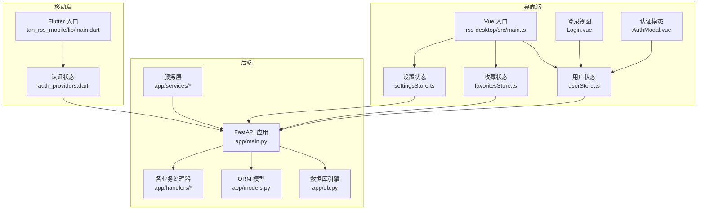
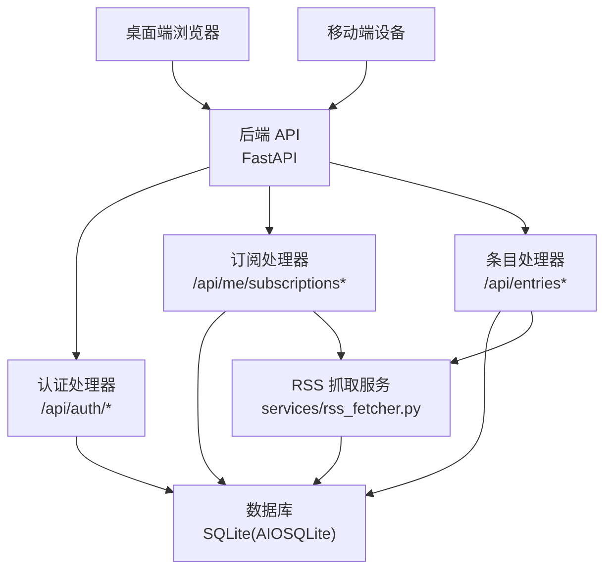
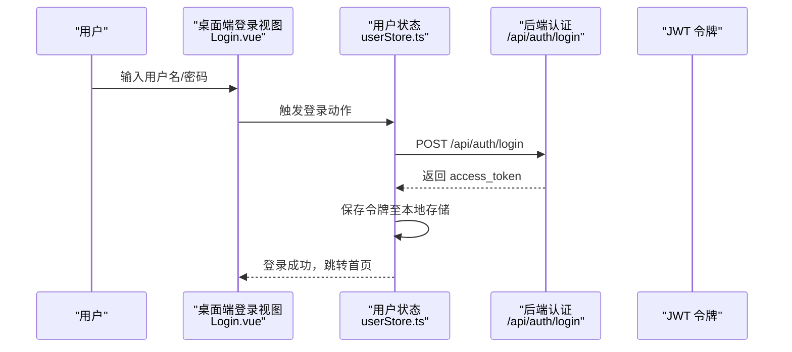
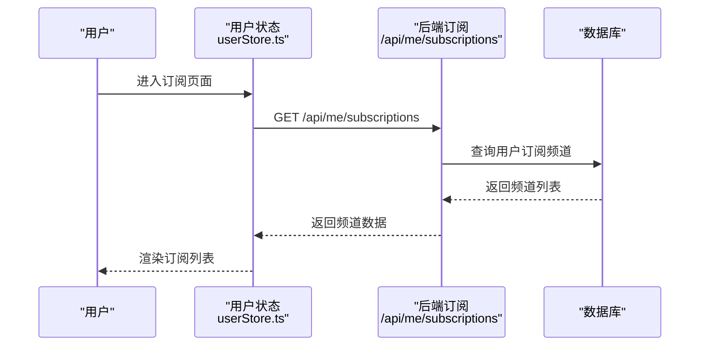
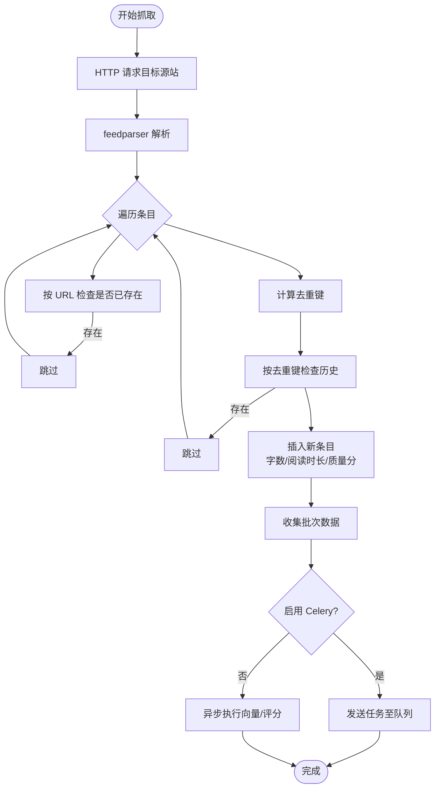
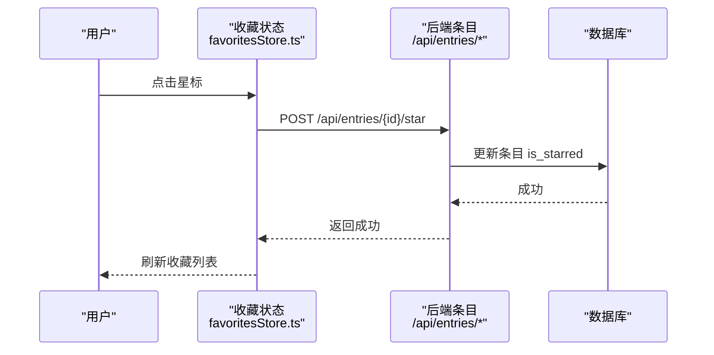
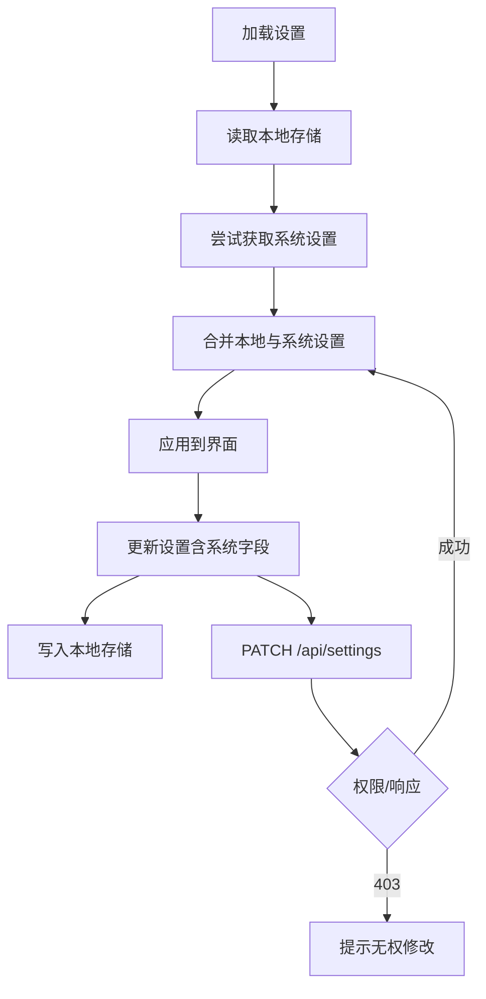
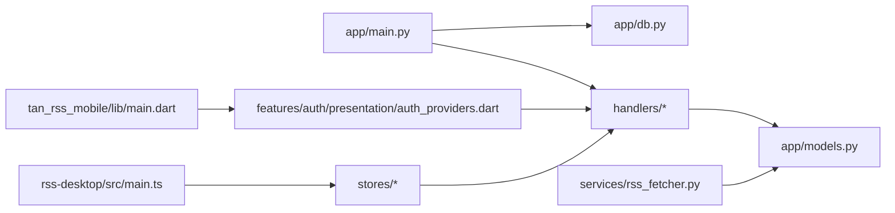

# 功能模块

<cite>
**本文引用的文件**
- [python-backend/app/main.py](file://python-backend/app/main.py)
- [python-backend/app/db.py](file://python-backend/app/db.py)
- [python-backend/app/models.py](file://python-backend/app/models.py)
- [python-backend/app/handlers/auth.py](file://python-backend/app/handlers/auth.py)
- [python-backend/app/handlers/entries.py](file://python-backend/app/handlers/entries.py)
- [python-backend/app/handlers/subscriptions.py](file://python-backend/app/handlers/subscriptions.py)
- [python-backend/app/services/rss_fetcher.py](file://python-backend/app/services/rss_fetcher.py)
- [rss-desktop/src/main.ts](file://rss-desktop/src/main.ts)
- [rss-desktop/src/stores/userStore.ts](file://rss-desktop/src/stores/userStore.ts)
- [rss-desktop/src/stores/favoritesStore.ts](file://rss-desktop/src/stores/favoritesStore.ts)
- [rss-desktop/src/stores/settingsStore.ts](file://rss-desktop/src/stores/settingsStore.ts)
- [rss-desktop/src/views/Login.vue](file://rss-desktop/src/views/Login.vue)
- [rss-desktop/src/components/AuthModal.vue](file://rss-desktop/src/components/AuthModal.vue)
- [tan_rss_mobile/lib/main.dart](file://tan_rss_mobile/lib/main.dart)
- [tan_rss_mobile/lib/features/auth/presentation/auth_providers.dart](file://tan_rss_mobile/lib/features/auth/presentation/auth_providers.dart)
</cite>

## 目录
1. [简介](#简介)
2. [项目结构](#项目结构)
3. [核心组件](#核心组件)
4. [架构总览](#架构总览)
5. [详细组件分析](#详细组件分析)
6. [依赖分析](#依赖分析)
7. [性能考量](#性能考量)
8. [故障排查指南](#故障排查指南)
9. [结论](#结论)
10. [附录](#附录)

## 简介
本文件面向 Tan RSS Reader 的功能模块，系统性梳理后端 API、桌面端与移动端的前端模块，以及它们之间的交互关系。重点覆盖以下方面：
- 认证模块：用户登录、注册与会话管理机制
- 订阅管理模块：RSS 源添加、内容抓取与去重处理
- 文章阅读模块：阅读进度与收藏/星标数据流
- 收藏与星标：数据存储与前后端协同
- 设置模块：配置管理与主题切换实现
- 模块间依赖、接口设计与扩展性

## 项目结构
整体采用“后端 FastAPI + 前端 Vue/Pinia + 移动端 Flutter Riverpod”的分层架构。后端通过统一入口挂载多个业务路由；前端通过 Pinia 或 Riverpod 管理状态；移动端通过 Riverpod 提供状态与持久化。

**图表来源**
- [python-backend/app/main.py:28-62](file://python-backend/app/main.py#L28-L62)
- [python-backend/app/db.py:24-27](file://python-backend/app/db.py#L24-L27)
- [rss-desktop/src/main.ts:1-9](file://rss-desktop/src/main.ts#L1-L9)
- [tan_rss_mobile/lib/main.dart:40-55](file://tan_rss_mobile/lib/main.dart#L40-L55)

**章节来源**
- [python-backend/app/main.py:28-62](file://python-backend/app/main.py#L28-L62)
- [rss-desktop/src/main.ts:1-9](file://rss-desktop/src/main.ts#L1-L9)
- [tan_rss_mobile/lib/main.dart:40-55](file://tan_rss_mobile/lib/main.dart#L40-L55)

## 核心组件
- 后端应用与路由：统一挂载认证、订阅、条目、设置等路由，并在启动时初始化数据库与定时任务调度器。
- 数据库与模型：定义 Feed、Entry、User、Subscription、AppSettings 等核心实体及关联关系。
- 认证处理器：提供注册、登录、令牌签发与校验、管理员权限校验。
- 订阅处理器：用户订阅频道、拉取订阅内容、按条件筛选与排序。
- 条目处理器：条目列表、详情、批量标记已读/未读、收藏/取消收藏。
- RSS 抓取服务：解析 RSS/Atom、去重、质量评分、向量索引异步处理。
- 前端状态管理：桌面端使用 Pinia 管理用户、收藏、设置；移动端使用 Riverpod 管理认证与主题。
- 路由与视图：桌面端登录页与认证模态；移动端主入口与主题切换逻辑。

**章节来源**
- [python-backend/app/main.py:64-103](file://python-backend/app/main.py#L64-L103)
- [python-backend/app/models.py:7-228](file://python-backend/app/models.py#L7-L228)
- [python-backend/app/handlers/auth.py:126-174](file://python-backend/app/handlers/auth.py#L126-L174)
- [python-backend/app/handlers/subscriptions.py:49-175](file://python-backend/app/handlers/subscriptions.py#L49-L175)
- [python-backend/app/handlers/entries.py:41-310](file://python-backend/app/handlers/entries.py#L41-L310)
- [python-backend/app/services/rss_fetcher.py:104-312](file://python-backend/app/services/rss_fetcher.py#L104-L312)
- [rss-desktop/src/stores/userStore.ts:33-81](file://rss-desktop/src/stores/userStore.ts#L33-L81)
- [rss-desktop/src/stores/favoritesStore.ts:14-69](file://rss-desktop/src/stores/favoritesStore.ts#L14-L69)
- [rss-desktop/src/stores/settingsStore.ts:25-201](file://rss-desktop/src/stores/settingsStore.ts#L25-L201)
- [tan_rss_mobile/lib/features/auth/presentation/auth_providers.dart:47-120](file://tan_rss_mobile/lib/features/auth/presentation/auth_providers.dart#L47-L120)

## 架构总览
后端以 FastAPI 为中心，通过路由模块化组织业务；数据库采用 SQLAlchemy 异步引擎；服务层负责 RSS 抓取与 AI 批处理；前端通过 API 客户端与后端交互，状态通过 Pinia/Riverpod 管理。

**图表来源**
- [python-backend/app/main.py:44-62](file://python-backend/app/main.py#L44-L62)
- [python-backend/app/services/rss_fetcher.py:104-312](file://python-backend/app/services/rss_fetcher.py#L104-L312)
- [python-backend/app/db.py:24-27](file://python-backend/app/db.py#L24-L27)

## 详细组件分析

### 认证模块
- 登录流程
  - 前端提交用户名/密码到后端登录接口，后端验证凭据并签发 JWT。
  - 前端将令牌存入本地存储并在后续请求头携带 Authorization: Bearer。
  - 桌面端与移动端均通过各自的用户状态管理器完成登录、登出与令牌持久化。
- 注册流程
  - 校验用户名、密码、邮箱格式；首次注册自动成为管理员。
  - 密码经哈希后入库，邮箱唯一性检查。
- 会话与权限
  - 通过中间件与依赖注入校验令牌有效性与用户状态；管理员接口额外校验角色。
  - 令牌有效期可配置，默认约两周。

**图表来源**
- [rss-desktop/src/views/Login.vue:27-41](file://rss-desktop/src/views/Login.vue#L27-L41)
- [rss-desktop/src/stores/userStore.ts:33-49](file://rss-desktop/src/stores/userStore.ts#L33-L49)
- [python-backend/app/handlers/auth.py:166-174](file://python-backend/app/handlers/auth.py#L166-L174)

**章节来源**
- [python-backend/app/handlers/auth.py:126-174](file://python-backend/app/handlers/auth.py#L126-L174)
- [rss-desktop/src/stores/userStore.ts:33-81](file://rss-desktop/src/stores/userStore.ts#L33-L81)
- [tan_rss_mobile/lib/features/auth/presentation/auth_providers.dart:74-92](file://tan_rss_mobile/lib/features/auth/presentation/auth_providers.dart#L74-L92)

### 订阅管理模块
- 频道订阅
  - 用户可查询自身订阅频道列表；订阅/取消订阅接口幂等处理。
  - 若频道图标缺失，回退到其源站 Feed 的 favicon。
- 订阅内容拉取
  - 按订阅频道聚合对应 Feed，支持未读/高质量过滤、日期范围与排序。
  - 结合翻译元数据提供标题翻译展示。

**图表来源**
- [python-backend/app/handlers/subscriptions.py:49-82](file://python-backend/app/handlers/subscriptions.py#L49-L82)
- [rss-desktop/src/stores/userStore.ts:89-122](file://rss-desktop/src/stores/userStore.ts#L89-L122)

**章节来源**
- [python-backend/app/handlers/subscriptions.py:49-175](file://python-backend/app/handlers/subscriptions.py#L49-L175)

### RSS 内容抓取与去重
- 抓取流程
  - 使用 feedparser 解析 RSS/Atom；对 arXiv 特例进行转换；设置 UA 与 Accept 头。
  - 对每个条目计算去重键（URL 规范化 + 标题 + 内容 MD5 哈希），避免重复入库。
  - 统计字数与估算阅读时长，预设基础质量分。
- 去重策略
  - 同批次内去重键去重；同时检查历史去重键，确保全局去重。
- 批处理与异步
  - 质量评分与向量索引通过 Celery 或异步任务执行，降低主流程延迟。

**图表来源**
- [python-backend/app/services/rss_fetcher.py:104-312](file://python-backend/app/services/rss_fetcher.py#L104-L312)

**章节来源**
- [python-backend/app/services/rss_fetcher.py:13-312](file://python-backend/app/services/rss_fetcher.py#L13-L312)

### 文章阅读与收藏/星标
- 阅读与进度
  - 条目列表支持按创建时间或发布时间排序；未读/已读状态与收藏状态可批量更新。
  - 前端收藏状态通过 Pinia 管理，后端提供收藏统计与批量星标接口。
- 收藏/星标
  - 支持单条与批量星标/取消星标；收藏统计接口用于前端展示。

**图表来源**
- [rss-desktop/src/stores/favoritesStore.ts:45-51](file://rss-desktop/src/stores/favoritesStore.ts#L45-L51)
- [python-backend/app/handlers/entries.py:246-277](file://python-backend/app/handlers/entries.py#L246-L277)

**章节来源**
- [python-backend/app/handlers/entries.py:41-310](file://python-backend/app/handlers/entries.py#L41-L310)
- [rss-desktop/src/stores/favoritesStore.ts:14-69](file://rss-desktop/src/stores/favoritesStore.ts#L14-L69)

### 设置模块与主题切换
- 桌面端设置
  - 本地存储与后端系统设置合并：本地偏好（如主题、品牌开关）与系统设置（如抓取间隔、分页数）分别处理。
  - 更新系统设置需管理员权限，否则返回 403。
- 移动端主题
  - 通过 Riverpod Notifier 管理主题模式与颜色方案，使用 SharedPreferences 持久化。

**图表来源**
- [rss-desktop/src/stores/settingsStore.ts:60-179](file://rss-desktop/src/stores/settingsStore.ts#L60-L179)

**章节来源**
- [rss-desktop/src/stores/settingsStore.ts:25-201](file://rss-desktop/src/stores/settingsStore.ts#L25-L201)
- [tan_rss_mobile/lib/main.dart:13-38](file://tan_rss_mobile/lib/main.dart#L13-L38)

## 依赖分析
- 后端
  - 应用入口集中注册所有业务路由；启动事件中创建表结构、迁移字段、初始化 AI 配置与任务调度器。
  - 数据库引擎与会话工厂位于独立模块，便于跨模块复用。
- 前端
  - 桌面端：Vue 应用初始化 Pinia、路由与国际化；用户、收藏、设置状态通过 Store 管理。
  - 移动端：Flutter 应用初始化 Riverpod 提供者与 API 客户端；主题模式通过 Notifier 管理。

**图表来源**
- [python-backend/app/main.py:44-62](file://python-backend/app/main.py#L44-L62)
- [python-backend/app/db.py:24-27](file://python-backend/app/db.py#L24-L27)
- [rss-desktop/src/main.ts:1-9](file://rss-desktop/src/main.ts#L1-L9)
- [tan_rss_mobile/lib/main.dart:40-55](file://tan_rss_mobile/lib/main.dart#L40-L55)

**章节来源**
- [python-backend/app/main.py:64-103](file://python-backend/app/main.py#L64-L103)
- [python-backend/app/db.py:11-27](file://python-backend/app/db.py#L11-L27)

## 性能考量
- 抓取与解析
  - feedparser 解析与 HTTP 请求超时控制，避免阻塞；对 arXiv 等特殊源进行适配。
- 去重与索引
  - 去重键在内存与数据库双层校验，减少重复入库；向量与质量评分异步批处理，降低主流程耗时。
- 分页与排序
  - 接口限制最大分页数量，避免大偏移导致的性能问题；支持按发布时间/创建时间排序。
- 前端状态
  - Pinia/Riverpod 状态粒度合理，避免不必要的重渲染；本地存储与后端设置合并，减少网络往返。

[本节为通用指导，无需列出具体文件来源]

## 故障排查指南
- 登录失败
  - 检查用户名/密码是否正确；确认后端日志与令牌生成；前端确认本地存储是否写入。
- 收藏/星标无效
  - 确认当前用户已登录且令牌有效；检查后端返回状态码；查看前端错误提示。
- 设置更新 403
  - 非管理员用户无法修改系统设置；仅可更新本地偏好。
- 抓取异常
  - 关注 HTTP 状态码与 last_status 字段；检查网络连通性与 UA 设置；必要时调整 RSSHub 配置。

**章节来源**
- [python-backend/app/handlers/auth.py:166-174](file://python-backend/app/handlers/auth.py#L166-L174)
- [rss-desktop/src/stores/settingsStore.ts:164-176](file://rss-desktop/src/stores/settingsStore.ts#L164-L176)
- [python-backend/app/services/rss_fetcher.py:126-144](file://python-backend/app/services/rss_fetcher.py#L126-L144)

## 结论
Tan RSS Reader 在后端实现了清晰的模块化路由与 ORM 模型，在前端通过 Pinia 与 Riverpod 提供一致的状态管理体验。认证、订阅、条目与设置模块边界明确，配合去重与异步批处理，兼顾了可用性与性能。建议在后续迭代中进一步完善权限细分与审计日志，增强可运维性与可观测性。

[本节为总结性内容，无需列出具体文件来源]

## 附录
- 数据模型概览（核心实体）
  - Feed、Entry、User、Subscription、AppSettings、AIConfigRow 等，支撑订阅、条目、用户与系统配置。
- 前端组件与状态
  - 桌面端：用户、收藏、设置 Store；移动端：认证 Notifier；共同依赖后端 API。

**章节来源**
- [python-backend/app/models.py:7-228](file://python-backend/app/models.py#L7-L228)
- [rss-desktop/src/stores/userStore.ts:14-143](file://rss-desktop/src/stores/userStore.ts#L14-L143)
- [rss-desktop/src/stores/favoritesStore.ts:6-70](file://rss-desktop/src/stores/favoritesStore.ts#L6-L70)
- [rss-desktop/src/stores/settingsStore.ts:25-202](file://rss-desktop/src/stores/settingsStore.ts#L25-L202)
- [tan_rss_mobile/lib/features/auth/presentation/auth_providers.dart:47-120](file://tan_rss_mobile/lib/features/auth/presentation/auth_providers.dart#L47-L120)